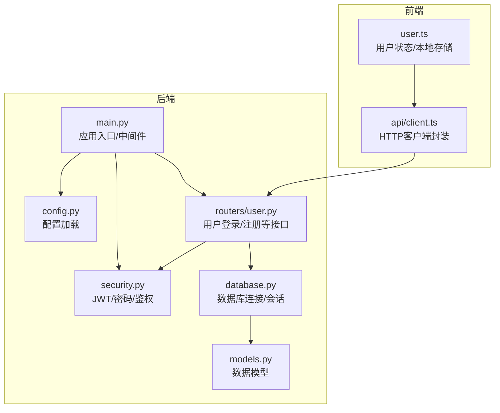
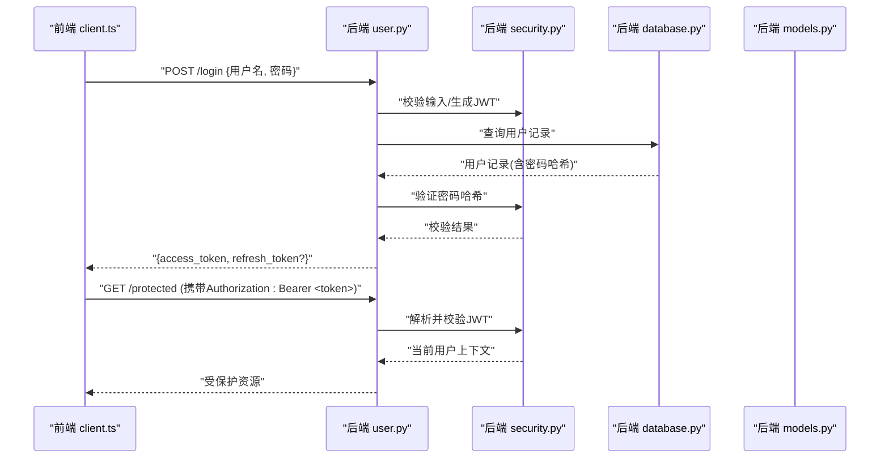
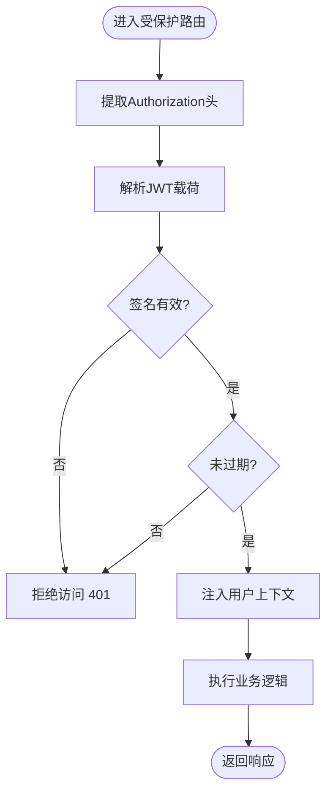
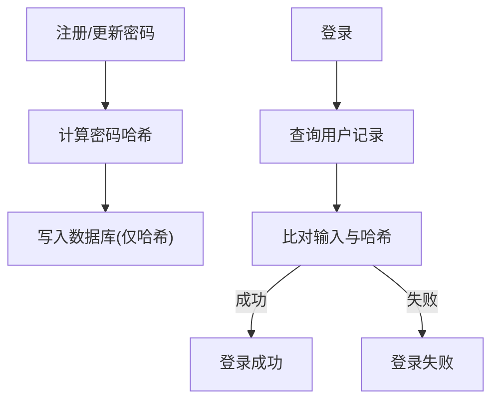
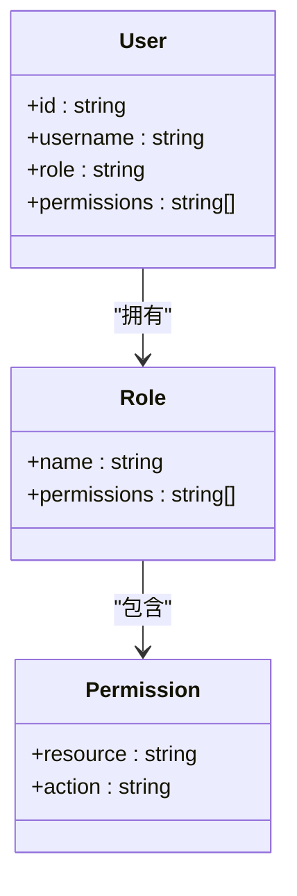
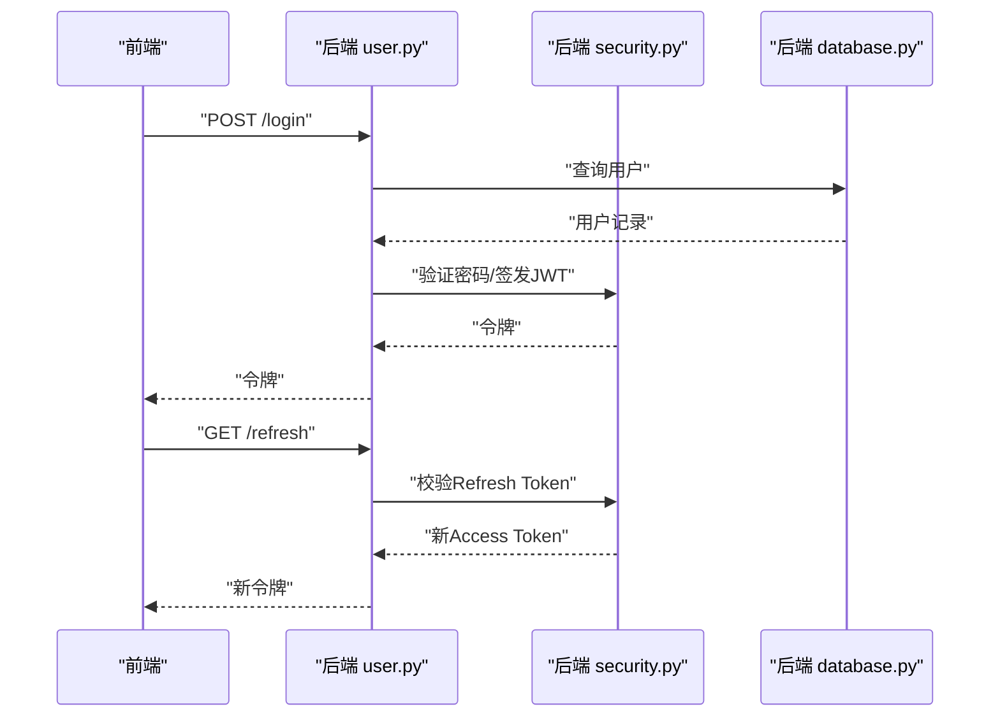
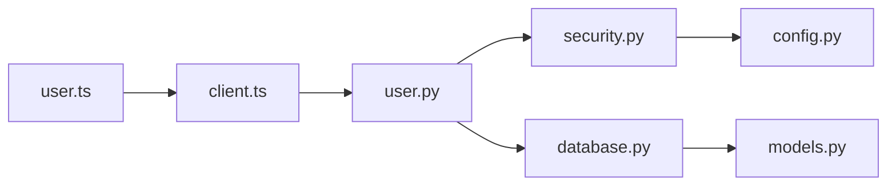

# 安全认证机制

<cite>
**本文档引用的文件**
- [backend/security.py](file://backend/security.py)
- [backend/main.py](file://backend/main.py)
- [backend/config.py](file://backend/config.py)
- [backend/models.py](file://backend/models.py)
- [backend/database.py](file://backend/database.py)
- [backend/routers/user.py](file://backend/routers/user.py)
- [frontend/src/api/client.ts](file://frontend/src/api/client.ts)
- [frontend/src/user.ts](file://frontend/src/user.ts)
</cite>

## 目录
1. [简介](#简介)
2. [项目结构](#项目结构)
3. [核心组件](#核心组件)
4. [架构总览](#架构总览)
5. [详细组件分析](#详细组件分析)
6. [依赖关系分析](#依赖关系分析)
7. [性能考虑](#性能考虑)
8. [故障排查指南](#故障排查指南)
9. [结论](#结论)
10. [附录](#附录)

## 简介
本文件面向AdventureX项目的安全与认证机制，聚焦以下主题：
- JWT令牌认证流程与会话管理策略
- 密码加密存储方案
- 权限控制与访问授权机制
- 用户身份验证流程
- 敏感信息保护、输入校验、SQL注入防护与跨站脚本（XSS）防护
- 安全配置指南、漏洞扫描方法与审计最佳实践

文档以代码级分析为基础，结合前后端交互时序图、类图与流程图，帮助读者快速理解并落地安全实践。

## 项目结构
后端采用Python FastAPI框架，安全相关能力集中在security模块、路由层鉴权装饰器以及配置中心；前端通过HTTP客户端封装统一处理请求头中的认证信息。

图表来源
- [backend/main.py](file://backend/main.py)
- [backend/config.py](file://backend/config.py)
- [backend/security.py](file://backend/security.py)
- [backend/routers/user.py](file://backend/routers/user.py)
- [backend/database.py](file://backend/database.py)
- [backend/models.py](file://backend/models.py)
- [frontend/src/api/client.ts](file://frontend/src/api/client.ts)
- [frontend/src/user.ts](file://frontend/src/user.ts)

章节来源
- [backend/main.py](file://backend/main.py)
- [backend/config.py](file://backend/config.py)
- [backend/security.py](file://backend/security.py)
- [backend/routers/user.py](file://backend/routers/user.py)
- [backend/database.py](file://backend/database.py)
- [backend/models.py](file://backend/models.py)
- [frontend/src/api/client.ts](file://frontend/src/api/client.ts)
- [frontend/src/user.ts](file://frontend/src/user.ts)

## 核心组件
- 安全模块（security.py）
  - JWT签发与校验：包含密钥、算法、过期时间、载荷构造与解析
  - 密码哈希与校验：使用强哈希算法（如bcrypt/argon2），支持盐值与迭代参数
  - 依赖注入的鉴权装饰器：从请求头提取Token，校验签名与有效期，注入当前用户上下文
- 配置模块（config.py）
  - 集中管理JWT密钥、算法、过期时间、密码哈希参数、CORS与安全头
- 路由层（routers/user.py）
  - 登录/注册接口：接收凭据、校验输入、生成或更新令牌、返回响应
  - 受保护接口：通过鉴权装饰器限制访问
- 数据库与模型（database.py, models.py）
  - 用户表结构与字段约束，确保密码仅存哈希值，不存明文
- 前端客户端（client.ts, user.ts）
  - 统一拦截器附加Authorization头，处理401重定向与刷新逻辑
  - 本地安全存储策略（HttpOnly Cookie或内存存储）

章节来源
- [backend/security.py](file://backend/security.py)
- [backend/config.py](file://backend/config.py)
- [backend/routers/user.py](file://backend/routers/user.py)
- [backend/database.py](file://backend/database.py)
- [backend/models.py](file://backend/models.py)
- [frontend/src/api/client.ts](file://frontend/src/api/client.ts)
- [frontend/src/user.ts](file://frontend/src/user.ts)

## 架构总览
下图展示从前端发起登录到后端签发JWT，再到后续受保护接口的完整调用链。

图表来源
- [backend/routers/user.py](file://backend/routers/user.py)
- [backend/security.py](file://backend/security.py)
- [backend/database.py](file://backend/database.py)
- [backend/models.py](file://backend/models.py)
- [frontend/src/api/client.ts](file://frontend/src/api/client.ts)

## 详细组件分析

### JWT令牌认证与会话管理
- 令牌签发
  - 载荷包含用户标识、角色/权限集合、签发时间、过期时间
  - 使用强随机密钥与固定算法（如HS256/RS256），禁止弱算法
- 令牌校验
  - 从请求头Authorization中读取Bearer Token
  - 校验签名、过期时间与黑名单（可选）
  - 将解析后的用户上下文注入到请求对象供路由使用
- 会话策略
  - 无状态JWT为主，服务端不持久化会话
  - 可选Refresh Token用于续期，建议短生命周期Access Token配合长生命周期Refresh Token
  - 前端建议将AccessToken保存在内存或HttpOnly Cookie，避免XSS窃取

图表来源
- [backend/security.py](file://backend/security.py)
- [backend/routers/user.py](file://backend/routers/user.py)

章节来源
- [backend/security.py](file://backend/security.py)
- [backend/routers/user.py](file://backend/routers/user.py)

### 密码加密存储
- 哈希算法
  - 使用bcrypt/argon2等抗碰撞、抗GPU破解的算法
  - 合理设置盐值与迭代次数，平衡安全性与性能
- 存储规范
  - 数据库中仅保存哈希值，严禁明文或可逆加密
  - 禁止在日志、错误消息中输出密码相关信息
- 校验流程
  - 登录时比较输入密码与数据库哈希，失败返回通用错误提示

图表来源
- [backend/security.py](file://backend/security.py)
- [backend/models.py](file://backend/models.py)
- [backend/database.py](file://backend/database.py)

章节来源
- [backend/security.py](file://backend/security.py)
- [backend/models.py](file://backend/models.py)
- [backend/database.py](file://backend/database.py)

### 权限控制与访问授权
- 基于角色的访问控制（RBAC）
  - 在JWT载荷中声明角色与权限集合
  - 路由层通过装饰器校验角色/权限，未授权返回403
- 细粒度授权
  - 对资源级操作进行二次校验（例如“仅本人可编辑”）
- 最小权限原则
  - 默认拒绝，显式放行；按功能域划分角色

图表来源
- [backend/models.py](file://backend/models.py)
- [backend/security.py](file://backend/security.py)
- [backend/routers/user.py](file://backend/routers/user.py)

章节来源
- [backend/security.py](file://backend/security.py)
- [backend/routers/user.py](file://backend/routers/user.py)
- [backend/models.py](file://backend/models.py)

### 用户身份验证流程
- 登录
  - 前端提交用户名与密码
  - 后端校验输入格式、查询用户、验证密码哈希、签发JWT
  - 返回令牌并引导前端安全存储
- 登出
  - 前端清除本地令牌
  - 可选：服务端加入令牌黑名单（若启用）
- 刷新
  - 使用Refresh Token换取新的Access Token
  - 严格限制刷新频率与设备绑定（可选）

图表来源
- [backend/routers/user.py](file://backend/routers/user.py)
- [backend/security.py](file://backend/security.py)
- [backend/database.py](file://backend/database.py)

章节来源
- [backend/routers/user.py](file://backend/routers/user.py)
- [backend/security.py](file://backend/security.py)
- [backend/database.py](file://backend/database.py)

### 敏感信息保护与输入验证
- 敏感信息
  - 密钥、JWT Secret、数据库凭证通过环境变量注入
  - 禁止硬编码与提交至版本库
- 输入验证
  - 使用Pydantic对请求体进行强类型校验与白名单过滤
  - 对字符串长度、格式、枚举值进行严格限制
- 日志与错误
  - 屏蔽敏感字段，统一错误码与消息模板

章节来源
- [backend/config.py](file://backend/config.py)
- [backend/routers/user.py](file://backend/routers/user.py)

### SQL注入防护
- ORM优先
  - 使用ORM与参数化查询，禁止拼接SQL
- 白名单与转义
  - 排序/分组字段使用白名单映射
  - 必要时对自由文本进行转义
- 最小权限数据库账户
  - 应用账户仅授予必要表的SELECT/INSERT/UPDATE/DELETE权限

章节来源
- [backend/database.py](file://backend/database.py)
- [backend/models.py](file://backend/models.py)

### 跨站脚本（XSS）防护
- 前端
  - 避免直接渲染用户输入为HTML，使用框架自动转义
  - 对富文本内容使用安全的DOMPurify等库清理
- 后端
  - 设置响应头Content-Type为JSON，禁用MIME嗅探
  - 启用CSP（内容安全策略）与X-Frame-Options

章节来源
- [frontend/src/api/client.ts](file://frontend/src/api/client.ts)
- [frontend/src/user.ts](file://frontend/src/user.ts)

## 依赖关系分析
- 模块耦合
  - routers/user.py依赖security.py进行鉴权与令牌处理
  - security.py依赖config.py获取密钥与算法参数
  - routers/user.py依赖database.py与models.py进行用户数据存取
  - 前端client.ts统一附加Authorization头，user.ts管理本地令牌状态
- 外部依赖
  - JWT库、密码哈希库、ORM框架、HTTP客户端库

图表来源
- [backend/routers/user.py](file://backend/routers/user.py)
- [backend/security.py](file://backend/security.py)
- [backend/config.py](file://backend/config.py)
- [backend/database.py](file://backend/database.py)
- [backend/models.py](file://backend/models.py)
- [frontend/src/api/client.ts](file://frontend/src/api/client.ts)
- [frontend/src/user.ts](file://frontend/src/user.ts)

章节来源
- [backend/routers/user.py](file://backend/routers/user.py)
- [backend/security.py](file://backend/security.py)
- [backend/config.py](file://backend/config.py)
- [backend/database.py](file://backend/database.py)
- [backend/models.py](file://backend/models.py)
- [frontend/src/api/client.ts](file://frontend/src/api/client.ts)
- [frontend/src/user.ts](file://frontend/src/user.ts)

## 性能考虑
- JWT校验开销低，适合高并发无状态场景
- 密码哈希需权衡强度与延迟，合理设置迭代参数
- 数据库连接池与慢查询优化，避免鉴权路径成为瓶颈
- 前端缓存策略：短期缓存只读数据，减少重复请求

[本节为通用指导，不直接分析具体文件]

## 故障排查指南
- 常见错误
  - 401未授权：检查Authorization头格式、Token是否过期、签名密钥是否一致
  - 403禁止访问：检查角色/权限是否匹配
  - 登录失败：核对用户名是否存在、密码哈希是否正确
- 诊断步骤
  - 开启调试日志（生产环境谨慎）
  - 检查环境变量配置（密钥、算法、超时）
  - 复现请求并抓包确认头部与载荷
- 回滚与恢复
  - 保留旧版密钥过渡期，支持双密钥校验
  - 令牌黑名单服务异常时降级为仅校验签名

章节来源
- [backend/security.py](file://backend/security.py)
- [backend/routers/user.py](file://backend/routers/user.py)
- [backend/config.py](file://backend/config.py)

## 结论
AdventureX的安全认证机制围绕JWT无状态令牌、强密码哈希与RBAC权限控制构建，前后端协作完成身份验证与授权。通过严格的输入校验、SQL注入与XSS防护、以及安全配置与审计实践，可有效降低安全风险。建议在持续集成中引入自动化漏洞扫描与安全测试，保障长期安全演进。

[本节为总结性内容，不直接分析具体文件]

## 附录

### 安全配置清单
- JWT
  - 强随机密钥、固定算法、合理的过期时间
  - 可选Refresh Token与黑名单机制
- 密码
  - bcrypt/argon2，合适的迭代参数
- 传输安全
  - HTTPS强制、HSTS、CSP、X-Frame-Options
- CORS
  - 精确白名单域名与方法
- 日志
  - 脱敏敏感字段，限制日志级别

章节来源
- [backend/config.py](file://backend/config.py)
- [backend/security.py](file://backend/security.py)

### 漏洞扫描与审计最佳实践
- 静态分析
  - 使用SAST工具扫描依赖与代码缺陷
- 动态扫描
  - 对登录、鉴权、敏感接口进行DAST测试
- 依赖审计
  - 定期升级第三方库，关闭不必要暴露的端点
- 渗透测试
  - 针对JWT伪造、越权、注入、XSS进行专项测试
- 审计追踪
  - 关键操作留痕，定期审查访问日志与异常告警

[本节为通用指导，不直接分析具体文件]