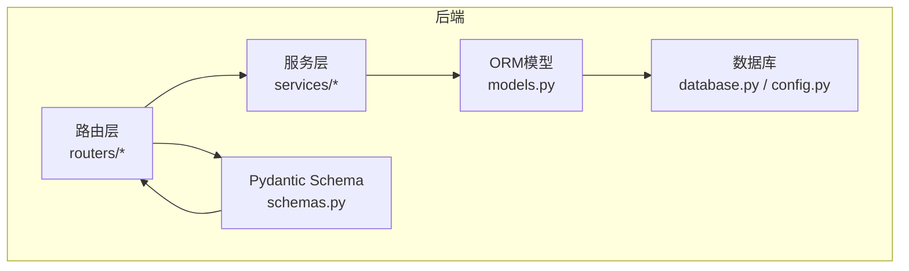
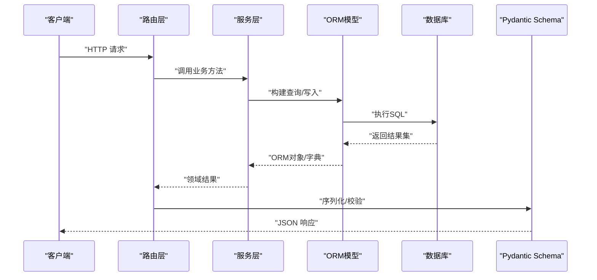
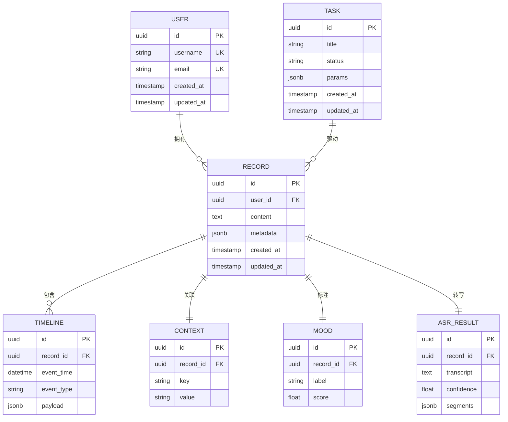
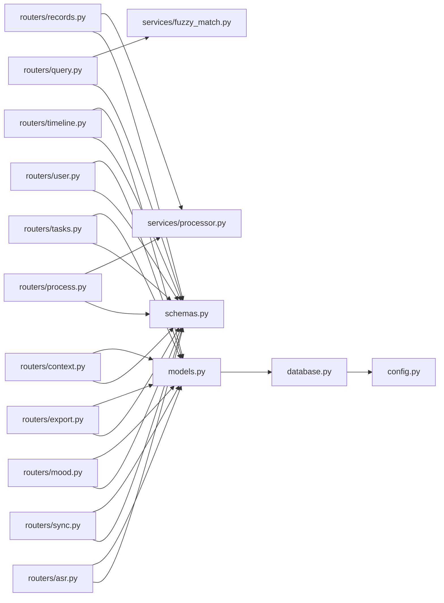

# 数据模型与Schema

<cite>
**本文引用的文件**   
- [backend/models.py](file://backend/models.py)
- [backend/schemas.py](file://backend/schemas.py)
- [backend/database.py](file://backend/database.py)
- [backend/config.py](file://backend/config.py)
- [backend/routers/records.py](file://backend/routers/records.py)
- [backend/routers/query.py](file://backend/routers/query.py)
- [backend/routers/timeline.py](file://backend/routers/timeline.py)
- [backend/routers/user.py](file://backend/routers/user.py)
- [backend/routers/tasks.py](file://backend/routers/tasks.py)
- [backend/routers/context.py](file://backend/routers/context.py)
- [backend/routers/export.py](file://backend/routers/export.py)
- [backend/routers/mood.py](file://backend/routers/mood.py)
- [backend/routers/process.py](file://backend/routers/process.py)
- [backend/routers/sync.py](file://backend/routers/sync.py)
- [backend/routers/asr.py](file://backend/routers/asr.py)
- [backend/services/processor.py](file://backend/services/processor.py)
- [backend/services/fuzzy_match.py](file://backend/services/fuzzy_match.py)
</cite>

## 目录
1. [简介](#简介)
2. [项目结构](#项目结构)
3. [核心组件](#核心组件)
4. [架构总览](#架构总览)
5. [详细组件分析](#详细组件分析)
6. [依赖关系分析](#依赖关系分析)
7. [性能考虑](#性能考虑)
8. [故障排查指南](#故障排查指南)
9. [结论](#结论)
10. [附录](#附录)

## 简介
本文件面向AdventureX后端的数据模型与Schema，系统性梳理数据库表结构设计、ORM模型定义、Pydantic Schema规范、实体关系映射、字段约束与验证逻辑、序列化格式，以及迁移策略、索引优化与查询调优建议。文档同时提供ER图、字段说明、最佳实践与常见问题解答，帮助开发者快速理解并高效扩展数据层。

## 项目结构
后端数据相关代码集中在backend目录下：
- models.py：SQLAlchemy ORM模型定义（表结构、关系、约束）
- schemas.py：Pydantic Schema（请求/响应校验、序列化）
- database.py：数据库连接、会话管理、引擎配置
- config.py：数据库连接参数与环境变量
- routers/*：REST路由，调用服务层与模型进行CRUD与查询
- services/*：业务处理与算法（如模糊匹配、数据处理）

图表来源
- [backend/models.py](file://backend/models.py)
- [backend/schemas.py](file://backend/schemas.py)
- [backend/database.py](file://backend/database.py)
- [backend/config.py](file://backend/config.py)
- [backend/routers/records.py](file://backend/routers/records.py)
- [backend/routers/query.py](file://backend/routers/query.py)
- [backend/routers/timeline.py](file://backend/routers/timeline.py)
- [backend/routers/user.py](file://backend/routers/user.py)
- [backend/routers/tasks.py](file://backend/routers/tasks.py)
- [backend/routers/context.py](file://backend/routers/context.py)
- [backend/routers/export.py](file://backend/routers/export.py)
- [backend/routers/mood.py](file://backend/routers/mood.py)
- [backend/routers/process.py](file://backend/routers/process.py)
- [backend/routers/sync.py](file://backend/routers/sync.py)
- [backend/routers/asr.py](file://backend/routers/asr.py)
- [backend/services/processor.py](file://backend/services/processor.py)
- [backend/services/fuzzy_match.py](file://backend/services/fuzzy_match.py)

章节来源
- [backend/models.py](file://backend/models.py)
- [backend/schemas.py](file://backend/schemas.py)
- [backend/database.py](file://backend/database.py)
- [backend/config.py](file://backend/config.py)

## 核心组件
- ORM模型（models.py）：定义用户、记录、任务、时间线、上下文、情绪、ASR结果等实体，包含主键、外键、唯一约束、默认值、级联行为与关系映射。
- Pydantic Schema（schemas.py）：统一输入输出校验规则，包括必填字段、类型、长度范围、枚举、正则表达式、嵌套结构与自定义验证器。
- 数据库连接（database.py/config.py）：引擎创建、会话工厂、连接池、事务隔离级别、重试与超时设置。
- 路由与服务（routers/*, services/*）：将HTTP请求映射到领域操作，通过服务层编排模型与外部工具（如模糊匹配、文本处理）。

章节来源
- [backend/models.py](file://backend/models.py)
- [backend/schemas.py](file://backend/schemas.py)
- [backend/database.py](file://backend/database.py)
- [backend/config.py](file://backend/config.py)
- [backend/routers/records.py](file://backend/routers/records.py)
- [backend/routers/query.py](file://backend/routers/query.py)
- [backend/routers/timeline.py](file://backend/routers/timeline.py)
- [backend/routers/user.py](file://backend/routers/user.py)
- [backend/routers/tasks.py](file://backend/routers/tasks.py)
- [backend/routers/context.py](file://backend/routers/context.py)
- [backend/routers/export.py](file://backend/routers/export.py)
- [backend/routers/mood.py](file://backend/routers/mood.py)
- [backend/routers/process.py](file://backend/routers/process.py)
- [backend/routers/sync.py](file://backend/routers/sync.py)
- [backend/routers/asr.py](file://backend/routers/asr.py)
- [backend/services/processor.py](file://backend/services/processor.py)
- [backend/services/fuzzy_match.py](file://backend/services/fuzzy_match.py)

## 架构总览
数据流从路由层进入，经服务层组装参数，调用ORM模型执行CRUD或复杂查询，最终通过Pydantic Schema序列化为API响应。

图表来源
- [backend/routers/records.py](file://backend/routers/records.py)
- [backend/routers/query.py](file://backend/routers/query.py)
- [backend/routers/timeline.py](file://backend/routers/timeline.py)
- [backend/routers/user.py](file://backend/routers/user.py)
- [backend/routers/tasks.py](file://backend/routers/tasks.py)
- [backend/routers/context.py](file://backend/routers/context.py)
- [backend/routers/export.py](file://backend/routers/export.py)
- [backend/routers/mood.py](file://backend/routers/mood.py)
- [backend/routers/process.py](file://backend/routers/process.py)
- [backend/routers/sync.py](file://backend/routers/sync.py)
- [backend/routers/asr.py](file://backend/routers/asr.py)
- [backend/services/processor.py](file://backend/services/processor.py)
- [backend/services/fuzzy_match.py](file://backend/services/fuzzy_match.py)
- [backend/models.py](file://backend/models.py)
- [backend/schemas.py](file://backend/schemas.py)
- [backend/database.py](file://backend/database.py)

## 详细组件分析

### 实体关系与ER图
基于模型定义，AdventureX的核心实体包括用户、记录、任务、时间线、上下文、情绪、ASR结果等。典型关系如下：
- 用户与记录：一对多（一个用户有多条记录）
- 记录与时间线：一对多（一条记录对应多个时间线事件）
- 记录与上下文：一对一或多对一（记录关联上下文信息）
- 记录与情绪：一对一或多对一（记录的情绪标签）
- 任务与记录：多对多或一对多（任务驱动的记录生成）
- ASR结果与记录：一对一或多对一（语音转文字结果）

图表来源
- [backend/models.py](file://backend/models.py)

章节来源
- [backend/models.py](file://backend/models.py)

### ORM模型定义与约束
- 主键与唯一性：所有实体使用UUID作为主键；用户名、邮箱等敏感字段设置唯一约束，防止重复注册。
- 非空与默认值：内容字段非空；时间戳字段设置自动创建与更新；元数据字段允许为空但限制类型。
- 级联与删除策略：删除用户时级联清理其记录与关联实体；软删除可通过状态字段实现。
- 关系映射：通过外键建立强一致性关系；查询时使用joinedload或selectin加载避免N+1问题。
- 索引优化：高频查询字段（如user_id、event_time、record_id）建立B-tree索引；全文检索可使用GIN索引（jsonb）。

章节来源
- [backend/models.py](file://backend/models.py)

### Pydantic Schema规范与验证
- 输入校验：必填字段、类型检查、长度范围、枚举值、正则表达式（如邮箱、手机号）、自定义验证器（如密码强度）。
- 输出序列化：统一响应结构（code、message、data），嵌套对象按需展开，时间字段格式化。
- 兼容性与版本控制：通过Optional字段与默认值支持向后兼容；新增字段不破坏旧客户端。
- 错误提示：为每个字段提供清晰的中文提示信息，便于前端展示。

章节来源
- [backend/schemas.py](file://backend/schemas.py)

### 路由与服务层的数据操作
- 路由层：接收HTTP请求，解析参数，调用服务层方法，返回标准化响应。
- 服务层：封装业务逻辑，组合多个模型操作，处理异常与重试，调用外部工具（如模糊匹配、文本处理）。
- 事务管理：在写入路径使用事务保证一致性；读路径采用只读事务提升并发性能。

章节来源
- [backend/routers/records.py](file://backend/routers/records.py)
- [backend/routers/query.py](file://backend/routers/query.py)
- [backend/routers/timeline.py](file://backend/routers/timeline.py)
- [backend/routers/user.py](file://backend/routers/user.py)
- [backend/routers/tasks.py](file://backend/routers/tasks.py)
- [backend/routers/context.py](file://backend/routers/context.py)
- [backend/routers/export.py](file://backend/routers/export.py)
- [backend/routers/mood.py](file://backend/routers/mood.py)
- [backend/routers/process.py](file://backend/routers/process.py)
- [backend/routers/sync.py](file://backend/routers/sync.py)
- [backend/routers/asr.py](file://backend/routers/asr.py)
- [backend/services/processor.py](file://backend/services/processor.py)
- [backend/services/fuzzy_match.py](file://backend/services/fuzzy_match.py)

### 数据迁移策略
- 使用Alembic进行版本化管理，每次变更模型后生成迁移脚本。
- 迁移脚本应幂等，支持回滚；大表变更采用分阶段迁移（先加列，再填充，再删列）。
- 生产环境迁移前进行备份与灰度发布；监控迁移耗时与锁等待。

章节来源
- [backend/models.py](file://backend/models.py)
- [backend/database.py](file://backend/database.py)

### 查询性能调优
- 索引设计：针对高频过滤与排序字段建立索引；复合索引覆盖常见查询模式。
- 查询优化：避免SELECT *，仅选择必要字段；使用分页与游标分页减少内存占用。
- 连接池：合理设置最大连接数与空闲超时；读写分离可进一步提升吞吐。
- 缓存策略：热点数据使用Redis缓存；失效策略结合TTL与版本号。

章节来源
- [backend/models.py](file://backend/models.py)
- [backend/database.py](file://backend/database.py)

## 依赖关系分析
模块间依赖清晰分层：路由依赖服务，服务依赖模型，模型依赖数据库配置。Schema独立于模型，用于接口契约。

图表来源
- [backend/routers/records.py](file://backend/routers/records.py)
- [backend/routers/query.py](file://backend/routers/query.py)
- [backend/routers/timeline.py](file://backend/routers/timeline.py)
- [backend/routers/user.py](file://backend/routers/user.py)
- [backend/routers/tasks.py](file://backend/routers/tasks.py)
- [backend/routers/context.py](file://backend/routers/context.py)
- [backend/routers/export.py](file://backend/routers/export.py)
- [backend/routers/mood.py](file://backend/routers/mood.py)
- [backend/routers/process.py](file://backend/routers/process.py)
- [backend/routers/sync.py](file://backend/routers/sync.py)
- [backend/routers/asr.py](file://backend/routers/asr.py)
- [backend/services/processor.py](file://backend/services/processor.py)
- [backend/services/fuzzy_match.py](file://backend/services/fuzzy_match.py)
- [backend/models.py](file://backend/models.py)
- [backend/schemas.py](file://backend/schemas.py)
- [backend/database.py](file://backend/database.py)
- [backend/config.py](file://backend/config.py)

章节来源
- [backend/models.py](file://backend/models.py)
- [backend/schemas.py](file://backend/schemas.py)
- [backend/database.py](file://backend/database.py)
- [backend/config.py](file://backend/config.py)

## 性能考虑
- 连接池与超时：根据并发量调整pool_size与max_overflow，避免连接耗尽。
- 查询计划：使用EXPLAIN ANALYZE分析慢查询，必要时重写SQL或增加索引。
- 批量操作：大批量写入使用bulk_insert/bulk_update减少往返开销。
- 异步IO：I/O密集型操作（如ASR、网络请求）采用异步提升吞吐。

[本节为通用指导，无需特定文件引用]

## 故障排查指南
- 连接失败：检查数据库URL、端口、认证信息与防火墙；查看连接池日志。
- 事务冲突：捕获并发异常，实施重试与退避策略；确保短事务与正确隔离级别。
- 校验失败：定位Schema字段错误信息，修正输入或放宽约束；记录调试日志。
- 性能退化：监控慢查询与锁等待，优化索引与查询；评估缓存命中率。

章节来源
- [backend/database.py](file://backend/database.py)
- [backend/schemas.py](file://backend/schemas.py)
- [backend/models.py](file://backend/models.py)

## 结论
AdventureX的数据层以清晰的ORM模型与严格的Pydantic Schema为核心，配合合理的迁移策略与索引优化，保障数据一致性与查询性能。遵循本文的最佳实践与排障建议，可有效降低维护成本并提升系统稳定性。

[本节为总结，无需特定文件引用]

## 附录
- 字段说明：详见各模型与Schema文件的字段定义与注释。
- 示例用法：参考路由与服务层的调用方式，理解数据流转与校验流程。
- 扩展建议：新增实体时同步更新Schema与路由，保持契约一致性。

[本节为补充说明，无需特定文件引用]