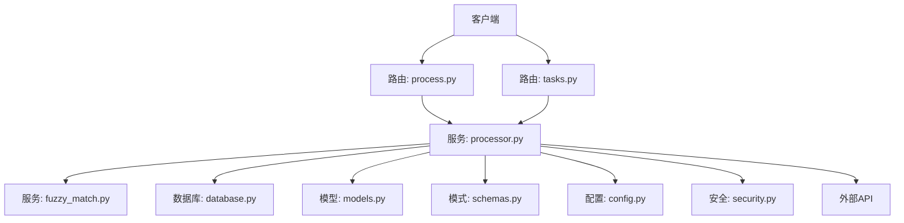
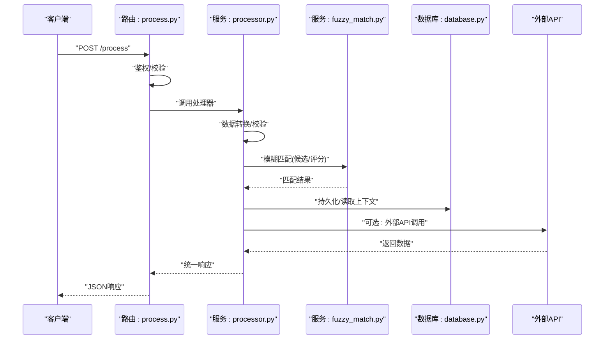
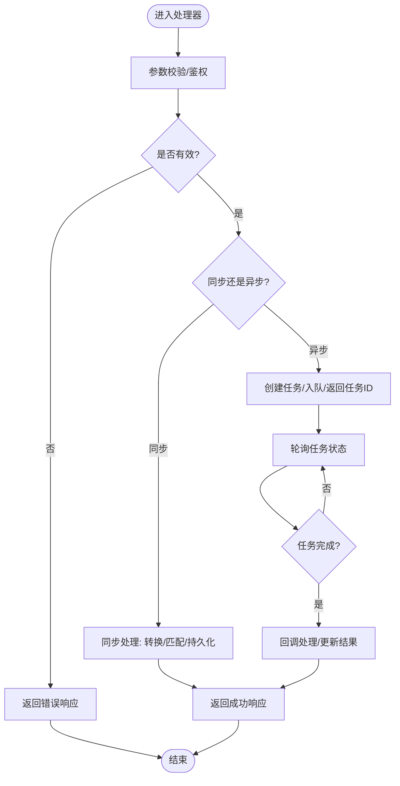
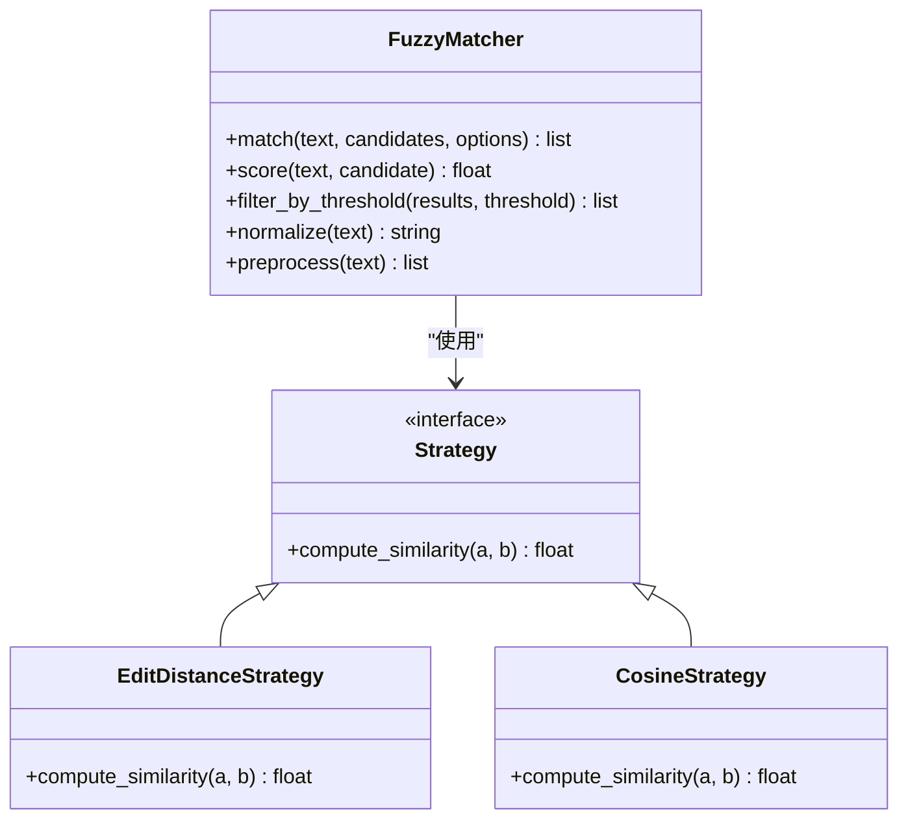
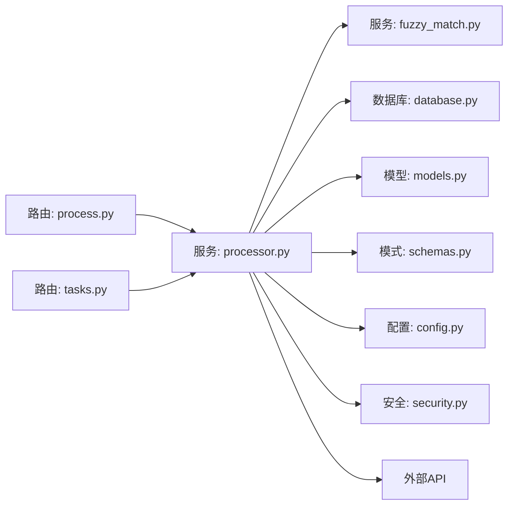

# 服务层实现

<cite>
**本文引用的文件**   
- [backend/services/processor.py](file://backend/services/processor.py)
- [backend/services/fuzzy_match.py](file://backend/services/fuzzy_match.py)
- [backend/routers/process.py](file://backend/routers/process.py)
- [backend/routers/tasks.py](file://backend/routers/tasks.py)
- [backend/config.py](file://backend/config.py)
- [backend/database.py](file://backend/database.py)
- [backend/models.py](file://backend/models.py)
- [backend/schemas.py](file://backend/schemas.py)
- [backend/security.py](file://backend/security.py)
- [backend/main.py](file://backend/main.py)
</cite>

## 目录
1. [简介](#简介)
2. [项目结构](#项目结构)
3. [核心组件](#核心组件)
4. [架构总览](#架构总览)
5. [详细组件分析](#详细组件分析)
6. [依赖关系分析](#依赖关系分析)
7. [性能考量](#性能考量)
8. [故障排查指南](#故障排查指南)
9. [结论](#结论)
10. [附录](#附录)

## 简介
本文件面向AdventureX后端服务层的实现，聚焦业务逻辑层（处理器服务）与模糊匹配模块的设计与使用。文档围绕以下目标展开：
- 处理器服务的核心功能、职责边界与调用链
- 模糊匹配算法的实现原理与参数调优
- 服务间通信机制（HTTP/异步任务）
- 异步任务处理、数据转换、外部API封装与错误重试策略
- 单元测试策略、性能监控与调试技巧
- 常见使用场景与最佳实践

## 项目结构
后端采用分层架构：路由层负责请求解析与响应组装；服务层承载业务逻辑；数据访问通过数据库模块与模型定义；配置与安全由独立模块提供。关键路径如下：
- 路由层：process.py、tasks.py等
- 服务层：processor.py、fuzzy_match.py
- 数据层：database.py、models.py、schemas.py
- 配置与安全：config.py、security.py
- 应用入口：main.py

图表来源
- [backend/main.py](file://backend/main.py)
- [backend/routers/process.py](file://backend/routers/process.py)
- [backend/routers/tasks.py](file://backend/routers/tasks.py)
- [backend/services/processor.py](file://backend/services/processor.py)
- [backend/services/fuzzy_match.py](file://backend/services/fuzzy_match.py)
- [backend/database.py](file://backend/database.py)
- [backend/models.py](file://backend/models.py)
- [backend/schemas.py](file://backend/schemas.py)
- [backend/config.py](file://backend/config.py)
- [backend/security.py](file://backend/security.py)

章节来源
- [backend/main.py](file://backend/main.py)
- [backend/routers/process.py](file://backend/routers/process.py)
- [backend/routers/tasks.py](file://backend/routers/tasks.py)
- [backend/services/processor.py](file://backend/services/processor.py)
- [backend/services/fuzzy_match.py](file://backend/services/fuzzy_match.py)
- [backend/database.py](file://backend/database.py)
- [backend/models.py](file://backend/models.py)
- [backend/schemas.py](file://backend/schemas.py)
- [backend/config.py](file://backend/config.py)
- [backend/security.py](file://backend/security.py)

## 核心组件
- 处理器服务（processor.py）
  - 聚合业务编排：接收路由层输入，进行数据校验、转换、调用模糊匹配、持久化结果、返回标准化响应
  - 协调外部API调用与重试策略
  - 管理异步任务生命周期（创建、调度、状态查询、结果回调）
- 模糊匹配服务（fuzzy_match.py）
  - 提供文本相似度计算、候选集生成、阈值过滤与排序
  - 支持可插拔的匹配策略与权重配置
- 路由层（process.py、tasks.py）
  - 暴露REST接口：数据处理、任务提交与查询
  - 鉴权与限流（结合security.py）
- 数据层（database.py、models.py、schemas.py）
  - 连接池、事务、ORM映射、请求/响应模式校验
- 配置与安全（config.py、security.py）
  - 环境变量加载、密钥管理、认证与授权中间件

章节来源
- [backend/services/processor.py](file://backend/services/processor.py)
- [backend/services/fuzzy_match.py](file://backend/services/fuzzy_match.py)
- [backend/routers/process.py](file://backend/routers/process.py)
- [backend/routers/tasks.py](file://backend/routers/tasks.py)
- [backend/database.py](file://backend/database.py)
- [backend/models.py](file://backend/models.py)
- [backend/schemas.py](file://backend/schemas.py)
- [backend/config.py](file://backend/config.py)
- [backend/security.py](file://backend/security.py)

## 架构总览
处理器服务作为业务中枢，将路由请求转化为领域操作，并通过模糊匹配与数据访问完成核心流程。异步任务用于耗时操作（如批量处理、外部API拉取），通过任务队列或后台进程执行，避免阻塞主线程。

图表来源
- [backend/routers/process.py](file://backend/routers/process.py)
- [backend/services/processor.py](file://backend/services/processor.py)
- [backend/services/fuzzy_match.py](file://backend/services/fuzzy_match.py)
- [backend/database.py](file://backend/database.py)

章节来源
- [backend/routers/process.py](file://backend/routers/process.py)
- [backend/services/processor.py](file://backend/services/processor.py)
- [backend/services/fuzzy_match.py](file://backend/services/fuzzy_match.py)
- [backend/database.py](file://backend/database.py)

## 详细组件分析

### 处理器服务（processor.py）
- 职责
  - 输入校验与标准化（基于schemas.py）
  - 业务编排：调用模糊匹配、数据转换、外部API、数据库读写
  - 错误处理与重试：对不稳定外部API实施指数退避重试
  - 异步任务：创建任务、轮询状态、触发回调
- 关键流程
  - 请求进入后先做参数校验与权限检查
  - 根据请求类型选择同步或异步处理路径
  - 同步路径直接返回结果；异步路径返回任务ID并后台执行
- 重试策略
  - 针对网络抖动与临时失败，采用指数退避+最大重试次数
  - 区分可重试与不可重试错误，避免无效重试
- 数据转换
  - 将外部API响应转换为内部领域模型，确保一致性
  - 字段映射、单位换算、时间格式统一

图表来源
- [backend/services/processor.py](file://backend/services/processor.py)
- [backend/routers/tasks.py](file://backend/routers/tasks.py)

章节来源
- [backend/services/processor.py](file://backend/services/processor.py)
- [backend/routers/tasks.py](file://backend/routers/tasks.py)

### 模糊匹配服务（fuzzy_match.py）
- 能力
  - 文本相似度计算（编辑距离、余弦相似度、Jaccard等）
  - 候选集生成与去重
  - 阈值过滤与排序（按分数降序）
  - 可配置权重（词频、位置、语义权重）
- 算法要点
  - 预处理：分词、停用词过滤、归一化
  - 特征提取：TF-IDF/向量表示
  - 相似度打分与阈值判定
  - 结果合并与冲突消解
- 扩展性
  - 策略接口抽象，便于替换或组合不同算法
  - 缓存热点匹配结果，降低重复计算

图表来源
- [backend/services/fuzzy_match.py](file://backend/services/fuzzy_match.py)

章节来源
- [backend/services/fuzzy_match.py](file://backend/services/fuzzy_match.py)

### 路由层（process.py、tasks.py）
- process.py
  - 暴露数据处理接口，调用处理器服务
  - 统一错误码与消息格式
- tasks.py
  - 暴露任务相关接口：创建、查询、取消
  - 与处理器服务协作，维护任务状态机

章节来源
- [backend/routers/process.py](file://backend/routers/process.py)
- [backend/routers/tasks.py](file://backend/routers/tasks.py)

### 数据层（database.py、models.py、schemas.py）
- database.py
  - 连接池管理、会话生命周期、事务控制
- models.py
  - ORM模型定义，约束与索引
- schemas.py
  - Pydantic模式，用于请求/响应校验与序列化

章节来源
- [backend/database.py](file://backend/database.py)
- [backend/models.py](file://backend/models.py)
- [backend/schemas.py](file://backend/schemas.py)

### 配置与安全（config.py、security.py）
- config.py
  - 环境变量加载、默认值、敏感信息保护
- security.py
  - JWT/Token鉴权、权限校验、速率限制

章节来源
- [backend/config.py](file://backend/config.py)
- [backend/security.py](file://backend/security.py)

## 依赖关系分析
处理器服务依赖模糊匹配、数据库、配置与安全模块；路由层依赖处理器服务；外部API为可选依赖。

图表来源
- [backend/routers/process.py](file://backend/routers/process.py)
- [backend/routers/tasks.py](file://backend/routers/tasks.py)
- [backend/services/processor.py](file://backend/services/processor.py)
- [backend/services/fuzzy_match.py](file://backend/services/fuzzy_match.py)
- [backend/database.py](file://backend/database.py)
- [backend/models.py](file://backend/models.py)
- [backend/schemas.py](file://backend/schemas.py)
- [backend/config.py](file://backend/config.py)
- [backend/security.py](file://backend/security.py)

章节来源
- [backend/routers/process.py](file://backend/routers/process.py)
- [backend/routers/tasks.py](file://backend/routers/tasks.py)
- [backend/services/processor.py](file://backend/services/processor.py)
- [backend/services/fuzzy_match.py](file://backend/services/fuzzy_match.py)
- [backend/database.py](file://backend/database.py)
- [backend/models.py](file://backend/models.py)
- [backend/schemas.py](file://backend/schemas.py)
- [backend/config.py](file://backend/config.py)
- [backend/security.py](file://backend/security.py)

## 性能考量
- 模糊匹配优化
  - 预计算与缓存：对高频文本建立索引与缓存
  - 阈值裁剪：在早期阶段过滤低相似度候选
  - 并行计算：对大规模候选集使用并发策略
- 异步任务
  - 使用队列削峰填谷，避免请求阻塞
  - 任务拆分与批处理，提高吞吐
- I/O与重试
  - 外部API调用设置超时与重试上限
  - 连接池复用，减少握手开销
- 监控与指标
  - 记录关键路径耗时、错误率、队列长度
  - 采样日志，避免过度输出

[本节为通用指导，不直接分析具体文件]

## 故障排查指南
- 常见问题定位
  - 参数校验失败：检查schemas定义与前端传参
  - 模糊匹配无结果：调整阈值、检查预处理与分词
  - 外部API失败：查看重试策略与超时配置
  - 任务卡住：检查队列消费与回调逻辑
- 调试技巧
  - 启用详细日志，记录关键步骤输入输出
  - 使用慢查询分析与性能剖析工具
  - 隔离问题：最小复现用例与Mock外部依赖
- 错误分类
  - 可重试错误：网络抖动、限流、临时资源不足
  - 不可重试错误：参数错误、权限不足、数据不一致

章节来源
- [backend/services/processor.py](file://backend/services/processor.py)
- [backend/services/fuzzy_match.py](file://backend/services/fuzzy_match.py)
- [backend/routers/process.py](file://backend/routers/process.py)
- [backend/routers/tasks.py](file://backend/routers/tasks.py)

## 结论
处理器服务与模糊匹配服务构成了AdventureX后端的核心业务层。通过清晰的职责划分、稳健的重试与异步机制、以及可扩展的匹配策略，系统能够高效处理复杂的数据处理需求。建议在生产环境中加强监控与测试覆盖，持续优化匹配算法与I/O性能。

[本节为总结，不直接分析具体文件]

## 附录
- 单元测试策略
  - 处理器服务：Mock外部API与数据库，验证编排逻辑与错误分支
  - 模糊匹配：单元测试各策略的正确性与边界条件
  - 路由层：集成测试端到端流程，校验鉴权与响应格式
- 性能监控
  - 关键指标：QPS、延迟分布、错误率、队列积压
  - 追踪链路：跨服务调用链路与耗时分解
- 最佳实践
  - 明确输入输出契约，严格模式校验
  - 幂等设计：对外部API与任务处理保证幂等
  - 渐进式发布：灰度与回滚策略

[本节为通用指导，不直接分析具体文件]