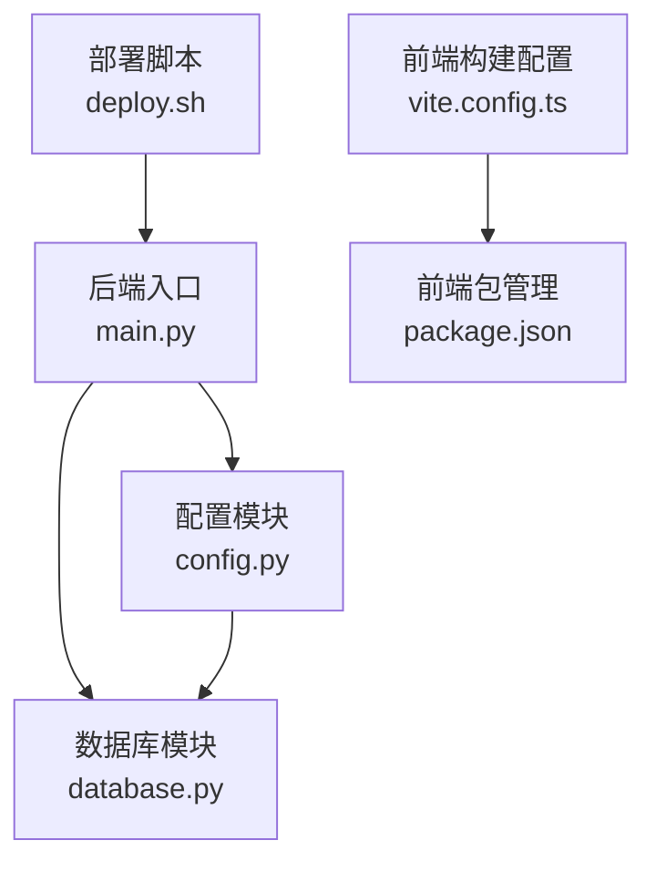
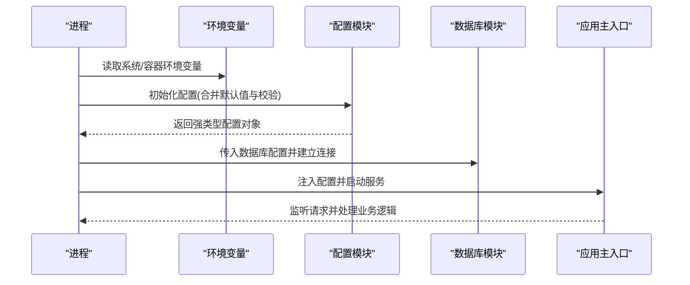
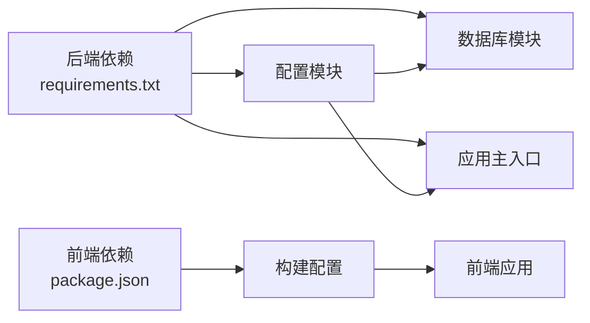

# 配置管理

<cite>
**本文引用的文件**   
- [backend/config.py](file://backend/config.py)
- [backend/database.py](file://backend/database.py)
- [backend/main.py](file://backend/main.py)
- [backend/requirements.txt](file://backend/requirements.txt)
- [frontend/package.json](file://frontend/package.json)
- [frontend/vite.config.ts](file://frontend/vite.config.ts)
- [deploy.sh](file://deploy.sh)
</cite>

## 目录
1. [简介](#简介)
2. [项目结构](#项目结构)
3. [核心组件](#核心组件)
4. [架构总览](#架构总览)
5. [详细组件分析](#详细组件分析)
6. [依赖分析](#依赖分析)
7. [性能考虑](#性能考虑)
8. [故障排查指南](#故障排查指南)
9. [结论](#结论)
10. [附录](#附录)

## 简介
本文件面向AdventureX项目的配置管理，系统性说明环境变量、配置文件与运行时参数的组织方式与使用规范。重点覆盖数据库连接、第三方服务API密钥、缓存与日志级别等关键配置项；给出开发、测试、生产环境的差异与最佳实践；并提供配置模板、校验规则与热重载机制的实现建议，帮助团队在本地与线上稳定运行。

## 项目结构
后端采用Python（FastAPI）实现，前端基于Vite+TypeScript。配置相关的关键位置如下：
- 后端配置入口：backend/config.py
- 数据库连接与初始化：backend/database.py
- 应用启动与中间件装配：backend/main.py
- 依赖声明：backend/requirements.txt
- 前端构建与运行时变量：frontend/package.json、frontend/vite.config.ts
- 部署脚本：deploy.sh

图表来源
- [backend/main.py](file://backend/main.py)
- [backend/config.py](file://backend/config.py)
- [backend/database.py](file://backend/database.py)
- [deploy.sh](file://deploy.sh)
- [frontend/vite.config.ts](file://frontend/vite.config.ts)
- [frontend/package.json](file://frontend/package.json)

章节来源
- [backend/config.py](file://backend/config.py)
- [backend/database.py](file://backend/database.py)
- [backend/main.py](file://backend/main.py)
- [backend/requirements.txt](file://backend/requirements.txt)
- [frontend/package.json](file://frontend/package.json)
- [frontend/vite.config.ts](file://frontend/vite.config.ts)
- [deploy.sh](file://deploy.sh)

## 核心组件
- 配置加载器：集中读取环境变量与可选配置文件，提供类型化访问接口，支持默认值与校验。
- 数据库连接器：根据配置建立连接池、执行健康检查与迁移钩子。
- 应用启动器：组装路由、中间件、日志与监控，注入配置实例。
- 前端构建变量：通过构建期常量注入到前端代码，避免泄露敏感信息。
- 部署脚本：统一设置环境变量、拉取依赖、启动服务。

章节来源
- [backend/config.py](file://backend/config.py)
- [backend/database.py](file://backend/database.py)
- [backend/main.py](file://backend/main.py)
- [frontend/vite.config.ts](file://frontend/vite.config.ts)
- [frontend/package.json](file://frontend/package.json)
- [deploy.sh](file://deploy.sh)

## 架构总览
下图展示配置在应用生命周期中的流转：启动时由配置模块加载环境变量与配置项，随后被数据库模块与应用主入口消费，最终影响日志、缓存、外部API调用等行为。

图表来源
- [backend/config.py](file://backend/config.py)
- [backend/database.py](file://backend/database.py)
- [backend/main.py](file://backend/main.py)

## 详细组件分析

### 配置模块（环境变量与配置项）
- 职责
  - 统一读取环境变量，提供命名空间与类型转换。
  - 提供默认值、必填校验、范围校验与格式校验。
  - 暴露只读配置视图，避免运行时篡改。
- 典型配置项
  - 应用基础：环境标识、调试开关、端口、主机、CORS白名单。
  - 数据库：连接URL、池大小、超时、SSL模式。
  - 第三方服务：API密钥、端点、重试策略、超时。
  - 缓存：后端类型、TTL、最大条目数、键前缀。
  - 日志：级别、输出目标、采样率、结构化字段。
- 校验与错误
  - 缺失必填项抛出明确异常，附带修复建议。
  - 非法值进行边界检查并给出可解释的错误消息。
- 热重载
  - 支持监听配置文件变更或环境变量变化，触发局部重装载（如日志级别、缓存TTL）。
  - 对需要重启的变更（如数据库连接参数）给出提示与优雅重启流程。

章节来源
- [backend/config.py](file://backend/config.py)

### 数据库连接配置
- 职责
  - 解析数据库连接字符串与连接池参数。
  - 提供连接健康检查与自动重连策略。
  - 在应用启动时执行必要的迁移或验证。
- 关键参数
  - 连接URL、用户名/密码、主机/端口、数据库名。
  - 连接池大小、最小/最大空闲连接、获取/释放超时。
  - SSL/TLS模式、查询超时、事务隔离级别。
- 错误处理
  - 连接失败时快速失败并记录诊断信息。
  - 网络抖动时的指数退避重试。

章节来源
- [backend/database.py](file://backend/database.py)

### 应用启动与中间件装配
- 职责
  - 加载配置、注册路由、挂载中间件（认证、限流、CORS、日志）。
  - 初始化日志、指标采集与健康检查端点。
  - 对外暴露统一的启动命令与优雅关闭。
- 运行时参数
  - 可通过命令行或环境变量覆盖部分配置（如端口、日志级别）。
  - 支持多进程/线程模式的并发参数。

章节来源
- [backend/main.py](file://backend/main.py)

### 前端构建期配置
- 职责
  - 将构建期常量注入到前端代码，避免硬编码。
  - 区分开发与生产构建产物，控制调试信息与API基地址。
- 关键要点
  - 仅暴露非敏感变量，敏感信息留在服务端。
  - 通过构建工具的环境变量映射，确保不同环境产物正确。

章节来源
- [frontend/vite.config.ts](file://frontend/vite.config.ts)
- [frontend/package.json](file://frontend/package.json)

### 部署脚本与环境准备
- 职责
  - 统一设置环境变量、安装依赖、构建前端、启动后端。
  - 提供健康检查与回滚策略。
- 关键点
  - 所有敏感配置通过环境变量注入，不写入仓库。
  - 支持灰度发布与滚动更新。

章节来源
- [deploy.sh](file://deploy.sh)

## 依赖分析
- 后端依赖
  - 通过requirements.txt声明运行时依赖，包含Web框架、ORM、HTTP客户端、缓存库、日志与监控组件。
- 前端依赖
  - 通过package.json声明构建与运行依赖，包含UI框架、HTTP客户端、构建工具与插件。
- 耦合关系
  - 配置模块为后端各模块提供统一数据源，降低耦合。
  - 数据库模块依赖配置模块，避免直接散落配置。
  - 前端构建产物与服务端解耦，通过API通信。

图表来源
- [backend/requirements.txt](file://backend/requirements.txt)
- [frontend/package.json](file://frontend/package.json)
- [backend/config.py](file://backend/config.py)
- [backend/database.py](file://backend/database.py)
- [backend/main.py](file://backend/main.py)
- [frontend/vite.config.ts](file://frontend/vite.config.ts)

章节来源
- [backend/requirements.txt](file://backend/requirements.txt)
- [frontend/package.json](file://frontend/package.json)

## 性能考虑
- 配置加载
  - 启动时一次性加载并缓存，避免重复I/O。
  - 大对象（如证书、密钥）按需懒加载。
- 数据库连接
  - 合理设置连接池大小与超时，避免连接耗尽。
  - 启用连接复用与查询缓存（若适用）。
- 缓存
  - 选择合适的TTL与淘汰策略，减少热点数据的重复计算。
  - 对高吞吐场景启用分片与本地缓存。
- 日志
  - 生产环境降低日志级别，避免磁盘IO瓶颈。
  - 异步写入与采样，减少阻塞。

[本节为通用指导，无需特定文件引用]

## 故障排查指南
- 常见问题
  - 环境变量缺失或拼写错误：检查配置模块的必填项校验与错误消息。
  - 数据库连接失败：核对连接URL、权限、网络与安全组。
  - 第三方API鉴权失败：确认密钥有效期、签名算法与请求头。
  - 缓存不可用：检查缓存服务状态、TTL与内存限制。
  - 日志过多或过少：调整日志级别与输出目标。
- 定位步骤
  - 查看应用启动日志与配置快照。
  - 使用健康检查端点验证依赖可用性。
  - 开启调试模式与更详细的日志上下文。
- 恢复策略
  - 回滚到上一版本配置。
  - 临时降级功能（如关闭缓存、切换备用端点）。

章节来源
- [backend/config.py](file://backend/config.py)
- [backend/database.py](file://backend/database.py)
- [backend/main.py](file://backend/main.py)

## 结论
通过统一的配置模块、严格的校验与清晰的职责划分，AdventureX实现了跨环境一致的配置管理。结合环境变量、构建期常量与部署脚本，既能保证安全性，又能提升运维效率。建议在团队内推广配置模板与校验规则，并逐步引入配置热重载与自动化验证，进一步提升稳定性与可维护性。

[本节为总结性内容，无需特定文件引用]

## 附录

### 环境变量与配置项清单（示例）
- 应用基础
  - APP_ENV：环境标识（development/testing/production）
  - DEBUG：是否启用调试模式
  - HOST：监听主机
  - PORT：监听端口
  - CORS_ORIGINS：允许的源列表
- 数据库
  - DATABASE_URL：连接字符串
  - DB_POOL_SIZE：连接池大小
  - DB_TIMEOUT：连接超时秒数
  - DB_SSL_MODE：SSL模式
- 第三方服务
  - API_KEY：服务密钥
  - API_ENDPOINT：服务端点
  - API_RETRY：重试次数
  - API_TIMEOUT：请求超时秒数
- 缓存
  - CACHE_BACKEND：后端类型（memory/redis）
  - CACHE_TTL：过期时间秒数
  - CACHE_MAX_ENTRIES：最大条目数
  - CACHE_PREFIX：键前缀
- 日志
  - LOG_LEVEL：日志级别
  - LOG_TARGET：输出目标（stdout/file）
  - LOG_SAMPLE_RATE：采样率
  - LOG_EXTRA_FIELDS：额外字段

[本节为概念性清单，无需特定文件引用]

### 配置模板（示例）
- .env.example：列出所有必需与可选变量及默认值
- config.schema.json：定义变量类型、默认值、校验规则与描述
- deploy.env：部署专用变量（不包含敏感信息）

[本节为概念性模板，无需特定文件引用]

### 配置校验规则（示例）
- 必填项：APP_ENV、DATABASE_URL、API_KEY
- 类型约束：PORT为整数且在合法范围
- 格式校验：DATABASE_URL符合驱动规范
- 值域校验：LOG_LEVEL属于允许集合
- 组合校验：当CACHE_BACKEND=redis时，需配置Redis连接参数

[本节为概念性规则，无需特定文件引用]

### 不同环境差异与最佳实践
- 开发环境
  - 启用DEBUG与详细日志
  - 使用本地数据库与内存缓存
  - 放宽CORS与速率限制
- 测试环境
  - 使用独立数据库与Mock第三方服务
  - 固定随机种子与时间基准
  - 启用断言与覆盖率收集
- 生产环境
  - 关闭DEBUG，使用结构化日志与采样
  - 启用SSL与强密码策略
  - 限制CORS与IP白名单
  - 使用外部密钥管理与配置中心
- 最佳实践
  - 所有敏感信息通过环境变量注入，不入库
  - 使用配置模板与校验，避免人为错误
  - 变更配置需经过评审与自动化验证
  - 对关键配置变更实施灰度与回滚策略

[本节为概念性指导，无需特定文件引用]

### 配置热重载机制（实现建议）
- 监听方式
  - 文件系统监听：监控配置文件变更
  - 环境变量监听：监听容器或平台推送的配置更新
- 重装载策略
  - 无感更新：仅更新可热更新的参数（如日志级别、缓存TTL）
  - 优雅重启：对需要重建连接的参数（如数据库URL）触发滚动重启
- 安全与一致性
  - 原子替换：先验证新配置，再原子切换
  - 回滚机制：失败时恢复到上一个有效配置
  - 审计记录：记录每次变更的时间、来源与结果

[本节为概念性实现建议，无需特定文件引用]