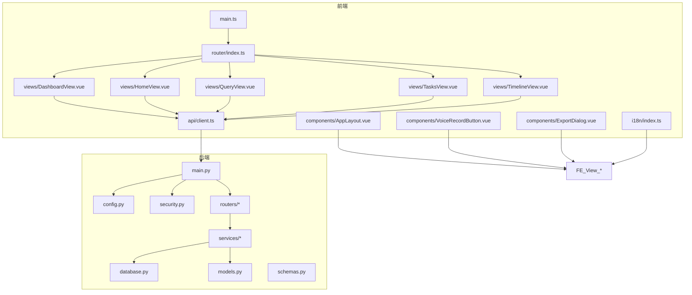
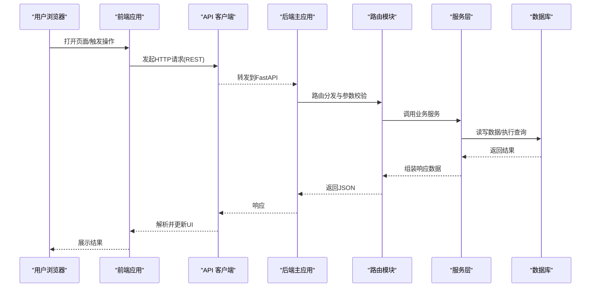
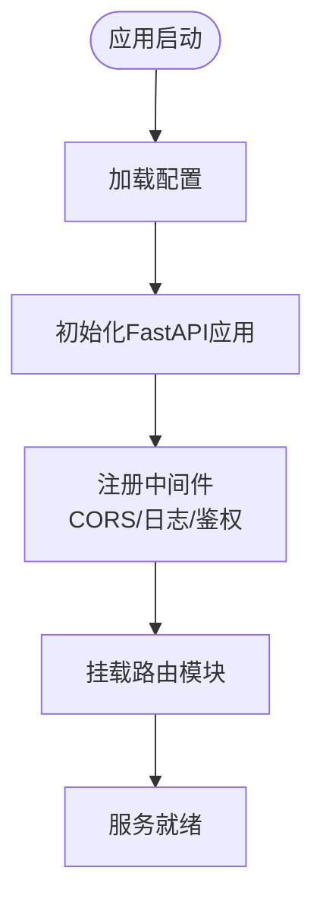
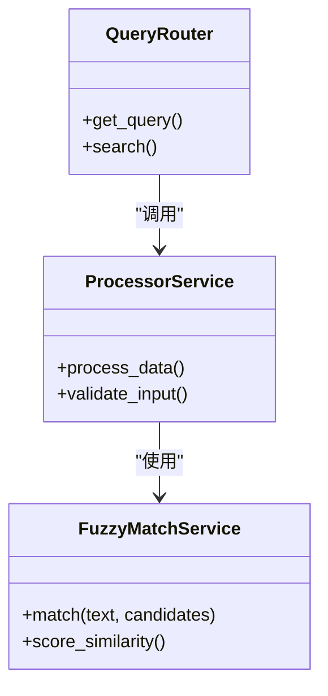
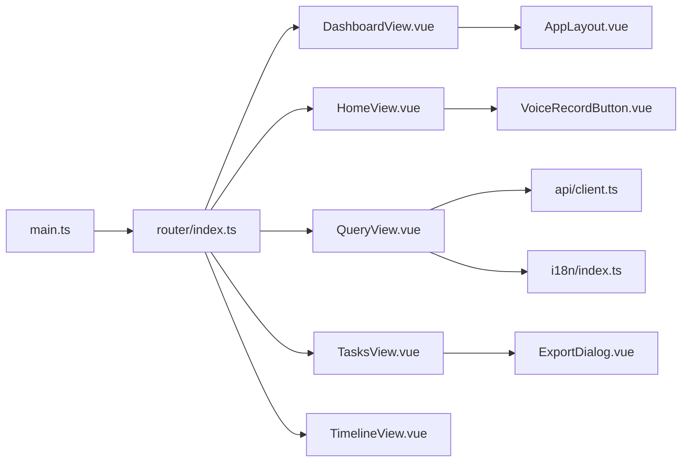
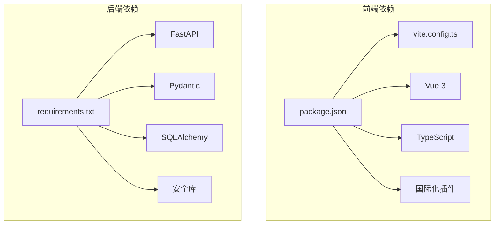

# 开发指南

<cite>
**本文引用的文件**   
- [README.md](file://README.md)
- [CONTRIBUTING.md](file://CONTRIBUTING.md)
- [backend/main.py](file://backend/main.py)
- [backend/config.py](file://backend/config.py)
- [backend/database.py](file://backend/database.py)
- [backend/models.py](file://backend/models.py)
- [backend/schemas.py](file://backend/schemas.py)
- [backend/security.py](file://backend/security.py)
- [backend/routers/asr.py](file://backend/routers/asr.py)
- [backend/routers/context.py](file://backend/routers/context.py)
- [backend/routers/export.py](file://backend/routers/export.py)
- [backend/routers/merge.py](file://backend/routers/merge.py)
- [backend/routers/mood.py](file://backend/routers/mood.py)
- [backend/routers/process.py](file://backend/routers/process.py)
- [backend/routers/query.py](file://backend/routers/query.py)
- [backend/routers/records.py](file://backend/routers/records.py)
- [backend/routers/sync.py](file://backend/routers/sync.py)
- [backend/routers/tasks.py](file://backend/routers/tasks.py)
- [backend/routers/timeline.py](file://backend/routers/timeline.py)
- [backend/routers/user.py](file://backend/routers/user.py)
- [backend/services/fuzzy_match.py](file://backend/services/fuzzy_match.py)
- [backend/services/processor.py](file://backend/services/processor.py)
- [frontend/package.json](file://frontend/package.json)
- [frontend/vite.config.ts](file://frontend/vite.config.ts)
- [frontend/src/main.ts](file://frontend/src/main.ts)
- [frontend/src/router/index.ts](file://frontend/src/router/index.ts)
- [frontend/src/api/client.ts](file://frontend/src/api/client.ts)
- [frontend/src/views/DashboardView.vue](file://frontend/src/views/DashboardView.vue)
- [frontend/src/views/HomeView.vue](file://frontend/src/views/HomeView.vue)
- [frontend/src/views/QueryView.vue](file://frontend/src/views/QueryView.vue)
- [frontend/src/views/TasksView.vue](file://frontend/src/views/TasksView.vue)
- [frontend/src/views/TimelineView.vue](file://frontend/src/views/TimelineView.vue)
- [frontend/src/components/AppLayout.vue](file://frontend/src/components/AppLayout.vue)
- [frontend/src/components/VoiceRecordButton.vue](file://frontend/src/components/VoiceRecordButton.vue)
- [frontend/src/components/ExportDialog.vue](file://frontend/src/components/ExportDialog.vue)
- [frontend/src/i18n/index.ts](file://frontend/src/i18n/index.ts)
- [frontend/src/i18n/locales/zh-CN.ts](file://frontend/src/i18n/locales/zh-CN.ts)
- [frontend/src/i18n/locales/en.ts](file://frontend/src/i18n/locales/en.ts)
- [.github/workflows/deploy.yml](file://.github/workflows/deploy.yml)
- [deploy.sh](file://deploy.sh)
</cite>

## 目录
1. [简介](#简介)
2. [项目结构](#项目结构)
3. [核心组件](#核心组件)
4. [架构总览](#架构总览)
5. [详细组件分析](#详细组件分析)
6. [依赖分析](#依赖分析)
7. [性能考虑](#性能考虑)
8. [故障排查指南](#故障排查指南)
9. [结论](#结论)
10. [附录](#附录)

## 简介
本指南面向开发者，覆盖本地开发环境搭建、代码规范、提交约定与测试策略；阐述前后端协作流程、调试技巧与性能分析方法；说明代码审查流程、问题报告模板与功能请求流程；并提供扩展开发指南、插件化模式与自定义组件创建方法。文档基于仓库现有结构与实现进行总结，帮助团队高效协作与持续交付。

## 项目结构
本项目采用前后端分离架构：
- 后端（Python FastAPI）：提供 REST API、数据模型、服务层与路由模块，负责业务逻辑、数据处理与外部服务集成。
- 前端（Vue 3 + Vite + TypeScript）：提供用户界面、路由、国际化、API 客户端与可复用组件。
- 部署与自动化：通过 GitHub Actions 工作流与脚本完成构建与发布。



图表来源
- [frontend/src/main.ts](file://frontend/src/main.ts)
- [frontend/src/router/index.ts](file://frontend/src/router/index.ts)
- [frontend/src/api/client.ts](file://frontend/src/api/client.ts)
- [frontend/src/views/DashboardView.vue](file://frontend/src/views/DashboardView.vue)
- [frontend/src/views/HomeView.vue](file://frontend/src/views/HomeView.vue)
- [frontend/src/views/QueryView.vue](file://frontend/src/views/QueryView.vue)
- [frontend/src/views/TasksView.vue](file://frontend/src/views/TasksView.vue)
- [frontend/src/views/TimelineView.vue](file://frontend/src/views/TimelineView.vue)
- [frontend/src/components/AppLayout.vue](file://frontend/src/components/AppLayout.vue)
- [frontend/src/components/VoiceRecordButton.vue](file://frontend/src/components/VoiceRecordButton.vue)
- [frontend/src/components/ExportDialog.vue](file://frontend/src/components/ExportDialog.vue)
- [frontend/src/i18n/index.ts](file://frontend/src/i18n/index.ts)
- [backend/main.py](file://backend/main.py)
- [backend/config.py](file://backend/config.py)
- [backend/database.py](file://backend/database.py)
- [backend/models.py](file://backend/models.py)
- [backend/schemas.py](file://backend/schemas.py)
- [backend/security.py](file://backend/security.py)
- [backend/routers/asr.py](file://backend/routers/asr.py)
- [backend/routers/context.py](file://backend/routers/context.py)
- [backend/routers/export.py](file://backend/routers/export.py)
- [backend/routers/merge.py](file://backend/routers/merge.py)
- [backend/routers/mood.py](file://backend/routers/mood.py)
- [backend/routers/process.py](file://backend/routers/process.py)
- [backend/routers/query.py](file://backend/routers/query.py)
- [backend/routers/records.py](file://backend/routers/records.py)
- [backend/routers/sync.py](file://backend/routers/sync.py)
- [backend/routers/tasks.py](file://backend/routers/tasks.py)
- [backend/routers/timeline.py](file://backend/routers/timeline.py)
- [backend/routers/user.py](file://backend/routers/user.py)
- [backend/services/fuzzy_match.py](file://backend/services/fuzzy_match.py)
- [backend/services/processor.py](file://backend/services/processor.py)

章节来源
- [README.md](file://README.md)
- [frontend/package.json](file://frontend/package.json)
- [frontend/vite.config.ts](file://frontend/vite.config.ts)
- [backend/main.py](file://backend/main.py)
- [backend/config.py](file://backend/config.py)

## 核心组件
- 后端入口与配置
  - 应用启动、中间件注册、路由挂载与全局配置管理。
  - 数据库连接与模型定义、请求响应 Schema 校验、安全认证与权限控制。
- 路由与服务层
  - 按领域划分的路由模块（ASR、上下文、导出、合并、情绪、处理、查询、记录、同步、任务、时间线、用户）。
  - 通用服务（模糊匹配、处理器）封装复杂业务逻辑，供路由调用。
- 前端应用
  - Vue 3 单页应用，Vite 构建，TypeScript 类型约束。
  - 路由视图、API 客户端、国际化、可复用组件（布局、录音按钮、导出对话框等）。

章节来源
- [backend/main.py](file://backend/main.py)
- [backend/config.py](file://backend/config.py)
- [backend/database.py](file://backend/database.py)
- [backend/models.py](file://backend/models.py)
- [backend/schemas.py](file://backend/schemas.py)
- [backend/security.py](file://backend/security.py)
- [backend/routers/asr.py](file://backend/routers/asr.py)
- [backend/routers/context.py](file://backend/routers/context.py)
- [backend/routers/export.py](file://backend/routers/export.py)
- [backend/routers/merge.py](file://backend/routers/merge.py)
- [backend/routers/mood.py](file://backend/routers/mood.py)
- [backend/routers/process.py](file://backend/routers/process.py)
- [backend/routers/query.py](file://backend/routers/query.py)
- [backend/routers/records.py](file://backend/routers/records.py)
- [backend/routers/sync.py](file://backend/routers/sync.py)
- [backend/routers/tasks.py](file://backend/routers/tasks.py)
- [backend/routers/timeline.py](file://backend/routers/timeline.py)
- [backend/routers/user.py](file://backend/routers/user.py)
- [backend/services/fuzzy_match.py](file://backend/services/fuzzy_match.py)
- [backend/services/processor.py](file://backend/services/processor.py)
- [frontend/src/main.ts](file://frontend/src/main.ts)
- [frontend/src/router/index.ts](file://frontend/src/router/index.ts)
- [frontend/src/api/client.ts](file://frontend/src/api/client.ts)
- [frontend/src/components/AppLayout.vue](file://frontend/src/components/AppLayout.vue)
- [frontend/src/components/VoiceRecordButton.vue](file://frontend/src/components/VoiceRecordButton.vue)
- [frontend/src/components/ExportDialog.vue](file://frontend/src/components/ExportDialog.vue)
- [frontend/src/i18n/index.ts](file://frontend/src/i18n/index.ts)

## 架构总览
系统采用分层架构：
- 表现层（前端）：Vue 组件与路由组织页面，API 客户端统一发起 HTTP 请求。
- 接口层（后端路由）：FastAPI 路由接收请求，参数校验，调用服务层。
- 服务层（后端服务）：封装业务逻辑，协调数据访问与外部服务。
- 数据层（数据库与模型）：ORM 模型与数据库连接，保证数据一致性与完整性。



图表来源
- [frontend/src/api/client.ts](file://frontend/src/api/client.ts)
- [backend/main.py](file://backend/main.py)
- [backend/routers/query.py](file://backend/routers/query.py)
- [backend/services/processor.py](file://backend/services/processor.py)
- [backend/database.py](file://backend/database.py)

## 详细组件分析

### 后端主应用与配置
- 应用初始化：注册中间件、挂载路由、设置跨域与安全策略。
- 配置管理：集中读取环境变量与配置文件，确保多环境一致性。
- 安全与鉴权：统一认证中间件、令牌校验与权限控制。



图表来源
- [backend/main.py](file://backend/main.py)
- [backend/config.py](file://backend/config.py)
- [backend/security.py](file://backend/security.py)

章节来源
- [backend/main.py](file://backend/main.py)
- [backend/config.py](file://backend/config.py)
- [backend/security.py](file://backend/security.py)

### 数据模型与数据库
- 模型定义：使用 ORM 定义实体关系、字段约束与索引。
- 数据库连接：连接池、事务管理与错误重试策略。
- Schema 校验：Pydantic 模型用于请求/响应数据校验与序列化。

```mermaid
classDiagram
class User {
+id
+username
+email
+created_at
+updated_at
}
class Record {
+id
+user_id
+content
+status
+created_at
}
class Task {
+id
+title
+description
+status
+due_date
}
class Timeline {
+id
+record_id
+event_type
+timestamp
}
User ||--o{ Record : "拥有"
Record ||--o{ Timeline : "包含"
User ||--o{ Task : "分配"
```

图表来源
- [backend/models.py](file://backend/models.py)
- [backend/database.py](file://backend/database.py)
- [backend/schemas.py](file://backend/schemas.py)

章节来源
- [backend/models.py](file://backend/models.py)
- [backend/database.py](file://backend/database.py)
- [backend/schemas.py](file://backend/schemas.py)

### 路由与服务层
- 路由模块：按领域拆分，职责单一，便于维护与测试。
- 服务层：封装复杂逻辑（如模糊匹配、数据处理），提高复用性。
- 错误处理：统一异常捕获与错误码映射，提升稳定性。



图表来源
- [backend/routers/query.py](file://backend/routers/query.py)
- [backend/services/processor.py](file://backend/services/processor.py)
- [backend/services/fuzzy_match.py](file://backend/services/fuzzy_match.py)

章节来源
- [backend/routers/query.py](file://backend/routers/query.py)
- [backend/services/processor.py](file://backend/services/processor.py)
- [backend/services/fuzzy_match.py](file://backend/services/fuzzy_match.py)

### 前端应用与组件
- 应用入口：初始化 Vue 应用、注册插件、配置路由与国际化。
- 路由视图：Dashboard、Home、Query、Tasks、Timeline 等页面。
- 组件库：AppLayout、VoiceRecordButton、ExportDialog 等可复用组件。
- API 客户端：统一封装 HTTP 请求、错误处理与拦截器。



图表来源
- [frontend/src/main.ts](file://frontend/src/main.ts)
- [frontend/src/router/index.ts](file://frontend/src/router/index.ts)
- [frontend/src/views/DashboardView.vue](file://frontend/src/views/DashboardView.vue)
- [frontend/src/views/HomeView.vue](file://frontend/src/views/HomeView.vue)
- [frontend/src/views/QueryView.vue](file://frontend/src/views/QueryView.vue)
- [frontend/src/views/TasksView.vue](file://frontend/src/views/TasksView.vue)
- [frontend/src/views/TimelineView.vue](file://frontend/src/views/TimelineView.vue)
- [frontend/src/components/AppLayout.vue](file://frontend/src/components/AppLayout.vue)
- [frontend/src/components/VoiceRecordButton.vue](file://frontend/src/components/VoiceRecordButton.vue)
- [frontend/src/components/ExportDialog.vue](file://frontend/src/components/ExportDialog.vue)
- [frontend/src/api/client.ts](file://frontend/src/api/client.ts)
- [frontend/src/i18n/index.ts](file://frontend/src/i18n/index.ts)

章节来源
- [frontend/src/main.ts](file://frontend/src/main.ts)
- [frontend/src/router/index.ts](file://frontend/src/router/index.ts)
- [frontend/src/api/client.ts](file://frontend/src/api/client.ts)
- [frontend/src/components/AppLayout.vue](file://frontend/src/components/AppLayout.vue)
- [frontend/src/components/VoiceRecordButton.vue](file://frontend/src/components/VoiceRecordButton.vue)
- [frontend/src/components/ExportDialog.vue](file://frontend/src/components/ExportDialog.vue)
- [frontend/src/i18n/index.ts](file://frontend/src/i18n/index.ts)

## 依赖分析
- 前端依赖：Vue 3、Vite、TypeScript、国际化插件、UI 库。
- 后端依赖：FastAPI、Pydantic、SQLAlchemy、异步驱动、安全库。
- 构建与部署：GitHub Actions 工作流、Shell 脚本。



图表来源
- [frontend/package.json](file://frontend/package.json)
- [frontend/vite.config.ts](file://frontend/vite.config.ts)
- [backend/requirements.txt](file://backend/requirements.txt)

章节来源
- [frontend/package.json](file://frontend/package.json)
- [frontend/vite.config.ts](file://frontend/vite.config.ts)
- [backend/requirements.txt](file://backend/requirements.txt)

## 性能考虑
- 前端优化
  - 组件懒加载与路由分割，减少初始包体积。
  - 图片与静态资源压缩，CDN 加速。
  - 网络请求去重与缓存策略，避免重复请求。
- 后端优化
  - 数据库查询优化，合理使用索引与分页。
  - 异步处理耗时任务，避免阻塞请求线程。
  - 缓存热点数据，降低数据库压力。
- 监控与分析
  - 前端性能监控：首屏加载时间、交互响应延迟。
  - 后端性能分析：请求耗时、内存占用、错误率。

[本节为通用指导，不直接分析具体文件]

## 故障排查指南
- 常见问题定位
  - 前端：控制台错误、网络请求失败、路由跳转异常。
  - 后端：API 返回错误、数据库连接失败、权限验证失败。
- 调试技巧
  - 前端：浏览器开发者工具、网络面板、Vue DevTools。
  - 后端：日志输出、断点调试、单元测试模拟。
- 错误处理策略
  - 统一错误码与消息格式，便于前端处理。
  - 关键操作添加重试机制与降级策略。

章节来源
- [backend/main.py](file://backend/main.py)
- [backend/security.py](file://backend/security.py)
- [frontend/src/api/client.ts](file://frontend/src/api/client.ts)

## 结论
本指南提供了完整的开发环境与工作流程说明，涵盖前后端协作、调试优化、测试策略与扩展开发。遵循本文档的规范与实践，将有效提升团队协作效率与代码质量，保障项目的稳定迭代与持续交付。

[本节为总结性内容，不直接分析具体文件]

## 附录

### 开发环境搭建
- 后端环境
  - Python 版本要求与虚拟环境创建。
  - 依赖安装与环境变量配置。
  - 数据库初始化与迁移脚本执行。
- 前端环境
  - Node.js 版本要求与包管理器选择。
  - 依赖安装与开发服务器启动。
  - 构建配置与生产环境打包。

章节来源
- [backend/requirements.txt](file://backend/requirements.txt)
- [backend/config.py](file://backend/config.py)
- [frontend/package.json](file://frontend/package.json)
- [frontend/vite.config.ts](file://frontend/vite.config.ts)

### 代码规范与提交约定
- 代码风格
  - 后端：PEP 8 规范，类型注解与文档字符串。
  - 前端：ESLint 规则，Prettier 格式化，Vue 单文件组件规范。
- 提交信息
  - 使用约定式提交格式，清晰描述变更内容。
  - 分支命名规范与合并策略。

章节来源
- [CONTRIBUTING.md](file://CONTRIBUTING.md)

### 测试策略
- 后端测试
  - 单元测试：服务层逻辑验证。
  - 集成测试：API 接口端到端测试。
  - 数据库测试：Mock 数据与事务回滚。
- 前端测试
  - 组件单元测试：Vue Test Utils。
  - 路由与状态测试：路由守卫与全局状态。
  - E2E 测试：用户操作流程模拟。

章节来源
- [backend/services/processor.py](file://backend/services/processor.py)
- [backend/routers/query.py](file://backend/routers/query.py)
- [frontend/src/api/client.ts](file://frontend/src/api/client.ts)

### 调试技巧与性能分析
- 前端调试
  - 使用浏览器开发者工具进行 DOM 检查与网络请求分析。
  - Vue DevTools 查看组件状态与事件流。
- 后端调试
  - 启用详细日志与错误追踪。
  - 使用性能分析工具识别瓶颈。
- 性能分析
  - 前端：Lighthouse 审计与性能指标监控。
  - 后端：APM 工具与数据库慢查询分析。

章节来源
- [frontend/src/main.ts](file://frontend/src/main.ts)
- [backend/main.py](file://backend/main.py)

### 代码审查流程
- 审查清单
  - 代码质量：可读性、复杂度、重复代码。
  - 安全性：输入验证、权限控制、敏感信息处理。
  - 性能：算法复杂度、数据库查询优化。
- 审查流程
  - Pull Request 创建与描述。
  - 团队成员审查与反馈。
  - 修改确认与合并。

章节来源
- [CONTRIBUTING.md](file://CONTRIBUTING.md)

### 问题报告模板
- 问题描述
  - 复现步骤、预期行为与实际行为。
  - 环境信息与相关日志。
- 影响范围
  - 受影响的功能模块与用户群体。
- 解决方案建议
  - 可能的修复方案或临时规避措施。

章节来源
- [CONTRIBUTING.md](file://CONTRIBUTING.md)

### 功能请求流程
- 需求描述
  - 功能背景、目标用户与价值。
  - 功能规格与验收标准。
- 技术评估
  - 可行性分析与技术方案。
  - 工作量估算与排期计划。
- 实施与验证
  - 开发实现与单元测试。
  - 集成测试与用户验收。

章节来源
- [CONTRIBUTING.md](file://CONTRIBUTING.md)

### 扩展开发指南
- 后端扩展
  - 新增路由模块与服务逻辑。
  - 数据库模型扩展与迁移脚本。
  - 第三方服务集成与配置管理。
- 前端扩展
  - 新增页面组件与路由配置。
  - 可复用组件开发与文档。
  - 国际化文案管理与主题定制。

章节来源
- [backend/routers/asr.py](file://backend/routers/asr.py)
- [backend/services/processor.py](file://backend/services/processor.py)
- [frontend/src/components/AppLayout.vue](file://frontend/src/components/AppLayout.vue)
- [frontend/src/i18n/locales/zh-CN.ts](file://frontend/src/i18n/locales/zh-CN.ts)

### 插件开发模式
- 插件架构
  - 统一的插件接口与生命周期管理。
  - 插件注册机制与依赖注入。
- 开发规范
  - 插件命名约定与目录结构。
  - 配置项定义与验证规则。
- 测试与发布
  - 插件单元测试与集成测试。
  - 版本管理与发布流程。

章节来源
- [backend/main.py](file://backend/main.py)
- [frontend/src/main.ts](file://frontend/src/main.ts)

### 自定义组件创建方法
- 组件设计
  - 单一职责与可复用性原则。
  - Props 定义与事件通信。
- 实现要点
  - 样式隔离与主题适配。
  - 无障碍支持与国际化。
- 测试与文档
  - 组件单元测试用例。
  - 使用示例与 API 文档。

章节来源
- [frontend/src/components/VoiceRecordButton.vue](file://frontend/src/components/VoiceRecordButton.vue)
- [frontend/src/components/ExportDialog.vue](file://frontend/src/components/ExportDialog.vue)

### 部署与自动化
- 构建流程
  - 前端构建与资源优化。
  - 后端依赖安装与镜像构建。
- 部署策略
  - 容器化部署与编排。
  - 环境变量配置与密钥管理。
- CI/CD 流水线
  - 自动化测试与代码质量检查。
  - 自动发布与回滚机制。

章节来源
- [.github/workflows/deploy.yml](file://.github/workflows/deploy.yml)
- [deploy.sh](file://deploy.sh)