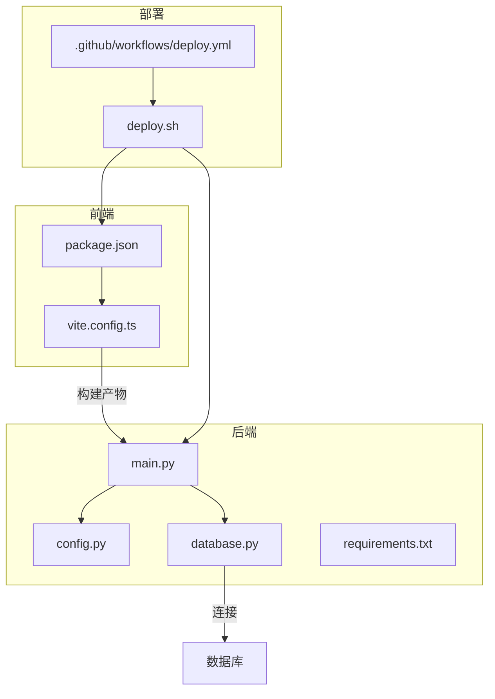
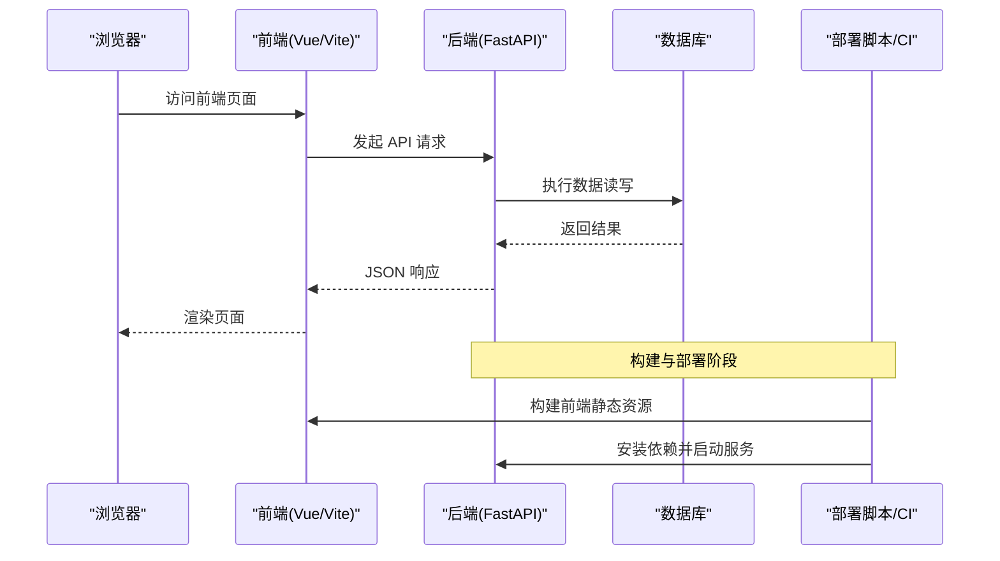
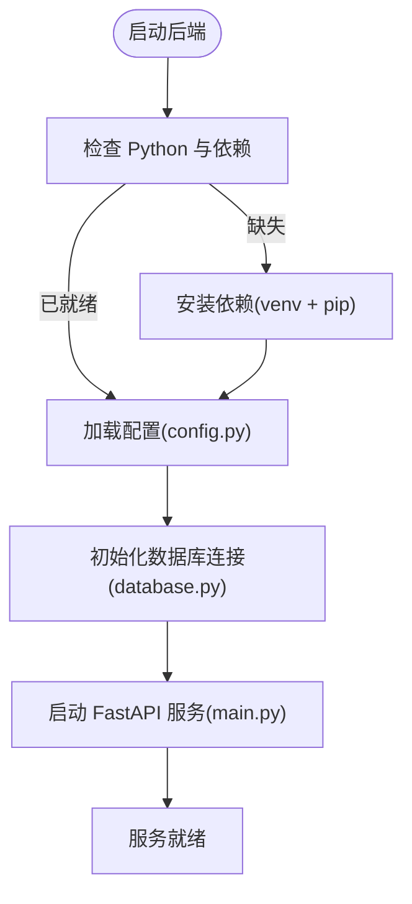
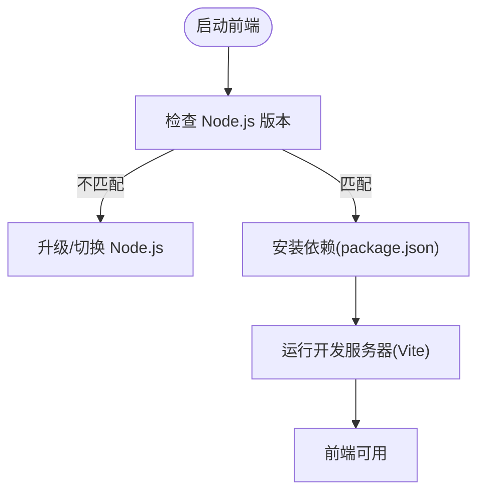
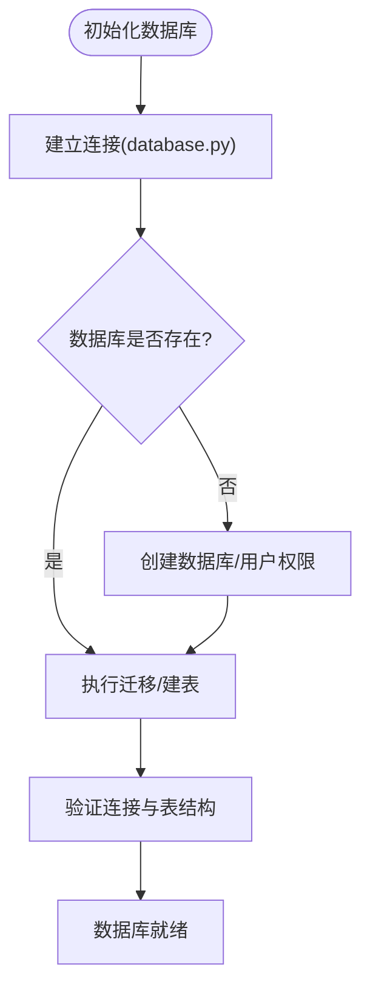
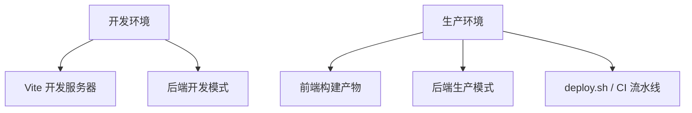
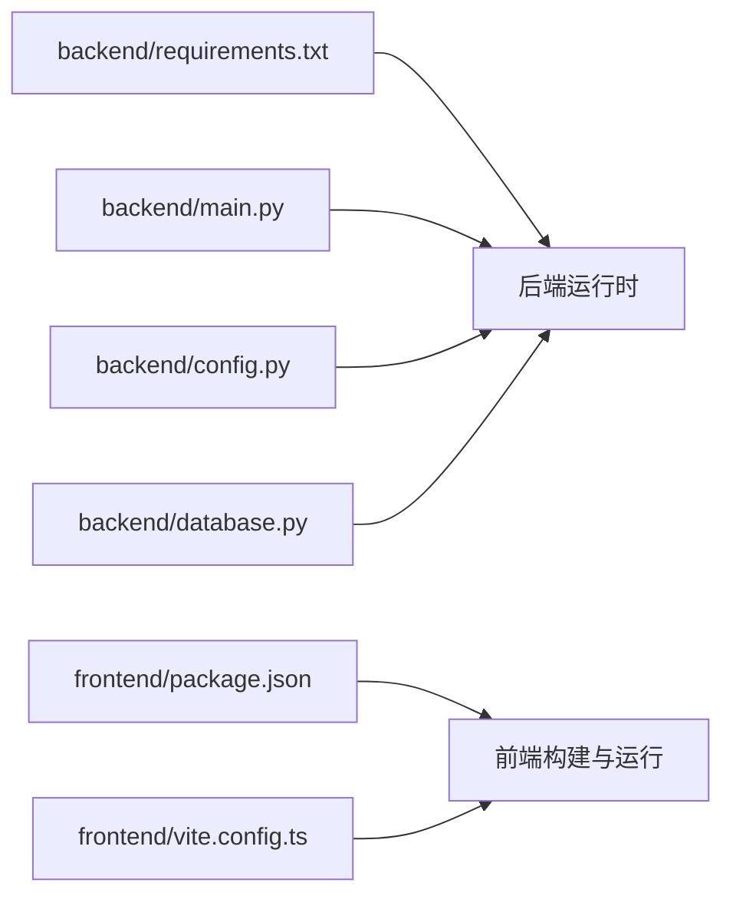

# 快速开始

<cite>
**本文引用的文件**   
- [README.md](file://README.md)
- [backend/requirements.txt](file://backend/requirements.txt)
- [backend/main.py](file://backend/main.py)
- [backend/config.py](file://backend/config.py)
- [backend/database.py](file://backend/database.py)
- [frontend/package.json](file://frontend/package.json)
- [frontend/vite.config.ts](file://frontend/vite.config.ts)
- [deploy.sh](file://deploy.sh)
- [.github/workflows/deploy.yml](file://.github/workflows/deploy.yml)
</cite>

## 目录
1. [简介](#简介)
2. [项目结构](#项目结构)
3. [核心组件](#核心组件)
4. [架构总览](#架构总览)
5. [详细组件分析](#详细组件分析)
6. [依赖关系分析](#依赖关系分析)
7. [性能考虑](#性能考虑)
8. [故障排除指南](#故障排除指南)
9. [结论](#结论)
10. [附录](#附录)

## 简介
本快速开始指南帮助你在最短时间内成功运行 AdventureX 项目。内容涵盖环境要求、安装步骤（后端与前端）、数据库初始化、服务启动命令、基本验证，以及开发环境与生产环境的部署差异和常见问题排查。

## 项目结构
AdventureX 采用前后端分离架构：
- 后端：Python + FastAPI，提供 REST API 与数据处理能力
- 前端：Vue 3 + Vite，提供用户界面与交互
- 数据层：由后端通过数据库驱动访问持久化存储
- 部署：提供脚本与 CI/CD 配置用于自动化部署

**图示来源** 
- [frontend/package.json](file://frontend/package.json)
- [frontend/vite.config.ts](file://frontend/vite.config.ts)
- [backend/main.py](file://backend/main.py)
- [backend/config.py](file://backend/config.py)
- [backend/database.py](file://backend/database.py)
- [backend/requirements.txt](file://backend/requirements.txt)
- [deploy.sh](file://deploy.sh)
- [.github/workflows/deploy.yml](file://.github/workflows/deploy.yml)

**章节来源**
- [README.md](file://README.md)

## 核心组件
- 后端入口与路由：FastAPI 应用主入口负责注册路由、中间件与生命周期事件
- 配置管理：集中读取环境变量与配置文件，统一暴露给各模块使用
- 数据访问：封装数据库连接、会话管理与基础查询操作
- 前端工程：基于 Vue 3 与 Vite 的模块化前端应用，包含路由、组件与国际化
- 部署脚本与流水线：一键部署脚本与 GitHub Actions 工作流

**章节来源**
- [backend/main.py](file://backend/main.py)
- [backend/config.py](file://backend/config.py)
- [backend/database.py](file://backend/database.py)
- [frontend/package.json](file://frontend/package.json)
- [frontend/vite.config.ts](file://frontend/vite.config.ts)

## 架构总览
下图展示了从浏览器到后端 API 再到数据库的整体调用链路，以及构建与部署流程的关键节点。

**图示来源** 
- [frontend/package.json](file://frontend/package.json)
- [frontend/vite.config.ts](file://frontend/vite.config.ts)
- [backend/main.py](file://backend/main.py)
- [backend/database.py](file://backend/database.py)
- [deploy.sh](file://deploy.sh)
- [.github/workflows/deploy.yml](file://.github/workflows/deploy.yml)

## 详细组件分析

### 后端环境与服务启动
- 环境要求
  - Python：建议使用与 requirements.txt 兼容的版本（参见依赖文件）
  - 包管理器：pip 或 venv/poetry（按团队规范选择）
- 安装步骤
  - 进入 backend 目录
  - 创建虚拟环境并激活
  - 安装依赖：参考 requirements.txt
- 配置项
  - 数据库连接、日志级别、跨域等通过 config.py 统一管理
- 启动服务
  - 使用 uvicorn 或项目提供的启动方式启动 main.py
  - 默认监听端口可在配置中调整

**图示来源** 
- [backend/requirements.txt](file://backend/requirements.txt)
- [backend/config.py](file://backend/config.py)
- [backend/database.py](file://backend/database.py)
- [backend/main.py](file://backend/main.py)

**章节来源**
- [backend/requirements.txt](file://backend/requirements.txt)
- [backend/config.py](file://backend/config.py)
- [backend/database.py](file://backend/database.py)
- [backend/main.py](file://backend/main.py)

### 前端依赖与开发服务器
- 环境要求
  - Node.js：建议使用与 package.json 引擎限制兼容的版本
  - 包管理器：npm/yarn/pnpm（任选其一）
- 安装步骤
  - 进入 frontend 目录
  - 安装依赖：参考 package.json 中的 scripts 与 dependencies
- 开发模式
  - 启动 Vite 开发服务器，支持热重载与代理配置
- 构建与部署
  - 构建静态资源供后端或 Web 服务器托管

**图示来源** 
- [frontend/package.json](file://frontend/package.json)
- [frontend/vite.config.ts](file://frontend/vite.config.ts)

**章节来源**
- [frontend/package.json](file://frontend/package.json)
- [frontend/vite.config.ts](file://frontend/vite.config.ts)

### 数据库初始化
- 连接与迁移
  - database.py 负责连接与基础操作
  - 首次运行需确保数据库实例存在并可连接
- 初始化建议
  - 根据模型定义执行必要的建表或迁移脚本
  - 校验连接成功后再启动服务

**图示来源** 
- [backend/database.py](file://backend/database.py)

**章节来源**
- [backend/database.py](file://backend/database.py)

### 部署差异（开发 vs 生产）
- 开发环境
  - 使用 Vite 开发服务器进行热重载调试
  - 后端以开发模式运行，便于日志与断点调试
- 生产环境
  - 前端构建为静态资源，由后端或反向代理托管
  - 后端以生产模式运行，启用多进程与优化选项
  - 通过 deploy.sh 与 CI/CD 流水线实现自动化部署

**图示来源** 
- [frontend/package.json](file://frontend/package.json)
- [frontend/vite.config.ts](file://frontend/vite.config.ts)
- [backend/main.py](file://backend/main.py)
- [deploy.sh](file://deploy.sh)
- [.github/workflows/deploy.yml](file://.github/workflows/deploy.yml)

**章节来源**
- [deploy.sh](file://deploy.sh)
- [.github/workflows/deploy.yml](file://.github/workflows/deploy.yml)

## 依赖关系分析
- 后端依赖
  - Python 运行时与第三方库由 requirements.txt 管理
  - 主要依赖包括 Web 框架、ORM/数据库驱动、工具库等
- 前端依赖
  - Node.js 与 npm/yarn/pnpm 生态，依赖由 package.json 管理
  - 构建工具与框架由 vite.config.ts 与 package.json 共同约束

**图示来源** 
- [backend/requirements.txt](file://backend/requirements.txt)
- [frontend/package.json](file://frontend/package.json)
- [frontend/vite.config.ts](file://frontend/vite.config.ts)
- [backend/main.py](file://backend/main.py)
- [backend/config.py](file://backend/config.py)
- [backend/database.py](file://backend/database.py)

**章节来源**
- [backend/requirements.txt](file://backend/requirements.txt)
- [frontend/package.json](file://frontend/package.json)
- [frontend/vite.config.ts](file://frontend/vite.config.ts)

## 性能考虑
- 后端
  - 合理设置数据库连接池大小与超时参数
  - 在生产环境启用多进程与缓存策略
- 前端
  - 按需引入组件与路由懒加载
  - 构建时启用压缩与代码分割
- 部署
  - 使用反向代理（如 Nginx）托管静态资源
  - 开启 HTTP/2 与 CDN 加速

[本节为通用指导，无需特定文件引用]

## 故障排除指南
- 常见环境问题
  - Python 版本不匹配：请根据 requirements.txt 调整 Python 版本
  - Node.js 版本不匹配：请根据 package.json 的引擎限制调整 Node.js 版本
- 依赖安装失败
  - 网络问题：更换镜像源或使用代理
  - 权限问题：以管理员权限运行或调整系统权限
- 数据库连接失败
  - 检查数据库地址、端口、用户名与密码
  - 确认防火墙与安全组规则允许访问
- 服务无法启动
  - 检查端口占用与配置冲突
  - 查看后端与前端日志定位错误堆栈

**章节来源**
- [backend/requirements.txt](file://backend/requirements.txt)
- [frontend/package.json](file://frontend/package.json)
- [backend/config.py](file://backend/config.py)
- [backend/database.py](file://backend/database.py)

## 结论
按照本指南完成环境准备、依赖安装、数据库初始化与服务启动后，即可在本地或生产环境中运行 AdventureX。建议在开发阶段充分验证接口与页面功能，在生产环境遵循最小权限与最佳实践进行部署。

[本节为总结性内容，无需特定文件引用]

## 附录
- 常用命令速查
  - 后端：安装依赖、启动服务、查看日志
  - 前端：安装依赖、启动开发服务器、构建静态资源
- 环境变量清单
  - 数据库连接、日志级别、跨域与端口等关键变量说明

[本节为补充信息，无需特定文件引用]