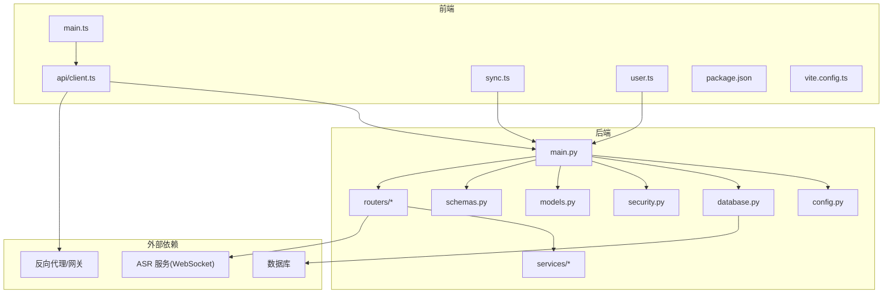
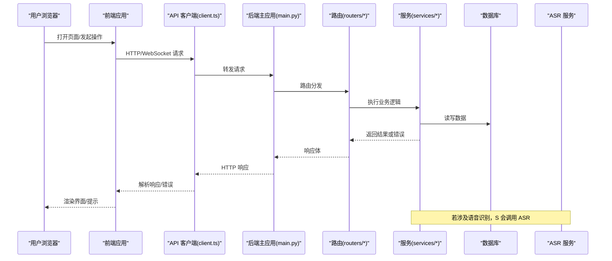
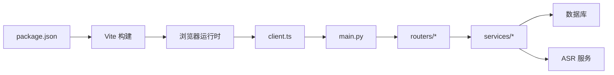

# 故障排除

<cite>
**本文引用的文件**   
- [backend/main.py](file://backend/main.py)
- [backend/config.py](file://backend/config.py)
- [backend/database.py](file://backend/database.py)
- [backend/security.py](file://backend/security.py)
- [backend/models.py](file://backend/models.py)
- [backend/schemas.py](file://backend/schemas.py)
- [backend/routers/asr.py](file://backend/routers/asr.py)
- [backend/routers/context.py](file://backend/routers/context.py)
- [backend/routers/export.py](file://backend/routers/export.py)
- [backend/routers/merge.py](file://backend/routers/merge.py)
- [backend/routers/mood.py](file://backend/routers/mood.py)
- [backend/routers/process.py](file://backend/routers/process.py)
- [backend/routers/query.py](file://backend/routers/query.py)
- [backend/routers/records.py](file://backend/routers/records.py)
- [backend/routers/sync.py](file://backend/routers/sync.py)
- [backend/routers/tasks.py](file://backend/routers/tasks.py)
- [backend/routers/timeline.py](file://backend/routers/timeline.py)
- [backend/routers/user.py](file://backend/routers/user.py)
- [backend/services/fuzzy_match.py](file://backend/services/fuzzy_match.py)
- [backend/services/processor.py](file://backend/services/processor.py)
- [frontend/src/api/client.ts](file://frontend/src/api/client.ts)
- [frontend/src/main.ts](file://frontend/src/main.ts)
- [frontend/src/install.ts](file://frontend/src/install.ts)
- [frontend/src/sync.ts](file://frontend/src/sync.ts)
- [frontend/src/user.ts](file://frontend/src/user.ts)
- [frontend/package.json](file://frontend/package.json)
- [frontend/vite.config.ts](file://frontend/vite.config.ts)
- [data/relay-asr-ws-patch.js](file://data/relay-asr-ws-patch.js)
- [deploy.sh](file://deploy.sh)
- [RELAY.md](file://RELAY.md)
</cite>

## 目录
1. [简介](#简介)
2. [项目结构](#项目结构)
3. [核心组件](#核心组件)
4. [架构总览](#架构总览)
5. [详细组件分析](#详细组件分析)
6. [依赖关系分析](#依赖关系分析)
7. [性能注意事项](#性能注意事项)
8. [故障排除指南](#故障排除指南)
9. [结论](#结论)
10. [附录](#附录)

## 简介
本指南面向安装、配置、运行与运维阶段可能遇到的常见问题，提供系统化的排查步骤、日志分析方法、性能瓶颈定位技巧以及并发问题诊断方法。内容覆盖后端服务（FastAPI）、前端应用（Vue/Vite）、数据库连接、ASR 语音识别、同步与任务处理、网络与代理等关键路径。读者可据此快速定位并解决问题，减少停机时间。

## 项目结构
本项目采用前后端分离架构：
- 后端：Python FastAPI 应用，包含路由、服务层、数据模型、数据库访问与安全模块。
- 前端：Vue + Vite 应用，包含 API 客户端、页面组件、国际化与用户状态管理。
- 数据与工具：ASR WebSocket 补丁脚本、部署脚本与说明文档。

图表来源
- [frontend/src/main.ts](file://frontend/src/main.ts)
- [frontend/src/api/client.ts](file://frontend/src/api/client.ts)
- [frontend/src/sync.ts](file://frontend/src/sync.ts)
- [frontend/src/user.ts](file://frontend/src/user.ts)
- [frontend/package.json](file://frontend/package.json)
- [frontend/vite.config.ts](file://frontend/vite.config.ts)
- [backend/main.py](file://backend/main.py)
- [backend/config.py](file://backend/config.py)
- [backend/database.py](file://backend/database.py)
- [backend/security.py](file://backend/security.py)
- [backend/models.py](file://backend/models.py)
- [backend/schemas.py](file://backend/schemas.py)
- [backend/routers/asr.py](file://backend/routers/asr.py)
- [backend/routers/context.py](file://backend/routers/context.py)
- [backend/routers/export.py](file://backend/routers/export.py)
- [backend/routers/merge.py](file://backend/routers/merge.py)
- [backend/routers/mood.py](file://backend/routers/mood.py)
- [backend/routers/process.py](file://backend/routers/process.py)
- [backend/routers/query.py](file://backend/routers/query.py)
- [backend/routers/records.py](file://backend/routers/records.py)
- [backend/routers/sync.py](file://backend/routers/sync.py)
- [backend/routers/tasks.py](file://backend/routers/tasks.py)
- [backend/routers/timeline.py](file://backend/routers/timeline.py)
- [backend/routers/user.py](file://backend/routers/user.py)
- [backend/services/fuzzy_match.py](file://backend/services/fuzzy_match.py)
- [backend/services/processor.py](file://backend/services/processor.py)

章节来源
- [backend/main.py](file://backend/main.py)
- [frontend/src/main.ts](file://frontend/src/main.ts)
- [frontend/package.json](file://frontend/package.json)
- [frontend/vite.config.ts](file://frontend/vite.config.ts)

## 核心组件
- 后端入口与中间件：统一异常处理、CORS、请求日志、鉴权与限流等。
- 配置与环境：环境变量加载、默认值、敏感信息保护。
- 数据库访问：连接池、会话管理、事务与错误回滚。
- 安全模块：令牌校验、权限控制、输入校验。
- 路由与服务：业务接口、异步任务、第三方服务调用（如 ASR）。
- 前端 API 客户端：HTTP/WebSocket 封装、重试与超时策略。
- 同步与任务：数据同步、后台任务调度与队列。

章节来源
- [backend/main.py](file://backend/main.py)
- [backend/config.py](file://backend/config.py)
- [backend/database.py](file://backend/database.py)
- [backend/security.py](file://backend/security.py)
- [backend/routers/*.py](file://backend/routers/asr.py)
- [backend/services/processor.py](file://backend/services/processor.py)
- [frontend/src/api/client.ts](file://frontend/src/api/client.ts)
- [frontend/src/sync.ts](file://frontend/src/sync.ts)

## 架构总览
下图展示从前端到后端再到外部依赖的端到端调用链，便于定位跨层问题。

图表来源
- [frontend/src/api/client.ts](file://frontend/src/api/client.ts)
- [backend/main.py](file://backend/main.py)
- [backend/routers/*.py](file://backend/routers/asr.py)
- [backend/services/processor.py](file://backend/services/processor.py)
- [backend/database.py](file://backend/database.py)

## 详细组件分析

### 后端主应用与中间件
- 职责：注册路由、全局异常捕获、CORS、请求日志、鉴权中间件。
- 常见故障点：
  - 端口冲突或服务未启动成功。
  - CORS 配置不当导致前端跨域失败。
  - 全局异常未正确捕获，导致 500 响应且无详细信息。
- 调试建议：
  - 检查进程监听端口与绑定地址。
  - 查看启动日志中的警告与错误。
  - 临时关闭非必要的中间件以缩小问题范围。

章节来源
- [backend/main.py](file://backend/main.py)

### 配置与环境变量
- 职责：读取环境变量、设置默认值、暴露配置项给各模块。
- 常见故障点：
  - 缺失必要的环境变量（数据库 URL、密钥、ASR 地址等）。
  - 类型转换失败或默认值不匹配预期。
- 调试建议：
  - 打印或导出当前配置快照进行比对。
  - 使用最小化配置复现问题。

章节来源
- [backend/config.py](file://backend/config.py)

### 数据库连接与会话
- 职责：初始化连接池、会话生命周期管理、事务与错误回滚。
- 常见故障点：
  - 连接池耗尽、连接超时、认证失败。
  - 迁移未完成导致表不存在或字段缺失。
- 调试建议：
  - 检查连接字符串、用户名密码、网络可达性。
  - 观察连接池指标与慢查询日志。
  - 验证数据库版本与迁移脚本一致性。

章节来源
- [backend/database.py](file://backend/database.py)

### 安全与鉴权
- 职责：令牌签发与校验、角色权限控制、输入校验。
- 常见故障点：
  - 令牌过期或签名不一致。
  - 权限不足导致 403。
  - 输入校验失败导致 422。
- 调试建议：
  - 核对客户端携带的令牌格式与有效期。
  - 检查服务端签名密钥与时钟同步。
  - 使用测试账号绕过权限限制定位问题。

章节来源
- [backend/security.py](file://backend/security.py)

### 路由与业务服务
- 职责：定义 REST/WS 接口，编排服务层逻辑，调用外部服务（如 ASR）。
- 常见故障点：
  - 参数校验失败、必填字段缺失。
  - 外部服务不可用或超时。
  - 并发竞争条件导致数据不一致。
- 调试建议：
  - 使用最小请求体复现问题。
  - 对第三方服务增加熔断与降级。
  - 为关键路径添加分布式锁或幂等键。

章节来源
- [backend/routers/asr.py](file://backend/routers/asr.py)
- [backend/routers/context.py](file://backend/routers/context.py)
- [backend/routers/export.py](file://backend/routers/export.py)
- [backend/routers/merge.py](file://backend/routers/merge.py)
- [backend/routers/mood.py](file://backend/routers/mood.py)
- [backend/routers/process.py](file://backend/routers/process.py)
- [backend/routers/query.py](file://backend/routers/query.py)
- [backend/routers/records.py](file://backend/routers/records.py)
- [backend/routers/sync.py](file://backend/routers/sync.py)
- [backend/routers/tasks.py](file://backend/routers/tasks.py)
- [backend/routers/timeline.py](file://backend/routers/timeline.py)
- [backend/routers/user.py](file://backend/routers/user.py)
- [backend/services/fuzzy_match.py](file://backend/services/fuzzy_match.py)
- [backend/services/processor.py](file://backend/services/processor.py)

### 前端 API 客户端与同步
- 职责：封装 HTTP/WebSocket 请求、重试与超时、错误提示与恢复。
- 常见故障点：
  - 网络不可达、代理配置错误、证书问题。
  - 请求超时或响应过大导致内存压力。
  - WebSocket 断线重连策略不当。
- 调试建议：
  - 启用浏览器开发者工具的 Network 面板。
  - 调整超时与重试参数进行对比测试。
  - 记录失败请求的上下文与堆栈。

章节来源
- [frontend/src/api/client.ts](file://frontend/src/api/client.ts)
- [frontend/src/sync.ts](file://frontend/src/sync.ts)

### 前端应用初始化与构建
- 职责：应用入口、插件注册、环境变量注入、构建优化。
- 常见故障点：
  - 开发服务器端口占用。
  - 环境变量未正确注入导致运行时错误。
  - 构建产物缓存导致更新不生效。
- 调试建议：
  - 清理缓存并重新构建。
  - 检查 vite.config 与 package.json 脚本。

章节来源
- [frontend/src/main.ts](file://frontend/src/main.ts)
- [frontend/package.json](file://frontend/package.json)
- [frontend/vite.config.ts](file://frontend/vite.config.ts)

### ASR WebSocket 补丁
- 职责：修补或增强 ASR WebSocket 行为，提升稳定性与兼容性。
- 常见故障点：
  - 补丁未生效或版本不兼容。
  - 握手失败或消息协议不一致。
- 调试建议：
  - 确认补丁加载顺序与目标版本。
  - 抓包分析握手与消息帧。

章节来源
- [data/relay-asr-ws-patch.js](file://data/relay-asr-ws-patch.js)

## 依赖关系分析
- 前端依赖：通过 package.json 声明依赖与脚本；vite.config.ts 控制构建与代理。
- 后端依赖：由 Python 环境及依赖库组成；数据库驱动、加密库、ASR SDK 等。
- 外部依赖：数据库、ASR 服务、反向代理与证书体系。

图表来源
- [frontend/package.json](file://frontend/package.json)
- [frontend/vite.config.ts](file://frontend/vite.config.ts)
- [backend/main.py](file://backend/main.py)
- [backend/routers/*.py](file://backend/routers/asr.py)
- [backend/services/processor.py](file://backend/services/processor.py)
- [backend/database.py](file://backend/database.py)

章节来源
- [frontend/package.json](file://frontend/package.json)
- [frontend/vite.config.ts](file://frontend/vite.config.ts)
- [backend/main.py](file://backend/main.py)

## 性能注意事项
- 后端
  - 连接池大小与超时：避免连接泄漏与排队等待。
  - 异步处理：将 I/O 密集任务改为异步，减少阻塞。
  - 缓存策略：热点数据缓存，降低数据库压力。
  - 日志级别：生产环境降低日志量，避免磁盘 IO 瓶颈。
- 前端
  - 请求合并与去抖：减少重复请求与抖动。
  - 资源压缩与懒加载：提升首屏速度。
  - WebSocket 心跳与重连：保持长连接稳定。
- 数据库
  - 索引优化与慢查询治理。
  - 分库分表与读写分离（视规模而定）。

[本节为通用指导，不直接分析具体文件]

## 故障排除指南

### 安装与依赖问题
- 症状
  - 后端无法启动或导入失败。
  - 前端构建失败或运行时缺少模块。
- 排查步骤
  - 检查 Python 与 Node.js 版本是否符合要求。
  - 重新安装依赖并清理缓存。
  - 确认虚拟环境与路径配置正确。
- 参考文件
  - [backend/requirements.txt](file://backend/requirements.txt)
  - [frontend/package.json](file://frontend/package.json)

章节来源
- [backend/requirements.txt](file://backend/requirements.txt)
- [frontend/package.json](file://frontend/package.json)

### 配置错误
- 症状
  - 环境变量缺失导致启动失败。
  - 数据库连接失败或鉴权错误。
  - ASR 地址或密钥不正确。
- 排查步骤
  - 导出并核对当前配置快照。
  - 使用最小化配置逐步恢复功能。
  - 检查配置文件优先级与覆盖规则。
- 参考文件
  - [backend/config.py](file://backend/config.py)

章节来源
- [backend/config.py](file://backend/config.py)

### 运行时异常
- 症状
  - 500 内部错误、422 参数校验失败、401/403 鉴权错误。
  - 异步任务执行失败或队列堆积。
- 排查步骤
  - 查看后端全局异常日志与请求 ID。
  - 复现最小请求体并逐步扩大范围。
  - 检查任务队列状态与消费者健康。
- 参考文件
  - [backend/main.py](file://backend/main.py)
  - [backend/routers/tasks.py](file://backend/routers/tasks.py)

章节来源
- [backend/main.py](file://backend/main.py)
- [backend/routers/tasks.py](file://backend/routers/tasks.py)

### 网络连接问题
- 症状
  - 前端请求超时或跨域失败。
  - WebSocket 频繁断开或握手失败。
  - 代理或证书错误。
- 排查步骤
  - 使用 curl/wget 测试后端连通性。
  - 在浏览器 Network 面板检查请求头与响应码。
  - 检查代理配置与证书链完整性。
- 参考文件
  - [frontend/src/api/client.ts](file://frontend/src/api/client.ts)
  - [frontend/vite.config.ts](file://frontend/vite.config.ts)
  - [data/relay-asr-ws-patch.js](file://data/relay-asr-ws-patch.js)

章节来源
- [frontend/src/api/client.ts](file://frontend/src/api/client.ts)
- [frontend/vite.config.ts](file://frontend/vite.config.ts)
- [data/relay-asr-ws-patch.js](file://data/relay-asr-ws-patch.js)

### 数据库相关问题
- 症状
  - 连接池耗尽、查询超时、迁移失败。
  - 表不存在或字段缺失。
- 排查步骤
  - 检查连接字符串、用户名密码与网络可达性。
  - 查看慢查询日志与索引使用情况。
  - 验证迁移脚本与数据库版本一致。
- 参考文件
  - [backend/database.py](file://backend/database.py)

章节来源
- [backend/database.py](file://backend/database.py)

### 安全与鉴权问题
- 症状
  - 令牌过期、签名不一致、权限不足。
  - 输入校验失败导致 422。
- 排查步骤
  - 核对客户端令牌格式与有效期。
  - 检查服务端签名密钥与时钟同步。
  - 使用测试账号绕过权限限制定位问题。
- 参考文件
  - [backend/security.py](file://backend/security.py)
  - [backend/schemas.py](file://backend/schemas.py)

章节来源
- [backend/security.py](file://backend/security.py)
- [backend/schemas.py](file://backend/schemas.py)

### 性能瓶颈识别
- 症状
  - 接口响应缓慢、CPU 或内存飙升、数据库慢查询。
- 排查步骤
  - 使用性能分析工具采集 CPU/内存/IO 指标。
  - 定位热点函数与慢查询，优化算法与索引。
  - 引入缓存与异步处理降低延迟。
- 参考文件
  - [backend/services/processor.py](file://backend/services/processor.py)
  - [backend/services/fuzzy_match.py](file://backend/services/fuzzy_match.py)

章节来源
- [backend/services/processor.py](file://backend/services/processor.py)
- [backend/services/fuzzy_match.py](file://backend/services/fuzzy_match.py)

### 内存泄漏检测
- 症状
  - 进程内存持续增长、GC 频繁、OOM 崩溃。
- 排查步骤
  - 使用内存分析工具抓取堆快照并比较差异。
  - 检查对象生命周期与引用释放。
  - 定位大对象与循环引用。
- 参考文件
  - [backend/main.py](file://backend/main.py)
  - [backend/database.py](file://backend/database.py)

章节来源
- [backend/main.py](file://backend/main.py)
- [backend/database.py](file://backend/database.py)

### 并发问题排查
- 症状
  - 数据竞争、死锁、任务重复执行。
- 排查步骤
  - 增加并发日志与分布式锁。
  - 使用线程/进程分析工具定位竞争条件。
  - 设计幂等键与补偿机制。
- 参考文件
  - [backend/routers/tasks.py](file://backend/routers/tasks.py)
  - [backend/routers/sync.py](file://backend/routers/sync.py)

章节来源
- [backend/routers/tasks.py](file://backend/routers/tasks.py)
- [backend/routers/sync.py](file://backend/routers/sync.py)

### 日志分析与调试技巧
- 后端
  - 开启结构化日志与请求追踪 ID。
  - 按级别输出关键路径与异常堆栈。
- 前端
  - 使用浏览器控制台与 Network 面板。
  - 记录失败请求的上下文与重试次数。
- 参考文件
  - [backend/main.py](file://backend/main.py)
  - [frontend/src/api/client.ts](file://frontend/src/api/client.ts)

章节来源
- [backend/main.py](file://backend/main.py)
- [frontend/src/api/client.ts](file://frontend/src/api/client.ts)

### 部署与运维问题
- 症状
  - 部署脚本失败、端口冲突、证书过期。
- 排查步骤
  - 检查 deploy.sh 脚本与依赖环境。
  - 确认端口占用与防火墙规则。
  - 更新证书并重启服务。
- 参考文件
  - [deploy.sh](file://deploy.sh)
  - [RELAY.md](file://RELAY.md)

章节来源
- [deploy.sh](file://deploy.sh)
- [RELAY.md](file://RELAY.md)

## 结论
通过系统化地收集常见问题与解决方案，结合日志分析与性能调优手段，可以快速定位并解决安装、配置、运行与网络等问题。建议在生产环境建立完善的监控与告警体系，持续优化关键路径的性能与稳定性。

## 附录

### 社区支持与问题反馈流程
- 提交 Issue
  - 描述问题现象、复现步骤、期望与实际结果。
  - 附上相关日志片段与截图。
- 贡献代码
  - Fork 仓库并提交 Pull Request，遵循编码规范与测试要求。
- 获取帮助
  - 查阅文档与 FAQ，搜索历史问题。
  - 参与讨论区或邮件列表获取社区支持。

[本节为通用指导，不直接分析具体文件]