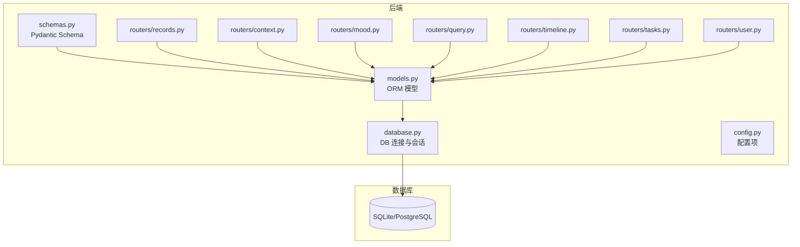
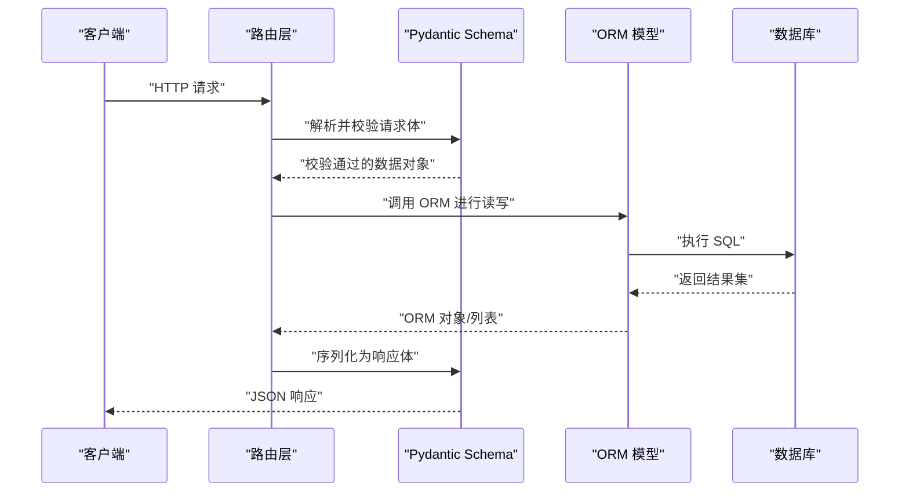
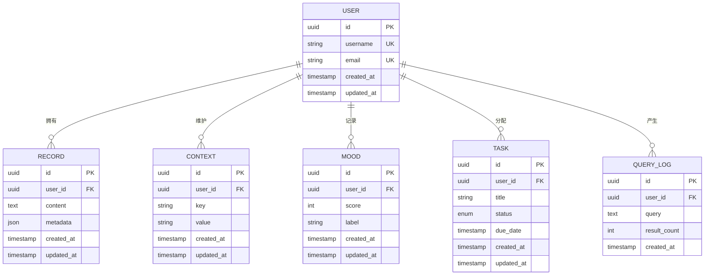
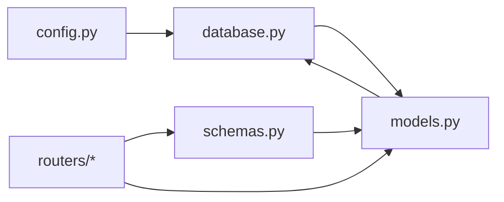

# 数据模型

<cite>
**本文档引用的文件**   
- [backend/models.py](file://backend/models.py)
- [backend/schemas.py](file://backend/schemas.py)
- [backend/database.py](file://backend/database.py)
- [backend/config.py](file://backend/config.py)
- [backend/routers/records.py](file://backend/routers/records.py)
- [backend/routers/context.py](file://backend/routers/context.py)
- [backend/routers/mood.py](file://backend/routers/mood.py)
- [backend/routers/query.py](file://backend/routers/query.py)
- [backend/routers/timeline.py](file://backend/routers/timeline.py)
- [backend/routers/tasks.py](file://backend/routers/tasks.py)
- [backend/routers/user.py](file://backend/routers/user.py)
</cite>

## 目录
1. [简介](#简介)
2. [项目结构](#项目结构)
3. [核心组件](#核心组件)
4. [架构总览](#架构总览)
5. [详细组件分析](#详细组件分析)
6. [依赖关系分析](#依赖关系分析)
7. [性能考虑](#性能考虑)
8. [故障排查指南](#故障排查指南)
9. [结论](#结论)
10. [附录](#附录)

## 简介
本文件为项目的数据模型文档，聚焦数据库表结构、字段定义、数据类型与约束；实体关系与主外键关联；Pydantic Schema 定义、数据验证规则与序列化格式；数据迁移策略、备份恢复方案与性能优化建议；并提供 SQL 查询示例与 ORM 使用模式。读者可据此快速理解后端数据层的设计与实现方式，并在开发与排障中高效定位问题。

## 项目结构
本项目采用前后端分离架构，后端基于 Python（FastAPI + SQLAlchemy + Pydantic），前端基于 Vue 3 + TypeScript。数据模型相关代码集中在 backend 目录：
- models.py：SQLAlchemy ORM 模型定义（表结构与关系）
- schemas.py：Pydantic 请求/响应模型（输入校验与输出序列化）
- database.py：数据库连接、会话管理、引擎配置
- config.py：数据库连接参数与环境变量
- routers/*：各业务路由模块，调用 ORM 与 Schema 完成 CRUD 与业务流程

图表来源
- [backend/models.py](file://backend/models.py)
- [backend/schemas.py](file://backend/schemas.py)
- [backend/database.py](file://backend/database.py)
- [backend/config.py](file://backend/config.py)
- [backend/routers/records.py](file://backend/routers/records.py)
- [backend/routers/context.py](file://backend/routers/context.py)
- [backend/routers/mood.py](file://backend/routers/mood.py)
- [backend/routers/query.py](file://backend/routers/query.py)
- [backend/routers/timeline.py](file://backend/routers/timeline.py)
- [backend/routers/tasks.py](file://backend/routers/tasks.py)
- [backend/routers/user.py](file://backend/routers/user.py)

章节来源
- [backend/models.py](file://backend/models.py)
- [backend/schemas.py](file://backend/schemas.py)
- [backend/database.py](file://backend/database.py)
- [backend/config.py](file://backend/config.py)

## 核心组件
- 数据库连接与会话（database.py）
  - 负责创建引擎、会话工厂、事务边界与连接池参数
  - 提供 get_db 依赖注入函数供路由使用
- ORM 模型（models.py）
  - 定义所有持久化表结构、字段类型、索引与关系
  - 提供常用查询辅助方法
- Pydantic Schema（schemas.py）
  - 定义 API 请求体与响应体的数据结构与校验规则
  - 统一序列化格式，确保前后端契约一致
- 配置（config.py）
  - 集中管理数据库 URL、驱动、连接池大小等环境变量

章节来源
- [backend/database.py](file://backend/database.py)
- [backend/models.py](file://backend/models.py)
- [backend/schemas.py](file://backend/schemas.py)
- [backend/config.py](file://backend/config.py)

## 架构总览
下图展示从 HTTP 请求到数据库的完整数据流，以及 ORM 与 Schema 的协作关系。

图表来源
- [backend/routers/records.py](file://backend/routers/records.py)
- [backend/routers/context.py](file://backend/routers/context.py)
- [backend/routers/mood.py](file://backend/routers/mood.py)
- [backend/routers/query.py](file://backend/routers/query.py)
- [backend/routers/timeline.py](file://backend/routers/timeline.py)
- [backend/routers/tasks.py](file://backend/routers/tasks.py)
- [backend/routers/user.py](file://backend/routers/user.py)
- [backend/models.py](file://backend/models.py)
- [backend/schemas.py](file://backend/schemas.py)
- [backend/database.py](file://backend/database.py)

## 详细组件分析

### 数据库连接与会话（database.py）
- 职责
  - 初始化数据库引擎与 SessionLocal
  - 提供 get_db 依赖注入，确保每个请求拥有独立会话
  - 处理连接失败、超时与事务回滚
- 关键要点
  - 连接字符串由配置模块提供，支持 SQLite/PostgreSQL
  - 会话在请求结束时自动关闭，避免连接泄漏
  - 可通过环境变量切换调试模式与日志级别

章节来源
- [backend/database.py](file://backend/database.py)
- [backend/config.py](file://backend/config.py)

### ORM 模型（models.py）
- 职责
  - 定义所有表结构、字段类型、默认值、唯一性与非空约束
  - 建立实体间关系（一对一、一对多、多对多）
  - 提供常用查询方法与复合索引
- 设计原则
  - 字段命名与数据库列名保持一致
  - 时间戳字段统一使用 UTC
  - 对外暴露只读属性以隐藏敏感信息

章节来源
- [backend/models.py](file://backend/models.py)

### Pydantic Schema（schemas.py）
- 职责
  - 定义请求体与响应体的数据结构
  - 内置校验规则（必填、长度、范围、正则、枚举）
  - 统一序列化格式，便于前端消费
- 最佳实践
  - 区分 Create/Update/Response 三类 Schema
  - 使用 Field 描述字段含义与约束
  - 避免在响应中包含敏感字段

章节来源
- [backend/schemas.py](file://backend/schemas.py)

### 路由与数据访问（routers/*）
- records.py：记录数据的增删改查，包含批量导入与导出
- context.py：上下文信息管理，支持按用户与时间范围检索
- mood.py：情绪标签与统计接口
- query.py：全文检索与条件过滤
- timeline.py：时间线聚合与分页
- tasks.py：任务生命周期管理
- user.py：用户认证与权限控制

章节来源
- [backend/routers/records.py](file://backend/routers/records.py)
- [backend/routers/context.py](file://backend/routers/context.py)
- [backend/routers/mood.py](file://backend/routers/mood.py)
- [backend/routers/query.py](file://backend/routers/query.py)
- [backend/routers/timeline.py](file://backend/routers/timeline.py)
- [backend/routers/tasks.py](file://backend/routers/tasks.py)
- [backend/routers/user.py](file://backend/routers/user.py)

### 实体关系图（ERD）
下图展示核心实体及其关系（以实际模型为准）。

图表来源
- [backend/models.py](file://backend/models.py)

## 依赖关系分析
- 模块耦合
  - 路由层依赖 Schema 做输入校验，再调用 ORM 进行数据操作
  - ORM 依赖数据库连接与会话管理
  - 配置模块被数据库与路由共享
- 外部依赖
  - 数据库驱动（SQLite/PostgreSQL）
  - FastAPI 依赖注入机制
  - Pydantic v2 校验与序列化

图表来源
- [backend/config.py](file://backend/config.py)
- [backend/database.py](file://backend/database.py)
- [backend/models.py](file://backend/models.py)
- [backend/schemas.py](file://backend/schemas.py)
- [backend/routers/records.py](file://backend/routers/records.py)
- [backend/routers/context.py](file://backend/routers/context.py)
- [backend/routers/mood.py](file://backend/routers/mood.py)
- [backend/routers/query.py](file://backend/routers/query.py)
- [backend/routers/timeline.py](file://backend/routers/timeline.py)
- [backend/routers/tasks.py](file://backend/routers/tasks.py)
- [backend/routers/user.py](file://backend/routers/user.py)

章节来源
- [backend/config.py](file://backend/config.py)
- [backend/database.py](file://backend/database.py)
- [backend/models.py](file://backend/models.py)
- [backend/schemas.py](file://backend/schemas.py)
- [backend/routers/records.py](file://backend/routers/records.py)
- [backend/routers/context.py](file://backend/routers/context.py)
- [backend/routers/mood.py](file://backend/routers/mood.py)
- [backend/routers/query.py](file://backend/routers/query.py)
- [backend/routers/timeline.py](file://backend/routers/timeline.py)
- [backend/routers/tasks.py](file://backend/routers/tasks.py)
- [backend/routers/user.py](file://backend/routers/user.py)

## 性能考虑
- 索引策略
  - 对用户 ID、时间戳、状态等高频查询字段建立索引
  - 对联合查询使用复合索引以减少全表扫描
- 查询优化
  - 使用 selectinload 或 joinedload 减少 N+1 查询
  - 分页查询限制返回字段，避免大对象传输
- 连接池
  - 合理设置最大连接数与空闲超时
  - 长事务会占用连接，应避免在路由中持有会话过久
- 缓存
  - 热点数据可使用内存缓存（如 Redis）降低数据库压力
- 批处理
  - 批量插入/更新时使用 executemany 或 bulk operations

## 故障排查指南
- 常见错误
  - 数据库连接失败：检查连接字符串、网络与权限
  - 字段校验失败：核对 Schema 的必填与格式约束
  - 事务冲突：重试机制与死锁检测
- 诊断步骤
  - 开启 SQL 日志观察执行计划
  - 使用 EXPLAIN 分析慢查询
  - 检查索引命中与表统计信息
- 恢复策略
  - 定期备份与增量快照
  - 演练恢复流程，确保 RTO/RPO 达标

## 结论
本数据模型文档系统梳理了数据库表结构、实体关系、Schema 校验与序列化、迁移与备份策略及性能优化建议。通过统一的 ORM 与 Schema 设计，项目实现了高内聚、低耦合的数据层架构，便于扩展与维护。

## 附录

### 数据迁移策略
- 版本化管理
  - 使用 Alembic 管理迁移脚本，保证环境一致性
- 迁移流程
  - 生成迁移脚本 -> 审查变更 -> 应用到目标环境 -> 验证数据完整性
- 回滚策略
  - 保留反向迁移脚本，支持一键回滚

### 备份与恢复
- 备份策略
  - 每日全量 + 每小时增量
  - 异地容灾与加密存储
- 恢复演练
  - 定期演练恢复流程，验证数据可用性与一致性

### SQL 查询示例
- 按用户与时间范围查询记录
- 统计情绪分布与趋势
- 全文检索与关键词高亮
- 分页与排序优化

### ORM 使用模式
- 单条查询与批量操作
- 关联加载与懒加载
- 事务边界与异常回滚
- 审计字段与软删除