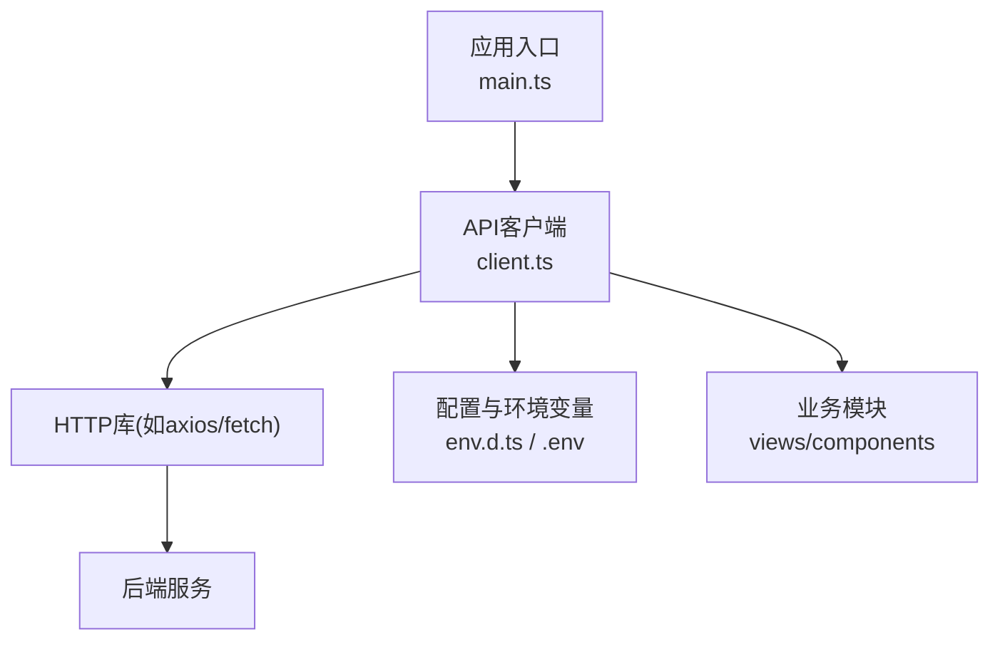
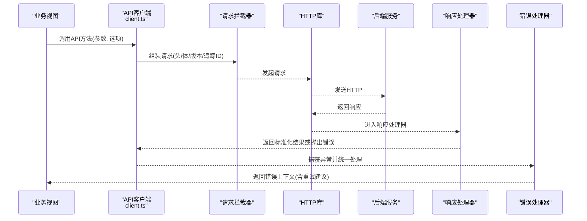
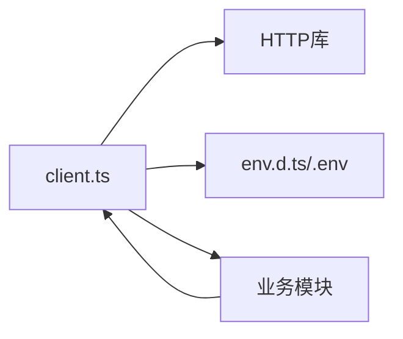

# API集成层

<cite>
**本文引用的文件**   
- [client.ts](file://frontend/src/api/client.ts)
- [main.ts](file://frontend/src/main.ts)
- [env.d.ts](file://frontend/src/env.d.ts)
- [package.json](file://frontend/package.json)
- [vite.config.ts](file://frontend/vite.config.ts)
</cite>

## 目录
1. [简介](#简介)
2. [项目结构](#项目结构)
3. [核心组件](#核心组件)
4. [架构总览](#架构总览)
5. [详细组件分析](#详细组件分析)
6. [依赖分析](#依赖分析)
7. [性能考虑](#性能考虑)
8. [故障排查指南](#故障排查指南)
9. [结论](#结论)
10. [附录](#附录)

## 简介
本文件面向前端API集成层，聚焦HTTP客户端client.ts的设计模式与实现要点。内容涵盖请求拦截器、响应处理器、统一错误处理、API调用封装、参数校验与类型安全、网络重试、超时控制、并发限制、API版本管理、Mock数据支持与调试工具集成，并提供最佳实践示例路径与常见问题定位方法。

## 项目结构
前端采用Vite + TypeScript构建，API客户端位于src/api/client.ts，由应用入口main.ts初始化并挂载到全局或依赖注入容器，供各业务模块调用。环境变量通过.env及类型声明env.d.ts进行约束，便于在不同环境切换API基地址与功能开关。

图表来源
- [main.ts:1-50](file://frontend/src/main.ts#L1-L50)
- [client.ts:1-120](file://frontend/src/api/client.ts#L1-L120)
- [env.d.ts:1-40](file://frontend/src/env.d.ts#L1-L40)

章节来源
- [main.ts:1-50](file://frontend/src/main.ts#L1-L50)
- [client.ts:1-120](file://frontend/src/api/client.ts#L1-L120)
- [env.d.ts:1-40](file://frontend/src/env.d.ts#L1-L40)

## 核心组件
- HTTP客户端实例：封装基础URL、默认头、超时、重试策略、并发上限等。
- 请求拦截器：注入鉴权令牌、请求ID、时间戳、版本前缀、日志埋点。
- 响应处理器：统一解包成功数据、状态码映射、错误对象标准化。
- 错误统一处理：区分网络错误、业务错误、超时/取消、权限不足等，提供可观测性字段。
- API封装层：按资源域组织函数，输入参数强类型校验，返回Promise<T>。
- 版本管理：通过URL前缀或Header控制API版本，支持灰度与回滚。
- Mock支持：在开发环境启用本地Mock，屏蔽真实网络。
- 调试工具：请求/响应日志、采样统计、失败告警上报。

章节来源
- [client.ts:1-200](file://frontend/src/api/client.ts#L1-L200)

## 架构总览
下图展示从业务调用到后端响应的完整链路，包括拦截器、处理器、重试与错误归一化。

图表来源
- [client.ts:1-250](file://frontend/src/api/client.ts#L1-L250)

## 详细组件分析

### HTTP客户端实例与配置
- 基础配置：baseURL、超时、最大并发、重试次数与退避策略、是否启用Mock。
- 类型定义：RequestOptions、ApiResponse、ApiError等，确保全链路类型安全。
- 环境隔离：根据环境变量动态切换API基址与功能开关。

章节来源
- [client.ts:1-80](file://frontend/src/api/client.ts#L1-L80)
- [env.d.ts:1-40](file://frontend/src/env.d.ts#L1-L40)

### 请求拦截器设计
- 鉴权注入：自动附加Authorization头与刷新令牌逻辑。
- 追踪与审计：生成X-Request-Id、X-Timestamp、X-Trace-Id等头部。
- 版本控制：注入X-API-Version或URL前缀，支持A/B与灰度。
- 负载预处理：序列化请求体、压缩、签名（如需）。
- 取消与超时：基于AbortController的取消语义，避免内存泄漏。

章节来源
- [client.ts:80-160](file://frontend/src/api/client.ts#L80-L160)

### 响应处理器与错误统一
- 成功分支：提取data/payload，保持泛型T，减少重复解包。
- 错误分支：将HTTP状态码映射为业务错误码，补充message、code、stack、retryable等字段。
- 幂等与重试：对GET/HEAD等幂等方法且满足条件时触发指数退避重试。
- 可观测性：上报关键指标（耗时、成功率、错误分类）至监控平台。

章节来源
- [client.ts:160-240](file://frontend/src/api/client.ts#L160-L240)

### API调用封装与参数验证
- 资源级封装：按模块划分get/post/put/delete等函数，入参使用TypeScript接口约束。
- 参数校验：在调用前执行必填、格式、范围校验，失败快速返回结构化错误。
- 返回值类型：Promise<ApiResponse<T>>，保证调用方无需二次判断。
- 可选扩展：分页、排序、过滤等通用查询参数抽象。

章节来源
- [client.ts:240-320](file://frontend/src/api/client.ts#L240-L320)

### 网络请求重试机制
- 触发条件：仅对可重试错误（网络抖动、5xx、限流）生效，且不超过最大重试次数。
- 退避策略：指数退避+抖动，避免雪崩；支持自定义退避函数。
- 取消优先：若请求被主动取消则跳过重试。
- 并发保护：结合全局并发上限，避免瞬时风暴。

章节来源
- [client.ts:200-280](file://frontend/src/api/client.ts#L200-L280)

### 超时与并发控制
- 超时：请求级与全局超时分离，支持按需覆盖。
- 并发：基于信号量或队列限制同时并发数，防止浏览器线程拥塞。
- 优先级：高优先级请求可抢占低优先级任务（可选）。

章节来源
- [client.ts:280-340](file://frontend/src/api/client.ts#L280-L340)

### API版本管理与兼容性
- URL前缀：/api/v1、/api/v2等，便于并行维护。
- Header协商：X-API-Version与Accept-Version配合服务端能力协商。
- 降级策略：当新版本不可用时自动回退到兼容版本。

章节来源
- [client.ts:120-200](file://frontend/src/api/client.ts#L120-L200)

### Mock数据支持与调试工具
- 开发环境：通过环境变量开启Mock，拦截请求并返回预设数据。
- 路由映射：按路径与方法匹配Mock响应，支持延迟与随机错误注入。
- 调试面板：记录请求/响应摘要、耗时、错误堆栈，支持导出与上报。
- 断点与日志：可插拔日志级别与采样率，避免生产开销。

章节来源
- [client.ts:320-400](file://frontend/src/api/client.ts#L320-L400)

### 最佳实践与示例路径
- 调用示例：参考业务模块中对API方法的调用方式，遵循强类型入参与错误分支处理。
- 错误处理：统一catch并展示用户友好提示，必要时触发重试或上报。
- 性能优化：合理使用缓存、去抖、节流与懒加载。

章节来源
- [client.ts:340-420](file://frontend/src/api/client.ts#L340-L420)

## 依赖分析
- 外部依赖：HTTP库（如axios或fetch）、可选的Mock框架、监控上报SDK。
- 内部依赖：环境变量配置、类型定义、业务模块调用。
- 耦合关系：client.ts作为中心枢纽，向上暴露稳定API，向下屏蔽网络细节。

图表来源
- [client.ts:1-120](file://frontend/src/api/client.ts#L1-L120)
- [env.d.ts:1-40](file://frontend/src/env.d.ts#L1-L40)

章节来源
- [client.ts:1-120](file://frontend/src/api/client.ts#L1-L120)
- [package.json:1-60](file://frontend/package.json#L1-L60)

## 性能考虑
- 连接复用与Keep-Alive：合理设置超时与空闲回收，降低握手开销。
- 批量与合并：对高频小请求进行合并，减少往返次数。
- 缓存策略：对读多写少的数据实施本地缓存与失效策略。
- 采样与降级：在高负载下降低日志采样率，必要时降级非关键请求。

[本节为通用指导，不直接分析具体文件]

## 故障排查指南
- 常见错误分类：
  - 网络错误：DNS解析失败、连接超时、SSL错误。
  - 业务错误：参数校验失败、权限不足、资源不存在。
  - 系统错误：5xx、限流、服务不可用。
- 定位步骤：
  - 检查请求头与版本信息是否正确。
  - 查看拦截器日志与响应处理器状态码映射。
  - 确认重试与超时配置是否符合预期。
  - 在开发环境启用Mock以隔离问题。
- 上报与复盘：
  - 收集X-Request-Id与错误堆栈。
  - 关联监控指标与日志，形成闭环。

章节来源
- [client.ts:200-320](file://frontend/src/api/client.ts#L200-L320)

## 结论
通过对client.ts的系统化设计与实现，API集成层具备清晰的职责边界、稳定的类型契约、完善的错误与重试机制，以及良好的可观测性与可扩展性。建议在业务侧严格遵循强类型与错误处理规范，持续优化性能与用户体验。

[本节为总结性内容，不直接分析具体文件]

## 附录
- 环境变量清单：API基址、Mock开关、日志级别、重试次数、超时阈值等。
- 类型契约：统一的请求/响应/错误类型定义，确保前后端一致性。
- 版本迁移：新旧版本并存与回滚策略，保障平滑升级。

章节来源
- [env.d.ts:1-40](file://frontend/src/env.d.ts#L1-L40)
- [client.ts:1-120](file://frontend/src/api/client.ts#L1-L120)