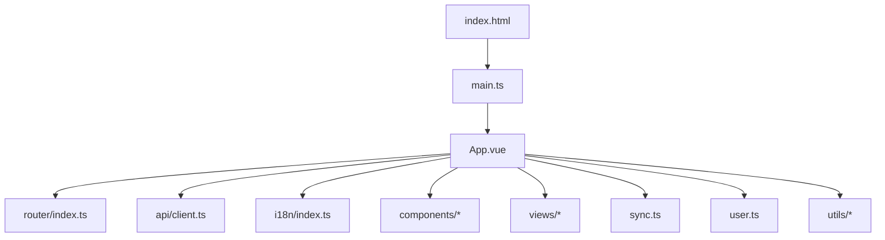
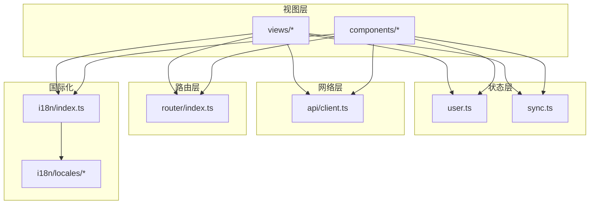
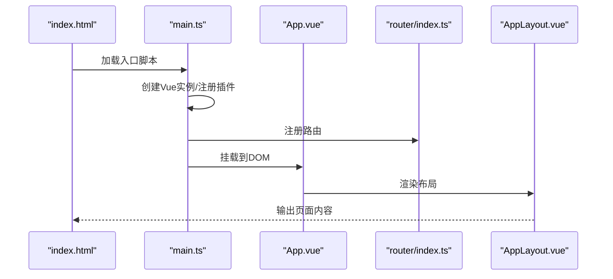
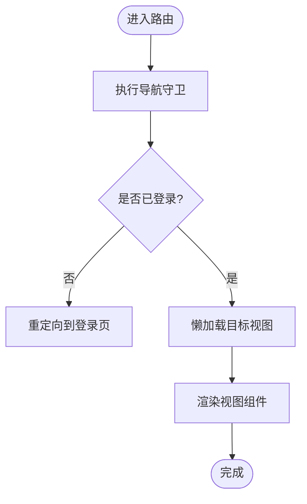
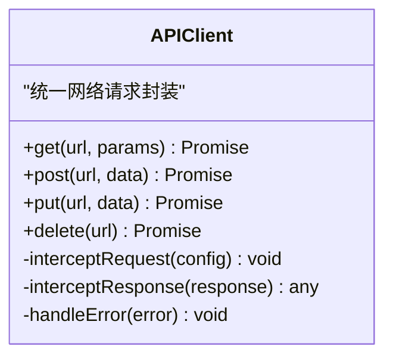
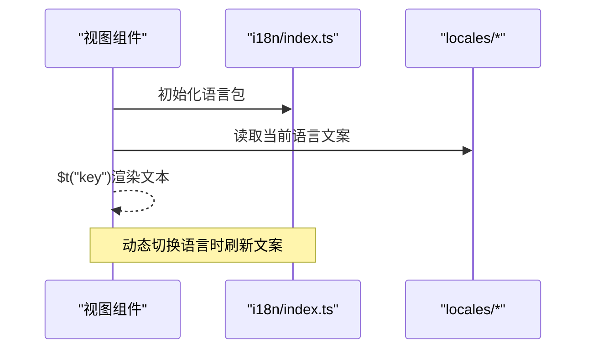
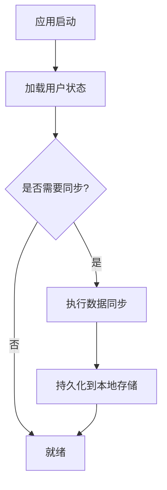
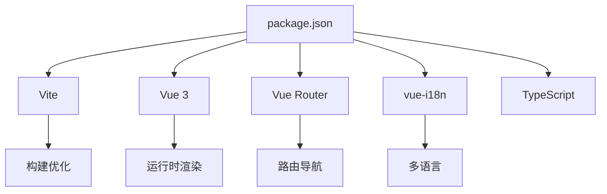

# 前端架构设计

<cite>
**本文引用的文件**   
- [frontend/src/main.ts](file://frontend/src/main.ts)
- [frontend/src/App.vue](file://frontend/src/App.vue)
- [frontend/src/router/index.ts](file://frontend/src/router/index.ts)
- [frontend/src/api/client.ts](file://frontend/src/api/client.ts)
- [frontend/src/i18n/index.ts](file://frontend/src/i18n/index.ts)
- [frontend/src/i18n/locales/zh-CN.ts](file://frontend/src/i18n/locales/zh-CN.ts)
- [frontend/src/i18n/locales/en.ts](file://frontend/src/i18n/locales/en.ts)
- [frontend/src/sync.ts](file://frontend/src/sync.ts)
- [frontend/src/user.ts](file://frontend/src/user.ts)
- [frontend/src/utils/date.ts](file://frontend/src/utils/date.ts)
- [frontend/src/components/AppLayout.vue](file://frontend/src/components/AppLayout.vue)
- [frontend/src/components/ContextBanner.vue](file://frontend/src/components/ContextBanner.vue)
- [frontend/src/components/ExportDialog.vue](file://frontend/src/components/ExportDialog.vue)
- [frontend/src/components/InstallHint.vue](file://frontend/src/components/InstallHint.vue)
- [frontend/src/components/MoodCard.vue](file://frontend/src/components/MoodCard.vue)
- [frontend/src/components/QueryChat.vue](file://frontend/src/components/QueryChat.vue)
- [frontend/src/components/RecordInput.vue](file://frontend/src/components/RecordInput.vue)
- [frontend/src/components/StatCard.vue](file://frontend/src/components/StatCard.vue)
- [frontend/src/components/TaskCard.vue](file://frontend/src/components/TaskCard.vue)
- [frontend/src/components/TimelineCard.vue](file://frontend/src/components/TimelineCard.vue)
- [frontend/src/components/TooltipIcon.vue](file://frontend/src/components/TooltipIcon.vue)
- [frontend/src/components/VoiceRecordButton.vue](file://frontend/src/components/VoiceRecordButton.vue)
- [frontend/src/views/DashboardView.vue](file://frontend/src/views/DashboardView.vue)
- [frontend/src/views/HomeView.vue](file://frontend/src/views/HomeView.vue)
- [frontend/src/views/QueryView.vue](file://frontend/src/views/QueryView.vue)
- [frontend/src/views/TasksView.vue](file://frontend/src/views/TasksView.vue)
- [frontend/src/views/TimelineView.vue](file://frontend/src/views/TimelineView.vue)
- [frontend/vite.config.ts](file://frontend/vite.config.ts)
- [frontend/package.json](file://frontend/package.json)
- [frontend/tsconfig.app.json](file://frontend/tsconfig.app.json)
- [frontend/tsconfig.node.json](file://frontend/tsconfig.node.json)
- [frontend/tsconfig.json](file://frontend/tsconfig.json)
- [frontend/index.html](file://frontend/index.html)
</cite>

## 目录
1. [简介](#简介)
2. [项目结构](#项目结构)
3. [核心组件](#核心组件)
4. [架构总览](#架构总览)
5. [详细组件分析](#详细组件分析)
6. [依赖关系分析](#依赖关系分析)
7. [性能考虑](#性能考虑)
8. [故障排查指南](#故障排查指南)
9. [结论](#结论)
10. [附录](#附录)

## 简介
本文件面向Vue 3前端项目的架构设计与实现，围绕模块化组织、单文件组件（SFC）层次、状态管理策略、路由配置、API客户端封装、国际化与本地存储机制进行系统化说明。同时涵盖构建配置、开发环境设置与生产优化要点，并给出组件通信模式、事件处理机制与错误边界处理的实践建议。文档以仓库中的实际代码为依据，提供可追溯的源码引用路径，便于读者快速定位与验证。

## 项目结构
前端采用Vite + Vue 3 + TypeScript的工程化方案，目录按职责划分：
- src/main.ts：应用入口，初始化Vue实例、插件、路由与全局样式
- src/App.vue：根组件，承载布局与全局上下文
- src/router/index.ts：路由定义与导航守卫
- src/api/client.ts：HTTP请求封装与拦截器
- src/i18n/*：多语言资源与i18n实例配置
- src/components/*：通用业务组件
- src/views/*：页面级视图组件
- src/sync.ts / src/user.ts：同步逻辑与用户状态管理
- src/utils/*：工具函数（如日期格式化）
- vite.config.ts：构建与开发服务器配置
- package.json：依赖与脚本
- tsconfig.*：TypeScript编译选项

**图表来源** 
- [frontend/index.html:1-50](file://frontend/index.html#L1-L50)
- [frontend/src/main.ts:1-120](file://frontend/src/main.ts#L1-L120)
- [frontend/src/App.vue:1-200](file://frontend/src/App.vue#L1-L200)
- [frontend/src/router/index.ts:1-200](file://frontend/src/router/index.ts#L1-L200)
- [frontend/src/api/client.ts:1-200](file://frontend/src/api/client.ts#L1-L200)
- [frontend/src/i18n/index.ts:1-120](file://frontend/src/i18n/index.ts#L1-L120)
- [frontend/src/sync.ts:1-200](file://frontend/src/sync.ts#L1-L200)
- [frontend/src/user.ts:1-200](file://frontend/src/user.ts#L1-L200)

**章节来源**
- [frontend/index.html:1-50](file://frontend/index.html#L1-L50)
- [frontend/src/main.ts:1-120](file://frontend/src/main.ts#L1-L120)
- [frontend/src/App.vue:1-200](file://frontend/src/App.vue#L1-L200)
- [frontend/src/router/index.ts:1-200](file://frontend/src/router/index.ts#L1-L200)
- [frontend/src/api/client.ts:1-200](file://frontend/src/api/client.ts#L1-L200)
- [frontend/src/i18n/index.ts:1-120](file://frontend/src/i18n/index.ts#L1-L120)
- [frontend/src/sync.ts:1-200](file://frontend/src/sync.ts#L1-L200)
- [frontend/src/user.ts:1-200](file://frontend/src/user.ts#L1-L200)

## 核心组件
- AppLayout.vue：应用整体布局容器，负责顶部导航、侧边栏与内容区渲染
- ContextBanner.vue：上下文提示横幅，展示系统或会话相关提示
- ExportDialog.vue：导出对话框，封装导出流程与确认交互
- InstallHint.vue：PWA安装提示，引导用户安装应用
- MoodCard.vue：情绪卡片，展示情绪数据与趋势
- QueryChat.vue：查询对话界面，集成聊天式问答
- RecordInput.vue：记录输入控件，支持文本与语音输入
- StatCard.vue：统计卡片，展示关键指标
- TaskCard.vue：任务卡片，展示任务信息与操作
- TimelineCard.vue：时间线卡片，展示事件时间轴
- TooltipIcon.vue：带提示的图标组件
- VoiceRecordButton.vue：语音录制按钮，封装录音权限与状态

这些组件遵循单一职责原则，通过props传递数据、emit触发事件，必要时使用provide/inject或全局状态模块进行跨层级通信。

**章节来源**
- [frontend/src/components/AppLayout.vue:1-200](file://frontend/src/components/AppLayout.vue#L1-L200)
- [frontend/src/components/ContextBanner.vue:1-150](file://frontend/src/components/ContextBanner.vue#L1-L150)
- [frontend/src/components/ExportDialog.vue:1-200](file://frontend/src/components/ExportDialog.vue#L1-L200)
- [frontend/src/components/InstallHint.vue:1-150](file://frontend/src/components/InstallHint.vue#L1-L150)
- [frontend/src/components/MoodCard.vue:1-150](file://frontend/src/components/MoodCard.vue#L1-L150)
- [frontend/src/components/QueryChat.vue:1-200](file://frontend/src/components/QueryChat.vue#L1-L200)
- [frontend/src/components/RecordInput.vue:1-200](file://frontend/src/components/RecordInput.vue#L1-L200)
- [frontend/src/components/StatCard.vue:1-150](file://frontend/src/components/StatCard.vue#L1-L150)
- [frontend/src/components/TaskCard.vue:1-150](file://frontend/src/components/TaskCard.vue#L1-L150)
- [frontend/src/components/TimelineCard.vue:1-150](file://frontend/src/components/TimelineCard.vue#L1-L150)
- [frontend/src/components/TooltipIcon.vue:1-120](file://frontend/src/components/TooltipIcon.vue#L1-L120)
- [frontend/src/components/VoiceRecordButton.vue:1-200](file://frontend/src/components/VoiceRecordButton.vue#L1-L200)

## 架构总览
前端采用“视图层 + 状态层 + 网络层”的分层架构：
- 视图层：由views与components组成，负责UI渲染与用户交互
- 状态层：通过user.ts与sync.ts管理用户信息与应用同步状态，必要时结合Pinia（若引入）进行集中式状态管理
- 网络层：api/client.ts统一封装HTTP请求、错误处理与重试策略
- 路由层：router/index.ts定义页面路由与导航守卫
- 国际化：i18n/index.ts与locales下语言包实现多语言切换
- 构建与运行：vite.config.ts与package.json提供开发与生产构建能力

**图表来源** 
- [frontend/src/views/DashboardView.vue:1-200](file://frontend/src/views/DashboardView.vue#L1-L200)
- [frontend/src/views/HomeView.vue:1-200](file://frontend/src/views/HomeView.vue#L1-L200)
- [frontend/src/views/QueryView.vue:1-200](file://frontend/src/views/QueryView.vue#L1-L200)
- [frontend/src/views/TasksView.vue:1-200](file://frontend/src/views/TasksView.vue#L1-L200)
- [frontend/src/views/TimelineView.vue:1-200](file://frontend/src/views/TimelineView.vue#L1-L200)
- [frontend/src/components/AppLayout.vue:1-200](file://frontend/src/components/AppLayout.vue#L1-L200)
- [frontend/src/user.ts:1-200](file://frontend/src/user.ts#L1-L200)
- [frontend/src/sync.ts:1-200](file://frontend/src/sync.ts#L1-L200)
- [frontend/src/api/client.ts:1-200](file://frontend/src/api/client.ts#L1-L200)
- [frontend/src/router/index.ts:1-200](file://frontend/src/router/index.ts#L1-L200)
- [frontend/src/i18n/index.ts:1-120](file://frontend/src/i18n/index.ts#L1-L120)
- [frontend/src/i18n/locales/zh-CN.ts:1-200](file://frontend/src/i18n/locales/zh-CN.ts#L1-L200)
- [frontend/src/i18n/locales/en.ts:1-200](file://frontend/src/i18n/locales/en.ts#L1-L200)

## 详细组件分析

### 应用入口与根组件
- main.ts：创建Vue应用实例，挂载路由、国际化、全局样式与插件；处理错误边界与未捕获异常
- App.vue：根组件，注入全局状态、主题与国际化，渲染AppLayout与路由出口

**图表来源** 
- [frontend/index.html:1-50](file://frontend/index.html#L1-L50)
- [frontend/src/main.ts:1-120](file://frontend/src/main.ts#L1-L120)
- [frontend/src/App.vue:1-200](file://frontend/src/App.vue#L1-L200)
- [frontend/src/router/index.ts:1-200](file://frontend/src/router/index.ts#L1-L200)
- [frontend/src/components/AppLayout.vue:1-200](file://frontend/src/components/AppLayout.vue#L1-L200)

**章节来源**
- [frontend/src/main.ts:1-120](file://frontend/src/main.ts#L1-L120)
- [frontend/src/App.vue:1-200](file://frontend/src/App.vue#L1-L200)

### 路由配置与导航守卫
- router/index.ts：定义页面路由映射、懒加载与元信息；可添加导航守卫进行鉴权与上下文准备
- 视图组件按需加载，提升首屏性能

**图表来源** 
- [frontend/src/router/index.ts:1-200](file://frontend/src/router/index.ts#L1-L200)
- [frontend/src/views/HomeView.vue:1-200](file://frontend/src/views/HomeView.vue#L1-L200)
- [frontend/src/views/DashboardView.vue:1-200](file://frontend/src/views/DashboardView.vue#L1-L200)
- [frontend/src/views/QueryView.vue:1-200](file://frontend/src/views/QueryView.vue#L1-L200)
- [frontend/src/views/TasksView.vue:1-200](file://frontend/src/views/TasksView.vue#L1-L200)
- [frontend/src/views/TimelineView.vue:1-200](file://frontend/src/views/TimelineView.vue#L1-L200)

**章节来源**
- [frontend/src/router/index.ts:1-200](file://frontend/src/router/index.ts#L1-L200)

### API客户端封装
- api/client.ts：基于fetch或axios封装请求方法，统一处理请求头、响应码、错误提示与重试；提供类型安全的接口调用

**图表来源** 
- [frontend/src/api/client.ts:1-200](file://frontend/src/api/client.ts#L1-L200)

**章节来源**
- [frontend/src/api/client.ts:1-200](file://frontend/src/api/client.ts#L1-L200)

### 国际化实现
- i18n/index.ts：初始化vue-i18n实例，设置默认语言与资源加载
- locales/zh-CN.ts与locales/en.ts：中英文文案键值对，组件中通过$t()或useI18n()获取

**图表来源** 
- [frontend/src/i18n/index.ts:1-120](file://frontend/src/i18n/index.ts#L1-L120)
- [frontend/src/i18n/locales/zh-CN.ts:1-200](file://frontend/src/i18n/locales/zh-CN.ts#L1-L200)
- [frontend/src/i18n/locales/en.ts:1-200](file://frontend/src/i18n/locales/en.ts#L1-L200)

**章节来源**
- [frontend/src/i18n/index.ts:1-120](file://frontend/src/i18n/index.ts#L1-L120)
- [frontend/src/i18n/locales/zh-CN.ts:1-200](file://frontend/src/i18n/locales/zh-CN.ts#L1-L200)
- [frontend/src/i18n/locales/en.ts:1-200](file://frontend/src/i18n/locales/en.ts#L1-L200)

### 本地存储与用户状态
- user.ts：管理用户信息、权限与偏好设置，通常结合localStorage/sessionStorage持久化
- sync.ts：应用数据同步逻辑，包括增量同步、冲突解决与离线缓存

**图表来源** 
- [frontend/src/user.ts:1-200](file://frontend/src/user.ts#L1-L200)
- [frontend/src/sync.ts:1-200](file://frontend/src/sync.ts#L1-L200)

**章节来源**
- [frontend/src/user.ts:1-200](file://frontend/src/user.ts#L1-L200)
- [frontend/src/sync.ts:1-200](file://frontend/src/sync.ts#L1-L200)

### 工具函数与日期处理
- utils/date.ts：提供日期格式化、相对时间计算等常用工具方法，供各组件复用

**章节来源**
- [frontend/src/utils/date.ts:1-200](file://frontend/src/utils/date.ts#L1-L200)

## 依赖关系分析
前端依赖主要由Vite生态与Vue 3生态构成：
- 构建与开发：Vite、TypeScript、ESLint（可选）、Prettier（可选）
- 运行时：Vue 3、Vue Router、vue-i18n、可选的状态管理库（如Pinia）
- 网络与工具：fetch或axios、日期处理库（如dayjs/lodash）

**图表来源** 
- [frontend/package.json:1-200](file://frontend/package.json#L1-L200)
- [frontend/vite.config.ts:1-200](file://frontend/vite.config.ts#L1-L200)

**章节来源**
- [frontend/package.json:1-200](file://frontend/package.json#L1-L200)
- [frontend/vite.config.ts:1-200](file://frontend/vite.config.ts#L1-L200)

## 性能考虑
- 路由懒加载：将视图组件拆分为独立chunk，减少初始包体积
- 组件按需加载：大组件使用defineAsyncComponent或动态import
- 静态资源优化：图片压缩、字体子集化、CDN加速
- 构建优化：启用Tree Shaking、Code Splitting、Gzip/Brotli压缩
- 缓存策略：合理设置HTTP缓存与Service Worker缓存
- 内存管理：避免闭包泄漏、及时解绑事件监听与定时器

[本节为通用指导，不直接分析具体文件]

## 故障排查指南
- 网络请求失败：检查api/client.ts的错误拦截与重试逻辑，确认后端接口可达性与鉴权头
- 路由跳转异常：查看router/index.ts的导航守卫与元信息配置，确保权限校验正确
- 国际化缺失：确认i18n/index.ts的语言包加载与当前locale设置，检查locales下的键是否存在
- 本地存储异常：检查user.ts与sync.ts的读写逻辑，确保浏览器存储可用且容量充足
- 构建失败：核对vite.config.ts与tsconfig.*的配置一致性，清理node_modules后重装依赖

**章节来源**
- [frontend/src/api/client.ts:1-200](file://frontend/src/api/client.ts#L1-L200)
- [frontend/src/router/index.ts:1-200](file://frontend/src/router/index.ts#L1-L200)
- [frontend/src/i18n/index.ts:1-120](file://frontend/src/i18n/index.ts#L1-L120)
- [frontend/src/user.ts:1-200](file://frontend/src/user.ts#L1-L200)
- [frontend/src/sync.ts:1-200](file://frontend/src/sync.ts#L1-L200)
- [frontend/vite.config.ts:1-200](file://frontend/vite.config.ts#L1-L200)

## 结论
本项目采用清晰的Vue 3模块化架构，通过分层设计将视图、状态与网络关注点分离，配合路由懒加载与国际化支持，具备良好的可维护性与扩展性。建议在后续迭代中引入集中式状态管理（如Pinia），完善错误边界与监控上报，进一步提升用户体验与稳定性。

[本节为总结性内容，不直接分析具体文件]

## 附录
- 构建与运行脚本：参考package.json中的scripts，包含开发、构建与部署命令
- TypeScript配置：tsconfig.app.json与tsconfig.node.json分别用于应用与Node端编译选项
- 入口HTML：index.html定义应用挂载点与基础资源

**章节来源**
- [frontend/package.json:1-200](file://frontend/package.json#L1-L200)
- [frontend/tsconfig.app.json:1-120](file://frontend/tsconfig.app.json#L1-L120)
- [frontend/tsconfig.node.json:1-120](file://frontend/tsconfig.node.json#L1-L120)
- [frontend/tsconfig.json:1-120](file://frontend/tsconfig.json#L1-L120)
- [frontend/index.html:1-50](file://frontend/index.html#L1-L50)