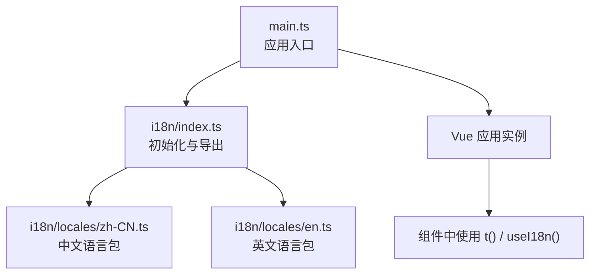
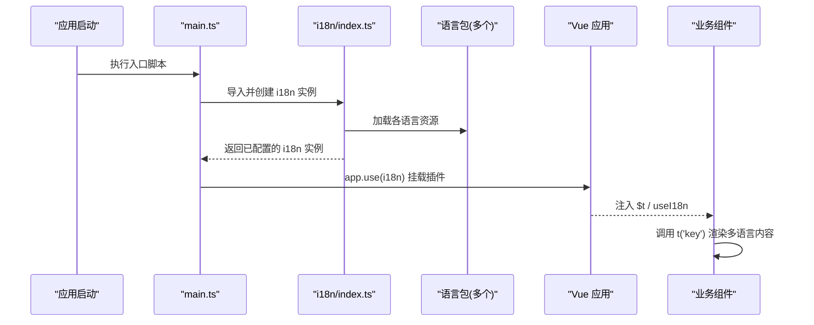
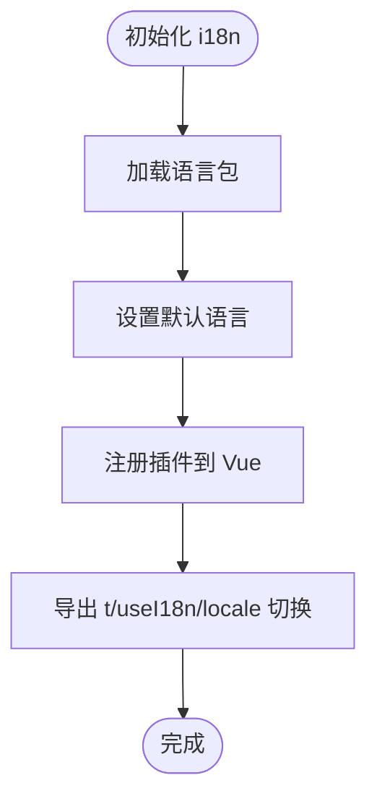
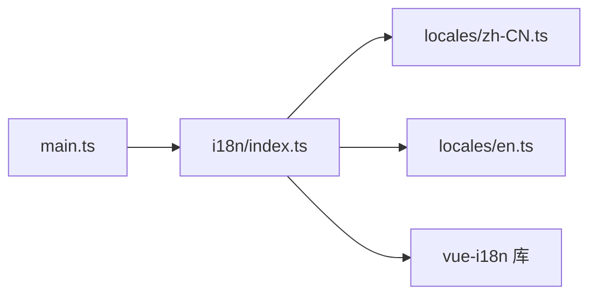
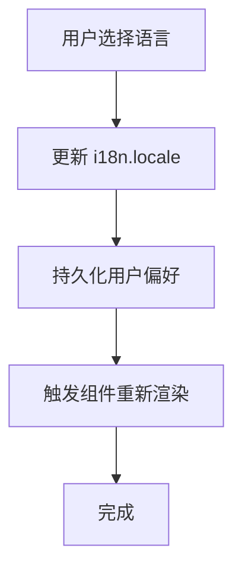
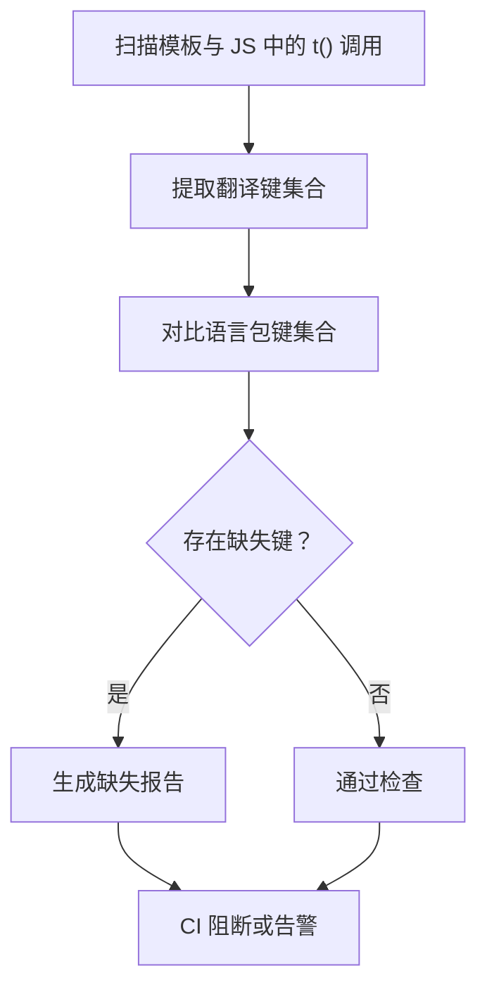

# 国际化实现

<cite>
**本文引用的文件**   
- [frontend/src/i18n/index.ts](file://frontend/src/i18n/index.ts)
- [frontend/src/i18n/locales/en.ts](file://frontend/src/i18n/locales/en.ts)
- [frontend/src/i18n/locales/zh-CN.ts](file://frontend/src/i18n/locales/zh-CN.ts)
- [frontend/src/main.ts](file://frontend/src/main.ts)
- [frontend/package.json](file://frontend/package.json)
</cite>

## 目录
1. [简介](#简介)
2. [项目结构](#项目结构)
3. [核心组件](#核心组件)
4. [架构总览](#架构总览)
5. [详细组件分析](#详细组件分析)
6. [依赖分析](#依赖分析)
7. [性能考虑](#性能考虑)
8. [故障排查指南](#故障排查指南)
9. [结论](#结论)
10. [附录](#附录)

## 简介
本文件面向使用 Vue I18n 的前端工程，系统化阐述多语言配置结构、翻译键值管理、默认语言设置、动态语言切换、复数形式处理与日期时间格式化策略。同时给出翻译文件的维护流程、缺失翻译检测方案与性能优化建议，并覆盖 RTL（从右到左）语言支持与特殊字符处理。文档包含可视化架构图与流程图，帮助读者快速理解与落地最佳实践。

## 项目结构
前端采用模块化组织，国际化相关代码集中在 i18n 目录：
- i18n/index.ts：初始化与导出 Vue I18n 实例，配置默认语言、区域、消息集合等
- i18n/locales/*.ts：按语言划分的翻译资源文件，命名遵循 BCP 47（如 zh-CN、en）
- main.ts：应用入口，挂载 i18n 插件到 Vue 应用
- package.json：声明 vue-i18n 依赖版本与构建脚本

图表来源
- [frontend/src/main.ts](file://frontend/src/main.ts)
- [frontend/src/i18n/index.ts](file://frontend/src/i18n/index.ts)
- [frontend/src/i18n/locales/zh-CN.ts](file://frontend/src/i18n/locales/zh-CN.ts)
- [frontend/src/i18n/locales/en.ts](file://frontend/src/i18n/locales/en.ts)

章节来源
- [frontend/src/i18n/index.ts](file://frontend/src/i18n/index.ts)
- [frontend/src/i18n/locales/en.ts](file://frontend/src/i18n/locales/en.ts)
- [frontend/src/i18n/locales/zh-CN.ts](file://frontend/src/i18n/locales/zh-CN.ts)
- [frontend/src/main.ts](file://frontend/src/main.ts)
- [frontend/package.json](file://frontend/package.json)

## 核心组件
- 语言包组织
  - 每个语言一个独立文件，文件名对应语言标签（如 zh-CN、en），便于扩展新语言
  - 推荐按模块拆分 key 前缀（如 common、dashboard、query），避免冲突与提升可维护性
- 翻译键值管理
  - 使用嵌套对象组织键值，保持层级清晰；对长文本建议使用占位符与插值
  - 统一在 i18n/index.ts 中注册所有语言包，确保类型一致
- 默认语言设置
  - 通过 locale 属性设置初始语言，支持从浏览器或持久化存储读取用户偏好
- 动态语言切换
  - 运行时修改 locale 即可触发 UI 更新；建议在路由守卫或设置页保存用户选择
- 复数形式处理
  - 使用 vue-i18n 的 pluralization 功能，为不同数量提供对应文案
- 日期时间格式化
  - 结合 Intl.DateTimeFormat 或第三方库进行本地化显示；也可在 i18n 中提供格式化函数

章节来源
- [frontend/src/i18n/index.ts](file://frontend/src/i18n/index.ts)
- [frontend/src/i18n/locales/zh-CN.ts](file://frontend/src/i18n/locales/zh-CN.ts)
- [frontend/src/i18n/locales/en.ts](file://frontend/src/i18n/locales/en.ts)

## 架构总览
下图展示应用启动时如何加载 i18n 插件、注入语言包，并在组件中消费翻译能力。

图表来源
- [frontend/src/main.ts](file://frontend/src/main.ts)
- [frontend/src/i18n/index.ts](file://frontend/src/i18n/index.ts)
- [frontend/src/i18n/locales/zh-CN.ts](file://frontend/src/i18n/locales/zh-CN.ts)
- [frontend/src/i18n/locales/en.ts](file://frontend/src/i18n/locales/en.ts)

## 详细组件分析

### i18n 初始化与配置（i18n/index.ts）
- 职责
  - 创建并导出 Vue I18n 实例
  - 配置默认语言、区域、消息集合、复数规则、格式化器等
  - 暴露切换语言的 API 供全局或组件使用
- 关键点
  - 默认语言应优先读取用户偏好或系统设置，回退到工程默认
  - 语言包按需加载可减少首屏体积
  - 为日期、数字等提供统一的本地化格式化函数

图表来源
- [frontend/src/i18n/index.ts](file://frontend/src/i18n/index.ts)

章节来源
- [frontend/src/i18n/index.ts](file://frontend/src/i18n/index.ts)

### 语言包结构与键值管理（locales/*.ts）
- 组织结构
  - 以模块为维度划分键空间，例如 common、dashboard、query 等
  - 使用一致的命名规范（小写+连字符或下划线），避免大小写混用
- 键值设计
  - 短文本直接字符串；长文本使用插值与换行控制
  - 复数形式使用 vue-i18n 的 pluralization 语法
- 示例路径
  - 中文语言包：[zh-CN.ts](file://frontend/src/i18n/locales/zh-CN.ts)
  - 英文语言包：[en.ts](file://frontend/src/i18n/locales/en.ts)

章节来源
- [frontend/src/i18n/locales/zh-CN.ts](file://frontend/src/i18n/locales/zh-CN.ts)
- [frontend/src/i18n/locales/en.ts](file://frontend/src/i18n/locales/en.ts)

### 应用入口集成（main.ts）
- 职责
  - 创建 Vue 应用实例
  - 引入并安装 i18n 插件
  - 挂载根组件并启动应用
- 关键点
  - 确保 i18n 在所有路由与组件之前可用
  - 可在入口处根据用户设置预加载所需语言包

章节来源
- [frontend/src/main.ts](file://frontend/src/main.ts)

### 依赖与版本（package.json）
- 关注点
  - vue-i18n 的版本与兼容性
  - 是否启用 tree-shaking 与按需加载
  - 构建脚本是否包含 i18n 资源打包

章节来源
- [frontend/package.json](file://frontend/package.json)

## 依赖分析
- 内部依赖
  - main.ts 依赖 i18n/index.ts
  - i18n/index.ts 依赖 locales/* 语言包
- 外部依赖
  - vue-i18n 运行时库
  - 可选：date-fns、dayjs、intl-messageformat 等用于日期与复数格式化

图表来源
- [frontend/src/main.ts](file://frontend/src/main.ts)
- [frontend/src/i18n/index.ts](file://frontend/src/i18n/index.ts)
- [frontend/src/i18n/locales/zh-CN.ts](file://frontend/src/i18n/locales/zh-CN.ts)
- [frontend/src/i18n/locales/en.ts](file://frontend/src/i18n/locales/en.ts)

章节来源
- [frontend/src/main.ts](file://frontend/src/main.ts)
- [frontend/src/i18n/index.ts](file://frontend/src/i18n/index.ts)
- [frontend/package.json](file://frontend/package.json)

## 性能考虑
- 首屏优化
  - 仅加载默认语言包，其他语言按需懒加载
  - 使用路由级或视图级懒加载语言包
- 运行时优化
  - 避免频繁切换语言导致的全量重渲染；必要时合并状态更新
  - 对复杂模板中的重复翻译使用缓存或计算属性
- 构建优化
  - 启用 tree-shaking，剔除未使用的翻译键
  - 压缩语言包资源，分离多语言 chunk

## 故障排查指南
- 常见问题
  - 翻译键缺失：控制台输出警告，需检查键名拼写与层级
  - 默认语言未生效：确认初始化顺序与持久化读取逻辑
  - 复数形式不匹配：核对数量变量与复数规则定义
  - 日期格式异常：检查区域设置与格式化函数参数
- 诊断步骤
  - 在开发环境开启 i18n 调试日志
  - 使用浏览器开发者工具查看当前 locale 与已加载语言包
  - 逐步缩小范围定位问题组件或路由

## 结论
通过规范的 i18n 初始化、清晰的语言包结构与完善的运行时策略，可以在 Vue 应用中高效实现多语言支持。结合按需加载、复数与日期本地化、RTL 支持与特殊字符处理，能够覆盖绝大多数国际化场景。建议建立翻译审查流程与自动化检测，持续保障质量与性能。

## 附录

### 最佳实践清单
- 语言包
  - 按模块拆分键空间，统一命名规范
  - 为长文本提供插值与富文本安全转义
- 默认语言
  - 优先读取用户偏好，其次系统语言，最后工程默认
- 动态切换
  - 在设置页保存用户选择，刷新后恢复
- 复数形式
  - 使用 vue-i18n 内置复数规则，必要时自定义
- 日期时间
  - 使用 Intl 或 dayjs 等库进行本地化格式化
- RTL 支持
  - 根据 locale 动态切换 html dir 与 CSS 方向
- 特殊字符
  - 对用户输入进行转义，避免 XSS
- 缺失检测
  - 开发阶段启用缺失键告警，CI 中运行扫描脚本

### 关键流程图：动态语言切换

### 关键流程图：缺失翻译检测
