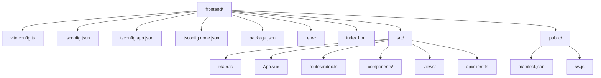
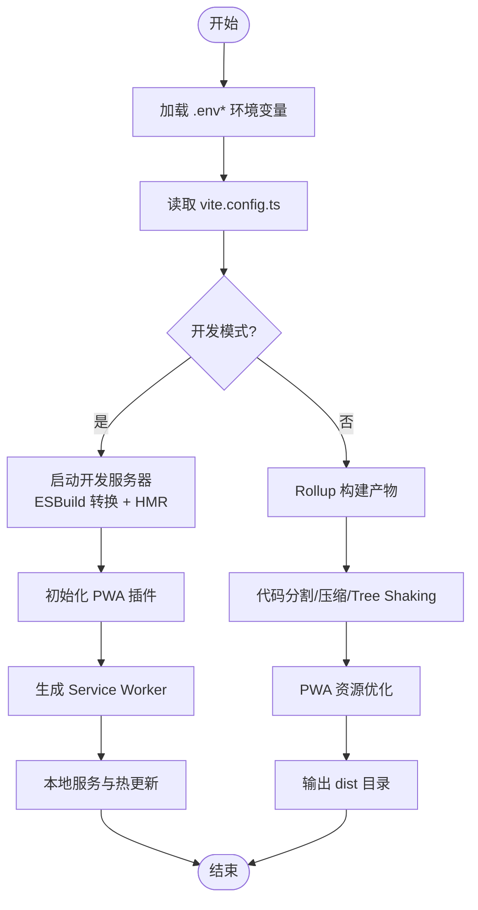
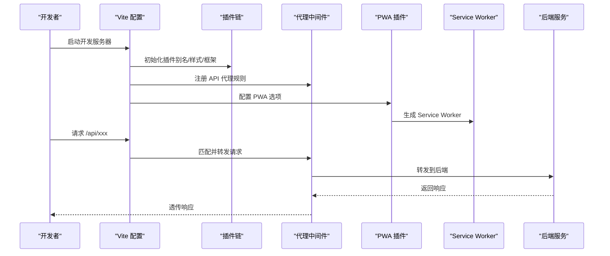
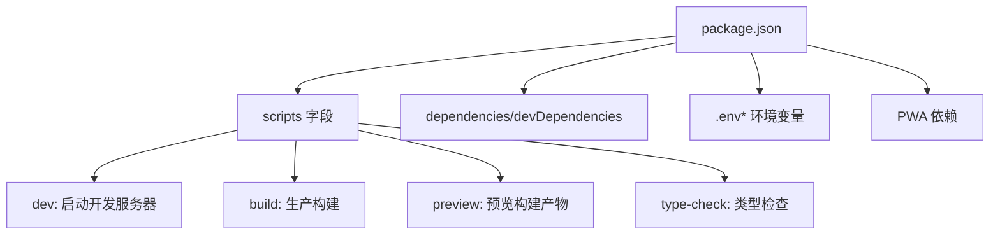
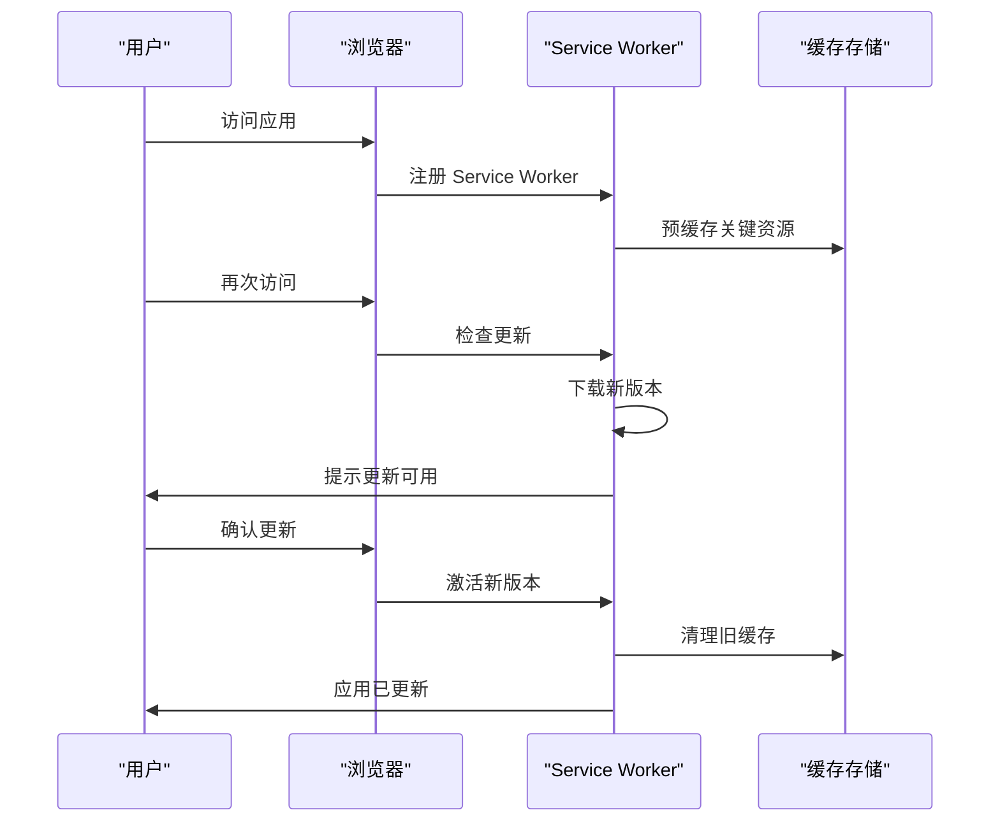
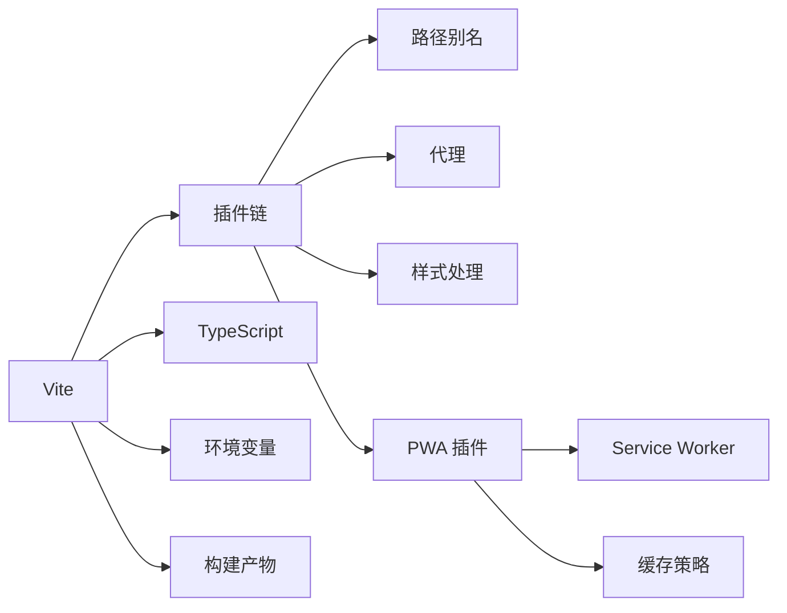

# 构建配置优化

<cite>
**本文引用的文件**   
- [vite.config.ts](file://frontend/vite.config.ts)
- [tsconfig.json](file://frontend/tsconfig.json)
- [tsconfig.app.json](file://frontend/tsconfig.app.json)
- [tsconfig.node.json](file://frontend/tsconfig.node.json)
- [package.json](file://frontend/package.json)
- [.env](file://frontend/.env)
- [.env.development](file://frontend/.env.development)
- [.env.production](file://frontend/.env.production)
- [index.html](file://frontend/index.html)
- [manifest.json](file://frontend/public/manifest.json)
- [sw.js](file://frontend/public/sw.js)
</cite>

## 更新摘要
**变更内容**   
- 新增 PWA 自动更新功能章节，详细说明 service worker 实现和自动更新机制
- 更新 Vite 构建配置部分，包含 PWA 插件集成
- 新增 manifest.json 和 sw.js 配置文件说明
- 更新构建流程图，展示 PWA 相关构建步骤

## 目录
1. [简介](#简介)
2. [项目结构](#项目结构)
3. [核心组件](#核心组件)
4. [架构总览](#架构总览)
5. [详细组件分析](#详细组件分析)
6. [PWA 自动更新功能](#pwa-自动更新功能)
7. [依赖分析](#依赖分析)
8. [性能考虑](#性能考虑)
9. [故障排查指南](#故障排查指南)
10. [结论](#结论)
11. [附录](#附录)

## 简介
本文件面向使用 Vite + TypeScript 的前端工程，聚焦于构建配置的优化与最佳实践。内容涵盖：
- vite.config.ts 的插件、路径别名、代理等关键配置
- tsconfig.json 的分层设置（编译选项、模块解析、类型检查）
- package.json 脚本命令与环境变量管理
- 构建优化策略（代码分割、资源压缩、缓存与增量构建）
- **新增** PWA 自动更新功能的完整实现
- 开发环境与生产环境的差异及示例

目标是帮助读者快速搭建高效、可维护且可扩展的构建体系，并支持渐进式 Web 应用特性。

## 项目结构
前端工程位于 frontend 目录，核心构建相关文件包括：
- 构建配置：vite.config.ts
- TypeScript 分层配置：tsconfig.json、tsconfig.app.json、tsconfig.node.json
- 包管理与脚本：package.json
- 环境变量：.env、.env.development、.env.production
- 入口 HTML：index.html
- **新增** PWA 配置：public/manifest.json、public/sw.js



图表来源
- [vite.config.ts](file://frontend/vite.config.ts)
- [tsconfig.json](file://frontend/tsconfig.json)
- [tsconfig.app.json](file://frontend/tsconfig.app.json)
- [tsconfig.node.json](file://frontend/tsconfig.node.json)
- [package.json](file://frontend/package.json)
- [index.html](file://frontend/index.html)
- [manifest.json](file://frontend/public/manifest.json)
- [sw.js](file://frontend/public/sw.js)

章节来源
- [vite.config.ts](file://frontend/vite.config.ts)
- [tsconfig.json](file://frontend/tsconfig.json)
- [tsconfig.app.json](file://frontend/tsconfig.app.json)
- [tsconfig.node.json](file://frontend/tsconfig.node.json)
- [package.json](file://frontend/package.json)
- [index.html](file://frontend/index.html)
- [manifest.json](file://frontend/public/manifest.json)
- [sw.js](file://frontend/public/sw.js)

## 核心组件
- 构建工具链：Vite（基于 ESBuild 的开发服务器与 Rollup 的生产构建）
- 语言支持：TypeScript（通过 @vitejs/plugin-vue 或 @vitejs/plugin-react 等集成）
- 样式处理：CSS 预处理器（如 Sass/Less）、PostCSS
- 资源优化：图片压缩、字体优化、代码分割、Tree Shaking
- 环境变量：Vite 内置 .env 加载机制
- 插件生态：Vue/React、路径别名、代理、**PWA、SVG Sprite、Markdown 等**
- **新增** PWA 支持：Service Worker 自动注册、缓存策略、离线支持

章节来源
- [vite.config.ts](file://frontend/vite.config.ts)
- [package.json](file://frontend/package.json)

## 架构总览
下图展示从源码到产物的构建流程，以及开发/生产环境的关键差异，**包含 PWA 相关的构建步骤**。



图表来源
- [vite.config.ts](file://frontend/vite.config.ts)
- [package.json](file://frontend/package.json)

## 详细组件分析

### Vite 构建配置（vite.config.ts）
- 插件配置
  - 框架插件：根据 Vue/React 选择对应插件以启用 SFC、JSX、模板语法等
  - 路径别名：统一 src 下的模块导入路径，提升可读性与可维护性
  - 代理设置：在开发阶段转发 API 请求至后端，避免跨域问题
  - **PWA 插件：集成 @vitejs/plugin-pwa，支持 Service Worker 自动生成和缓存策略**
  - 其他常用插件：PostCSS、Sass、SVG Sprite、Markdown 等
- 构建选项
  - 代码分割：按路由或组件维度拆分 chunk，减少首屏体积
  - 资源压缩：启用 CSS/JS 压缩与图片优化
  - 外部化依赖：将大型库排除打包，按需引入
  - 目标浏览器：设置 target 以控制兼容性与 polyfill
- 开发体验
  - HMR：细粒度热更新，提升开发效率
  - 调试：Source Map 与错误堆栈映射
- 环境变量
  - 通过 import.meta.env.* 访问，区分开发与生产



图表来源
- [vite.config.ts](file://frontend/vite.config.ts)

章节来源
- [vite.config.ts](file://frontend/vite.config.ts)

### TypeScript 分层配置（tsconfig.json、tsconfig.app.json、tsconfig.node.json）
- 分层设计
  - tsconfig.json：聚合配置，供 IDE 与工具识别
  - tsconfig.app.json：应用代码编译与类型检查（包含 src 目录）
  - tsconfig.node.json：Node.js 相关脚本与工具的类型检查（不包含 src）
- 编译选项
  - 模块系统：commonjs/esnext
  - 目标版本：esnext 或具体目标（如 es2020）
  - 严格模式：开启类型检查与空值安全
  - 路径映射：与 vite.config.ts 的路径别名保持一致
  - 声明文件：启用 d.ts 生成与第三方类型引用
- 模块解析
  - baseUrl、paths 与 extensions 配置确保模块解析一致
  - 避免循环依赖与未解析模块
- 类型检查
  - 分离 Node 与应用类型检查，提高构建速度
  - 使用 strictNullChecks、noImplicitAny 等增强健壮性

```mermaid
classDiagram
class TsConfigRoot {
+extends : "tsconfig.app.json"
+include : ["src/**/*", "vite.config.ts"]
+compilerOptions : {}
}
class TsConfigApp {
+module : "ESNext"
+target : "ESNext"
+strict : true
+baseUrl : "."
+paths : {"@/*" : ["src/*"]}
+include : ["src/**/*"]
}
class TsConfigNode {
+module : "CommonJS"
+target : "ESNext"
+include : ["*.config.ts"]
+exclude : ["src/**/*"]
}
TsConfigRoot --> TsConfigApp : "继承"
TsConfigRoot --> TsConfigNode : "继承"
```

图表来源
- [tsconfig.json](file://frontend/tsconfig.json)
- [tsconfig.app.json](file://frontend/tsconfig.app.json)
- [tsconfig.node.json](file://frontend/tsconfig.node.json)

章节来源
- [tsconfig.json](file://frontend/tsconfig.json)
- [tsconfig.app.json](file://frontend/tsconfig.app.json)
- [tsconfig.node.json](file://frontend/tsconfig.node.json)

### 包依赖与脚本（package.json）
- 脚本命令
  - 开发：启动 Vite 开发服务器，启用 HMR
  - 构建：执行生产构建，输出 dist
  - 预览：本地预览构建产物
  - 类型检查：分别对应用与 Node 脚本进行类型检查
- 依赖管理
  - 运行时依赖：框架、UI 库、网络请求库等
  - 开发依赖：Vite、TypeScript、插件、Linter、测试工具等
  - **PWA 依赖：@vitejs/plugin-pwa、workbox 等 PWA 相关库**
- 环境变量
  - 通过 .env、.env.development、.env.production 管理不同环境配置
  - 使用 VITE_ 前缀暴露给客户端代码



图表来源
- [package.json](file://frontend/package.json)

章节来源
- [package.json](file://frontend/package.json)

### 环境变量与入口（.env*、index.html）
- 环境变量
  - .env：通用变量
  - .env.development：开发环境覆盖
  - .env.production：生产环境覆盖
  - 客户端变量需以 VITE_ 开头
- 入口 HTML
  - 定义基础 meta、title、manifest
  - 注入构建产物与全局变量
  - **PWA 元数据：manifest 引用、主题色、图标配置**

章节来源
- [.env](file://frontend/.env)
- [.env.development](file://frontend/.env.development)
- [.env.production](file://frontend/.env.production)
- [index.html](file://frontend/index.html)

## PWA 自动更新功能

### Service Worker 实现
PWA 自动更新功能通过 Service Worker 实现，提供以下核心能力：
- **缓存策略**：智能缓存静态资源和 API 响应
- **自动更新检测**：监听 Service Worker 更新事件
- **离线支持**：在网络不可用时提供基本功能
- **后台同步**：异步处理网络请求

### Manifest 配置
manifest.json 文件定义了 PWA 的应用信息：
- 应用名称和描述
- 主题颜色和背景颜色
- 启动页面和显示模式
- 图标资源配置

### 自动更新机制
PWA 自动更新流程：
1. **版本检测**：Service Worker 定期检查新版本
2. **下载更新**：后台下载新版本的 Service Worker
3. **激活更新**：在新标签页或关闭后激活更新
4. **用户提示**：可选的用户更新提示



图表来源
- [sw.js](file://frontend/public/sw.js)
- [manifest.json](file://frontend/public/manifest.json)

### PWA 构建配置
在 vite.config.ts 中集成 PWA 插件：
- 配置 Service Worker 生成选项
- 设置缓存策略和过期时间
- 启用离线支持和自动更新
- 配置 manifest 文件生成

**章节来源**
- [sw.js](file://frontend/public/sw.js)
- [manifest.json](file://frontend/public/manifest.json)
- [vite.config.ts](file://frontend/vite.config.ts)

## 依赖分析
- 构建依赖关系
  - Vite 作为核心，串联插件链与构建流程
  - TypeScript 提供类型系统与编译选项
  - 插件负责路径别名、代理、样式、框架特性等
  - **PWA 插件提供 Service Worker 生成和缓存策略**
- 外部依赖
  - 运行时依赖通过 Tree Shaking 与按需引入优化
  - 大型库可通过 external 或 CDN 方式外部化
- 潜在风险
  - 循环依赖导致构建失败
  - 路径别名不一致引发模块解析错误
  - 环境变量命名冲突或作用域错误
  - **PWA 缓存策略可能导致版本不一致**



图表来源
- [vite.config.ts](file://frontend/vite.config.ts)
- [tsconfig.json](file://frontend/tsconfig.json)
- [package.json](file://frontend/package.json)

章节来源
- [vite.config.ts](file://frontend/vite.config.ts)
- [tsconfig.json](file://frontend/tsconfig.json)
- [package.json](file://frontend/package.json)

## 性能考虑
- 代码分割
  - 按路由或组件维度拆分，减少首屏体积
  - 使用动态导入实现懒加载
- 资源压缩
  - JS/CSS 压缩与混淆
  - 图片与字体优化
- 缓存与增量构建
  - 利用 Vite 的 ESBuild 与 Rollup 缓存
  - 合理设置依赖版本锁定，提升冷/热构建速度
- 外部化与 CDN
  - 将大型库外部化或使用 CDN 加速
- 目标浏览器
  - 精确设置 target，减少不必要的 polyfill
- **PWA 优化**
  - 智能缓存策略，减少重复下载
  - Service Worker 预缓存关键资源
  - 按需加载非关键资源

## 故障排查指南
- 常见问题
  - 模块解析失败：检查路径别名与 tsconfig 的 paths 是否一致
  - 代理无效：确认开发服务器端口与代理规则
  - 环境变量未生效：确认变量名以 VITE_ 开头且作用域正确
  - 类型检查报错：检查 strict 模式与第三方类型声明
  - **PWA 相关问题：检查 Service Worker 注册、缓存策略、manifest 配置**
- 调试技巧
  - 启用 Source Map 定位问题
  - 使用 Vite 的 --debug 参数查看构建日志
  - 分步禁用插件定位冲突
  - **PWA 调试：使用浏览器开发者工具的 Application 面板检查 Service Worker 状态**

章节来源
- [vite.config.ts](file://frontend/vite.config.ts)
- [tsconfig.json](file://frontend/tsconfig.json)
- [package.json](file://frontend/package.json)

## 结论
通过合理的 Vite 配置、分层 TypeScript 设置与完善的脚本与环境管理，可以显著提升构建效率与可维护性。**新增的 PWA 自动更新功能进一步增强了应用的离线能力和用户体验**。建议持续监控构建时间与产物体积，结合业务需求调整代码分割与资源优化策略，并充分利用 PWA 特性提升应用性能。

## 附录
- 参考链接
  - Vite 官方文档
  - TypeScript 手册
  - 各插件文档（Vue/React、PWA、SVG Sprite 等）
  - **PWA 最佳实践指南**
- 最佳实践清单
  - 保持路径别名与 tsconfig 一致
  - 使用 .env.* 管理环境变量
  - 启用严格类型检查
  - 定期清理未使用的依赖与代码
  - **合理配置 PWA 缓存策略**
  - **测试 Service Worker 更新流程**