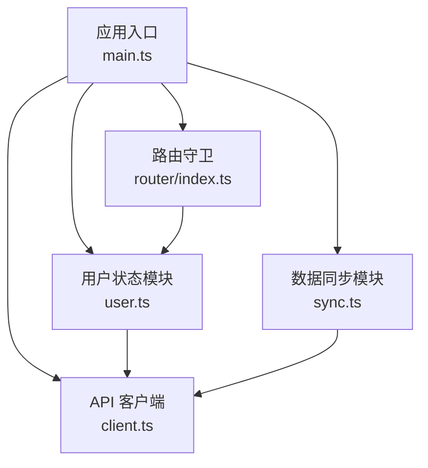
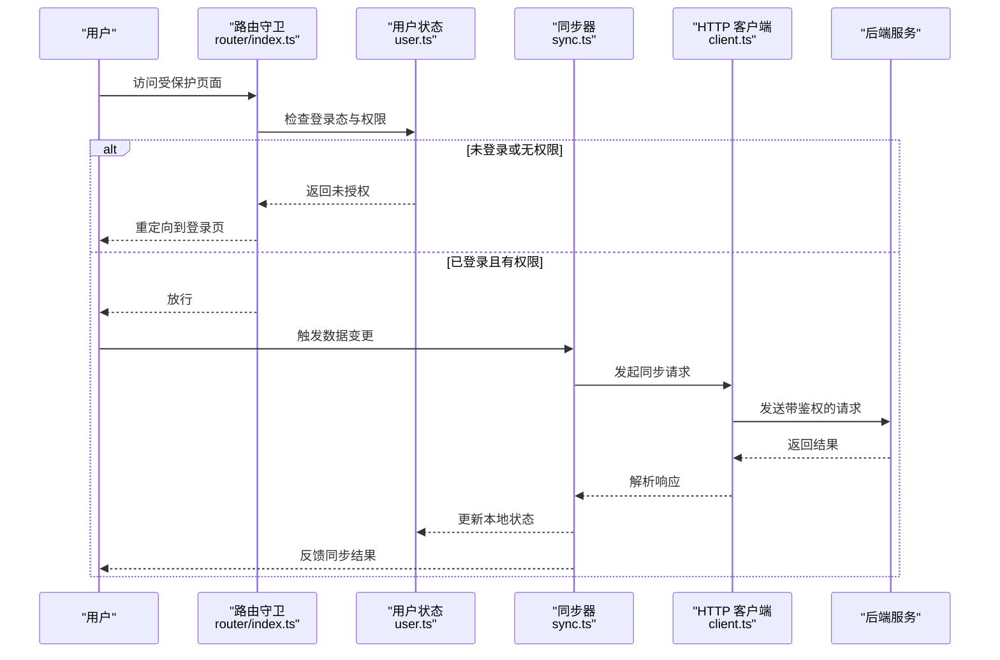
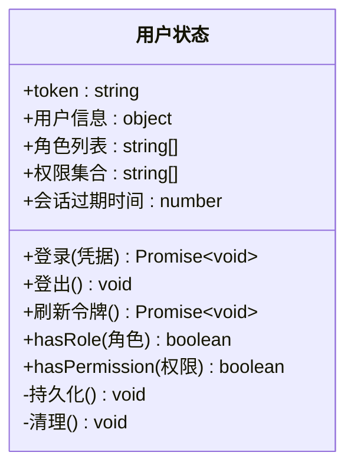
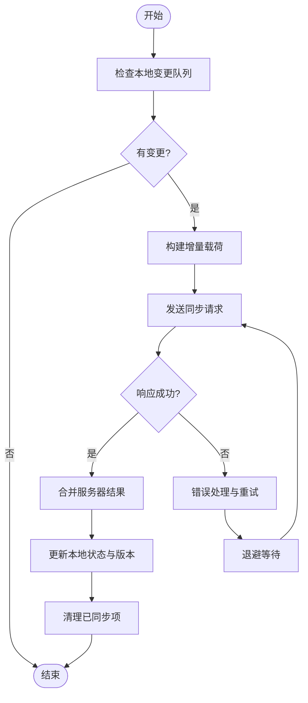
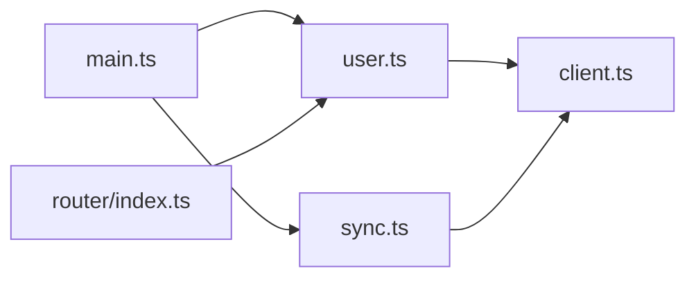

# 状态管理架构

<cite>
**本文引用的文件**   
- [user.ts](file://frontend/src/user.ts)
- [sync.ts](file://frontend/src/sync.ts)
- [env.d.ts](file://frontend/src/env.d.ts)
- [main.ts](file://frontend/src/main.ts)
- [client.ts](file://frontend/src/api/client.ts)
- [router/index.ts](file://frontend/src/router/index.ts)
</cite>

## 目录
1. [简介](#简介)
2. [项目结构](#项目结构)
3. [核心组件](#核心组件)
4. [架构总览](#架构总览)
5. [详细组件分析](#详细组件分析)
6. [依赖关系分析](#依赖关系分析)
7. [性能考虑](#性能考虑)
8. [故障排查指南](#故障排查指南)
9. [结论](#结论)
10. [附录](#附录)

## 简介
本文件面向前端状态管理架构，重点围绕用户状态管理模块 user.ts、数据同步机制 sync.ts 与环境配置 env.d.ts 进行系统化说明。文档涵盖：
- 用户认证状态、权限控制与会话管理的实现思路与边界
- 本地存储与服务器端的数据同步策略、冲突解决与一致性保证
- 开发/生产环境切换与类型定义
- 状态持久化、缓存机制与错误处理方案
- 以代码片段路径为索引的状态管理模式示例（不直接展示源码）

## 项目结构
前端采用模块化组织，关键文件职责如下：
- user.ts：用户状态与权限、会话生命周期管理
- sync.ts：本地与远端数据的增量/全量同步、冲突解决与一致性保障
- env.d.ts：环境变量类型声明与运行时访问封装
- main.ts：应用初始化入口，装配路由、状态与同步任务
- client.ts：HTTP 客户端封装，统一鉴权头、重试与错误处理
- router/index.ts：基于角色/权限的路由守卫与跳转策略

图表来源 
- [main.ts](file://frontend/src/main.ts)
- [user.ts](file://frontend/src/user.ts)
- [sync.ts](file://frontend/src/sync.ts)
- [client.ts](file://frontend/src/api/client.ts)
- [router/index.ts](file://frontend/src/router/index.ts)

章节来源
- [main.ts](file://frontend/src/main.ts)
- [user.ts](file://frontend/src/user.ts)
- [sync.ts](file://frontend/src/sync.ts)
- [client.ts](file://frontend/src/api/client.ts)
- [router/index.ts](file://frontend/src/router/index.ts)

## 核心组件
- 用户状态模块 user.ts
  - 负责登录态、用户信息、角色/权限集合、会话过期时间等
  - 提供登录、登出、刷新令牌、权限校验等方法
  - 与本地存储交互以实现状态持久化
- 数据同步模块 sync.ts
  - 维护本地变更队列与版本戳，按策略与服务器对齐
  - 支持增量同步、冲突检测与合并策略
  - 提供定时/事件驱动的同步触发机制
- 环境配置 env.d.ts
  - 定义环境变量类型，约束 API 地址、超时、功能开关等
  - 配合构建工具在开发/生产环境注入不同值

章节来源
- [user.ts](file://frontend/src/user.ts)
- [sync.ts](file://frontend/src/sync.ts)
- [env.d.ts](file://frontend/src/env.d.ts)

## 架构总览
整体流程：
- 应用启动时，main.ts 初始化用户状态与同步任务
- 用户操作通过 user.ts 更新状态并持久化
- 业务数据变更进入 sync.ts 的本地队列，按策略推送到服务端
- 路由守卫依据 user.ts 中的权限信息进行鉴权
- HTTP 请求经 client.ts 统一处理鉴权头、重试与错误

图表来源 
- [router/index.ts](file://frontend/src/router/index.ts)
- [user.ts](file://frontend/src/user.ts)
- [sync.ts](file://frontend/src/sync.ts)
- [client.ts](file://frontend/src/api/client.ts)

## 详细组件分析

### 用户状态模块 user.ts
- 认证状态
  - 维护 token、用户基本信息、角色与权限集合
  - 提供登录、登出、刷新令牌方法
  - 根据后端返回设置会话有效期与自动续期
- 权限控制
  - 暴露 hasRole、hasPermission 等判断方法
  - 与路由守卫协作，实现页面级与按钮级权限控制
- 会话管理
  - 本地存储持久化关键状态（如 token、用户信息）
  - 监听页面可见性、网络恢复事件，必要时主动刷新令牌
- 错误处理
  - 对 401/403 等状态码进行统一处理
  - 失败时清理敏感状态并提示用户重新登录

图表来源 
- [user.ts](file://frontend/src/user.ts)

章节来源
- [user.ts](file://frontend/src/user.ts)

### 数据同步模块 sync.ts
- 本地存储与服务器同步策略
  - 维护本地变更队列（包含操作类型、数据快照、版本号）
  - 支持增量同步（仅推送差异）与全量同步（覆盖式）
  - 使用幂等键避免重复提交
- 冲突解决与一致性保证
  - 基于版本号/时间戳检测冲突
  - 提供“服务器优先”“本地优先”“三方合并”等策略
  - 失败重试与退避策略，确保最终一致性
- 触发机制
  - 定时轮询与事件驱动（如页面卸载、网络恢复）
  - 批量合并减少请求次数

图表来源 
- [sync.ts](file://frontend/src/sync.ts)

章节来源
- [sync.ts](file://frontend/src/sync.ts)

### 环境配置 env.d.ts
- 类型定义
  - 声明 VITE_API_BASE_URL、VITE_TIMEOUT、VITE_ENABLE_SYNC 等变量类型
  - 约束默认值与取值范围，提升类型安全
- 开发/生产切换
  - 通过构建工具注入不同 .env.* 文件
  - 运行时读取环境变量，动态调整行为（如调试日志、功能开关）

章节来源
- [env.d.ts](file://frontend/src/env.d.ts)

### 应用入口与集成
- main.ts
  - 初始化用户状态与同步任务
  - 注册路由守卫与全局错误处理
- client.ts
  - 统一拦截器添加 Authorization 头
  - 处理网络异常、超时与业务错误码
- router/index.ts
  - 基于 user.ts 的权限信息进行导航守卫
  - 未授权时重定向至登录或无权限页

章节来源
- [main.ts](file://frontend/src/main.ts)
- [client.ts](file://frontend/src/api/client.ts)
- [router/index.ts](file://frontend/src/router/index.ts)

## 依赖关系分析
- user.ts 依赖 client.ts 进行鉴权相关请求
- sync.ts 依赖 client.ts 进行数据同步请求
- router/index.ts 依赖 user.ts 进行权限判断
- main.ts 作为装配层，协调以上模块

图表来源 
- [main.ts](file://frontend/src/main.ts)
- [user.ts](file://frontend/src/user.ts)
- [sync.ts](file://frontend/src/sync.ts)
- [client.ts](file://frontend/src/api/client.ts)
- [router/index.ts](file://frontend/src/router/index.ts)

章节来源
- [main.ts](file://frontend/src/main.ts)
- [user.ts](file://frontend/src/user.ts)
- [sync.ts](file://frontend/src/sync.ts)
- [client.ts](file://frontend/src/api/client.ts)
- [router/index.ts](file://frontend/src/router/index.ts)

## 性能考虑
- 状态持久化
  - 仅持久化必要字段，避免大对象频繁写入
  - 使用防抖/节流合并高频状态更新
- 缓存机制
  - 对只读数据实施短期缓存，结合版本号失效
  - 区分强一致与最终一致场景，合理选择缓存策略
- 同步优化
  - 批量合并变更，降低请求频率
  - 使用增量同步与幂等键，减少冗余传输
- 错误与重试
  - 指数退避与最大重试次数限制
  - 失败降级：离线模式保留本地操作，待网络恢复后补发

## 故障排查指南
- 常见症状
  - 登录后仍被重定向到登录页：检查 token 是否持久化、会话过期时间是否正确
  - 权限不足：确认角色/权限集合是否与后端一致，路由守卫逻辑是否生效
  - 数据不同步：查看本地变更队列是否清空、冲突解决策略是否合理
- 定位步骤
  - 在 client.ts 中开启请求/响应日志，观察鉴权头与错误码
  - 在 user.ts 中打印权限判断结果，核对期望与实际
  - 在 sync.ts 中输出队列长度与同步结果，定位失败点
- 修复建议
  - 统一错误码映射，明确 401/403 的处理分支
  - 增加重试与回滚机制，保证状态可恢复
  - 完善单元测试与端到端测试，覆盖异常路径

章节来源
- [client.ts](file://frontend/src/api/client.ts)
- [user.ts](file://frontend/src/user.ts)
- [sync.ts](file://frontend/src/sync.ts)

## 结论
本架构将用户状态、数据同步与环境配置解耦，形成清晰的分层与职责边界。通过统一的 HTTP 客户端与路由守卫，实现了安全的鉴权与一致的同步体验。建议在后续迭代中持续完善错误处理、监控埋点与性能指标，以提升稳定性与可观测性。

## 附录
- 状态管理模式示例（以路径引用代替源码）
  - 登录流程：[user.ts](file://frontend/src/user.ts)
  - 权限判断：[user.ts](file://frontend/src/user.ts)、[router/index.ts](file://frontend/src/router/index.ts)
  - 同步触发与合并：[sync.ts](file://frontend/src/sync.ts)
  - 请求拦截与鉴权头：[client.ts](file://frontend/src/api/client.ts)
  - 环境变量类型与注入：[env.d.ts](file://frontend/src/env.d.ts)