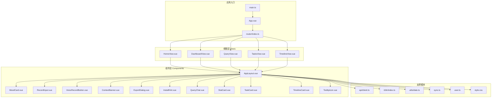
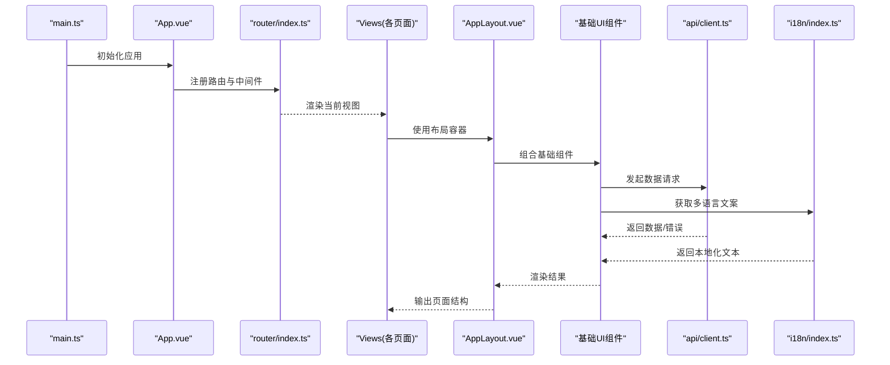
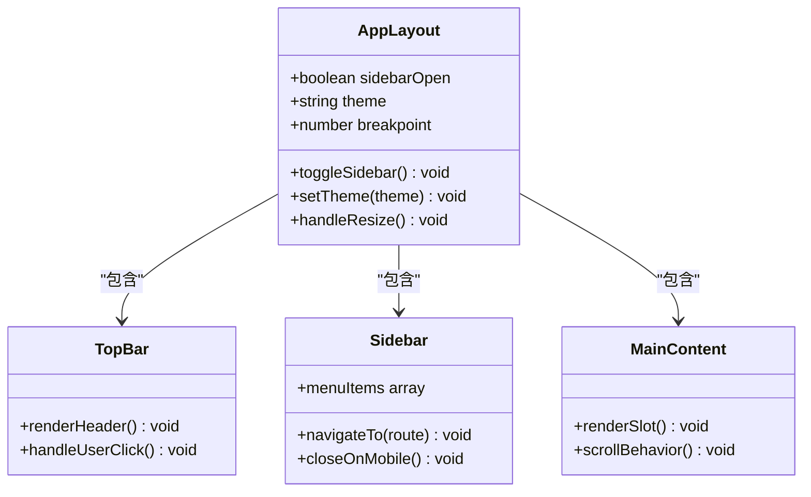
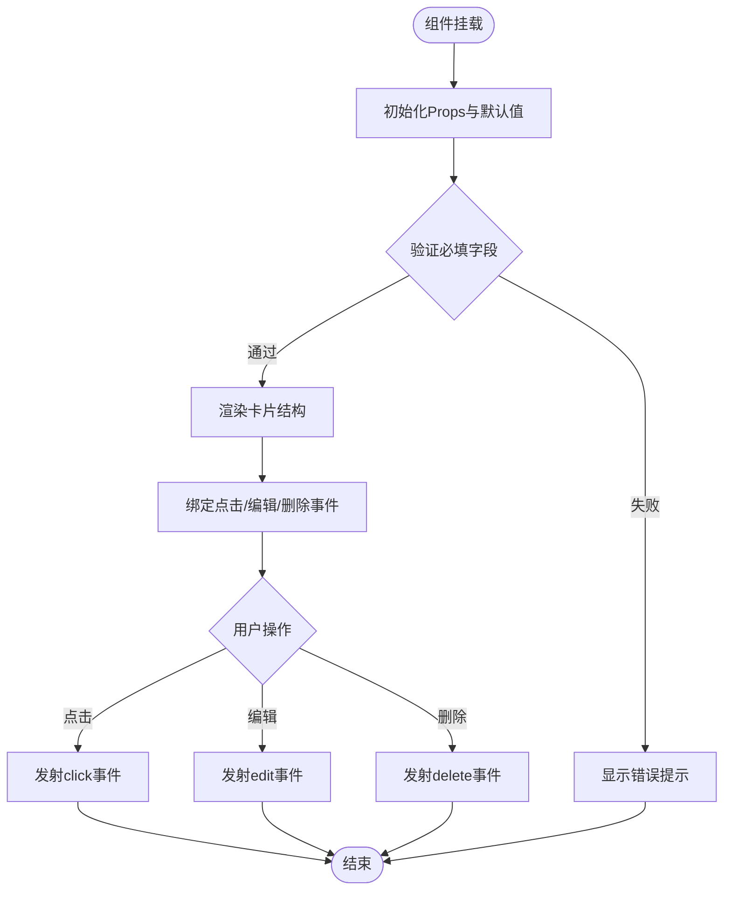
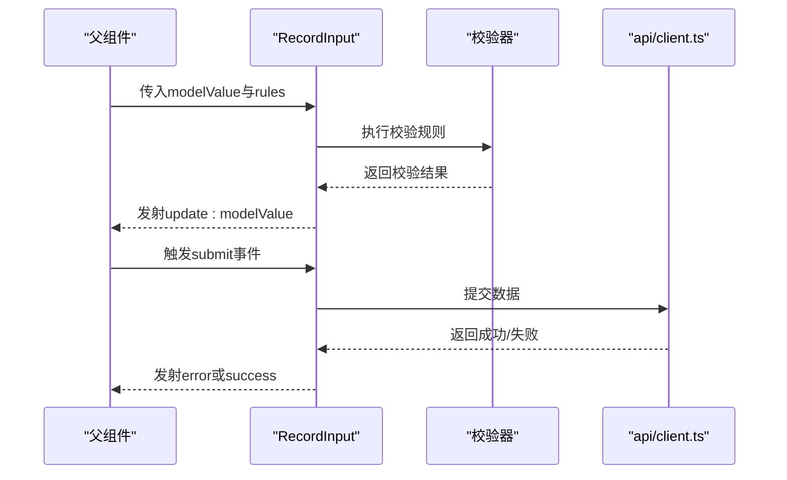
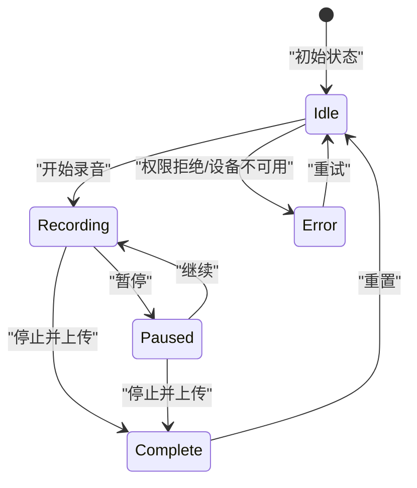
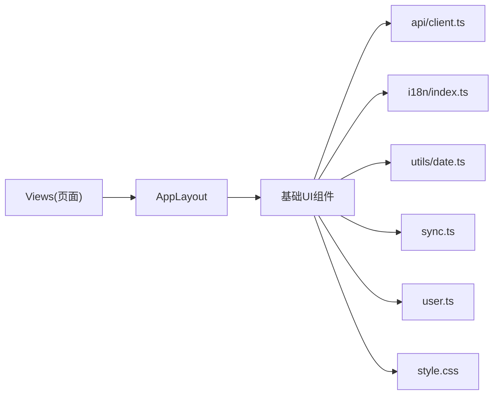

# 组件系统设计

<cite>
**本文引用的文件**   
- [AppLayout.vue](file://frontend/src/components/AppLayout.vue)
- [MoodCard.vue](file://frontend/src/components/MoodCard.vue)
- [RecordInput.vue](file://frontend/src/components/RecordInput.vue)
- [VoiceRecordButton.vue](file://frontend/src/components/VoiceRecordButton.vue)
- [ContextBanner.vue](file://frontend/src/components/ContextBanner.vue)
- [ExportDialog.vue](file://frontend/src/components/ExportDialog.vue)
- [InstallHint.vue](file://frontend/src/components/InstallHint.vue)
- [QueryChat.vue](file://frontend/src/components/QueryChat.vue)
- [StatCard.vue](file://frontend/src/components/StatCard.vue)
- [TaskCard.vue](file://frontend/src/components/TaskCard.vue)
- [TimelineCard.vue](file://frontend/src/components/TimelineCard.vue)
- [TooltipIcon.vue](file://frontend/src/components/TooltipIcon.vue)
- [DashboardView.vue](file://frontend/src/views/DashboardView.vue)
- [HomeView.vue](file://frontend/src/views/HomeView.vue)
- [QueryView.vue](file://frontend/src/views/QueryView.vue)
- [TasksView.vue](file://frontend/src/views/TasksView.vue)
- [TimelineView.vue](file://frontend/src/views/TimelineView.vue)
- [App.vue](file://frontend/src/App.vue)
- [main.ts](file://frontend/src/main.ts)
- [router/index.ts](file://frontend/src/router/index.ts)
- [api/client.ts](file://frontend/src/api/client.ts)
- [i18n/index.ts](file://frontend/src/i18n/index.ts)
- [i18n/locales/zh-CN.ts](file://frontend/src/i18n/locales/zh-CN.ts)
- [i18n/locales/en.ts](file://frontend/src/i18n/locales/en.ts)
- [utils/date.ts](file://frontend/src/utils/date.ts)
- [sync.ts](file://frontend/src/sync.ts)
- [user.ts](file://frontend/src/user.ts)
- [style.css](file://frontend/src/style.css)
- [package.json](file://frontend/package.json)
</cite>

## 目录
1. [简介](#简介)
2. [项目结构](#项目结构)
3. [核心组件](#核心组件)
4. [架构总览](#架构总览)
5. [详细组件分析](#详细组件分析)
6. [依赖关系分析](#依赖关系分析)
7. [性能考虑](#性能考虑)
8. [故障排查指南](#故障排查指南)
9. [结论](#结论)
10. [附录](#附录)

## 简介
本文件面向Vue 3前端工程，系统化梳理组件系统的设计与实现。重点覆盖：
- 单文件组件的组织结构与层次关系
- 基础UI组件（如 MoodCard、RecordInput、VoiceRecordButton 等）的设计模式、Props接口、事件发射机制与插槽使用
- 布局组件 AppLayout 的响应式设计与移动端适配、侧边栏管理
- 组件通信模式、状态提升策略与性能优化技巧
- 结合视图层（Views）与路由、国际化、API客户端等周边模块的最佳实践

## 项目结构
前端采用典型的Vue 3 + Vite工程组织方式，组件按功能划分在 components 目录，页面级视图在 views 目录，路由、国际化、工具函数、API客户端等分别独立模块。整体遵循“单一职责”和“高内聚低耦合”原则，通过组合式API进行逻辑复用。

图表来源
- [main.ts:1-200](file://frontend/src/main.ts#L1-L200)
- [App.vue:1-200](file://frontend/src/App.vue#L1-L200)
- [router/index.ts:1-200](file://frontend/src/router/index.ts#L1-L200)
- [AppLayout.vue:1-200](file://frontend/src/components/AppLayout.vue#L1-L200)

章节来源
- [main.ts:1-200](file://frontend/src/main.ts#L1-L200)
- [App.vue:1-200](file://frontend/src/App.vue#L1-L200)
- [router/index.ts:1-200](file://frontend/src/router/index.ts#L1-L200)

## 核心组件
本节聚焦基础UI组件与布局组件的设计要点，包括Props定义、事件发射、插槽使用与响应式行为。

- MoodCard
  - 设计模式：展示型卡片，用于情绪记录或概览展示
  - Props建议：标题、内容、时间戳、标签、是否可交互等
  - 事件：点击、编辑、删除等自定义事件
  - 插槽：头部、尾部、扩展信息区
  - 复用策略：作为统计卡片、任务卡片、时间线卡片的基类样式与交互模板

- RecordInput
  - 设计模式：输入型表单组件，支持文本、语音、附件等多模态输入
  - Props建议：绑定值、占位符、校验规则、禁用状态、最大长度等
  - 事件：输入变更、提交、取消、错误提示
  - 插槽：前缀图标、后缀按钮、帮助说明
  - 复用策略：在查询对话、任务创建、时间线编辑中复用

- VoiceRecordButton
  - 设计模式：录音控制按钮，封装浏览器媒体能力
  - Props建议：录音时长限制、格式、质量、权限提示文案
  - 事件：开始录音、停止录音、完成上传、错误回调
  - 插槽：图标、状态文案
  - 复用策略：与RecordInput集成，提供语音输入能力

- AppLayout
  - 设计模式：应用级布局容器，包含侧边栏、主内容区、顶部导航
  - Props建议：侧边栏展开状态、主题、宽度断点配置
  - 事件：侧边栏切换、主题切换、路由变化监听
  - 插槽：顶部区域、侧边栏区域、主内容区域、底部区域
  - 响应式：基于断点的侧边栏折叠、移动端抽屉式菜单

章节来源
- [MoodCard.vue:1-200](file://frontend/src/components/MoodCard.vue#L1-L200)
- [RecordInput.vue:1-200](file://frontend/src/components/RecordInput.vue#L1-L200)
- [VoiceRecordButton.vue:1-200](file://frontend/src/components/VoiceRecordButton.vue#L1-L200)
- [AppLayout.vue:1-200](file://frontend/src/components/AppLayout.vue#L1-L200)

## 架构总览
下图展示了从应用入口到视图层再到组件层的调用关系，以及支撑模块（API、国际化、工具函数）如何被组件消费。

图表来源
- [main.ts:1-200](file://frontend/src/main.ts#L1-L200)
- [App.vue:1-200](file://frontend/src/App.vue#L1-L200)
- [router/index.ts:1-200](file://frontend/src/router/index.ts#L1-L200)
- [AppLayout.vue:1-200](file://frontend/src/components/AppLayout.vue#L1-L200)
- [api/client.ts:1-200](file://frontend/src/api/client.ts#L1-L200)
- [i18n/index.ts:1-200](file://frontend/src/i18n/index.ts#L1-L200)

## 详细组件分析

### 布局组件 AppLayout 分析
- 角色与职责
  - 提供全局布局骨架：顶部导航、侧边栏、主内容区、底部信息
  - 管理侧边栏展开/收起状态，处理移动端适配（抽屉式菜单）
  - 集成主题切换、路由守卫、用户信息展示
- 响应式设计实现
  - 使用CSS断点与Flex/Grid布局，在小屏设备自动折叠侧边栏
  - 通过媒体查询与JS监听窗口尺寸变化，动态调整布局
- 侧边栏管理
  - 状态提升：侧边栏展开状态由父级视图或布局自身状态管理
  - 事件透传：点击遮罩关闭、键盘ESC关闭、滚动时自动收起
- 插槽使用
  - 顶部插槽：放置Logo、搜索框、用户头像
  - 侧边栏插槽：导航菜单、快捷入口
  - 主内容插槽：承载具体页面内容
  - 底部插槽：版权信息、版本提示

图表来源
- [AppLayout.vue:1-200](file://frontend/src/components/AppLayout.vue#L1-L200)

章节来源
- [AppLayout.vue:1-200](file://frontend/src/components/AppLayout.vue#L1-L200)

### 基础UI组件 MoodCard 分析
- 设计模式
  - 展示型组件，强调可读性与视觉一致性
  - 支持多种变体：默认、强调、警告、成功
- Props接口建议
  - title: string
  - content: string | object
  - timestamp: number | Date
  - tags: string[]
  - variant: enum
  - interactive: boolean
- 事件发射
  - click: 点击卡片触发
  - edit: 进入编辑模式
  - delete: 删除确认
- 插槽使用
  - header: 自定义头部内容
  - footer: 自定义底部操作
  - extra: 扩展信息区

图表来源
- [MoodCard.vue:1-200](file://frontend/src/components/MoodCard.vue#L1-L200)

章节来源
- [MoodCard.vue:1-200](file://frontend/src/components/MoodCard.vue#L1-L200)

### 输入组件 RecordInput 分析
- 设计模式
  - 受控与非受控两种模式，支持双向绑定
  - 集成校验、防抖、自动保存草稿
- Props接口建议
  - modelValue: string
  - placeholder: string
  - rules: ValidationRule[]
  - disabled: boolean
  - maxLength: number
- 事件发射
  - update:modelValue: 值变更
  - submit: 提交表单
  - error: 校验失败
- 插槽使用
  - prefix: 前缀图标或按钮
  - suffix: 后缀按钮或状态指示
  - help: 帮助说明或示例

图表来源
- [RecordInput.vue:1-200](file://frontend/src/components/RecordInput.vue#L1-L200)
- [api/client.ts:1-200](file://frontend/src/api/client.ts#L1-L200)

章节来源
- [RecordInput.vue:1-200](file://frontend/src/components/RecordInput.vue#L1-L200)
- [api/client.ts:1-200](file://frontend/src/api/client.ts#L1-L200)

### 录音按钮 VoiceRecordButton 分析
- 设计模式
  - 封装浏览器MediaRecorder API，提供统一的录音体验
  - 支持权限检查、错误处理、进度反馈
- Props接口建议
  - durationLimit: number
  - format: string
  - quality: enum
  - permissionMessage: string
- 事件发射
  - start: 开始录音
  - stop: 停止录音
  - complete: 录音完成并上传
  - error: 发生错误
- 插槽使用
  - icon: 自定义图标
  - statusText: 状态文案（录音中、已暂停、已完成）

图表来源
- [VoiceRecordButton.vue:1-200](file://frontend/src/components/VoiceRecordButton.vue#L1-L200)

章节来源
- [VoiceRecordButton.vue:1-200](file://frontend/src/components/VoiceRecordButton.vue#L1-L200)

### 其他基础组件概览
- ContextBanner：上下文提示横幅，支持自动消失与手动关闭
- ExportDialog：导出对话框，封装文件生成与下载流程
- InstallHint：PWA安装提示，引导用户安装应用
- QueryChat：聊天界面组件，支持消息列表、输入框、发送历史
- StatCard：统计卡片，展示关键指标与趋势
- TaskCard：任务卡片，支持状态切换、优先级标记
- TimelineCard：时间线卡片，展示事件序列与关联信息
- TooltipIcon：工具提示图标，提供轻量级帮助信息

章节来源
- [ContextBanner.vue:1-200](file://frontend/src/components/ContextBanner.vue#L1-L200)
- [ExportDialog.vue:1-200](file://frontend/src/components/ExportDialog.vue#L1-L200)
- [InstallHint.vue:1-200](file://frontend/src/components/InstallHint.vue#L1-L200)
- [QueryChat.vue:1-200](file://frontend/src/components/QueryChat.vue#L1-L200)
- [StatCard.vue:1-200](file://frontend/src/components/StatCard.vue#L1-L200)
- [TaskCard.vue:1-200](file://frontend/src/components/TaskCard.vue#L1-L200)
- [TimelineCard.vue:1-200](file://frontend/src/components/TimelineCard.vue#L1-L200)
- [TooltipIcon.vue:1-200](file://frontend/src/components/TooltipIcon.vue#L1-L200)

## 依赖关系分析
组件之间的依赖关系清晰，视图层依赖布局组件，布局组件组合基础UI组件，基础组件通过API客户端与后端交互，同时消费国际化与工具函数。

图表来源
- [AppLayout.vue:1-200](file://frontend/src/components/AppLayout.vue#L1-L200)
- [MoodCard.vue:1-200](file://frontend/src/components/MoodCard.vue#L1-L200)
- [RecordInput.vue:1-200](file://frontend/src/components/RecordInput.vue#L1-L200)
- [VoiceRecordButton.vue:1-200](file://frontend/src/components/VoiceRecordButton.vue#L1-L200)
- [api/client.ts:1-200](file://frontend/src/api/client.ts#L1-L200)
- [i18n/index.ts:1-200](file://frontend/src/i18n/index.ts#L1-L200)
- [utils/date.ts:1-200](file://frontend/src/utils/date.ts#L1-L200)
- [sync.ts:1-200](file://frontend/src/sync.ts#L1-L200)
- [user.ts:1-200](file://frontend/src/user.ts#L1-L200)
- [style.css:1-200](file://frontend/src/style.css#L1-L200)

章节来源
- [AppLayout.vue:1-200](file://frontend/src/components/AppLayout.vue#L1-L200)
- [api/client.ts:1-200](file://frontend/src/api/client.ts#L1-L200)
- [i18n/index.ts:1-200](file://frontend/src/i18n/index.ts#L1-L200)

## 性能考虑
- 组件懒加载：对重型组件（如QueryChat、ExportDialog）使用动态导入与条件渲染
- 虚拟滚动：长列表场景（时间线、聊天记录）使用虚拟滚动减少DOM节点
- 计算属性缓存：复杂计算使用computed避免重复计算
- 防抖节流：输入框、滚动事件使用防抖节流降低重绘频率
- 图片与资源优化：使用WebP格式、懒加载、CDN加速
- 状态提升：将共享状态提升到父组件或Pinia store，避免重复订阅
- 事件委托：大量子元素事件使用事件委托减少监听器数量

[本节为通用性能指导，不直接分析具体文件]

## 故障排查指南
- 录音权限问题
  - 检查浏览器权限设置与HTTPS环境
  - 捕获NotAllowedError与NotFoundError并提示用户
- 网络请求失败
  - 统一错误处理与重试机制
  - 记录请求日志与响应码
- 国际化缺失
  - 确保所有文案键存在对应翻译
  - 提供回退语言与默认文案
- 响应式布局异常
  - 检查媒体查询断点与容器宽度
  - 调试移动端视口与缩放比例

章节来源
- [VoiceRecordButton.vue:1-200](file://frontend/src/components/VoiceRecordButton.vue#L1-L200)
- [api/client.ts:1-200](file://frontend/src/api/client.ts#L1-L200)
- [i18n/index.ts:1-200](file://frontend/src/i18n/index.ts#L1-L200)
- [AppLayout.vue:1-200](file://frontend/src/components/AppLayout.vue#L1-L200)

## 结论
本组件系统以Vue 3组合式API为核心，通过清晰的层次结构与职责分离，实现了高内聚、低耦合的组件生态。基础UI组件提供丰富的Props、事件与插槽能力，布局组件负责响应式与侧边栏管理，视图层专注于业务逻辑与数据流。通过状态提升、性能优化与完善的错误处理，系统在可维护性、可扩展性与用户体验方面达到良好平衡。

[本节为总结性内容，不直接分析具体文件]

## 附录
- 最佳实践清单
  - 组件命名：使用PascalCase，语义化命名
  - Props定义：明确类型、默认值、必填校验
  - 事件命名：使用动词短语，如submit、toggle、select
  - 插槽设计：提供默认插槽与具名插槽，保持灵活性
  - 样式隔离：使用scoped样式或CSS Modules
  - 测试覆盖：单元测试与端到端测试结合
  - 文档更新：组件变更同步更新文档与示例

[本节为补充信息，不直接分析具体文件]