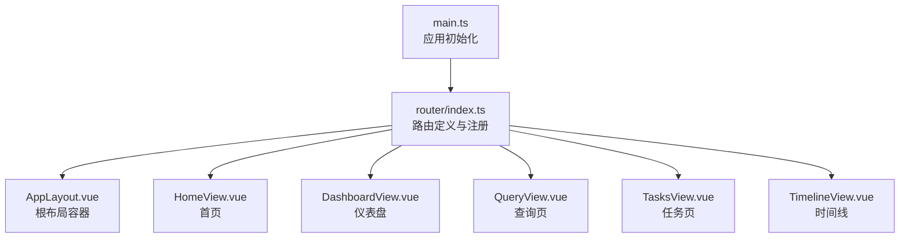
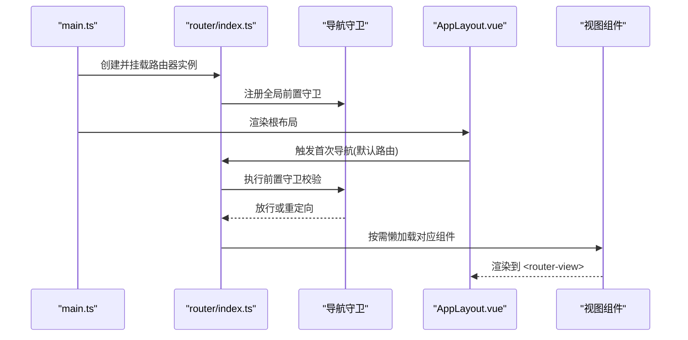
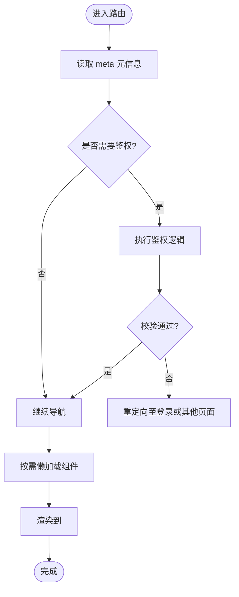
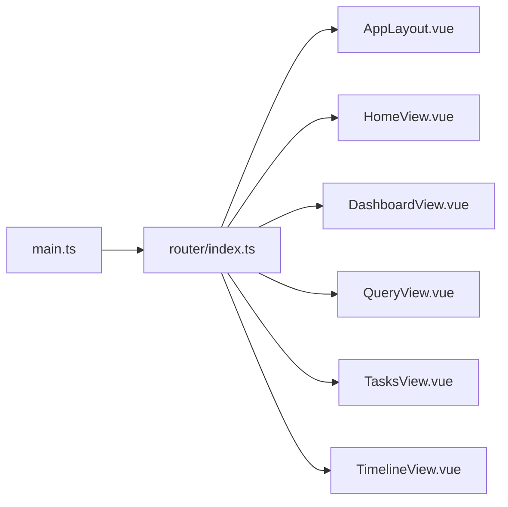

# 路由架构设计

<cite>
**本文引用的文件**   
- [frontend/src/router/index.ts](file://frontend/src/router/index.ts)
- [frontend/src/views/DashboardView.vue](file://frontend/src/views/DashboardView.vue)
- [frontend/src/views/HomeView.vue](file://frontend/src/views/HomeView.vue)
- [frontend/src/views/QueryView.vue](file://frontend/src/views/QueryView.vue)
- [frontend/src/views/TasksView.vue](file://frontend/src/views/TasksView.vue)
- [frontend/src/views/TimelineView.vue](file://frontend/src/views/TimelineView.vue)
- [frontend/src/components/AppLayout.vue](file://frontend/src/components/AppLayout.vue)
- [frontend/src/main.ts](file://frontend/src/main.ts)
</cite>

## 目录
1. [简介](#简介)
2. [项目结构](#项目结构)
3. [核心组件](#核心组件)
4. [架构总览](#架构总览)
5. [详细组件分析](#详细组件分析)
6. [依赖分析](#依赖分析)
7. [性能考虑](#性能考虑)
8. [故障排查指南](#故障排查指南)
9. [结论](#结论)
10. [附录](#附录)

## 简介
本文件面向Vue Router在该项目中的路由架构设计与实现，重点围绕以下方面展开：
- 路由配置文件 index.ts 的结构与职责
- 路由守卫、动态路由与嵌套路由的实现方式
- 视图组件（DashboardView、HomeView、QueryView、TasksView、TimelineView）的路由映射与参数传递机制
- 路由懒加载策略、元信息配置与导航守卫实现
- 路由状态管理、历史记录处理与SEO优化建议
- 结合代码示例路径的最佳实践说明

## 项目结构
前端采用Vite + Vue 3 + TypeScript技术栈，路由相关代码集中在 frontend/src/router/index.ts，视图组件位于 frontend/src/views，布局组件位于 frontend/src/components。入口文件为 frontend/src/main.ts。

**图表来源** 
- [frontend/src/main.ts](file://frontend/src/main.ts)
- [frontend/src/router/index.ts](file://frontend/src/router/index.ts)
- [frontend/src/components/AppLayout.vue](file://frontend/src/components/AppLayout.vue)
- [frontend/src/views/HomeView.vue](file://frontend/src/views/HomeView.vue)
- [frontend/src/views/DashboardView.vue](file://frontend/src/views/DashboardView.vue)
- [frontend/src/views/QueryView.vue](file://frontend/src/views/QueryView.vue)
- [frontend/src/views/TasksView.vue](file://frontend/src/views/TasksView.vue)
- [frontend/src/views/TimelineView.vue](file://frontend/src/views/TimelineView.vue)

**章节来源**
- [frontend/src/main.ts](file://frontend/src/main.ts)
- [frontend/src/router/index.ts](file://frontend/src/router/index.ts)

## 核心组件
- 路由配置中心：frontend/src/router/index.ts
  - 负责路由表定义、懒加载、元信息、导航守卫、历史模式等
- 视图组件：
  - HomeView.vue：首页
  - DashboardView.vue：仪表盘
  - QueryView.vue：查询页
  - TasksView.vue：任务页
  - TimelineView.vue：时间线
- 布局组件：
  - AppLayout.vue：作为根布局容器，承载 <router-view> 与全局导航

**章节来源**
- [frontend/src/router/index.ts](file://frontend/src/router/index.ts)
- [frontend/src/views/HomeView.vue](file://frontend/src/views/HomeView.vue)
- [frontend/src/views/DashboardView.vue](file://frontend/src/views/DashboardView.vue)
- [frontend/src/views/QueryView.vue](file://frontend/src/views/QueryView.vue)
- [frontend/src/views/TasksView.vue](file://frontend/src/views/TasksView.vue)
- [frontend/src/views/TimelineView.vue](file://frontend/src/views/TimelineView.vue)
- [frontend/src/components/AppLayout.vue](file://frontend/src/components/AppLayout.vue)

## 架构总览
下图展示从应用启动到页面渲染的完整流程，包括路由注册、导航守卫拦截、组件懒加载与渲染。

**图表来源** 
- [frontend/src/main.ts](file://frontend/src/main.ts)
- [frontend/src/router/index.ts](file://frontend/src/router/index.ts)
- [frontend/src/components/AppLayout.vue](file://frontend/src/components/AppLayout.vue)

## 详细组件分析

### 路由配置中心（index.ts）
- 路由表组织
  - 使用命名路由与路径别名提升可读性与可维护性
  - 通过懒加载函数减少首屏体积，提高加载性能
- 元信息（meta）
  - 用于权限控制、页面标题、SEO标签、面包屑等
- 导航守卫
  - 全局前置守卫：统一鉴权、埋点、国际化切换、登录态校验
  - 路由独享守卫：针对特定路由的细粒度控制
  - 组件内守卫：组件级生命周期钩子（如 onBeforeRouteLeave）
- 动态路由与嵌套路由
  - 动态段（如 :id）用于参数传递
  - 嵌套路由配合布局组件实现多级页面结构
- 历史模式与SEO
  - 根据部署环境选择 history 或 hash 模式
  - 提供SSR/预渲染时的SEO建议

**图表来源** 
- [frontend/src/router/index.ts](file://frontend/src/router/index.ts)

**章节来源**
- [frontend/src/router/index.ts](file://frontend/src/router/index.ts)

### 视图组件与路由映射
- HomeView.vue
  - 路由：通常为根路径 "/"
  - 用途：应用入口、引导页或功能概览
- DashboardView.vue
  - 路由：如 "/dashboard"
  - 用途：数据概览、统计卡片、快捷入口
- QueryView.vue
  - 路由：如 "/query"
  - 用途：搜索与查询交互，支持查询参数与动态筛选
- TasksView.vue
  - 路由：如 "/tasks"
  - 用途：任务列表、状态管理与操作
- TimelineView.vue
  - 路由：如 "/timeline"
  - 用途：时间线展示、事件流

参数传递机制
- 路径参数：通过动态段（如 /tasks/:id）传递
- 查询参数：通过URL query（如 ?q=...）传递
- 路由状态：通过路由元信息与全局状态管理（可选）

最佳实践
- 将公共逻辑抽离为组合式函数或工具模块
- 使用命名路由避免硬编码路径
- 对敏感路由增加元信息标记与守卫校验

**章节来源**
- [frontend/src/views/HomeView.vue](file://frontend/src/views/HomeView.vue)
- [frontend/src/views/DashboardView.vue](file://frontend/src/views/DashboardView.vue)
- [frontend/src/views/QueryView.vue](file://frontend/src/views/QueryView.vue)
- [frontend/src/views/TasksView.vue](file://frontend/src/views/TasksView.vue)
- [frontend/src/views/TimelineView.vue](file://frontend/src/views/TimelineView.vue)

### 布局组件（AppLayout.vue）
- 作为根布局容器，包含全局导航栏、侧边栏与 <router-view>
- 可通过路由元信息控制显示/隐藏区域
- 适合放置全局样式、主题切换与国际化上下文

**章节来源**
- [frontend/src/components/AppLayout.vue](file://frontend/src/components/AppLayout.vue)

## 依赖分析
- main.ts 负责创建应用实例并挂载路由器
- router/index.ts 依赖各视图组件进行懒加载
- AppLayout.vue 作为布局容器被所有页面共享
- 视图组件之间不直接耦合，通过路由参数与事件通信

**图表来源** 
- [frontend/src/main.ts](file://frontend/src/main.ts)
- [frontend/src/router/index.ts](file://frontend/src/router/index.ts)
- [frontend/src/components/AppLayout.vue](file://frontend/src/components/AppLayout.vue)
- [frontend/src/views/HomeView.vue](file://frontend/src/views/HomeView.vue)
- [frontend/src/views/DashboardView.vue](file://frontend/src/views/DashboardView.vue)
- [frontend/src/views/QueryView.vue](file://frontend/src/views/QueryView.vue)
- [frontend/src/views/TasksView.vue](file://frontend/src/views/TasksView.vue)
- [frontend/src/views/TimelineView.vue](file://frontend/src/views/TimelineView.vue)

**章节来源**
- [frontend/src/main.ts](file://frontend/src/main.ts)
- [frontend/src/router/index.ts](file://frontend/src/router/index.ts)

## 性能考虑
- 路由懒加载
  - 使用动态 import() 按需加载组件，降低首屏包体
  - 合理拆分页面与公共模块，避免过度拆分导致请求过多
- 缓存策略
  - 对频繁访问的页面可使用 keep-alive 缓存组件实例
  - 结合路由元信息控制缓存范围
- 预取与预加载
  - 对可能跳转的路由进行资源预取，提升用户体验
- SEO优化
  - 使用 history 模式并确保服务端正确回退
  - 为关键页面设置 meta 描述与标题，必要时启用SSR/预渲染

[本节为通用指导，无需具体文件引用]

## 故障排查指南
常见问题与定位方法
- 404错误
  - 检查路由表是否包含目标路径
  - 确认部署环境下的history回退配置
- 导航守卫死循环
  - 避免在守卫中再次触发相同路由跳转
  - 使用 next(false) 或 next({ replace: true }) 谨慎处理
- 参数丢失
  - 检查动态段与查询参数是否正确传递
  - 确保组件内正确接收 params 与 query
- 权限问题
  - 核对用户角色与路由元信息匹配
  - 检查登录态与令牌有效性

**章节来源**
- [frontend/src/router/index.ts](file://frontend/src/router/index.ts)

## 结论
本项目通过集中式路由配置、懒加载与导航守卫实现了清晰、可扩展且高性能的前端路由架构。视图组件按功能划分，布局组件统一管理页面结构，整体耦合度低、可维护性强。建议在后续迭代中持续优化路由拆分、缓存策略与SEO配置，以提升用户体验与可发现性。

[本节为总结性内容，无需具体文件引用]

## 附录
- 路由最佳实践清单
  - 使用命名路由与路径别名
  - 元信息驱动权限与UI控制
  - 全局与局部守卫分层管理
  - 懒加载与缓存策略结合
  - 统一的错误与重定向处理
- 参考文件路径
  - 路由配置：[frontend/src/router/index.ts](file://frontend/src/router/index.ts)
  - 视图组件：[frontend/src/views/*.vue](file://frontend/src/views/)
  - 布局组件：[frontend/src/components/AppLayout.vue](file://frontend/src/components/AppLayout.vue)
  - 应用入口：[frontend/src/main.ts](file://frontend/src/main.ts)

[本节为补充信息，无需具体文件引用]