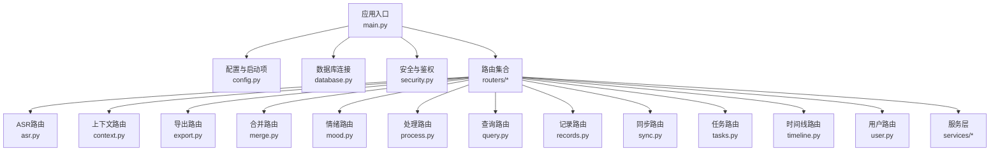
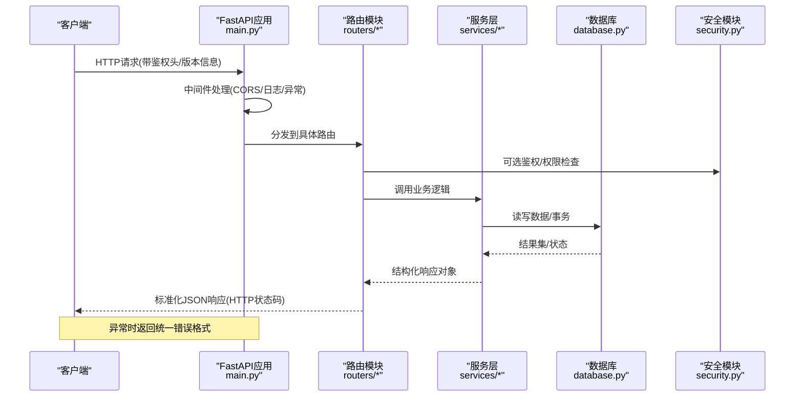
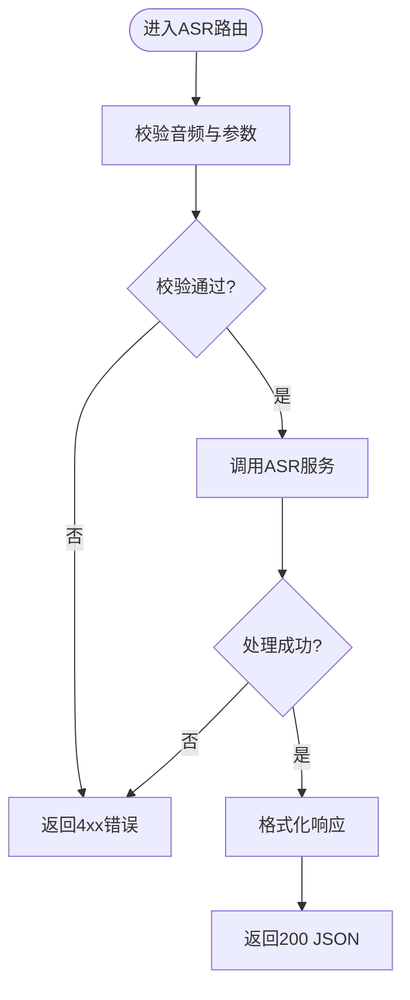
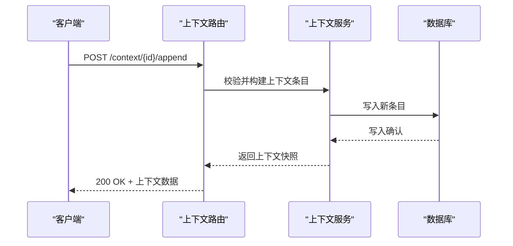
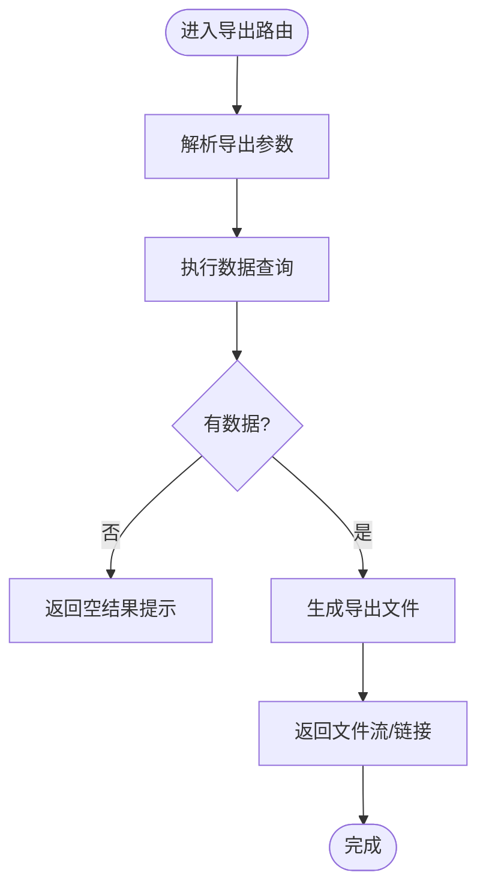
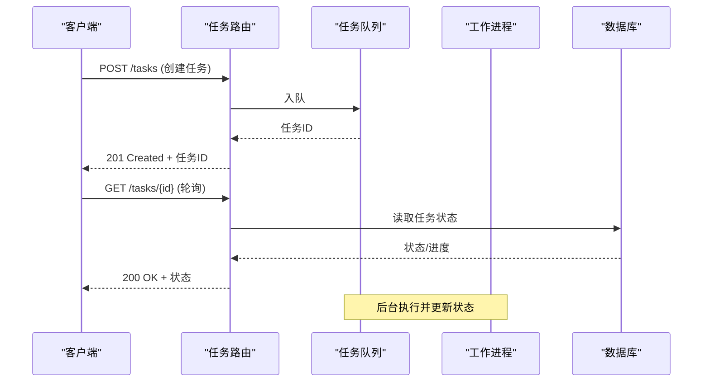
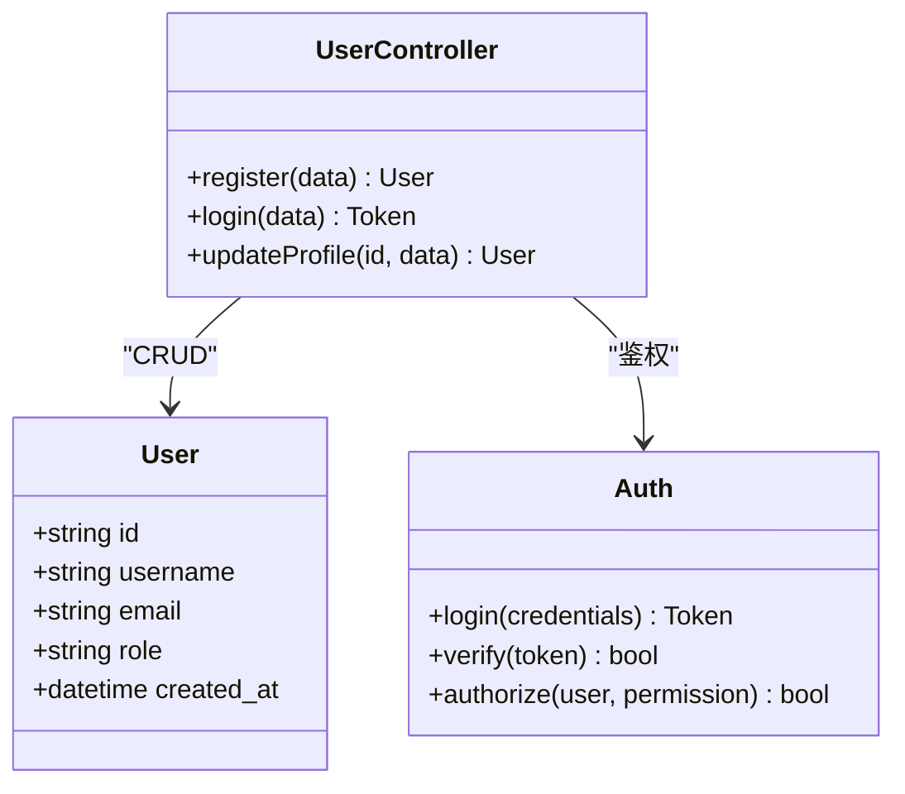
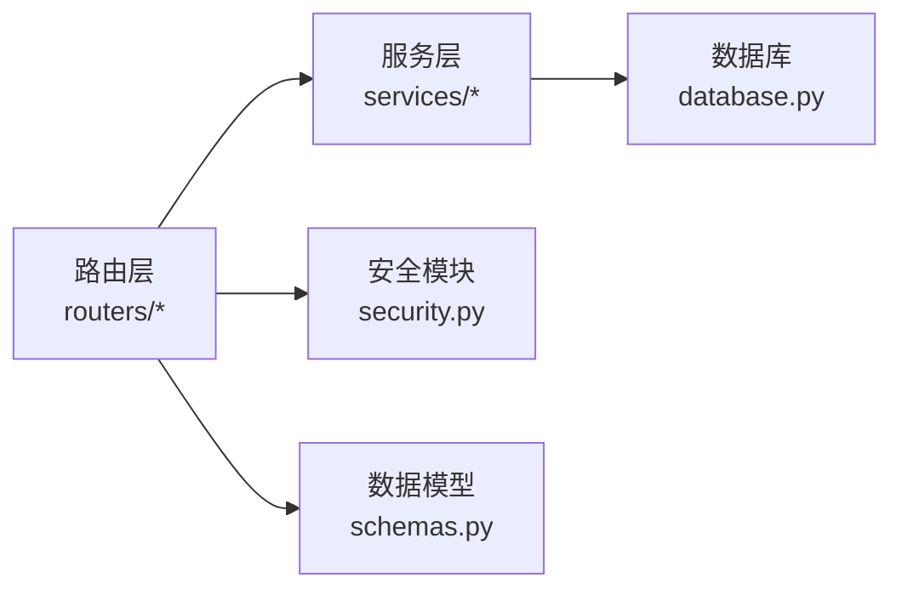

# API路由设计

<cite>
**本文档引用的文件**   
- [backend/main.py](file://backend/main.py)
- [backend/config.py](file://backend/config.py)
- [backend/database.py](file://backend/database.py)
- [backend/schemas.py](file://backend/schemas.py)
- [backend/security.py](file://backend/security.py)
- [backend/routers/asr.py](file://backend/routers/asr.py)
- [backend/routers/context.py](file://backend/routers/context.py)
- [backend/routers/export.py](file://backend/routers/export.py)
- [backend/routers/merge.py](file://backend/routers/merge.py)
- [backend/routers/mood.py](file://backend/routers/mood.py)
- [backend/routers/process.py](file://backend/routers/process.py)
- [backend/routers/query.py](file://backend/routers/query.py)
- [backend/routers/records.py](file://backend/routers/records.py)
- [backend/routers/sync.py](file://backend/routers/sync.py)
- [backend/routers/tasks.py](file://backend/routers/tasks.py)
- [backend/routers/timeline.py](file://backend/routers/timeline.py)
- [backend/routers/user.py](file://backend/routers/user.py)
- [backend/services/fuzzy_match.py](file://backend/services/fuzzy_match.py)
- [backend/services/processor.py](file://backend/services/processor.py)
</cite>

## 目录
1. [简介](#简介)
2. [项目结构](#项目结构)
3. [核心组件](#核心组件)
4. [架构总览](#架构总览)
5. [详细组件分析](#详细组件分析)
6. [依赖关系分析](#依赖关系分析)
7. [性能考虑](#性能考虑)
8. [故障排查指南](#故障排查指南)
9. [结论](#结论)
10. [附录](#附录)

## 简介
本文件面向FastAPI后端的路由设计与实现，系统性阐述ASR语音识别、上下文管理、数据导出、任务处理、用户管理等核心功能的路由组织方式、请求参数验证、响应模型与错误处理机制。文档同时给出RESTful设计规范、HTTP状态码使用建议、请求响应格式标准化以及API版本管理策略，并总结中间件的使用模式与最佳实践，帮助读者快速理解并扩展系统能力。

## 项目结构
后端采用“按功能划分路由”的组织方式：每个业务域一个路由模块（如asr、context、export、tasks、user等），统一在应用入口挂载到不同前缀下；公共的Pydantic模型集中在schemas.py中定义，数据库连接与配置分别位于database.py与config.py，安全鉴权逻辑封装于security.py，服务层逻辑（如模糊匹配、处理器）位于services目录。

图表来源
- [backend/main.py](file://backend/main.py)
- [backend/config.py](file://backend/config.py)
- [backend/database.py](file://backend/database.py)
- [backend/security.py](file://backend/security.py)
- [backend/routers/asr.py](file://backend/routers/asr.py)
- [backend/routers/context.py](file://backend/routers/context.py)
- [backend/routers/export.py](file://backend/routers/export.py)
- [backend/routers/merge.py](file://backend/routers/merge.py)
- [backend/routers/mood.py](file://backend/routers/mood.py)
- [backend/routers/process.py](file://backend/routers/process.py)
- [backend/routers/query.py](file://backend/routers/query.py)
- [backend/routers/records.py](file://backend/routers/records.py)
- [backend/routers/sync.py](file://backend/routers/sync.py)
- [backend/routers/tasks.py](file://backend/routers/tasks.py)
- [backend/routers/timeline.py](file://backend/routers/timeline.py)
- [backend/routers/user.py](file://backend/routers/user.py)
- [backend/services/fuzzy_match.py](file://backend/services/fuzzy_match.py)
- [backend/services/processor.py](file://backend/services/processor.py)

章节来源
- [backend/main.py](file://backend/main.py)
- [backend/config.py](file://backend/config.py)
- [backend/database.py](file://backend/database.py)
- [backend/schemas.py](file://backend/schemas.py)
- [backend/security.py](file://backend/security.py)

## 核心组件
- 应用入口与挂载
  - 应用实例创建、全局中间件注册、CORS与调试开关、OpenAPI文档路径、路由前缀与版本化策略均在入口文件中集中配置。
  - 各功能路由以独立模块形式导入并按前缀挂载，便于隔离与维护。
- 配置与数据库
  - 配置项通过环境变量或配置文件加载，数据库连接池与会话生命周期由database.py统一管理。
- 安全与鉴权
  - 统一的认证与授权逻辑封装在security.py中，供路由层按需调用。
- 数据模型与校验
  - schemas.py集中定义请求体与响应体的Pydantic模型，确保输入校验与输出序列化的一致性。
- 服务层
  - services目录提供领域无关的业务能力（如模糊匹配、通用处理器），被多个路由复用。

章节来源
- [backend/main.py](file://backend/main.py)
- [backend/config.py](file://backend/config.py)
- [backend/database.py](file://backend/database.py)
- [backend/schemas.py](file://backend/schemas.py)
- [backend/security.py](file://backend/security.py)
- [backend/services/fuzzy_match.py](file://backend/services/fuzzy_match.py)
- [backend/services/processor.py](file://backend/services/processor.py)

## 架构总览
下图展示了从客户端请求到路由处理、服务层调用与数据库交互的整体流程，以及错误处理与响应标准化的关键点。

图表来源
- [backend/main.py](file://backend/main.py)
- [backend/routers/asr.py](file://backend/routers/asr.py)
- [backend/routers/context.py](file://backend/routers/context.py)
- [backend/routers/export.py](file://backend/routers/export.py)
- [backend/routers/tasks.py](file://backend/routers/tasks.py)
- [backend/routers/user.py](file://backend/routers/user.py)
- [backend/services/processor.py](file://backend/services/processor.py)
- [backend/database.py](file://backend/database.py)
- [backend/security.py](file://backend/security.py)

## 详细组件分析

### ASR语音识别路由(asr.py)
- 职责
  - 接收音频流或文件上传，触发ASR转写，返回文本片段或完整转写结果。
- 请求参数验证
  - 使用表单或多部分上传字段进行音频数据校验，支持语言、采样率、分段策略等可选参数。
- 响应模型
  - 返回包含转写文本、置信度、时间戳段落的统一结构。
- 错误处理
  - 对无效音频格式、解码失败、超时等场景返回明确的错误码与消息。
- 典型流程
  - 上传音频 -> 校验与预处理 -> 调用ASR服务 -> 解析结果 -> 返回标准化响应。

图表来源
- [backend/routers/asr.py](file://backend/routers/asr.py)
- [backend/schemas.py](file://backend/schemas.py)
- [backend/services/processor.py](file://backend/services/processor.py)

章节来源
- [backend/routers/asr.py](file://backend/routers/asr.py)
- [backend/schemas.py](file://backend/schemas.py)
- [backend/services/processor.py](file://backend/services/processor.py)

### 上下文管理路由(context.py)
- 职责
  - 维护对话或会话上下文，支持上下文追加、检索、清理与快照。
- 请求参数验证
  - 基于会话ID与上下文条目结构进行必填校验与长度限制。
- 响应模型
  - 返回上下文列表、最新摘要、版本号等。
- 错误处理
  - 会话不存在、上下文超限、并发写入冲突等错误统一返回。
- 典型流程
  - 读取上下文 -> 校验与合并 -> 持久化 -> 返回更新后的上下文。

图表来源
- [backend/routers/context.py](file://backend/routers/context.py)
- [backend/schemas.py](file://backend/schemas.py)
- [backend/database.py](file://backend/database.py)

章节来源
- [backend/routers/context.py](file://backend/routers/context.py)
- [backend/schemas.py](file://backend/schemas.py)
- [backend/database.py](file://backend/database.py)

### 数据导出路由(export.py)
- 职责
  - 将查询结果或报表导出为CSV/Excel/PDF等格式，支持分页与过滤条件。
- 请求参数验证
  - 导出类型、时间范围、筛选条件、分页参数的合法性校验。
- 响应模型
  - 返回下载链接或二进制流，附带文件名与MIME类型。
- 错误处理
  - 无数据、导出失败、权限不足等错误统一返回。
- 典型流程
  - 解析导出参数 -> 生成查询 -> 导出数据 -> 返回下载响应。

图表来源
- [backend/routers/export.py](file://backend/routers/export.py)
- [backend/schemas.py](file://backend/schemas.py)
- [backend/database.py](file://backend/database.py)

章节来源
- [backend/routers/export.py](file://backend/routers/export.py)
- [backend/schemas.py](file://backend/schemas.py)
- [backend/database.py](file://backend/database.py)

### 任务处理路由(tasks.py)
- 职责
  - 创建、查询、取消与轮询异步任务状态，支持任务队列与重试。
- 请求参数验证
  - 任务类型、参数结构、优先级等校验。
- 响应模型
  - 返回任务ID、状态、进度、结果或错误信息。
- 错误处理
  - 任务不存在、重复提交、队列满等错误统一返回。
- 典型流程
  - 提交任务 -> 入队 -> 后台执行 -> 状态查询 -> 获取结果。

图表来源
- [backend/routers/tasks.py](file://backend/routers/tasks.py)
- [backend/schemas.py](file://backend/schemas.py)
- [backend/database.py](file://backend/database.py)

章节来源
- [backend/routers/tasks.py](file://backend/routers/tasks.py)
- [backend/schemas.py](file://backend/schemas.py)
- [backend/database.py](file://backend/database.py)

### 用户管理路由(user.py)
- 职责
  - 用户注册、登录、资料更新、角色权限管理。
- 请求参数验证
  - 用户名、邮箱、密码强度、角色枚举等校验。
- 响应模型
  - 返回用户基本信息、令牌、权限清单。
- 错误处理
  - 用户已存在、凭证错误、权限不足等错误统一返回。
- 典型流程
  - 鉴权 -> 校验输入 -> 操作用户数据 -> 返回用户对象或错误。

图表来源
- [backend/routers/user.py](file://backend/routers/user.py)
- [backend/schemas.py](file://backend/schemas.py)
- [backend/security.py](file://backend/security.py)

章节来源
- [backend/routers/user.py](file://backend/routers/user.py)
- [backend/schemas.py](file://backend/schemas.py)
- [backend/security.py](file://backend/security.py)

### 其他路由概览
- merge.py：数据合并与去重，适用于多源数据整合。
- mood.py：情绪标签与统计，用于情感分析展示。
- process.py：通用数据处理管道，支持批处理与转换。
- query.py：高级查询接口，支持复杂条件与聚合。
- records.py：记录CRUD，支撑业务实体管理。
- sync.py：数据同步接口，支持增量与全量同步。
- timeline.py：时间线视图，聚合事件与变更记录。

章节来源
- [backend/routers/merge.py](file://backend/routers/merge.py)
- [backend/routers/mood.py](file://backend/routers/mood.py)
- [backend/routers/process.py](file://backend/routers/process.py)
- [backend/routers/query.py](file://backend/routers/query.py)
- [backend/routers/records.py](file://backend/routers/records.py)
- [backend/routers/sync.py](file://backend/routers/sync.py)
- [backend/routers/timeline.py](file://backend/routers/timeline.py)

## 依赖关系分析
- 路由与服务层解耦：路由仅负责参数校验、鉴权与响应组装，业务逻辑下沉至services。
- 数据库访问集中化：所有持久化操作通过database.py提供的会话与连接管理。
- 安全模块复用：security.py提供统一的鉴权与权限判断，避免在各路由重复实现。
- 模型集中管理：schemas.py统一描述请求与响应结构，保证前后端契约一致。

图表来源
- [backend/routers/asr.py](file://backend/routers/asr.py)
- [backend/routers/context.py](file://backend/routers/context.py)
- [backend/routers/export.py](file://backend/routers/export.py)
- [backend/routers/tasks.py](file://backend/routers/tasks.py)
- [backend/routers/user.py](file://backend/routers/user.py)
- [backend/services/fuzzy_match.py](file://backend/services/fuzzy_match.py)
- [backend/services/processor.py](file://backend/services/processor.py)
- [backend/database.py](file://backend/database.py)
- [backend/security.py](file://backend/security.py)
- [backend/schemas.py](file://backend/schemas.py)

章节来源
- [backend/routers/asr.py](file://backend/routers/asr.py)
- [backend/routers/context.py](file://backend/routers/context.py)
- [backend/routers/export.py](file://backend/routers/export.py)
- [backend/routers/tasks.py](file://backend/routers/tasks.py)
- [backend/routers/user.py](file://backend/routers/user.py)
- [backend/services/fuzzy_match.py](file://backend/services/fuzzy_match.py)
- [backend/services/processor.py](file://backend/services/processor.py)
- [backend/database.py](file://backend/database.py)
- [backend/security.py](file://backend/security.py)
- [backend/schemas.py](file://backend/schemas.py)

## 性能考虑
- 异步与并发
  - 长耗时任务（如ASR转写、导出）应使用异步任务队列与后台工作者，避免阻塞请求线程。
- 缓存策略
  - 对热点上下文与查询结果引入缓存层，减少数据库压力。
- 分页与限流
  - 所有列表接口默认分页，结合速率限制保护后端资源。
- 数据库优化
  - 合理索引、批量写入与事务边界控制，避免锁竞争。
- 响应压缩
  - 大体积响应启用Gzip压缩，降低带宽占用。

[本节为通用指导，不直接分析具体文件]

## 故障排查指南
- 常见错误分类
  - 4xx客户端错误：参数校验失败、权限不足、资源不存在。
  - 5xx服务端错误：数据库连接失败、外部服务超时、内部异常。
- 定位方法
  - 查看路由日志与异常堆栈，确认请求参数与上下文。
  - 检查数据库连接池与会话状态，确认事务是否回滚。
  - 核对安全模块的鉴权逻辑与权限配置。
- 恢复策略
  - 重试机制：对幂等请求实施指数退避重试。
  - 降级策略：关键服务不可用时返回友好错误与替代方案。
  - 监控告警：对错误率与延迟设置阈值告警。

章节来源
- [backend/main.py](file://backend/main.py)
- [backend/security.py](file://backend/security.py)
- [backend/database.py](file://backend/database.py)

## 结论
本项目的FastAPI路由设计遵循清晰的模块化与分层原则，通过schemas统一数据契约、security统一鉴权、services承载业务逻辑、database集中管理持久化。ASR、上下文、导出、任务、用户等核心功能均具备完善的参数校验、响应模型与错误处理机制。配合合理的中间件、缓存与异步策略，可在保证可维护性的同时提升性能与稳定性。

[本节为总结性内容，不直接分析具体文件]

## 附录

### RESTful API设计规范
- 资源命名
  - 使用名词复数表示资源集合，如/users、/tasks、/contexts。
- HTTP方法
  - GET读取、POST创建、PUT更新、PATCH部分更新、DELETE删除。
- 状态码
  - 200成功、201创建、204无内容、400参数错误、401未认证、403权限不足、404资源不存在、422校验失败、500服务器错误。
- 版本管理
  - URL前缀版本化（/api/v1/...）或请求头版本控制，保持向后兼容。
- 请求响应格式
  - 统一JSON结构，包含data、error、message、code等字段。
- 分页与排序
  - 标准分页参数page、size、sort、order。

[本节为概念性说明，不直接分析具体文件]

### 中间件使用模式与最佳实践
- CORS
  - 允许前端域名与必要方法头，限制跨域范围。
- 日志
  - 记录请求方法、路径、状态码、耗时与异常信息。
- 异常处理
  - 捕获未处理异常，转换为统一错误响应。
- 鉴权
  - 在路由前拦截并校验令牌与权限。
- 性能
  - 避免在中间件中执行重IO操作，必要时异步化。

[本节为概念性说明，不直接分析具体文件]