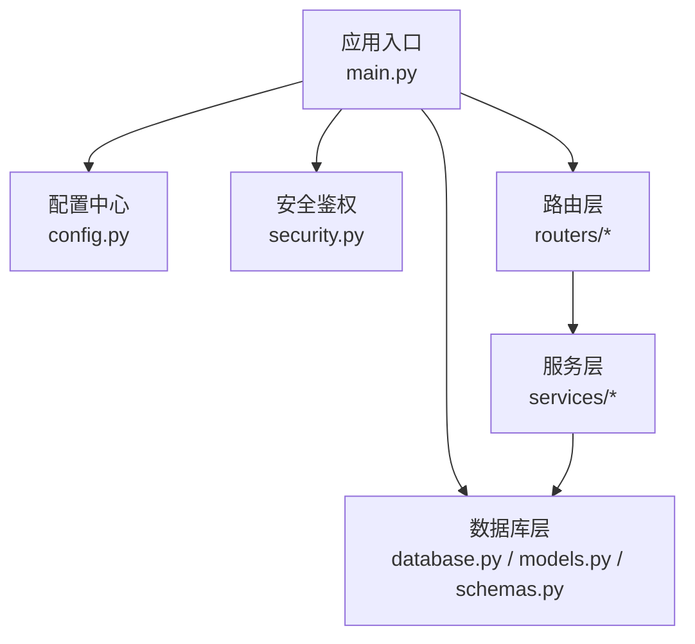
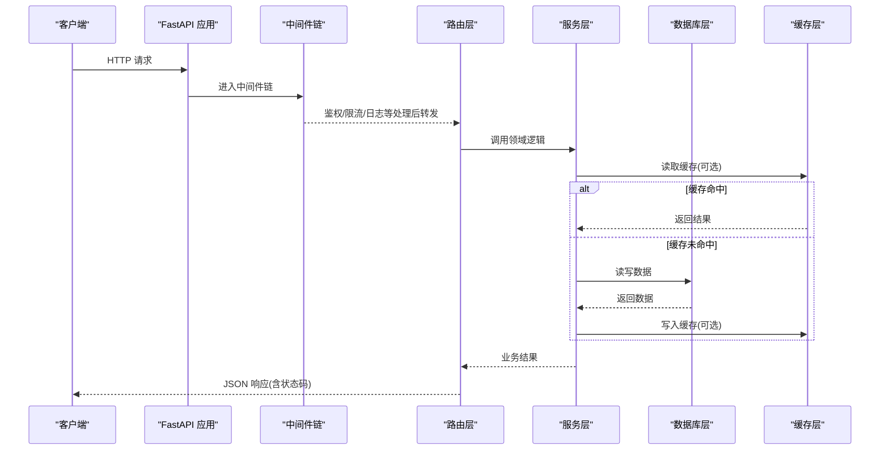
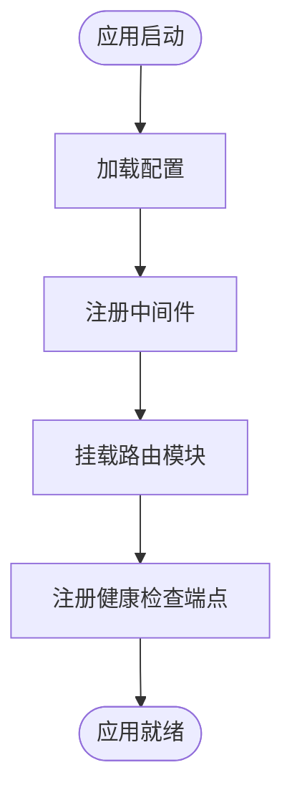
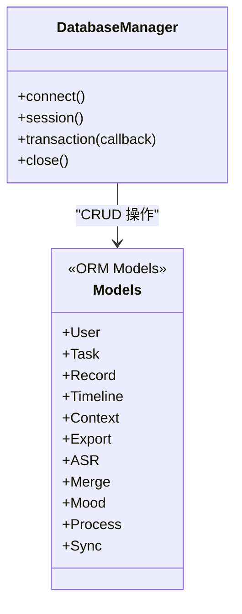
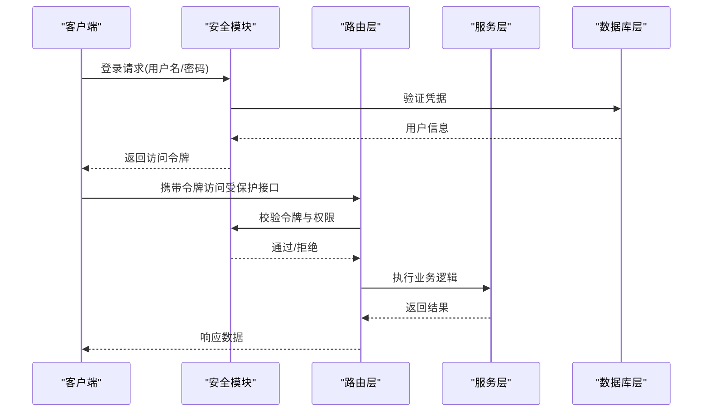
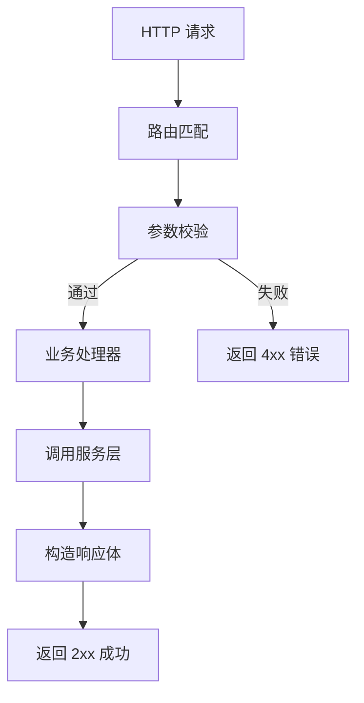
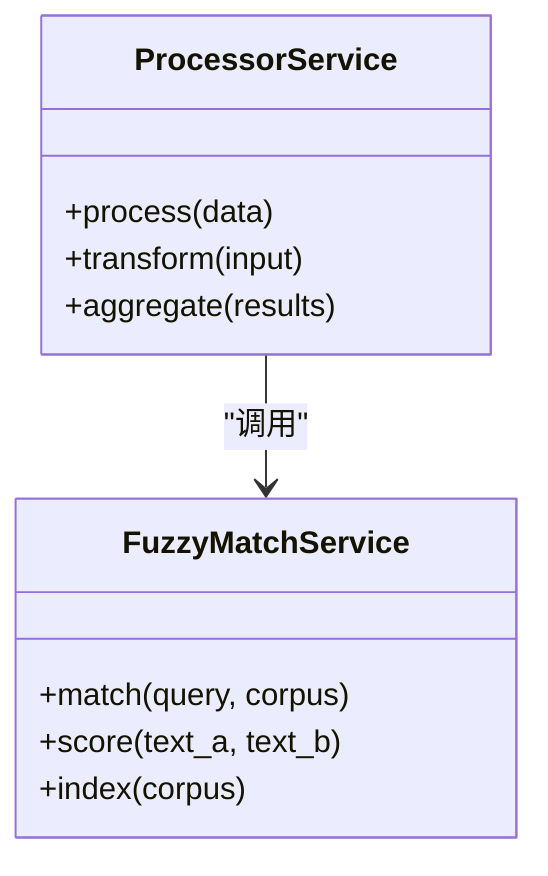
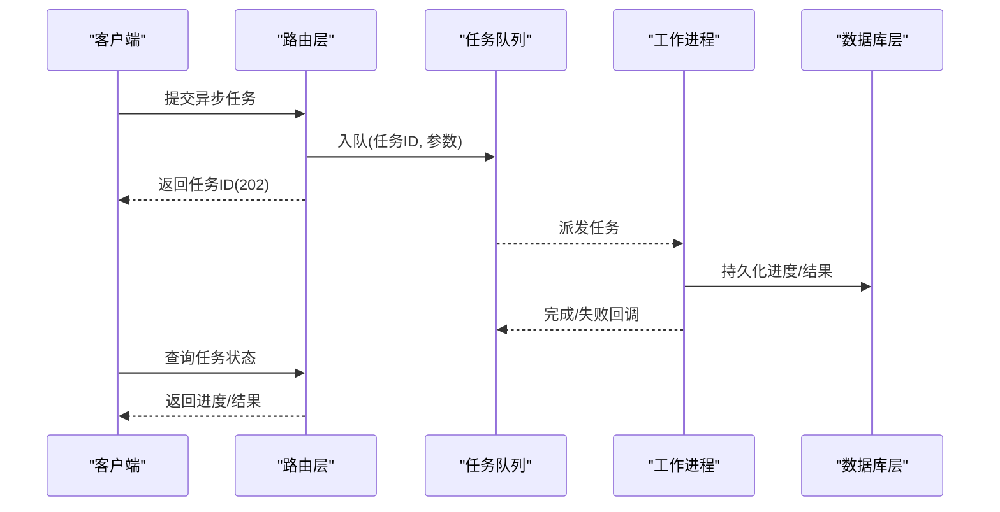
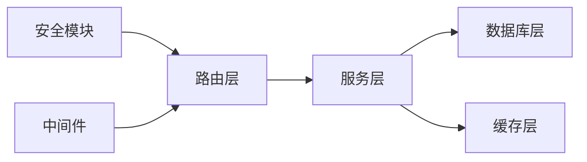

# 后端架构设计

<cite>
**本文引用的文件**   
- [backend/main.py](file://backend/main.py)
- [backend/config.py](file://backend/config.py)
- [backend/database.py](file://backend/database.py)
- [backend/models.py](file://backend/models.py)
- [backend/schemas.py](file://backend/schemas.py)
- [backend/security.py](file://backend/security.py)
- [backend/routers/user.py](file://backend/routers/user.py)
- [backend/routers/tasks.py](file://backend/routers/tasks.py)
- [backend/routers/query.py](file://backend/routers/query.py)
- [backend/routers/records.py](file://backend/routers/records.py)
- [backend/routers/timeline.py](file://backend/routers/timeline.py)
- [backend/routers/export.py](file://backend/routers/export.py)
- [backend/routers/asr.py](file://backend/routers/asr.py)
- [backend/routers/context.py](file://backend/routers/context.py)
- [backend/routers/merge.py](file://backend/routers/merge.py)
- [backend/routers/mood.py](file://backend/routers/mood.py)
- [backend/routers/process.py](file://backend/routers/process.py)
- [backend/routers/sync.py](file://backend/routers/sync.py)
- [backend/services/processor.py](file://backend/services/processor.py)
- [backend/services/fuzzy_match.py](file://backend/services/fuzzy_match.py)
</cite>

## 目录
1. [简介](#简介)
2. [项目结构](#项目结构)
3. [核心组件](#核心组件)
4. [架构总览](#架构总览)
5. [详细组件分析](#详细组件分析)
6. [依赖关系分析](#依赖关系分析)
7. [性能考量](#性能考量)
8. [故障排查指南](#故障排查指南)
9. [结论](#结论)
10. [附录](#附录)

## 简介
本文件面向后端开发者与架构师，系统化阐述基于 FastAPI 的后端架构设计。内容覆盖模块化路由组织、服务层抽象、数据库操作封装、中间件机制、RESTful API 设计原则、请求响应模型、错误处理策略、异步处理模式、任务队列管理、缓存策略、安全认证与权限控制、日志记录与监控告警，以及 API 设计规范与最佳实践。文档以仓库中的实际代码为依据，提供可追溯的源码引用与可视化图示，帮助读者快速理解并落地实现。

## 项目结构
后端采用按功能域划分的模块化结构：
- 入口与配置：应用启动、全局配置、中间件注册、生命周期钩子
- 路由层：按业务域拆分的路由模块（用户、任务、查询、记录、时间线、导出、ASR、上下文、合并、情绪、处理、同步）
- 服务层：领域逻辑与算法封装（处理器、模糊匹配等）
- 数据层：ORM 模型、数据库连接与会话管理、Schema 校验
- 安全与鉴权：令牌签发与校验、权限控制
- 工具与扩展：可选的日志、监控、缓存、任务队列集成点

**图表来源** 
- [backend/main.py](file://backend/main.py)
- [backend/config.py](file://backend/config.py)
- [backend/database.py](file://backend/database.py)
- [backend/models.py](file://backend/models.py)
- [backend/schemas.py](file://backend/schemas.py)
- [backend/security.py](file://backend/security.py)
- [backend/routers/user.py](file://backend/routers/user.py)
- [backend/routers/tasks.py](file://backend/routers/tasks.py)
- [backend/routers/query.py](file://backend/routers/query.py)
- [backend/routers/records.py](file://backend/routers/records.py)
- [backend/routers/timeline.py](file://backend/routers/timeline.py)
- [backend/routers/export.py](file://backend/routers/export.py)
- [backend/routers/asr.py](file://backend/routers/asr.py)
- [backend/routers/context.py](file://backend/routers/context.py)
- [backend/routers/merge.py](file://backend/routers/merge.py)
- [backend/routers/mood.py](file://backend/routers/mood.py)
- [backend/routers/process.py](file://backend/routers/process.py)
- [backend/routers/sync.py](file://backend/routers/sync.py)
- [backend/services/processor.py](file://backend/services/processor.py)
- [backend/services/fuzzy_match.py](file://backend/services/fuzzy_match.py)

**章节来源**
- [backend/main.py](file://backend/main.py)
- [backend/config.py](file://backend/config.py)
- [backend/database.py](file://backend/database.py)
- [backend/models.py](file://backend/models.py)
- [backend/schemas.py](file://backend/schemas.py)
- [backend/security.py](file://backend/security.py)
- [backend/routers/user.py](file://backend/routers/user.py)
- [backend/routers/tasks.py](file://backend/routers/tasks.py)
- [backend/routers/query.py](file://backend/routers/query.py)
- [backend/routers/records.py](file://backend/routers/records.py)
- [backend/routers/timeline.py](file://backend/routers/timeline.py)
- [backend/routers/export.py](file://backend/routers/export.py)
- [backend/routers/asr.py](file://backend/routers/asr.py)
- [backend/routers/context.py](file://backend/routers/context.py)
- [backend/routers/merge.py](file://backend/routers/merge.py)
- [backend/routers/mood.py](file://backend/routers/mood.py)
- [backend/routers/process.py](file://backend/routers/process.py)
- [backend/routers/sync.py](file://backend/routers/sync.py)
- [backend/services/processor.py](file://backend/services/processor.py)
- [backend/services/fuzzy_match.py](file://backend/services/fuzzy_match.py)

## 核心组件
- 应用入口与中间件
  - 应用初始化、CORS、压缩、请求日志、限流、健康检查等中间件的注册位置与顺序
  - 生命周期事件：启动时加载配置、预热缓存、建立连接；关闭时释放资源
- 配置管理
  - 环境变量与默认值、多环境配置、敏感信息保护
- 数据库层
  - ORM 模型定义、会话管理、事务边界、迁移策略
  - Schema 校验与序列化/反序列化
- 安全与鉴权
  - JWT 签发与校验、密码哈希、角色与权限模型、访问控制装饰器或依赖注入
- 路由层
  - RESTful 路径设计、HTTP 方法语义、状态码规范、分页与过滤参数
- 服务层
  - 领域逻辑解耦、外部服务调用封装、重试与熔断、异步任务编排
- 错误处理
  - 统一异常类型、错误码体系、结构化错误响应、日志与追踪
- 异步与任务队列
  - 长耗时任务的后台执行、消息队列集成、任务幂等性与去重
- 缓存策略
  - 多级缓存（内存、Redis）、缓存键设计、失效与更新策略

**章节来源**
- [backend/main.py](file://backend/main.py)
- [backend/config.py](file://backend/config.py)
- [backend/database.py](file://backend/database.py)
- [backend/models.py](file://backend/models.py)
- [backend/schemas.py](file://backend/schemas.py)
- [backend/security.py](file://backend/security.py)
- [backend/services/processor.py](file://backend/services/processor.py)
- [backend/services/fuzzy_match.py](file://backend/services/fuzzy_match.py)

## 架构总览
FastAPI 应用遵循“路由-服务-数据”三层分离，结合中间件与安全组件形成完整的请求处理流水线。

**图表来源** 
- [backend/main.py](file://backend/main.py)
- [backend/routers/user.py](file://backend/routers/user.py)
- [backend/routers/tasks.py](file://backend/routers/tasks.py)
- [backend/routers/query.py](file://backend/routers/query.py)
- [backend/routers/records.py](file://backend/routers/records.py)
- [backend/routers/timeline.py](file://backend/routers/timeline.py)
- [backend/routers/export.py](file://backend/routers/export.py)
- [backend/routers/asr.py](file://backend/routers/asr.py)
- [backend/routers/context.py](file://backend/routers/context.py)
- [backend/routers/merge.py](file://backend/routers/merge.py)
- [backend/routers/mood.py](file://backend/routers/mood.py)
- [backend/routers/process.py](file://backend/routers/process.py)
- [backend/routers/sync.py](file://backend/routers/sync.py)
- [backend/services/processor.py](file://backend/services/processor.py)
- [backend/services/fuzzy_match.py](file://backend/services/fuzzy_match.py)
- [backend/database.py](file://backend/database.py)
- [backend/schemas.py](file://backend/schemas.py)

## 详细组件分析

### 应用入口与中间件机制
- 职责
  - 创建 FastAPI 实例，注册全局中间件（CORS、压缩、请求日志、限流、健康检查）
  - 挂载路由模块，暴露 OpenAPI/Swagger UI
  - 定义生命周期钩子（启动/关闭），用于资源初始化与清理
- 关键点
  - 中间件顺序决定处理优先级（鉴权应在日志之后、业务之前）
  - 健康检查端点便于负载均衡与健康探测
  - 启动阶段预热关键资源（如连接池、索引、缓存）

**图表来源** 
- [backend/main.py](file://backend/main.py)

**章节来源**
- [backend/main.py](file://backend/main.py)

### 配置管理
- 职责
  - 集中管理环境变量、默认值、多环境切换
  - 提供类型安全的配置访问接口
- 关键点
  - 敏感字段加密或从密钥管理服务获取
  - 配置变更热重载（开发环境）与灰度发布支持

**章节来源**
- [backend/config.py](file://backend/config.py)

### 数据库层与模型
- 职责
  - 定义 ORM 模型与关系映射
  - 管理数据库连接与会话生命周期
  - 提供统一的查询与事务封装
- 关键点
  - 连接池大小与超时配置
  - 读写分离与慢查询优化
  - 数据迁移与版本管理

**图表来源** 
- [backend/database.py](file://backend/database.py)
- [backend/models.py](file://backend/models.py)

**章节来源**
- [backend/database.py](file://backend/database.py)
- [backend/models.py](file://backend/models.py)

### Schema 校验与序列化
- 职责
  - 定义请求与响应的数据结构
  - 自动参数校验与错误提示
  - 统一序列化格式
- 关键点
  - 使用 Pydantic 模型进行强类型约束
  - 分页、排序、过滤参数的标准化

**章节来源**
- [backend/schemas.py](file://backend/schemas.py)

### 安全认证与权限控制
- 职责
  - 用户身份认证（JWT/Session）
  - 密码哈希与存储安全
  - 基于角色的访问控制（RBAC）
- 关键点
  - 令牌刷新与过期策略
  - 权限粒度到资源与方法级别
  - 审计日志与防重放攻击

**图表来源** 
- [backend/security.py](file://backend/security.py)
- [backend/routers/user.py](file://backend/routers/user.py)
- [backend/routers/tasks.py](file://backend/routers/tasks.py)
- [backend/routers/query.py](file://backend/routers/query.py)
- [backend/routers/records.py](file://backend/routers/records.py)
- [backend/routers/timeline.py](file://backend/routers/timeline.py)
- [backend/routers/export.py](file://backend/routers/export.py)
- [backend/routers/asr.py](file://backend/routers/asr.py)
- [backend/routers/context.py](file://backend/routers/context.py)
- [backend/routers/merge.py](file://backend/routers/merge.py)
- [backend/routers/mood.py](file://backend/routers/mood.py)
- [backend/routers/process.py](file://backend/routers/process.py)
- [backend/routers/sync.py](file://backend/routers/sync.py)
- [backend/database.py](file://backend/database.py)

**章节来源**
- [backend/security.py](file://backend/security.py)
- [backend/routers/user.py](file://backend/routers/user.py)

### 路由层设计与 RESTful 规范
- 职责
  - 将 HTTP 请求映射到具体业务处理函数
  - 统一路径命名、HTTP 方法与状态码
  - 参数校验、分页、过滤、排序
- 关键点
  - 资源命名复数化（/users, /tasks, /records）
  - 嵌套资源表达关联关系（/users/{user_id}/tasks）
  - 错误响应体结构一致（code/message/data）

**图表来源** 
- [backend/routers/user.py](file://backend/routers/user.py)
- [backend/routers/tasks.py](file://backend/routers/tasks.py)
- [backend/routers/query.py](file://backend/routers/query.py)
- [backend/routers/records.py](file://backend/routers/records.py)
- [backend/routers/timeline.py](file://backend/routers/timeline.py)
- [backend/routers/export.py](file://backend/routers/export.py)
- [backend/routers/asr.py](file://backend/routers/asr.py)
- [backend/routers/context.py](file://backend/routers/context.py)
- [backend/routers/merge.py](file://backend/routers/merge.py)
- [backend/routers/mood.py](file://backend/routers/mood.py)
- [backend/routers/process.py](file://backend/routers/process.py)
- [backend/routers/sync.py](file://backend/routers/sync.py)

**章节来源**
- [backend/routers/user.py](file://backend/routers/user.py)
- [backend/routers/tasks.py](file://backend/routers/tasks.py)
- [backend/routers/query.py](file://backend/routers/query.py)
- [backend/routers/records.py](file://backend/routers/records.py)
- [backend/routers/timeline.py](file://backend/routers/timeline.py)
- [backend/routers/export.py](file://backend/routers/export.py)
- [backend/routers/asr.py](file://backend/routers/asr.py)
- [backend/routers/context.py](file://backend/routers/context.py)
- [backend/routers/merge.py](file://backend/routers/merge.py)
- [backend/routers/mood.py](file://backend/routers/mood.py)
- [backend/routers/process.py](file://backend/routers/process.py)
- [backend/routers/sync.py](file://backend/routers/sync.py)

### 服务层抽象与领域逻辑
- 职责
  - 封装复杂业务逻辑与算法（处理器、模糊匹配）
  - 协调多个数据源与外部服务
  - 实现重试、熔断、降级等容错策略
- 关键点
  - 无副作用的纯函数优先
  - 输入输出明确，便于测试与缓存
  - 异步 IO 与并发控制

**图表来源** 
- [backend/services/processor.py](file://backend/services/processor.py)
- [backend/services/fuzzy_match.py](file://backend/services/fuzzy_match.py)

**章节来源**
- [backend/services/processor.py](file://backend/services/processor.py)
- [backend/services/fuzzy_match.py](file://backend/services/fuzzy_match.py)

### 错误处理策略
- 职责
  - 统一异常捕获与转换
  - 结构化错误响应（错误码、消息、详情）
  - 日志记录与追踪
- 关键点
  - 区分客户端错误（4xx）与服务端错误（5xx）
  - 敏感信息脱敏
  - 错误分级与告警阈值

**章节来源**
- [backend/main.py](file://backend/main.py)
- [backend/schemas.py](file://backend/schemas.py)

### 异步处理与任务队列
- 职责
  - 长耗时任务后台执行（ASR、导出、合并、同步）
  - 任务状态跟踪与进度上报
  - 任务重试与死信队列
- 关键点
  - 幂等性设计与去重键
  - 消费者水平扩展与背压控制
  - 监控指标（吞吐、延迟、失败率）

**图表来源** 
- [backend/routers/tasks.py](file://backend/routers/tasks.py)
- [backend/routers/asr.py](file://backend/routers/asr.py)
- [backend/routers/export.py](file://backend/routers/export.py)
- [backend/routers/merge.py](file://backend/routers/merge.py)
- [backend/routers/sync.py](file://backend/routers/sync.py)
- [backend/database.py](file://backend/database.py)

**章节来源**
- [backend/routers/tasks.py](file://backend/routers/tasks.py)
- [backend/routers/asr.py](file://backend/routers/asr.py)
- [backend/routers/export.py](file://backend/routers/export.py)
- [backend/routers/merge.py](file://backend/routers/merge.py)
- [backend/routers/sync.py](file://backend/routers/sync.py)

### 缓存策略
- 职责
  - 热点数据缓存（内存/Redis）
  - 计算密集型结果缓存
  - 缓存一致性保证
- 关键点
  - 缓存键设计（命名空间+参数哈希）
  - TTL 与主动失效策略
  - 缓存穿透/雪崩防护

**章节来源**
- [backend/services/processor.py](file://backend/services/processor.py)
- [backend/services/fuzzy_match.py](file://backend/services/fuzzy_match.py)

## 依赖关系分析
- 组件耦合
  - 路由层依赖服务层，服务层依赖数据库层与缓存层
  - 安全模块被路由层与中间件共同依赖
- 外部依赖
  - 数据库驱动、消息队列、缓存服务、对象存储（导出）
- 循环依赖规避
  - 通过依赖注入与接口抽象降低耦合

**图表来源** 
- [backend/routers/user.py](file://backend/routers/user.py)
- [backend/routers/tasks.py](file://backend/routers/tasks.py)
- [backend/routers/query.py](file://backend/routers/query.py)
- [backend/routers/records.py](file://backend/routers/records.py)
- [backend/routers/timeline.py](file://backend/routers/timeline.py)
- [backend/routers/export.py](file://backend/routers/export.py)
- [backend/routers/asr.py](file://backend/routers/asr.py)
- [backend/routers/context.py](file://backend/routers/context.py)
- [backend/routers/merge.py](file://backend/routers/merge.py)
- [backend/routers/mood.py](file://backend/routers/mood.py)
- [backend/routers/process.py](file://backend/routers/process.py)
- [backend/routers/sync.py](file://backend/routers/sync.py)
- [backend/services/processor.py](file://backend/services/processor.py)
- [backend/services/fuzzy_match.py](file://backend/services/fuzzy_match.py)
- [backend/database.py](file://backend/database.py)
- [backend/security.py](file://backend/security.py)
- [backend/main.py](file://backend/main.py)

**章节来源**
- [backend/main.py](file://backend/main.py)
- [backend/security.py](file://backend/security.py)
- [backend/database.py](file://backend/database.py)
- [backend/services/processor.py](file://backend/services/processor.py)
- [backend/services/fuzzy_match.py](file://backend/services/fuzzy_match.py)

## 性能考量
- 异步 IO
  - 使用异步路由与异步服务调用，避免阻塞事件循环
- 连接池与批处理
  - 数据库连接池调优，批量插入/更新减少往返
- 缓存命中
  - 热点数据多级缓存，合理设置 TTL
- 分页与增量
  - 大列表分页、游标分页、增量同步
- 压缩与传输
  - Gzip/Brotli 压缩，HTTP/2 启用
- 监控与告警
  - 指标采集（QPS、延迟、错误率）、链路追踪、日志聚合

[本节为通用指导，不直接分析具体文件]

## 故障排查指南
- 常见问题定位
  - 查看中间件日志与请求追踪 ID
  - 检查数据库慢查询与锁等待
  - 确认缓存命中率与失效策略
  - 审查任务队列积压与消费者状态
- 调试建议
  - 开启详细日志与采样追踪
  - 使用健康检查端点验证服务可用性
  - 模拟负载与混沌工程演练

**章节来源**
- [backend/main.py](file://backend/main.py)
- [backend/database.py](file://backend/database.py)
- [backend/routers/tasks.py](file://backend/routers/tasks.py)

## 结论
本架构以 FastAPI 为核心，通过清晰的分层与模块化设计，实现了高内聚、低耦合的后端系统。结合安全鉴权、错误处理、异步任务与缓存策略，满足高性能与可扩展需求。建议在迭代中持续完善监控告警与性能调优，确保系统稳定可靠。

[本节为总结性内容，不直接分析具体文件]

## 附录
- API 设计规范
  - 路径命名：名词复数、小写、连字符分隔
  - HTTP 方法：GET/POST/PUT/PATCH/DELETE 语义明确
  - 状态码：2xx 成功、4xx 客户端错误、5xx 服务端错误
  - 响应体：{code, message, data} 统一结构
  - 分页：page/page_size 或 cursor 分页
  - 过滤与排序：query 参数标准化
- 最佳实践
  - 依赖注入与单例管理
  - 配置与环境隔离
  - 单元测试与集成测试覆盖
  - 安全扫描与依赖漏洞治理

[本节为通用指导，不直接分析具体文件]