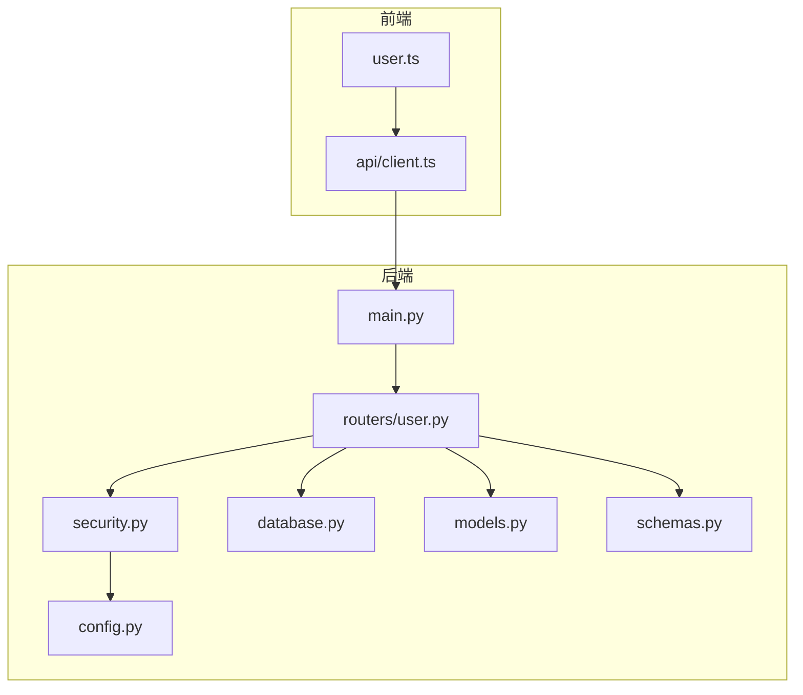
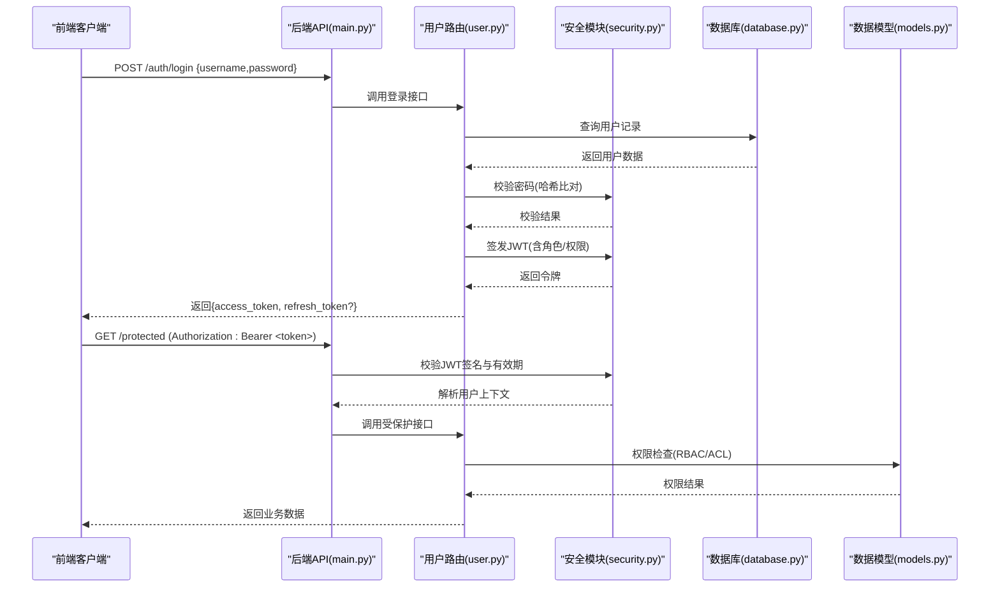
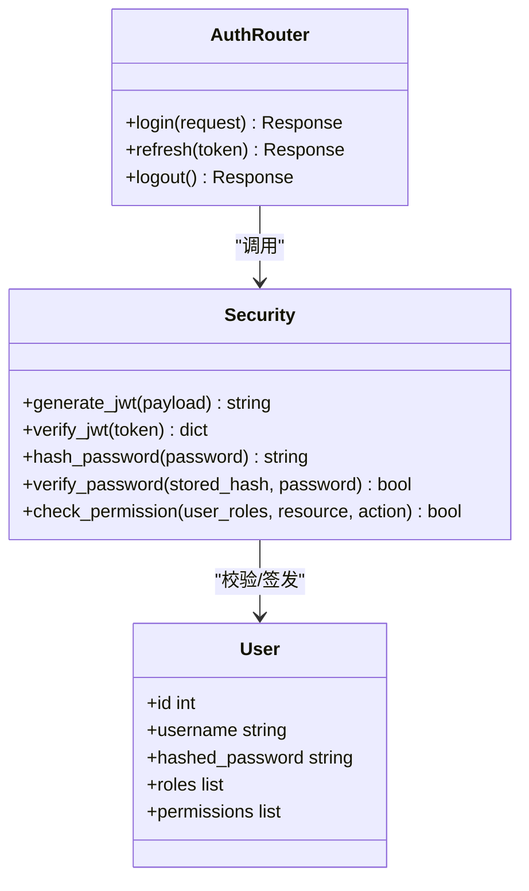
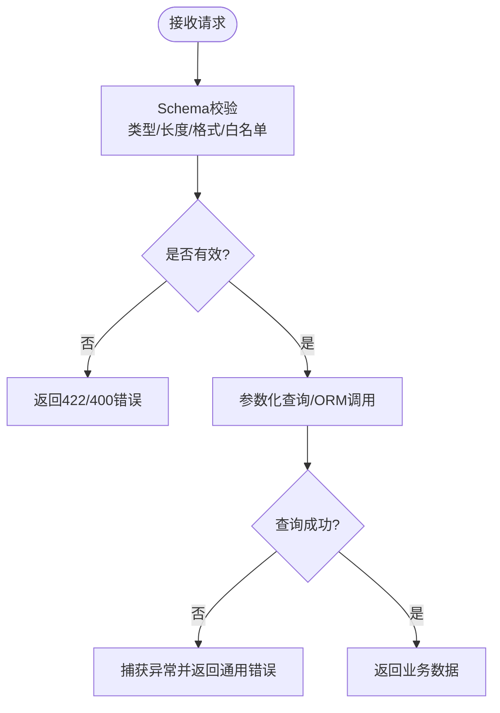
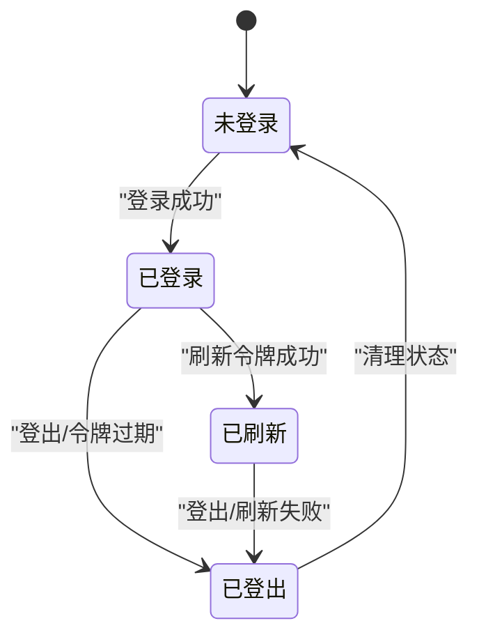
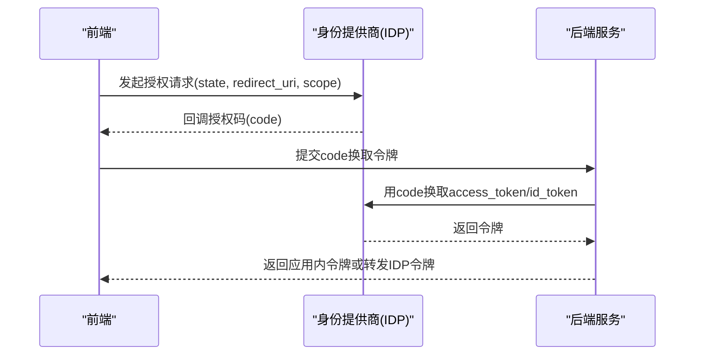
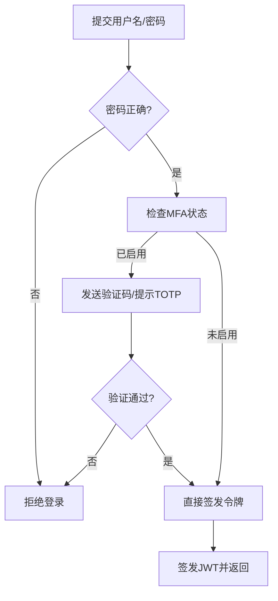
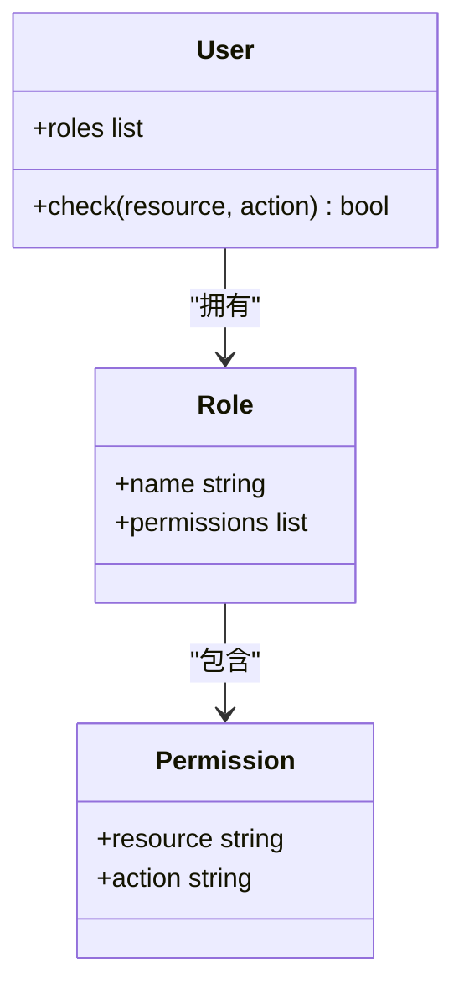
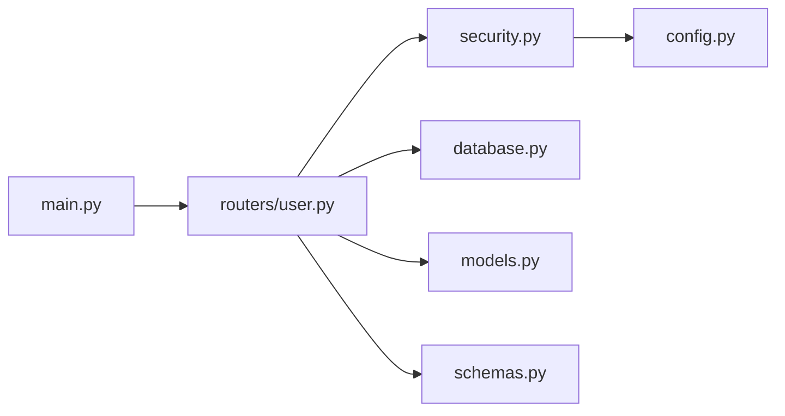

# 安全认证机制

<cite>
**本文引用的文件**   
- [backend/security.py](file://backend/security.py)
- [backend/config.py](file://backend/config.py)
- [backend/database.py](file://backend/database.py)
- [backend/models.py](file://backend/models.py)
- [backend/schemas.py](file://backend/schemas.py)
- [backend/main.py](file://backend/main.py)
- [backend/routers/user.py](file://backend/routers/user.py)
- [frontend/src/api/client.ts](file://frontend/src/api/client.ts)
- [frontend/src/user.ts](file://frontend/src/user.ts)
</cite>

## 目录
1. [简介](#简介)
2. [项目结构](#项目结构)
3. [核心组件](#核心组件)
4. [架构总览](#架构总览)
5. [详细组件分析](#详细组件分析)
6. [依赖关系分析](#依赖关系分析)
7. [性能考虑](#性能考虑)
8. [故障排查指南](#故障排查指南)
9. [结论](#结论)
10. [附录](#附录)

## 简介
本文件面向后端与前端的安全认证实现，围绕以下目标展开：
- JWT令牌认证、密码加密存储、会话管理与权限控制
- OAuth2.0集成、多因素认证（MFA）与访问控制列表（ACL）
- 输入验证、SQL注入防护、XSS防护与CSRF保护
- API限流、请求签名与网络安全配置
- 安全审计、漏洞扫描与安全最佳实践
- 敏感信息处理与合规性要求

说明：本项目为前后端分离架构。后端使用Python（FastAPI/Pydantic风格），前端使用TypeScript/Vue。安全能力主要在后端集中实现，前端负责令牌持有与请求头设置。

## 项目结构
后端关键安全相关文件集中在 backend 目录：
- security.py：JWT签发与校验、密码哈希、权限校验等
- config.py：密钥、算法、过期时间、CORS等安全相关配置
- database.py：数据库连接与查询封装（ORM/参数化查询）
- models.py：数据模型定义（用户、角色、权限等）
- schemas.py：请求/响应Schema与输入校验规则
- main.py：应用入口、中间件注册、路由挂载
- routers/user.py：用户认证相关接口（登录、注册、刷新等）

前端关键安全相关文件：
- frontend/src/api/client.ts：HTTP客户端封装，统一设置Authorization头、错误处理
- frontend/src/user.ts：用户状态管理（令牌存取、登出、权限判断）

图表来源
- [backend/main.py](file://backend/main.py)
- [backend/security.py](file://backend/security.py)
- [backend/config.py](file://backend/config.py)
- [backend/database.py](file://backend/database.py)
- [backend/models.py](file://backend/models.py)
- [backend/schemas.py](file://backend/schemas.py)
- [backend/routers/user.py](file://backend/routers/user.py)
- [frontend/src/api/client.ts](file://frontend/src/api/client.ts)
- [frontend/src/user.ts](file://frontend/src/user.ts)

章节来源
- [backend/main.py](file://backend/main.py)
- [backend/security.py](file://backend/security.py)
- [backend/config.py](file://backend/config.py)
- [backend/database.py](file://backend/database.py)
- [backend/models.py](file://backend/models.py)
- [backend/schemas.py](file://backend/schemas.py)
- [backend/routers/user.py](file://backend/routers/user.py)
- [frontend/src/api/client.ts](file://frontend/src/api/client.ts)
- [frontend/src/user.ts](file://frontend/src/user.ts)

## 核心组件
- 认证与授权
  - JWT签发与校验：基于配置的算法与密钥，生成短期访问令牌与可选刷新令牌；支持黑名单或短过期策略降低泄露风险
  - 密码加密存储：采用强哈希算法（如bcrypt/argon2）加盐存储，禁止明文或可逆加密
  - 权限控制：基于角色的访问控制（RBAC）与资源级ACL，结合JWT载荷中的角色/权限声明进行鉴权
- 输入验证与数据模型
  - Pydantic Schema严格校验：类型、长度、格式、白名单枚举等
  - ORM参数化查询：避免字符串拼接，防止SQL注入
- 会话与令牌管理
  - 无状态会话：通过JWT承载必要上下文；必要时配合服务端短效黑名单或Redis缓存
  - 前端安全存储：优先使用内存或HttpOnly Cookie，避免localStorage长期暴露
- 网络安全与传输安全
  - HTTPS强制、CORS最小化、HSTS、安全Cookie属性
  - 请求签名（可选）：对敏感操作进行签名防篡改
- 限流与抗滥用
  - 基于IP/用户的速率限制，区分认证与非认证路径
- 审计与合规
  - 关键操作日志、失败重试与告警、数据最小化与脱敏

章节来源
- [backend/security.py](file://backend/security.py)
- [backend/config.py](file://backend/config.py)
- [backend/database.py](file://backend/database.py)
- [backend/models.py](file://backend/models.py)
- [backend/schemas.py](file://backend/schemas.py)
- [backend/routers/user.py](file://backend/routers/user.py)
- [frontend/src/api/client.ts](file://frontend/src/api/client.ts)
- [frontend/src/user.ts](file://frontend/src/user.ts)

## 架构总览
整体认证流程如下：
- 登录：前端提交用户名/密码，后端校验并签发JWT
- 受保护接口：前端携带Authorization: Bearer <token>，后端校验签名、有效期与权限
- 刷新：使用刷新令牌换取新访问令牌（可选）
- 登出：前端清除本地令牌，后端可选择加入黑名单

图表来源
- [backend/main.py](file://backend/main.py)
- [backend/routers/user.py](file://backend/routers/user.py)
- [backend/security.py](file://backend/security.py)
- [backend/database.py](file://backend/database.py)
- [backend/models.py](file://backend/models.py)

## 详细组件分析

### 认证与授权（JWT、密码、权限）
- JWT
  - 签发：包含用户标识、角色、权限、过期时间；建议短过期+刷新令牌
  - 校验：验签、过期、黑名单（可选）、作用域/资源校验
- 密码
  - 存储：强哈希+随机盐；禁止明文；定期升级算法
- 权限
  - RBAC：角色到资源的映射
  - ACL：细粒度到字段/操作级别
  - 鉴权点：在路由层或中间件统一拦截

图表来源
- [backend/security.py](file://backend/security.py)
- [backend/models.py](file://backend/models.py)
- [backend/routers/user.py](file://backend/routers/user.py)

章节来源
- [backend/security.py](file://backend/security.py)
- [backend/models.py](file://backend/models.py)
- [backend/routers/user.py](file://backend/routers/user.py)

### 输入验证与SQL注入防护
- 输入验证
  - 使用Pydantic Schema对请求体、路径参数、查询参数进行强类型校验与约束
  - 白名单策略：枚举、正则、长度范围、必填项
- SQL注入防护
  - 使用ORM参数化查询或预编译语句
  - 禁止字符串拼接构造SQL
  - 最小权限数据库账户

图表来源
- [backend/schemas.py](file://backend/schemas.py)
- [backend/database.py](file://backend/database.py)

章节来源
- [backend/schemas.py](file://backend/schemas.py)
- [backend/database.py](file://backend/database.py)

### 会话管理与令牌生命周期
- 访问令牌：短时效，用于快速鉴权
- 刷新令牌：长时效但受限，仅用于换发访问令牌
- 登出：前端清理本地存储；后端可选加入黑名单
- 安全存储：优先HttpOnly Cookie或内存存储，避免持久化敏感令牌

图表来源
- [backend/security.py](file://backend/security.py)
- [frontend/src/user.ts](file://frontend/src/user.ts)
- [frontend/src/api/client.ts](file://frontend/src/api/client.ts)

章节来源
- [backend/security.py](file://backend/security.py)
- [frontend/src/user.ts](file://frontend/src/user.ts)
- [frontend/src/api/client.ts](file://frontend/src/api/client.ts)

### OAuth2.0集成（设计要点）
- 授权模式：推荐授权码模式（PKCE适用于SPA）
- 令牌交换：后端作为资源服务器或代理，校验第三方IDP的令牌
- 作用域与最小权限：按需申请scope，避免过度授权
- 安全注意事项：重定向URI白名单、state防CSRF、令牌绑定用户会话

图表来源
- [backend/routers/user.py](file://backend/routers/user.py)
- [backend/security.py](file://backend/security.py)

章节来源
- [backend/routers/user.py](file://backend/routers/user.py)
- [backend/security.py](file://backend/security.py)

### 多因素认证（MFA）
- 支持TOTP或短信/邮箱验证码
- 登录流程：首次登录触发MFA，二次验证通过后签发令牌
- 设备信任：可选“记住此设备”策略，缩短后续验证频率
- 安全建议：验证码时效短、次数限制、失败锁定

图表来源
- [backend/routers/user.py](file://backend/routers/user.py)
- [backend/security.py](file://backend/security.py)

章节来源
- [backend/routers/user.py](file://backend/routers/user.py)
- [backend/security.py](file://backend/security.py)

### 访问控制列表（ACL）与RBAC
- 角色定义：管理员、普通用户、只读等
- 资源与动作：CRUD、导出、管理等
- 鉴权点：路由层装饰器或中间件统一拦截
- 审计：记录越权尝试与高频访问

图表来源
- [backend/models.py](file://backend/models.py)
- [backend/security.py](file://backend/security.py)

章节来源
- [backend/models.py](file://backend/models.py)
- [backend/security.py](file://backend/security.py)

### XSS与CSRF防护
- XSS防护
  - 输出编码：模板引擎自动转义，避免innerHTML等危险API
  - CSP：限制脚本来源与执行环境
  - 输入过滤：富文本场景使用白名单过滤
- CSRF防护
  - 同源策略+Samesite Cookie
  - 自定义Header校验（如X-CSRF-Token）
  - 双提交Cookie或双重验证Token

章节来源
- [backend/config.py](file://backend/config.py)
- [frontend/src/api/client.ts](file://frontend/src/api/client.ts)

### API限流与请求签名
- 限流
  - 基于IP/用户/路由维度，滑动窗口或令牌桶
  - 区分认证与非认证路径，提高用户体验
- 请求签名
  - 对敏感操作（转账、修改密码）进行签名，防篡改
  - 时间戳+Nonce+Secret，服务端校验重复与时效

章节来源
- [backend/security.py](file://backend/security.py)
- [backend/config.py](file://backend/config.py)

### 网络安全配置
- HTTPS强制、HSTS、TLS版本与套件限制
- CORS最小化：限定域名、方法、头部
- 安全Cookie：HttpOnly、Secure、SameSite
- 安全响应头：X-Content-Type-Options、X-Frame-Options、Referrer-Policy

章节来源
- [backend/config.py](file://backend/config.py)
- [backend/main.py](file://backend/main.py)

## 依赖关系分析
- 模块耦合
  - routers/user.py 依赖 security.py、database.py、models.py、schemas.py
  - security.py 依赖 config.py（算法、密钥、过期时间）
  - main.py 注册中间件与路由，统一入口
- 外部依赖
  - 数据库驱动、JWT库、密码哈希库、限流库、CSP/CORS工具

图表来源
- [backend/routers/user.py](file://backend/routers/user.py)
- [backend/security.py](file://backend/security.py)
- [backend/database.py](file://backend/database.py)
- [backend/models.py](file://backend/models.py)
- [backend/schemas.py](file://backend/schemas.py)
- [backend/config.py](file://backend/config.py)
- [backend/main.py](file://backend/main.py)

章节来源
- [backend/routers/user.py](file://backend/routers/user.py)
- [backend/security.py](file://backend/security.py)
- [backend/database.py](file://backend/database.py)
- [backend/models.py](file://backend/models.py)
- [backend/schemas.py](file://backend/schemas.py)
- [backend/config.py](file://backend/config.py)
- [backend/main.py](file://backend/main.py)

## 性能考虑
- JWT校验开销低，适合高并发；避免在负载中嵌入过大payload
- 密码哈希选择平衡安全性与性能（如bcrypt cost因子调优）
- 限流使用高效数据结构（滑动窗口计数器/令牌桶）
- 数据库连接池与索引优化，减少认证链路延迟

[本节为通用指导，不直接分析具体文件]

## 故障排查指南
- 登录失败
  - 检查密码哈希比对逻辑与用户是否存在
  - 查看输入校验错误（422/400）
- 令牌无效
  - 确认签名算法与密钥一致
  - 检查过期时间与时区
  - 若启用黑名单，确认未误加入
- 权限不足
  - 核对JWT中角色/权限与实际资源动作匹配
- 跨域问题
  - 检查CORS配置与请求头
- CSRF/XSS
  - 确认Samesite、CSP与输出编码

章节来源
- [backend/security.py](file://backend/security.py)
- [backend/schemas.py](file://backend/schemas.py)
- [backend/config.py](file://backend/config.py)
- [frontend/src/api/client.ts](file://frontend/src/api/client.ts)

## 结论
本项目以JWT为核心，结合强密码哈希、严格输入校验与参数化查询，构建了较为完整的安全认证体系。通过RBAC/ACL、限流、HTTPS与CSP/HSTS等机制，覆盖常见攻击面。建议在后续迭代中完善OAuth2.0集成、MFA与请求签名，并加强审计与漏洞扫描，持续提升安全水位。

[本节为总结，不直接分析具体文件]

## 附录
- 安全最佳实践清单
  - 最小权限原则、默认拒绝
  - 密钥与证书管理（KMS/环境变量）
  - 日志脱敏与审计留存
  - 定期依赖更新与依赖漏洞扫描
  - 代码静态分析与渗透测试
- 合规性要求
  - 数据最小化与可删除
  - 隐私政策与用户同意
  - 跨境数据传输合规

[本节为通用指导，不直接分析具体文件]