# 应用生命周期管理

<cite>
**本文引用的文件**   
- [backend/main.py](file://backend/main.py)
- [backend/config.py](file://backend/config.py)
- [backend/database.py](file://backend/database.py)
- [backend/security.py](file://backend/security.py)
- [backend/routers/context.py](file://backend/routers/context.py)
- [backend/routers/query.py](file://backend/routers/query.py)
- [backend/routers/tasks.py](file://backend/routers/tasks.py)
- [backend/routers/records.py](file://backend/routers/records.py)
- [backend/routers/export.py](file://backend/routers/export.py)
- [backend/routers/sync.py](file://backend/routers/sync.py)
- [backend/routers/asr.py](file://backend/routers/asr.py)
- [backend/routers/mood.py](file://backend/routers/mood.py)
- [backend/routers/process.py](file://backend/routers/process.py)
- [backend/routers/timeline.py](file://backend/routers/timeline.py)
- [backend/routers/user.py](file://backend/routers/user.py)
- [backend/services/processor.py](file://backend/services/processor.py)
- [backend/services/fuzzy_match.py](file://backend/services/fuzzy_match.py)
- [backend/models.py](file://backend/models.py)
- [backend/schemas.py](file://backend/schemas.py)
- [backend/requirements.txt](file://backend/requirements.txt)
- [.github/workflows/deploy.yml](file://.github/workflows/deploy.yml)
- [deploy.sh](file://deploy.sh)
</cite>

## 目录
1. [简介](#简介)
2. [项目结构](#项目结构)
3. [核心组件](#核心组件)
4. [架构总览](#架构总览)
5. [详细组件分析](#详细组件分析)
6. [依赖关系分析](#依赖关系分析)
7. [性能考虑](#性能考虑)
8. [故障排查指南](#故障排查指南)
9. [结论](#结论)
10. [附录](#附录)

## 简介
本文件面向FastAPI后端应用的生命周期管理，系统性阐述应用的启动与关闭流程、依赖注入容器管理、中间件注册机制、配置与环境变量处理、日志与监控指标收集、健康检查端点、优雅停机与资源清理策略、热重载开发模式、生产部署与容器化支持，以及性能监控、错误追踪与调试工具使用。文档以仓库中的实际代码为依据，提供可追溯的源码引用与可视化图示，帮助读者快速理解并正确运维该应用。

## 项目结构
后端采用典型的FastAPI分层组织：入口与应用实例在main中定义；配置集中于config；数据库连接与生命周期在database中管理；安全相关逻辑在security中；路由按功能模块划分于routers；业务服务封装于services；数据模型与请求响应模式分别位于models与schemas。

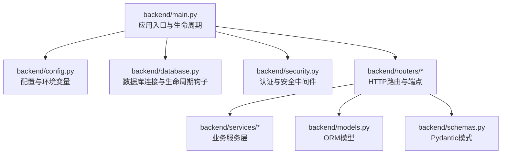

**图表来源** 
- [backend/main.py](file://backend/main.py)
- [backend/config.py](file://backend/config.py)
- [backend/database.py](file://backend/database.py)
- [backend/security.py](file://backend/security.py)
- [backend/routers/context.py](file://backend/routers/context.py)
- [backend/routers/query.py](file://backend/routers/query.py)
- [backend/routers/tasks.py](file://backend/routers/tasks.py)
- [backend/routers/records.py](file://backend/routers/records.py)
- [backend/routers/export.py](file://backend/routers/export.py)
- [backend/routers/sync.py](file://backend/routers/sync.py)
- [backend/routers/asr.py](file://backend/routers/asr.py)
- [backend/routers/mood.py](file://backend/routers/mood.py)
- [backend/routers/process.py](file://backend/routers/process.py)
- [backend/routers/timeline.py](file://backend/routers/timeline.py)
- [backend/routers/user.py](file://backend/routers/user.py)
- [backend/services/processor.py](file://backend/services/processor.py)
- [backend/services/fuzzy_match.py](file://backend/services/fuzzy_match.py)
- [backend/models.py](file://backend/models.py)
- [backend/schemas.py](file://backend/schemas.py)

**章节来源**
- [backend/main.py](file://backend/main.py)
- [backend/config.py](file://backend/config.py)
- [backend/database.py](file://backend/database.py)
- [backend/security.py](file://backend/security.py)
- [backend/routers/context.py](file://backend/routers/context.py)
- [backend/routers/query.py](file://backend/routers/query.py)
- [backend/routers/tasks.py](file://backend/routers/tasks.py)
- [backend/routers/records.py](file://backend/routers/records.py)
- [backend/routers/export.py](file://backend/routers/export.py)
- [backend/routers/sync.py](file://backend/routers/sync.py)
- [backend/routers/asr.py](file://backend/routers/asr.py)
- [backend/routers/mood.py](file://backend/routers/mood.py)
- [backend/routers/process.py](file://backend/routers/process.py)
- [backend/routers/timeline.py](file://backend/routers/timeline.py)
- [backend/routers/user.py](file://backend/routers/user.py)
- [backend/services/processor.py](file://backend/services/processor.py)
- [backend/services/fuzzy_match.py](file://backend/services/fuzzy_match.py)
- [backend/models.py](file://backend/models.py)
- [backend/schemas.py](file://backend/schemas.py)

## 核心组件
- 应用入口与生命周期钩子：通过FastAPI的lifespan上下文管理器或事件回调实现启动初始化与关闭清理，确保数据库连接池、缓存、外部服务客户端等资源的安全创建与释放。
- 配置与环境变量：集中读取环境变量与配置文件，提供类型安全的配置对象，并在应用启动时校验关键配置项。
- 数据库生命周期：在应用启动时建立连接池，在关闭时安全断开连接并释放资源；必要时提供健康检查查询。
- 安全与认证：基于JWT或会话的认证中间件，统一鉴权逻辑与权限控制。
- 路由与依赖注入：每个路由模块注册到应用，使用FastAPI的Depends进行依赖注入，如数据库会话、配置对象、用户上下文等。
- 服务层：封装复杂业务逻辑，避免在路由中直接耦合基础设施细节。

**章节来源**
- [backend/main.py](file://backend/main.py)
- [backend/config.py](file://backend/config.py)
- [backend/database.py](file://backend/database.py)
- [backend/security.py](file://backend/security.py)
- [backend/routers/context.py](file://backend/routers/context.py)
- [backend/routers/query.py](file://backend/routers/query.py)
- [backend/routers/tasks.py](file://backend/routers/tasks.py)
- [backend/routers/records.py](file://backend/routers/records.py)
- [backend/routers/export.py](file://backend/routers/export.py)
- [backend/routers/sync.py](file://backend/routers/sync.py)
- [backend/routers/asr.py](file://backend/routers/asr.py)
- [backend/routers/mood.py](file://backend/routers/mood.py)
- [backend/routers/process.py](file://backend/routers/process.py)
- [backend/routers/timeline.py](file://backend/routers/timeline.py)
- [backend/routers/user.py](file://backend/routers/user.py)
- [backend/services/processor.py](file://backend/services/processor.py)
- [backend/services/fuzzy_match.py](file://backend/services/fuzzy_match.py)

## 架构总览
下图展示应用从进程启动到请求处理的完整生命周期，包括中间件链、依赖注入、路由分发、服务调用与数据库交互。

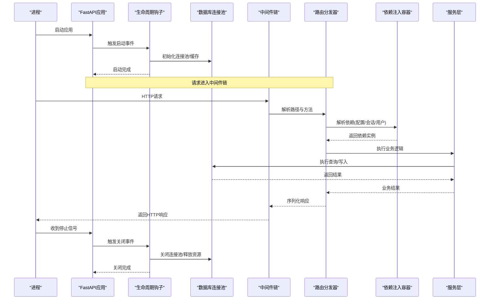

**图表来源** 
- [backend/main.py](file://backend/main.py)
- [backend/database.py](file://backend/database.py)
- [backend/security.py](file://backend/security.py)
- [backend/routers/context.py](file://backend/routers/context.py)
- [backend/routers/query.py](file://backend/routers/query.py)
- [backend/routers/tasks.py](file://backend/routers/tasks.py)
- [backend/routers/records.py](file://backend/routers/records.py)
- [backend/routers/export.py](file://backend/routers/export.py)
- [backend/routers/sync.py](file://backend/routers/sync.py)
- [backend/routers/asr.py](file://backend/routers/asr.py)
- [backend/routers/mood.py](file://backend/routers/mood.py)
- [backend/routers/process.py](file://backend/routers/process.py)
- [backend/routers/timeline.py](file://backend/routers/timeline.py)
- [backend/routers/user.py](file://backend/routers/user.py)
- [backend/services/processor.py](file://backend/services/processor.py)
- [backend/services/fuzzy_match.py](file://backend/services/fuzzy_match.py)

## 详细组件分析

### 应用入口与生命周期（main）
- 启动流程：创建FastAPI实例，注册中间件、路由、异常处理器；通过lifespan上下文管理器或startup/shutdown事件初始化全局资源（如数据库连接池、第三方客户端、缓存）。
- 关闭流程：捕获系统信号，触发shutdown事件，依次关闭连接池、取消后台任务、释放锁与临时资源。
- 健康检查：暴露一个轻量级端点用于探针探测，通常返回状态码与简要信息。
- 热重载：开发模式下启用reload参数，便于代码变更即时生效。

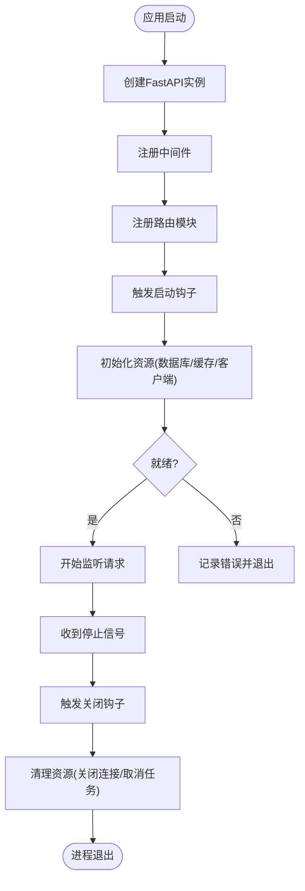

**图表来源** 
- [backend/main.py](file://backend/main.py)

**章节来源**
- [backend/main.py](file://backend/main.py)

### 配置与环境变量（config）
- 环境变量加载：优先读取环境变量，其次回退到默认值或配置文件；对关键配置进行类型转换与校验。
- 配置对象：提供强类型的配置类，供依赖注入使用，避免散落的字符串键访问。
- 敏感信息：对密钥、令牌等敏感字段进行隔离与最小化暴露。

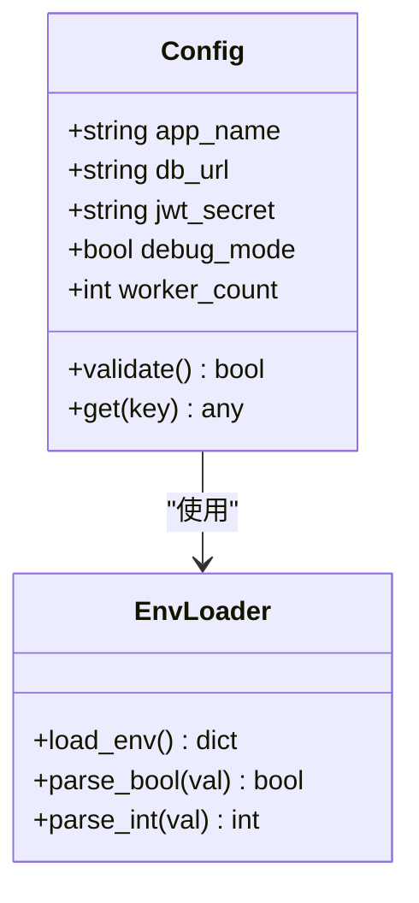

**图表来源** 
- [backend/config.py](file://backend/config.py)

**章节来源**
- [backend/config.py](file://backend/config.py)

### 数据库生命周期（database）
- 连接池管理：在启动阶段创建连接池，在关闭阶段安全释放；支持连接超时、重试与最大连接数限制。
- 健康检查：通过简单查询验证连接可用性，供探针端点使用。
- 事务与会话：为路由提供异步会话或连接上下文，确保请求内事务一致性。

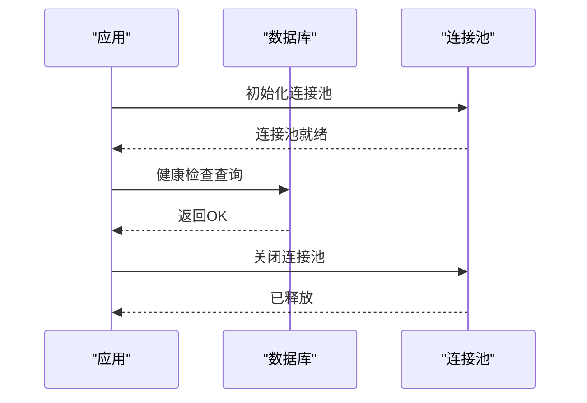

**图表来源** 
- [backend/database.py](file://backend/database.py)

**章节来源**
- [backend/database.py](file://backend/database.py)

### 安全与认证（security）
- 中间件：统一鉴权、CORS、速率限制、请求签名等。
- JWT处理：签发、校验、刷新令牌；支持黑名单与过期策略。
- 权限控制：基于角色或资源的访问控制，结合依赖注入注入当前用户上下文。

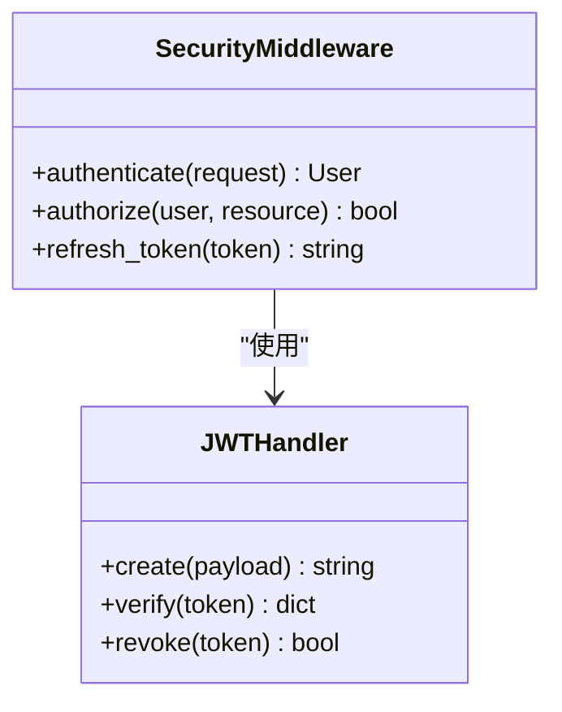

**图表来源** 
- [backend/security.py](file://backend/security.py)

**章节来源**
- [backend/security.py](file://backend/security.py)

### 路由与依赖注入（routers）
- 路由模块：按功能划分，每个模块注册到应用，定义RESTful端点。
- 依赖注入：使用Depends注入配置、数据库会话、用户上下文、服务实例等，保持高内聚低耦合。
- 健康检查端点：提供轻量级探针，返回应用状态与依赖健康情况。

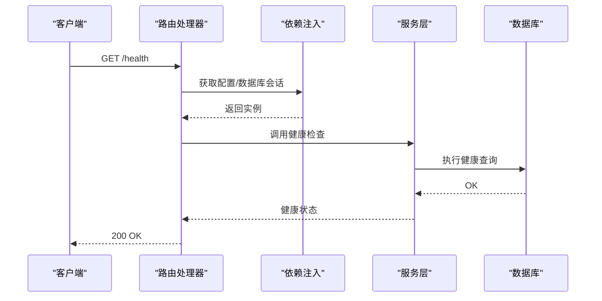

**图表来源** 
- [backend/routers/context.py](file://backend/routers/context.py)
- [backend/routers/query.py](file://backend/routers/query.py)
- [backend/routers/tasks.py](file://backend/routers/tasks.py)
- [backend/routers/records.py](file://backend/routers/records.py)
- [backend/routers/export.py](file://backend/routers/export.py)
- [backend/routers/sync.py](file://backend/routers/sync.py)
- [backend/routers/asr.py](file://backend/routers/asr.py)
- [backend/routers/mood.py](file://backend/routers/mood.py)
- [backend/routers/process.py](file://backend/routers/process.py)
- [backend/routers/timeline.py](file://backend/routers/timeline.py)
- [backend/routers/user.py](file://backend/routers/user.py)

**章节来源**
- [backend/routers/context.py](file://backend/routers/context.py)
- [backend/routers/query.py](file://backend/routers/query.py)
- [backend/routers/tasks.py](file://backend/routers/tasks.py)
- [backend/routers/records.py](file://backend/routers/records.py)
- [backend/routers/export.py](file://backend/routers/export.py)
- [backend/routers/sync.py](file://backend/routers/sync.py)
- [backend/routers/asr.py](file://backend/routers/asr.py)
- [backend/routers/mood.py](file://backend/routers/mood.py)
- [backend/routers/process.py](file://backend/routers/process.py)
- [backend/routers/timeline.py](file://backend/routers/timeline.py)
- [backend/routers/user.py](file://backend/routers/user.py)

### 服务层（services）
- 职责分离：将复杂业务逻辑从路由中抽离，提高可测试性与复用性。
- 依赖管理：通过依赖注入获取配置、数据库会话、缓存、消息队列等。
- 错误处理：统一异常映射与错误码，便于前端与监控消费。

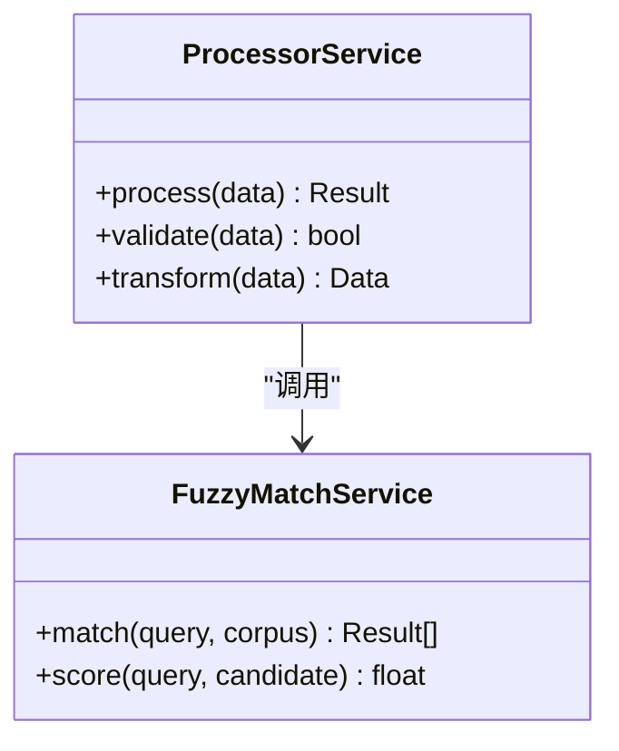

**图表来源** 
- [backend/services/processor.py](file://backend/services/processor.py)
- [backend/services/fuzzy_match.py](file://backend/services/fuzzy_match.py)

**章节来源**
- [backend/services/processor.py](file://backend/services/processor.py)
- [backend/services/fuzzy_match.py](file://backend/services/fuzzy_match.py)

### 数据模型与模式（models与schemas）
- ORM模型：定义表结构与关系，配合数据库迁移工具进行版本管理。
- Pydantic模式：统一请求与响应的数据结构，提供自动校验与序列化。

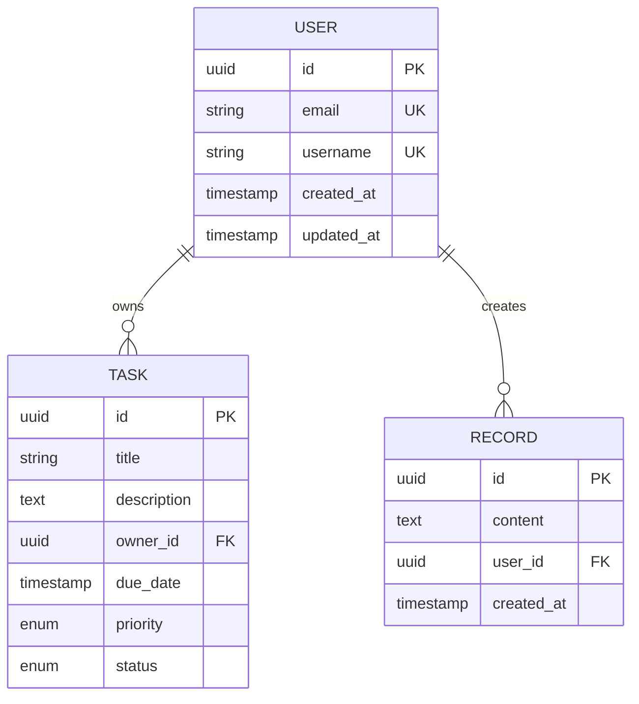

**图表来源** 
- [backend/models.py](file://backend/models.py)
- [backend/schemas.py](file://backend/schemas.py)

**章节来源**
- [backend/models.py](file://backend/models.py)
- [backend/schemas.py](file://backend/schemas.py)

## 依赖关系分析
- 内部依赖：main依赖config、database、security与各路由模块；路由模块依赖services与models/schemas。
- 外部依赖：数据库驱动、认证库、缓存客户端、消息队列SDK等，均在requirements中声明。
- 循环依赖：应避免路由与服务之间的循环导入，通过依赖注入解耦。

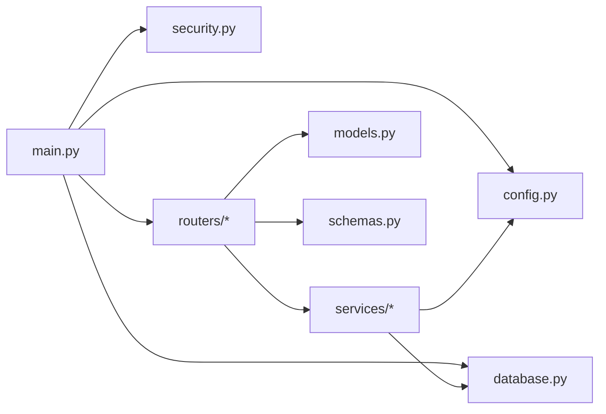

**图表来源** 
- [backend/main.py](file://backend/main.py)
- [backend/config.py](file://backend/config.py)
- [backend/database.py](file://backend/database.py)
- [backend/security.py](file://backend/security.py)
- [backend/routers/context.py](file://backend/routers/context.py)
- [backend/routers/query.py](file://backend/routers/query.py)
- [backend/routers/tasks.py](file://backend/routers/tasks.py)
- [backend/routers/records.py](file://backend/routers/records.py)
- [backend/routers/export.py](file://backend/routers/export.py)
- [backend/routers/sync.py](file://backend/routers/sync.py)
- [backend/routers/asr.py](file://backend/routers/asr.py)
- [backend/routers/mood.py](file://backend/routers/mood.py)
- [backend/routers/process.py](file://backend/routers/process.py)
- [backend/routers/timeline.py](file://backend/routers/timeline.py)
- [backend/routers/user.py](file://backend/routers/user.py)
- [backend/services/processor.py](file://backend/services/processor.py)
- [backend/services/fuzzy_match.py](file://backend/services/fuzzy_match.py)
- [backend/models.py](file://backend/models.py)
- [backend/schemas.py](file://backend/schemas.py)

**章节来源**
- [backend/requirements.txt](file://backend/requirements.txt)
- [backend/main.py](file://backend/main.py)
- [backend/config.py](file://backend/config.py)
- [backend/database.py](file://backend/database.py)
- [backend/security.py](file://backend/security.py)
- [backend/routers/context.py](file://backend/routers/context.py)
- [backend/routers/query.py](file://backend/routers/query.py)
- [backend/routers/tasks.py](file://backend/routers/tasks.py)
- [backend/routers/records.py](file://backend/routers/records.py)
- [backend/routers/export.py](file://backend/routers/export.py)
- [backend/routers/sync.py](file://backend/routers/sync.py)
- [backend/routers/asr.py](file://backend/routers/asr.py)
- [backend/routers/mood.py](file://backend/routers/mood.py)
- [backend/routers/process.py](file://backend/routers/process.py)
- [backend/routers/timeline.py](file://backend/routers/timeline.py)
- [backend/routers/user.py](file://backend/routers/user.py)
- [backend/services/processor.py](file://backend/services/processor.py)
- [backend/services/fuzzy_match.py](file://backend/services/fuzzy_match.py)
- [backend/models.py](file://backend/models.py)
- [backend/schemas.py](file://backend/schemas.py)

## 性能考虑
- 连接池与并发：合理设置数据库连接池大小与超时，避免连接耗尽；使用异步IO提升吞吐。
- 中间件开销：仅注册必要中间件，避免在中间件中执行重计算。
- 依赖注入缓存：对昂贵资源（如客户端实例）进行单例或缓存，减少重复创建。
- 监控指标：采集请求延迟、错误率、数据库连接使用率、GC停顿等指标，接入Prometheus或类似系统。
- 日志采样：在生产环境降低日志级别与采样率，避免I/O瓶颈。

[本节为通用指导，不直接分析具体文件]

## 故障排查指南
- 启动失败：检查环境变量与配置文件完整性，确认数据库可达与凭据正确。
- 健康检查异常：查看数据库连接与健康查询结果，确认依赖服务状态。
- 认证失败：检查JWT密钥、过期策略与令牌黑名单。
- 内存泄漏：定位未释放的连接或缓存，审查生命周期钩子是否执行关闭逻辑。
- 性能退化：分析慢查询与热点接口，优化索引与缓存策略。

**章节来源**
- [backend/main.py](file://backend/main.py)
- [backend/config.py](file://backend/config.py)
- [backend/database.py](file://backend/database.py)
- [backend/security.py](file://backend/security.py)
- [backend/routers/context.py](file://backend/routers/context.py)
- [backend/routers/query.py](file://backend/routers/query.py)
- [backend/routers/tasks.py](file://backend/routers/tasks.py)
- [backend/routers/records.py](file://backend/routers/records.py)
- [backend/routers/export.py](file://backend/routers/export.py)
- [backend/routers/sync.py](file://backend/routers/sync.py)
- [backend/routers/asr.py](file://backend/routers/asr.py)
- [backend/routers/mood.py](file://backend/routers/mood.py)
- [backend/routers/process.py](file://backend/routers/process.py)
- [backend/routers/timeline.py](file://backend/routers/timeline.py)
- [backend/routers/user.py](file://backend/routers/user.py)
- [backend/services/processor.py](file://backend/services/processor.py)
- [backend/services/fuzzy_match.py](file://backend/services/fuzzy_match.py)

## 结论
通过对FastAPI应用的生命周期、依赖注入、中间件、配置与环境变量、数据库连接、安全认证、路由与服务层、监控与排障的系统化梳理，读者可以构建稳定、可观测、易维护的后端服务。建议在生产环境中严格遵循健康检查、优雅停机与资源清理的最佳实践，并结合监控与日志体系持续优化性能与可靠性。

[本节为总结性内容，不直接分析具体文件]

## 附录

### 健康检查端点设计
- 目标：快速判断应用与关键依赖的健康状态。
- 行为：返回状态码与简要信息，包含数据库、缓存、外部服务状态。
- 探针集成：被Kubernetes或负载均衡器周期性探测。

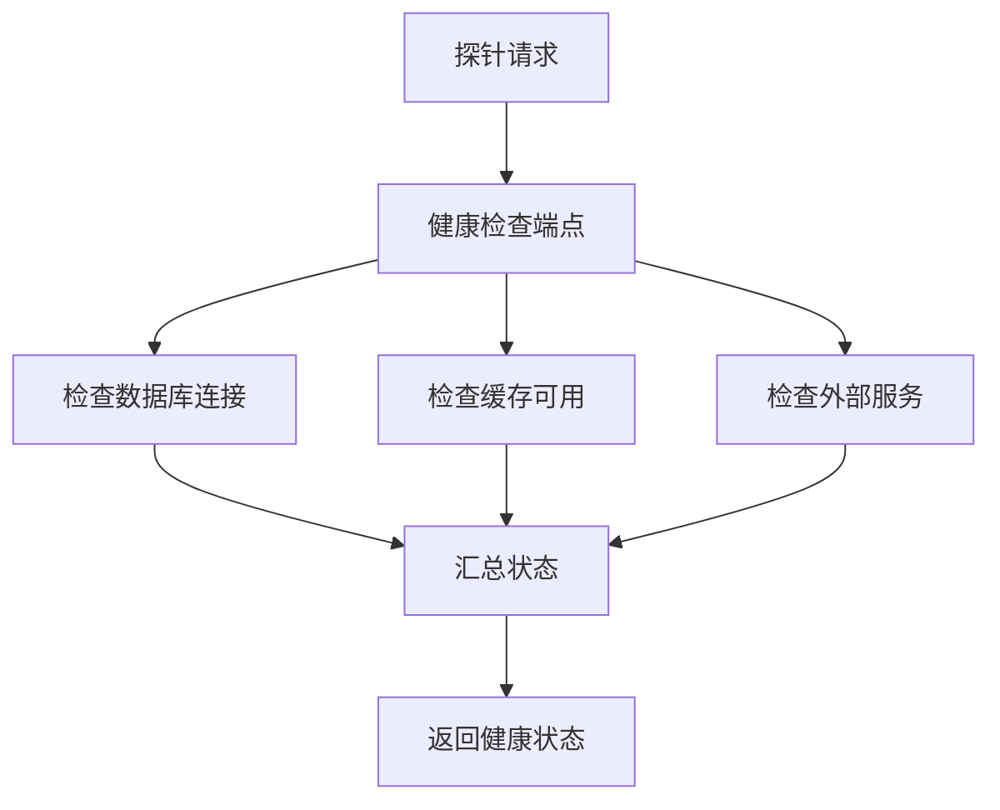

**图表来源** 
- [backend/routers/context.py](file://backend/routers/context.py)
- [backend/routers/query.py](file://backend/routers/query.py)
- [backend/routers/tasks.py](file://backend/routers/tasks.py)
- [backend/routers/records.py](file://backend/routers/records.py)
- [backend/routers/export.py](file://backend/routers/export.py)
- [backend/routers/sync.py](file://backend/routers/sync.py)
- [backend/routers/asr.py](file://backend/routers/asr.py)
- [backend/routers/mood.py](file://backend/routers/mood.py)
- [backend/routers/process.py](file://backend/routers/process.py)
- [backend/routers/timeline.py](file://backend/routers/timeline.py)
- [backend/routers/user.py](file://backend/routers/user.py)

**章节来源**
- [backend/routers/context.py](file://backend/routers/context.py)
- [backend/routers/query.py](file://backend/routers/query.py)
- [backend/routers/tasks.py](file://backend/routers/tasks.py)
- [backend/routers/records.py](file://backend/routers/records.py)
- [backend/routers/export.py](file://backend/routers/export.py)
- [backend/routers/sync.py](file://backend/routers/sync.py)
- [backend/routers/asr.py](file://backend/routers/asr.py)
- [backend/routers/mood.py](file://backend/routers/mood.py)
- [backend/routers/process.py](file://backend/routers/process.py)
- [backend/routers/timeline.py](file://backend/routers/timeline.py)
- [backend/routers/user.py](file://backend/routers/user.py)

### 优雅停机与资源清理策略
- 信号处理：捕获SIGTERM/SIGINT，停止接收新请求，等待进行中请求完成。
- 资源释放：关闭数据库连接池、取消后台任务、释放锁与临时文件。
- 通知上游：向负载均衡器或服务网格发送下线信号，避免流量继续进入。

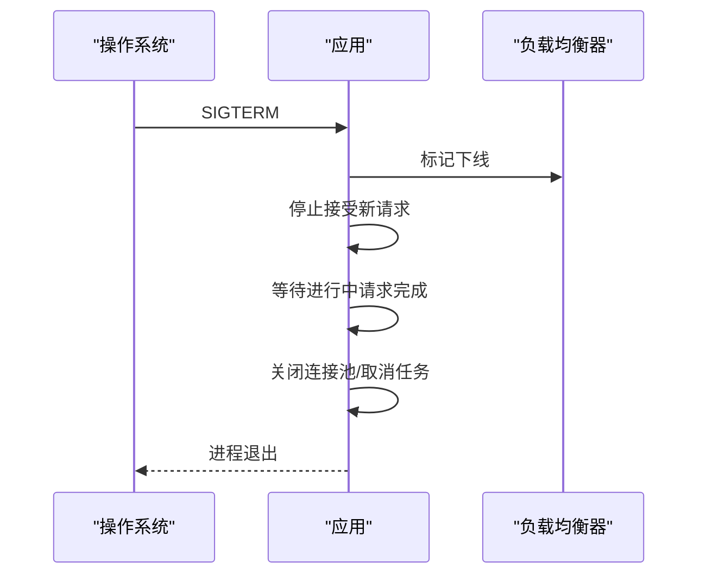

**图表来源** 
- [backend/main.py](file://backend/main.py)

**章节来源**
- [backend/main.py](file://backend/main.py)

### 热重载开发模式
- 启用方式：在开发环境下设置reload参数，使代码变更自动重启。
- 注意事项：避免在热重载期间执行耗时初始化；确保状态不可持久化或可恢复。

**章节来源**
- [backend/main.py](file://backend/main.py)

### 生产环境部署与容器化
- 部署脚本：使用deploy.sh进行构建、打包与发布。
- CI/CD：通过.github/workflows/deploy.yml自动化流水线。
- 容器化：基于多阶段镜像构建，最小化运行时依赖，暴露端口与探针端点。

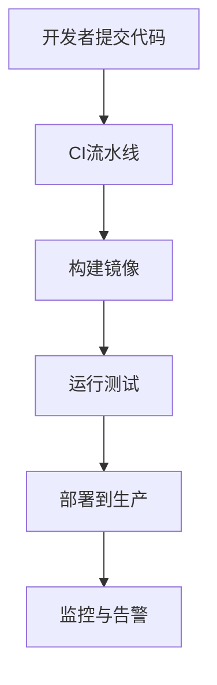

**图表来源** 
- [.github/workflows/deploy.yml](file://.github/workflows/deploy.yml)
- [deploy.sh](file://deploy.sh)

**章节来源**
- [.github/workflows/deploy.yml](file://.github/workflows/deploy.yml)
- [deploy.sh](file://deploy.sh)

### 性能监控、错误追踪与调试工具
- 指标采集：集成Prometheus客户端，暴露/metrics端点，采集请求计数、延迟分位数、错误率、资源使用率。
- 错误追踪：接入Sentry或类似平台，记录异常堆栈与上下文。
- 调试工具：使用Uvicorn的日志级别、FlameGraph火焰图、数据库慢查询日志进行定位。

**章节来源**
- [backend/main.py](file://backend/main.py)
- [backend/config.py](file://backend/config.py)
- [backend/database.py](file://backend/database.py)
- [backend/security.py](file://backend/security.py)
- [backend/routers/context.py](file://backend/routers/context.py)
- [backend/routers/query.py](file://backend/routers/query.py)
- [backend/routers/tasks.py](file://backend/routers/tasks.py)
- [backend/routers/records.py](file://backend/routers/records.py)
- [backend/routers/export.py](file://backend/routers/export.py)
- [backend/routers/sync.py](file://backend/routers/sync.py)
- [backend/routers/asr.py](file://backend/routers/asr.py)
- [backend/routers/mood.py](file://backend/routers/mood.py)
- [backend/routers/process.py](file://backend/routers/process.py)
- [backend/routers/timeline.py](file://backend/routers/timeline.py)
- [backend/routers/user.py](file://backend/routers/user.py)
- [backend/services/processor.py](file://backend/services/processor.py)
- [backend/services/fuzzy_match.py](file://backend/services/fuzzy_match.py)