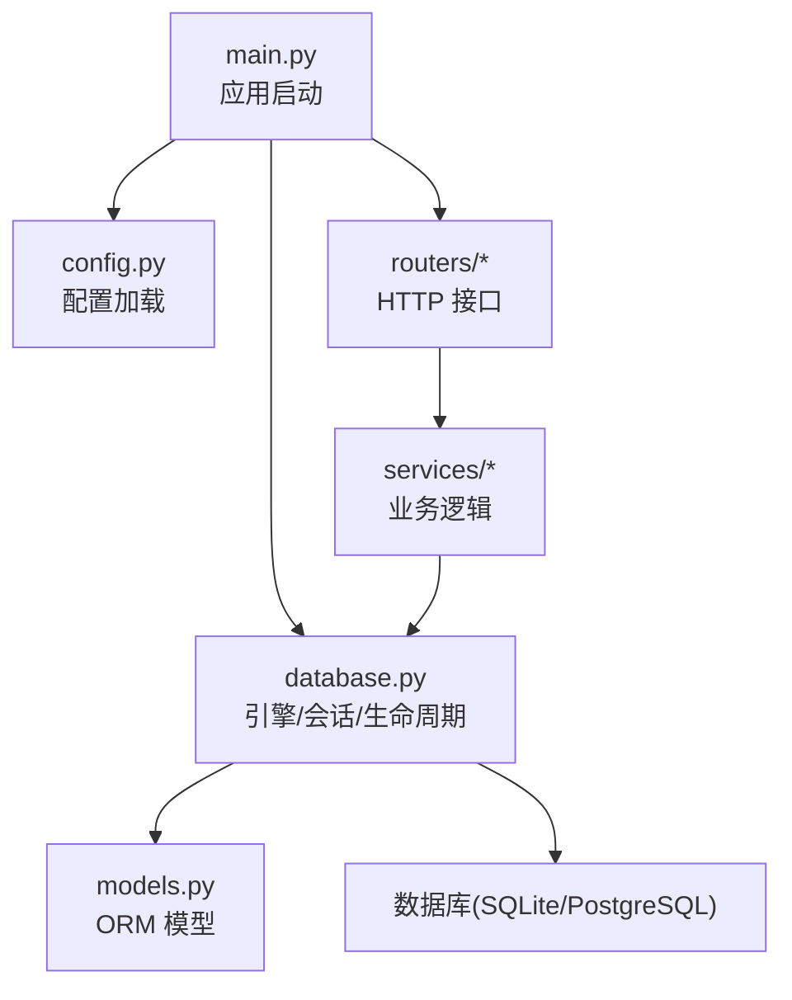
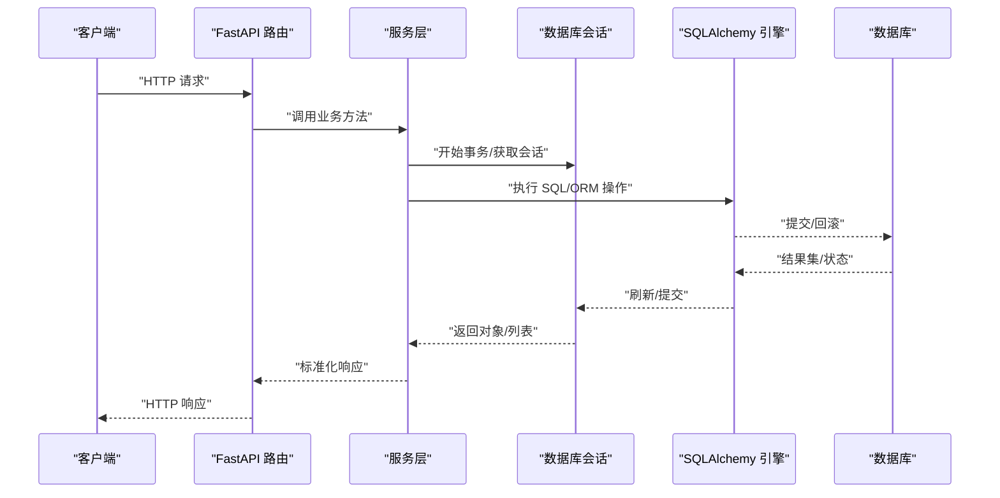
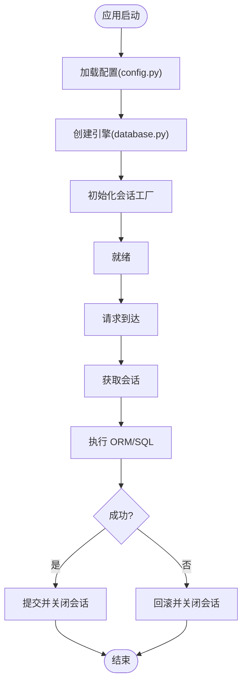
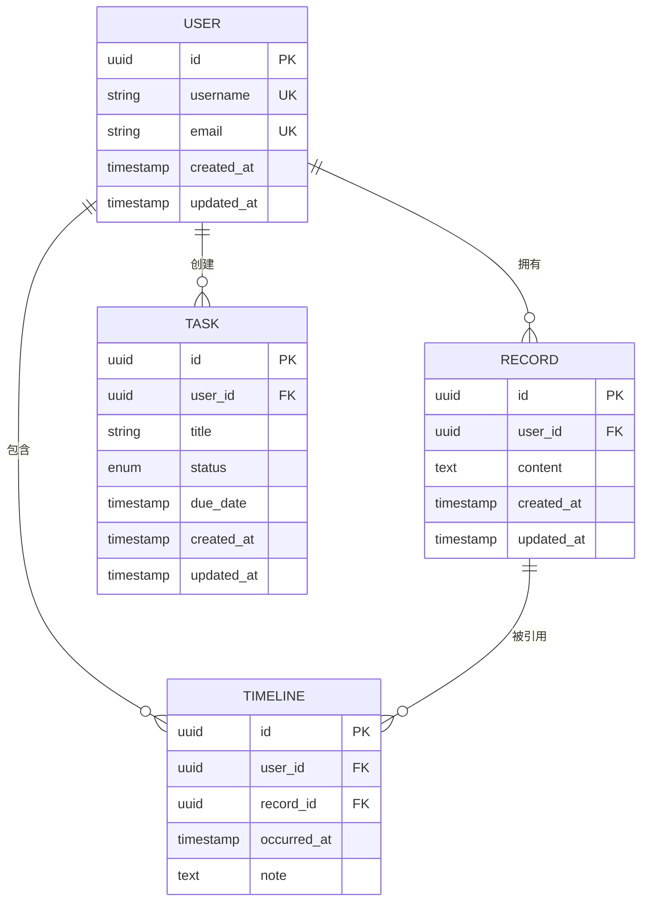
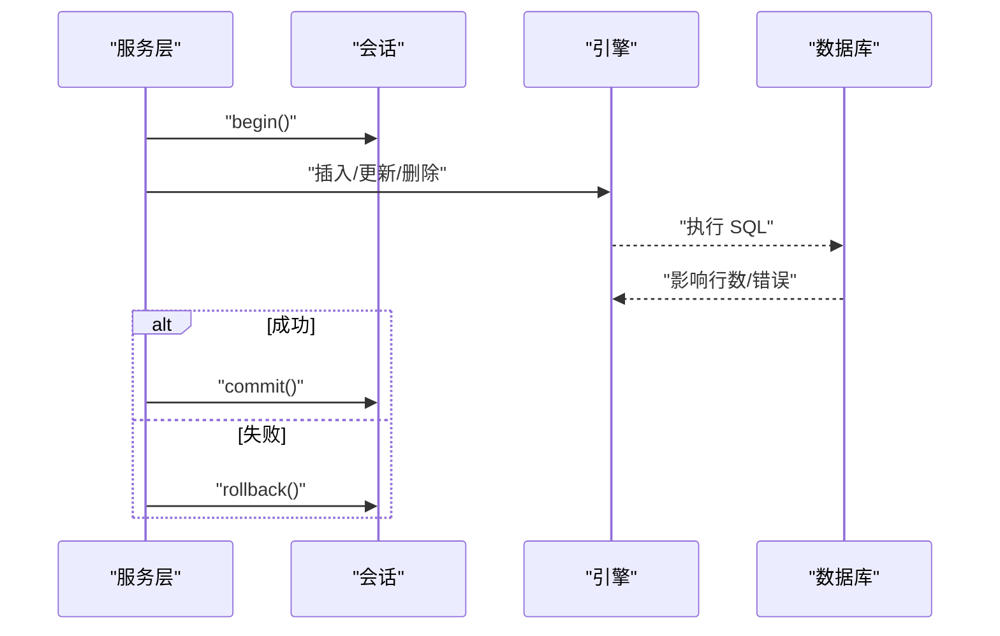
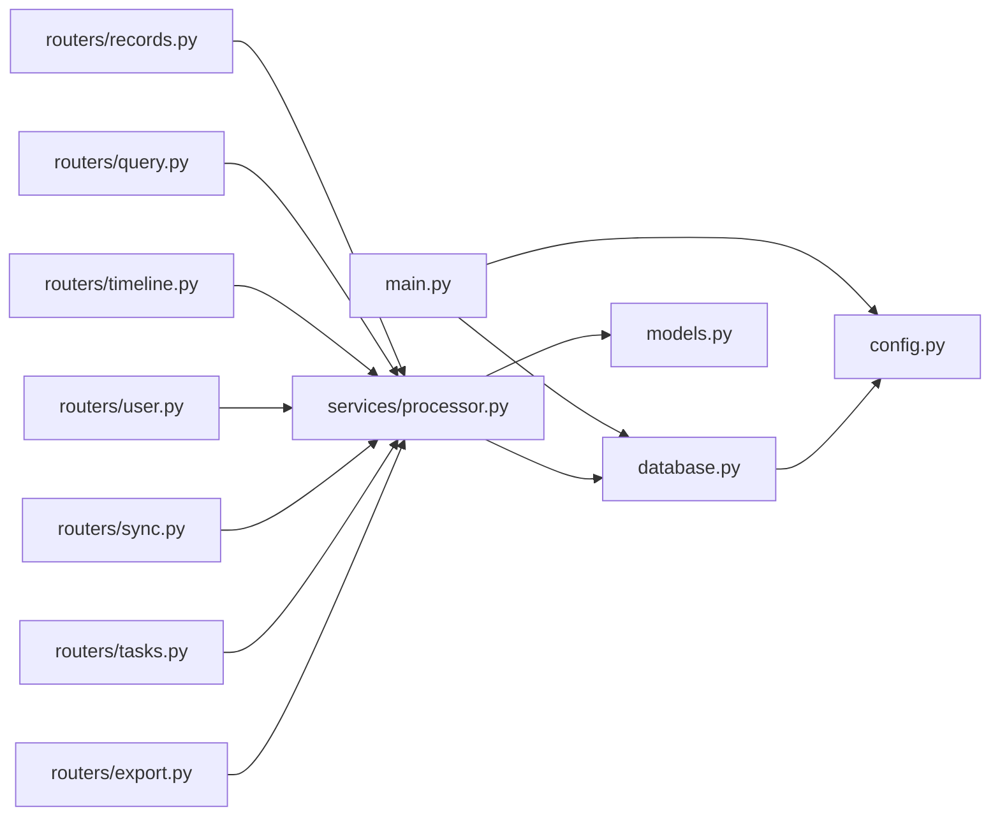

# 数据库设计

<cite>
**本文引用的文件**   
- [backend/database.py](file://backend/database.py)
- [backend/models.py](file://backend/models.py)
- [backend/config.py](file://backend/config.py)
- [backend/main.py](file://backend/main.py)
- [backend/routers/records.py](file://backend/routers/records.py)
- [backend/routers/query.py](file://backend/routers/query.py)
- [backend/routers/timeline.py](file://backend/routers/timeline.py)
- [backend/routers/user.py](file://backend/routers/user.py)
- [backend/routers/sync.py](file://backend/routers/sync.py)
- [backend/routers/tasks.py](file://backend/routers/tasks.py)
- [backend/routers/export.py](file://backend/routers/export.py)
- [backend/services/processor.py](file://backend/services/processor.py)
</cite>

## 目录
1. [简介](#简介)
2. [项目结构](#项目结构)
3. [核心组件](#核心组件)
4. [架构总览](#架构总览)
5. [详细组件分析](#详细组件分析)
6. [依赖关系分析](#依赖关系分析)
7. [性能考虑](#性能考虑)
8. [故障排查指南](#故障排查指南)
9. [结论](#结论)
10. [附录](#附录)

## 简介
本文件面向后端数据库设计与实现，围绕 SQLAlchemy ORM 模型、数据库连接管理、事务处理机制展开，系统阐述实体关系设计、索引策略、查询优化与数据迁移方案。同时覆盖数据验证规则、约束条件与业务规则落地；解释缓存策略、读写分离思路与数据库性能调优；提供数据备份恢复、安全访问控制与审计日志功能建议；并给出 Schema 版本管理与兼容性处理实践。

## 项目结构
后端采用 FastAPI + SQLAlchemy 的典型分层：配置与启动在 main.py，数据库会话与引擎在 database.py，ORM 模型在 models.py，路由层在各 routers/*.py，服务层在 services/*.py。数据库相关的关键点如下：
- 配置集中化：数据库 URL、连接池参数、异步/同步模式等由 config.py 统一暴露。
- 会话管理：database.py 负责创建引擎、会话工厂、生命周期钩子（应用启动/关闭）。
- 模型定义：models.py 使用 declarative_base 定义表结构与关系。
- 路由与服务：routers 和 services 通过依赖注入获取会话，执行 CRUD 与复杂查询。

图表来源
- [backend/main.py](file://backend/main.py)
- [backend/config.py](file://backend/config.py)
- [backend/database.py](file://backend/database.py)
- [backend/models.py](file://backend/models.py)

章节来源
- [backend/main.py](file://backend/main.py)
- [backend/config.py](file://backend/config.py)
- [backend/database.py](file://backend/database.py)
- [backend/models.py](file://backend/models.py)

## 核心组件
- 数据库连接与会话
  - 引擎与连接池：根据运行环境选择 SQLite 或 PostgreSQL，设置连接池大小、超时、回收策略。
  - 会话工厂：提供 scoped_session 或异步 Session，确保请求级隔离与线程安全。
  - 生命周期：应用启动时初始化引擎与会话，关闭时释放资源。
- ORM 模型
  - 使用 declarative_base 声明表映射，字段类型、默认值、唯一性、外键、级联删除等。
  - 关系定义：一对多、多对多、自引用等，配合 eager loading 减少 N+1 查询。
- 路由与服务
  - 路由层接收请求，调用服务层进行业务编排。
  - 服务层封装事务边界、数据校验、错误转换与返回体构造。

章节来源
- [backend/database.py](file://backend/database.py)
- [backend/models.py](file://backend/models.py)
- [backend/routers/records.py](file://backend/routers/records.py)
- [backend/routers/query.py](file://backend/routers/query.py)
- [backend/routers/timeline.py](file://backend/routers/timeline.py)
- [backend/routers/user.py](file://backend/routers/user.py)
- [backend/routers/sync.py](file://backend/routers/sync.py)
- [backend/routers/tasks.py](file://backend/routers/tasks.py)
- [backend/routers/export.py](file://backend/routers/export.py)
- [backend/services/processor.py](file://backend/services/processor.py)

## 架构总览
下图展示从 HTTP 请求到数据库的完整链路，以及事务边界与错误处理路径。

图表来源
- [backend/main.py](file://backend/main.py)
- [backend/database.py](file://backend/database.py)
- [backend/routers/records.py](file://backend/routers/records.py)
- [backend/services/processor.py](file://backend/services/processor.py)

## 详细组件分析

### 数据库连接与会话管理
- 引擎与连接池
  - 根据环境变量或配置文件动态选择驱动与连接参数。
  - 针对 SQLite 与 PostgreSQL 的差异进行适配（如并发限制、PRAGMA/SET 语句）。
- 会话工厂
  - 使用 scoped_session 保证每个请求拥有独立会话。
  - 在请求结束或异常时确保回滚与资源释放。
- 生命周期钩子
  - 应用启动：创建引擎、检查连接、生成必要表结构（可选）。
  - 应用关闭：关闭引擎、释放连接池。

图表来源
- [backend/config.py](file://backend/config.py)
- [backend/database.py](file://backend/database.py)
- [backend/main.py](file://backend/main.py)

章节来源
- [backend/config.py](file://backend/config.py)
- [backend/database.py](file://backend/database.py)
- [backend/main.py](file://backend/main.py)

### ORM 模型与实体关系
- 模型定义
  - 使用 declarative_base 定义基类，所有模型继承该基类。
  - 字段类型、默认值、非空约束、唯一约束、外键、级联策略清晰声明。
- 关系建模
  - 一对多：例如用户与记录、任务与时间线条目。
  - 多对多：标签与内容关联（如有）。
  - 自引用：层级结构（如上下文树）可通过 parent_id 外键实现。
- 查询优化
  - 使用 joinedload/subqueryload 预加载关联，避免 N+1。
  - 合理分页与过滤，减少全表扫描。

图表来源
- [backend/models.py](file://backend/models.py)

章节来源
- [backend/models.py](file://backend/models.py)

### 事务处理机制
- 事务边界
  - 服务层方法内开启事务，确保多个写操作的原子性。
  - 异常捕获后统一回滚，并转换为标准错误响应。
- 会话生命周期
  - 请求开始时获取会话，结束时提交或回滚。
  - 长事务需特别注意锁竞争与连接占用。
- 批量操作
  - 使用 bulk_insert/bulk_update 提升写入性能。
  - 分批提交，避免单事务过大导致锁膨胀。

图表来源
- [backend/services/processor.py](file://backend/services/processor.py)
- [backend/database.py](file://backend/database.py)

章节来源
- [backend/services/processor.py](file://backend/services/processor.py)
- [backend/database.py](file://backend/database.py)

### 数据验证规则、约束与业务规则
- 数据库层约束
  - NOT NULL、UNIQUE、CHECK、FOREIGN KEY 保障数据完整性。
- 应用层验证
  - 入参校验（长度、格式、范围），失败快速返回。
  - 业务规则：如任务截止日期不能早于当前时间、记录内容非空等。
- 一致性策略
  - 幂等写入：基于唯一键去重。
  - 冲突解决：合并策略、版本号或时间戳比较。

章节来源
- [backend/models.py](file://backend/models.py)
- [backend/routers/records.py](file://backend/routers/records.py)
- [backend/routers/tasks.py](file://backend/routers/tasks.py)
- [backend/routers/user.py](file://backend/routers/user.py)

### 索引策略与查询优化
- 索引设计
  - 高频查询列建立索引（如 user_id、created_at、status）。
  - 复合索引用于排序与过滤组合场景。
  - 避免过度索引，权衡写入性能。
- 查询优化
  - 使用 EXPLAIN 分析执行计划。
  - 避免 SELECT *，仅选取必要字段。
  - 合理使用分页与游标，降低内存占用。
- 关联查询优化
  - 预加载关联数据，减少 N+1。
  - 拆分复杂查询为多次简单查询，必要时在应用层聚合。

章节来源
- [backend/models.py](file://backend/models.py)
- [backend/routers/query.py](file://backend/routers/query.py)
- [backend/routers/timeline.py](file://backend/routers/timeline.py)

### 数据迁移方案
- 迁移工具
  - 推荐使用 Alembic 管理 Schema 变更，生成与执行迁移脚本。
- 迁移策略
  - 向后兼容：新增字段默认值、可空字段逐步填充。
  - 分阶段发布：先加字段，再回填，最后切换读取路径。
  - 回滚预案：保留旧表结构或数据快照。
- 自动化
  - CI/CD 中集成迁移执行与校验。

章节来源
- [backend/models.py](file://backend/models.py)
- [backend/config.py](file://backend/config.py)

### 缓存策略
- 多级缓存
  - 应用内存缓存（LRU）用于热点数据。
  - 分布式缓存（Redis）用于跨进程共享。
- 缓存失效
  - 基于版本号或时间戳失效。
  - 写操作后主动失效或延迟更新。
- 一致性
  - 读多写少场景优先保证最终一致。
  - 强一致场景避免缓存或采用短 TTL。

章节来源
- [backend/services/processor.py](file://backend/services/processor.py)
- [backend/routers/query.py](file://backend/routers/query.py)

### 读写分离
- 架构模式
  - 主库写、从库读，通过路由将读请求转发至只读副本。
- 实现要点
  - 会话工厂支持多引擎，按操作类型选择引擎。
  - 复制延迟容忍与重试策略。
- 适用场景
  - 高并发读、低并发写的数据分析或报表。

章节来源
- [backend/database.py](file://backend/database.py)
- [backend/config.py](file://backend/config.py)

### 数据备份与恢复
- 备份策略
  - 定期全量备份与增量备份结合。
  - 异地容灾与加密存储。
- 恢复演练
  - 定期演练恢复流程，验证数据一致性。
- 工具链
  - 原生工具（pg_dump、mysqldump）或云厂商托管备份。

章节来源
- [backend/config.py](file://backend/config.py)

### 安全访问控制与审计日志
- 访问控制
  - 基于角色的权限控制（RBAC），最小权限原则。
  - 敏感字段脱敏与加密存储。
- 审计日志
  - 记录关键操作（增删改）、IP、用户、时间戳。
  - 不可篡改日志存储（WORM 或区块链存证）。
- 合规要求
  - 数据留存周期与销毁策略。

章节来源
- [backend/security.py](file://backend/security.py)
- [backend/routers/user.py](file://backend/routers/user.py)

### Schema 版本管理与兼容性处理
- 版本管理
  - 使用 Alembic 维护迁移历史，禁止直接修改生产数据库。
- 兼容性
  - 向前兼容：新字段默认值、可选字段。
  - 向后兼容：旧字段保留一段时间，逐步废弃。
- 灰度发布
  - 双写双读过渡期，逐步切流。

章节来源
- [backend/models.py](file://backend/models.py)
- [backend/config.py](file://backend/config.py)

## 依赖关系分析
后端模块间的依赖关系如下：
- main.py 依赖 config.py 与 database.py 完成启动与资源初始化。
- routers/* 依赖 services/* 与 database.py 提供的会话。
- services/* 依赖 models.py 进行数据操作。
- database.py 依赖 config.py 获取连接参数。

图表来源
- [backend/main.py](file://backend/main.py)
- [backend/config.py](file://backend/config.py)
- [backend/database.py](file://backend/database.py)
- [backend/models.py](file://backend/models.py)
- [backend/routers/records.py](file://backend/routers/records.py)
- [backend/routers/query.py](file://backend/routers/query.py)
- [backend/routers/timeline.py](file://backend/routers/timeline.py)
- [backend/routers/user.py](file://backend/routers/user.py)
- [backend/routers/sync.py](file://backend/routers/sync.py)
- [backend/routers/tasks.py](file://backend/routers/tasks.py)
- [backend/routers/export.py](file://backend/routers/export.py)
- [backend/services/processor.py](file://backend/services/processor.py)

章节来源
- [backend/main.py](file://backend/main.py)
- [backend/config.py](file://backend/config.py)
- [backend/database.py](file://backend/database.py)
- [backend/models.py](file://backend/models.py)
- [backend/routers/records.py](file://backend/routers/records.py)
- [backend/routers/query.py](file://backend/routers/query.py)
- [backend/routers/timeline.py](file://backend/routers/timeline.py)
- [backend/routers/user.py](file://backend/routers/user.py)
- [backend/routers/sync.py](file://backend/routers/sync.py)
- [backend/routers/tasks.py](file://backend/routers/tasks.py)
- [backend/routers/export.py](file://backend/routers/export.py)
- [backend/services/processor.py](file://backend/services/processor.py)

## 性能考虑
- 连接池调优
  - 根据并发量调整 pool_size、max_overflow、pool_recycle。
  - 针对 SQLite 限制并发写，使用 WAL 模式提升读性能。
- 查询优化
  - 使用 EXPLAIN 分析慢查询，添加合适索引。
  - 避免大事务与长事务，拆分批量操作。
- 缓存与读写分离
  - 热点数据缓存，读多写少场景启用只读副本。
- 监控与告警
  - 采集慢查询、连接池使用率、锁等待等指标。

[本节为通用指导，不直接分析具体文件]

## 故障排查指南
- 常见问题
  - 连接超时：检查连接池参数与网络延迟。
  - 死锁：缩短事务、统一锁顺序、避免循环依赖。
  - 数据不一致：检查事务边界与回滚逻辑。
- 诊断步骤
  - 查看应用日志与数据库慢查询日志。
  - 使用 EXPLAIN 分析执行计划。
  - 复现问题并定位最近一次迁移。
- 恢复措施
  - 回滚迁移、恢复备份、清理锁与连接。

章节来源
- [backend/database.py](file://backend/database.py)
- [backend/services/processor.py](file://backend/services/processor.py)

## 结论
本数据库设计以 SQLAlchemy 为核心，结合 FastAPI 的分层架构，实现了清晰的模型定义、稳健的连接与会话管理、规范的事务处理与完善的迁移策略。通过索引优化、缓存与读写分离等手段提升性能，并通过备份恢复、安全控制与审计日志保障数据安全与合规。建议在后续迭代中持续完善监控与容量规划，确保系统稳定演进。

[本节为总结，不直接分析具体文件]

## 附录
- 术语表
  - ORM：对象关系映射
  - 会话：数据库连接的抽象，封装事务与查询
  - 迁移：数据库 Schema 的版本化管理
- 参考实践
  - Alembic 迁移最佳实践
  - SQLAlchemy 性能调优指南
  - 数据库备份与恢复策略

[本节为补充信息，不直接分析具体文件]