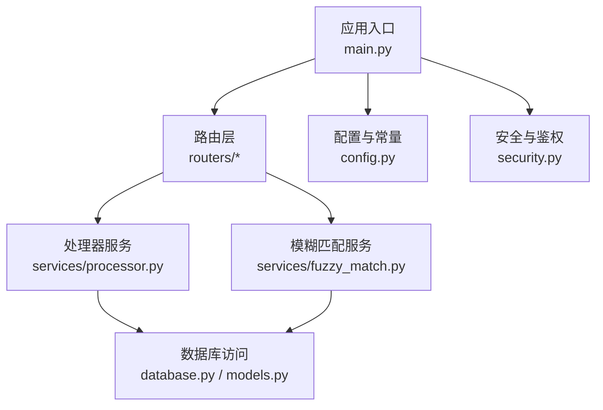
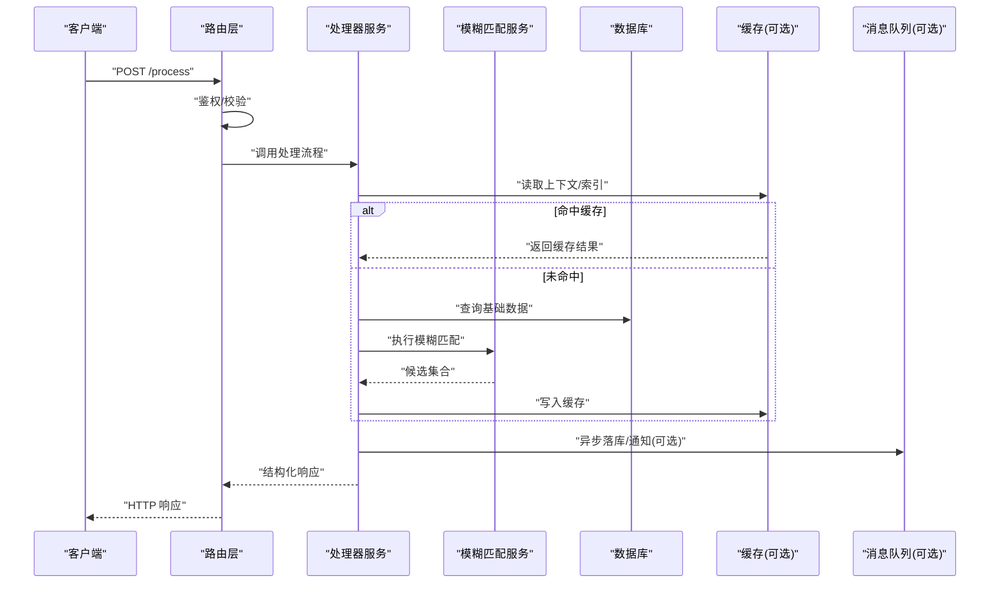
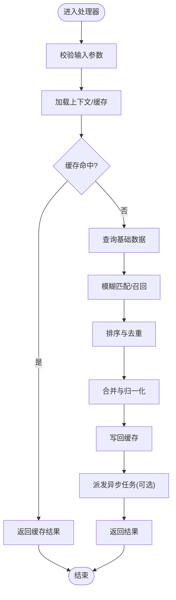
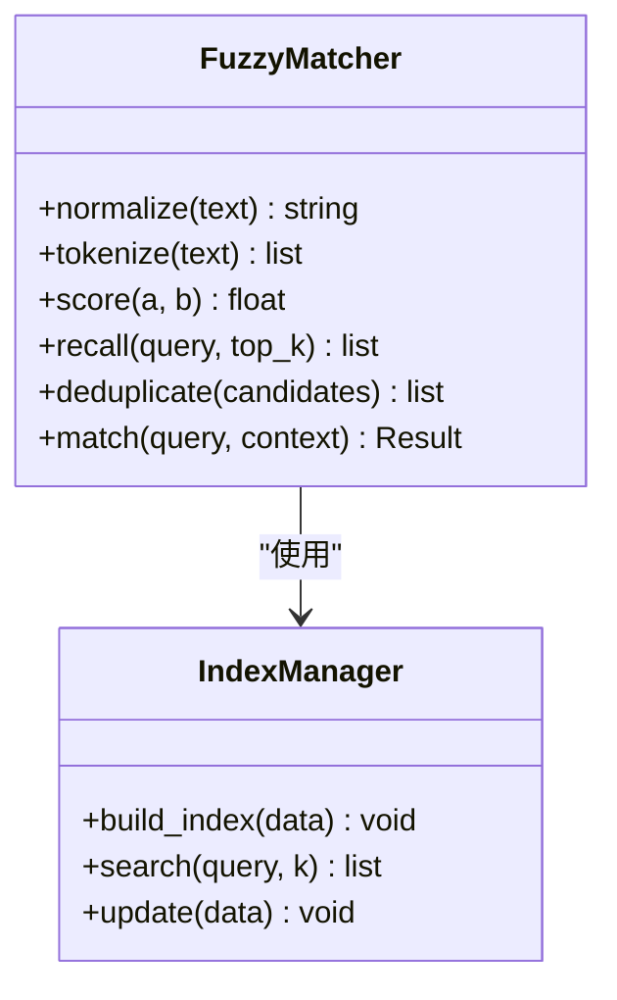
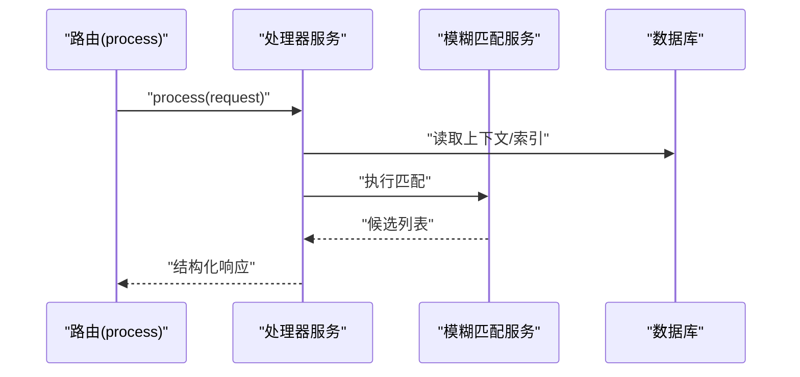
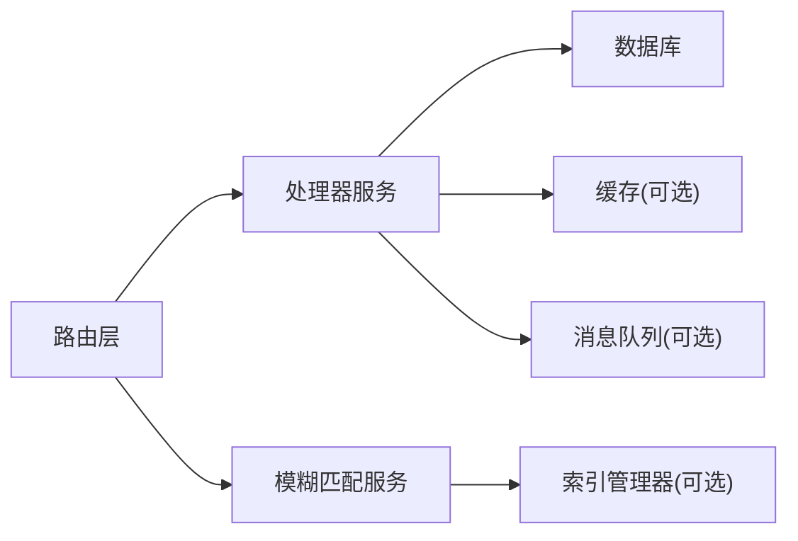

# 服务层架构

<cite>
**本文引用的文件**   
- [backend/main.py](file://backend/main.py)
- [backend/config.py](file://backend/config.py)
- [backend/database.py](file://backend/database.py)
- [backend/models.py](file://backend/models.py)
- [backend/schemas.py](file://backend/schemas.py)
- [backend/security.py](file://backend/security.py)
- [backend/routers/process.py](file://backend/routers/process.py)
- [backend/routers/query.py](file://backend/routers/query.py)
- [backend/routers/tasks.py](file://backend/routers/tasks.py)
- [backend/routers/asr.py](file://backend/routers/asr.py)
- [backend/routers/context.py](file://backend/routers/context.py)
- [backend/routers/export.py](file://backend/routers/export.py)
- [backend/routers/merge.py](file://backend/routers/merge.py)
- [backend/routers/mood.py](file://backend/routers/mood.py)
- [backend/routers/records.py](file://backend/routers/records.py)
- [backend/routers/sync.py](file://backend/routers/sync.py)
- [backend/routers/timeline.py](file://backend/routers/timeline.py)
- [backend/routers/user.py](file://backend/routers/user.py)
- [backend/services/processor.py](file://backend/services/processor.py)
- [backend/services/fuzzy_match.py](file://backend/services/fuzzy_match.py)
</cite>

## 目录
1. [简介](#简介)
2. [项目结构](#项目结构)
3. [核心组件](#核心组件)
4. [架构总览](#架构总览)
5. [详细组件分析](#详细组件分析)
6. [依赖关系分析](#依赖关系分析)
7. [性能考量](#性能考量)
8. [故障排查指南](#故障排查指南)
9. [结论](#结论)
10. [附录](#附录)

## 简介
本文件面向后端服务层的模块化设计，聚焦处理器服务的职责分离、模糊匹配算法的实现原理与服务间通信机制。文档同时覆盖数据处理流程、业务逻辑封装、缓存策略与性能优化方案，并阐述异步任务处理、消息队列集成与分布式服务协调思路。最后提供服务监控、日志记录与错误恢复机制的实践建议，以及扩展接口与插件化设计模式，帮助读者在现有代码基础上进行二次开发与扩展。

## 项目结构
后端采用分层与按功能模块组织相结合的结构：
- 入口与配置：应用启动、全局配置、数据库连接初始化
- 路由层：HTTP 接口定义与请求分发
- 服务层：处理器服务与领域能力（如模糊匹配）
- 数据模型与校验：ORM 模型与 Pydantic 校验
- 安全与鉴权：认证与权限控制

图表来源
- [backend/main.py](file://backend/main.py)
- [backend/routers/process.py](file://backend/routers/process.py)
- [backend/services/processor.py](file://backend/services/processor.py)
- [backend/services/fuzzy_match.py](file://backend/services/fuzzy_match.py)
- [backend/database.py](file://backend/database.py)
- [backend/models.py](file://backend/models.py)
- [backend/config.py](file://backend/config.py)
- [backend/security.py](file://backend/security.py)

章节来源
- [backend/main.py](file://backend/main.py)
- [backend/config.py](file://backend/config.py)
- [backend/database.py](file://backend/database.py)
- [backend/models.py](file://backend/models.py)
- [backend/schemas.py](file://backend/schemas.py)
- [backend/security.py](file://backend/security.py)

## 核心组件
- 应用入口与中间件：统一注册路由、挂载跨域、静态资源、异常处理与日志中间件
- 路由层：按领域划分处理器（process、query、tasks、asr、context、export、merge、mood、records、sync、timeline、user），每个路由负责单一职责的 HTTP 端点编排
- 服务层：
  - 处理器服务：聚合多步骤数据处理、调用下游服务、编排事务与重试
  - 模糊匹配服务：实现文本相似度计算与候选召回、排序与去重
- 数据层：ORM 模型与查询封装，配合 Pydantic Schema 做输入输出校验
- 安全层：JWT/会话鉴权、角色权限、敏感参数脱敏

章节来源
- [backend/routers/process.py](file://backend/routers/process.py)
- [backend/routers/query.py](file://backend/routers/query.py)
- [backend/routers/tasks.py](file://backend/routers/tasks.py)
- [backend/routers/asr.py](file://backend/routers/asr.py)
- [backend/routers/context.py](file://backend/routers/context.py)
- [backend/routers/export.py](file://backend/routers/export.py)
- [backend/routers/merge.py](file://backend/routers/merge.py)
- [backend/routers/mood.py](file://backend/routers/mood.py)
- [backend/routers/records.py](file://backend/routers/records.py)
- [backend/routers/sync.py](file://backend/routers/sync.py)
- [backend/routers/timeline.py](file://backend/routers/timeline.py)
- [backend/routers/user.py](file://backend/routers/user.py)
- [backend/services/processor.py](file://backend/services/processor.py)
- [backend/services/fuzzy_match.py](file://backend/services/fuzzy_match.py)
- [backend/models.py](file://backend/models.py)
- [backend/schemas.py](file://backend/schemas.py)
- [backend/security.py](file://backend/security.py)

## 架构总览
服务层采用“路由编排 + 服务编排”的分层模式：
- 路由层仅做参数校验、鉴权与调用服务层方法
- 服务层承载业务编排、外部调用、缓存与重试
- 数据层通过 ORM 与连接池管理持久化
- 可选的消息队列与缓存作为横向扩展点

图表来源
- [backend/routers/process.py](file://backend/routers/process.py)
- [backend/services/processor.py](file://backend/services/processor.py)
- [backend/services/fuzzy_match.py](file://backend/services/fuzzy_match.py)
- [backend/database.py](file://backend/database.py)

## 详细组件分析

### 处理器服务（Processor Service）
职责与边界
- 编排数据处理流水线：清洗、分词、索引构建、候选召回、排序、合并、去重
- 管理缓存读写与失效策略
- 协调外部服务（ASR、NLP、搜索等）与数据库事务
- 暴露统一的 API 供路由层调用

关键流程
- 输入校验与上下文加载
- 缓存优先策略：命中则直接返回；未命中则走数据库与匹配服务
- 并发调用与超时控制
- 结果归一化与缓存回填
- 异步任务派发（导出、统计、索引重建）

图表来源
- [backend/services/processor.py](file://backend/services/processor.py)
- [backend/services/fuzzy_match.py](file://backend/services/fuzzy_match.py)
- [backend/database.py](file://backend/database.py)

章节来源
- [backend/services/processor.py](file://backend/services/processor.py)
- [backend/routers/process.py](file://backend/routers/process.py)

### 模糊匹配服务（Fuzzy Match）
算法要点
- 预处理：标准化、分词、停用词过滤、同义词归一
- 相似度度量：编辑距离、Jaccard、余弦相似度或向量检索（根据数据规模选择）
- 召回与排序：Top-K 候选、阈值过滤、权重打分
- 去重与合并：基于规则或学习式融合

复杂度与优化
- 时间复杂度受候选集大小与相似度函数影响，可通过倒排索引或近似最近邻加速
- 空间复杂度由索引结构与缓存决定，需结合内存限制做分页与淘汰

图表来源
- [backend/services/fuzzy_match.py](file://backend/services/fuzzy_match.py)

章节来源
- [backend/services/fuzzy_match.py](file://backend/services/fuzzy_match.py)

### 路由层与处理器协作
- 路由层只负责鉴权、参数校验、限流与调用服务层
- 处理器服务对外暴露统一方法，屏蔽内部复杂逻辑
- 错误码与异常映射到标准 HTTP 状态码

图表来源
- [backend/routers/process.py](file://backend/routers/process.py)
- [backend/services/processor.py](file://backend/services/processor.py)
- [backend/services/fuzzy_match.py](file://backend/services/fuzzy_match.py)
- [backend/database.py](file://backend/database.py)

章节来源
- [backend/routers/process.py](file://backend/routers/process.py)
- [backend/services/processor.py](file://backend/services/processor.py)

### 其他领域路由（概览）
- query：查询类接口，侧重检索与展示
- tasks：任务管理与状态跟踪
- asr：语音识别相关接口
- context：上下文维护与注入
- export：批量导出与报表生成
- merge：数据合并与冲突解决
- mood：情绪分析与标签
- records：记录增删改查
- sync：数据同步与增量更新
- timeline：时间线聚合与渲染
- user：用户与权限

章节来源
- [backend/routers/query.py](file://backend/routers/query.py)
- [backend/routers/tasks.py](file://backend/routers/tasks.py)
- [backend/routers/asr.py](file://backend/routers/asr.py)
- [backend/routers/context.py](file://backend/routers/context.py)
- [backend/routers/export.py](file://backend/routers/export.py)
- [backend/routers/merge.py](file://backend/routers/merge.py)
- [backend/routers/mood.py](file://backend/routers/mood.py)
- [backend/routers/records.py](file://backend/routers/records.py)
- [backend/routers/sync.py](file://backend/routers/sync.py)
- [backend/routers/timeline.py](file://backend/routers/timeline.py)
- [backend/routers/user.py](file://backend/routers/user.py)

## 依赖关系分析
- 路由层依赖服务层，服务层依赖数据层与安全模块
- 模糊匹配服务可依赖索引管理器与缓存
- 处理器服务可能依赖消息队列与外部服务

图表来源
- [backend/routers/process.py](file://backend/routers/process.py)
- [backend/services/processor.py](file://backend/services/processor.py)
- [backend/services/fuzzy_match.py](file://backend/services/fuzzy_match.py)
- [backend/database.py](file://backend/database.py)

章节来源
- [backend/main.py](file://backend/main.py)
- [backend/config.py](file://backend/config.py)
- [backend/database.py](file://backend/database.py)

## 性能考量
- 缓存策略
  - 多级缓存：本地内存 + 分布式缓存（Redis/Memcached）
  - 热点数据预取与 TTL 控制，避免雪崩
- 数据库优化
  - 连接池、索引优化、分页与投影字段裁剪
  - 读写分离与慢查询监控
- 匹配算法优化
  - 倒排索引、近似最近邻、向量化检索
  - Top-K 剪枝与阈值过滤减少计算量
- 并发与异步
  - 异步 I/O 与协程提升吞吐
  - 任务队列解耦耗时操作（导出、索引重建）
- 资源治理
  - 限流、熔断、降级与超时控制
  - 连接池与线程池上限配置

[本节为通用指导，不直接分析具体文件]

## 故障排查指南
- 常见问题定位
  - 参数校验失败：检查路由层入参校验与默认值
  - 缓存不一致：核对键空间、TTL 与失效策略
  - 匹配质量差：检查预处理、相似度函数与阈值
  - 数据库慢查询：查看索引与执行计划
- 日志与监控
  - 结构化日志：请求 ID、耗时、关键指标
  - 指标上报：QPS、延迟、错误率、缓存命中率
  - 链路追踪：跨服务调用链可视化
- 错误恢复
  - 幂等设计与重试策略（指数退避）
  - 死信队列与人工干预通道
  - 健康检查与自动重启

章节来源
- [backend/security.py](file://backend/security.py)
- [backend/database.py](file://backend/database.py)
- [backend/services/processor.py](file://backend/services/processor.py)

## 结论
本服务层以清晰的分层与职责分离为基础，通过处理器服务编排复杂流程，模糊匹配服务提供可扩展的相似度计算能力。借助缓存、索引与异步任务，系统在高并发与大数据量场景下具备良好性能与稳定性。建议在后续迭代中完善监控与可观测性，引入消息队列与分布式协调机制，并通过插件化接口持续扩展业务能力。

[本节为总结性内容，不直接分析具体文件]

## 附录
- 扩展接口建议
  - 处理器管道：以阶段插件形式接入清洗、分词、召回、排序、合并等步骤
  - 匹配算法插件：支持多种相似度度量与索引后端
  - 存储与缓存适配器：统一抽象，便于替换实现
- 插件化设计模式
  - 注册表与工厂：动态加载与按需实例化
  - 钩子与事件：在关键节点触发扩展逻辑
  - 配置驱动：通过配置文件切换策略与参数

[本节为概念性内容，不直接分析具体文件]