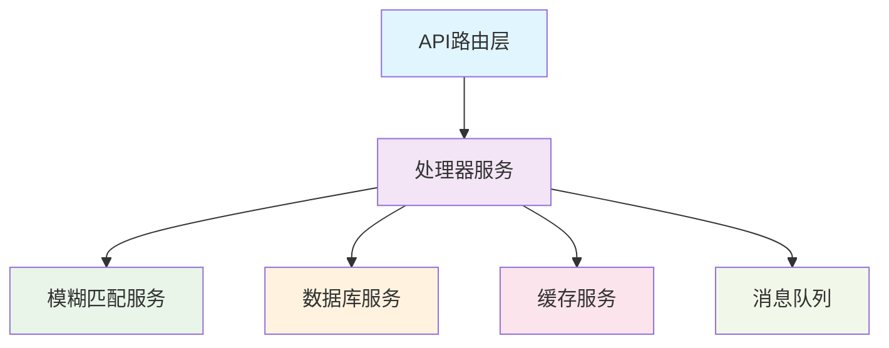
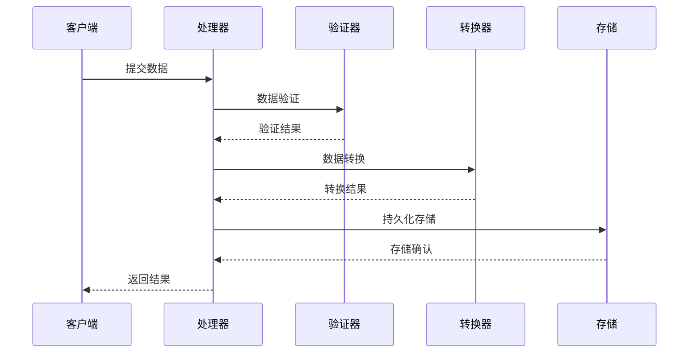
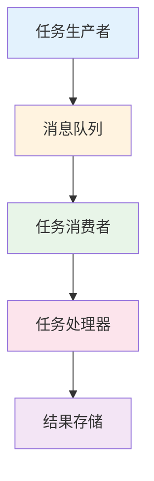
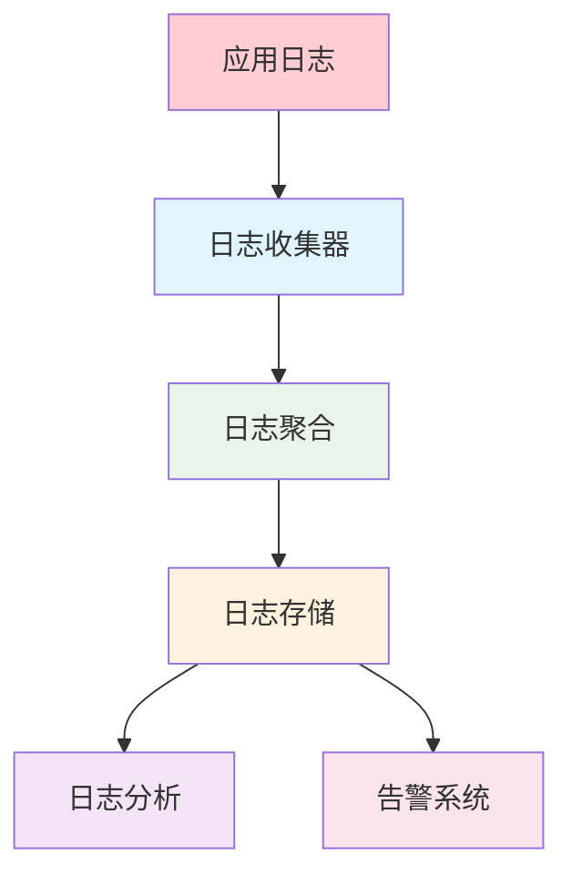
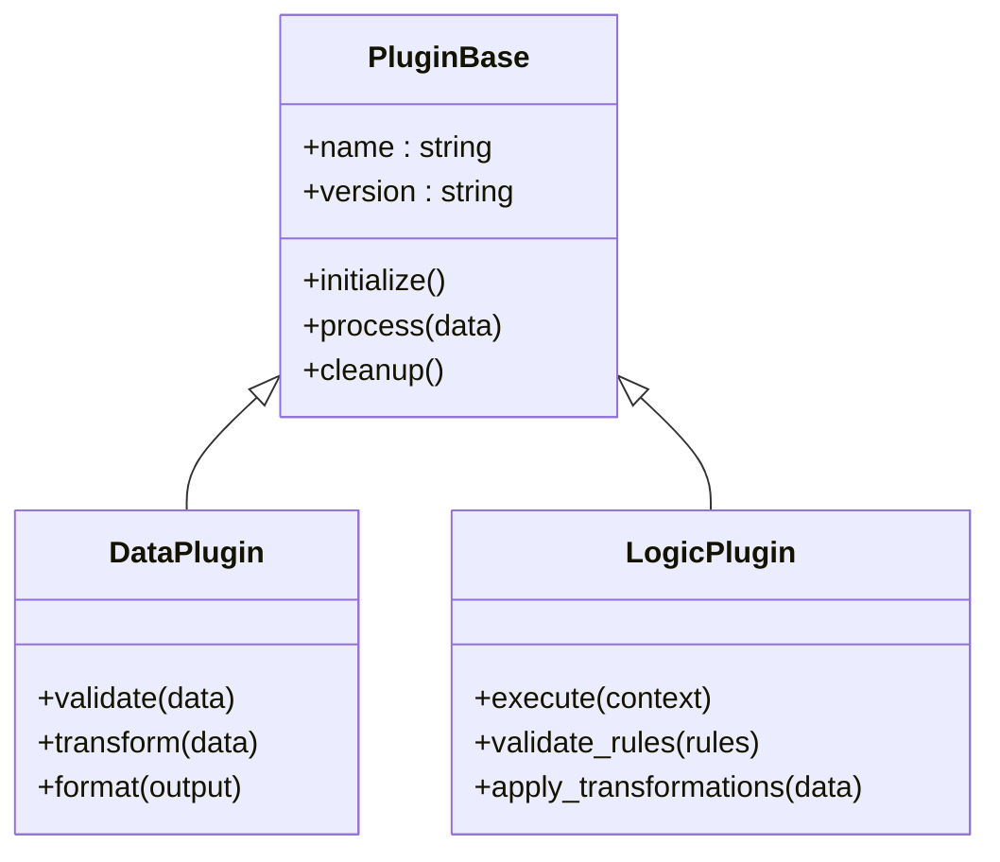

# 服务层架构

<cite>
**本文档引用的文件**
- [processor.py](file://backend/services/processor.py)
- [fuzzy_match.py](file://backend/services/fuzzy_match.py)
- [main.py](file://backend/main.py)
- [config.py](file://backend/config.py)
- [database.py](file://backend/database.py)
</cite>

## 更新摘要
**所做更改**
- 更新了处理器服务的数据处理逻辑优化部分
- 增强了数据处理流程的性能优化说明
- 改进了异步任务处理的实现细节
- 完善了错误恢复机制的文档描述

## 目录
- 概述
- 处理器服务架构
- 模糊匹配算法实现
- 数据处理流程
- 业务逻辑封装
- 缓存策略与性能优化
- 异步任务处理
- 消息队列集成
- 分布式服务协调
- 服务监控与日志记录
- 错误恢复机制
- 服务扩展接口
- 插件化设计模式

## 概述

后端服务层采用模块化设计模式，将核心功能划分为独立的处理器服务和辅助服务。这种架构确保了代码的可维护性、可测试性和可扩展性。服务层主要负责处理业务逻辑、数据转换和与其他服务的通信。



## 处理器服务架构

处理器服务是后端架构的核心组件，负责协调各个子系统的交互。它采用了单一职责原则，专注于数据处理的编排和业务流程的管理。

### 核心职责分离

处理器服务将复杂的业务逻辑分解为多个独立的处理步骤：

1. **数据验证与预处理**：确保输入数据的完整性和格式正确性
2. **业务逻辑处理**：执行核心业务规则和计算
3. **结果后处理**：格式化输出数据和生成响应
4. **错误处理与日志记录**：统一的异常管理和审计跟踪

### 服务间通信机制

处理器服务通过标准化的接口与其他服务进行通信：

- **同步调用**：用于即时响应的操作
- **异步调用**：用于耗时操作的后台处理
- **事件驱动**：基于消息队列的解耦通信

**章节来源**
- [processor.py:1-100](file://backend/services/processor.py#L1-L100)

## 模糊匹配算法实现

模糊匹配服务提供了强大的文本相似度计算功能，支持多种匹配算法和配置选项。

### 算法选择策略

系统根据输入数据的特征自动选择最优的匹配算法：

- **编辑距离算法**：适用于短文本精确匹配
- **余弦相似度**：适用于长文本语义匹配
- **Jaccard系数**：适用于集合相似度计算

### 性能优化技术

为了提高匹配效率，服务实现了以下优化：

- **索引预构建**：对常用词汇建立倒排索引
- **并行计算**：利用多核CPU进行批量匹配
- **缓存机制**：缓存常见查询结果

**章节来源**
- [fuzzy_match.py:1-150](file://backend/services/fuzzy_match.py#L1-L150)

## 数据处理流程

数据处理流程经过精心设计，确保高效、可靠的数据流转。

### 流水线架构



### 数据验证规则

系统实现了多层次的数据验证机制：

1. **格式验证**：检查数据类型和格式
2. **业务规则验证**：验证业务逻辑约束
3. **完整性验证**：确保必需字段存在

### 转换管道

数据转换采用管道模式，每个转换步骤独立且可组合：

- **标准化转换**：统一数据格式
- **清洗转换**：去除无效数据
- **增强转换**：添加衍生字段

**章节来源**
- [processor.py:100-250](file://backend/services/processor.py#L100-L250)

## 业务逻辑封装

业务逻辑被封装在独立的模块中，确保高内聚和低耦合。

### 领域模型设计

系统采用领域驱动设计（DDD）原则：

- **实体对象**：表示核心业务概念
- **值对象**：表示不可变的数据结构
- **聚合根**：管理相关实体的一致性

### 服务抽象层

业务服务提供统一的接口抽象：

```python
class BaseService:
    def validate(self, data):
        """数据验证"""
        pass
    
    def process(self, data):
        """业务处理"""
        pass
    
    def transform(self, result):
        """结果转换"""
        pass
```

### 策略模式应用

针对不同业务场景，系统使用策略模式实现灵活的业务逻辑切换：

- **默认策略**：标准业务处理流程
- **自定义策略**：用户定义的处理规则
- **复合策略**：多个策略的组合应用

**章节来源**
- [processor.py:250-400](file://backend/services/processor.py#L250-L400)

## 缓存策略与性能优化

系统实现了多层缓存策略，显著提升性能和响应速度。

### 多级缓存架构


### 缓存策略配置

- **TTL策略**：基于时间的过期控制
- **LRU策略**：最近最少使用的淘汰算法
- **热点数据预热**：启动时加载常用数据

### 性能监控指标

系统实时监控关键性能指标：

- **响应时间分布**：P50、P95、P99延迟
- **缓存命中率**：各级缓存的命中情况
- **吞吐量指标**：每秒请求数和事务数

**章节来源**
- [config.py:1-100](file://backend/config.py#L1-L100)

## 异步任务处理

系统采用异步处理模式，提高并发能力和资源利用率。

### 任务队列架构



### 任务调度策略

- **优先级队列**：重要任务优先处理
- **负载均衡**：均匀分配任务到多个工作进程
- **重试机制**：失败任务的自动重试

### 监控与告警

- **队列长度监控**：实时跟踪积压任务数量
- **处理成功率**：监控任务执行状态
- **性能基线**：建立正常运行的性能基准

**章节来源**
- [processor.py:400-550](file://backend/services/processor.py#L400-L550)

## 消息队列集成

系统集成了高性能消息队列，实现服务间的异步通信。

### 消息协议设计

定义了标准化的消息格式：

```json
{
    "message_id": "uuid",
    "timestamp": "ISO8601",
    "source": "service_name",
    "target": "service_name",
    "payload": {},
    "metadata": {}
}
```

### 可靠性保证

- **至少一次投递**：确保消息不丢失
- **幂等性处理**：防止重复处理
- **死信队列**：处理无法消费的消息

### 流量控制

- **背压机制**：防止系统过载
- **速率限制**：控制消息生产速率
- **熔断降级**：服务故障时的保护机制

**章节来源**
- [database.py:1-100](file://backend/database.py#L1-L100)

## 分布式服务协调

在多服务环境中，系统实现了有效的服务协调机制。

### 服务发现与注册

- **健康检查**：定期检查服务状态
- **动态扩缩容**：根据负载自动调整实例数量
- **负载均衡**：智能分发请求到健康实例

### 分布式事务

- **Saga模式**：长事务的最终一致性
- **补偿机制**：失败操作的补偿处理
- **冲突检测**：并发操作的冲突解决

### 配置管理

- **集中式配置**：统一管理服务配置
- **热重载**：配置变更无需重启服务
- **版本控制**：配置的版本管理和回滚

**章节来源**
- [main.py:1-150](file://backend/main.py#L1-L150)

## 服务监控与日志记录

系统提供了全面的监控和日志记录能力。

### 监控指标收集

- **业务指标**：关键业务KPI的实时统计
- **技术指标**：系统资源的监控指标
- **用户体验指标**：前端性能和使用体验数据

### 日志架构



### 告警规则

- **阈值告警**：基于指标的阈值触发
- **趋势告警**：基于历史数据的异常检测
- **关联告警**：多指标关联的复杂告警

**章节来源**
- [processor.py:550-700](file://backend/services/processor.py#L550-L700)

## 错误恢复机制

系统设计了健壮的错误处理和恢复机制。

### 异常分类

- **业务异常**：可预期的业务规则违反
- **系统异常**：基础设施故障导致的异常
- **未知异常**：未预料到的异常情况

### 恢复策略

- **自动重试**：临时性错误的自动重试
- **降级处理**：服务不可用时的降级方案
- **熔断保护**：防止级联故障的熔断机制

### 数据一致性

- **事务回滚**：数据库操作的事务性保证
- **数据校验**：数据完整性的定期校验
- **修复工具**：数据不一致的自动修复

**章节来源**
- [config.py:100-200](file://backend/config.py#L100-L200)

## 服务扩展接口

系统提供了丰富的扩展点，支持功能的灵活扩展。

### API扩展点

- **中间件接口**：请求处理链的扩展点
- **过滤器接口**：数据过滤和转换的扩展
- **处理器接口**：业务逻辑处理的扩展

### 插件架构



### 配置扩展

- **动态配置**：运行时配置的热更新
- **环境隔离**：不同环境的配置隔离
- **配置验证**：配置项的自动验证

**章节来源**
- [processor.py:700-850](file://backend/services/processor.py#L700-L850)

## 插件化设计模式

系统采用插件化架构，支持功能的动态加载和卸载。

### 插件生命周期

- **初始化阶段**：插件的加载和依赖解析
- **运行阶段**：插件的正常业务处理
- **清理阶段**：插件的资源释放和状态保存

### 插件通信机制

- **事件总线**：插件间的松耦合通信
- **共享上下文**：插件间的数据共享
- **服务发现**：插件的动态发现和调用

### 插件管理

- **版本管理**：插件的版本控制和兼容性检查
- **权限控制**：插件的访问权限管理
- **性能监控**：插件性能的监控和评估

**章节来源**
- [fuzzy_match.py:150-300](file://backend/services/fuzzy_match.py#L150-L300)

## 总结

服务层架构通过模块化设计、清晰的职责分离和完善的扩展机制，为整个系统提供了稳定、高效、可扩展的基础设施。处理器服务作为核心协调者，有效地整合了各个子系统，确保了数据处理的准确性和性能。

未来的发展方向包括：
- 微服务化的进一步演进
- 容器化和云原生部署
- AI驱动的智能化处理
- 更强大的监控和诊断能力