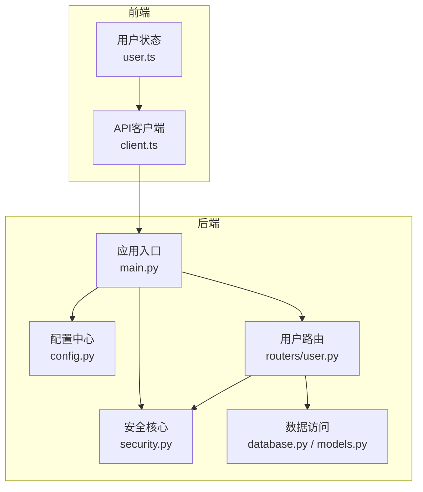
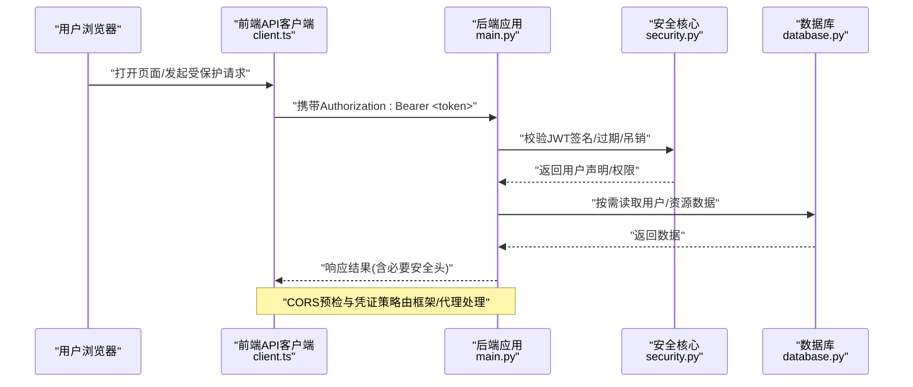
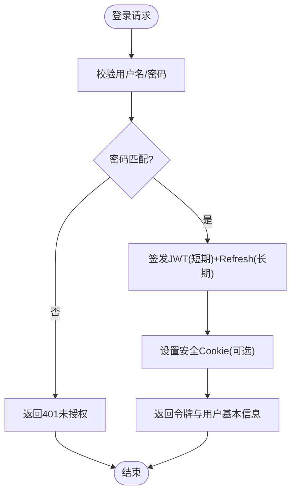
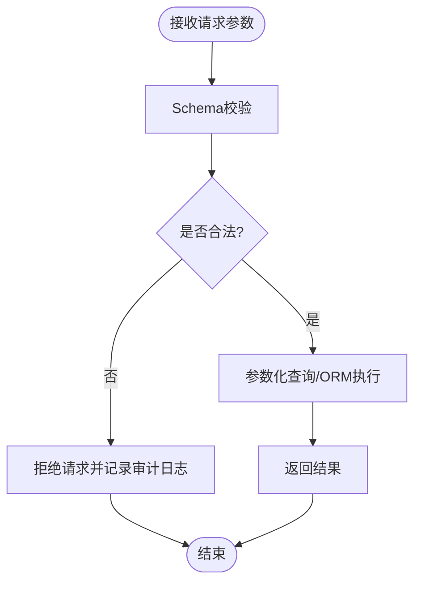
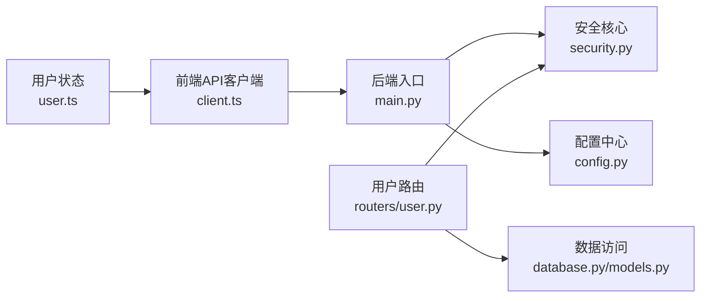

# 安全架构设计

<cite>
**本文档引用的文件**   
- [backend/security.py](file://backend/security.py)
- [backend/config.py](file://backend/config.py)
- [backend/main.py](file://backend/main.py)
- [backend/database.py](file://backend/database.py)
- [backend/models.py](file://backend/models.py)
- [backend/routers/user.py](file://backend/routers/user.py)
- [frontend/src/api/client.ts](file://frontend/src/api/client.ts)
- [frontend/src/user.ts](file://frontend/src/user.ts)
- [deploy.sh](file://deploy.sh)
</cite>

## 目录
1. [简介](#简介)
2. [项目结构](#项目结构)
3. [核心组件](#核心组件)
4. [架构总览](#架构总览)
5. [详细组件分析](#详细组件分析)
6. [依赖关系分析](#依赖关系分析)
7. [性能与安全权衡](#性能与安全权衡)
8. [故障排查指南](#故障排查指南)
9. [结论](#结论)
10. [附录](#附录)

## 简介
本文件面向后端与前端的安全架构设计与实现，聚焦身份认证、授权控制、数据加密与传输安全、JWT令牌机制、密码哈希存储、CORS配置、HTTPS强制启用、输入验证、SQL注入防护、XSS防御、安全审计与日志记录、以及安全配置管理。文档同时给出常见威胁的应对方案与最佳实践，帮助开发者在现有代码基础上持续加固系统安全性。

## 项目结构
后端采用模块化路由与服务分离，安全相关能力集中在独立模块中：
- 安全核心：security.py（JWT、密码哈希、权限校验）
- 配置中心：config.py（环境变量、密钥、CORS、数据库连接等）
- 应用入口：main.py（中间件、全局异常、CORS、HTTPS策略）
- 数据层：database.py、models.py（ORM模型、查询封装）
- 用户域路由：routers/user.py（注册/登录/鉴权流程）
- 前端客户端：frontend/src/api/client.ts（请求拦截、Token注入）、frontend/src/user.ts（本地Token管理）
- 部署脚本：deploy.sh（反向代理、TLS证书、安全头）

**图表来源** 
- [backend/main.py](file://backend/main.py)
- [backend/security.py](file://backend/security.py)
- [backend/config.py](file://backend/config.py)
- [backend/database.py](file://backend/database.py)
- [backend/models.py](file://backend/models.py)
- [backend/routers/user.py](file://backend/routers/user.py)
- [frontend/src/api/client.ts](file://frontend/src/api/client.ts)
- [frontend/src/user.ts](file://frontend/src/user.ts)

**章节来源**
- [backend/main.py](file://backend/main.py)
- [backend/security.py](file://backend/security.py)
- [backend/config.py](file://backend/config.py)
- [backend/database.py](file://backend/database.py)
- [backend/models.py](file://backend/models.py)
- [backend/routers/user.py](file://backend/routers/user.py)
- [frontend/src/api/client.ts](file://frontend/src/api/client.ts)
- [frontend/src/user.ts](file://frontend/src/user.ts)

## 核心组件
- 身份认证与授权
  - JWT签发与校验：基于对称或非对称算法，设置过期时间、刷新机制、黑名单（可选）。
  - 密码哈希存储：使用强哈希算法（如bcrypt/argon2），固定轮次/内存参数，避免明文或弱哈希。
  - 角色与权限：基于声明的角色/资源维度进行细粒度授权，结合路由装饰器或中间件统一拦截。
- 传输安全
  - HTTPS强制：通过反向代理或框架级重定向，确保所有流量走TLS。
  - Cookie安全：HttpOnly、Secure、SameSite属性；敏感操作二次确认。
- CORS与跨域
  - 白名单域名、允许方法/头部、预检缓存、凭证模式严格限制。
- 输入验证与输出编码
  - 请求体/路径/查询参数严格校验，拒绝非法类型与长度越界。
  - 输出侧对HTML/JS上下文进行编码，防止XSS。
- SQL注入防护
  - 全量使用参数化查询/ORM，禁止字符串拼接SQL。
- 审计与日志
  - 关键事件（登录、授权失败、敏感操作）结构化日志，脱敏敏感字段，集中收集。
- 配置管理
  - 密钥与凭据从环境变量注入，禁止硬编码；最小权限原则。

**章节来源**
- [backend/security.py](file://backend/security.py)
- [backend/config.py](file://backend/config.py)
- [backend/main.py](file://backend/main.py)
- [backend/routers/user.py](file://backend/routers/user.py)
- [frontend/src/api/client.ts](file://frontend/src/api/client.ts)
- [frontend/src/user.ts](file://frontend/src/user.ts)

## 架构总览
下图展示从前端到后端的认证与授权调用链，以及安全组件的协作方式。

**图表来源** 
- [backend/main.py](file://backend/main.py)
- [backend/security.py](file://backend/security.py)
- [backend/database.py](file://backend/database.py)
- [frontend/src/api/client.ts](file://frontend/src/api/client.ts)

## 详细组件分析

### 身份认证与JWT令牌机制
- 令牌生命周期
  - 登录成功后签发短期Access Token，配合Refresh Token延长会话。
  - 支持服务端黑名单或短过期+无状态校验的组合策略。
- 令牌安全
  - 签名算法选择（HS256/RS256），私钥/公钥安全管理。
  - 载荷最小化，避免敏感信息入Token。
- 前端集成
  - 自动注入Authorization头，错误码401触发重新登录或刷新。
  - 本地存储仅保存必要的令牌引用，避免持久化敏感数据。

**图表来源** 
- [backend/security.py](file://backend/security.py)
- [backend/routers/user.py](file://backend/routers/user.py)
- [frontend/src/api/client.ts](file://frontend/src/api/client.ts)

**章节来源**
- [backend/security.py](file://backend/security.py)
- [backend/routers/user.py](file://backend/routers/user.py)
- [frontend/src/api/client.ts](file://frontend/src/api/client.ts)
- [frontend/src/user.ts](file://frontend/src/user.ts)

### 密码哈希存储
- 算法选择：优先使用抗GPU破解的算法（如bcrypt/argon2），合理设置成本参数。
- 存储规范：仅存盐值与哈希值，不保留原始密码；定期评估参数强度。
- 迁移策略：旧系统升级时提供渐进式迁移与双写兼容。

**章节来源**
- [backend/security.py](file://backend/security.py)

### CORS配置与跨域安全
- 策略要点：
  - 明确允许的源、方法、头部；生产环境禁用通配符。
  - 开启凭证模式时，必须指定具体Origin，并谨慎暴露敏感头。
  - 预检请求缓存时间合理设置，减少重复开销。
- 实施位置：
  - 后端框架中间件统一配置；反向代理层可叠加额外限制。

**章节来源**
- [backend/config.py](file://backend/config.py)
- [backend/main.py](file://backend/main.py)

### 传输安全与HTTPS强制
- 强制HTTPS：
  - 反向代理（Nginx/Traefik）统一终止TLS，后端仅接受HTTPS。
  - 框架层重定向HTTP至HTTPS，设置HSTS。
- 安全头：
  - Content-Security-Policy、X-Content-Type-Options、Strict-Transport-Security等。
- 前端：
  - 仅通过HTTPS调用API；禁用明文协议。

**章节来源**
- [backend/main.py](file://backend/main.py)
- [deploy.sh](file://deploy.sh)

### 输入验证与SQL注入防护
- 输入验证：
  - 使用严格的Schema校验（类型、长度、格式、枚举），拒绝非法输入。
  - 对富文本进行白名单过滤与上下文编码。
- SQL注入防护：
  - 全量使用参数化查询或ORM；禁止动态拼接SQL片段。
  - 对复杂查询构建器进行安全审查与单元测试覆盖。

**图表来源** 
- [backend/routers/user.py](file://backend/routers/user.py)
- [backend/database.py](file://backend/database.py)
- [backend/models.py](file://backend/models.py)

**章节来源**
- [backend/routers/user.py](file://backend/routers/user.py)
- [backend/database.py](file://backend/database.py)
- [backend/models.py](file://backend/models.py)

### XSS攻击防御
- 输出编码：根据上下文（HTML/JS/CSS/URL）进行对应编码。
- CSP策略：限制脚本来源、内联脚本、不安全源。
- 富文本处理：服务端白名单过滤，前端渲染前再次校验。

**章节来源**
- [backend/main.py](file://backend/main.py)
- [frontend/src/api/client.ts](file://frontend/src/api/client.ts)

### 安全审计与日志记录
- 审计范围：登录成功/失败、权限拒绝、敏感数据访问、配置变更。
- 日志规范：结构化JSON、包含时间戳、来源IP、用户ID、操作结果；脱敏敏感字段。
- 集中采集：接入日志平台，设置告警阈值与留存策略。

**章节来源**
- [backend/main.py](file://backend/main.py)
- [backend/security.py](file://backend/security.py)

### 安全配置管理
- 密钥管理：通过环境变量或密钥管理服务注入，禁止硬编码。
- 最小权限：数据库账号、服务间调用均遵循最小权限。
- 配置校验：启动时校验必填项与取值范围，失败即中止。

**章节来源**
- [backend/config.py](file://backend/config.py)

## 依赖关系分析
- 模块耦合：
  - main.py作为入口，依赖security.py、config.py、各路由模块。
  - routers/user.py依赖security.py进行鉴权，依赖database.py进行数据访问。
  - 前端client.ts依赖user.ts进行令牌管理，统一注入Authorization头。
- 外部依赖：
  - 反向代理与TLS证书管理（deploy.sh）。
  - 数据库驱动与ORM（database.py/models.py）。

**图表来源** 
- [backend/main.py](file://backend/main.py)
- [backend/security.py](file://backend/security.py)
- [backend/config.py](file://backend/config.py)
- [backend/routers/user.py](file://backend/routers/user.py)
- [backend/database.py](file://backend/database.py)
- [backend/models.py](file://backend/models.py)
- [frontend/src/api/client.ts](file://frontend/src/api/client.ts)
- [frontend/src/user.ts](file://frontend/src/user.ts)

**章节来源**
- [backend/main.py](file://backend/main.py)
- [backend/security.py](file://backend/security.py)
- [backend/config.py](file://backend/config.py)
- [backend/routers/user.py](file://backend/routers/user.py)
- [backend/database.py](file://backend/database.py)
- [backend/models.py](file://backend/models.py)
- [frontend/src/api/client.ts](file://frontend/src/api/client.ts)
- [frontend/src/user.ts](file://frontend/src/user.ts)

## 性能与安全权衡
- JWT无状态校验降低数据库压力，但需配合短过期与刷新机制平衡安全与体验。
- CORS预检与CSP会增加首屏与请求开销，应合理缓存与精简策略。
- 强哈希算法增加CPU消耗，需按业务规模调整成本参数。
- 审计日志写入异步化，避免阻塞主流程。

[本节为通用指导，无需特定文件来源]

## 故障排查指南
- 认证失败
  - 检查JWT签名与过期时间、客户端时间同步、网络代理是否篡改头。
  - 核对CORS配置与凭证模式，确认预检请求通过。
- 权限拒绝
  - 核查用户角色与资源权限映射，确认路由装饰器/中间件生效。
- 跨域问题
  - 确认Origin白名单、AllowedHeaders、AllowCredentials设置一致。
- HTTPS问题
  - 检查反向代理证书有效性、HSTS配置、前端协议一致性。
- 日志定位
  - 查看审计日志中的错误码、请求ID、用户上下文，快速定位根因。

**章节来源**
- [backend/security.py](file://backend/security.py)
- [backend/main.py](file://backend/main.py)
- [backend/config.py](file://backend/config.py)
- [frontend/src/api/client.ts](file://frontend/src/api/client.ts)

## 结论
本安全架构围绕“最小信任、纵深防御”的原则，将认证、授权、加密、传输、输入校验、审计与配置管理贯穿前后端与部署链路。建议持续进行威胁建模、渗透测试与依赖漏洞扫描，结合运行时监控与告警，形成闭环安全治理。

[本节为总结性内容，无需特定文件来源]

## 附录
- 安全最佳实践清单
  - 强制HTTPS与HSTS，禁用弱加密套件。
  - JWT短过期+刷新，必要时引入黑名单。
  - 密码哈希使用强算法与足够成本参数。
  - 严格输入校验与输出编码，防范XSS/注入。
  - CORS最小化开放，生产禁用通配符。
  - 审计日志脱敏与集中采集，设置告警阈值。
  - 密钥与环境变量管理，禁止硬编码。
- 常见威胁与对策
  - 暴力破解：限流、验证码、账户锁定。
  - CSRF：SameSite Cookie、双重提交Token。
  - 中间人攻击：证书绑定、HSTS、严格TLS版本。
  - 数据泄露：最小化敏感字段、传输与存储加密、访问审计。

[本节为通用指导，无需特定文件来源]