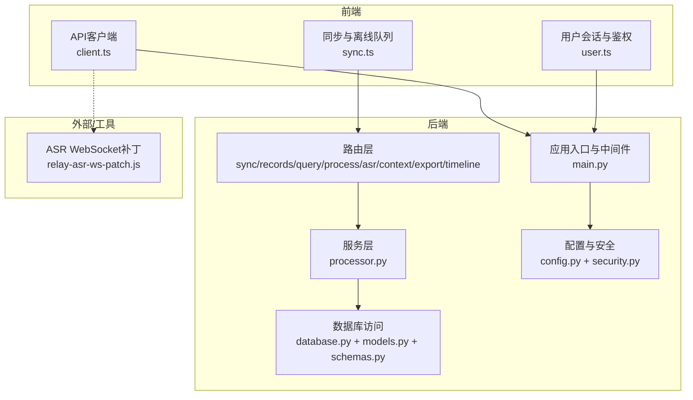
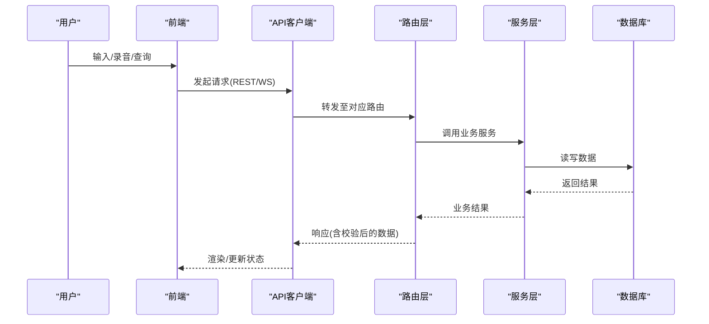
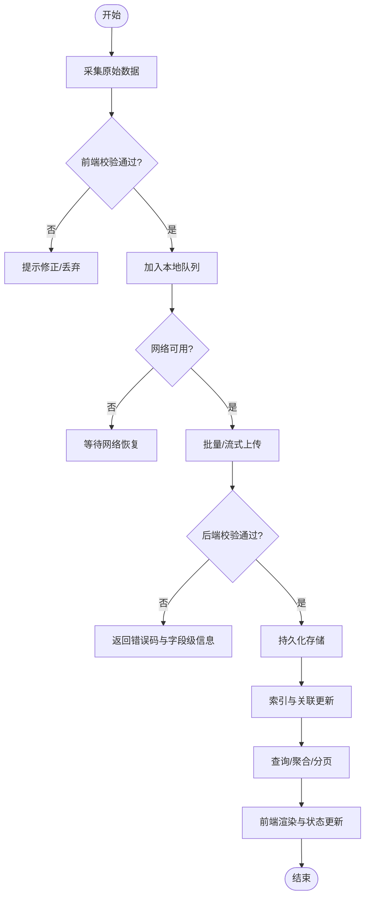
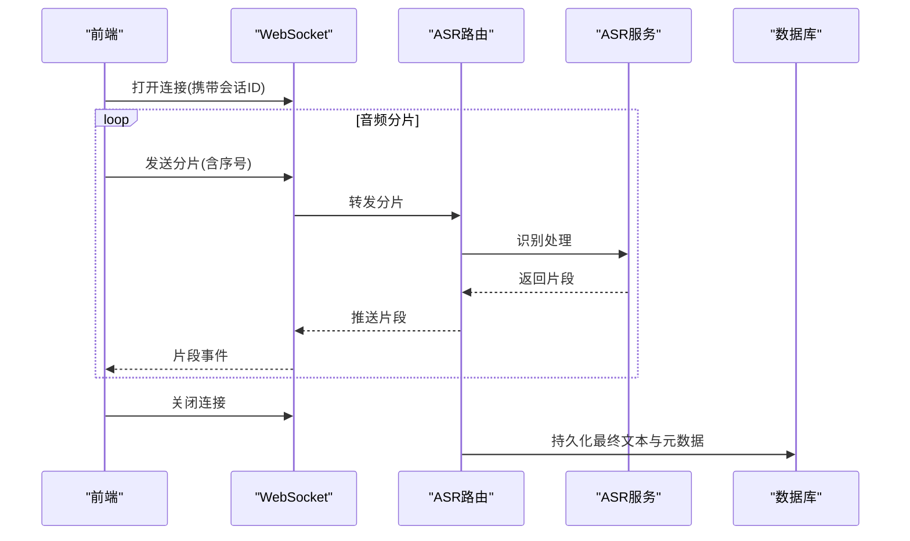
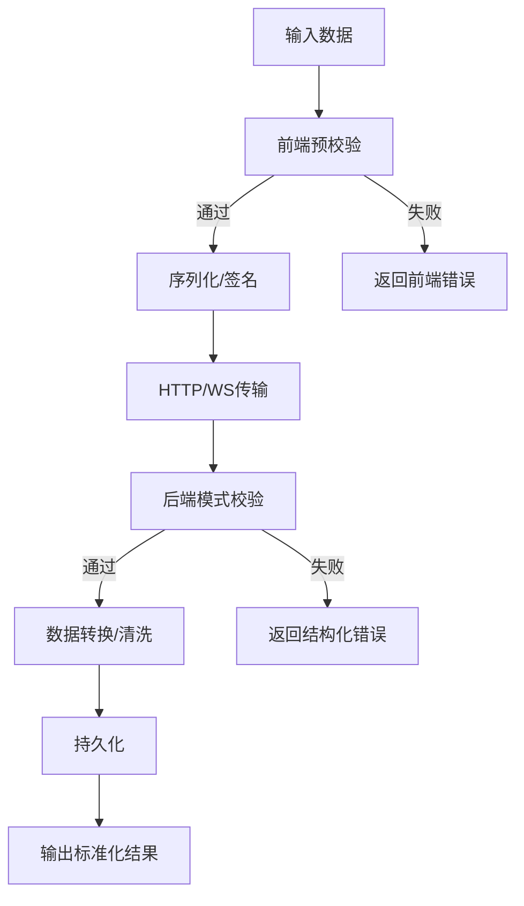
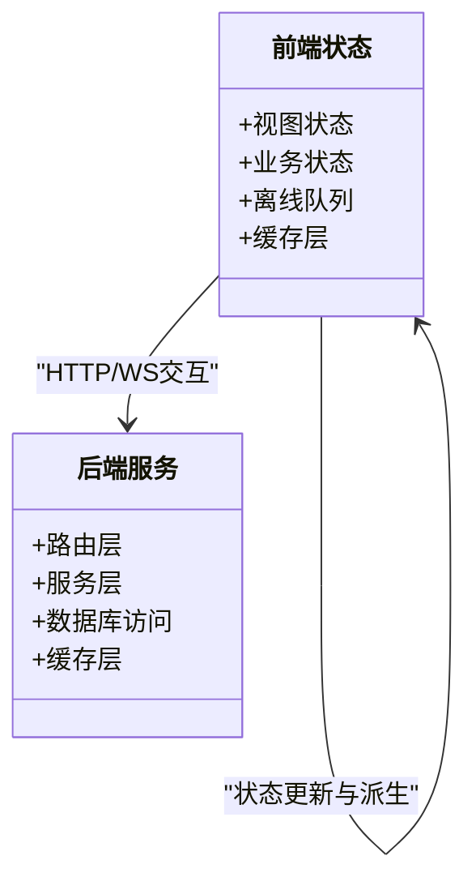
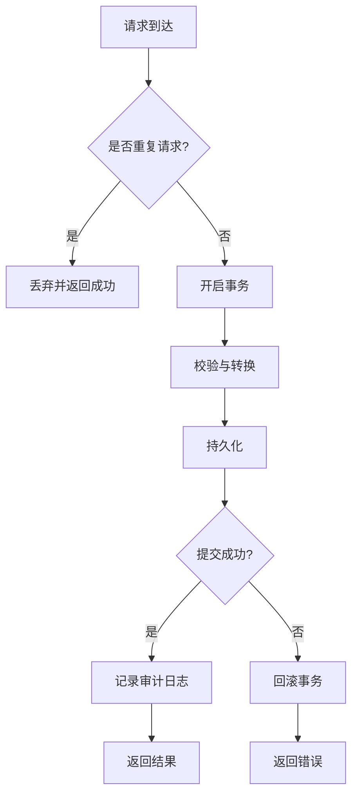
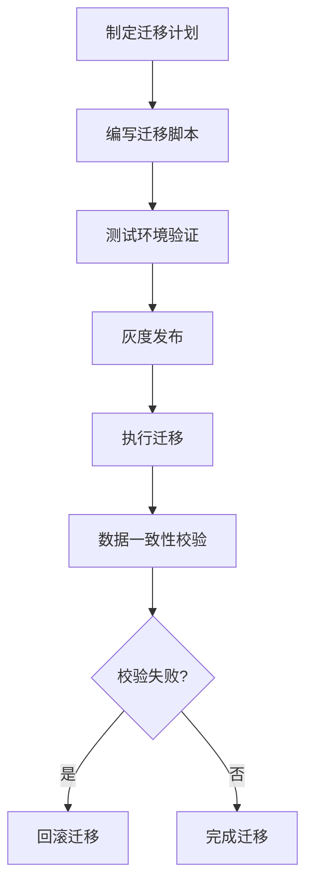
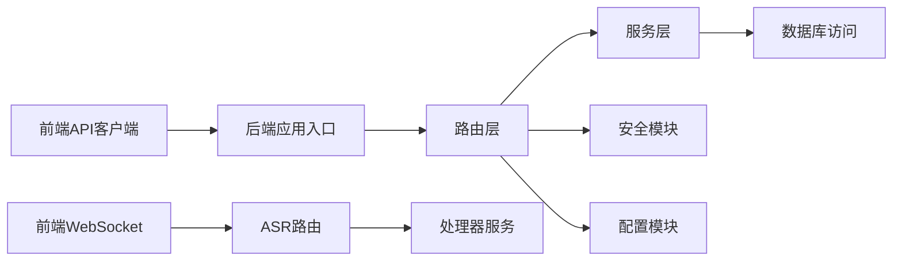

# 数据流设计

<cite>
**本文引用的文件**   
- [backend/main.py](file://backend/main.py)
- [backend/config.py](file://backend/config.py)
- [backend/database.py](file://backend/database.py)
- [backend/models.py](file://backend/models.py)
- [backend/schemas.py](file://backend/schemas.py)
- [backend/security.py](file://backend/security.py)
- [backend/routers/sync.py](file://backend/routers/sync.py)
- [backend/routers/records.py](file://backend/routers/records.py)
- [backend/routers/query.py](file://backend/routers/query.py)
- [backend/routers/process.py](file://backend/routers/process.py)
- [backend/routers/asr.py](file://backend/routers/asr.py)
- [backend/routers/context.py](file://backend/routers/context.py)
- [backend/routers/export.py](file://backend/routers/export.py)
- [backend/routers/timeline.py](file://backend/routers/timeline.py)
- [backend/services/processor.py](file://backend/services/processor.py)
- [frontend/src/api/client.ts](file://frontend/src/api/client.ts)
- [frontend/src/sync.ts](file://frontend/src/sync.ts)
- [frontend/src/user.ts](file://frontend/src/user.ts)
- [data/relay-asr-ws-patch.js](file://data/relay-asr-ws-patch.js)
</cite>

## 目录
1. [简介](#简介)
2. [项目结构](#项目结构)
3. [核心组件](#核心组件)
4. [架构总览](#架构总览)
5. [详细组件分析](#详细组件分析)
6. [依赖关系分析](#依赖关系分析)
7. [性能考量](#性能考量)
8. [故障排查指南](#故障排查指南)
9. [结论](#结论)
10. [附录](#附录)

## 简介
本文件面向AdventureX项目的数据流设计，系统性阐述从用户输入到数据存储的完整生命周期，覆盖前后端同步机制、实时通信协议、数据转换与校验规则、状态管理策略、缓存机制、一致性保证、数据迁移与备份恢复、以及性能优化技巧。文档通过数据流图与使用场景示例帮助读者快速理解关键概念并指导实践落地。

## 项目结构
后端采用模块化路由与服务分层：路由层负责HTTP/WebSocket接口编排，服务层封装业务处理逻辑，数据库层提供持久化能力；前端基于Vue生态，API客户端统一封装请求，同步模块负责离线队列与冲突合并，WebSocket补丁用于ASR实时流式传输。

图表来源 
- [backend/main.py](file://backend/main.py)
- [backend/routers/sync.py](file://backend/routers/sync.py)
- [backend/routers/records.py](file://backend/routers/records.py)
- [backend/routers/query.py](file://backend/routers/query.py)
- [backend/routers/process.py](file://backend/routers/process.py)
- [backend/routers/asr.py](file://backend/routers/asr.py)
- [backend/routers/context.py](file://backend/routers/context.py)
- [backend/routers/export.py](file://backend/routers/export.py)
- [backend/routers/timeline.py](file://backend/routers/timeline.py)
- [backend/services/processor.py](file://backend/services/processor.py)
- [backend/database.py](file://backend/database.py)
- [backend/models.py](file://backend/models.py)
- [backend/schemas.py](file://backend/schemas.py)
- [backend/config.py](file://backend/config.py)
- [backend/security.py](file://backend/security.py)
- [frontend/src/api/client.ts](file://frontend/src/api/client.ts)
- [frontend/src/sync.ts](file://frontend/src/sync.ts)
- [frontend/src/user.ts](file://frontend/src/user.ts)
- [data/relay-asr-ws-patch.js](file://data/relay-asr-ws-patch.js)

章节来源
- [backend/main.py](file://backend/main.py)
- [frontend/src/api/client.ts](file://frontend/src/api/client.ts)
- [frontend/src/sync.ts](file://frontend/src/sync.ts)
- [frontend/src/user.ts](file://frontend/src/user.ts)

## 核心组件
- 应用入口与中间件：统一注册路由、全局异常处理、CORS/认证等横切关注点。
- 路由层：按领域划分（同步、记录、查询、处理、ASR、上下文、导出、时间线），每个路由聚焦单一职责。
- 服务层：封装复杂业务逻辑（如数据处理、匹配、转写后处理）。
- 数据模型与模式：ORM模型定义与Pydantic模式校验，确保入参与出参一致性与类型安全。
- 数据库访问：连接池、事务、查询构建与分页。
- 前端API客户端：统一的HTTP封装、重试、错误映射、鉴权头注入。
- 前端同步模块：离线队列、增量同步、冲突检测与合并策略。
- ASR实时通道：WebSocket流式音频上传与文本片段推送。

章节来源
- [backend/main.py](file://backend/main.py)
- [backend/routers/sync.py](file://backend/routers/sync.py)
- [backend/routers/records.py](file://backend/routers/records.py)
- [backend/routers/query.py](file://backend/routers/query.py)
- [backend/routers/process.py](file://backend/routers/process.py)
- [backend/routers/asr.py](file://backend/routers/asr.py)
- [backend/routers/context.py](file://backend/routers/context.py)
- [backend/routers/export.py](file://backend/routers/export.py)
- [backend/routers/timeline.py](file://backend/routers/timeline.py)
- [backend/services/processor.py](file://backend/services/processor.py)
- [backend/database.py](file://backend/database.py)
- [backend/models.py](file://backend/models.py)
- [backend/schemas.py](file://backend/schemas.py)
- [frontend/src/api/client.ts](file://frontend/src/api/client.ts)
- [frontend/src/sync.ts](file://frontend/src/sync.ts)

## 架构总览
系统采用“前端轻量+后端集中”的数据流架构。前端负责采集与展示，维护本地离线队列与视图状态；后端作为权威数据源，提供REST与WebSocket接口，完成数据校验、转换、存储与检索。ASR流程通过WebSocket实现低延迟流式处理，其他操作以HTTP为主。

图表来源 
- [backend/main.py](file://backend/main.py)
- [backend/routers/sync.py](file://backend/routers/sync.py)
- [backend/routers/records.py](file://backend/routers/records.py)
- [backend/routers/query.py](file://backend/routers/query.py)
- [backend/routers/process.py](file://backend/routers/process.py)
- [backend/routers/asr.py](file://backend/routers/asr.py)
- [backend/services/processor.py](file://backend/services/processor.py)
- [backend/database.py](file://backend/database.py)
- [backend/models.py](file://backend/models.py)
- [backend/schemas.py](file://backend/schemas.py)
- [frontend/src/api/client.ts](file://frontend/src/api/client.ts)
- [frontend/src/sync.ts](file://frontend/src/sync.ts)

## 详细组件分析

### 数据生命周期与同步机制
- 采集阶段：前端收集文本、语音、标签、上下文等原始数据，进入本地队列。
- 传输阶段：通过HTTP批量提交或WebSocket流式传输（ASR）。
- 校验与转换：后端依据Pydantic模式进行严格校验，必要时进行格式标准化与清洗。
- 存储阶段：写入数据库，建立索引与关联关系。
- 检索与展示：按查询条件聚合、排序、分页返回前端，驱动视图更新。
- 同步策略：增量同步、幂等键、冲突检测与合并（以服务端为权威源）。

图表来源 
- [backend/schemas.py](file://backend/schemas.py)
- [backend/routers/sync.py](file://backend/routers/sync.py)
- [backend/routers/records.py](file://backend/routers/records.py)
- [backend/routers/query.py](file://backend/routers/query.py)
- [backend/database.py](file://backend/database.py)
- [frontend/src/api/client.ts](file://frontend/src/api/client.ts)
- [frontend/src/sync.ts](file://frontend/src/sync.ts)

章节来源
- [backend/schemas.py](file://backend/schemas.py)
- [backend/routers/sync.py](file://backend/routers/sync.py)
- [backend/routers/records.py](file://backend/routers/records.py)
- [backend/routers/query.py](file://backend/routers/query.py)
- [backend/database.py](file://backend/database.py)
- [frontend/src/api/client.ts](file://frontend/src/api/client.ts)
- [frontend/src/sync.ts](file://frontend/src/sync.ts)

### 实时通信协议（ASR）
- 前端通过WebSocket发送音频分片，附带会话ID与序列号。
- 后端接收流式数据，调用ASR服务进行识别，逐步返回文本片段。
- 前端对片段进行拼接与去噪，最终生成稳定文本。
- 失败重连与断点续传由WebSocket补丁与前端同步模块协同保障。

图表来源 
- [backend/routers/asr.py](file://backend/routers/asr.py)
- [backend/services/processor.py](file://backend/services/processor.py)
- [data/relay-asr-ws-patch.js](file://data/relay-asr-ws-patch.js)
- [frontend/src/api/client.ts](file://frontend/src/api/client.ts)

章节来源
- [backend/routers/asr.py](file://backend/routers/asr.py)
- [backend/services/processor.py](file://backend/services/processor.py)
- [data/relay-asr-ws-patch.js](file://data/relay-asr-ws-patch.js)
- [frontend/src/api/client.ts](file://frontend/src/api/client.ts)

### 数据转换与验证规则
- 前端：基础格式校验（必填、长度、范围）、本地缓存与队列序列化。
- 后端：Pydantic模式校验（类型、约束、枚举）、字段映射与标准化、敏感信息脱敏。
- 错误处理：结构化错误响应，包含字段级错误信息与可修复建议。

图表来源 
- [backend/schemas.py](file://backend/schemas.py)
- [backend/routers/sync.py](file://backend/routers/sync.py)
- [backend/routers/records.py](file://backend/routers/records.py)
- [backend/routers/query.py](file://backend/routers/query.py)
- [backend/routers/process.py](file://backend/routers/process.py)

章节来源
- [backend/schemas.py](file://backend/schemas.py)
- [backend/routers/sync.py](file://backend/routers/sync.py)
- [backend/routers/records.py](file://backend/routers/records.py)
- [backend/routers/query.py](file://backend/routers/query.py)
- [backend/routers/process.py](file://backend/routers/process.py)

### 状态管理与缓存机制
- 前端状态：视图状态与业务状态分离，使用响应式变量与计算属性；离线队列独立于UI状态。
- 缓存策略：列表数据短期缓存、详情按需加载、ASR片段临时缓冲；缓存失效与版本控制结合。
- 一致性：以服务端为权威源，冲突时采用“服务端优先”合并策略，支持用户手动回滚。

图表来源 
- [frontend/src/api/client.ts](file://frontend/src/api/client.ts)
- [frontend/src/sync.ts](file://frontend/src/sync.ts)
- [backend/routers/sync.py](file://backend/routers/sync.py)
- [backend/routers/query.py](file://backend/routers/query.py)
- [backend/database.py](file://backend/database.py)

章节来源
- [frontend/src/api/client.ts](file://frontend/src/api/client.ts)
- [frontend/src/sync.ts](file://frontend/src/sync.ts)
- [backend/routers/sync.py](file://backend/routers/sync.py)
- [backend/routers/query.py](file://backend/routers/query.py)
- [backend/database.py](file://backend/database.py)

### 数据一致性保证
- 幂等性：请求携带唯一ID，服务端去重处理。
- 事务性：写操作在事务中执行，失败回滚。
- 版本控制：实体带版本号，冲突检测与合并。
- 审计日志：关键变更记录操作人、时间与内容摘要。

图表来源 
- [backend/routers/sync.py](file://backend/routers/sync.py)
- [backend/routers/records.py](file://backend/routers/records.py)
- [backend/database.py](file://backend/database.py)
- [backend/models.py](file://backend/models.py)

章节来源
- [backend/routers/sync.py](file://backend/routers/sync.py)
- [backend/routers/records.py](file://backend/routers/records.py)
- [backend/database.py](file://backend/database.py)
- [backend/models.py](file://backend/models.py)

### 数据迁移方案
- 版本化迁移脚本：按版本号递增，支持向前与回滚。
- 零停机部署：双写过渡期，数据比对与修复任务。
- 兼容性：新字段默认值与旧数据兼容读取。

[本节为概念性说明，不直接分析具体文件]

### 备份恢复策略
- 定期快照：全量与增量备份策略。
- 异地容灾：跨地域复制与灾难恢复演练。
- 恢复演练：定期恢复测试，确保RTO/RPO目标达成。

[本节为概念性说明，不直接分析具体文件]

### 性能优化技巧
- 前端：懒加载、虚拟滚动、请求去抖与节流、离线队列批处理。
- 后端：连接池、查询优化、索引设计、分页与投影、异步任务队列。
- 缓存：多级缓存（浏览器、CDN、服务端）、缓存预热与失效策略。
- 监控：慢查询、错误率、吞吐与延迟指标。

[本节为通用指导，不直接分析具体文件]

## 依赖关系分析
- 前端API客户端依赖网络栈与鉴权模块，统一封装错误与重试。
- 后端路由依赖服务层与数据库访问，服务层依赖模型与模式校验。
- ASR流程依赖WebSocket通道与外部识别服务。
- 配置与安全模块贯穿各层，提供环境变量与加密能力。

图表来源 
- [frontend/src/api/client.ts](file://frontend/src/api/client.ts)
- [backend/main.py](file://backend/main.py)
- [backend/routers/sync.py](file://backend/routers/sync.py)
- [backend/routers/records.py](file://backend/routers/records.py)
- [backend/routers/query.py](file://backend/routers/query.py)
- [backend/routers/process.py](file://backend/routers/process.py)
- [backend/routers/asr.py](file://backend/routers/asr.py)
- [backend/services/processor.py](file://backend/services/processor.py)
- [backend/database.py](file://backend/database.py)
- [backend/security.py](file://backend/security.py)
- [backend/config.py](file://backend/config.py)

章节来源
- [frontend/src/api/client.ts](file://frontend/src/api/client.ts)
- [backend/main.py](file://backend/main.py)
- [backend/routers/sync.py](file://backend/routers/sync.py)
- [backend/routers/records.py](file://backend/routers/records.py)
- [backend/routers/query.py](file://backend/routers/query.py)
- [backend/routers/process.py](file://backend/routers/process.py)
- [backend/routers/asr.py](file://backend/routers/asr.py)
- [backend/services/processor.py](file://backend/services/processor.py)
- [backend/database.py](file://backend/database.py)
- [backend/security.py](file://backend/security.py)
- [backend/config.py](file://backend/config.py)

## 性能考量
- 减少往返：批量提交、合并请求、缓存命中。
- 降低负载：服务端分页、投影只取必要字段、异步处理耗时任务。
- 提升吞吐：连接池复用、并发控制、限流与熔断。
- 观测与调优：APM、慢查询分析、热点数据定位。

[本节为通用指导，不直接分析具体文件]

## 故障排查指南
- 常见问题：网络中断、鉴权失败、数据校验错误、数据库连接超时、ASR流中断。
- 排查步骤：检查前端日志与网络面板、查看后端错误日志与慢查询、核对模式校验规则、验证WebSocket连接与会话状态。
- 恢复措施：重试与退避、降级与熔断、数据修复脚本、回滚与重建索引。

章节来源
- [backend/routers/sync.py](file://backend/routers/sync.py)
- [backend/routers/records.py](file://backend/routers/records.py)
- [backend/routers/query.py](file://backend/routers/query.py)
- [backend/routers/asr.py](file://backend/routers/asr.py)
- [backend/database.py](file://backend/database.py)
- [backend/schemas.py](file://backend/schemas.py)
- [frontend/src/api/client.ts](file://frontend/src/api/client.ts)
- [frontend/src/sync.ts](file://frontend/src/sync.ts)

## 结论
本数据流设计以清晰的分层与明确的职责边界为基础，结合严格的校验与一致的同步策略，确保数据从采集到存储的全链路可靠与高效。通过WebSocket实现低延迟实时通信，配合前端离线队列与冲突合并，提升用户体验与鲁棒性。建议在后续迭代中持续完善监控与可观测性，强化迁移与备份恢复能力，进一步优化性能与成本。

## 附录
- 使用场景示例：
  - 日常记录：文本输入→前端校验→HTTP提交→后端校验→持久化→查询展示。
  - 语音转写：录音→WebSocket分片→ASR识别→片段推送→前端拼接→持久化。
  - 数据导出：选择范围→后端聚合→生成文件→下载链接。
  - 时间线浏览：时间过滤→分页查询→渲染卡片→交互更新。

[本节为概念性说明，不直接分析具体文件]