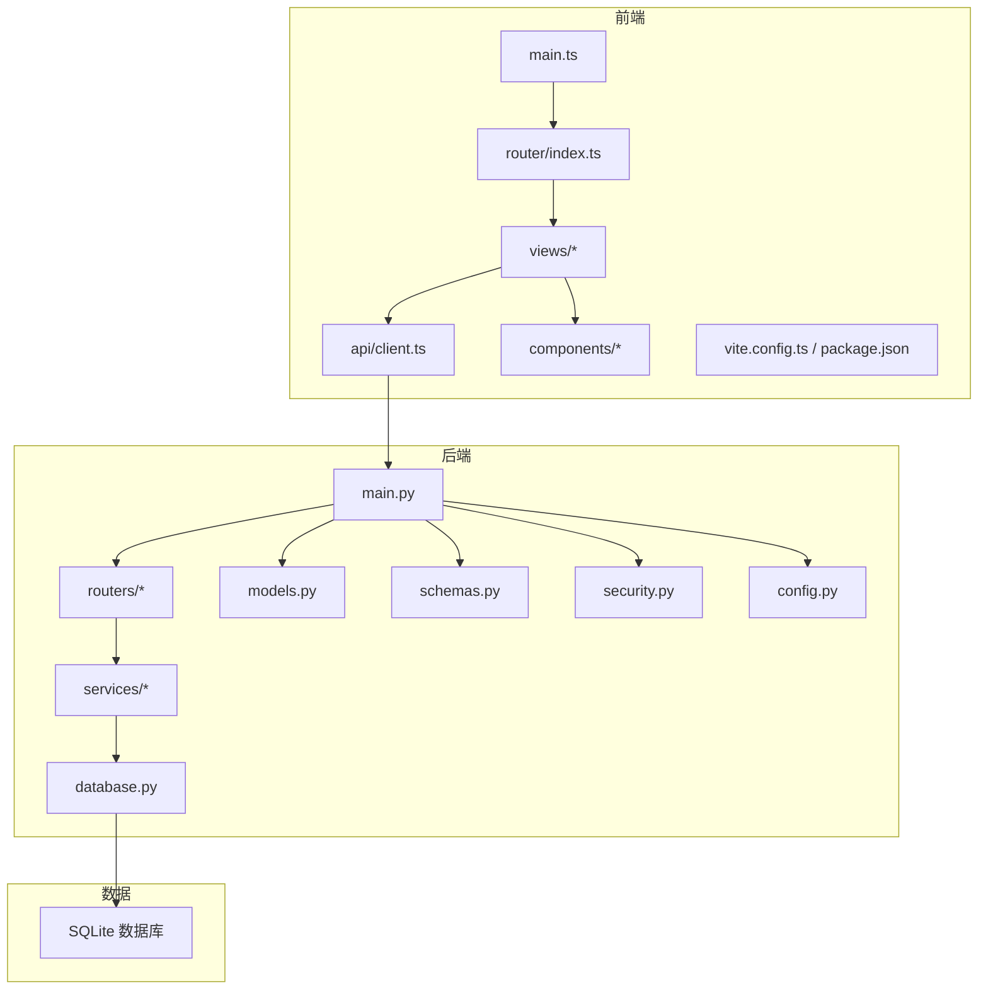
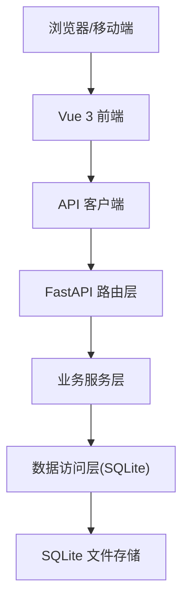
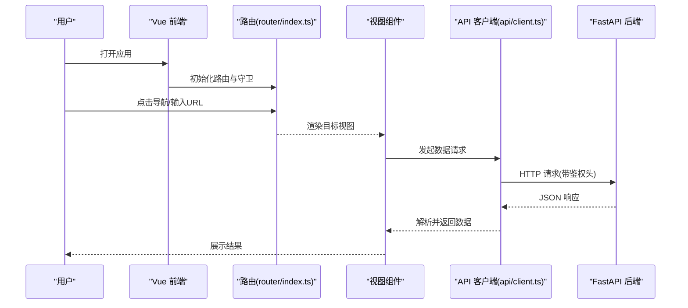
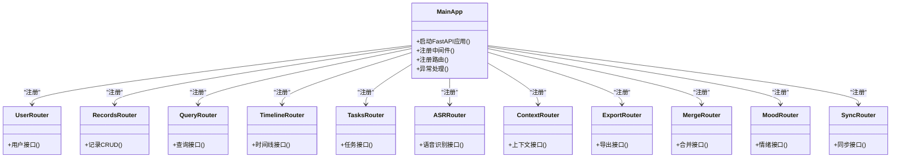
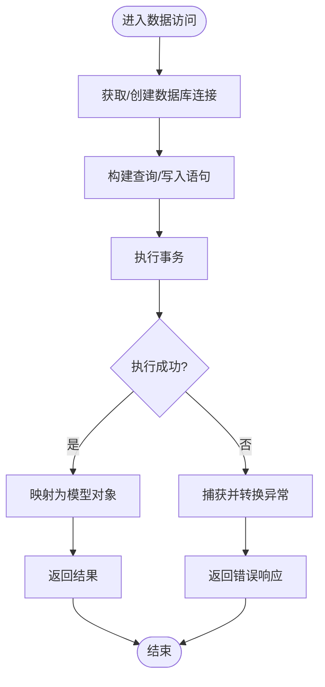
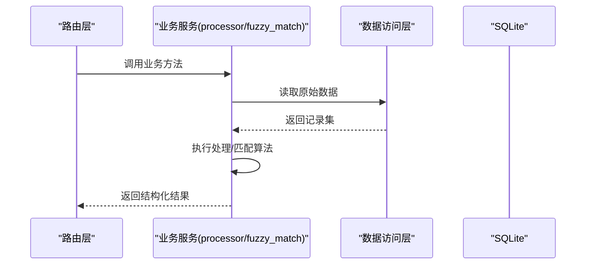
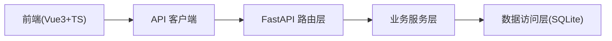

# 整体架构设计

<cite>
**本文引用的文件**   
- [backend/main.py](file://backend/main.py)
- [backend/config.py](file://backend/config.py)
- [backend/database.py](file://backend/database.py)
- [backend/models.py](file://backend/models.py)
- [backend/schemas.py](file://backend/schemas.py)
- [backend/security.py](file://backend/security.py)
- [backend/routers/user.py](file://backend/routers/user.py)
- [backend/routers/records.py](file://backend/routers/records.py)
- [backend/routers/query.py](file://backend/routers/query.py)
- [backend/routers/timeline.py](file://backend/routers/timeline.py)
- [backend/routers/tasks.py](file://backend/routers/tasks.py)
- [backend/routers/asr.py](file://backend/routers/asr.py)
- [backend/routers/context.py](file://backend/routers/context.py)
- [backend/routers/export.py](file://backend/routers/export.py)
- [backend/routers/merge.py](file://backend/routers/merge.py)
- [backend/routers/mood.py](file://backend/routers/mood.py)
- [backend/routers/sync.py](file://backend/routers/sync.py)
- [backend/services/fuzzy_match.py](file://backend/services/fuzzy_match.py)
- [backend/services/processor.py](file://backend/services/processor.py)
- [frontend/src/main.ts](file://frontend/src/main.ts)
- [frontend/src/router/index.ts](file://frontend/src/router/index.ts)
- [frontend/src/api/client.ts](file://frontend/src/api/client.ts)
- [frontend/src/views/HomeView.vue](file://frontend/src/views/HomeView.vue)
- [frontend/src/views/DashboardView.vue](file://frontend/src/views/DashboardView.vue)
- [frontend/src/views/TasksView.vue](file://frontend/src/views/TasksView.vue)
- [frontend/src/views/TimelineView.vue](file://frontend/src/views/TimelineView.vue)
- [frontend/src/views/QueryView.vue](file://frontend/src/views/QueryView.vue)
- [frontend/src/components/AppLayout.vue](file://frontend/src/components/AppLayout.vue)
- [frontend/package.json](file://frontend/package.json)
- [frontend/vite.config.ts](file://frontend/vite.config.ts)
</cite>

## 目录
1. [简介](#简介)
2. [项目结构](#项目结构)
3. [核心组件](#核心组件)
4. [架构总览](#架构总览)
5. [详细组件分析](#详细组件分析)
6. [依赖关系分析](#依赖关系分析)
7. [性能考量](#性能考量)
8. [故障排查指南](#故障排查指南)
9. [结论](#结论)
10. [附录](#附录)

## 简介
本文件为 AdventureX 系统的整体架构设计文档，面向前后端分离的架构模式：前端采用 Vue 3 + TypeScript + Vite，后端采用 FastAPI（Python），数据持久化层使用 SQLite。文档从系统分层、模块职责、技术选型与优势、依赖关系与交互模式等维度进行阐述，并给出架构图和数据流向说明，帮助读者快速理解系统设计与实现要点。

## 项目结构
AdventureX 采用典型的前后端分离工程组织方式：
- 前端（frontend）：Vue 3 单页应用，包含路由、视图、组件、国际化、API 客户端、构建配置等。
- 后端（backend）：FastAPI 服务，包含路由、模型、数据库连接、业务服务、安全校验、配置等。
- 数据（data）：静态资源或补丁脚本（如 ASR WebSocket 补丁）。
- 部署（根目录）：CI/CD 工作流与部署脚本。

图表来源
- [frontend/src/main.ts](file://frontend/src/main.ts)
- [frontend/src/router/index.ts](file://frontend/src/router/index.ts)
- [frontend/src/api/client.ts](file://frontend/src/api/client.ts)
- [frontend/vite.config.ts](file://frontend/vite.config.ts)
- [frontend/package.json](file://frontend/package.json)
- [backend/main.py](file://backend/main.py)
- [backend/routers/user.py](file://backend/routers/user.py)
- [backend/routers/records.py](file://backend/routers/records.py)
- [backend/routers/query.py](file://backend/routers/query.py)
- [backend/routers/timeline.py](file://backend/routers/timeline.py)
- [backend/routers/tasks.py](file://backend/routers/tasks.py)
- [backend/routers/asr.py](file://backend/routers/asr.py)
- [backend/routers/context.py](file://backend/routers/context.py)
- [backend/routers/export.py](file://backend/routers/export.py)
- [backend/routers/merge.py](file://backend/routers/merge.py)
- [backend/routers/mood.py](file://backend/routers/mood.py)
- [backend/routers/sync.py](file://backend/routers/sync.py)
- [backend/services/fuzzy_match.py](file://backend/services/fuzzy_match.py)
- [backend/services/processor.py](file://backend/services/processor.py)
- [backend/database.py](file://backend/database.py)
- [backend/models.py](file://backend/models.py)
- [backend/schemas.py](file://backend/schemas.py)
- [backend/security.py](file://backend/security.py)
- [backend/config.py](file://backend/config.py)

章节来源
- [frontend/src/main.ts](file://frontend/src/main.ts)
- [frontend/src/router/index.ts](file://frontend/src/router/index.ts)
- [frontend/src/api/client.ts](file://frontend/src/api/client.ts)
- [frontend/vite.config.ts](file://frontend/vite.config.ts)
- [frontend/package.json](file://frontend/package.json)
- [backend/main.py](file://backend/main.py)
- [backend/config.py](file://backend/config.py)
- [backend/database.py](file://backend/database.py)
- [backend/models.py](file://backend/models.py)
- [backend/schemas.py](file://backend/schemas.py)
- [backend/security.py](file://backend/security.py)

## 核心组件
- 前端入口与路由
  - 入口初始化与插件挂载由 main.ts 负责；路由定义在 router/index.ts，集中管理页面跳转与权限控制。
  - 视图层 views/* 按功能域划分（首页、仪表盘、任务、时间线、查询等），组件 components/* 提供可复用 UI 能力。
  - API 客户端 api/client.ts 封装 HTTP 请求、错误处理与鉴权头注入。
- 后端服务与路由
  - main.py 启动 FastAPI 应用，注册中间件、CORS、路由与全局异常处理。
  - routers/* 按领域划分 RESTful 接口（用户、记录、查询、时间线、任务、ASR、上下文、导出、合并、情绪、同步等）。
  - services/* 承载业务逻辑（模糊匹配、数据处理等），与路由解耦。
  - database.py 管理 SQLite 连接与会话生命周期；models.py 定义 ORM 模型；schemas.py 定义 Pydantic 请求/响应模型。
  - security.py 提供鉴权与安全工具；config.py 集中管理配置项。
- 数据持久化
  - SQLite 作为轻量级本地/嵌入式数据库，适合单机部署与快速迭代。

章节来源
- [frontend/src/main.ts](file://frontend/src/main.ts)
- [frontend/src/router/index.ts](file://frontend/src/router/index.ts)
- [frontend/src/api/client.ts](file://frontend/src/api/client.ts)
- [backend/main.py](file://backend/main.py)
- [backend/routers/user.py](file://backend/routers/user.py)
- [backend/routers/records.py](file://backend/routers/records.py)
- [backend/routers/query.py](file://backend/routers/query.py)
- [backend/routers/timeline.py](file://backend/routers/timeline.py)
- [backend/routers/tasks.py](file://backend/routers/tasks.py)
- [backend/routers/asr.py](file://backend/routers/asr.py)
- [backend/routers/context.py](file://backend/routers/context.py)
- [backend/routers/export.py](file://backend/routers/export.py)
- [backend/routers/merge.py](file://backend/routers/merge.py)
- [backend/routers/mood.py](file://backend/routers/mood.py)
- [backend/routers/sync.py](file://backend/routers/sync.py)
- [backend/services/fuzzy_match.py](file://backend/services/fuzzy_match.py)
- [backend/services/processor.py](file://backend/services/processor.py)
- [backend/database.py](file://backend/database.py)
- [backend/models.py](file://backend/models.py)
- [backend/schemas.py](file://backend/schemas.py)
- [backend/security.py](file://backend/security.py)
- [backend/config.py](file://backend/config.py)

## 架构总览
系统采用前后端分离的分层架构：
- 表现层（前端）：Vue 3 SPA，通过路由驱动视图切换，组件化 UI，统一 API 客户端调用后端。
- 接口层（后端路由）：FastAPI 暴露 RESTful 接口，对输入进行校验（Pydantic schemas），返回结构化响应。
- 业务层（后端服务）：封装复杂逻辑（模糊匹配、数据处理），保持路由薄而清晰。
- 数据访问层（ORM/DB）：SQLAlchemy/SQLite 抽象数据库操作，模型与 Schema 分离。
- 安全与配置：统一鉴权策略与配置管理，贯穿各层。

图表来源
- [frontend/src/api/client.ts](file://frontend/src/api/client.ts)
- [backend/main.py](file://backend/main.py)
- [backend/routers/user.py](file://backend/routers/user.py)
- [backend/services/processor.py](file://backend/services/processor.py)
- [backend/database.py](file://backend/database.py)

## 详细组件分析

### 前端路由与视图层
- 路由管理：router/index.ts 集中定义路由表、导航守卫与懒加载，支撑多页面体验。
- 视图组件：views/* 对应主要功能域，配合 AppLayout 布局组件与通用卡片/表单组件提升复用性。
- 状态与数据：通过 api/client.ts 发起请求，结合异步状态管理（如 Pinia/Vue 响应式）更新界面。

图表来源
- [frontend/src/router/index.ts](file://frontend/src/router/index.ts)
- [frontend/src/api/client.ts](file://frontend/src/api/client.ts)
- [frontend/src/views/HomeView.vue](file://frontend/src/views/HomeView.vue)
- [frontend/src/views/DashboardView.vue](file://frontend/src/views/DashboardView.vue)
- [frontend/src/views/TasksView.vue](file://frontend/src/views/TasksView.vue)
- [frontend/src/views/TimelineView.vue](file://frontend/src/views/TimelineView.vue)
- [frontend/src/views/QueryView.vue](file://frontend/src/views/QueryView.vue)
- [frontend/src/components/AppLayout.vue](file://frontend/src/components/AppLayout.vue)

章节来源
- [frontend/src/router/index.ts](file://frontend/src/router/index.ts)
- [frontend/src/api/client.ts](file://frontend/src/api/client.ts)
- [frontend/src/views/HomeView.vue](file://frontend/src/views/HomeView.vue)
- [frontend/src/views/DashboardView.vue](file://frontend/src/views/DashboardView.vue)
- [frontend/src/views/TasksView.vue](file://frontend/src/views/TasksView.vue)
- [frontend/src/views/TimelineView.vue](file://frontend/src/views/TimelineView.vue)
- [frontend/src/views/QueryView.vue](file://frontend/src/views/QueryView.vue)
- [frontend/src/components/AppLayout.vue](file://frontend/src/components/AppLayout.vue)

### 后端 API 服务与路由
- 应用启动：main.py 创建 FastAPI 实例，注册 CORS、中间件、路由与异常处理器。
- 路由组织：routers/* 按领域拆分，每个路由文件聚焦一组相关接口，便于维护与扩展。
- 请求校验与响应：schemas.py 定义 Pydantic 模型，确保输入输出一致性；models.py 定义 ORM 实体。
- 安全与鉴权：security.py 提供令牌验证、权限检查等工具，被路由与服务调用。

图表来源
- [backend/main.py](file://backend/main.py)
- [backend/routers/user.py](file://backend/routers/user.py)
- [backend/routers/records.py](file://backend/routers/records.py)
- [backend/routers/query.py](file://backend/routers/query.py)
- [backend/routers/timeline.py](file://backend/routers/timeline.py)
- [backend/routers/tasks.py](file://backend/routers/tasks.py)
- [backend/routers/asr.py](file://backend/routers/asr.py)
- [backend/routers/context.py](file://backend/routers/context.py)
- [backend/routers/export.py](file://backend/routers/export.py)
- [backend/routers/merge.py](file://backend/routers/merge.py)
- [backend/routers/mood.py](file://backend/routers/mood.py)
- [backend/routers/sync.py](file://backend/routers/sync.py)

章节来源
- [backend/main.py](file://backend/main.py)
- [backend/routers/user.py](file://backend/routers/user.py)
- [backend/routers/records.py](file://backend/routers/records.py)
- [backend/routers/query.py](file://backend/routers/query.py)
- [backend/routers/timeline.py](file://backend/routers/timeline.py)
- [backend/routers/tasks.py](file://backend/routers/tasks.py)
- [backend/routers/asr.py](file://backend/routers/asr.py)
- [backend/routers/context.py](file://backend/routers/context.py)
- [backend/routers/export.py](file://backend/routers/export.py)
- [backend/routers/merge.py](file://backend/routers/merge.py)
- [backend/routers/mood.py](file://backend/routers/mood.py)
- [backend/routers/sync.py](file://backend/routers/sync.py)

### 数据持久化与模型
- 数据库连接：database.py 管理 SQLite 连接与会话生命周期，确保并发安全与资源释放。
- ORM 模型：models.py 定义实体与关系，映射到 SQLite 表结构。
- Schema 校验：schemas.py 定义请求/响应模型，保证接口契约稳定。

图表来源
- [backend/database.py](file://backend/database.py)
- [backend/models.py](file://backend/models.py)
- [backend/schemas.py](file://backend/schemas.py)

章节来源
- [backend/database.py](file://backend/database.py)
- [backend/models.py](file://backend/models.py)
- [backend/schemas.py](file://backend/schemas.py)

### 业务服务层
- 模糊匹配：services/fuzzy_match.py 提供文本相似度计算与检索增强，服务于查询与推荐场景。
- 数据处理：services/processor.py 封装数据清洗、转换与聚合逻辑，供路由层调用。

图表来源
- [backend/services/processor.py](file://backend/services/processor.py)
- [backend/services/fuzzy_match.py](file://backend/services/fuzzy_match.py)
- [backend/database.py](file://backend/database.py)

章节来源
- [backend/services/processor.py](file://backend/services/processor.py)
- [backend/services/fuzzy_match.py](file://backend/services/fuzzy_match.py)

### 安全与配置
- 安全：security.py 提供鉴权、令牌校验、权限控制等工具，被路由与服务引用。
- 配置：config.py 集中管理环境变量、路径、开关等，避免硬编码。

章节来源
- [backend/security.py](file://backend/security.py)
- [backend/config.py](file://backend/config.py)

## 依赖关系分析
- 前端依赖
  - Vue 3 生态（路由、组件、构建工具 Vite）
  - TypeScript 类型系统与开发体验
  - 统一的 API 客户端封装
- 后端依赖
  - FastAPI 高性能异步框架
  - Pydantic 数据校验与序列化
  - SQLAlchemy/SQLite 数据持久化
  - 安全与配置模块
- 层间依赖
  - 前端仅依赖后端 API 契约（schemas），不感知内部实现细节
  - 路由层依赖服务层与数据访问层，保持职责单一
  - 服务层依赖数据访问层与外部工具库，不直接处理 HTTP

图表来源
- [frontend/src/api/client.ts](file://frontend/src/api/client.ts)
- [backend/main.py](file://backend/main.py)
- [backend/routers/user.py](file://backend/routers/user.py)
- [backend/services/processor.py](file://backend/services/processor.py)
- [backend/database.py](file://backend/database.py)

章节来源
- [frontend/src/api/client.ts](file://frontend/src/api/client.ts)
- [backend/main.py](file://backend/main.py)
- [backend/routers/user.py](file://backend/routers/user.py)
- [backend/services/processor.py](file://backend/services/processor.py)
- [backend/database.py](file://backend/database.py)

## 性能考量
- 前端
  - 使用 Vite 构建优化与代码分割，按需加载视图与组件，减少首屏体积。
  - 合理缓存 API 响应与静态资源，降低重复请求。
- 后端
  - FastAPI 基于 Starlette/uvicorn，支持高并发与异步 I/O。
  - 数据库层面建议合理使用索引、分页与批量操作，避免全表扫描。
  - 将耗时计算放入服务层并考虑缓存或异步队列（未来扩展）。
- 数据层
  - SQLite 适合小中型数据集与单机部署；随着数据量增长需评估分库分表或迁移至更重量的数据库。

[本节为通用指导，无需特定文件来源]

## 故障排查指南
- 前端常见问题
  - 路由未命中：检查 router/index.ts 的路由定义与守卫逻辑。
  - API 请求失败：查看 api/client.ts 的错误处理与网络状态码，确认后端接口可用性。
  - 组件渲染异常：检查 props/状态传递与异步数据加载时机。
- 后端常见问题
  - 路由冲突或参数校验失败：核对 schemas.py 与路由参数定义。
  - 数据库连接问题：检查 database.py 的连接与会话管理，确认 SQLite 文件权限。
  - 鉴权失败：检查 security.py 的令牌校验逻辑与前端请求头设置。
- 日志与调试
  - 在后端关键路径添加日志输出，定位异常堆栈。
  - 在前端开启网络面板与调试器，观察请求/响应与状态变化。

章节来源
- [frontend/src/router/index.ts](file://frontend/src/router/index.ts)
- [frontend/src/api/client.ts](file://frontend/src/api/client.ts)
- [backend/schemas.py](file://backend/schemas.py)
- [backend/database.py](file://backend/database.py)
- [backend/security.py](file://backend/security.py)

## 结论
AdventureX 采用清晰的前后端分离架构：前端以 Vue 3 构建 SPA，后端以 FastAPI 提供 RESTful API，数据层使用 SQLite 实现轻量持久化。通过路由、服务与数据访问层的职责分离，系统具备良好的可维护性与扩展性。技术选型兼顾了开发效率与运行性能，适合快速迭代与中小规模部署。后续可在缓存、异步任务与数据库扩展方面持续优化。

[本节为总结性内容，无需特定文件来源]

## 附录
- 技术选型原因与优势
  - Vue 3：组合式 API、响应式性能与生态完善，适合构建现代单页应用。
  - FastAPI：类型提示、自动文档与高性能异步处理能力，简化 API 开发。
  - SQLite：零配置、嵌入式、跨平台，适合单机与轻量部署场景。
- 交互模式
  - 前端通过 API 客户端统一发起请求，后端路由接收并校验输入，服务层执行业务逻辑，数据层完成持久化。
  - 错误与异常在各层明确处理，保证用户体验与系统稳定性。

[本节为补充信息，无需特定文件来源]