# 系统架构

<cite>
**本文引用的文件**   
- [backend/main.py](file://backend/main.py)
- [backend/config.py](file://backend/config.py)
- [backend/database.py](file://backend/database.py)
- [backend/models.py](file://backend/models.py)
- [backend/schemas.py](file://backend/schemas.py)
- [backend/security.py](file://backend/security.py)
- [backend/routers/user.py](file://backend/routers/user.py)
- [backend/routers/query.py](file://backend/routers/query.py)
- [backend/routers/records.py](file://backend/routers/records.py)
- [backend/routers/timeline.py](file://backend/routers/timeline.py)
- [backend/routers/tasks.py](file://backend/routers/tasks.py)
- [backend/routers/export.py](file://backend/routers/export.py)
- [backend/routers/asr.py](file://backend/routers/asr.py)
- [backend/routers/context.py](file://backend/routers/context.py)
- [backend/routers/mood.py](file://backend/routers/mood.py)
- [backend/routers/process.py](file://backend/routers/process.py)
- [backend/routers/sync.py](file://backend/routers/sync.py)
- [backend/services/processor.py](file://backend/services/processor.py)
- [backend/services/fuzzy_match.py](file://backend/services/fuzzy_match.py)
- [frontend/src/main.ts](file://frontend/src/main.ts)
- [frontend/src/router/index.ts](file://frontend/src/router/index.ts)
- [frontend/src/api/client.ts](file://frontend/src/api/client.ts)
- [frontend/src/views/HomeView.vue](file://frontend/src/views/HomeView.vue)
- [frontend/src/views/DashboardView.vue](file://frontend/src/views/DashboardView.vue)
- [frontend/src/views/QueryView.vue](file://frontend/src/views/QueryView.vue)
- [frontend/src/views/TasksView.vue](file://frontend/src/views/TasksView.vue)
- [frontend/src/views/TimelineView.vue](file://frontend/src/views/TimelineView.vue)
- [frontend/src/components/AppLayout.vue](file://frontend/src/components/AppLayout.vue)
- [frontend/src/components/RecordInput.vue](file://frontend/src/components/RecordInput.vue)
- [frontend/src/components/VoiceRecordButton.vue](file://frontend/src/components/VoiceRecordButton.vue)
- [frontend/src/components/ExportDialog.vue](file://frontend/src/components/ExportDialog.vue)
- [frontend/src/components/QueryChat.vue](file://frontend/src/components/QueryChat.vue)
- [frontend/src/components/MoodCard.vue](file://frontend/src/components/MoodCard.vue)
- [frontend/src/components/TimelineCard.vue](file://frontend/src/components/TimelineCard.vue)
- [frontend/src/components/TaskCard.vue](file://frontend/src/components/TaskCard.vue)
- [frontend/src/components/ContextBanner.vue](file://frontend/src/components/ContextBanner.vue)
- [frontend/src/install.ts](file://frontend/src/install.ts)
- [frontend/src/sync.ts](file://frontend/src/sync.ts)
- [frontend/src/user.ts](file://frontend/src/user.ts)
- [frontend/package.json](file://frontend/package.json)
- [frontend/vite.config.ts](file://frontend/vite.config.ts)
</cite>

## 目录
1. [简介](#简介)
2. [项目结构](#项目结构)
3. [核心组件](#核心组件)
4. [架构总览](#架构总览)
5. [详细组件分析](#详细组件分析)
6. [依赖关系分析](#依赖关系分析)
7. [性能考量](#性能考量)
8. [故障排查指南](#故障排查指南)
9. [结论](#结论)
10. [附录](#附录)

## 简介
本架构文档面向AdventureX系统，描述前后端分离的整体设计：Vue 3前端应用、FastAPI后端服务与SQLite数据库的分层结构。重点说明组件间通信模式、数据流向与状态管理策略；解释路由设计、中间件机制、错误处理模式与安全性考虑；定义系统边界、第三方服务集成点与扩展点设计，并通过架构图与数据流图帮助读者快速理解关键概念。

## 项目结构
系统采用典型的前后端分离结构：
- 前端（frontend）：基于Vue 3 + Vite构建，使用TypeScript与组合式API组织视图与组件，通过HTTP客户端访问后端API。
- 后端（backend）：基于FastAPI提供REST API，使用SQLAlchemy模型映射SQLite数据库，按功能划分路由与服务模块。
- 数据（data）：包含与语音识别中继相关的补丁脚本等辅助资源。

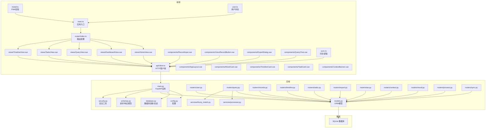

图表来源
- [frontend/src/main.ts](file://frontend/src/main.ts)
- [frontend/src/router/index.ts](file://frontend/src/router/index.ts)
- [frontend/src/api/client.ts](file://frontend/src/api/client.ts)
- [backend/main.py](file://backend/main.py)
- [backend/config.py](file://backend/config.py)
- [backend/database.py](file://backend/database.py)
- [backend/models.py](file://backend/models.py)
- [backend/schemas.py](file://backend/schemas.py)
- [backend/security.py](file://backend/security.py)

章节来源
- [frontend/src/main.ts](file://frontend/src/main.ts)
- [frontend/src/router/index.ts](file://frontend/src/router/index.ts)
- [frontend/src/api/client.ts](file://frontend/src/api/client.ts)
- [backend/main.py](file://backend/main.py)
- [backend/config.py](file://backend/config.py)
- [backend/database.py](file://backend/database.py)
- [backend/models.py](file://backend/models.py)
- [backend/schemas.py](file://backend/schemas.py)
- [backend/security.py](file://backend/security.py)

## 核心组件
- 前端应用入口与路由：
  - main.ts负责初始化Vue应用、插件与全局样式。
  - router/index.ts集中管理页面路由与导航守卫，实现页面级权限控制与加载优化。
- HTTP客户端：
  - api/client.ts封装统一的请求/响应处理、错误拦截、鉴权头注入与重试策略。
- 视图与组件：
  - views下为页面级组件，components下为可复用UI组件，如记录输入、语音录制、导出对话框、查询对话、情绪卡片、时间线卡片、任务卡片、上下文横幅等。
- 状态与同步：
  - user.ts维护用户信息与会话状态；sync.ts处理本地与远端的增量同步与冲突解决。
- 后端应用：
  - main.py创建FastAPI实例，注册路由、中间件、CORS与安全策略。
  - config.py集中管理环境变量与运行时配置。
  - database.py管理数据库引擎与会话生命周期。
  - models.py定义SQLAlchemy ORM模型，映射到SQLite表结构。
  - schemas.py定义Pydantic请求/响应模型，用于参数校验与序列化。
  - security.py提供令牌生成、校验与密码哈希等安全工具。
- 路由与服务：
  - routers下按领域划分接口：用户、查询、记录、时间线、任务、导出、ASR、上下文、情绪、处理、同步等。
  - services/processor.py与services/fuzzy_match.py封装业务处理与模糊匹配算法。

章节来源
- [frontend/src/main.ts](file://frontend/src/main.ts)
- [frontend/src/router/index.ts](file://frontend/src/router/index.ts)
- [frontend/src/api/client.ts](file://frontend/src/api/client.ts)
- [frontend/src/user.ts](file://frontend/src/user.ts)
- [frontend/src/sync.ts](file://frontend/src/sync.ts)
- [backend/main.py](file://backend/main.py)
- [backend/config.py](file://backend/config.py)
- [backend/database.py](file://backend/database.py)
- [backend/models.py](file://backend/models.py)
- [backend/schemas.py](file://backend/schemas.py)
- [backend/security.py](file://backend/security.py)
- [backend/routers/user.py](file://backend/routers/user.py)
- [backend/routers/query.py](file://backend/routers/query.py)
- [backend/routers/records.py](file://backend/routers/records.py)
- [backend/routers/timeline.py](file://backend/routers/timeline.py)
- [backend/routers/tasks.py](file://backend/routers/tasks.py)
- [backend/routers/export.py](file://backend/routers/export.py)
- [backend/routers/asr.py](file://backend/routers/asr.py)
- [backend/routers/context.py](file://backend/routers/context.py)
- [backend/routers/mood.py](file://backend/routers/mood.py)
- [backend/routers/process.py](file://backend/routers/process.py)
- [backend/routers/sync.py](file://backend/routers/sync.py)
- [backend/services/processor.py](file://backend/services/processor.py)
- [backend/services/fuzzy_match.py](file://backend/services/fuzzy_match.py)

## 架构总览
系统采用分层架构：
- 表现层（前端）：Vue 3单页应用，通过HTTP客户端调用后端API，使用组件化UI与组合式状态管理。
- 应用层（后端）：FastAPI路由层接收请求，进行参数校验、鉴权与业务编排，调用服务层完成数据处理。
- 领域层（服务）：处理器与算法服务封装复杂逻辑，如文本处理、模糊匹配等。
- 数据层（数据库）：SQLite持久化存储，通过ORM模型访问。

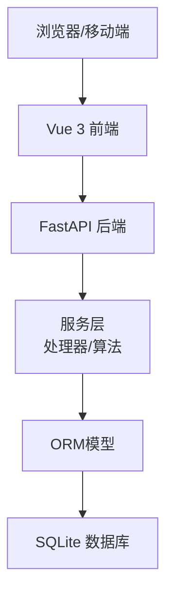

图表来源
- [frontend/src/api/client.ts](file://frontend/src/api/client.ts)
- [backend/main.py](file://backend/main.py)
- [backend/services/processor.py](file://backend/services/processor.py)
- [backend/services/fuzzy_match.py](file://backend/services/fuzzy_match.py)
- [backend/models.py](file://backend/models.py)
- [backend/database.py](file://backend/database.py)

## 详细组件分析

### 前端应用与路由
- 应用入口：
  - main.ts初始化Vue应用、挂载根组件、注册插件与全局样式。
- 路由设计：
  - router/index.ts定义页面路由与嵌套路由，结合导航守卫实现权限控制与懒加载。
- 视图组件：
  - HomeView、DashboardView、QueryView、TasksView、TimelineView分别承载首页、仪表盘、查询、任务与时间线功能。
- 通用布局：
  - AppLayout.vue提供统一布局、侧边栏与顶部导航。

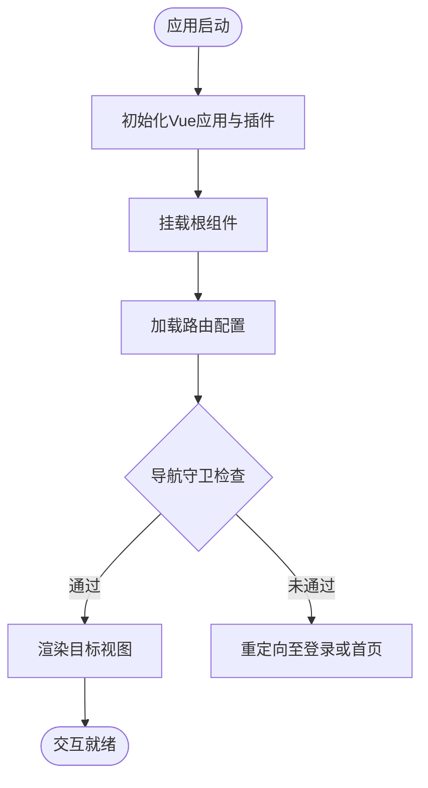

图表来源
- [frontend/src/main.ts](file://frontend/src/main.ts)
- [frontend/src/router/index.ts](file://frontend/src/router/index.ts)
- [frontend/src/views/HomeView.vue](file://frontend/src/views/HomeView.vue)
- [frontend/src/views/DashboardView.vue](file://frontend/src/views/DashboardView.vue)
- [frontend/src/views/QueryView.vue](file://frontend/src/views/QueryView.vue)
- [frontend/src/views/TasksView.vue](file://frontend/src/views/TasksView.vue)
- [frontend/src/views/TimelineView.vue](file://frontend/src/views/TimelineView.vue)
- [frontend/src/components/AppLayout.vue](file://frontend/src/components/AppLayout.vue)

章节来源
- [frontend/src/main.ts](file://frontend/src/main.ts)
- [frontend/src/router/index.ts](file://frontend/src/router/index.ts)
- [frontend/src/views/HomeView.vue](file://frontend/src/views/HomeView.vue)
- [frontend/src/views/DashboardView.vue](file://frontend/src/views/DashboardView.vue)
- [frontend/src/views/QueryView.vue](file://frontend/src/views/QueryView.vue)
- [frontend/src/views/TasksView.vue](file://frontend/src/views/TasksView.vue)
- [frontend/src/views/TimelineView.vue](file://frontend/src/views/TimelineView.vue)
- [frontend/src/components/AppLayout.vue](file://frontend/src/components/AppLayout.vue)

### HTTP客户端与API调用
- client.ts封装HTTP请求，统一处理：
  - 请求头注入（如Authorization）、错误拦截、超时与重试策略。
  - 将后端返回的JSON结构化为用户态对象，便于组件消费。
- 各视图与组件通过client.ts发起数据获取与提交操作。

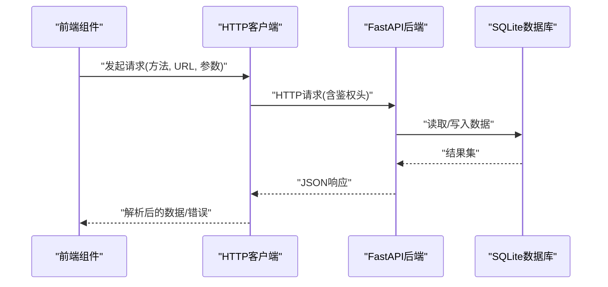

图表来源
- [frontend/src/api/client.ts](file://frontend/src/api/client.ts)
- [backend/main.py](file://backend/main.py)
- [backend/models.py](file://backend/models.py)
- [backend/database.py](file://backend/database.py)

章节来源
- [frontend/src/api/client.ts](file://frontend/src/api/client.ts)

### 用户认证与授权
- 安全工具：
  - security.py提供令牌生成与校验、密码哈希等能力。
- 用户路由：
  - routers/user.py实现注册、登录、登出与用户信息查询等接口。
- 前端状态：
  - user.ts维护用户信息与令牌，配合导航守卫实现页面级权限控制。

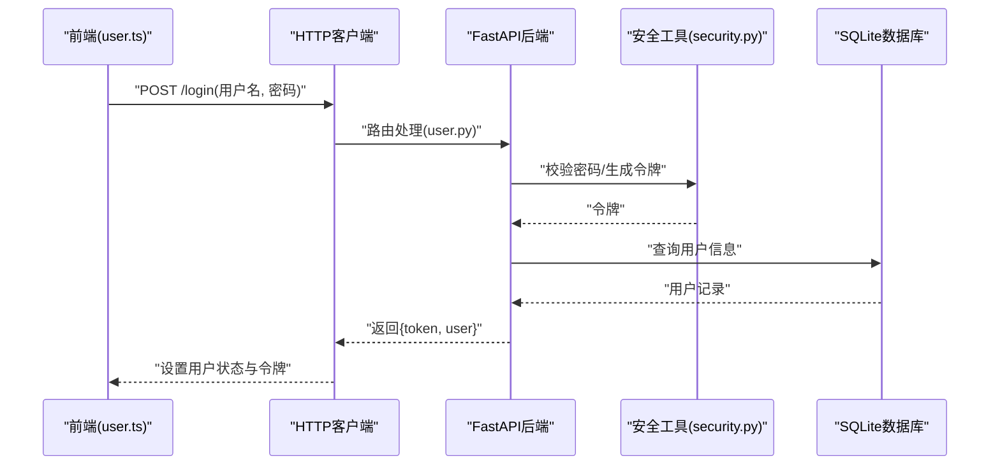

图表来源
- [frontend/src/user.ts](file://frontend/src/user.ts)
- [frontend/src/api/client.ts](file://frontend/src/api/client.ts)
- [backend/routers/user.py](file://backend/routers/user.py)
- [backend/security.py](file://backend/security.py)
- [backend/models.py](file://backend/models.py)
- [backend/database.py](file://backend/database.py)

章节来源
- [frontend/src/user.ts](file://frontend/src/user.ts)
- [frontend/src/api/client.ts](file://frontend/src/api/client.ts)
- [backend/routers/user.py](file://backend/routers/user.py)
- [backend/security.py](file://backend/security.py)
- [backend/models.py](file://backend/models.py)
- [backend/database.py](file://backend/database.py)

### 查询与AI处理流程
- 查询路由：
  - routers/query.py接收自然语言查询，调用服务层进行文本处理与模糊匹配。
- 服务层：
  - services/processor.py执行文本清洗、分词与索引构建。
  - services/fuzzy_match.py实现相似度计算与候选排序。
- 前端组件：
  - QueryChat.vue提供对话式查询界面，实时展示结果与上下文。

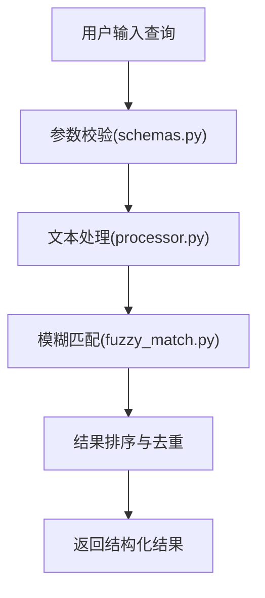

图表来源
- [backend/routers/query.py](file://backend/routers/query.py)
- [backend/services/processor.py](file://backend/services/processor.py)
- [backend/services/fuzzy_match.py](file://backend/services/fuzzy_match.py)
- [backend/schemas.py](file://backend/schemas.py)
- [frontend/src/components/QueryChat.vue](file://frontend/src/components/QueryChat.vue)

章节来源
- [backend/routers/query.py](file://backend/routers/query.py)
- [backend/services/processor.py](file://backend/services/processor.py)
- [backend/services/fuzzy_match.py](file://backend/services/fuzzy_match.py)
- [backend/schemas.py](file://backend/schemas.py)
- [frontend/src/components/QueryChat.vue](file://frontend/src/components/QueryChat.vue)

### 记录与时间线
- 记录路由：
  - routers/records.py负责记录的增删改查与批量导入。
- 时间线路由：
  - routers/timeline.py聚合记录与事件，生成时间线视图所需的数据。
- 前端组件：
  - RecordInput.vue与VoiceRecordButton.vue支持文本与语音输入。
  - TimelineCard.vue渲染时间线条目与上下文。

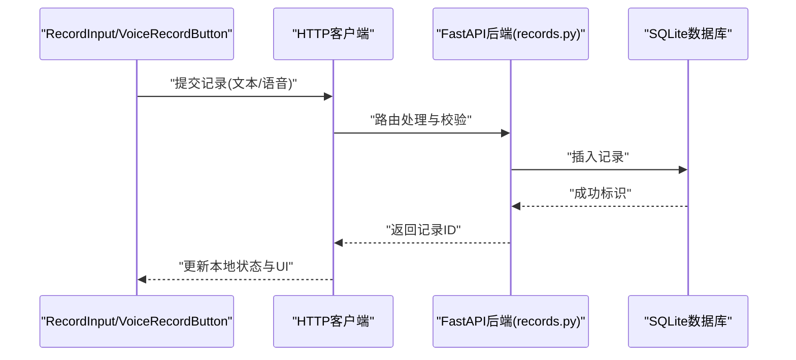

图表来源
- [frontend/src/components/RecordInput.vue](file://frontend/src/components/RecordInput.vue)
- [frontend/src/components/VoiceRecordButton.vue](file://frontend/src/components/VoiceRecordButton.vue)
- [backend/routers/records.py](file://backend/routers/records.py)
- [backend/models.py](file://backend/models.py)
- [backend/database.py](file://backend/database.py)

章节来源
- [frontend/src/components/RecordInput.vue](file://frontend/src/components/RecordInput.vue)
- [frontend/src/components/VoiceRecordButton.vue](file://frontend/src/components/VoiceRecordButton.vue)
- [backend/routers/records.py](file://backend/routers/records.py)
- [backend/models.py](file://backend/models.py)
- [backend/database.py](file://backend/database.py)

### 任务与导出
- 任务路由：
  - routers/tasks.py管理异步任务的生命周期与状态。
- 导出路由：
  - routers/export.py支持将数据导出为多种格式（CSV、JSON、PDF等）。
- 前端组件：
  - TaskCard.vue展示任务进度与状态。
  - ExportDialog.vue提供导出选项与下载触发。

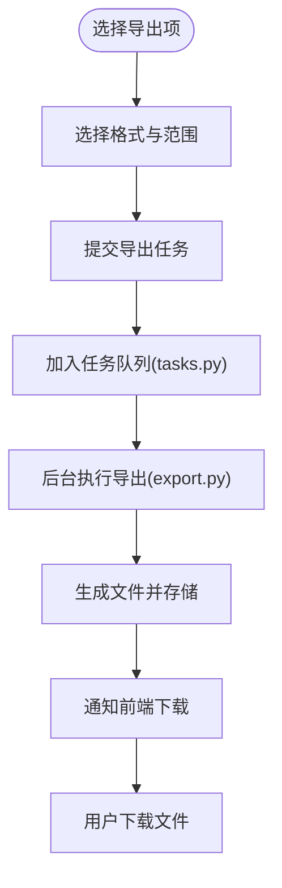

图表来源
- [backend/routers/tasks.py](file://backend/routers/tasks.py)
- [backend/routers/export.py](file://backend/routers/export.py)
- [frontend/src/components/TaskCard.vue](file://frontend/src/components/TaskCard.vue)
- [frontend/src/components/ExportDialog.vue](file://frontend/src/components/ExportDialog.vue)

章节来源
- [backend/routers/tasks.py](file://backend/routers/tasks.py)
- [backend/routers/export.py](file://backend/routers/export.py)
- [frontend/src/components/TaskCard.vue](file://frontend/src/components/TaskCard.vue)
- [frontend/src/components/ExportDialog.vue](file://frontend/src/components/ExportDialog.vue)

### ASR与上下文
- ASR路由：
  - routers/asr.py对接语音识别服务，上传音频片段并返回转写文本。
- 上下文路由：
  - routers/context.py维护会话上下文与历史摘要，提升查询质量。
- 前端组件：
  - VoiceRecordButton.vue捕获音频并上传至ASR。
  - ContextBanner.vue展示当前上下文摘要与切换。

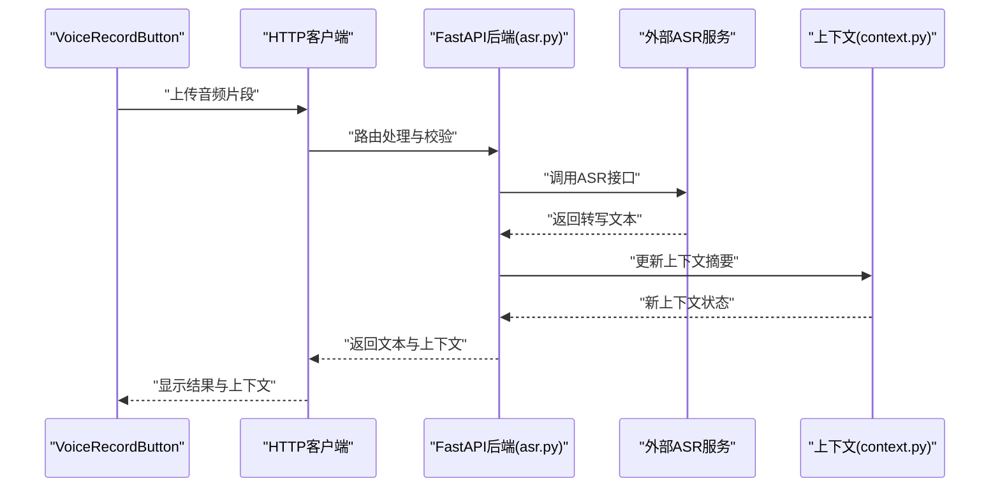

图表来源
- [frontend/src/components/VoiceRecordButton.vue](file://frontend/src/components/VoiceRecordButton.vue)
- [backend/routers/asr.py](file://backend/routers/asr.py)
- [backend/routers/context.py](file://backend/routers/context.py)
- [frontend/src/components/ContextBanner.vue](file://frontend/src/components/ContextBanner.vue)

章节来源
- [frontend/src/components/VoiceRecordButton.vue](file://frontend/src/components/VoiceRecordButton.vue)
- [backend/routers/asr.py](file://backend/routers/asr.py)
- [backend/routers/context.py](file://backend/routers/context.py)
- [frontend/src/components/ContextBanner.vue](file://frontend/src/components/ContextBanner.vue)

### 情绪与同步
- 情绪路由：
  - routers/mood.py根据记录内容推断情绪标签并存储。
- 同步路由：
  - routers/sync.py提供增量同步接口，支持离线缓存与冲突合并。
- 前端同步：
  - sync.ts实现本地缓存、差异检测与自动同步。

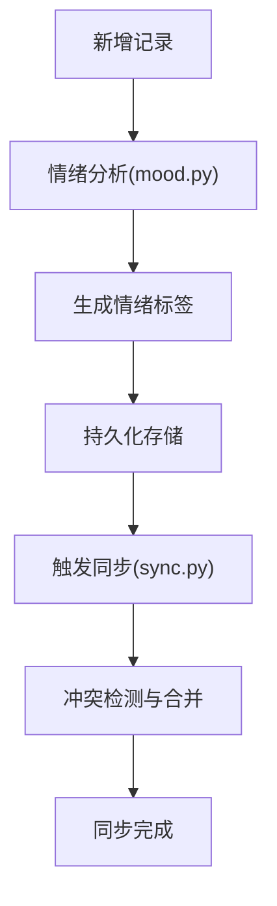

图表来源
- [backend/routers/mood.py](file://backend/routers/mood.py)
- [backend/routers/sync.py](file://backend/routers/sync.py)
- [frontend/src/sync.ts](file://frontend/src/sync.ts)

章节来源
- [backend/routers/mood.py](file://backend/routers/mood.py)
- [backend/routers/sync.py](file://backend/routers/sync.py)
- [frontend/src/sync.ts](file://frontend/src/sync.ts)

### 数据处理与模糊匹配服务
- 处理器服务：
  - services/processor.py负责文本预处理、分词、索引构建与检索准备。
- 模糊匹配服务：
  - services/fuzzy_match.py实现字符串相似度计算与候选排序。

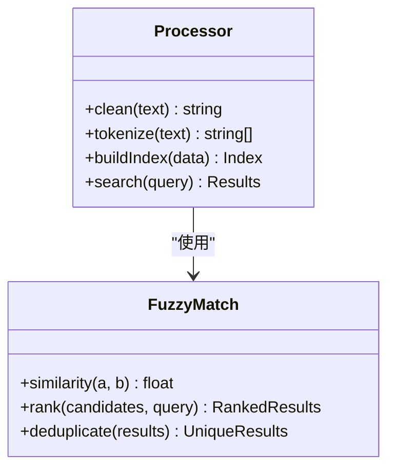

图表来源
- [backend/services/processor.py](file://backend/services/processor.py)
- [backend/services/fuzzy_match.py](file://backend/services/fuzzy_match.py)

章节来源
- [backend/services/processor.py](file://backend/services/processor.py)
- [backend/services/fuzzy_match.py](file://backend/services/fuzzy_match.py)

## 依赖关系分析
- 前端依赖：
  - Vue 3、Vite、TypeScript、HTTP客户端库（由package.json声明）。
  - 路由与状态管理由router/index.ts与user.ts、sync.ts实现。
- 后端依赖：
  - FastAPI、Uvicorn、SQLAlchemy、Pydantic、安全工具库（由requirements.txt声明）。
  - 路由与服务模块按领域解耦，依赖ORM模型与数据库会话。

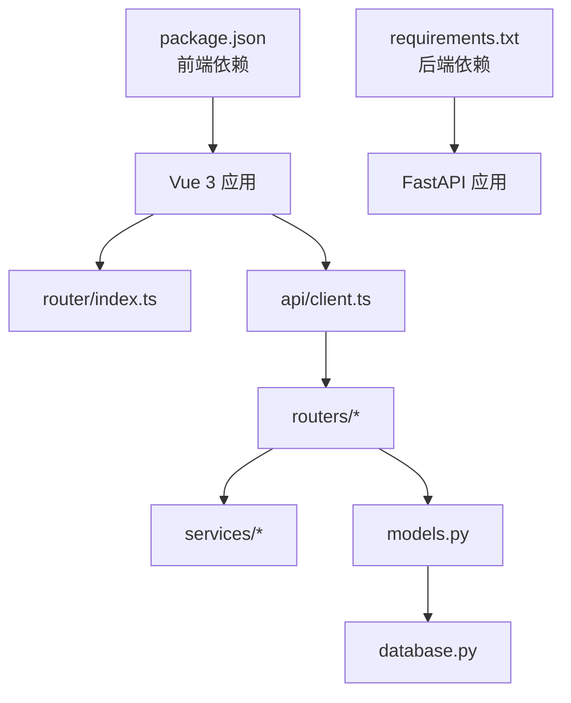

图表来源
- [frontend/package.json](file://frontend/package.json)
- [backend/requirements.txt](file://backend/requirements.txt)
- [frontend/src/router/index.ts](file://frontend/src/router/index.ts)
- [frontend/src/api/client.ts](file://frontend/src/api/client.ts)
- [backend/routers/user.py](file://backend/routers/user.py)
- [backend/routers/query.py](file://backend/routers/query.py)
- [backend/routers/records.py](file://backend/routers/records.py)
- [backend/routers/timeline.py](file://backend/routers/timeline.py)
- [backend/routers/tasks.py](file://backend/routers/tasks.py)
- [backend/routers/export.py](file://backend/routers/export.py)
- [backend/routers/asr.py](file://backend/routers/asr.py)
- [backend/routers/context.py](file://backend/routers/context.py)
- [backend/routers/mood.py](file://backend/routers/mood.py)
- [backend/routers/process.py](file://backend/routers/process.py)
- [backend/routers/sync.py](file://backend/routers/sync.py)
- [backend/services/processor.py](file://backend/services/processor.py)
- [backend/services/fuzzy_match.py](file://backend/services/fuzzy_match.py)
- [backend/models.py](file://backend/models.py)
- [backend/database.py](file://backend/database.py)

章节来源
- [frontend/package.json](file://frontend/package.json)
- [backend/requirements.txt](file://backend/requirements.txt)
- [frontend/src/router/index.ts](file://frontend/src/router/index.ts)
- [frontend/src/api/client.ts](file://frontend/src/api/client.ts)
- [backend/routers/user.py](file://backend/routers/user.py)
- [backend/routers/query.py](file://backend/routers/query.py)
- [backend/routers/records.py](file://backend/routers/records.py)
- [backend/routers/timeline.py](file://backend/routers/timeline.py)
- [backend/routers/tasks.py](file://backend/routers/tasks.py)
- [backend/routers/export.py](file://backend/routers/export.py)
- [backend/routers/asr.py](file://backend/routers/asr.py)
- [backend/routers/context.py](file://backend/routers/context.py)
- [backend/routers/mood.py](file://backend/routers/mood.py)
- [backend/routers/process.py](file://backend/routers/process.py)
- [backend/routers/sync.py](file://backend/routers/sync.py)
- [backend/services/processor.py](file://backend/services/processor.py)
- [backend/services/fuzzy_match.py](file://backend/services/fuzzy_match.py)
- [backend/models.py](file://backend/models.py)
- [backend/database.py](file://backend/database.py)

## 性能考量
- 前端优化：
  - 路由懒加载与组件按需引入，减少首屏体积。
  - HTTP客户端增加请求去重与缓存策略，降低重复请求。
- 后端优化：
  - 数据库连接池与会话复用，避免频繁建连。
  - 异步任务与队列处理耗时操作（如导出、ASR、模糊匹配）。
  - 对热点查询建立索引与分页限制，防止全表扫描。
- 网络与传输：
  - 启用Gzip压缩与HTTP/2，提升传输效率。
  - 合理设置超时与重试，增强鲁棒性。

[本节为通用指导，不直接分析具体文件]

## 故障排查指南
- 前端常见问题：
  - 网络错误：检查client.ts的错误拦截与重试配置，确认后端可达性与跨域设置。
  - 路由跳转失败：核对router/index.ts的守卫逻辑与权限配置。
  - 状态不同步：检查user.ts与sync.ts的状态更新与同步触发条件。
- 后端常见问题：
  - 参数校验失败：查看schemas.py定义的字段约束与错误消息。
  - 数据库连接异常：检查database.py的连接配置与会话生命周期。
  - 安全相关错误：确认security.py的令牌校验与密码哈希流程。
- 日志与调试：
  - 在路由与服务层添加结构化日志，定位问题链路。
  - 使用开发工具的Network与Console面板观察请求与响应。

章节来源
- [frontend/src/api/client.ts](file://frontend/src/api/client.ts)
- [frontend/src/router/index.ts](file://frontend/src/router/index.ts)
- [frontend/src/user.ts](file://frontend/src/user.ts)
- [frontend/src/sync.ts](file://frontend/src/sync.ts)
- [backend/schemas.py](file://backend/schemas.py)
- [backend/database.py](file://backend/database.py)
- [backend/security.py](file://backend/security.py)

## 结论
AdventureX系统采用清晰的前后端分离架构，通过Vue 3与FastAPI实现模块化与可扩展性。数据库层以SQLite作为轻量级持久化方案，配合ORM模型与Pydantic校验保障数据一致性。系统边界明确，第三方服务（如ASR）通过路由层集成，扩展点设计合理。建议在生产环境引入连接池、缓存与监控，进一步提升性能与稳定性。

[本节为总结性内容，不直接分析具体文件]

## 附录
- PWA与安装：
  - install.ts提供PWA安装提示与离线能力配置。
- 构建与部署：
  - vite.config.ts配置开发与生产构建选项。
  - package.json管理前端依赖与脚本命令。

章节来源
- [frontend/src/install.ts](file://frontend/src/install.ts)
- [frontend/vite.config.ts](file://frontend/vite.config.ts)
- [frontend/package.json](file://frontend/package.json)