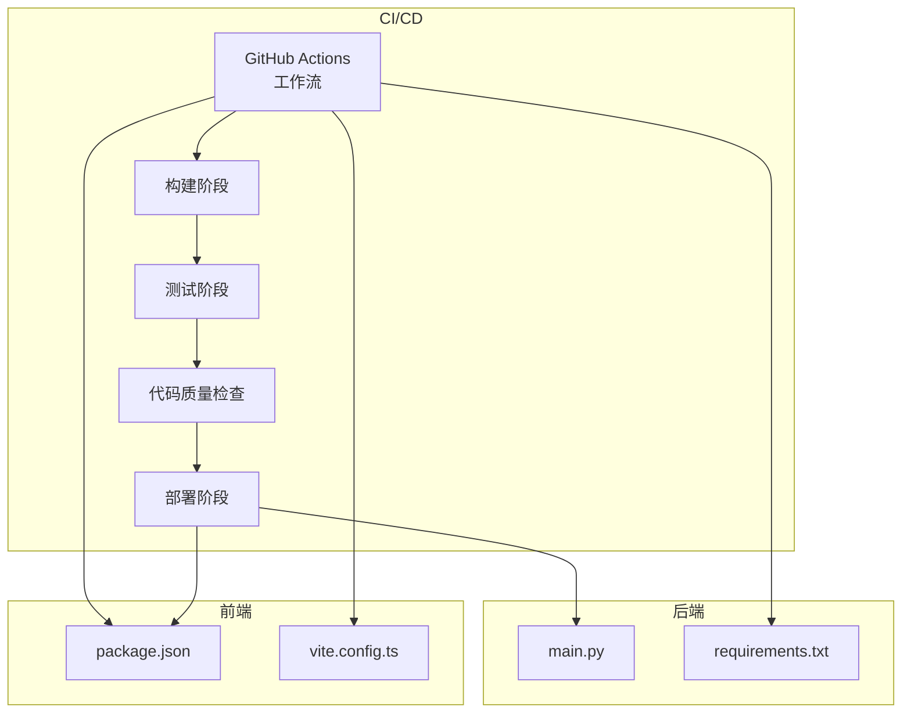
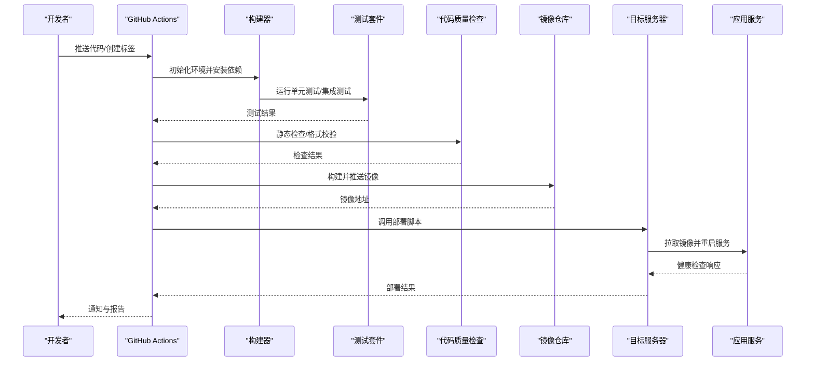
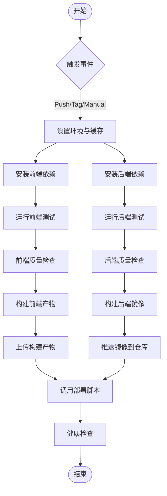
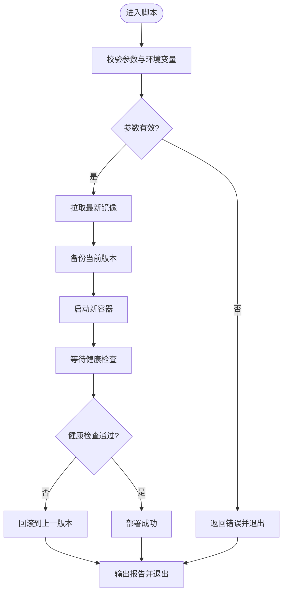
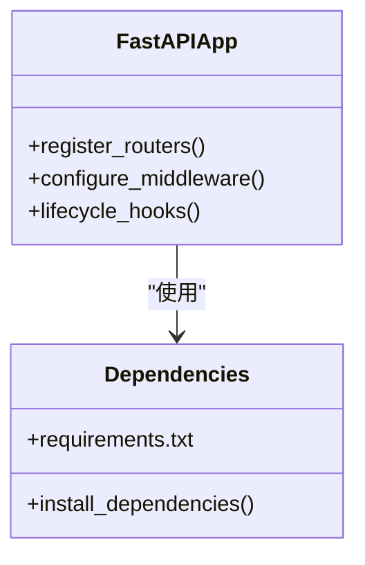
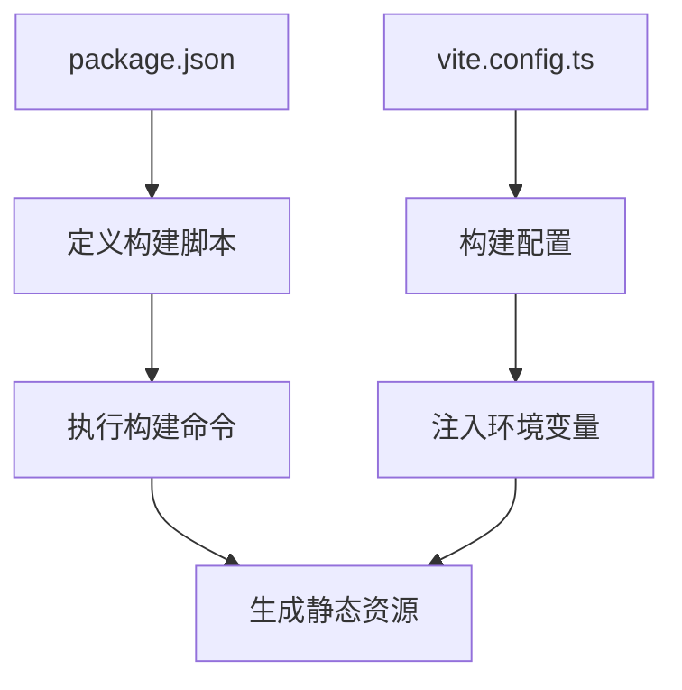
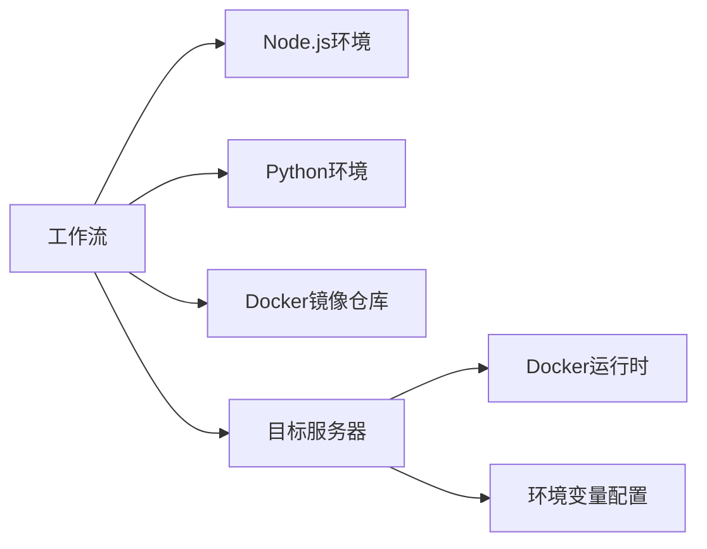

# CI/CD流水线

<cite>
**本文引用的文件**   
- [.github/workflows/deploy.yml](file://.github/workflows/deploy.yml)
- [deploy.sh](file://deploy.sh)
- [backend/main.py](file://backend/main.py)
- [backend/requirements.txt](file://backend/requirements.txt)
- [frontend/package.json](file://frontend/package.json)
- [frontend/vite.config.ts](file://frontend/vite.config.ts)
</cite>

## 目录
1. [简介](#简介)
2. [项目结构](#项目结构)
3. [核心组件](#核心组件)
4. [架构总览](#架构总览)
5. [详细组件分析](#详细组件分析)
6. [依赖分析](#依赖分析)
7. [性能考虑](#性能考虑)
8. [故障排查指南](#故障排查指南)
9. [结论](#结论)
10. [附录](#附录)

## 简介
本文件面向项目的持续集成与持续交付（CI/CD）流水线，围绕GitHub Actions工作流、自动化测试集成、代码质量检查、自动构建与部署流程进行系统化说明。文档同时覆盖分支策略、版本管理、回滚机制，以及流水线监控与故障排查方法，帮助团队稳定高效地发布前后端服务。

## 项目结构
仓库采用前后端分离结构：
- 后端：Python/FastAPI应用，位于backend目录，包含路由、服务、配置、数据库模型等。
- 前端：Vue/Vite应用，位于frontend目录，包含组件、视图、国际化、打包配置等。
- CI/CD：GitHub Actions工作流定义在.github/workflows/deploy.yml；部署脚本deploy.sh用于服务器端执行。

**图表来源** 
- [.github/workflows/deploy.yml](file://.github/workflows/deploy.yml)
- [deploy.sh](file://deploy.sh)
- [backend/main.py](file://backend/main.py)
- [backend/requirements.txt](file://backend/requirements.txt)
- [frontend/package.json](file://frontend/package.json)
- [frontend/vite.config.ts](file://frontend/vite.config.ts)

**章节来源**
- [.github/workflows/deploy.yml](file://.github/workflows/deploy.yml)
- [deploy.sh](file://deploy.sh)
- [backend/main.py](file://backend/main.py)
- [backend/requirements.txt](file://backend/requirements.txt)
- [frontend/package.json](file://frontend/package.json)
- [frontend/vite.config.ts](file://frontend/vite.config.ts)

## 核心组件
- GitHub Actions工作流：定义触发条件、矩阵构建、环境准备、安装依赖、运行测试、代码质量检查、构建产物生成与部署步骤。
- 部署脚本：在服务端执行容器拉取、环境变量注入、服务重启与健康检查。
- 后端依赖管理：通过requirements.txt锁定Python依赖，确保构建可重复性。
- 前端构建配置：通过package.json与vite.config.ts定义构建命令与环境变量注入。

**章节来源**
- [.github/workflows/deploy.yml](file://.github/workflows/deploy.yml)
- [deploy.sh](file://deploy.sh)
- [backend/requirements.txt](file://backend/requirements.txt)
- [frontend/package.json](file://frontend/package.json)
- [frontend/vite.config.ts](file://frontend/vite.config.ts)

## 架构总览
下图展示从代码提交到生产部署的端到端流程，包括分支触发、构建、测试、质量检查、镜像构建与推送、服务端部署与健康检查。

**图表来源** 
- [.github/workflows/deploy.yml](file://.github/workflows/deploy.yml)
- [deploy.sh](file://deploy.sh)

## 详细组件分析

### GitHub Actions工作流（deploy.yml）
- 触发条件：支持push至特定分支、创建或更新标签、手动触发。
- 环境准备：设置Node.js与Python环境，缓存依赖以提升构建速度。
- 构建与测试：分别对前端与后端执行依赖安装、测试与质量检查。
- 制品与镜像：构建前端静态资源与后端镜像，推送到镜像仓库。
- 部署：调用部署脚本完成服务更新与健康检查。

**图表来源** 
- [.github/workflows/deploy.yml](file://.github/workflows/deploy.yml)

**章节来源**
- [.github/workflows/deploy.yml](file://.github/workflows/deploy.yml)

### 部署脚本（deploy.sh）
- 职责：在服务端执行镜像拉取、环境变量注入、容器启动/重启、健康检查与失败回滚。
- 关键步骤：
  - 验证必要的环境变量与参数。
  - 拉取最新镜像并备份当前版本。
  - 启动新容器并等待健康检查通过。
  - 若健康检查失败，自动回滚到上一版本。
  - 输出部署日志与状态码以便追踪。

**图表来源** 
- [deploy.sh](file://deploy.sh)

**章节来源**
- [deploy.sh](file://deploy.sh)

### 后端依赖与入口（requirements.txt、main.py）
- requirements.txt：声明后端依赖包及版本，保证构建可重复性与一致性。
- main.py：FastAPI应用入口，定义路由注册、中间件、生命周期钩子等。

**图表来源** 
- [backend/main.py](file://backend/main.py)
- [backend/requirements.txt](file://backend/requirements.txt)

**章节来源**
- [backend/main.py](file://backend/main.py)
- [backend/requirements.txt](file://backend/requirements.txt)

### 前端构建配置（package.json、vite.config.ts）
- package.json：定义构建脚本、依赖管理与开发工具链。
- vite.config.ts：配置构建选项、环境变量注入、输出目录与代理设置。

**图表来源** 
- [frontend/package.json](file://frontend/package.json)
- [frontend/vite.config.ts](file://frontend/vite.config.ts)

**章节来源**
- [frontend/package.json](file://frontend/package.json)
- [frontend/vite.config.ts](file://frontend/vite.config.ts)

## 依赖分析
- 工作流依赖：
  - 前端：Node.js环境、npm/yarn包管理器、vite构建工具。
  - 后端：Python环境、pip包管理器、FastAPI框架。
  - 镜像仓库：Docker镜像构建与推送。
  - 目标服务器：SSH访问权限、docker运行时、环境变量配置文件。
- 耦合关系：
  - 工作流与部署脚本强耦合，需保持接口一致（参数、环境变量）。
  - 前后端构建产物与服务启动方式需与部署脚本约定一致。

**图表来源** 
- [.github/workflows/deploy.yml](file://.github/workflows/deploy.yml)
- [deploy.sh](file://deploy.sh)

**章节来源**
- [.github/workflows/deploy.yml](file://.github/workflows/deploy.yml)
- [deploy.sh](file://deploy.sh)

## 性能考虑
- 依赖缓存：为Node.js与Python依赖启用缓存，减少重复安装时间。
- 并行构建：前后端构建与测试并行执行，缩短整体流水线时长。
- 增量构建：利用构建工具的增量能力，仅重新构建变更模块。
- 镜像优化：多阶段构建与精简基础镜像，降低镜像体积与传输时间。
- 健康检查超时：合理设置健康检查超时与重试次数，避免误判。

[本节为通用指导，不直接分析具体文件]

## 故障排查指南
- 常见问题定位：
  - 依赖安装失败：检查网络、镜像源、依赖版本冲突。
  - 测试失败：查看测试日志，确认断言与环境变量。
  - 构建失败：核对构建命令、环境变量、路径权限。
  - 部署失败：检查SSH连接、镜像拉取、容器启动日志。
- 日志收集：
  - GitHub Actions运行日志：查看各步骤输出与错误堆栈。
  - 服务器日志：查看容器标准输出、系统日志与健康检查响应。
- 回滚策略：
  - 自动回滚：健康检查失败时回滚到上一版本镜像。
  - 手动回滚：通过部署脚本指定版本号进行快速回退。
- 监控告警：
  - 流水线状态：订阅GitHub Actions通知与Webhook。
  - 服务健康：配置外部监控探针与告警规则。

**章节来源**
- [.github/workflows/deploy.yml](file://.github/workflows/deploy.yml)
- [deploy.sh](file://deploy.sh)

## 结论
本CI/CD流水线通过GitHub Actions实现自动化构建、测试、质量检查与部署，结合部署脚本提供健壮的回滚与健康检查机制。建议持续优化依赖缓存、并行化与镜像体积，完善监控与告警，提升发布效率与稳定性。

[本节为总结性内容，不直接分析具体文件]

## 附录
- 分支策略建议：
  - main：生产分支，仅允许受保护合并与标签发布。
  - develop：开发主干，集成功能分支。
  - feature/*：功能分支，按特性命名。
  - hotfix/*：紧急修复分支，快速合并至main与develop。
- 版本管理建议：
  - 语义化版本：主版本.次版本.修订号。
  - 标签规范：vX.Y.Z，对应发布镜像标签。
  - 变更日志：维护CHANGELOG.md记录重要更新。
- 安全与合规：
  - 密钥管理：使用GitHub Secrets存储敏感信息。
  - 镜像扫描：集成安全扫描工具检测漏洞。
  - 审计日志：保留构建与部署日志以备审计。

[本节为概念性内容，不直接分析具体文件]