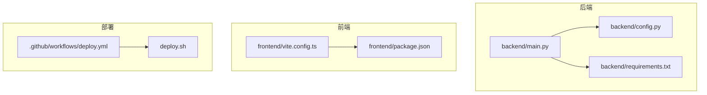
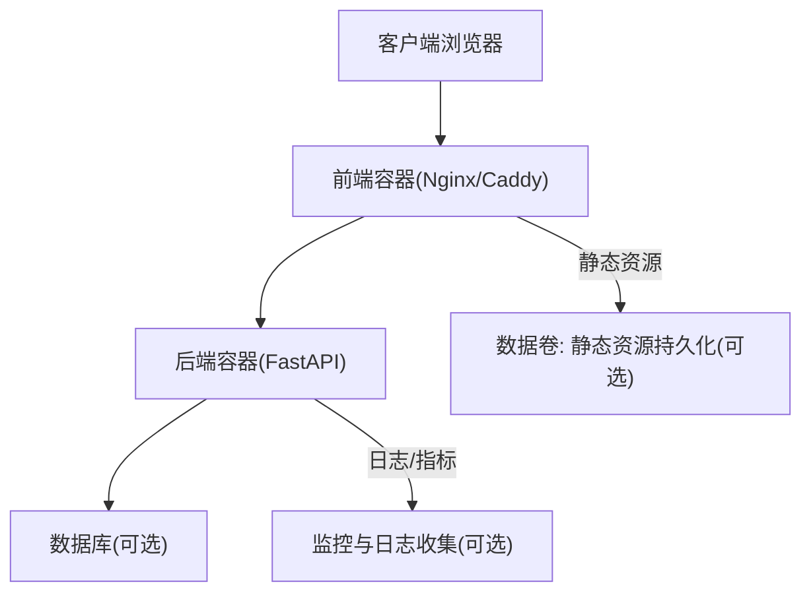
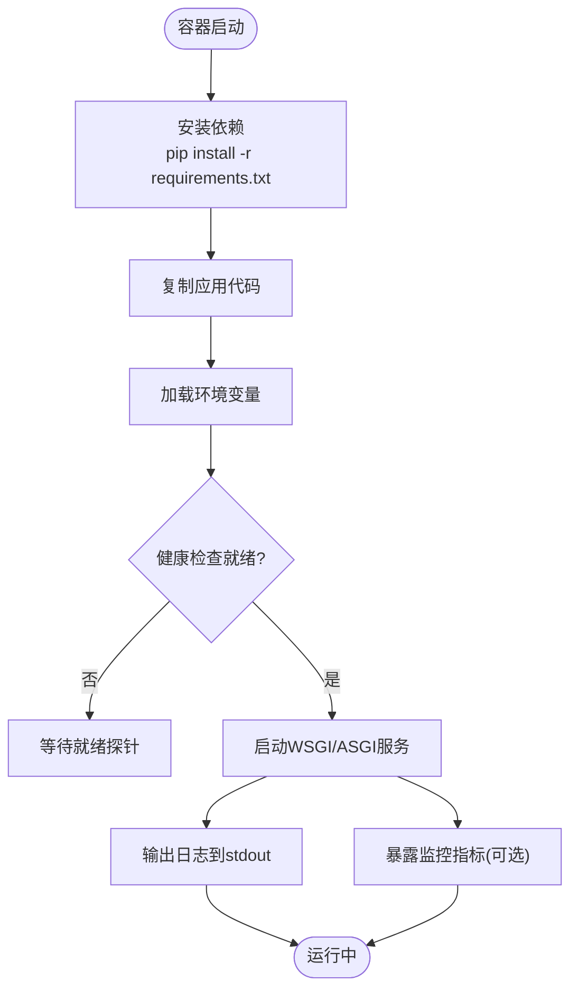
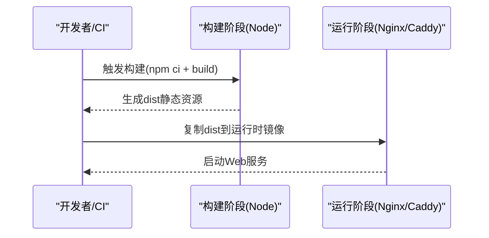
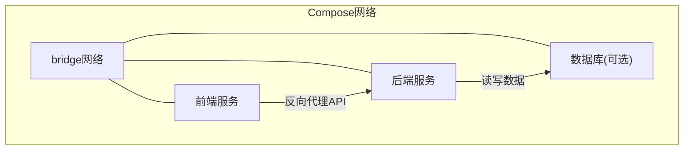
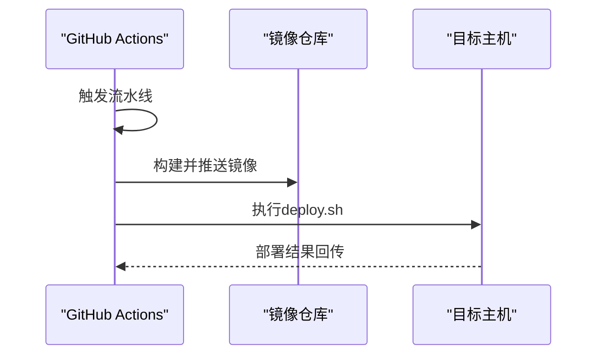
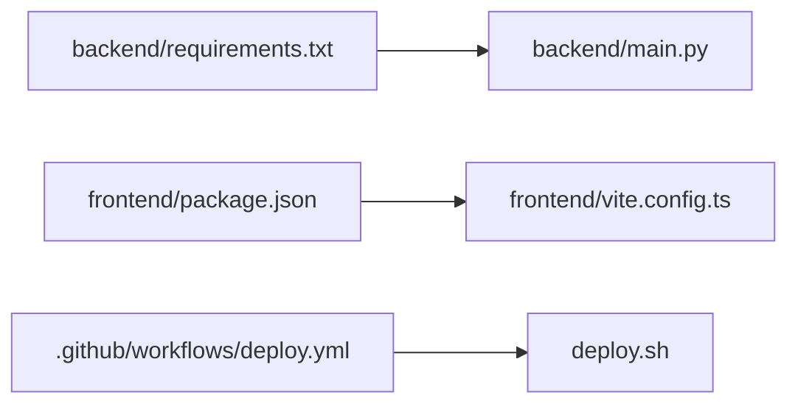

# Docker容器化部署

<cite>
**本文引用的文件**   
- [README.md](file://README.md)
- [backend/main.py](file://backend/main.py)
- [backend/config.py](file://backend/config.py)
- [backend/requirements.txt](file://backend/requirements.txt)
- [frontend/package.json](file://frontend/package.json)
- [frontend/vite.config.ts](file://frontend/vite.config.ts)
- [.github/workflows/deploy.yml](file://.github/workflows/deploy.yml)
- [deploy.sh](file://deploy.sh)
</cite>

## 目录
1. [简介](#简介)
2. [项目结构](#项目结构)
3. [核心组件](#核心组件)
4. [架构总览](#架构总览)
5. [详细组件分析](#详细组件分析)
6. [依赖关系分析](#依赖关系分析)
7. [性能考虑](#性能考虑)
8. [故障排查指南](#故障排查指南)
9. [结论](#结论)
10. [附录](#附录)

## 简介
本文件面向希望将本项目进行Docker容器化部署的工程师与运维人员，提供从镜像构建、多阶段优化、编排配置到监控日志与健康检查的完整指南。内容基于仓库中的后端Python服务、前端静态资源以及CI/CD脚本进行分析，确保落地可执行且便于扩展。

## 项目结构
仓库包含前后端代码与部署脚本：
- 后端：Python FastAPI应用，位于 backend 目录，含路由、模型、数据库、配置等模块。
- 前端：Vue/Vite应用，位于 frontend 目录，构建产物为静态资源。
- 部署：根目录 deploy.sh 与 .github/workflows/deploy.yml 用于自动化构建与发布。

图表来源
- [backend/main.py](file://backend/main.py)
- [backend/config.py](file://backend/config.py)
- [backend/requirements.txt](file://backend/requirements.txt)
- [frontend/vite.config.ts](file://frontend/vite.config.ts)
- [frontend/package.json](file://frontend/package.json)
- [.github/workflows/deploy.yml](file://.github/workflows/deploy.yml)
- [deploy.sh](file://deploy.sh)

章节来源
- [README.md](file://README.md)

## 核心组件
- 后端服务（FastAPI）
  - 入口与路由组织在 backend/main.py 中，配合 backend/config.py 管理运行时配置，依赖由 backend/requirements.txt 声明。
- 前端静态站点
  - 使用 Vite 构建，配置文件 frontend/vite.config.ts 与包管理 frontend/package.json 定义构建流程与依赖。
- 自动化部署
  - GitHub Actions 工作流 .github/workflows/deploy.yml 驱动构建与发布；deploy.sh 提供本地或远程一键部署能力。

章节来源
- [backend/main.py](file://backend/main.py)
- [backend/config.py](file://backend/config.py)
- [backend/requirements.txt](file://backend/requirements.txt)
- [frontend/vite.config.ts](file://frontend/vite.config.ts)
- [frontend/package.json](file://frontend/package.json)
- [.github/workflows/deploy.yml](file://.github/workflows/deploy.yml)
- [deploy.sh](file://deploy.sh)

## 架构总览
容器化后，系统通常由以下容器组成：
- 后端服务容器：运行Python应用，暴露API端口。
- 前端静态资源容器：Nginx或Caddy托管构建产物，反向代理至后端。
- 可选：数据库、缓存、消息队列等外部服务通过Compose网络互联。

[该图为概念性架构图，不直接映射具体源码文件]

## 详细组件分析

### 后端容器化（Python/FastAPI）
- 基础镜像选择
  - 建议使用轻量级Python镜像（如 slim 或 alpine 变体），并锁定Python版本以保障一致性。
- 依赖安装与缓存
  - 先复制 requirements.txt 并安装依赖，利用Docker层缓存加速重复构建。
- 应用启动
  - 使用 uvicorn/gunicorn 作为WSGI/ASGI服务器，设置 workers、threads、超时等参数。
- 健康检查
  - 暴露 /health 或 /api/health 接口，返回HTTP 200表示就绪；在Compose中使用 healthcheck 定期探测。
- 环境变量与配置
  - 通过环境变量注入数据库连接串、密钥、调试开关等，避免硬编码。
- 日志与监控
  - 输出结构化JSON日志到stdout/stderr，便于日志采集；暴露Prometheus指标端点（可选）。

章节来源
- [backend/main.py](file://backend/main.py)
- [backend/config.py](file://backend/config.py)
- [backend/requirements.txt](file://backend/requirements.txt)

### 前端容器化（Vite静态站点）
- 构建阶段
  - 使用Node镜像执行 npm ci 与构建命令，生成dist静态资源。
- 运行阶段
  - 使用Nginx或Caddy镜像托管dist目录，配置反向代理转发API请求到后端服务。
- 多阶段构建优化
  - 第一阶段：构建依赖与产物；第二阶段：仅拷贝dist到轻量运行时镜像，显著减小镜像体积。
- 环境变量注入
  - 构建时通过环境变量控制API地址、功能开关等。

章节来源
- [frontend/package.json](file://frontend/package.json)
- [frontend/vite.config.ts](file://frontend/vite.config.ts)

### 编排与网络（Docker Compose）
- 服务定义
  - 定义后端与前端服务，设置端口映射、环境变量、依赖关系、健康检查与重启策略。
- 网络设置
  - 默认桥接网络下，服务间通过服务名互相访问；如需隔离，可自定义网络。
- 数据卷挂载
  - 将日志、上传文件、数据库文件等持久化到宿主机目录或命名卷。
- 健康检查
  - 对每个服务配置 healthcheck，结合 depends_on with condition 保证启动顺序。

[该图为概念性编排图，不直接映射具体源码文件]

### CI/CD集成（GitHub Actions）
- 工作流职责
  - 拉取代码、安装依赖、构建镜像、推送镜像仓库、更新部署清单。
- 与部署脚本联动
  - 工作流调用 deploy.sh 完成目标环境部署，支持多环境变量注入。

章节来源
- [.github/workflows/deploy.yml](file://.github/workflows/deploy.yml)
- [deploy.sh](file://deploy.sh)

## 依赖关系分析
- 后端依赖
  - Python运行时与第三方库由 requirements.txt 管理；应用入口 main.py 依赖 config.py 读取配置。
- 前端依赖
  - Node.js工具链与Vite插件由 package.json 管理；构建行为受 vite.config.ts 控制。
- 部署依赖
  - GitHub Actions工作流依赖Docker CLI与镜像仓库；deploy.sh依赖SSH或容器运行时。

图表来源
- [backend/requirements.txt](file://backend/requirements.txt)
- [backend/main.py](file://backend/main.py)
- [frontend/package.json](file://frontend/package.json)
- [frontend/vite.config.ts](file://frontend/vite.config.ts)
- [.github/workflows/deploy.yml](file://.github/workflows/deploy.yml)
- [deploy.sh](file://deploy.sh)

章节来源
- [backend/requirements.txt](file://backend/requirements.txt)
- [backend/main.py](file://backend/main.py)
- [frontend/package.json](file://frontend/package.json)
- [frontend/vite.config.ts](file://frontend/vite.config.ts)
- [.github/workflows/deploy.yml](file://.github/workflows/deploy.yml)
- [deploy.sh](file://deploy.sh)

## 性能考虑
- 镜像体积优化
  - 使用多阶段构建，仅将必要产物复制到最终镜像；选择slim/alpine基础镜像。
- 构建缓存
  - 分层缓存依赖安装与构建步骤，减少重复构建时间。
- 运行时优化
  - 后端设置合适的workers与线程数；前端启用Gzip/Brotli压缩。
- I/O与存储
  - 将热路径数据（如上传文件、日志）挂载到高性能卷；避免在容器内写大文件。
- 网络与反代
  - 前端反代开启keep-alive与连接池，减少握手开销。

[本节为通用指导，不直接分析具体文件]

## 故障排查指南
- 常见启动问题
  - 端口冲突：检查宿主机端口占用与服务端口映射。
  - 环境变量缺失：确认必需的环境变量已注入，尤其是数据库连接串与密钥。
  - 权限问题：数据卷挂载目录权限不足导致写入失败。
- 健康检查失败
  - 检查后端健康接口是否可达；调整健康检查间隔与重试次数。
- 日志定位
  - 查看容器标准输出与错误输出；集中式日志平台抓取JSON格式日志。
- 网络连通性
  - 使用docker exec进入容器测试服务间DNS解析与端口连通性。

章节来源
- [backend/config.py](file://backend/config.py)
- [backend/main.py](file://backend/main.py)
- [deploy.sh](file://deploy.sh)

## 结论
通过多阶段构建、合理的编排与健康检查，可将前后端服务稳定地容器化部署。结合CI/CD与日志监控，可实现高效迭代与快速排障。建议在生产环境中引入指标采集、告警与灰度发布机制，进一步提升可靠性与可观测性。

[本节为总结性内容，不直接分析具体文件]

## 附录
- 建议的镜像标签策略
  - 使用语义化版本与Git提交哈希组合，便于回溯与回滚。
- 安全加固
  - 最小权限原则运行容器；定期扫描镜像漏洞；敏感信息使用密钥管理服务。
- 扩展性
  - 无状态服务水平扩展；有状态服务采用主从或集群方案。

[本节为补充说明，不直接分析具体文件]