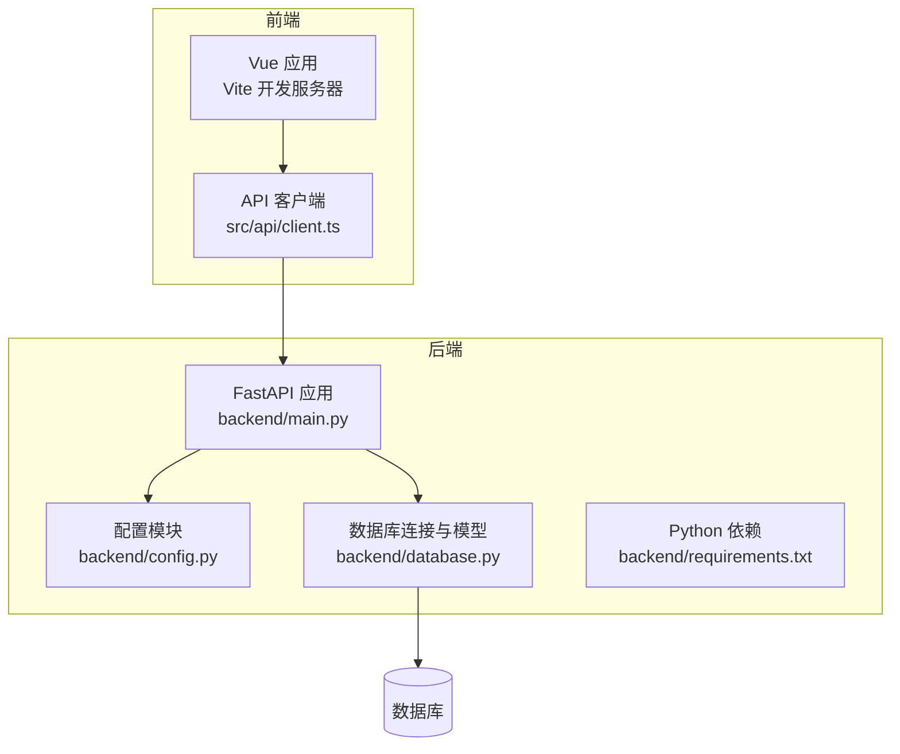
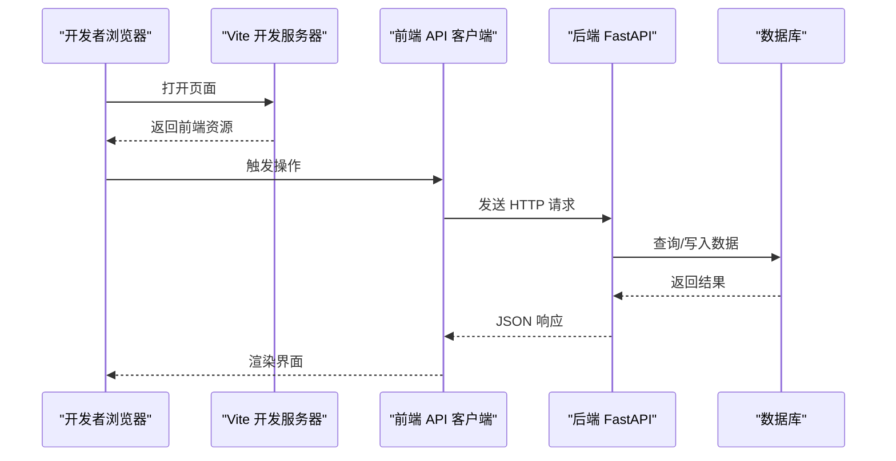
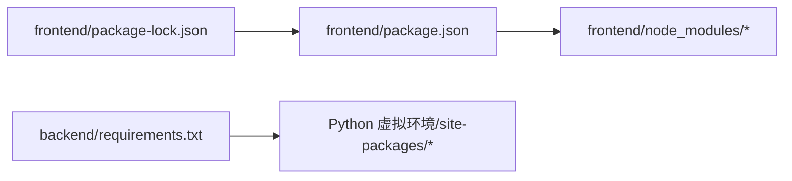

# 本地开发环境

<cite>
**本文引用的文件**   
- [backend/main.py](file://backend/main.py)
- [backend/config.py](file://backend/config.py)
- [backend/database.py](file://backend/database.py)
- [backend/requirements.txt](file://backend/requirements.txt)
- [frontend/package.json](file://frontend/package.json)
- [frontend/vite.config.ts](file://frontend/vite.config.ts)
- [frontend/src/api/client.ts](file://frontend/src/api/client.ts)
- [README.md](file://README.md)
</cite>

## 目录
1. [简介](#简介)
2. [项目结构](#项目结构)
3. [核心组件](#核心组件)
4. [架构总览](#架构总览)
5. [详细组件分析](#详细组件分析)
6. [依赖分析](#依赖分析)
7. [性能考虑](#性能考虑)
8. [故障排查指南](#故障排查指南)
9. [结论](#结论)
10. [附录](#附录)

## 简介
本指南面向希望在本地搭建并运行该项目的开发者，涵盖 Python 与 Node.js 环境要求、依赖安装、环境变量配置、数据库初始化、前后端服务启动、热重载与调试工具使用，以及常见问题的定位与解决。文档以仓库实际代码为依据，确保步骤可落地、命令可直接执行。

## 项目结构
本项目采用前后端分离的架构：
- 后端为 Python（FastAPI），提供 REST API，数据持久化通过数据库驱动完成。
- 前端为 Vue 3 + TypeScript + Vite，构建产物由 Vite 托管开发服务器。

图表来源 
- [backend/main.py](file://backend/main.py)
- [backend/config.py](file://backend/config.py)
- [backend/database.py](file://backend/database.py)
- [frontend/src/api/client.ts](file://frontend/src/api/client.ts)

章节来源
- [README.md](file://README.md)

## 核心组件
- 后端入口与路由组织：FastAPI 应用集中管理路由与中间件，统一处理请求生命周期。
- 配置与环境变量：集中读取环境变量，支撑不同环境的差异化配置。
- 数据库层：负责连接、会话管理与基础模型定义。
- 前端 API 客户端：封装对后端的 HTTP 调用，便于在 Vue 组件中复用。

章节来源
- [backend/main.py](file://backend/main.py)
- [backend/config.py](file://backend/config.py)
- [backend/database.py](file://backend/database.py)
- [frontend/src/api/client.ts](file://frontend/src/api/client.ts)

## 架构总览
下图展示了本地开发时的典型交互流程：前端通过 Vite 启动，向后端 FastAPI 发起 API 请求；后端根据路由分发到具体处理器，并通过数据库层读写数据。

图表来源 
- [frontend/vite.config.ts](file://frontend/vite.config.ts)
- [frontend/src/api/client.ts](file://frontend/src/api/client.ts)
- [backend/main.py](file://backend/main.py)
- [backend/database.py](file://backend/database.py)

## 详细组件分析

### 后端环境准备与启动
- Python 版本要求：建议使用与 requirements.txt 兼容的 Python 3.x 版本。
- 虚拟环境：建议在 backend 目录下创建独立虚拟环境，避免全局污染。
- 依赖安装：使用 pip 安装 backend/requirements.txt 中的依赖。
- 环境变量：按后端配置模块的要求设置必要的环境变量（如数据库连接串、密钥等）。
- 启动命令：进入 backend 目录，使用 uvicorn 或项目提供的脚本启动 FastAPI 服务。

章节来源
- [backend/requirements.txt](file://backend/requirements.txt)
- [backend/config.py](file://backend/config.py)
- [backend/database.py](file://backend/database.py)
- [backend/main.py](file://backend/main.py)

### 前端环境准备与启动
- Node.js 版本要求：建议使用与 package.json 中 engines 字段一致的 Node.js 版本。
- 包管理器：推荐使用 npm 或 pnpm/yarn（与 package-lock.json 保持一致）。
- 依赖安装：在 frontend 目录下执行包管理器安装命令。
- 环境变量：如需自定义 API 地址或功能开关，可在前端环境变量文件中配置。
- 启动命令：使用 Vite 启动开发服务器，默认监听本地端口，支持热重载。

章节来源
- [frontend/package.json](file://frontend/package.json)
- [frontend/vite.config.ts](file://frontend/vite.config.ts)
- [frontend/src/api/client.ts](file://frontend/src/api/client.ts)

### 数据库初始化
- 连接配置：在后端配置模块中设置数据库连接参数（如 URL、用户名、密码、主机、端口等）。
- 初始化脚本：若存在迁移或建表脚本，应在首次运行前执行以确保表结构正确。
- 验证连通性：启动后端后可通过健康检查接口或日志确认数据库连接成功。

章节来源
- [backend/config.py](file://backend/config.py)
- [backend/database.py](file://backend/database.py)

### 前后端联调与代理
- 开发时建议将前端 Vite 开发服务器配置为代理后端 API 请求，避免跨域问题。
- 在 vite.config.ts 中配置 proxy，将 /api 等路径转发至后端服务地址。
- 前端 API 客户端应基于相对路径或环境变量配置的 BaseURL 进行调用。

章节来源
- [frontend/vite.config.ts](file://frontend/vite.config.ts)
- [frontend/src/api/client.ts](file://frontend/src/api/client.ts)

### 热重载与调试
- 前端热重载：Vite 默认启用模块热替换（HMR），修改源码即时生效。
- 后端热重载：可使用 uvicorn 的 --reload 参数实现代码变更自动重启。
- 调试工具：
  - 前端：浏览器开发者工具的 Network、Console、Sources 面板。
  - 后端：IDE 断点调试、uvicorn 日志级别调整、HTTP 客户端（如 curl、Postman）测试接口。

章节来源
- [frontend/vite.config.ts](file://frontend/vite.config.ts)
- [backend/main.py](file://backend/main.py)

## 依赖分析
- 后端依赖：集中在 backend/requirements.txt，包含 Web 框架、ORM、加密库等。
- 前端依赖：集中在 frontend/package.json，包含 Vue、TypeScript、Vite、UI 库等。
- 版本锁定：前端使用 package-lock.json 保证依赖一致性。

图表来源 
- [frontend/package.json](file://frontend/package.json)
- [frontend/package-lock.json](file://frontend/package-lock.json)
- [backend/requirements.txt](file://backend/requirements.txt)

章节来源
- [frontend/package.json](file://frontend/package.json)
- [frontend/package-lock.json](file://frontend/package-lock.json)
- [backend/requirements.txt](file://backend/requirements.txt)

## 性能考虑
- 前端：合理使用懒加载与按需引入，减少首屏体积；开启 Vite 生产构建优化。
- 后端：合理设置日志级别，避免在生产环境输出过多调试信息；数据库连接池与慢查询监控。
- 联调：优先使用代理减少跨域开销；避免在开发阶段频繁全量刷新。

## 故障排查指南
- 端口占用：
  - 现象：启动时报端口被占用。
  - 处理：更换端口或释放占用进程；检查 vite.config.ts 与后端监听端口是否冲突。
- 跨域错误：
  - 现象：前端控制台报 CORS 相关错误。
  - 处理：在 vite.config.ts 中配置代理，或将后端允许的来源设置为前端地址。
- 数据库连接失败：
  - 现象：后端启动或请求时报连接错误。
  - 处理：检查环境变量是否正确；确认数据库服务已启动且网络可达；核对用户名、密码、端口。
- 依赖缺失或版本不匹配：
  - 现象：导入错误或运行时异常。
  - 处理：重新安装依赖；确保 Node.js/Python 版本与工程要求一致；清理 node_modules 或虚拟环境后重装。
- 环境变量未生效：
  - 现象：配置项未按预期加载。
  - 处理：确认 .env 或系统环境变量已正确设置；重启服务使环境变量生效。

章节来源
- [frontend/vite.config.ts](file://frontend/vite.config.ts)
- [backend/config.py](file://backend/config.py)
- [backend/database.py](file://backend/database.py)
- [backend/main.py](file://backend/main.py)

## 结论
按照本指南完成 Python 与 Node.js 环境准备、依赖安装、环境变量配置与数据库初始化后，即可顺利启动前后端服务并进行联调。开发过程中建议充分利用 Vite 热重载与 uvicorn 热重载提升效率，并结合浏览器与 IDE 调试工具快速定位问题。

## 附录
- 常用命令速查：
  - 后端：进入 backend 目录，激活虚拟环境，安装依赖，设置环境变量，启动服务。
  - 前端：进入 frontend 目录，安装依赖，设置环境变量（可选），启动 Vite 开发服务器。
- 参考文件：
  - 后端入口与配置：backend/main.py、backend/config.py、backend/database.py、backend/requirements.txt
  - 前端配置与客户端：frontend/package.json、frontend/vite.config.ts、frontend/src/api/client.ts