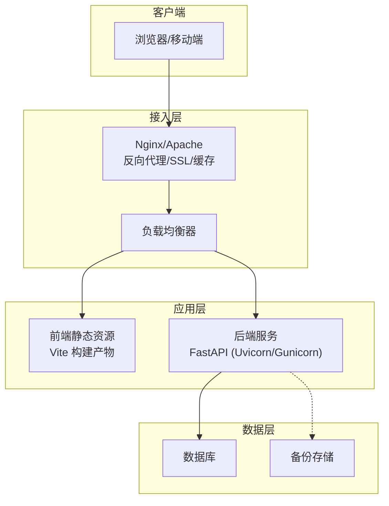
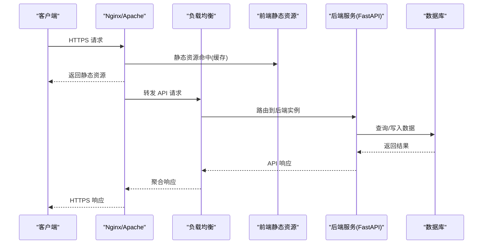
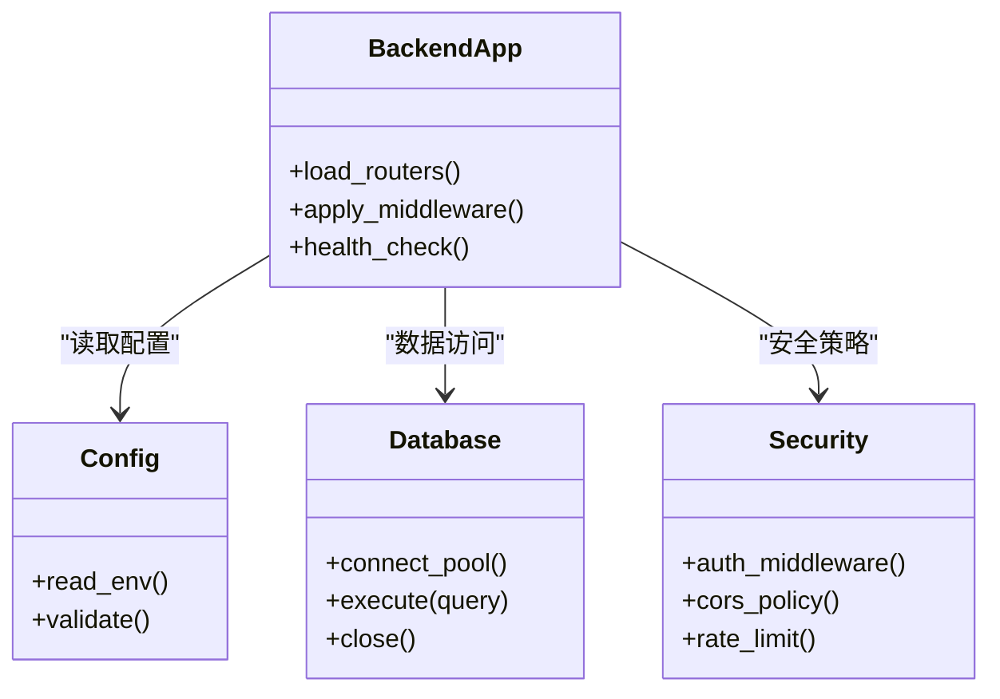
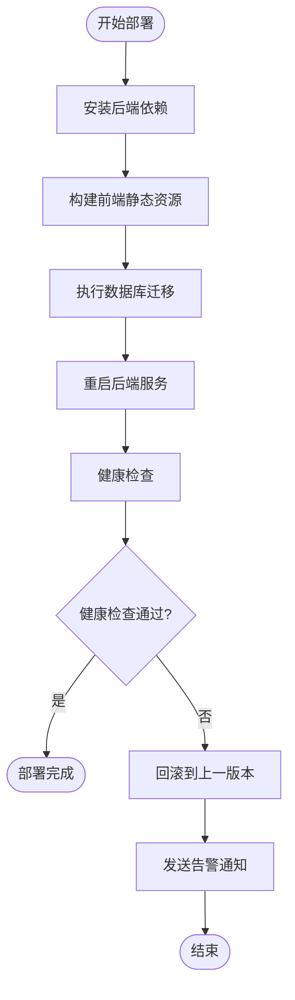
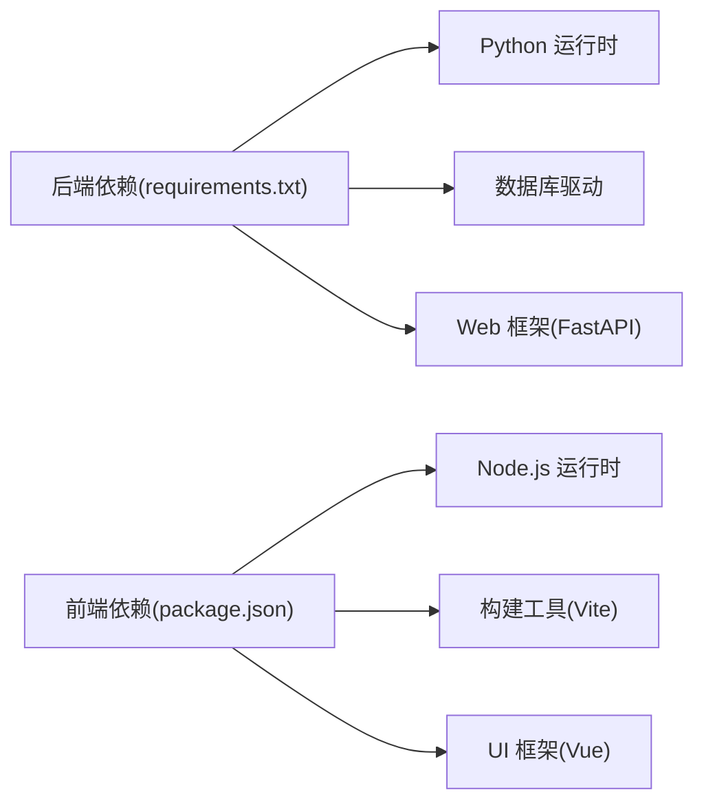

# 生产环境部署

<cite>
**本文引用的文件**   
- [backend/main.py](file://backend/main.py)
- [backend/config.py](file://backend/config.py)
- [backend/database.py](file://backend/database.py)
- [backend/security.py](file://backend/security.py)
- [backend/requirements.txt](file://backend/requirements.txt)
- [frontend/package.json](file://frontend/package.json)
- [frontend/vite.config.ts](file://frontend/vite.config.ts)
- [deploy.sh](file://deploy.sh)
- [.github/workflows/deploy.yml](file://.github/workflows/deploy.yml)
- [README.md](file://README.md)
</cite>

## 目录
1. [简介](#简介)
2. [项目结构](#项目结构)
3. [核心组件](#核心组件)
4. [架构总览](#架构总览)
5. [详细组件分析](#详细组件分析)
6. [依赖分析](#依赖分析)
7. [性能考虑](#性能考虑)
8. [故障排查指南](#故障排查指南)
9. [结论](#结论)
10. [附录](#附录)

## 简介
本指南面向在生产环境中部署 AdventureX 项目的工程师与运维人员，覆盖服务器要求、系统配置、安全加固、反向代理（Nginx/Apache）、SSL 证书、负载均衡、性能调优、监控告警以及备份恢复策略。文档基于仓库中的后端 FastAPI 应用、前端 Vite 构建产物、部署脚本与 CI/CD 工作流进行说明，确保读者能够按步骤完成从单机到多实例的生产化部署。

## 项目结构
本项目采用前后端分离架构：
- 后端：Python + FastAPI，提供 REST API 与必要的业务逻辑，数据库访问与安全模块独立封装。
- 前端：Vue + Vite，构建静态资源由后端或反向代理统一托管。
- 部署：提供一键部署脚本与 GitHub Actions 工作流，便于自动化发布与回滚。

图表来源
- [backend/main.py:1-200](file://backend/main.py#L1-L200)
- [frontend/vite.config.ts:1-200](file://frontend/vite.config.ts#L1-L200)
- [deploy.sh:1-200](file://deploy.sh#L1-L200)
- [.github/workflows/deploy.yml:1-200](file://.github/workflows/deploy.yml#L1-L200)

章节来源
- [README.md:1-200](file://README.md#L1-L200)
- [backend/main.py:1-200](file://backend/main.py#L1-L200)
- [frontend/package.json:1-200](file://frontend/package.json#L1-L200)
- [frontend/vite.config.ts:1-200](file://frontend/vite.config.ts#L1-L200)
- [deploy.sh:1-200](file://deploy.sh#L1-L200)
- [.github/workflows/deploy.yml:1-200](file://.github/workflows/deploy.yml#L1-L200)

## 核心组件
- 后端服务（FastAPI）
  - 入口与路由组织：通过主应用文件加载路由与中间件，暴露 REST API。
  - 配置管理：集中式配置，支持环境变量注入，便于不同环境差异化设置。
  - 数据库连接：统一的连接池与事务管理，确保高并发下的稳定性。
  - 安全模块：鉴权、加密、CORS、请求校验等能力封装。
- 前端应用（Vite）
  - 构建产物：生成静态资源，建议由反向代理直接托管以提升性能。
  - 环境变量：通过构建期变量控制 API 地址、功能开关等。
- 部署与自动化
  - 部署脚本：实现依赖安装、构建、迁移、进程管理与健康检查。
  - CI/CD：GitHub Actions 工作流用于自动化测试、构建与发布。

章节来源
- [backend/main.py:1-200](file://backend/main.py#L1-L200)
- [backend/config.py:1-200](file://backend/config.py#L1-L200)
- [backend/database.py:1-200](file://backend/database.py#L1-L200)
- [backend/security.py:1-200](file://backend/security.py#L1-L200)
- [frontend/package.json:1-200](file://frontend/package.json#L1-L200)
- [frontend/vite.config.ts:1-200](file://frontend/vite.config.ts#L1-L200)
- [deploy.sh:1-200](file://deploy.sh#L1-L200)
- [.github/workflows/deploy.yml:1-200](file://.github/workflows/deploy.yml#L1-L200)

## 架构总览
生产环境推荐架构如下：
- 接入层：Nginx/Apache 作为反向代理，处理 SSL 终止、静态资源缓存、限流与压缩。
- 负载均衡：多实例后端服务通过负载均衡分发请求，提升可用性与扩展性。
- 应用层：后端使用 Gunicorn/Uvicorn 多进程运行，前端静态资源由反向代理托管。
- 数据层：数据库使用连接池与读写分离（可选），定期备份至对象存储或异地磁盘。

图表来源
- [backend/main.py:1-200](file://backend/main.py#L1-L200)
- [frontend/vite.config.ts:1-200](file://frontend/vite.config.ts#L1-L200)
- [deploy.sh:1-200](file://deploy.sh#L1-L200)

## 详细组件分析

### 后端服务（FastAPI）
- 启动与进程模型
  - 建议使用 Gunicorn 作为 WSGI/ASGI 服务器，配合 Uvicorn Worker 类型，合理设置 worker 数量与线程数。
  - 进程健康检查与自动重启：通过 systemd 或容器编排平台管理生命周期。
- 配置与环境变量
  - 集中式配置模块读取环境变量，避免硬编码敏感信息。
  - 关键配置项包括数据库连接串、JWT 密钥、CORS 白名单、日志级别等。
- 数据库连接与迁移
  - 连接池大小根据 CPU 核数与 I/O 特性调整，避免连接耗尽。
  - 迁移脚本应在部署前执行，确保 schema 一致性。
- 安全与鉴权
  - 启用 CORS 白名单，限制跨域来源。
  - 使用强密码策略与最小权限原则，数据库账号仅授予必要权限。
  - 输入校验与错误处理，防止注入与异常泄露。

图表来源
- [backend/main.py:1-200](file://backend/main.py#L1-L200)
- [backend/config.py:1-200](file://backend/config.py#L1-L200)
- [backend/database.py:1-200](file://backend/database.py#L1-L200)
- [backend/security.py:1-200](file://backend/security.py#L1-L200)

章节来源
- [backend/main.py:1-200](file://backend/main.py#L1-L200)
- [backend/config.py:1-200](file://backend/config.py#L1-L200)
- [backend/database.py:1-200](file://backend/database.py#L1-L200)
- [backend/security.py:1-200](file://backend/security.py#L1-L200)
- [backend/requirements.txt:1-200](file://backend/requirements.txt#L1-L200)

### 前端应用（Vite）
- 构建与托管
  - 构建产物为静态资源，建议由 Nginx/Apache 托管并开启 gzip/brotli 压缩。
  - 通过构建期环境变量注入 API 基础路径与功能开关。
- 缓存与版本化
  - 文件名哈希化，启用长期缓存；更新时通过版本号或 CDN 刷新。
- 开发与服务模式
  - 开发阶段使用 Vite Dev Server，生产阶段仅托管构建产物。

章节来源
- [frontend/package.json:1-200](file://frontend/package.json#L1-L200)
- [frontend/vite.config.ts:1-200](file://frontend/vite.config.ts#L1-L200)

### 部署脚本与 CI/CD
- 部署脚本
  - 负责依赖安装、前端构建、数据库迁移、进程管理与健康检查。
  - 支持灰度发布与快速回滚。
- CI/CD 工作流
  - 自动化测试、构建镜像或包、推送制品、触发部署流水线。
  - 失败时通知与回滚策略。

图表来源
- [deploy.sh:1-200](file://deploy.sh#L1-L200)
- [.github/workflows/deploy.yml:1-200](file://.github/workflows/deploy.yml#L1-L200)

章节来源
- [deploy.sh:1-200](file://deploy.sh#L1-L200)
- [.github/workflows/deploy.yml:1-200](file://.github/workflows/deploy.yml#L1-L200)

## 依赖分析
- 后端依赖
  - Python 运行时与第三方库通过 requirements.txt 管理，建议在虚拟环境中安装。
  - 数据库驱动与 ORM 依赖需与目标数据库版本兼容。
- 前端依赖
  - Node.js 版本与包管理器锁定文件确保构建一致性。
  - 构建工具链与插件版本固定，避免破坏性更新。

图表来源
- [backend/requirements.txt:1-200](file://backend/requirements.txt#L1-200)
- [frontend/package.json:1-200](file://frontend/package.json#L1-200)

章节来源
- [backend/requirements.txt:1-200](file://backend/requirements.txt#L1-200)
- [frontend/package.json:1-200](file://frontend/package.json#L1-200)

## 性能考虑
- 服务器要求
  - CPU：至少 4 核，建议 8 核以上以支撑多 worker 与并发。
  - 内存：至少 8GB，建议 16GB+ 以容纳连接池与缓存。
  - 磁盘：SSD 优先，预留足够空间用于日志与备份。
  - 网络：低延迟内网，带宽根据流量预估。
- 进程与线程
  - Gunicorn workers 数量建议为 2×CPU 核数 + 1。
  - Uvicorn worker 类型选择 uvicorn.workers.UvicornWorker，线程数根据 I/O 负载调整。
- 数据库优化
  - 连接池大小与超时时间调优，避免连接泄漏。
  - 索引与查询优化，慢查询分析与定期维护。
- 反向代理优化
  - 启用 HTTP/2、gzip/brotli、缓存与 Keep-Alive。
  - 静态资源 CDN 加速与边缘缓存。
- 监控与可观测性
  - 指标采集：CPU、内存、QPS、延迟、错误率。
  - 日志收集：结构化日志与集中化管理。
  - 告警规则：阈值与分级通知。

[本节为通用指导，不直接分析具体文件]

## 故障排查指南
- 常见问题定位
  - 端口占用与防火墙：确认监听端口开放与入站规则。
  - 依赖缺失：检查虚拟环境与依赖安装是否成功。
  - 数据库连接失败：验证连接串、权限与网络连通性。
  - 前端资源 404：检查构建产物路径与反向代理映射。
- 日志与调试
  - 后端日志：查看应用日志与错误堆栈。
  - 反向代理日志：访问日志与错误日志定位请求链路。
  - 系统级诊断：top、htop、iostat、netstat 等工具。
- 回滚与恢复
  - 版本快照与制品归档，支持快速回滚。
  - 数据库备份与恢复演练，确保 RTO/RPO 达标。

章节来源
- [deploy.sh:1-200](file://deploy.sh#L1-L200)
- [backend/main.py:1-200](file://backend/main.py#L1-L200)
- [backend/database.py:1-200](file://backend/database.py#L1-200)

## 结论
通过合理的架构设计、严格的配置管理与自动化部署流程，AdventureX 可在生产环境中稳定运行。建议结合监控告警与备份恢复策略，持续优化性能与可用性，确保业务连续性与数据安全。

[本节为总结性内容，不直接分析具体文件]

## 附录

### 服务器与系统配置清单
- 操作系统：Linux（推荐 Ubuntu/CentOS 最新 LTS）
- 运行时：Python 3.10+、Node.js 18+
- 数据库：PostgreSQL/MySQL（根据实际选型）
- 反向代理：Nginx/Apache
- 进程管理：systemd 或容器编排（Kubernetes/Docker Compose）

### 安全加固措施
- 最小权限原则：服务账号与数据库账号权限最小化。
- 网络安全：仅开放必要端口，启用防火墙与入侵检测。
- 传输安全：强制 HTTPS，禁用不安全协议与弱加密套件。
- 输入校验：严格参数校验与输出编码，防止注入与 XSS。
- 审计与合规：操作日志与访问日志留存，满足合规要求。

### 反向代理配置要点（Nginx/Apache）
- SSL 证书：使用权威 CA 签发，定期轮换，启用 HSTS。
- 静态资源：开启缓存与压缩，设置合适的 Cache-Control。
- API 转发：设置超时、重试与熔断策略，保护后端。
- 限流与防护：IP 黑白名单、速率限制与防刷机制。

### 负载均衡配置要点
- 健康检查：后端实例健康探针与自动摘除。
- 会话保持：必要时启用 sticky session 或外部会话存储。
- 扩缩容：水平扩展实例数量，动态调整权重。

### 监控告警配置
- 指标采集：Prometheus + Grafana 或云厂商监控服务。
- 日志收集：ELK/EFK 或云日志服务。
- 告警规则：CPU/内存/延迟/错误率阈值，分级通知（邮件/短信/IM）。

### 备份恢复策略
- 全量与增量备份：按日/周周期，保留策略与异地存储。
- 恢复演练：定期演练恢复流程，验证 RTO/RPO。
- 数据一致性：备份前锁表或快照，确保一致性。

[本节为通用指导，不直接分析具体文件]