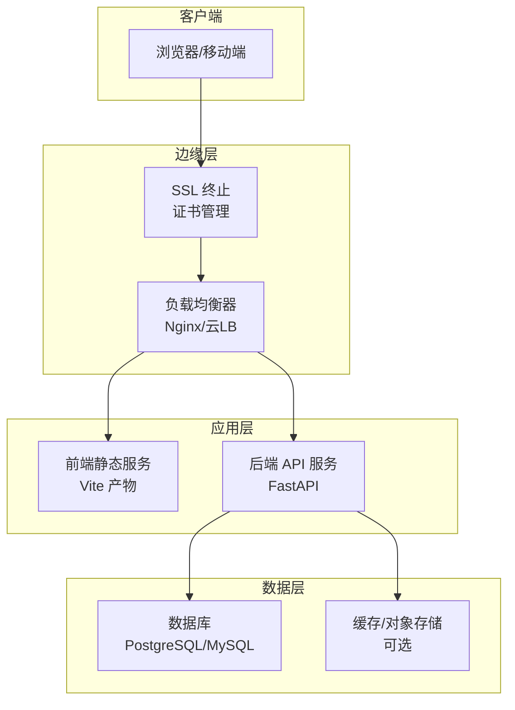
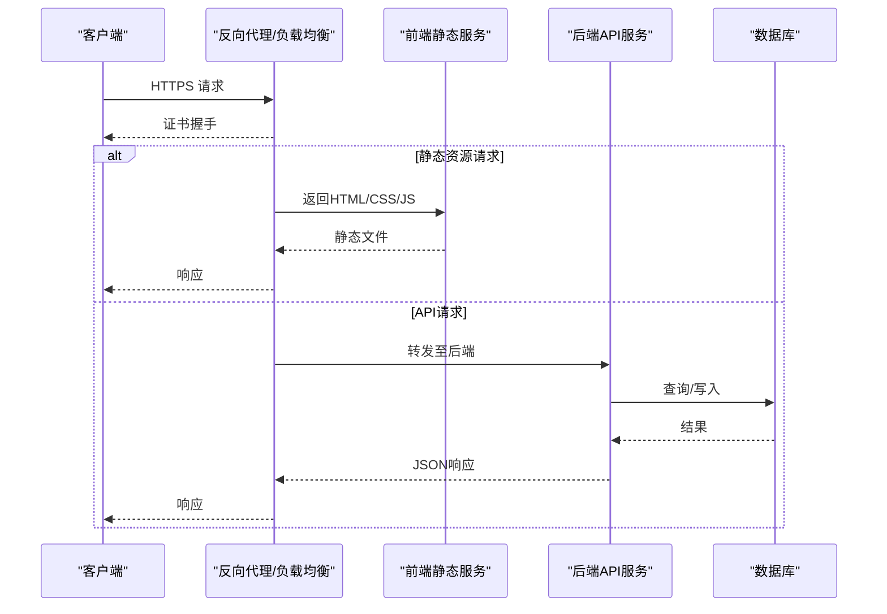
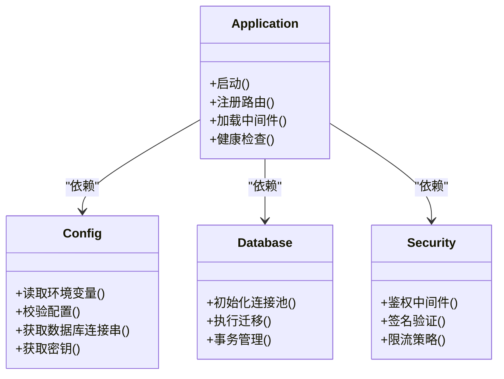
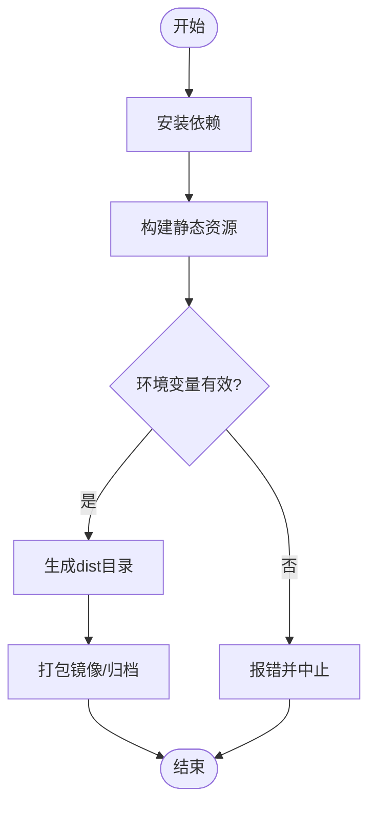
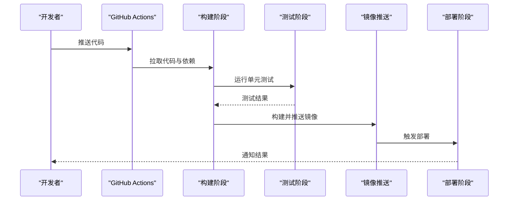
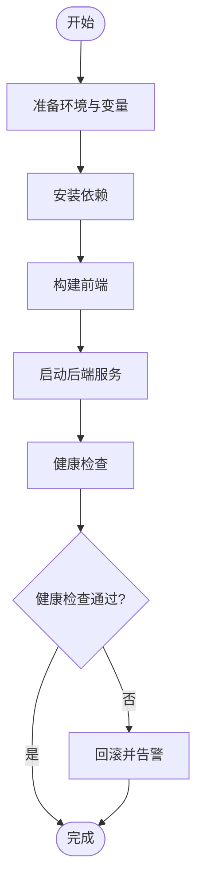
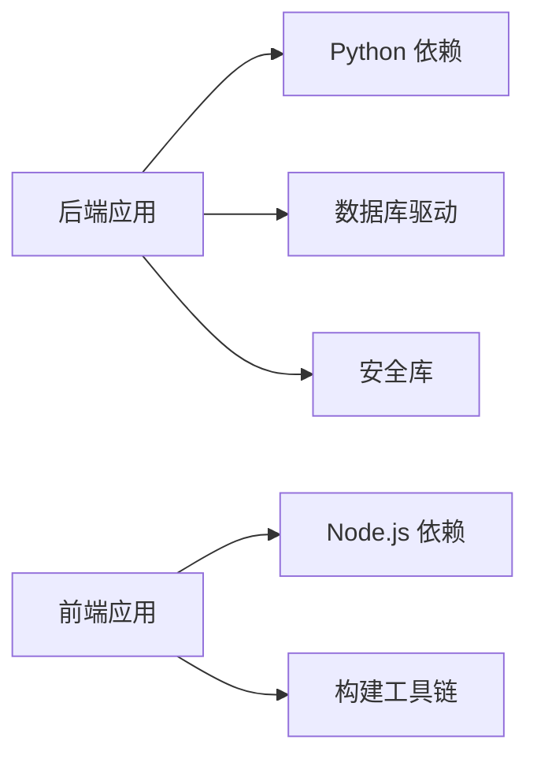

# 部署指南

<cite>
**本文引用的文件**   
- [backend/main.py](file://backend/main.py)
- [backend/config.py](file://backend/config.py)
- [backend/database.py](file://backend/database.py)
- [backend/security.py](file://backend/security.py)
- [backend/requirements.txt](file://backend/requirements.txt)
- [frontend/package.json](file://frontend/package.json)
- [frontend/vite.config.ts](file://frontend/vite.config.ts)
- [.github/workflows/deploy.yml](file://.github/workflows/deploy.yml)
- [deploy.sh](file://deploy.sh)
- [README.md](file://README.md)
</cite>

## 目录
1. [简介](#简介)
2. [项目结构](#项目结构)
3. [核心组件](#核心组件)
4. [架构总览](#架构总览)
5. [详细组件分析](#详细组件分析)
6. [依赖分析](#依赖分析)
7. [性能考虑](#性能考虑)
8. [故障排查指南](#故障排查指南)
9. [结论](#结论)
10. [附录](#附录)

## 简介
本指南面向开发、测试与生产环境的完整部署，覆盖容器化（Docker）、CI/CD 流水线、环境变量与域名绑定、反向代理与负载均衡、SSL 证书配置、监控日志、性能调优与安全加固，并提供故障排查与回滚策略。读者无需深入代码即可按步骤完成部署与运维。

## 项目结构
本项目采用前后端分离架构：
- 后端：Python FastAPI 应用，提供 REST API 与必要的业务逻辑。
- 前端：Vue 3 + Vite 构建的静态资源，由 Nginx 或反向代理提供服务。
- CI/CD：GitHub Actions 定义自动化部署流程。
- 部署脚本：一键部署脚本用于环境初始化与服务启动。

[本图为概念性架构图，不直接映射具体源码文件]

**章节来源**
- [README.md](file://README.md)

## 核心组件
- 后端服务（FastAPI）
  - 入口与路由组织：主应用初始化、路由注册、中间件配置。
  - 配置与环境变量：集中读取运行参数（端口、数据库连接、密钥等）。
  - 数据库连接：连接池、迁移与初始化。
  - 安全模块：鉴权、签名、加密等能力。
- 前端应用（Vue/Vite）
  - 构建产物为静态资源，通过反向代理暴露给外部访问。
  - 环境变量控制 API 基础路径与功能开关。
- CI/CD 流水线
  - 自动化构建、测试、镜像打包与发布。
- 部署脚本
  - 统一安装依赖、构建前端、拉起服务、健康检查。

**章节来源**
- [backend/main.py](file://backend/main.py)
- [backend/config.py](file://backend/config.py)
- [backend/database.py](file://backend/database.py)
- [backend/security.py](file://backend/security.py)
- [frontend/package.json](file://frontend/package.json)
- [frontend/vite.config.ts](file://frontend/vite.config.ts)
- [.github/workflows/deploy.yml](file://.github/workflows/deploy.yml)
- [deploy.sh](file://deploy.sh)

## 架构总览
下图展示从用户请求到后端处理与数据存储的端到端流程，以及反向代理与负载均衡的职责边界。

**图示来源**
- [backend/main.py](file://backend/main.py)
- [backend/config.py](file://backend/config.py)
- [frontend/vite.config.ts](file://frontend/vite.config.ts)
- [.github/workflows/deploy.yml](file://.github/workflows/deploy.yml)

**章节来源**
- [backend/main.py](file://backend/main.py)
- [frontend/vite.config.ts](file://frontend/vite.config.ts)

## 详细组件分析

### 后端服务（FastAPI）
- 应用入口与路由
  - 负责创建应用实例、注册路由、挂载中间件（如CORS、认证、限流等）。
  - 健康检查与版本信息接口建议暴露以便探针探测。
- 配置与环境变量
  - 集中读取环境变量（端口、数据库URL、JWT密钥、第三方服务凭据等）。
  - 支持多环境切换（开发/测试/生产），默认值与校验需完备。
- 数据库连接
  - 使用连接池与重试机制，确保高可用。
  - 提供迁移脚本与初始化任务，保证数据一致性。
- 安全模块
  - 鉴权与授权、输入校验、敏感信息脱敏、速率限制。
  - 建议启用HTTPS、严格CORS策略、最小权限原则。

**图示来源**
- [backend/main.py](file://backend/main.py)
- [backend/config.py](file://backend/config.py)
- [backend/database.py](file://backend/database.py)
- [backend/security.py](file://backend/security.py)

**章节来源**
- [backend/main.py](file://backend/main.py)
- [backend/config.py](file://backend/config.py)
- [backend/database.py](file://backend/database.py)
- [backend/security.py](file://backend/security.py)

### 前端应用（Vue + Vite）
- 构建与输出
  - 使用 Vite 构建静态资源，输出到指定目录供 Nginx 托管。
  - 环境变量控制 API 基础路径、功能开关与调试模式。
- 开发与生产差异
  - 开发环境启用热重载与代理转发；生产环境禁用调试并压缩资源。
- 部署集成
  - 在 CI 中执行构建，产物随镜像或包分发。

**图示来源**
- [frontend/package.json](file://frontend/package.json)
- [frontend/vite.config.ts](file://frontend/vite.config.ts)

**章节来源**
- [frontend/package.json](file://frontend/package.json)
- [frontend/vite.config.ts](file://frontend/vite.config.ts)

### CI/CD 流水线（GitHub Actions）
- 触发条件
  - 推送至主干或发布分支时自动触发。
- 阶段划分
  - 构建前端、运行测试、构建后端镜像、推送镜像仓库、部署到目标环境。
- 工件与缓存
  - 缓存依赖加速构建，保留构建产物便于回滚。
- 安全与审计
  - 使用密钥管理（Secrets），避免泄露敏感信息。

**图示来源**
- [.github/workflows/deploy.yml](file://.github/workflows/deploy.yml)

**章节来源**
- [.github/workflows/deploy.yml](file://.github/workflows/deploy.yml)

### 部署脚本
- 功能概览
  - 安装依赖、构建前端、准备配置文件、启动服务、健康检查。
- 环境适配
  - 支持不同环境变量的注入与校验。
- 回滚支持
  - 记录当前版本与上次版本，便于快速回滚。

**图示来源**
- [deploy.sh](file://deploy.sh)

**章节来源**
- [deploy.sh](file://deploy.sh)

## 依赖分析
- 后端依赖
  - Python 运行时与框架库，详见依赖清单。
- 前端依赖
  - Node.js 运行时与 Vue/Vite 生态库。
- 外部依赖
  - 数据库、缓存、对象存储、消息队列等（按需启用）。

**图示来源**
- [backend/requirements.txt](file://backend/requirements.txt)
- [frontend/package.json](file://frontend/package.json)

**章节来源**
- [backend/requirements.txt](file://backend/requirements.txt)
- [frontend/package.json](file://frontend/package.json)

## 性能考虑
- 反向代理与负载均衡
  - 启用连接复用、HTTP/2、Gzip/Brotli 压缩。
  - 合理设置超时、并发与线程数，避免雪崩。
- 后端优化
  - 数据库连接池大小与查询优化，索引与慢查询治理。
  - 缓存热点数据，减少重复计算与IO。
- 前端优化
  - 资源分包、懒加载、图片压缩与CDN缓存。
- 监控与可观测性
  - 指标采集（CPU/内存/请求延迟/错误率）、结构化日志、链路追踪。
- 容量规划
  - 基于压测确定副本数与资源配额，预留扩容空间。

[本节为通用指导，不直接分析具体文件]

## 故障排查指南
- 常见问题定位
  - 健康检查失败：检查端口监听、依赖服务可用性、环境变量。
  - 数据库连接异常：核对连接串、网络策略、账号权限。
  - 前端无法访问：确认静态资源路径、代理规则与缓存策略。
- 日志与指标
  - 收集应用日志、系统日志与代理日志，结合指标定位瓶颈。
- 回滚策略
  - 保持至少两个版本镜像，变更前备份配置与数据快照。
  - 灰度发布与蓝绿部署降低风险。
- 应急措施
  - 熔断与降级、限流保护、快速切流与隔离故障节点。

**章节来源**
- [backend/main.py](file://backend/main.py)
- [backend/config.py](file://backend/config.py)
- [backend/database.py](file://backend/database.py)
- [deploy.sh](file://deploy.sh)

## 结论
通过清晰的架构分层、完善的 CI/CD 流水线与标准化的部署脚本，可实现稳定高效的开发与生产交付。配合反向代理、负载均衡、SSL 与监控日志，能够保障系统的高可用与可观测性。遵循性能调优与安全加固建议，进一步提升系统的健壮性与安全性。

[本节为总结性内容，不直接分析具体文件]

## 附录

### 环境变量参考
- 后端
  - 服务端口、数据库连接串、密钥与令牌、第三方服务凭据、日志级别、特性开关。
- 前端
  - API 基础路径、功能开关、调试模式、埋点与监控配置。
- 部署
  - 镜像仓库地址、命名空间、标签策略、副本数与资源配额。

[本节为通用参考，不直接分析具体文件]

### 反向代理与负载均衡配置要点
- 协议与端口
  - 统一入口 HTTPS，内部 HTTP 通信。
- 路由规则
  - 静态资源与 API 分流，WebSocket 支持（如需）。
- 安全策略
  - CORS、CSRF、HSTS、IP 白名单、请求体大小限制。
- 高可用
  - 多副本与健康检查、故障转移与自动扩缩容。

[本节为通用指导，不直接分析具体文件]

### SSL 证书设置
- 证书来源
  - 自签、企业CA或公共CA（Let’s Encrypt）。
- 部署方式
  - 反向代理终止TLS，定期续期与自动更新。
- 最佳实践
  - 强密码套件、启用OCSP Stapling、证书透明度。

[本节为通用指导，不直接分析具体文件]

### 监控与日志
- 指标
  - 应用指标（QPS、延迟、错误率）、系统指标（CPU、内存、磁盘、网络）。
- 日志
  - 结构化JSON格式、分级输出、集中采集与检索。
- 告警
  - 阈值告警、异常检测、值班轮转与升级策略。

[本节为通用指导，不直接分析具体文件]

### 安全加固建议
- 最小权限
  - 服务账户与数据库账号最小权限原则。
- 输入校验
  - 严格类型校验、长度限制、SQL注入防护。
- 密钥管理
  - 使用密钥管理服务，避免硬编码。
- 网络安全
  - 内网隔离、防火墙策略、传输加密。

[本节为通用指导，不直接分析具体文件]

### 回滚策略
- 版本管理
  - 语义化版本、镜像标签与制品归档。
- 回滚步骤
  - 停止新版本、恢复旧版本镜像、验证健康与流量切换。
- 数据兼容
  - 向前兼容的迁移策略与数据备份。

[本节为通用指导，不直接分析具体文件]