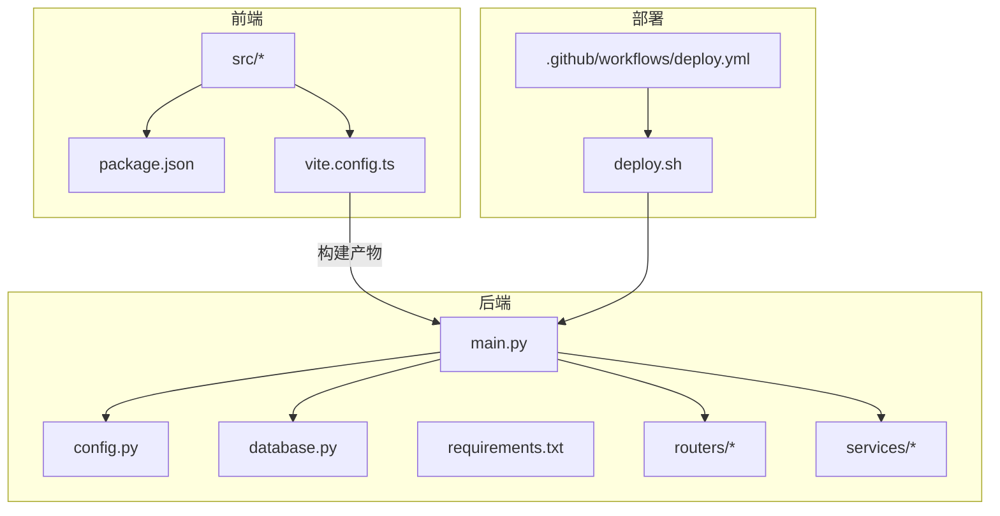
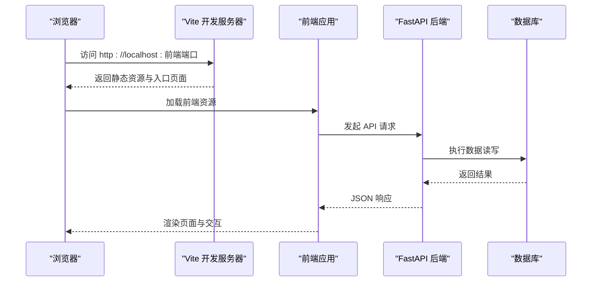
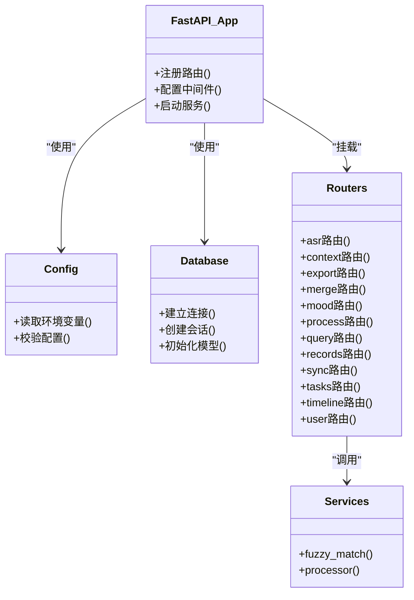
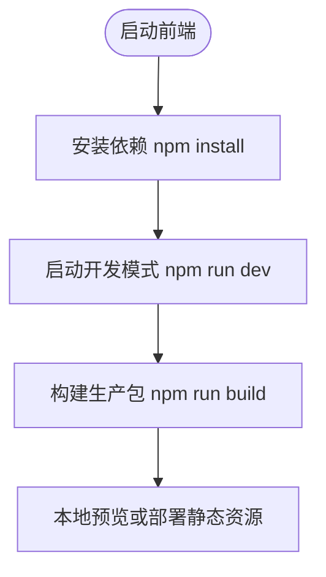
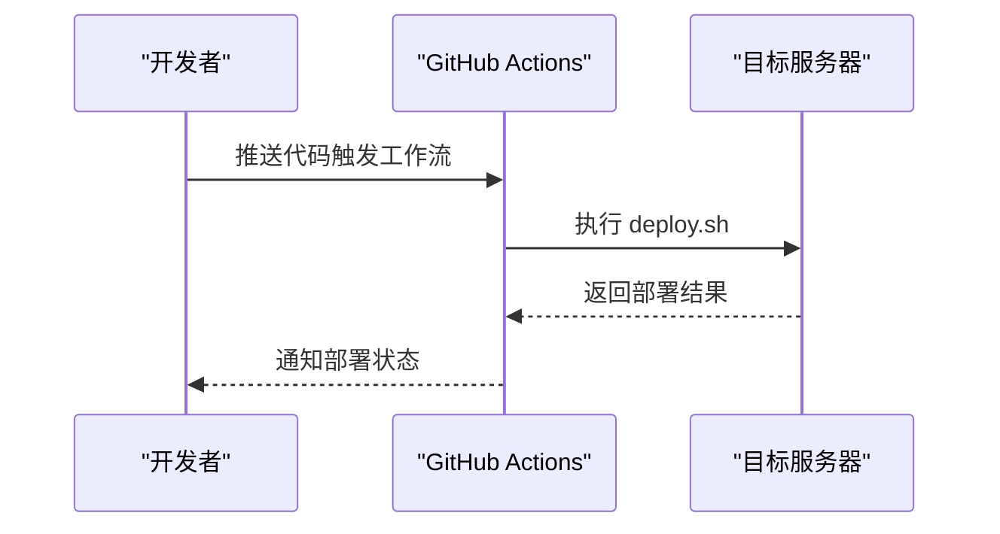
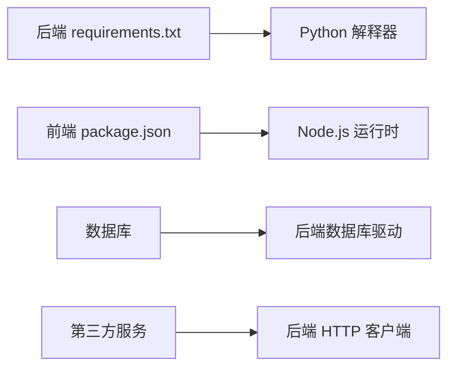

# 快速开始

<cite>
**本文引用的文件**   
- [README.md](file://README.md)
- [backend/main.py](file://backend/main.py)
- [backend/config.py](file://backend/config.py)
- [backend/database.py](file://backend/database.py)
- [backend/requirements.txt](file://backend/requirements.txt)
- [frontend/package.json](file://frontend/package.json)
- [frontend/vite.config.ts](file://frontend/vite.config.ts)
- [deploy.sh](file://deploy.sh)
- [.github/workflows/deploy.yml](file://.github/workflows/deploy.yml)
</cite>

## 目录
1. [简介](#简介)
2. [项目结构](#项目结构)
3. [核心组件](#核心组件)
4. [架构总览](#架构总览)
5. [详细组件分析](#详细组件分析)
6. [依赖关系分析](#依赖关系分析)
7. [性能注意事项](#性能注意事项)
8. [故障排除指南](#故障排除指南)
9. [结论](#结论)
10. [附录](#附录)

## 简介
本快速开始指南旨在帮助你在最短时间内成功运行 AdventureX 的前后端服务，完成数据库初始化并体验核心功能。内容涵盖：
- 环境准备与依赖安装（前后端）
- 数据库初始化与服务启动流程
- 基本使用演示
- 常见问题与排错建议
- 开发环境与生产环境的差异化配置说明

## 项目结构
AdventureX 采用前后端分离的架构：
- 后端：Python + FastAPI，提供 REST API、任务处理、ASR 集成、导出等功能
- 前端：Vue 3 + Vite，提供仪表盘、时间线、任务管理、查询对话等界面
- 部署：Shell 脚本与 GitHub Actions 工作流支持自动化部署

图表来源
- [frontend/package.json](file://frontend/package.json)
- [frontend/vite.config.ts](file://frontend/vite.config.ts)
- [backend/main.py](file://backend/main.py)
- [backend/config.py](file://backend/config.py)
- [backend/database.py](file://backend/database.py)
- [backend/requirements.txt](file://backend/requirements.txt)
- [deploy.sh](file://deploy.sh)
- [.github/workflows/deploy.yml](file://.github/workflows/deploy.yml)

章节来源
- [README.md](file://README.md)

## 核心组件
- 后端入口与路由：FastAPI 应用入口集中定义路由与服务挂载点
- 配置与环境变量：统一读取环境变量与配置文件，支撑多环境差异
- 数据库连接：封装连接池、模型映射与迁移/初始化逻辑
- 业务服务：包含模糊匹配、数据处理等通用能力
- 前端工程：Vite 构建、TypeScript 配置、路由与视图组件

章节来源
- [backend/main.py](file://backend/main.py)
- [backend/config.py](file://backend/config.py)
- [backend/database.py](file://backend/database.py)
- [backend/requirements.txt](file://backend/requirements.txt)
- [frontend/package.json](file://frontend/package.json)
- [frontend/vite.config.ts](file://frontend/vite.config.ts)

## 架构总览
下图展示了从浏览器到后端的请求链路，以及关键模块之间的交互关系。

图表来源
- [frontend/vite.config.ts](file://frontend/vite.config.ts)
- [backend/main.py](file://backend/main.py)
- [backend/database.py](file://backend/database.py)

## 详细组件分析

### 后端服务（FastAPI）
- 应用入口：负责注册路由、中间件、跨域、错误处理等
- 配置层：通过环境变量注入数据库连接串、密钥、第三方服务地址等
- 数据库层：封装连接、会话、模型定义与初始化脚本调用
- 路由层：按功能划分 ASR、上下文、导出、合并、情绪、处理、查询、记录、同步、任务、时间线、用户等
- 服务层：提供模糊匹配、数据处理等可复用能力

图表来源
- [backend/main.py](file://backend/main.py)
- [backend/config.py](file://backend/config.py)
- [backend/database.py](file://backend/database.py)
- [backend/routers/asr.py](file://backend/routers/asr.py)
- [backend/routers/context.py](file://backend/routers/context.py)
- [backend/routers/export.py](file://backend/routers/export.py)
- [backend/routers/merge.py](file://backend/routers/merge.py)
- [backend/routers/mood.py](file://backend/routers/mood.py)
- [backend/routers/process.py](file://backend/routers/process.py)
- [backend/routers/query.py](file://backend/routers/query.py)
- [backend/routers/records.py](file://backend/routers/records.py)
- [backend/routers/sync.py](file://backend/routers/sync.py)
- [backend/routers/tasks.py](file://backend/routers/tasks.py)
- [backend/routers/timeline.py](file://backend/routers/timeline.py)
- [backend/routers/user.py](file://backend/routers/user.py)
- [backend/services/fuzzy_match.py](file://backend/services/fuzzy_match.py)
- [backend/services/processor.py](file://backend/services/processor.py)

章节来源
- [backend/main.py](file://backend/main.py)
- [backend/config.py](file://backend/config.py)
- [backend/database.py](file://backend/database.py)
- [backend/requirements.txt](file://backend/requirements.txt)

### 前端应用（Vue 3 + Vite）
- 构建与开发：Vite 提供热更新、类型检查、代理配置
- 路由与视图：Dashboard、Home、Query、Tasks、Timeline 等页面
- 国际化：中英文切换
- API 客户端：统一封装后端接口调用

图表来源
- [frontend/package.json](file://frontend/package.json)
- [frontend/vite.config.ts](file://frontend/vite.config.ts)

章节来源
- [frontend/package.json](file://frontend/package.json)
- [frontend/vite.config.ts](file://frontend/vite.config.ts)

### 部署与自动化
- Shell 脚本：一键打包、上传、重启服务
- GitHub Actions：CI/CD 流水线，自动构建与发布

图表来源
- [.github/workflows/deploy.yml](file://.github/workflows/deploy.yml)
- [deploy.sh](file://deploy.sh)

章节来源
- [.github/workflows/deploy.yml](file://.github/workflows/deploy.yml)
- [deploy.sh](file://deploy.sh)

## 依赖关系分析
- 后端依赖：由 requirements.txt 声明 Python 包版本，确保环境一致性
- 前端依赖：由 package.json 声明 Node.js 包版本，配合 Vite 与 Vue 生态
- 运行时依赖：数据库驱动、HTTP 客户端、加密库等

图表来源
- [backend/requirements.txt](file://backend/requirements.txt)
- [frontend/package.json](file://frontend/package.json)

章节来源
- [backend/requirements.txt](file://backend/requirements.txt)
- [frontend/package.json](file://frontend/package.json)

## 性能注意事项
- 数据库连接池：合理设置连接数与超时，避免连接耗尽
- 异步 I/O：后端使用异步框架提升并发处理能力
- 前端资源优化：启用压缩、懒加载与缓存策略
- 日志与监控：在生产环境开启结构化日志与指标采集

[本节为通用指导，不直接分析具体文件]

## 故障排除指南
- 端口冲突
  - 现象：启动失败或无法访问
  - 排查：确认前后端端口未被占用，必要时修改配置
- 数据库连接失败
  - 现象：后端启动时报连接错误
  - 排查：检查数据库地址、用户名、密码、网络连通性与权限
- 环境变量缺失
  - 现象：部分功能不可用或报错
  - 排查：核对 .env 或系统环境变量是否完整
- 前端代理问题
  - 现象：API 请求 404 或跨域错误
  - 排查：检查 Vite 代理配置与后端路径前缀
- 依赖安装失败
  - 现象：npm install 或 pip install 报错
  - 排查：更换镜像源、清理缓存、检查 Node/Python 版本

章节来源
- [backend/config.py](file://backend/config.py)
- [backend/database.py](file://backend/database.py)
- [frontend/vite.config.ts](file://frontend/vite.config.ts)

## 结论
通过以上步骤，你可以在本地快速搭建并运行 AdventureX 的前后端服务，完成基础的数据录入、查询与可视化操作。建议在熟悉开发环境后再切换到生产环境进行部署与调优。

[本节为总结性内容，不直接分析具体文件]

## 附录

### 环境准备
- 后端
  - 安装 Python 与虚拟环境
  - 安装依赖：参考 requirements.txt
  - 配置环境变量：数据库连接串、密钥、第三方服务地址等
- 前端
  - 安装 Node.js
  - 安装依赖：参考 package.json
  - 配置代理与构建参数：参考 vite.config.ts

章节来源
- [backend/requirements.txt](file://backend/requirements.txt)
- [frontend/package.json](file://frontend/package.json)
- [frontend/vite.config.ts](file://frontend/vite.config.ts)

### 数据库初始化
- 创建数据库与用户
- 执行迁移或初始化脚本（如存在）
- 验证连接与表结构

章节来源
- [backend/database.py](file://backend/database.py)

### 服务启动流程
- 后端
  - 进入 backend 目录
  - 激活虚拟环境
  - 启动服务（默认监听端口）
- 前端
  - 进入 frontend 目录
  - 启动开发服务器（默认监听端口）
  - 打开浏览器访问前端地址

章节来源
- [backend/main.py](file://backend/main.py)
- [frontend/package.json](file://frontend/package.json)
- [frontend/vite.config.ts](file://frontend/vite.config.ts)

### 基本使用演示
- 登录与仪表盘：查看概览统计与最近活动
- 记录输入：新增文本或语音记录，查看时间线
- 查询对话：通过自然语言检索历史数据
- 任务管理：创建、分配与跟踪任务进度
- 导出功能：将数据导出为常用格式

[本节为概念性说明，不直接分析具体文件]

### 开发与生产环境差异
- 环境变量
  - 开发：调试开关、详细日志、本地数据库
  - 生产：关闭调试、精简日志、远程数据库与缓存
- 构建与部署
  - 开发：Vite 热更新、内联代理
  - 生产：静态资源构建、反向代理与 HTTPS
- 安全与权限
  - 开发：宽松策略便于调试
  - 生产：严格鉴权、最小权限原则

章节来源
- [backend/config.py](file://backend/config.py)
- [frontend/vite.config.ts](file://frontend/vite.config.ts)
- [deploy.sh](file://deploy.sh)
- [.github/workflows/deploy.yml](file://.github/workflows/deploy.yml)