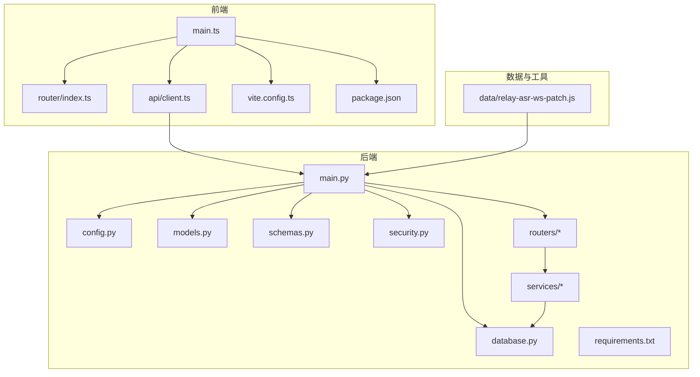
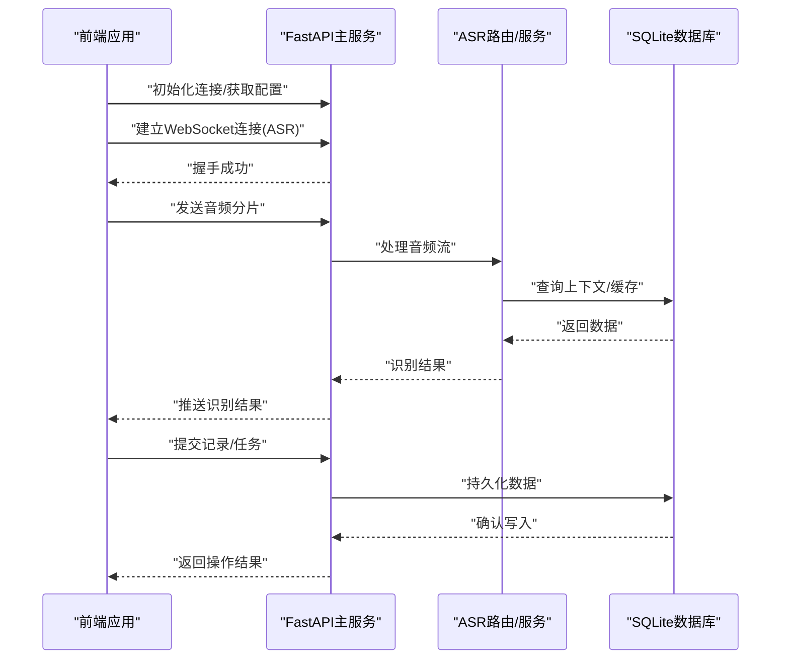
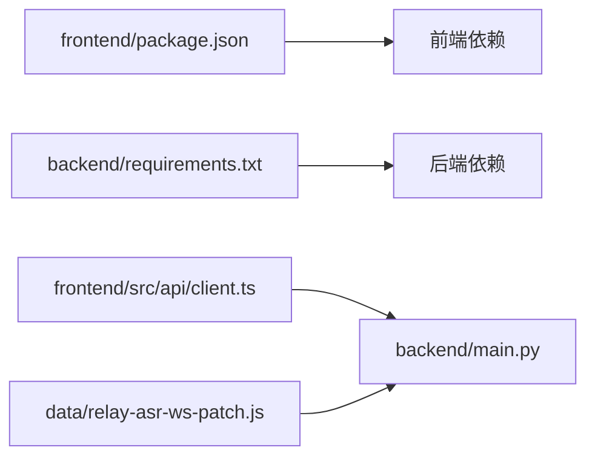

# 技术栈

<cite>
**本文引用的文件**   
- [backend/main.py](file://backend/main.py)
- [backend/config.py](file://backend/config.py)
- [backend/database.py](file://backend/database.py)
- [backend/models.py](file://backend/models.py)
- [backend/schemas.py](file://backend/schemas.py)
- [backend/security.py](file://backend/security.py)
- [backend/routers/asr.py](file://backend/routers/asr.py)
- [backend/routers/context.py](file://backend/routers/context.py)
- [backend/routers/export.py](file://backend/routers/export.py)
- [backend/routers/merge.py](file://backend/routers/merge.py)
- [backend/routers/mood.py](file://backend/routers/mood.py)
- [backend/routers/process.py](file://backend/routers/process.py)
- [backend/routers/query.py](file://backend/routers/query.py)
- [backend/routers/records.py](file://backend/routers/records.py)
- [backend/routers/sync.py](file://backend/routers/sync.py)
- [backend/routers/tasks.py](file://backend/routers/tasks.py)
- [backend/routers/timeline.py](file://backend/routers/timeline.py)
- [backend/routers/user.py](file://backend/routers/user.py)
- [backend/services/fuzzy_match.py](file://backend/services/fuzzy_match.py)
- [backend/services/processor.py](file://backend/services/processor.py)
- [backend/requirements.txt](file://backend/requirements.txt)
- [frontend/package.json](file://frontend/package.json)
- [frontend/vite.config.ts](file://frontend/vite.config.ts)
- [frontend/src/main.ts](file://frontend/src/main.ts)
- [frontend/src/api/client.ts](file://frontend/src/api/client.ts)
- [frontend/src/router/index.ts](file://frontend/src/router/index.ts)
- [data/relay-asr-ws-patch.js](file://data/relay-asr-ws-patch.js)
</cite>

## 目录
1. [简介](#简介)
2. [项目结构](#项目结构)
3. [核心组件](#核心组件)
4. [架构总览](#架构总览)
5. [详细组件分析](#详细组件分析)
6. [依赖分析](#依赖分析)
7. [性能考量](#性能考量)
8. [故障排查指南](#故障排查指南)
9. [结论](#结论)
10. [附录](#附录)

## 简介
本技术栈文档面向AdventureX项目的开发者与维护者，系统阐述前后端技术选型与架构决策。前端采用Vue 3 + TypeScript + Vite，后端采用FastAPI + Python，数据库使用SQLite，实时通信通过WebSocket实现，语音识别（ASR）集成由后端服务提供并通过WebSocket转发。文档同时给出各技术版本要求、兼容性说明以及开发环境搭建所需的技术依赖，帮助读者快速理解并上手本项目。

## 项目结构
项目采用前后端分离的目录组织方式：
- backend：基于FastAPI的后端服务，包含路由、数据模型、数据库访问、安全与配置等模块。
- frontend：基于Vue 3 + TypeScript + Vite的前端应用，包含页面、组件、国际化、路由与API客户端等。
- data：存放与实时通信相关的补丁脚本，如WebSocket转发的辅助脚本。

图表来源
- [frontend/src/main.ts](file://frontend/src/main.ts)
- [frontend/src/router/index.ts](file://frontend/src/router/index.ts)
- [frontend/src/api/client.ts](file://frontend/src/api/client.ts)
- [frontend/vite.config.ts](file://frontend/vite.config.ts)
- [frontend/package.json](file://frontend/package.json)
- [backend/main.py](file://backend/main.py)
- [backend/config.py](file://backend/config.py)
- [backend/database.py](file://backend/database.py)
- [backend/models.py](file://backend/models.py)
- [backend/schemas.py](file://backend/schemas.py)
- [backend/security.py](file://backend/security.py)
- [backend/routers/asr.py](file://backend/routers/asr.py)
- [backend/services/fuzzy_match.py](file://backend/services/fuzzy_match.py)
- [backend/services/processor.py](file://backend/services/processor.py)
- [backend/requirements.txt](file://backend/requirements.txt)
- [data/relay-asr-ws-patch.js](file://data/relay-asr-ws-patch.js)

章节来源
- [frontend/package.json](file://frontend/package.json)
- [frontend/vite.config.ts](file://frontend/vite.config.ts)
- [backend/main.py](file://backend/main.py)
- [backend/requirements.txt](file://backend/requirements.txt)

## 核心组件
- 前端技术栈
  - Vue 3：作为UI框架，提供响应式数据绑定与组合式API，提升开发效率与可维护性。
  - TypeScript：为前端代码提供静态类型检查，降低运行时错误风险，增强IDE支持。
  - Vite：现代构建工具，具备极速冷启动与热更新能力，优化开发体验与打包产物体积。
- 后端技术栈
  - FastAPI：高性能异步Web框架，自动生成交互式API文档，便于前后端联调与测试。
  - Python：生态丰富，便于集成AI/ASR相关库与服务。
- 数据库方案
  - SQLite：轻量级嵌入式数据库，适合单机部署与原型验证，零配置、易迁移。
- 实时通信
  - WebSocket：用于低延迟双向通信，支撑语音流传输与实时反馈。
- 语音识别（ASR）集成
  - 后端提供ASR相关路由与服务，结合WebSocket进行音频流转发与识别结果推送。

章节来源
- [frontend/package.json](file://frontend/package.json)
- [frontend/vite.config.ts](file://frontend/vite.config.ts)
- [backend/main.py](file://backend/main.py)
- [backend/requirements.txt](file://backend/requirements.txt)
- [backend/database.py](file://backend/database.py)
- [backend/routers/asr.py](file://backend/routers/asr.py)

## 架构总览
整体架构遵循前后端分离原则，前端通过HTTP与WebSocket与后端交互；后端以FastAPI为核心，按功能划分路由层与服务层，数据持久化通过SQLite完成。ASR流程中，前端通过WebSocket将音频片段发送至后端，后端调用ASR服务进行处理并将识别结果回推至前端。

图表来源
- [backend/main.py](file://backend/main.py)
- [backend/routers/asr.py](file://backend/routers/asr.py)
- [backend/database.py](file://backend/database.py)
- [frontend/src/api/client.ts](file://frontend/src/api/client.ts)

## 详细组件分析

### 前端技术栈（Vue 3 + TypeScript + Vite）
- Vue 3
  - 优势：组合式API、更好的TypeScript支持、更优的性能与包体控制。
  - 适用场景：单页应用、复杂交互界面、组件化开发。
- TypeScript
  - 优势：编译期类型检查、接口契约明确、重构更安全。
  - 适用场景：大型前端工程、团队协作、长期维护。
- Vite
  - 优势：ESM原生支持、按需加载、极快的HMR与构建速度。
  - 适用场景：现代前端工程、微前端、插件生态。

章节来源
- [frontend/package.json](file://frontend/package.json)
- [frontend/vite.config.ts](file://frontend/vite.config.ts)
- [frontend/src/main.ts](file://frontend/src/main.ts)

### 后端技术栈（FastAPI + Python）
- FastAPI
  - 优势：异步高并发、自动OpenAPI/Swagger文档、Pydantic数据校验。
  - 适用场景：RESTful API、WebSocket服务、微服务。
- Python
  - 优势：丰富的第三方库、易于集成AI/ASR、快速原型开发。
  - 适用场景：数据处理、机器学习、自动化脚本。

章节来源
- [backend/main.py](file://backend/main.py)
- [backend/requirements.txt](file://backend/requirements.txt)

### 数据库方案（SQLite）
- 优势：零配置、单文件存储、跨平台、适合开发与小型生产环境。
- 注意事项：并发写入受限，需合理设计事务与锁策略。

章节来源
- [backend/database.py](file://backend/database.py)
- [backend/models.py](file://backend/models.py)

### 实时通信（WebSocket）
- 用途：音频流传输、实时识别结果推送、状态同步。
- 关键点：连接生命周期管理、消息协议定义、错误重试与断线重连。

章节来源
- [backend/routers/asr.py](file://backend/routers/asr.py)
- [data/relay-asr-ws-patch.js](file://data/relay-asr-ws-patch.js)
- [frontend/src/api/client.ts](file://frontend/src/api/client.ts)

### 语音识别集成（ASR）
- 后端路由与服务负责接收音频流、调用ASR引擎、返回文本结果。
- 与上下文、任务、时间线等业务模块协同，形成完整的记录与分析闭环。

章节来源
- [backend/routers/asr.py](file://backend/routers/asr.py)
- [backend/services/processor.py](file://backend/services/processor.py)
- [backend/routers/context.py](file://backend/routers/context.py)
- [backend/routers/tasks.py](file://backend/routers/tasks.py)
- [backend/routers/timeline.py](file://backend/routers/timeline.py)

## 依赖分析
- 前端依赖
  - Vue 3、TypeScript、Vite及其插件生态。
  - 网络请求与WebSocket客户端封装。
- 后端依赖
  - FastAPI、Uvicorn（或类似ASGI服务器）、Pydantic、SQLAlchemy（若使用ORM）。
  - ASR相关库（根据实际实现引入）。
- 数据与工具
  - WebSocket转发脚本用于调试或代理场景。

图表来源
- [frontend/package.json](file://frontend/package.json)
- [backend/requirements.txt](file://backend/requirements.txt)
- [frontend/src/api/client.ts](file://frontend/src/api/client.ts)
- [backend/main.py](file://backend/main.py)
- [data/relay-asr-ws-patch.js](file://data/relay-asr-ws-patch.js)

章节来源
- [frontend/package.json](file://frontend/package.json)
- [backend/requirements.txt](file://backend/requirements.txt)

## 性能考量
- 前端
  - 利用Vite的按需加载与Tree Shaking减少包体。
  - 组件懒加载与路由懒加载提升首屏性能。
- 后端
  - 使用FastAPI的异步特性提高I/O吞吐。
  - 合理设计数据库事务与索引，避免锁竞争。
- 实时通信
  - 音频分片大小与频率需权衡延迟与带宽。
  - 断线重连与消息去重机制保障稳定性。

[本节为通用指导，不直接分析具体文件]

## 故障排查指南
- 前端常见问题
  - 构建失败：检查Node版本与依赖安装是否完整。
  - 路由跳转异常：确认路由配置与权限守卫。
  - WebSocket连接失败：检查后端端口、CORS与证书配置。
- 后端常见问题
  - 启动失败：检查Python版本、依赖安装与环境变量。
  - 数据库问题：确认SQLite文件路径与权限。
  - ASR服务不可用：检查外部服务地址与超时设置。
- 实时通信问题
  - 音频流卡顿：调整分片大小与网络质量。
  - 消息丢失：增加重传与确认机制。

章节来源
- [backend/main.py](file://backend/main.py)
- [backend/database.py](file://backend/database.py)
- [backend/routers/asr.py](file://backend/routers/asr.py)
- [frontend/src/api/client.ts](file://frontend/src/api/client.ts)

## 结论
AdventureX采用成熟且高效的技术栈：前端Vue 3 + TypeScript + Vite保证开发体验与运行性能；后端FastAPI + Python提供高并发API与便捷的AI集成能力；SQLite简化部署与运维；WebSocket支撑实时交互；ASR集成打通语音到文本的关键链路。该架构在可扩展性、可维护性与开发效率之间取得良好平衡，适合持续迭代与规模化扩展。

[本节为总结性内容，不直接分析具体文件]

## 附录
- 版本与兼容性建议
  - Node.js：建议使用LTS版本（如18.x或20.x），确保与Vite与TypeScript兼容。
  - Python：建议使用3.10+，满足FastAPI与多数AI库的最低要求。
  - SQLite：随Python发行版内置，无需额外安装。
- 开发环境搭建
  - 前端
    - 安装Node.js LTS。
    - 进入frontend目录执行依赖安装与本地启动。
  - 后端
    - 安装Python 3.10+。
    - 进入backend目录创建虚拟环境并安装依赖。
    - 启动ASGI服务器并监听指定端口。
  - 实时通信
    - 如需代理或调试，可使用data目录下的WebSocket转发脚本。

章节来源
- [frontend/package.json](file://frontend/package.json)
- [frontend/vite.config.ts](file://frontend/vite.config.ts)
- [backend/requirements.txt](file://backend/requirements.txt)
- [data/relay-asr-ws-patch.js](file://data/relay-asr-ws-patch.js)