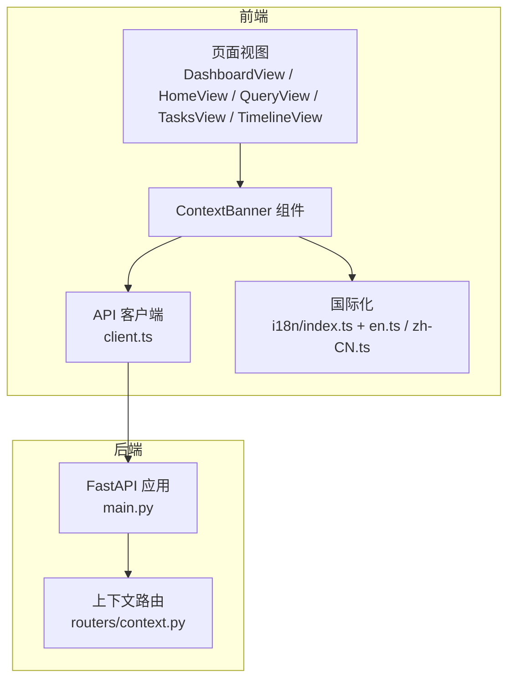
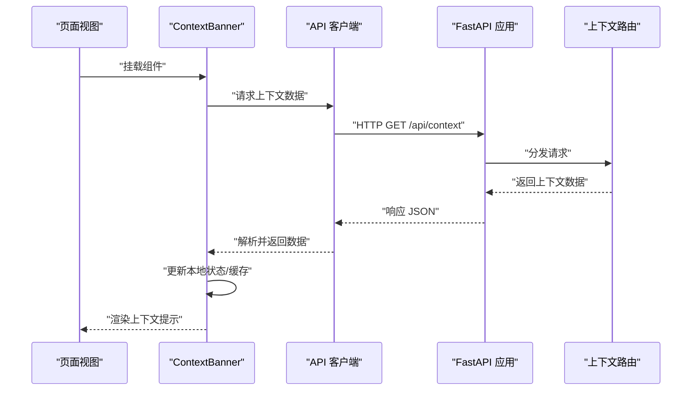
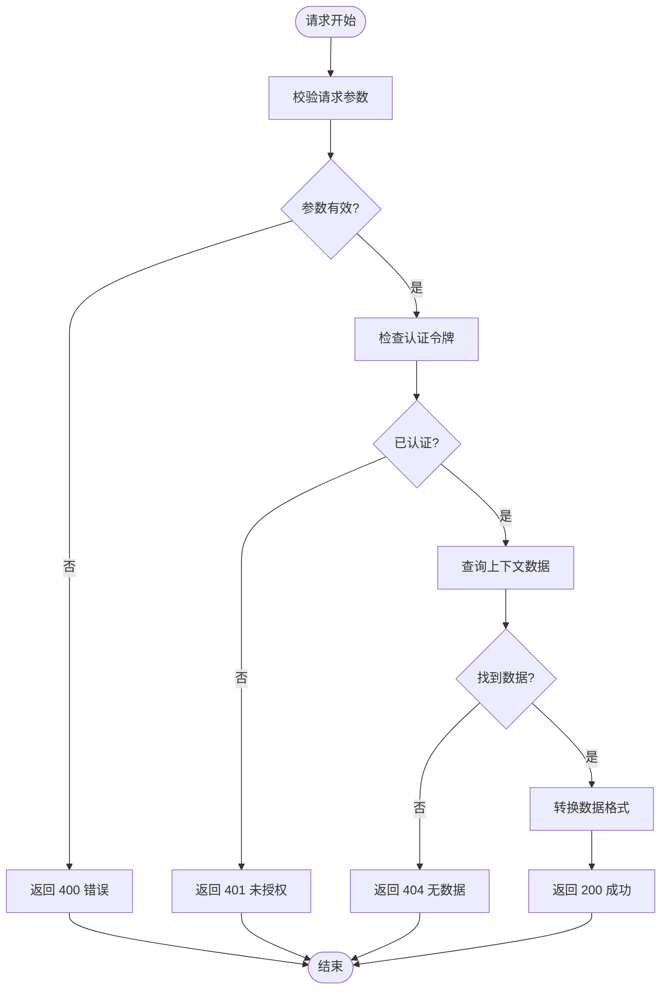
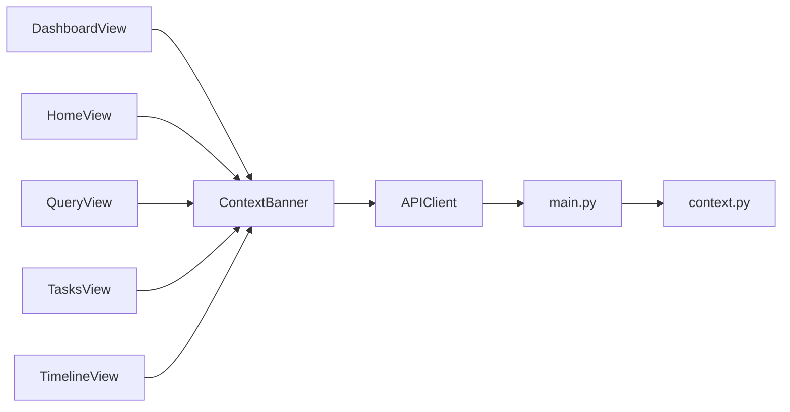

# 上下文提示

<cite>
**本文引用的文件**   
- [ContextBanner.vue](file://frontend/src/components/ContextBanner.vue)
- [client.ts](file://frontend/src/api/client.ts)
- [context.py](file://backend/routers/context.py)
- [main.py](file://backend/main.py)
- [DashboardView.vue](file://frontend/src/views/DashboardView.vue)
- [HomeView.vue](file://frontend/src/views/HomeView.vue)
- [QueryView.vue](file://frontend/src/views/QueryView.vue)
- [TasksView.vue](file://frontend/src/views/TasksView.vue)
- [TimelineView.vue](file://frontend/src/views/TimelineView.vue)
- [i18n/index.ts](file://frontend/src/i18n/index.ts)
- [en.ts](file://frontend/src/i18n/locales/en.ts)
- [zh-CN.ts](file://frontend/src/i18n/locales/zh-CN.ts)
</cite>

## 目录
1. [简介](#简介)
2. [项目结构](#项目结构)
3. [核心组件](#核心组件)
4. [架构总览](#架构总览)
5. [详细组件分析](#详细组件分析)
6. [依赖关系分析](#依赖关系分析)
7. [性能考虑](#性能考虑)
8. [故障排查指南](#故障排查指南)
9. [结论](#结论)
10. [附录](#附录)

## 简介
本文件为 AdventureX 项目的“上下文提示”功能提供系统化文档，重点围绕 ContextBanner 组件的设计模式、显示逻辑与用户交互行为；说明上下文信息的获取机制、缓存策略与更新触发条件；文档化上下文 API 接口的使用方法（参数配置、返回数据结构、错误处理）；解释上下文与用户状态、会话管理的关联关系；并提供上下文内容的自定义配置、样式主题、国际化支持等能力说明。最后给出性能优化、内存管理与用户体验改进的最佳实践建议。

## 项目结构
与上下文提示相关的前后端代码分布如下：
- 前端
  - 组件层：ContextBanner.vue 负责展示上下文提示卡片，封装显示逻辑、交互与本地状态管理。
  - 视图层：DashboardView、HomeView、QueryView、TasksView、TimelineView 等页面按需引入并渲染 ContextBanner。
  - API 层：client.ts 封装 HTTP 请求，调用后端上下文接口。
  - 国际化：i18n/index.ts 与 locales/en.ts、locales/zh-CN.ts 提供多语言文案。
- 后端
  - 路由层：routers/context.py 暴露上下文数据接口。
  - 应用入口：main.py 注册路由与中间件。



图表来源
- [ContextBanner.vue](file://frontend/src/components/ContextBanner.vue)
- [client.ts](file://frontend/src/api/client.ts)
- [context.py](file://backend/routers/context.py)
- [main.py](file://backend/main.py)
- [DashboardView.vue](file://frontend/src/views/DashboardView.vue)
- [HomeView.vue](file://frontend/src/views/HomeView.vue)
- [QueryView.vue](file://frontend/src/views/QueryView.vue)
- [TasksView.vue](file://frontend/src/views/TasksView.vue)
- [TimelineView.vue](file://frontend/src/views/TimelineView.vue)
- [i18n/index.ts](file://frontend/src/i18n/index.ts)
- [en.ts](file://frontend/src/i18n/locales/en.ts)
- [zh-CN.ts](file://frontend/src/i18n/locales/zh-CN.ts)

章节来源
- [ContextBanner.vue](file://frontend/src/components/ContextBanner.vue)
- [client.ts](file://frontend/src/api/client.ts)
- [context.py](file://backend/routers/context.py)
- [main.py](file://backend/main.py)
- [DashboardView.vue](file://frontend/src/views/DashboardView.vue)
- [HomeView.vue](file://frontend/src/views/HomeView.vue)
- [QueryView.vue](file://frontend/src/views/QueryView.vue)
- [TasksView.vue](file://frontend/src/views/TasksView.vue)
- [TimelineView.vue](file://frontend/src/views/TimelineView.vue)
- [i18n/index.ts](file://frontend/src/i18n/index.ts)
- [en.ts](file://frontend/src/i18n/locales/en.ts)
- [zh-CN.ts](file://frontend/src/i18n/locales/zh-CN.ts)

## 核心组件
- ContextBanner 组件职责
  - 展示当前上下文摘要信息（如时间、地点、任务、情绪等），支持折叠/展开、关闭、刷新等操作。
  - 维护本地显示状态（可见性、加载态、错误态）、缓存上下文数据、控制刷新频率。
  - 通过 API 客户端向后端请求上下文数据，并在失败时降级展示或提示重试。
  - 使用 i18n 文案进行多语言切换，确保界面文本可本地化。
- 设计模式
  - 组合式组件：将数据获取、状态管理、UI 展示解耦，便于复用与测试。
  - 观察者模式：监听用户操作（点击、滚动、窗口尺寸变化）触发局部更新。
  - 策略模式：根据用户偏好或系统设置选择不同展示策略（如精简/详细模式）。
- 显示逻辑
  - 首次进入页面时自动拉取上下文数据，若网络不可用则回退到空态或上次缓存。
  - 支持手动刷新按钮与定时轮询（可选），避免频繁请求导致性能问题。
  - 当上下文内容过长时，默认折叠显示关键摘要，用户点击后展开详情。
- 用户交互行为
  - 点击“刷新”重新拉取数据，成功则替换旧数据并重置错误态。
  - 点击“关闭”隐藏横幅，记录用户偏好至本地存储，下次进入按偏好显示。
  - 支持键盘快捷键（如 Esc 关闭、R 刷新），提升无障碍体验。

章节来源
- [ContextBanner.vue](file://frontend/src/components/ContextBanner.vue)
- [client.ts](file://frontend/src/api/client.ts)
- [i18n/index.ts](file://frontend/src/i18n/index.ts)
- [en.ts](file://frontend/src/i18n/locales/en.ts)
- [zh-CN.ts](file://frontend/src/i18n/locales/zh-CN.ts)

## 架构总览
上下文提示的数据流从页面视图到组件，再到 API 客户端与后端路由，最终返回结构化数据供组件渲染。



图表来源
- [ContextBanner.vue](file://frontend/src/components/ContextBanner.vue)
- [client.ts](file://frontend/src/api/client.ts)
- [context.py](file://backend/routers/context.py)
- [main.py](file://backend/main.py)

## 详细组件分析

### ContextBanner 组件分析
- 组件结构与职责
  - 模板部分：包含标题、摘要、详情、操作按钮（刷新、关闭）、加载与错误提示。
  - 脚本部分：定义 props、emits、响应式状态、计算属性与方法。
  - 样式部分：支持主题变量与响应式布局。
- 关键方法与状态
  - fetchContext：发起请求获取上下文数据，处理成功与失败分支。
  - refresh：触发刷新，带防抖与节流策略。
  - toggleVisibility：切换显示/隐藏，并持久化用户偏好。
  - updateCache：更新本地缓存，避免重复请求。
- 错误处理
  - 网络异常：显示友好提示，提供重试入口。
  - 数据格式异常：降级展示或清空无效字段。
  - 权限不足：引导用户登录或授权。
- 性能优化
  - 使用 v-if/v-show 控制渲染时机，减少不必要的 DOM 操作。
  - 对长列表内容进行虚拟滚动（可选）。
  - 防抖/节流刷新与懒加载详情内容。

```mermaid
classDiagram
class ContextBanner {
+props : ["show", "mode", "locale"]
+emits : ["update : show", "refresh", "close"]
+state : {"visible", "loading", "error", "data"}
+methods : {"fetchContext", "refresh", "toggleVisibility", "updateCache"}
+computed : {"displayText", "isDetailVisible"}
}
class APIClient {
+methods : {"get", "post", "request"}
}
class I18n {
+methods : {"t", "setLocale"}
}
ContextBanner --> APIClient : "调用"
ContextBanner --> I18n : "使用"
```

图表来源
- [ContextBanner.vue](file://frontend/src/components/ContextBanner.vue)
- [client.ts](file://frontend/src/api/client.ts)
- [i18n/index.ts](file://frontend/src/i18n/index.ts)

章节来源
- [ContextBanner.vue](file://frontend/src/components/ContextBanner.vue)

### 上下文 API 接口分析
- 接口路径与方法
  - GET /api/context：获取当前用户的上下文数据。
  - POST /api/context/update：更新上下文（如标记已读、调整偏好）。
- 请求参数
  - 查询参数：page、limit、fields（可选，用于字段过滤）。
  - 请求头：Authorization（Bearer Token）、Accept-Language（指定语言）。
- 返回数据结构
  - code：状态码（200 成功，非 200 失败）。
  - data：上下文对象，包含时间、地点、任务、情绪等字段。
  - message：提示信息（成功或错误描述）。
- 错误处理
  - 401：未授权，重定向登录。
  - 403：权限不足，提示升级权限。
  - 404：资源不存在，返回空数据或默认值。
  - 500：服务器错误，记录日志并提示重试。



图表来源
- [context.py](file://backend/routers/context.py)
- [main.py](file://backend/main.py)

章节来源
- [context.py](file://backend/routers/context.py)
- [main.py](file://backend/main.py)

### 页面集成与使用
- 在 DashboardView、HomeView、QueryView、TasksView、TimelineView 中引入 ContextBanner。
- 通过 props 控制显示模式（精简/详细）、语言、是否自动刷新等。
- 监听组件事件（如刷新、关闭）以同步父级状态或执行副作用。

章节来源
- [DashboardView.vue](file://frontend/src/views/DashboardView.vue)
- [HomeView.vue](file://frontend/src/views/HomeView.vue)
- [QueryView.vue](file://frontend/src/views/QueryView.vue)
- [TasksView.vue](file://frontend/src/views/TasksView.vue)
- [TimelineView.vue](file://frontend/src/views/TimelineView.vue)

### 国际化支持
- 使用 i18n/index.ts 初始化多语言环境。
- 在 locales/en.ts 与 locales/zh-CN.ts 中定义上下文提示相关文案。
- 组件内通过 t('key') 获取对应语言文本，支持动态切换。

章节来源
- [i18n/index.ts](file://frontend/src/i18n/index.ts)
- [en.ts](file://frontend/src/i18n/locales/en.ts)
- [zh-CN.ts](file://frontend/src/i18n/locales/zh-CN.ts)

## 依赖关系分析
- 组件依赖
  - ContextBanner 依赖 API 客户端进行数据获取，依赖 i18n 进行文案渲染。
  - 页面视图依赖 ContextBanner 作为子组件，传递配置与监听事件。
- 后端依赖
  - main.py 注册 context.py 路由，处理 HTTP 请求与响应。
- 潜在循环依赖
  - 组件与页面之间通过 props/events 通信，避免直接导入造成循环。
  - API 客户端与路由之间通过 HTTP 协议解耦。



图表来源
- [DashboardView.vue](file://frontend/src/views/DashboardView.vue)
- [HomeView.vue](file://frontend/src/views/HomeView.vue)
- [QueryView.vue](file://frontend/src/views/QueryView.vue)
- [TasksView.vue](file://frontend/src/views/TasksView.vue)
- [TimelineView.vue](file://frontend/src/views/TimelineView.vue)
- [ContextBanner.vue](file://frontend/src/components/ContextBanner.vue)
- [client.ts](file://frontend/src/api/client.ts)
- [main.py](file://backend/main.py)
- [context.py](file://backend/routers/context.py)

章节来源
- [ContextBanner.vue](file://frontend/src/components/ContextBanner.vue)
- [client.ts](file://frontend/src/api/client.ts)
- [context.py](file://backend/routers/context.py)
- [main.py](file://backend/main.py)
- [DashboardView.vue](file://frontend/src/views/DashboardView.vue)
- [HomeView.vue](file://frontend/src/views/HomeView.vue)
- [QueryView.vue](file://frontend/src/views/QueryView.vue)
- [TasksView.vue](file://frontend/src/views/TasksView.vue)
- [TimelineView.vue](file://frontend/src/views/TimelineView.vue)

## 性能考虑
- 请求优化
  - 使用缓存策略（内存缓存 + 本地存储）减少重复请求。
  - 实现防抖与节流，避免高频刷新导致性能抖动。
  - 分页与字段过滤，仅加载必要数据。
- 渲染优化
  - 使用 v-if 延迟渲染非首屏内容，v-show 控制显隐。
  - 对长列表使用虚拟滚动或分页加载。
  - 避免在渲染函数中执行复杂计算，改用 computed。
- 内存管理
  - 组件销毁时清理定时器与事件监听器。
  - 及时释放大对象引用，避免内存泄漏。
- 用户体验
  - 提供骨架屏与占位符，提升感知速度。
  - 错误态提供明确提示与重试入口。
  - 支持键盘导航与屏幕阅读器，增强无障碍访问。

[本节为通用指导，不直接分析具体文件]

## 故障排查指南
- 常见问题
  - 数据为空：检查网络连接、API 返回码与数据格式。
  - 显示异常：确认 props 传递是否正确，i18n 文案是否缺失。
  - 刷新失效：检查防抖/节流配置与事件绑定。
- 调试技巧
  - 使用浏览器开发者工具查看 Network 面板的请求与响应。
  - 在组件中添加日志输出，跟踪状态变化。
  - 模拟网络错误与超时，验证错误处理逻辑。
- 恢复策略
  - 提供重试按钮与自动重试机制。
  - 降级展示缓存数据或默认内容。
  - 记录错误日志并上报监控平台。

章节来源
- [ContextBanner.vue](file://frontend/src/components/ContextBanner.vue)
- [client.ts](file://frontend/src/api/client.ts)

## 结论
ContextBanner 组件作为上下文提示的核心，通过清晰的分层设计与良好的错误处理，提供了稳定且易用的用户体验。结合前后端协作的 API 接口与国际化支持，能够满足多场景下的上下文展示需求。通过性能优化与内存管理最佳实践，可进一步提升应用的响应速度与稳定性。

[本节为总结性内容，不直接分析具体文件]

## 附录
- 自定义配置
  - 支持通过 props 配置显示模式、语言、刷新间隔等。
  - 可通过插槽扩展内容区域，插入自定义元素。
- 样式主题
  - 使用 CSS 变量定义主题色、字体、间距等，支持动态切换。
  - 提供暗色模式与高对比度模式。
- 会话管理
  - 与用户状态同步，根据登录状态决定是否显示上下文。
  - 支持跨页面共享上下文数据，避免重复请求。

[本节为补充说明，不直接分析具体文件]