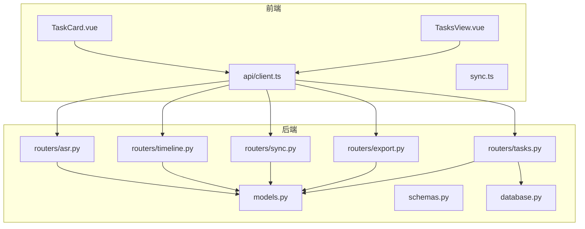
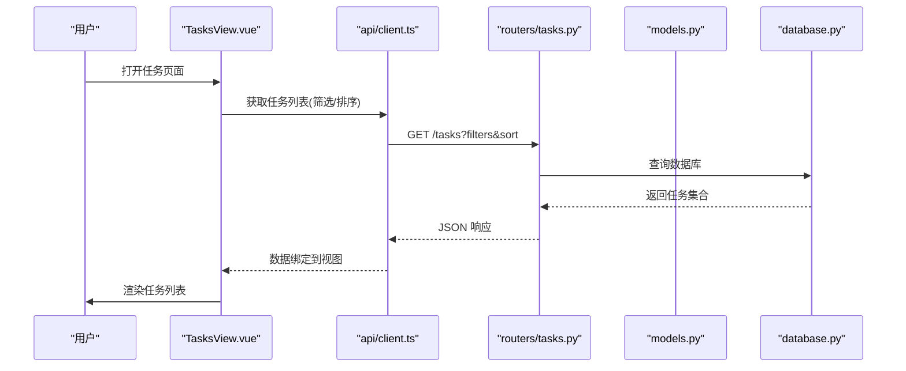
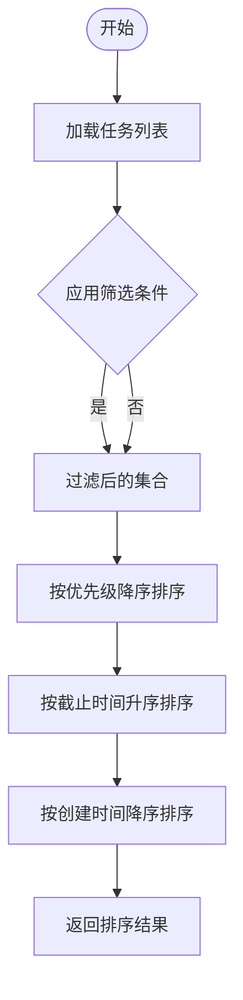
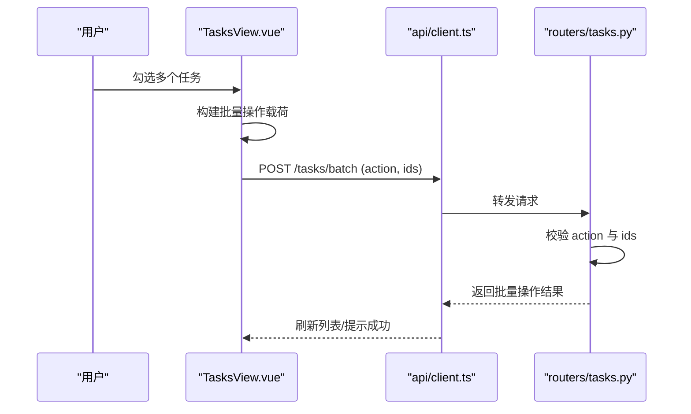
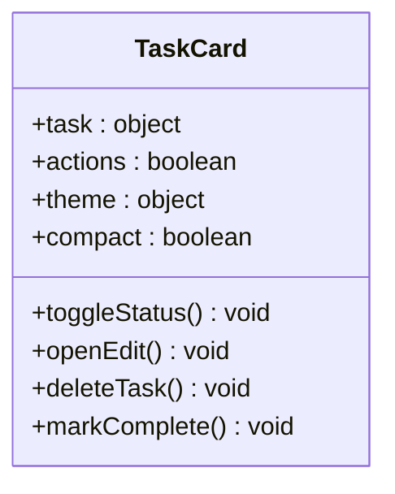
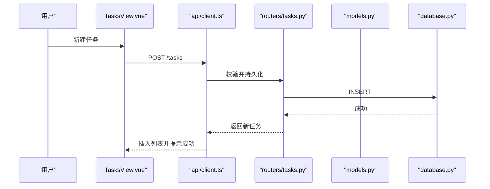
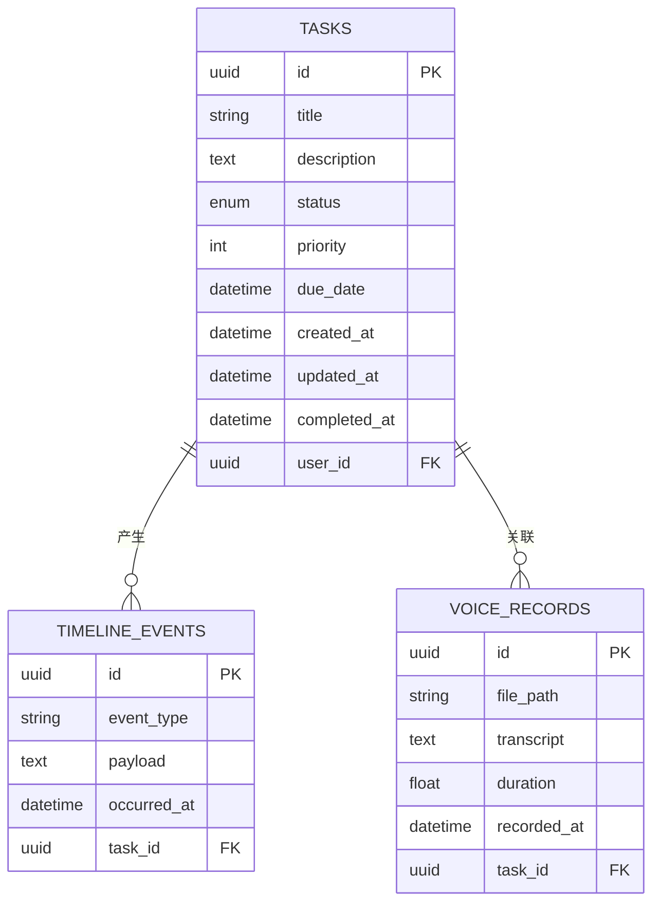
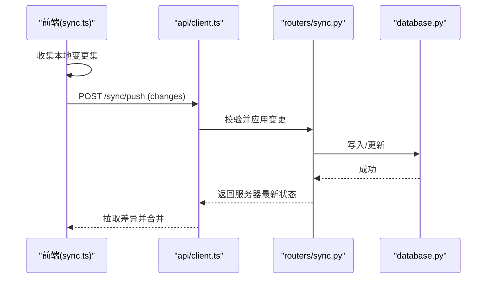
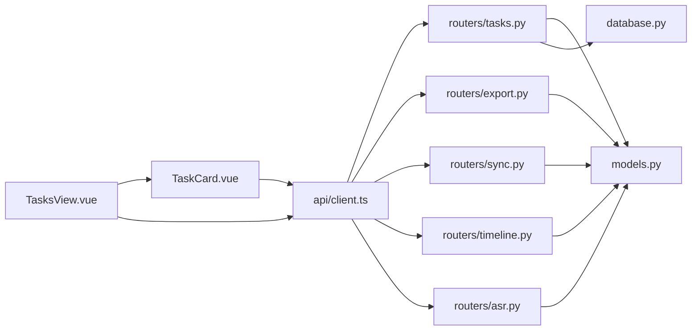

# 任务管理

<cite>
**本文引用的文件**   
- [backend/routers/tasks.py](file://backend/routers/tasks.py)
- [backend/models.py](file://backend/models.py)
- [backend/schemas.py](file://backend/schemas.py)
- [backend/database.py](file://backend/database.py)
- [frontend/src/views/TasksView.vue](file://frontend/src/views/TasksView.vue)
- [frontend/src/components/TaskCard.vue](file://frontend/src/components/TaskCard.vue)
- [frontend/src/api/client.ts](file://frontend/src/api/client.ts)
- [frontend/src/sync.ts](file://frontend/src/sync.ts)
- [backend/routers/export.py](file://backend/routers/export.py)
- [backend/routers/sync.py](file://backend/routers/sync.py)
- [backend/routers/timeline.py](file://backend/routers/timeline.py)
- [backend/routers/asr.py](file://backend/routers/asr.py)
</cite>

## 目录
1. [简介](#简介)
2. [项目结构](#项目结构)
3. [核心组件](#核心组件)
4. [架构总览](#架构总览)
5. [详细组件分析](#详细组件分析)
6. [依赖关系分析](#依赖关系分析)
7. [性能考虑](#性能考虑)
8. [故障排查指南](#故障排查指南)
9. [结论](#结论)
10. [附录](#附录)

## 简介
本文件为 AdventureX 项目的“任务管理”功能提供系统化、可操作的技术文档。内容覆盖：
- 任务数据模型与状态管理机制
- 优先级排序算法与筛选逻辑
- TasksView 视图的数据绑定、批量操作
- TaskCard 组件的属性配置、交互行为与样式定制
- 任务的创建、编辑、删除、完成等生命周期
- 任务与时间线、语音记录的关联关系
- 任务数据的导入导出、备份恢复、同步机制
- 最佳实践与性能优化建议

## 项目结构
围绕任务管理的代码主要分布在后端路由与模型层、前端视图与组件层，以及跨端同步与导出模块：
- 后端
  - 路由层：tasks.py 提供任务 CRUD 接口；export.py 提供导出能力；sync.py 提供同步能力；timeline.py 与 asr.py 提供关联数据能力
  - 模型与模式：models.py 定义数据库实体；schemas.py 定义请求/响应结构；database.py 负责连接与会话管理
- 前端
  - 视图：TasksView.vue 承载任务列表、筛选、批量操作
  - 组件：TaskCard.vue 渲染单个任务卡片
  - API 客户端：client.ts 封装 HTTP 调用
  - 同步：sync.ts 实现离线缓存与增量同步

图表来源
- [frontend/src/views/TasksView.vue](file://frontend/src/views/TasksView.vue)
- [frontend/src/components/TaskCard.vue](file://frontend/src/components/TaskCard.vue)
- [frontend/src/api/client.ts](file://frontend/src/api/client.ts)
- [frontend/src/sync.ts](file://frontend/src/sync.ts)
- [backend/routers/tasks.py](file://backend/routers/tasks.py)
- [backend/routers/export.py](file://backend/routers/export.py)
- [backend/routers/sync.py](file://backend/routers/sync.py)
- [backend/models.py](file://backend/models.py)
- [backend/schemas.py](file://backend/schemas.py)
- [backend/database.py](file://backend/database.py)
- [backend/routers/timeline.py](file://backend/routers/timeline.py)
- [backend/routers/asr.py](file://backend/routers/asr.py)

章节来源
- [backend/routers/tasks.py](file://backend/routers/tasks.py)
- [backend/models.py](file://backend/models.py)
- [backend/schemas.py](file://backend/schemas.py)
- [backend/database.py](file://backend/database.py)
- [frontend/src/views/TasksView.vue](file://frontend/src/views/TasksView.vue)
- [frontend/src/components/TaskCard.vue](file://frontend/src/components/TaskCard.vue)
- [frontend/src/api/client.ts](file://frontend/src/api/client.ts)
- [frontend/src/sync.ts](file://frontend/src/sync.ts)
- [backend/routers/export.py](file://backend/routers/export.py)
- [backend/routers/sync.py](file://backend/routers/sync.py)
- [backend/routers/timeline.py](file://backend/routers/timeline.py)
- [backend/routers/asr.py](file://backend/routers/asr.py)

## 核心组件
- 任务数据模型（后端）
  - 字段包含：唯一标识、标题、描述、状态、优先级、计划时间、实际完成时间、标签、备注、创建/更新时间戳、用户归属等
  - 状态枚举：待办、进行中、已完成、已取消等
  - 优先级：数值或等级，用于排序与视觉区分
- 任务模式（前后端契约）
  - schemas.py 定义请求体与响应体的字段校验规则，确保前后端一致
- 任务路由（后端）
  - tasks.py 暴露 RESTful 接口：创建、查询、更新、删除、批量操作、按条件筛选与排序
- 任务视图（前端）
  - TasksView.vue 负责数据绑定、筛选、分页、批量选择与操作
- 任务卡片（前端）
  - TaskCard.vue 展示单条任务信息，支持快速切换状态、编辑、删除、标记完成等交互

章节来源
- [backend/models.py](file://backend/models.py)
- [backend/schemas.py](file://backend/schemas.py)
- [backend/routers/tasks.py](file://backend/routers/tasks.py)
- [frontend/src/views/TasksView.vue](file://frontend/src/views/TasksView.vue)
- [frontend/src/components/TaskCard.vue](file://frontend/src/components/TaskCard.vue)

## 架构总览
任务管理采用前后端分离的 REST 架构：
- 前端通过 api/client.ts 发起 HTTP 请求
- 后端由 FastAPI（推测）路由处理，访问 models.py 定义的数据库模型，并通过 database.py 管理会话
- 导出与同步分别由 export.py 与 sync.py 提供专用接口
- 时间线与语音记录通过 timeline.py 与 asr.py 与任务建立关联

图表来源
- [frontend/src/views/TasksView.vue](file://frontend/src/views/TasksView.vue)
- [frontend/src/api/client.ts](file://frontend/src/api/client.ts)
- [backend/routers/tasks.py](file://backend/routers/tasks.py)
- [backend/models.py](file://backend/models.py)
- [backend/database.py](file://backend/database.py)

## 详细组件分析

### 任务数据模型与状态管理
- 数据模型要点
  - 主键与索引：id 作为主键，常见查询字段如 status、priority、due_date、user_id 建立索引以提升筛选与排序性能
  - 状态机：状态变更需遵循有限状态转换（例如：待办→进行中→已完成），避免非法跳转
  - 优先级：数值型或枚举型，配合排序算法决定显示顺序
  - 时间字段：created_at、updated_at、planned_at、completed_at 等，用于统计与审计
- 状态管理策略
  - 后端：在更新接口中校验状态转换合法性，并记录变更历史（可选）
  - 前端：本地缓存与乐观更新结合，失败回滚保证一致性

章节来源
- [backend/models.py](file://backend/models.py)
- [backend/schemas.py](file://backend/schemas.py)
- [backend/routers/tasks.py](file://backend/routers/tasks.py)

### 优先级排序算法
- 排序维度
  - 主序：优先级（降序）
  - 次序：截止时间（升序）
  - 再次序：创建时间（降序）
- 实现要点
  - 后端 SQL 使用 ORDER BY 多列排序，必要时使用 CASE WHEN 将枚举优先级映射为数值
  - 前端对服务端结果进行二次排序时，注意稳定性与性能

图表来源
- [backend/routers/tasks.py](file://backend/routers/tasks.py)
- [backend/models.py](file://backend/models.py)

章节来源
- [backend/routers/tasks.py](file://backend/routers/tasks.py)
- [backend/models.py](file://backend/models.py)

### TasksView 视图：数据绑定、筛选与批量操作
- 数据绑定
  - 从 api/client.ts 获取任务列表，绑定到表格/卡片容器
  - 支持分页、搜索、状态筛选、优先级筛选、日期范围筛选
- 筛选逻辑
  - 前端组合查询参数后发起请求，后端根据 schemas 校验并执行 SQL 过滤
- 批量操作
  - 多选任务后支持批量修改状态、批量删除、批量打标签
  - 前端维护选中集合，提交时以数组形式传递

图表来源
- [frontend/src/views/TasksView.vue](file://frontend/src/views/TasksView.vue)
- [frontend/src/api/client.ts](file://frontend/src/api/client.ts)
- [backend/routers/tasks.py](file://backend/routers/tasks.py)

章节来源
- [frontend/src/views/TasksView.vue](file://frontend/src/views/TasksView.vue)
- [frontend/src/api/client.ts](file://frontend/src/api/client.ts)
- [backend/routers/tasks.py](file://backend/routers/tasks.py)

### TaskCard 组件：属性、交互与样式
- 属性配置
  - task: 任务对象（id、title、description、status、priority、due_date 等）
  - actions: 是否显示编辑/删除/完成按钮
  - theme: 主题色、优先级颜色映射
  - compact: 紧凑模式开关
- 交互行为
  - 点击切换状态（如标记完成）
  - 右键菜单或悬浮工具栏触发编辑/删除
  - 拖拽调整优先级（可选）
- 样式定制
  - 通过 CSS 变量或主题类名控制边框、阴影、字体大小
  - 优先级高亮、状态徽标、截止日期倒计时

图表来源
- [frontend/src/components/TaskCard.vue](file://frontend/src/components/TaskCard.vue)

章节来源
- [frontend/src/components/TaskCard.vue](file://frontend/src/components/TaskCard.vue)

### 任务生命周期管理：创建、编辑、删除、完成
- 创建
  - 前端表单校验 → 调用 client.ts → 后端写入数据库 → 返回新任务
- 编辑
  - 局部更新字段，后端校验并合并更新
- 删除
  - 软删除或硬删除，建议软删除保留审计痕迹
- 完成
  - 状态变更为“已完成”，记录 completed_at，并触发后续流程（如归档、通知）

图表来源
- [frontend/src/views/TasksView.vue](file://frontend/src/views/TasksView.vue)
- [frontend/src/api/client.ts](file://frontend/src/api/client.ts)
- [backend/routers/tasks.py](file://backend/routers/tasks.py)
- [backend/models.py](file://backend/models.py)
- [backend/database.py](file://backend/database.py)

章节来源
- [backend/routers/tasks.py](file://backend/routers/tasks.py)
- [backend/models.py](file://backend/models.py)
- [backend/database.py](file://backend/database.py)
- [frontend/src/views/TasksView.vue](file://frontend/src/views/TasksView.vue)
- [frontend/src/api/client.ts](file://frontend/src/api/client.ts)

### 任务与时间线、语音记录的关联
- 时间线关联
  - timeline.py 提供时间线事件，任务可作为事件主体或关联实体
  - 任务的状态变更、完成时间可生成时间线条目
- 语音记录关联
  - asr.py 提供语音转文本服务，任务可关联一段或多段语音记录
  - 支持在任务详情中查看语音摘要、关键词提取

图表来源
- [backend/models.py](file://backend/models.py)
- [backend/routers/timeline.py](file://backend/routers/timeline.py)
- [backend/routers/asr.py](file://backend/routers/asr.py)

章节来源
- [backend/models.py](file://backend/models.py)
- [backend/routers/timeline.py](file://backend/routers/timeline.py)
- [backend/routers/asr.py](file://backend/routers/asr.py)

### 任务数据的导入导出、备份恢复、同步机制
- 导入导出
  - export.py 提供 CSV/JSON 导出，支持按筛选条件导出
  - 导入接口接收结构化数据，进行去重与冲突解决
- 备份恢复
  - 基于数据库快照或导出文件进行全量备份
  - 恢复时校验版本兼容性与完整性
- 同步机制
  - sync.ts 在前端维护本地缓存（IndexedDB/LocalStorage）
  - 后端 sync.py 提供增量同步接口，支持冲突检测与合并策略（如最后写入优先、字段级合并）

图表来源
- [frontend/src/sync.ts](file://frontend/src/sync.ts)
- [frontend/src/api/client.ts](file://frontend/src/api/client.ts)
- [backend/routers/sync.py](file://backend/routers/sync.py)
- [backend/database.py](file://backend/database.py)

章节来源
- [backend/routers/export.py](file://backend/routers/export.py)
- [backend/routers/sync.py](file://backend/routers/sync.py)
- [frontend/src/sync.ts](file://frontend/src/sync.ts)
- [frontend/src/api/client.ts](file://frontend/src/api/client.ts)

## 依赖关系分析
- 前端依赖
  - TasksView.vue 依赖 TaskCard.vue 进行渲染
  - 所有视图通过 api/client.ts 统一访问后端
  - sync.ts 与 client.ts 协作实现离线与同步
- 后端依赖
  - routers/tasks.py 依赖 models.py 与 database.py
  - export.py、sync.py、timeline.py、asr.py 均依赖 models.py 与 database.py

图表来源
- [frontend/src/views/TasksView.vue](file://frontend/src/views/TasksView.vue)
- [frontend/src/components/TaskCard.vue](file://frontend/src/components/TaskCard.vue)
- [frontend/src/api/client.ts](file://frontend/src/api/client.ts)
- [frontend/src/sync.ts](file://frontend/src/sync.ts)
- [backend/routers/tasks.py](file://backend/routers/tasks.py)
- [backend/routers/export.py](file://backend/routers/export.py)
- [backend/routers/sync.py](file://backend/routers/sync.py)
- [backend/routers/timeline.py](file://backend/routers/timeline.py)
- [backend/routers/asr.py](file://backend/routers/asr.py)
- [backend/models.py](file://backend/models.py)
- [backend/database.py](file://backend/database.py)

章节来源
- [frontend/src/views/TasksView.vue](file://frontend/src/views/TasksView.vue)
- [frontend/src/components/TaskCard.vue](file://frontend/src/components/TaskCard.vue)
- [frontend/src/api/client.ts](file://frontend/src/api/client.ts)
- [frontend/src/sync.ts](file://frontend/src/sync.ts)
- [backend/routers/tasks.py](file://backend/routers/tasks.py)
- [backend/routers/export.py](file://backend/routers/export.py)
- [backend/routers/sync.py](file://backend/routers/sync.py)
- [backend/routers/timeline.py](file://backend/routers/timeline.py)
- [backend/routers/asr.py](file://backend/routers/asr.py)
- [backend/models.py](file://backend/models.py)
- [backend/database.py](file://backend/database.py)

## 性能考虑
- 后端优化
  - 为高频查询字段建立复合索引（status、priority、due_date、user_id）
  - 分页与限流：限制单次返回数量，避免大结果集
  - 批量操作事务化，减少锁竞争
- 前端优化
  - 虚拟滚动或分页加载，降低渲染压力
  - 防抖与节流：搜索输入、窗口缩放等事件
  - 本地缓存与增量同步，减少网络往返
- 同步优化
  - 增量变更集最小化传输
  - 冲突检测与合并策略明确，避免重复计算

[本节为通用指导，不直接分析具体文件]

## 故障排查指南
- 常见问题
  - 状态转换错误：检查后端状态机校验逻辑与前端传参
  - 排序异常：确认后端 ORDER BY 字段映射与前端二次排序一致性
  - 同步冲突：查看 sync 日志，定位冲突字段与合并策略
  - 导出为空：检查筛选条件与权限控制
- 调试建议
  - 启用后端详细日志，捕获请求/响应与 SQL 语句
  - 前端 Network 面板观察请求参数与响应体
  - 使用浏览器开发者工具检查本地缓存与 IndexedDB 内容

章节来源
- [backend/routers/tasks.py](file://backend/routers/tasks.py)
- [backend/routers/sync.py](file://backend/routers/sync.py)
- [backend/routers/export.py](file://backend/routers/export.py)
- [frontend/src/api/client.ts](file://frontend/src/api/client.ts)
- [frontend/src/sync.ts](file://frontend/src/sync.ts)

## 结论
本文件系统梳理了 AdventureX 任务管理的数据模型、状态管理、排序与筛选、视图与组件设计、生命周期管理、关联关系以及导入导出与同步机制。通过合理的索引与分页、前端虚拟化与缓存、后端事务与并发控制，可在保证一致性的同时提升性能与用户体验。建议在迭代中持续完善状态机、冲突合并策略与审计日志，以满足复杂业务场景需求。

## 附录
- 最佳实践
  - 明确状态机与优先级语义，保持前后端一致
  - 使用 schemas 严格校验输入，避免脏数据
  - 批量操作与敏感操作增加二次确认与审计
  - 导出与同步提供版本兼容与回滚方案
- 扩展建议
  - 增加任务模板与子任务
  - 引入提醒与通知机制
  - 支持团队协作与权限控制

[本节为通用指导，不直接分析具体文件]