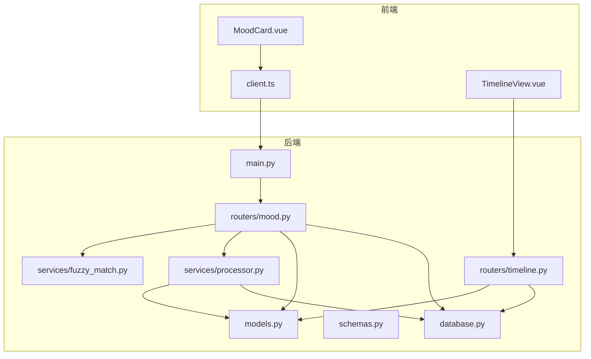
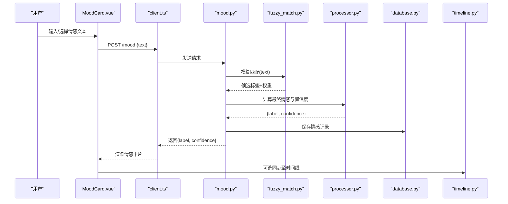
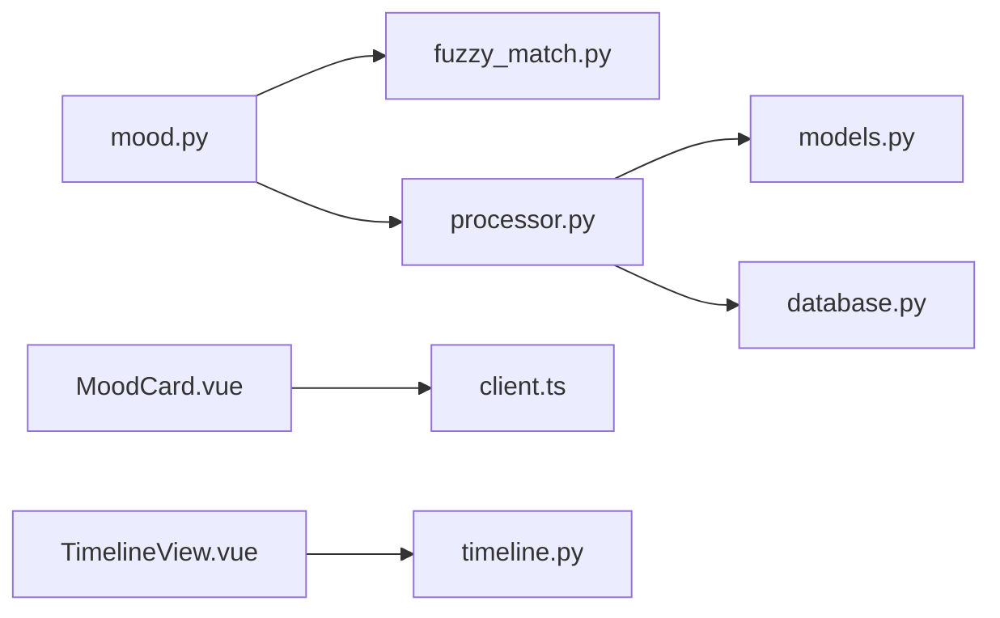

# 情感分析

<cite>
**本文引用的文件**   
- [backend/routers/mood.py](file://backend/routers/mood.py)
- [backend/services/fuzzy_match.py](file://backend/services/fuzzy_match.py)
- [backend/services/processor.py](file://backend/services/processor.py)
- [backend/models.py](file://backend/models.py)
- [backend/schemas.py](file://backend/schemas.py)
- [backend/database.py](file://backend/database.py)
- [backend/main.py](file://backend/main.py)
- [frontend/src/components/MoodCard.vue](file://frontend/src/components/MoodCard.vue)
- [frontend/src/api/client.ts](file://frontend/src/api/client.ts)
- [frontend/src/views/TimelineView.vue](file://frontend/src/views/TimelineView.vue)
- [backend/routers/timeline.py](file://backend/routers/timeline.py)
</cite>

## 目录
1. [简介](#简介)
2. [项目结构](#项目结构)
3. [核心组件](#核心组件)
4. [架构总览](#架构总览)
5. [详细组件分析](#详细组件分析)
6. [依赖关系分析](#依赖关系分析)
7. [性能考量](#性能考量)
8. [故障排查指南](#故障排查指南)
9. [结论](#结论)
10. [附录](#附录)

## 简介
本文件为 AdventureX 项目的“情感分析”功能提供全面文档，覆盖以下方面：
- 情感分类算法与模糊匹配服务的工作原理
- 数据流转过程（前端到后端、存储与时间线集成）
- MoodCard 组件的视觉呈现与用户交互设计
- 情感分析 API 接口使用方法（输入文本格式、情感标签定义、置信度评分机制）
- 情感数据与时间线系统的集成方式
- 自定义配置选项、扩展方法与性能调优建议
- 实际使用场景的代码示例与最佳实践指导

## 项目结构
与情感分析相关的代码主要分布在后端路由、服务层、模型与模式定义、数据库访问，以及前端组件与 API 客户端中。整体采用前后端分离架构：前端通过 HTTP 调用后端 REST API，后端将情感分析结果持久化并支持时间线展示。

图表来源
- [backend/main.py](file://backend/main.py)
- [backend/routers/mood.py](file://backend/routers/mood.py)
- [backend/services/fuzzy_match.py](file://backend/services/fuzzy_match.py)
- [backend/services/processor.py](file://backend/services/processor.py)
- [backend/models.py](file://backend/models.py)
- [backend/schemas.py](file://backend/schemas.py)
- [backend/database.py](file://backend/database.py)
- [backend/routers/timeline.py](file://backend/routers/timeline.py)
- [frontend/src/components/MoodCard.vue](file://frontend/src/components/MoodCard.vue)
- [frontend/src/api/client.ts](file://frontend/src/api/client.ts)
- [frontend/src/views/TimelineView.vue](file://frontend/src/views/TimelineView.vue)

章节来源
- [backend/main.py](file://backend/main.py)
- [backend/routers/mood.py](file://backend/routers/mood.py)
- [backend/services/fuzzy_match.py](file://backend/services/fuzzy_match.py)
- [backend/services/processor.py](file://backend/services/processor.py)
- [backend/models.py](file://backend/models.py)
- [backend/schemas.py](file://backend/schemas.py)
- [backend/database.py](file://backend/database.py)
- [backend/routers/timeline.py](file://backend/routers/timeline.py)
- [frontend/src/components/MoodCard.vue](file://frontend/src/components/MoodCard.vue)
- [frontend/src/api/client.ts](file://frontend/src/api/client.ts)
- [frontend/src/views/TimelineView.vue](file://frontend/src/views/TimelineView.vue)

## 核心组件
- 情感分析路由（mood.py）：接收前端请求，校验输入，调用模糊匹配与处理器，返回情感标签与置信度。
- 模糊匹配服务（fuzzy_match.py）：基于关键词或规则进行初步情感倾向判断，输出候选标签与权重。
- 处理器（processor.py）：整合模糊匹配结果，结合上下文与阈值策略，生成最终情感标签与置信度评分。
- 模型与模式（models.py, schemas.py）：定义情感记录的数据结构与 API 请求/响应模式。
- 数据库（database.py）：负责情感记录的增删改查与事务处理。
- 前端组件（MoodCard.vue）：展示情感卡片，支持用户选择/确认情感，触发提交。
- 前端 API 客户端（client.ts）：封装对 /mood 等接口的调用。
- 时间线视图（TimelineView.vue）：展示包含情感的时间线条目。

章节来源
- [backend/routers/mood.py](file://backend/routers/mood.py)
- [backend/services/fuzzy_match.py](file://backend/services/fuzzy_match.py)
- [backend/services/processor.py](file://backend/services/processor.py)
- [backend/models.py](file://backend/models.py)
- [backend/schemas.py](file://backend/schemas.py)
- [backend/database.py](file://backend/database.py)
- [frontend/src/components/MoodCard.vue](file://frontend/src/components/MoodCard.vue)
- [frontend/src/api/client.ts](file://frontend/src/api/client.ts)
- [frontend/src/views/TimelineView.vue](file://frontend/src/views/TimelineView.vue)

## 架构总览
情感分析的整体流程如下：
- 用户在 MoodCard 中选择或输入情感相关文本。
- 前端通过 client.ts 调用后端 /mood 接口。
- 后端路由进行参数校验，调用模糊匹配服务获取候选情感标签与权重。
- 处理器根据策略计算最终情感标签与置信度评分。
- 结果写入数据库，并可关联时间线条目。
- 前端渲染情感卡片与时间线视图。

图表来源
- [backend/routers/mood.py](file://backend/routers/mood.py)
- [backend/services/fuzzy_match.py](file://backend/services/fuzzy_match.py)
- [backend/services/processor.py](file://backend/services/processor.py)
- [backend/database.py](file://backend/database.py)
- [backend/routers/timeline.py](file://backend/routers/timeline.py)
- [frontend/src/components/MoodCard.vue](file://frontend/src/components/MoodCard.vue)
- [frontend/src/api/client.ts](file://frontend/src/api/client.ts)

## 详细组件分析

### 情感分析路由（mood.py）
- 职责：接收 /mood 请求，校验输入文本，调用模糊匹配与处理器，返回结构化响应。
- 关键点：
  - 输入校验：确保文本非空、长度合理。
  - 调用模糊匹配：获取候选情感标签与权重。
  - 调用处理器：综合策略得出最终标签与置信度。
  - 持久化：写入数据库，必要时关联时间线。
  - 错误处理：统一异常捕获与状态码返回。

章节来源
- [backend/routers/mood.py](file://backend/routers/mood.py)

### 模糊匹配服务（fuzzy_match.py）
- 职责：基于关键词词典或规则进行初步情感倾向判断，输出候选标签与权重。
- 关键点：
  - 词典/规则维护：支持多语言与领域词表。
  - 匹配策略：精确匹配、正则匹配、语义近似匹配。
  - 权重计算：按命中次数、位置、强度等加权。
  - 可扩展性：插件式规则加载与动态更新。

章节来源
- [backend/services/fuzzy_match.py](file://backend/services/fuzzy_match.py)

### 处理器（processor.py）
- 职责：整合模糊匹配结果，结合上下文与阈值策略，生成最终情感标签与置信度评分。
- 关键点：
  - 策略组合：加权投票、阈值过滤、冲突消解。
  - 置信度计算：归一化权重、平滑处理、不确定性表达。
  - 可配置：阈值、权重系数、优先级规则。
  - 日志与追踪：关键决策点记录便于调试。

章节来源
- [backend/services/processor.py](file://backend/services/processor.py)

### 模型与模式（models.py, schemas.py）
- 模型（models.py）：定义情感记录实体字段（如文本、标签、置信度、时间戳、关联 ID）。
- 模式（schemas.py）：定义 API 请求/响应结构（如输入文本、输出标签与置信度）。
- 关键点：
  - 字段约束：必填、类型、长度限制。
  - 序列化/反序列化：保证前后端数据结构一致。
  - 版本兼容：支持字段演进与迁移。

章节来源
- [backend/models.py](file://backend/models.py)
- [backend/schemas.py](file://backend/schemas.py)

### 数据库（database.py）
- 职责：提供情感记录的 CRUD 操作、事务管理、索引优化。
- 关键点：
  - 连接池：高并发下的资源管理。
  - 查询优化：索引设计与分页查询。
  - 事务一致性：确保写入原子性。
  - 错误恢复：重试与回滚策略。

章节来源
- [backend/database.py](file://backend/database.py)

### 前端组件（MoodCard.vue）
- 职责：展示情感卡片，支持用户选择/输入情感，触发提交。
- 关键点：
  - 视觉呈现：颜色、图标、动画反馈。
  - 交互设计：点击选择、键盘导航、无障碍支持。
  - 状态管理：本地缓存、失败重试。
  - 国际化：多语言文案适配。

章节来源
- [frontend/src/components/MoodCard.vue](file://frontend/src/components/MoodCard.vue)

### 前端 API 客户端（client.ts）
- 职责：封装对 /mood 等接口的调用，处理请求/响应转换。
- 关键点：
  - 错误处理：网络异常、业务错误统一捕获。
  - 超时与重试：可配置的重试策略。
  - 类型安全：TypeScript 接口定义。

章节来源
- [frontend/src/api/client.ts](file://frontend/src/api/client.ts)

### 时间线视图（TimelineView.vue）与路由（timeline.py）
- 职责：展示包含情感的时间线条目，支持筛选与排序。
- 关键点：
  - 数据聚合：按时间顺序合并事件与情感。
  - 交互：点击展开详情、切换视图。
  - 后端集成：调用 timeline 路由获取数据。

章节来源
- [frontend/src/views/TimelineView.vue](file://frontend/src/views/TimelineView.vue)
- [backend/routers/timeline.py](file://backend/routers/timeline.py)

## 依赖关系分析
- 模块耦合：
  - mood.py 依赖 fuzzy_match.py 与 processor.py。
  - processor.py 依赖 models.py 与 database.py。
  - 前端 MoodCard.vue 依赖 client.ts。
- 外部依赖：
  - 数据库驱动（如 SQLite/PostgreSQL）。
  - 可能的 NLP/词典库（用于模糊匹配）。
- 潜在循环依赖：需避免 service 层互相调用。

图表来源
- [backend/routers/mood.py](file://backend/routers/mood.py)
- [backend/services/fuzzy_match.py](file://backend/services/fuzzy_match.py)
- [backend/services/processor.py](file://backend/services/processor.py)
- [backend/models.py](file://backend/models.py)
- [backend/database.py](file://backend/database.py)
- [frontend/src/components/MoodCard.vue](file://frontend/src/components/MoodCard.vue)
- [frontend/src/api/client.ts](file://frontend/src/api/client.ts)
- [frontend/src/views/TimelineView.vue](file://frontend/src/views/TimelineView.vue)
- [backend/routers/timeline.py](file://backend/routers/timeline.py)

章节来源
- [backend/routers/mood.py](file://backend/routers/mood.py)
- [backend/services/fuzzy_match.py](file://backend/services/fuzzy_match.py)
- [backend/services/processor.py](file://backend/services/processor.py)
- [backend/models.py](file://backend/models.py)
- [backend/database.py](file://backend/database.py)
- [frontend/src/components/MoodCard.vue](file://frontend/src/components/MoodCard.vue)
- [frontend/src/api/client.ts](file://frontend/src/api/client.ts)
- [frontend/src/views/TimelineView.vue](file://frontend/src/views/TimelineView.vue)
- [backend/routers/timeline.py](file://backend/routers/timeline.py)

## 性能考量
- 模糊匹配优化：
  - 预编译正则表达式，减少重复开销。
  - 使用哈希索引加速关键词查找。
- 处理器策略：
  - 设置合理阈值，避免低置信度分支计算。
  - 并行处理多条文本（注意线程安全）。
- 数据库优化：
  - 为常用查询字段建立索引。
  - 批量写入减少事务开销。
- 前端体验：
  - 防抖与节流减少频繁请求。
  - 本地缓存最近结果，提升响应速度。

[本节为通用性能建议，不直接分析具体文件]

## 故障排查指南
- 常见问题：
  - 输入文本为空或过长：检查前端校验与后端边界条件。
  - 模糊匹配无结果：确认词典是否更新，匹配规则是否生效。
  - 置信度过低：调整处理器阈值或权重系数。
  - 数据库写入失败：检查连接池、事务与权限。
- 调试建议：
  - 启用详细日志，记录关键决策点。
  - 使用单元测试验证匹配规则与处理器逻辑。
  - 监控 API 响应时间与错误率。

章节来源
- [backend/routers/mood.py](file://backend/routers/mood.py)
- [backend/services/fuzzy_match.py](file://backend/services/fuzzy_match.py)
- [backend/services/processor.py](file://backend/services/processor.py)
- [backend/database.py](file://backend/database.py)

## 结论
AdventureX 的情感分析功能通过清晰的分层架构与模块化设计，实现了从前端交互到后端处理再到数据存储的完整闭环。模糊匹配与处理器协同工作，提供稳定可靠的情感标签与置信度评分。通过合理的配置与优化，系统可在不同规模下保持良好性能与可扩展性。

[本节为总结性内容，不直接分析具体文件]

## 附录

### API 接口使用方法
- 接口路径：POST /mood
- 请求体：
  - text: string（必填，用户输入的文本）
- 响应体：
  - label: string（情感标签，如“积极”、“消极”、“中性”）
  - confidence: number（置信度评分，范围 0~1）
- 错误码：
  - 400：输入无效
  - 500：服务器内部错误

章节来源
- [backend/routers/mood.py](file://backend/routers/mood.py)
- [backend/schemas.py](file://backend/schemas.py)

### 情感标签定义
- 标签集合：根据业务需求定义，常见包括“积极”、“消极”、“中性”。
- 扩展方法：在模糊匹配词典与处理器策略中新增标签映射与权重规则。

章节来源
- [backend/services/fuzzy_match.py](file://backend/services/fuzzy_match.py)
- [backend/services/processor.py](file://backend/services/processor.py)

### 置信度评分机制
- 计算方式：基于模糊匹配权重与处理器策略综合得出。
- 归一化：确保评分在 0~1 范围内。
- 平滑处理：避免极端值影响用户体验。

章节来源
- [backend/services/processor.py](file://backend/services/processor.py)

### 与时间线系统集成
- 集成方式：情感记录创建后，可选择同步至时间线条目。
- 数据关联：通过 ID 关联情感记录与时间线事件。
- 展示逻辑：时间线视图按时间顺序聚合显示情感状态。

章节来源
- [backend/routers/timeline.py](file://backend/routers/timeline.py)
- [frontend/src/views/TimelineView.vue](file://frontend/src/views/TimelineView.vue)

### 自定义配置选项
- 模糊匹配词典：支持动态加载与热更新。
- 处理器阈值：可配置置信度阈值与权重系数。
- 日志级别：调试与生产环境差异化配置。

章节来源
- [backend/services/fuzzy_match.py](file://backend/services/fuzzy_match.py)
- [backend/services/processor.py](file://backend/services/processor.py)

### 扩展方法
- 新增情感标签：在词典与处理器中注册新标签。
- 替换匹配算法：实现新的模糊匹配服务接口。
- 增强处理器策略：引入机器学习模型或规则引擎。

章节来源
- [backend/services/fuzzy_match.py](file://backend/services/fuzzy_match.py)
- [backend/services/processor.py](file://backend/services/processor.py)

### 性能调优建议
- 缓存热点数据：如常用词典与规则。
- 异步处理：非关键路径任务异步执行。
- 资源监控：CPU、内存、数据库连接数监控。

[本节为通用性能建议，不直接分析具体文件]

### 实际使用场景与最佳实践
- 场景一：用户日记情感分析
  - 输入：日记文本
  - 输出：情感标签与置信度
  - 展示：MoodCard 与时间线
- 场景二：评论情感监控
  - 输入：评论内容
  - 输出：情感趋势统计
  - 展示：仪表盘与告警
- 最佳实践：
  - 定期更新词典与规则。
  - 监控置信度分布，及时调整阈值。
  - 用户反馈闭环，持续优化准确率。

[本节为概念性内容，不直接分析具体文件]