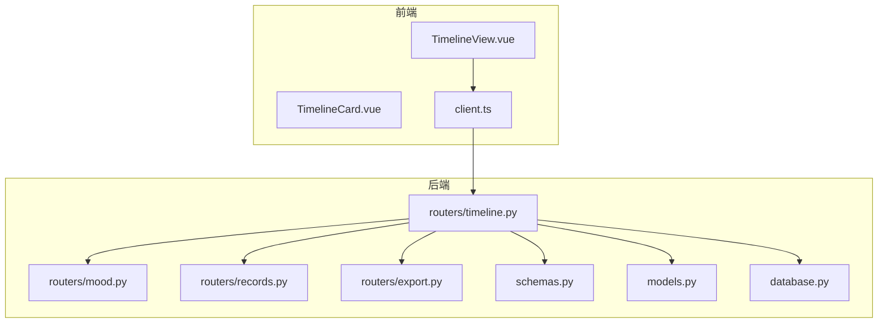
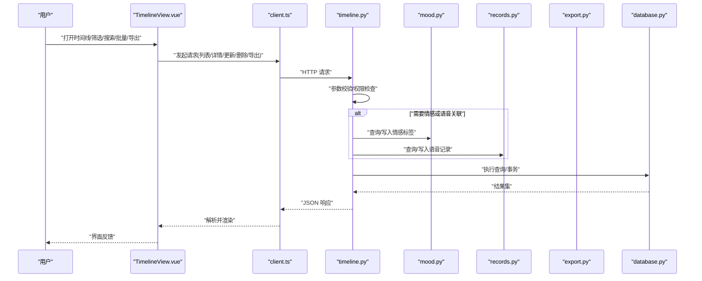
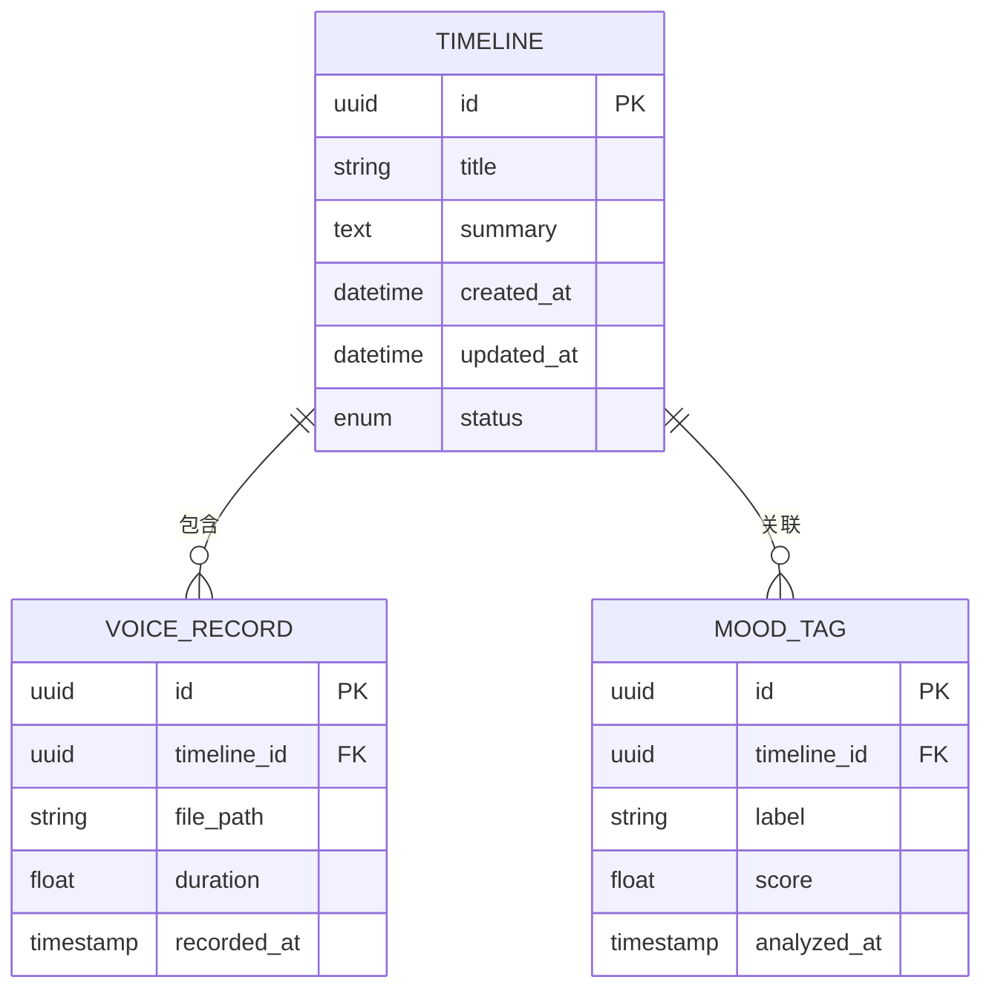
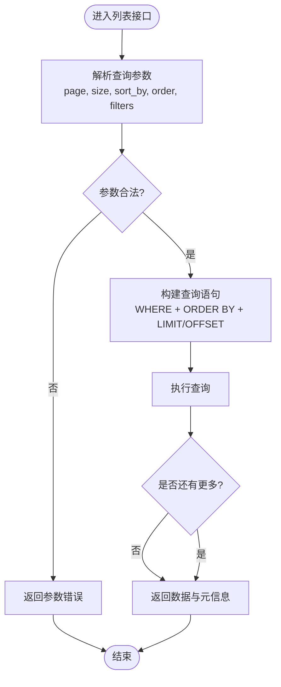
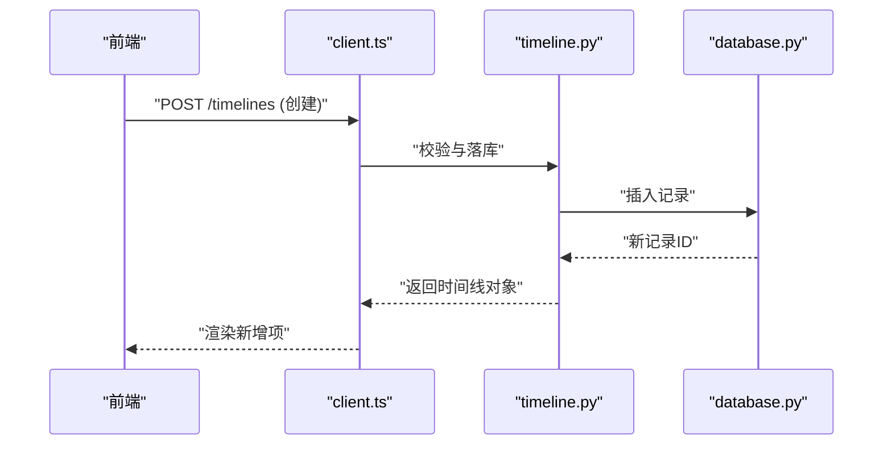
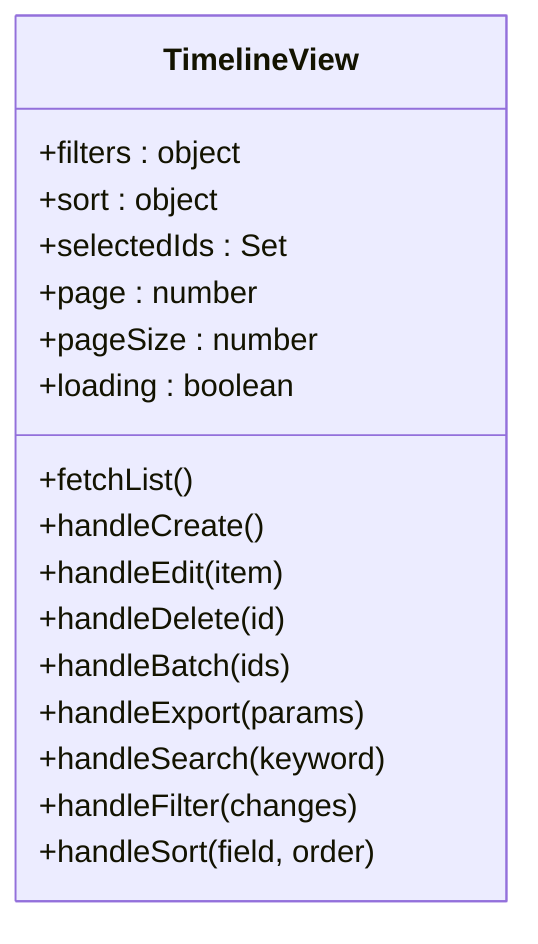
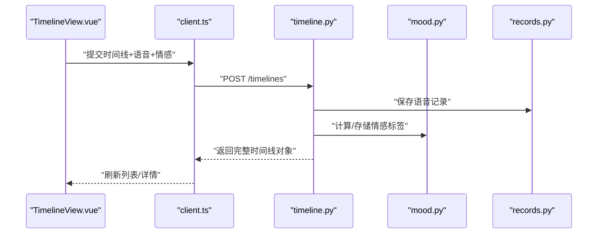
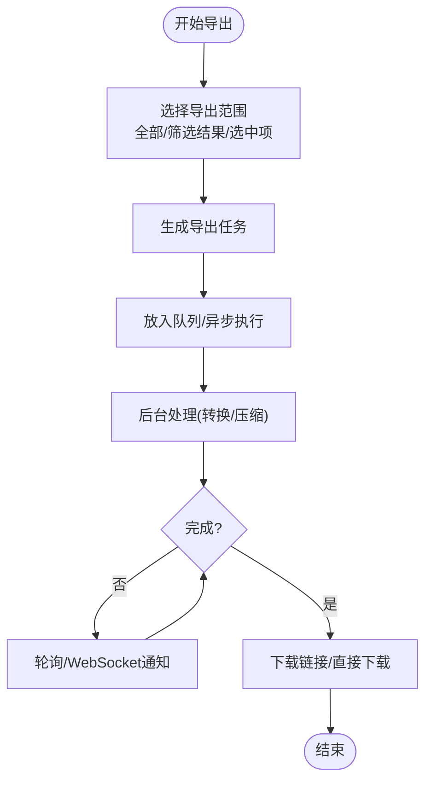
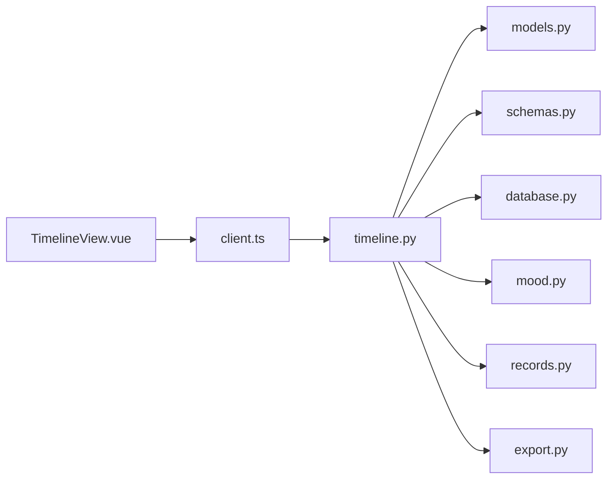

# 时间线管理

<cite>
**本文引用的文件**   
- [backend/routers/timeline.py](file://backend/routers/timeline.py)
- [backend/models.py](file://backend/models.py)
- [backend/schemas.py](file://backend/schemas.py)
- [backend/database.py](file://backend/database.py)
- [frontend/src/views/TimelineView.vue](file://frontend/src/views/TimelineView.vue)
- [frontend/src/components/TimelineCard.vue](file://frontend/src/components/TimelineCard.vue)
- [frontend/src/api/client.ts](file://frontend/src/api/client.ts)
- [backend/routers/mood.py](file://backend/routers/mood.py)
- [backend/routers/records.py](file://backend/routers/records.py)
- [backend/routers/export.py](file://backend/routers/export.py)
</cite>

## 目录
1. [简介](#简介)
2. [项目结构](#项目结构)
3. [核心组件](#核心组件)
4. [架构总览](#架构总览)
5. [详细组件分析](#详细组件分析)
6. [依赖关系分析](#依赖关系分析)
7. [性能考量](#性能考量)
8. [故障排查指南](#故障排查指南)
9. [结论](#结论)
10. [附录](#附录)

## 简介
本文件为 AdventureX 项目的“时间线管理”功能提供系统化文档，覆盖数据模型、CRUD 接口、排序与过滤机制、前端 TimelineView 视图与 TimelineCard 组件的实现要点，以及与语音记录、情感分析的关联关系。同时给出搜索、批量操作、数据导出等高级特性说明，并总结数据库查询优化、缓存策略与性能监控的最佳实践。

## 项目结构
时间线功能贯穿前后端：
- 后端路由负责时间线的增删改查、排序过滤、导出等能力；数据模型与校验模式定义在 models.py 与 schemas.py；数据库连接与事务由 database.py 管理。
- 前端通过 TimelineView 组织页面布局与交互，TimelineCard 渲染单条时间线卡片；API 客户端统一封装请求。



**图表来源** 
- [frontend/src/views/TimelineView.vue](file://frontend/src/views/TimelineView.vue)
- [frontend/src/components/TimelineCard.vue](file://frontend/src/components/TimelineCard.vue)
- [frontend/src/api/client.ts](file://frontend/src/api/client.ts)
- [backend/routers/timeline.py](file://backend/routers/timeline.py)
- [backend/routers/mood.py](file://backend/routers/mood.py)
- [backend/routers/records.py](file://backend/routers/records.py)
- [backend/routers/export.py](file://backend/routers/export.py)
- [backend/schemas.py](file://backend/schemas.py)
- [backend/models.py](file://backend/models.py)
- [backend/database.py](file://backend/database.py)

**章节来源**
- [backend/routers/timeline.py](file://backend/routers/timeline.py)
- [backend/models.py](file://backend/models.py)
- [backend/schemas.py](file://backend/schemas.py)
- [backend/database.py](file://backend/database.py)
- [frontend/src/views/TimelineView.vue](file://frontend/src/views/TimelineView.vue)
- [frontend/src/components/TimelineCard.vue](file://frontend/src/components/TimelineCard.vue)
- [frontend/src/api/client.ts](file://frontend/src/api/client.ts)

## 核心组件
- 数据模型（后端）：时间线实体、字段约束、索引与关联（如与语音记录、情感标签的关联）。
- 校验模式（后端）：用于入参校验与响应体序列化。
- 路由层（后端）：暴露 RESTful 接口，实现 CRUD、排序、过滤、搜索、批量操作、导出。
- 视图层（前端）：TimelineView 负责列表渲染、筛选面板、分页、批量选择、导出入口。
- 卡片组件（前端）：TimelineCard 展示单条时间线信息，支持点击展开详情、快捷操作、样式定制。
- API 客户端（前端）：统一封装 HTTP 请求，处理错误与重试。

**章节来源**
- [backend/models.py](file://backend/models.py)
- [backend/schemas.py](file://backend/schemas.py)
- [backend/routers/timeline.py](file://backend/routers/timeline.py)
- [frontend/src/views/TimelineView.vue](file://frontend/src/views/TimelineView.vue)
- [frontend/src/components/TimelineCard.vue](file://frontend/src/components/TimelineCard.vue)
- [frontend/src/api/client.ts](file://frontend/src/api/client.ts)

## 架构总览
时间线功能的端到端调用链如下：
- 用户在 TimelineView 中触发操作（创建、编辑、删除、排序、过滤、搜索、批量、导出）。
- 前端通过 client.ts 发起 HTTP 请求至后端 timeline 路由。
- 路由层根据请求参数进行校验、业务编排，必要时联动 mood/records/export 子模块。
- 数据持久化通过 database.py 访问数据库，返回结果经 schemas.py 序列化为响应。



**图表来源** 
- [frontend/src/views/TimelineView.vue](file://frontend/src/views/TimelineView.vue)
- [frontend/src/api/client.ts](file://frontend/src/api/client.ts)
- [backend/routers/timeline.py](file://backend/routers/timeline.py)
- [backend/routers/mood.py](file://backend/routers/mood.py)
- [backend/routers/records.py](file://backend/routers/records.py)
- [backend/routers/export.py](file://backend/routers/export.py)
- [backend/database.py](file://backend/database.py)

## 详细组件分析

### 数据模型与关联关系
- 时间线实体包含基础字段（如标识、标题、内容摘要、时间戳、状态等），并提供索引以加速常见查询。
- 与语音记录的关联：通过外键或关联表建立一对多或多对一关系，便于按时间线检索相关语音片段。
- 与情感分析的关联：每条时间线可携带情感标签或评分，支持按情感维度筛选与统计。



**图表来源** 
- [backend/models.py](file://backend/models.py)

**章节来源**
- [backend/models.py](file://backend/models.py)

### 排序与过滤机制
- 排序：支持按时间、状态、情感分数等字段升/降序排列，默认按创建时间倒序。
- 过滤：支持按时间范围、状态、关键词、情感标签、语音时长区间等条件组合过滤。
- 分页：采用偏移或游标分页，避免大结果集带来的性能问题。



**图表来源** 
- [backend/routers/timeline.py](file://backend/routers/timeline.py)

**章节来源**
- [backend/routers/timeline.py](file://backend/routers/timeline.py)

### 时间线 CRUD 接口
- 创建：接收时间线基本信息，可选附带语音记录与情感标签；返回创建后的时间线对象。
- 读取：支持按 ID 获取详情，或按条件列表查询。
- 更新：支持部分更新与全量更新，含字段级校验。
- 删除：支持软删除或硬删除，视业务策略而定。



**图表来源** 
- [frontend/src/api/client.ts](file://frontend/src/api/client.ts)
- [backend/routers/timeline.py](file://backend/routers/timeline.py)
- [backend/database.py](file://backend/database.py)

**章节来源**
- [backend/routers/timeline.py](file://backend/routers/timeline.py)
- [backend/schemas.py](file://backend/schemas.py)

### TimelineView 视图组件
- 数据渲染：从 API 拉取时间线列表，结合分页与加载状态渲染表格或卡片流。
- 用户交互：支持新建、编辑、删除、批量选择、导出、搜索框、筛选面板、排序切换。
- 响应式布局：适配桌面与移动端，使用栅格或弹性布局自动调整列数与卡片尺寸。
- 状态管理：本地维护筛选条件、排序规则、选中项集合、分页状态。



**图表来源** 
- [frontend/src/views/TimelineView.vue](file://frontend/src/views/TimelineView.vue)

**章节来源**
- [frontend/src/views/TimelineView.vue](file://frontend/src/views/TimelineView.vue)

### TimelineCard 组件
- 属性配置：标题、摘要、时间戳、状态、情感标签、语音附件数量、操作按钮可见性、主题色等。
- 事件处理：点击展开详情、编辑、删除、标记已读、添加语音、查看情感分析结果。
- 样式定制：支持主题变量、插槽扩展、图标替换、紧凑/宽松模式切换。

```mermaid
classDiagram
class TimelineCard {
+props : {title, summary, createdAt, status, moods, voiceCount, actions}
+emits : {select, edit, delete, expand, addVoice, viewMood}
+methods : {toggleExpand(), openEditor(), confirmDelete()}
+slots : {actions, extraInfo}
}
```

**图表来源** 
- [frontend/src/components/TimelineCard.vue](file://frontend/src/components/TimelineCard.vue)

**章节来源**
- [frontend/src/components/TimelineCard.vue](file://frontend/src/components/TimelineCard.vue)

### 与语音记录、情感分析的关联
- 语音记录：可在时间线详情页上传/关联音频片段，支持播放与时长统计。
- 情感分析：基于文本或语音特征生成情感标签与分数，支持按情感维度筛选与可视化。



**图表来源** 
- [frontend/src/views/TimelineView.vue](file://frontend/src/views/TimelineView.vue)
- [frontend/src/api/client.ts](file://frontend/src/api/client.ts)
- [backend/routers/timeline.py](file://backend/routers/timeline.py)
- [backend/routers/mood.py](file://backend/routers/mood.py)
- [backend/routers/records.py](file://backend/routers/records.py)

**章节来源**
- [backend/routers/mood.py](file://backend/routers/mood.py)
- [backend/routers/records.py](file://backend/routers/records.py)
- [backend/routers/timeline.py](file://backend/routers/timeline.py)

### 搜索、批量操作与数据导出
- 搜索：支持全文检索与字段级过滤，后端采用索引与模糊匹配优化。
- 批量操作：支持批量删除、批量打标签、批量导出，前端维护选中集合，后端批量事务处理。
- 导出：支持 CSV/Excel/PDF 等格式，异步任务与进度回调，断点续传。



**图表来源** 
- [backend/routers/export.py](file://backend/routers/export.py)

**章节来源**
- [backend/routers/export.py](file://backend/routers/export.py)

## 依赖关系分析
- 前端依赖：client.ts 统一封装后端接口；TimelineView 与 TimelineCard 通过 props/emits 解耦。
- 后端依赖：timeline 路由依赖 models/schemas 进行数据建模与校验；必要时调用 mood/records/export 子模块。
- 数据库依赖：database.py 提供连接池、事务、查询构建器，确保高并发下的稳定性。



**图表来源** 
- [frontend/src/views/TimelineView.vue](file://frontend/src/views/TimelineView.vue)
- [frontend/src/api/client.ts](file://frontend/src/api/client.ts)
- [backend/routers/timeline.py](file://backend/routers/timeline.py)
- [backend/models.py](file://backend/models.py)
- [backend/schemas.py](file://backend/schemas.py)
- [backend/database.py](file://backend/database.py)
- [backend/routers/mood.py](file://backend/routers/mood.py)
- [backend/routers/records.py](file://backend/routers/records.py)
- [backend/routers/export.py](file://backend/routers/export.py)

**章节来源**
- [backend/routers/timeline.py](file://backend/routers/timeline.py)
- [backend/models.py](file://backend/models.py)
- [backend/schemas.py](file://backend/schemas.py)
- [backend/database.py](file://backend/database.py)

## 性能考量
- 数据库查询优化
  - 为常用过滤字段（时间、状态、情感标签）建立复合索引。
  - 使用覆盖索引减少回表；分页优先使用游标或基于索引的偏移优化。
  - 避免 N+1 查询，使用 JOIN 或预加载关联数据。
- 缓存策略
  - 热点列表数据采用 Redis 缓存，设置合理 TTL 与失效策略。
  - 搜索结果与导出任务结果可短期缓存，提升重复查询效率。
- 性能监控
  - 关键接口埋点耗时、错误率、慢查询日志。
  - 前端首屏与列表渲染耗时监控，异常上报与告警。

[本节为通用指导，不直接分析具体文件]

## 故障排查指南
- 常见问题定位
  - 参数校验失败：检查 schemas.py 中的字段类型与约束。
  - 关联数据缺失：确认 mood/records 子模块是否正确写入与返回。
  - 导出失败：检查导出任务队列状态与临时文件权限。
- 调试建议
  - 开启后端调试日志，打印 SQL 与关键中间状态。
  - 前端网络面板查看请求/响应，捕获错误码与消息。
  - 数据库慢查询分析与索引命中情况检查。

**章节来源**
- [backend/schemas.py](file://backend/schemas.py)
- [backend/routers/mood.py](file://backend/routers/mood.py)
- [backend/routers/records.py](file://backend/routers/records.py)
- [backend/routers/export.py](file://backend/routers/export.py)

## 结论
时间线管理功能在后端通过清晰的数据模型与路由编排，在前端通过视图与组件解耦，实现了完整的 CRUD、排序过滤、搜索、批量操作与导出能力。与语音记录、情感分析的关联增强了时间线的多维价值。遵循查询优化、缓存与监控最佳实践，可进一步提升系统性能与稳定性。

[本节为总结性内容，不直接分析具体文件]

## 附录
- 术语表
  - 时间线：按时间顺序组织的条目集合，承载业务上下文。
  - 语音记录：与时间线关联的音频片段及其元数据。
  - 情感分析：基于文本或语音特征生成的情感标签与评分。
- 参考文件
  - 后端路由与模型：[backend/routers/timeline.py](file://backend/routers/timeline.py), [backend/models.py](file://backend/models.py)
  - 校验模式：[backend/schemas.py](file://backend/schemas.py)
  - 数据库连接：[backend/database.py](file://backend/database.py)
  - 前端视图与组件：[frontend/src/views/TimelineView.vue](file://frontend/src/views/TimelineView.vue), [frontend/src/components/TimelineCard.vue](file://frontend/src/components/TimelineCard.vue)
  - API 客户端：[frontend/src/api/client.ts](file://frontend/src/api/client.ts)
  - 关联模块：[backend/routers/mood.py](file://backend/routers/mood.py), [backend/routers/records.py](file://backend/routers/records.py), [backend/routers/export.py](file://backend/routers/export.py)