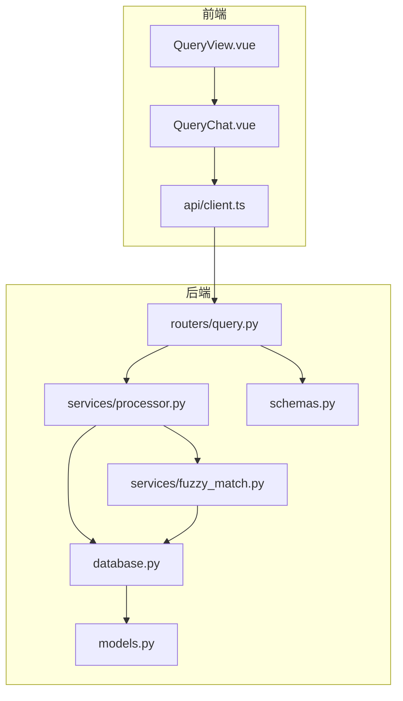
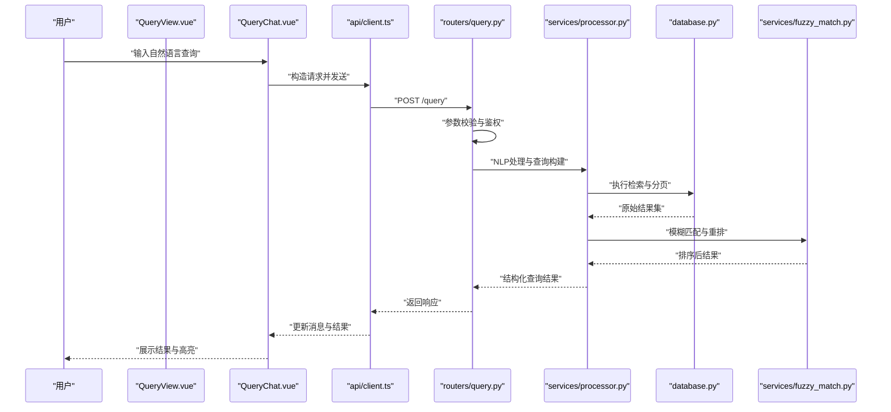
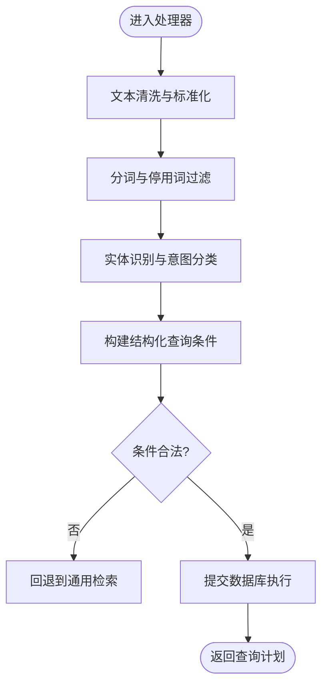
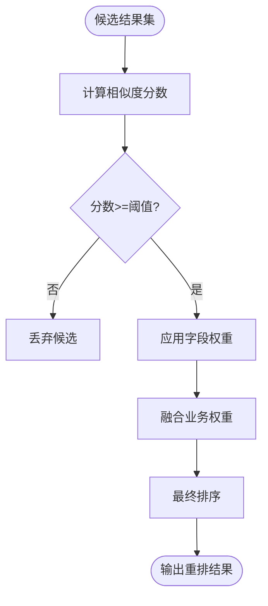
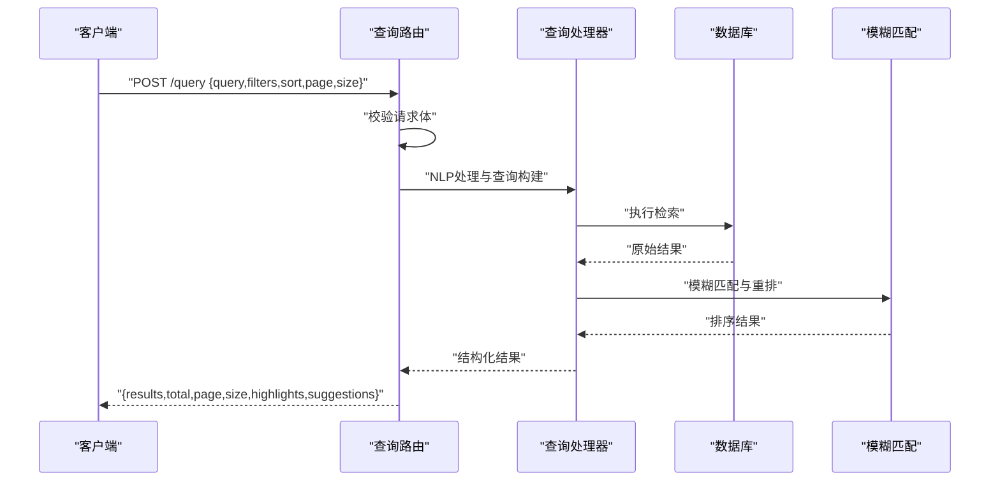
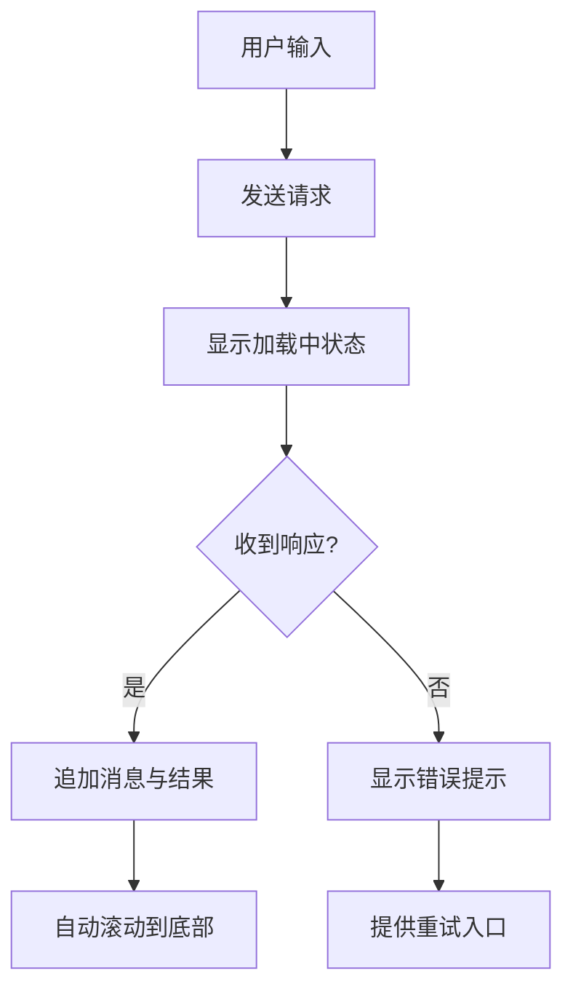
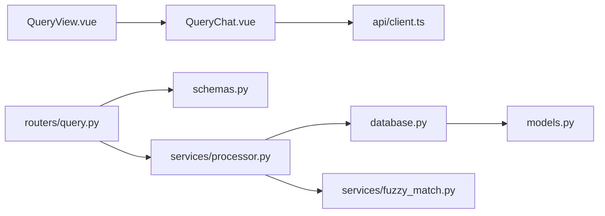

# 智能查询

<cite>
**本文引用的文件**   
- [backend/routers/query.py](file://backend/routers/query.py)
- [backend/services/processor.py](file://backend/services/processor.py)
- [backend/services/fuzzy_match.py](file://backend/services/fuzzy_match.py)
- [backend/models.py](file://backend/models.py)
- [backend/schemas.py](file://backend/schemas.py)
- [backend/database.py](file://backend/database.py)
- [frontend/src/components/QueryChat.vue](file://frontend/src/components/QueryChat.vue)
- [frontend/src/views/QueryView.vue](file://frontend/src/views/QueryView.vue)
- [frontend/src/api/client.ts](file://frontend/src/api/client.ts)
</cite>

## 目录
1. [简介](#简介)
2. [项目结构](#项目结构)
3. [核心组件](#核心组件)
4. [架构总览](#架构总览)
5. [详细组件分析](#详细组件分析)
6. [依赖关系分析](#依赖关系分析)
7. [性能考虑](#性能考虑)
8. [故障排查指南](#故障排查指南)
9. [结论](#结论)
10. [附录](#附录)

## 简介
本文件为 AdventureX 项目的“智能查询”功能提供全面文档，覆盖自然语言处理流程、查询解析算法、结果匹配策略；详细说明 QueryChat 组件的对话界面设计、消息处理逻辑与实时更新机制；文档化查询 API 的接口规范（查询语法、过滤条件、排序选项）；解释查询处理器的工作流程（文本预处理、关键词提取、语义分析）；并给出查询结果的展示方式、分页机制、结果高亮等说明。同时提供查询性能优化、索引策略与缓存配置建议，帮助开发者快速理解与扩展该功能。

## 项目结构
智能查询功能横跨前后端：
- 前端：QueryChat 组件负责对话式交互，QueryView 页面承载整体视图，client.ts 封装 HTTP 请求。
- 后端：query 路由暴露查询接口，processor 服务实现 NLP 与查询构建，fuzzy_match 服务负责模糊匹配与结果重排，models/schemas 定义数据模型与校验规则，database 提供数据库访问。

图表来源
- [frontend/src/views/QueryView.vue](file://frontend/src/views/QueryView.vue)
- [frontend/src/components/QueryChat.vue](file://frontend/src/components/QueryChat.vue)
- [frontend/src/api/client.ts](file://frontend/src/api/client.ts)
- [backend/routers/query.py](file://backend/routers/query.py)
- [backend/services/processor.py](file://backend/services/processor.py)
- [backend/services/fuzzy_match.py](file://backend/services/fuzzy_match.py)
- [backend/database.py](file://backend/database.py)
- [backend/models.py](file://backend/models.py)
- [backend/schemas.py](file://backend/schemas.py)

章节来源
- [frontend/src/views/QueryView.vue](file://frontend/src/views/QueryView.vue)
- [frontend/src/components/QueryChat.vue](file://frontend/src/components/QueryChat.vue)
- [frontend/src/api/client.ts](file://frontend/src/api/client.ts)
- [backend/routers/query.py](file://backend/routers/query.py)
- [backend/services/processor.py](file://backend/services/processor.py)
- [backend/services/fuzzy_match.py](file://backend/services/fuzzy_match.py)
- [backend/database.py](file://backend/database.py)
- [backend/models.py](file://backend/models.py)
- [backend/schemas.py](file://backend/schemas.py)

## 核心组件
- 查询路由（后端）：接收用户查询请求，进行参数校验，调用查询处理器生成查询计划，执行检索与匹配，返回结构化结果。
- 查询处理器（后端）：对输入文本进行清洗、分词、去停用词、实体识别与意图分类，将自然语言转换为结构化查询条件。
- 模糊匹配服务（后端）：基于相似度或编辑距离对候选结果进行二次排序与召回增强，支持阈值控制与权重调整。
- 数据库访问（后端）：封装查询执行、分页、排序与聚合操作，确保高性能与一致性。
- 查询聊天组件（前端）：提供对话式输入、消息列表渲染、实时滚动与加载状态反馈，调用 client.ts 发起请求。
- 查询页面（前端）：集成 QueryChat 组件，管理页面级状态与路由参数。

章节来源
- [backend/routers/query.py](file://backend/routers/query.py)
- [backend/services/processor.py](file://backend/services/processor.py)
- [backend/services/fuzzy_match.py](file://backend/services/fuzzy_match.py)
- [backend/database.py](file://backend/database.py)
- [frontend/src/components/QueryChat.vue](file://frontend/src/components/QueryChat.vue)
- [frontend/src/views/QueryView.vue](file://frontend/src/views/QueryView.vue)
- [frontend/src/api/client.ts](file://frontend/src/api/client.ts)

## 架构总览
智能查询的整体流程如下：
- 用户在 QueryChat 中输入自然语言查询。
- 前端通过 client.ts 向后端 query 路由发送请求。
- 后端路由校验请求体，调用 processor 进行 NLP 处理，生成结构化查询。
- 使用 database 层执行检索，再由 fuzzy_match 进行结果重排与增强。
- 最终返回包含结果集、分页信息与高亮片段的结构化响应。

图表来源
- [frontend/src/components/QueryChat.vue](file://frontend/src/components/QueryChat.vue)
- [frontend/src/api/client.ts](file://frontend/src/api/client.ts)
- [backend/routers/query.py](file://backend/routers/query.py)
- [backend/services/processor.py](file://backend/services/processor.py)
- [backend/services/fuzzy_match.py](file://backend/services/fuzzy_match.py)
- [backend/database.py](file://backend/database.py)

## 详细组件分析

### 查询处理器（NLP 与查询构建）
- 文本预处理：去除多余空白、统一编码、标点规范化、繁简转换（可选）。
- 分词与去停用词：采用中文分词库，移除常见停用词，保留名词、动词与关键修饰词。
- 实体识别与意图分类：识别时间、地点、人物、事件等实体，判断查询意图（如“查找记录”“统计趋势”）。
- 查询构建：将自然语言映射为结构化查询条件（字段过滤、范围查询、布尔组合），支持默认值与缺省补全。
- 错误与边界处理：对无效输入返回友好提示，对歧义意图进行澄清或降级处理。

图表来源
- [backend/services/processor.py](file://backend/services/processor.py)

章节来源
- [backend/services/processor.py](file://backend/services/processor.py)

### 模糊匹配服务（结果重排与增强）
- 相似度计算：基于编辑距离、余弦相似度或向量相似度对候选结果打分。
- 阈值控制：低于阈值的候选被过滤，避免低质量结果污染列表。
- 权重策略：按字段重要性加权（标题权重高于描述），支持动态权重配置。
- 融合排序：结合相关性得分与业务权重进行最终排序，保证用户体验。

图表来源
- [backend/services/fuzzy_match.py](file://backend/services/fuzzy_match.py)

章节来源
- [backend/services/fuzzy_match.py](file://backend/services/fuzzy_match.py)

### 查询路由与接口规范
- 接口路径与方法：POST /query（示例路径，具体以路由定义为准）。
- 请求体字段：
  - query: 字符串，用户自然语言输入
  - filters: 对象，字段过滤条件（如 {field: value, range: {min, max}}）
  - sort: 对象，排序选项（如 {field: asc|desc, limit: number}）
  - page: 整数，页码
  - size: 整数，每页条数
- 响应体字段：
  - results: 数组，查询结果条目
  - total: 整数，总条数
  - page: 整数，当前页码
  - size: 整数，每页条数
  - highlights: 对象，字段高亮片段
  - suggestions: 数组，相关建议或澄清问题
- 错误码：
  - 400：参数校验失败
  - 401/403：鉴权失败
  - 500：服务器内部错误

图表来源
- [backend/routers/query.py](file://backend/routers/query.py)
- [backend/services/processor.py](file://backend/services/processor.py)
- [backend/services/fuzzy_match.py](file://backend/services/fuzzy_match.py)
- [backend/database.py](file://backend/database.py)

章节来源
- [backend/routers/query.py](file://backend/routers/query.py)
- [backend/schemas.py](file://backend/schemas.py)

### 查询聊天组件（QueryChat）
- 界面设计：顶部显示系统提示与快捷指令，中部为消息列表（用户与系统消息区分样式），底部为输入框与发送按钮。
- 消息处理逻辑：
  - 用户输入回车或点击发送时，触发请求构建与发送。
  - 收到响应后，追加系统消息与结果卡片，支持展开/折叠详情。
  - 支持撤销、重试与清空历史。
- 实时更新机制：
  - 使用本地状态驱动 UI 更新，避免频繁重绘。
  - 长轮询或 WebSocket（若启用）用于流式结果推送。
  - 自动滚动到底部，保持最新内容可见。
- 错误与空状态：
  - 网络异常时显示重试提示。
  - 无结果时展示引导语与建议查询。

图表来源
- [frontend/src/components/QueryChat.vue](file://frontend/src/components/QueryChat.vue)
- [frontend/src/api/client.ts](file://frontend/src/api/client.ts)

章节来源
- [frontend/src/components/QueryChat.vue](file://frontend/src/components/QueryChat.vue)
- [frontend/src/api/client.ts](file://frontend/src/api/client.ts)

### 查询页面（QueryView）
- 职责：承载 QueryChat 组件，管理页面级状态（如主题、语言、历史记录）。
- 路由参数：支持通过 URL 传递初始查询与过滤器，便于分享与书签。
- 生命周期：在挂载时加载最近查询历史，卸载时清理定时器与事件监听。

章节来源
- [frontend/src/views/QueryView.vue](file://frontend/src/views/QueryView.vue)

## 依赖关系分析
- 前端依赖：
  - QueryChat 依赖 api/client.ts 进行 HTTP 通信。
  - QueryView 依赖 QueryChat 组件与 i18n 国际化资源。
- 后端依赖：
  - query 路由依赖 schemas 进行请求/响应校验。
  - processor 依赖 database 执行查询，依赖 fuzzy_match 进行结果重排。
  - models 定义数据表结构与关系，database 封装连接与事务。

图表来源
- [frontend/src/components/QueryChat.vue](file://frontend/src/components/QueryChat.vue)
- [frontend/src/api/client.ts](file://frontend/src/api/client.ts)
- [frontend/src/views/QueryView.vue](file://frontend/src/views/QueryView.vue)
- [backend/routers/query.py](file://backend/routers/query.py)
- [backend/schemas.py](file://backend/schemas.py)
- [backend/services/processor.py](file://backend/services/processor.py)
- [backend/services/fuzzy_match.py](file://backend/services/fuzzy_match.py)
- [backend/database.py](file://backend/database.py)
- [backend/models.py](file://backend/models.py)

章节来源
- [frontend/src/components/QueryChat.vue](file://frontend/src/components/QueryChat.vue)
- [frontend/src/api/client.ts](file://frontend/src/api/client.ts)
- [frontend/src/views/QueryView.vue](file://frontend/src/views/QueryView.vue)
- [backend/routers/query.py](file://backend/routers/query.py)
- [backend/schemas.py](file://backend/schemas.py)
- [backend/services/processor.py](file://backend/services/processor.py)
- [backend/services/fuzzy_match.py](file://backend/services/fuzzy_match.py)
- [backend/database.py](file://backend/database.py)
- [backend/models.py](file://backend/models.py)

## 性能考虑
- 查询性能优化：
  - 合理设置 page/size，避免一次性拉取大量数据。
  - 使用索引字段进行过滤与排序，减少全表扫描。
  - 对高频查询进行缓存（Redis/Memcached），设置合理的过期策略。
- 索引策略：
  - 对常用过滤字段建立 B-tree 索引。
  - 对全文搜索字段建立倒排索引或 ES 索引。
  - 复合索引覆盖常见查询模式（如 {status, created_at}）。
- 缓存配置：
  - 热点查询结果缓存，键包含 query+filters+sort+page。
  - 分层缓存：本地内存缓存 + 分布式缓存。
  - 缓存失效策略：写时失效或定时刷新。
- 前端优化：
  - 虚拟列表渲染大数据量结果。
  - 防抖输入，减少频繁请求。
  - 图片与媒体资源懒加载。

[本节为通用指导，不直接分析具体文件]

## 故障排查指南
- 常见问题：
  - 参数校验失败：检查请求体字段类型与必填项。
  - 鉴权失败：确认令牌有效且权限足够。
  - 数据库连接异常：检查连接池配置与网络连通性。
  - 模糊匹配效果差：调整阈值与权重参数。
- 调试建议：
  - 开启后端日志，记录请求体与查询计划。
  - 使用浏览器开发者工具查看网络请求与响应。
  - 对 processor 与 fuzzy_match 增加中间态日志。
- 恢复策略：
  - 自动重试与降级查询（回退到通用检索）。
  - 提供用户友好的错误提示与替代建议。

章节来源
- [backend/routers/query.py](file://backend/routers/query.py)
- [backend/services/processor.py](file://backend/services/processor.py)
- [backend/services/fuzzy_match.py](file://backend/services/fuzzy_match.py)
- [backend/database.py](file://backend/database.py)

## 结论
AdventureX 的智能查询功能通过前后端协作实现了自然语言到结构化查询的高效转换，结合模糊匹配与分页高亮提升了用户体验。建议在现有基础上进一步优化索引与缓存策略，完善错误处理与可观测性，持续改进查询准确率与响应速度。

[本节为总结性内容，不直接分析具体文件]

## 附录
- 术语表：
  - NLP：自然语言处理
  - 模糊匹配：基于相似度的结果重排技术
  - 分页：将结果集划分为多页以提升加载性能
  - 高亮：在结果中突出显示匹配的关键词片段
- 参考文件：
  - 查询路由与接口定义见 [backend/routers/query.py](file://backend/routers/query.py)
  - NLP 处理与查询构建见 [backend/services/processor.py](file://backend/services/processor.py)
  - 模糊匹配与重排见 [backend/services/fuzzy_match.py](file://backend/services/fuzzy_match.py)
  - 数据模型与校验见 [backend/models.py](file://backend/models.py)、[backend/schemas.py](file://backend/schemas.py)
  - 数据库访问见 [backend/database.py](file://backend/database.py)
  - 前端组件与 API 客户端见 [frontend/src/components/QueryChat.vue](file://frontend/src/components/QueryChat.vue)、[frontend/src/api/client.ts](file://frontend/src/api/client.ts)