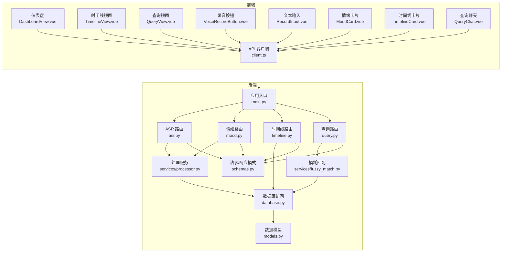
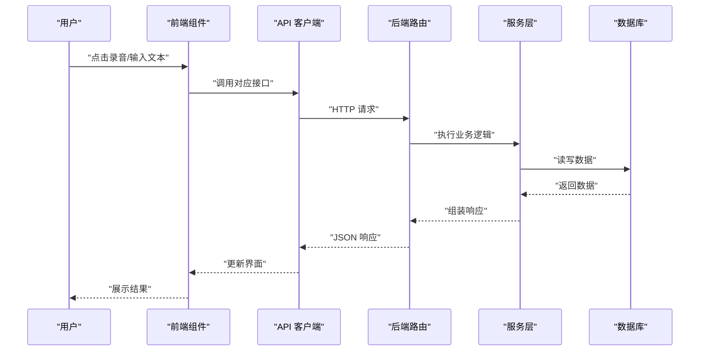
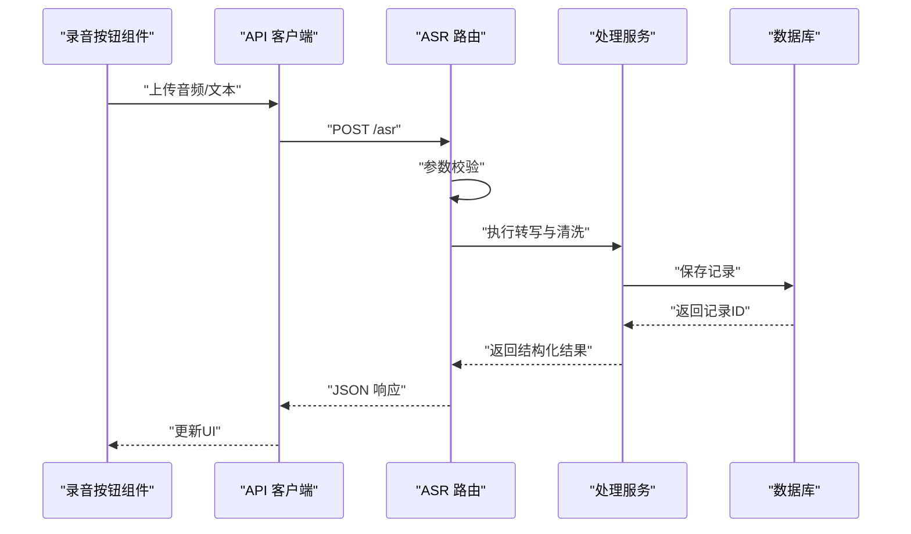
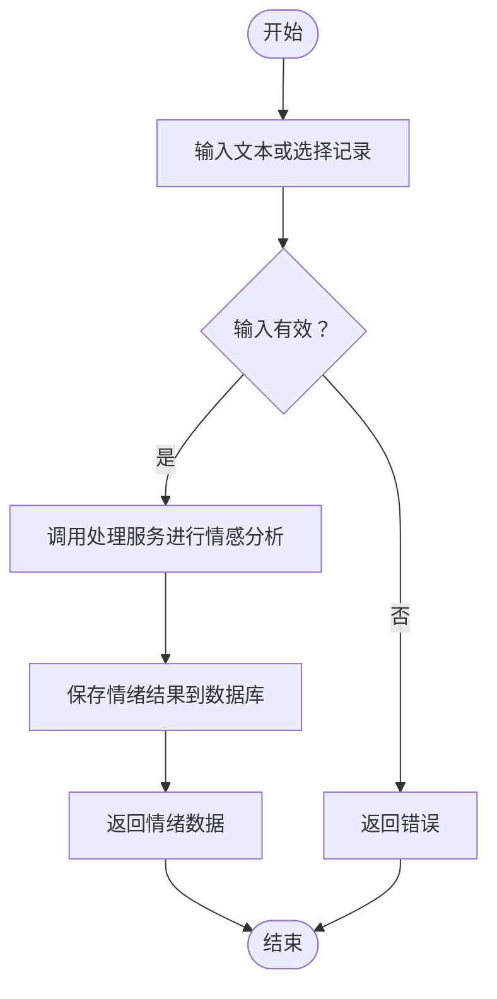
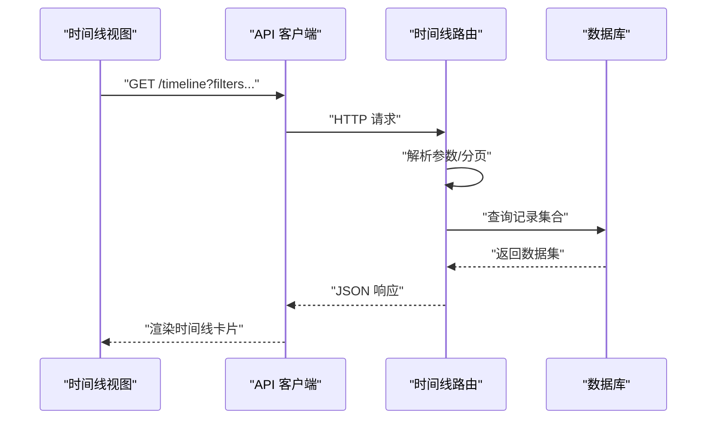
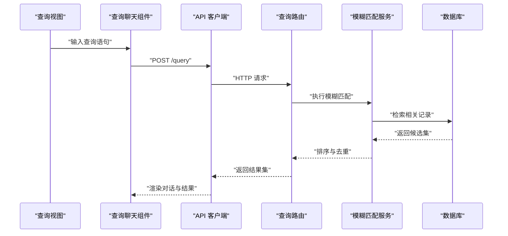
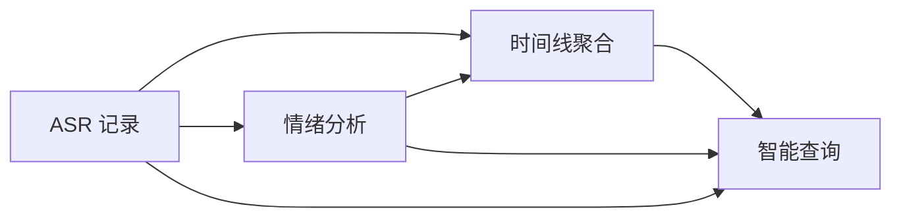
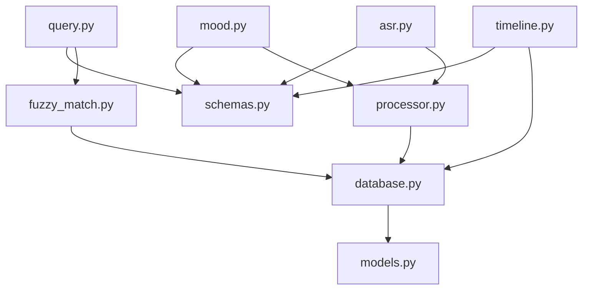

# 核心功能

<cite>
**本文引用的文件**   
- [backend/main.py](file://backend/main.py)
- [backend/config.py](file://backend/config.py)
- [backend/database.py](file://backend/database.py)
- [backend/models.py](file://backend/models.py)
- [backend/schemas.py](file://backend/schemas.py)
- [backend/security.py](file://backend/security.py)
- [backend/routers/asr.py](file://backend/routers/asr.py)
- [backend/routers/mood.py](file://backend/routers/mood.py)
- [backend/routers/timeline.py](file://backend/routers/timeline.py)
- [backend/routers/query.py](file://backend/routers/query.py)
- [backend/routers/records.py](file://backend/routers/records.py)
- [backend/routers/context.py](file://backend/routers/context.py)
- [backend/routers/export.py](file://backend/routers/export.py)
- [backend/routers/merge.py](file://backend/routers/merge.py)
- [backend/routers/process.py](file://backend/routers/process.py)
- [backend/routers/sync.py](file://backend/routers/sync.py)
- [backend/routers/tasks.py](file://backend/routers/tasks.py)
- [backend/services/processor.py](file://backend/services/processor.py)
- [backend/services/fuzzy_match.py](file://backend/services/fuzzy_match.py)
- [frontend/src/api/client.ts](file://frontend/src/api/client.ts)
- [frontend/src/views/DashboardView.vue](file://frontend/src/views/DashboardView.vue)
- [frontend/src/views/TimelineView.vue](file://frontend/src/views/TimelineView.vue)
- [frontend/src/views/QueryView.vue](file://frontend/src/views/QueryView.vue)
- [frontend/src/components/VoiceRecordButton.vue](file://frontend/src/components/VoiceRecordButton.vue)
- [frontend/src/components/RecordInput.vue](file://frontend/src/components/RecordInput.vue)
- [frontend/src/components/MoodCard.vue](file://frontend/src/components/MoodCard.vue)
- [frontend/src/components/TimelineCard.vue](file://frontend/src/components/TimelineCard.vue)
- [frontend/src/components/QueryChat.vue](file://frontend/src/components/QueryChat.vue)
</cite>

## 目录
1. [简介](#简介)
2. [项目结构](#项目结构)
3. [核心组件](#核心组件)
4. [架构总览](#架构总览)
5. [详细组件分析](#详细组件分析)
6. [依赖关系分析](#依赖关系分析)
7. [性能考量](#性能考量)
8. [故障排查指南](#故障排查指南)
9. [结论](#结论)
10. [附录](#附录)

## 简介
本文件为 AdventureX 项目的“核心功能”概览文档，聚焦以下四大模块：语音识别记录、情感分析、时间线管理、智能查询。文档从系统架构、数据流转、用户交互与协作机制入手，帮助初学者建立整体认知框架，并为高级用户提供深入理解的基础。

## 项目结构
AdventureX 采用前后端分离架构：
- 后端（FastAPI）提供 REST API，包含路由层、服务层、数据模型与数据库访问。
- 前端（Vue 3 + TypeScript）通过 API 客户端调用后端接口，渲染页面与交互组件。

图表来源
- [backend/main.py](file://backend/main.py)
- [backend/routers/asr.py](file://backend/routers/asr.py)
- [backend/routers/mood.py](file://backend/routers/mood.py)
- [backend/routers/timeline.py](file://backend/routers/timeline.py)
- [backend/routers/query.py](file://backend/routers/query.py)
- [backend/services/processor.py](file://backend/services/processor.py)
- [backend/services/fuzzy_match.py](file://backend/services/fuzzy_match.py)
- [backend/database.py](file://backend/database.py)
- [backend/models.py](file://backend/models.py)
- [backend/schemas.py](file://backend/schemas.py)
- [frontend/src/api/client.ts](file://frontend/src/api/client.ts)
- [frontend/src/views/DashboardView.vue](file://frontend/src/views/DashboardView.vue)
- [frontend/src/views/TimelineView.vue](file://frontend/src/views/TimelineView.vue)
- [frontend/src/views/QueryView.vue](file://frontend/src/views/QueryView.vue)
- [frontend/src/components/VoiceRecordButton.vue](file://frontend/src/components/VoiceRecordButton.vue)
- [frontend/src/components/RecordInput.vue](file://frontend/src/components/RecordInput.vue)
- [frontend/src/components/MoodCard.vue](file://frontend/src/components/MoodCard.vue)
- [frontend/src/components/TimelineCard.vue](file://frontend/src/components/TimelineCard.vue)
- [frontend/src/components/QueryChat.vue](file://frontend/src/components/QueryChat.vue)

章节来源
- [backend/main.py](file://backend/main.py)
- [frontend/src/api/client.ts](file://frontend/src/api/client.ts)

## 核心组件
- 语音识别记录（ASR）
  - 作用：将音频流或文件上传至后端，进行语音转文本，并持久化记录。
  - 关键路径：前端录音组件 -> API 客户端 -> ASR 路由 -> 处理服务 -> 数据库。
- 情感分析（Mood）
  - 作用：对文本内容进行情感倾向分析，生成情绪标签/分数，便于可视化展示。
  - 关键路径：文本输入/ASR 结果 -> 情绪路由 -> 处理服务 -> 数据库。
- 时间线管理（Timeline）
  - 作用：按时间顺序组织记录，支持浏览、筛选与导出。
  - 关键路径：时间线路由 -> 数据库 -> 前端时间线视图与卡片。
- 智能查询（Query）
  - 作用：基于自然语言或关键词检索历史记录，支持模糊匹配与上下文关联。
  - 关键路径：查询路由 -> 模糊匹配服务 -> 数据库 -> 前端查询聊天组件。

章节来源
- [backend/routers/asr.py](file://backend/routers/asr.py)
- [backend/routers/mood.py](file://backend/routers/mood.py)
- [backend/routers/timeline.py](file://backend/routers/timeline.py)
- [backend/routers/query.py](file://backend/routers/query.py)
- [backend/services/processor.py](file://backend/services/processor.py)
- [backend/services/fuzzy_match.py](file://backend/services/fuzzy_match.py)
- [backend/database.py](file://backend/database.py)
- [backend/models.py](file://backend/models.py)
- [backend/schemas.py](file://backend/schemas.py)
- [frontend/src/components/VoiceRecordButton.vue](file://frontend/src/components/VoiceRecordButton.vue)
- [frontend/src/components/RecordInput.vue](file://frontend/src/components/RecordInput.vue)
- [frontend/src/components/MoodCard.vue](file://frontend/src/components/MoodCard.vue)
- [frontend/src/components/TimelineCard.vue](file://frontend/src/components/TimelineCard.vue)
- [frontend/src/components/QueryChat.vue](file://frontend/src/components/QueryChat.vue)

## 架构总览
系统以 FastAPI 作为后端服务网关，统一注册路由；前端通过统一的 API 客户端发起请求。数据处理由服务层封装，数据库访问与模型定义解耦，保证高内聚低耦合。

图表来源
- [backend/main.py](file://backend/main.py)
- [backend/routers/asr.py](file://backend/routers/asr.py)
- [backend/routers/mood.py](file://backend/routers/mood.py)
- [backend/routers/timeline.py](file://backend/routers/timeline.py)
- [backend/routers/query.py](file://backend/routers/query.py)
- [backend/services/processor.py](file://backend/services/processor.py)
- [backend/services/fuzzy_match.py](file://backend/services/fuzzy_match.py)
- [backend/database.py](file://backend/database.py)
- [frontend/src/api/client.ts](file://frontend/src/api/client.ts)

## 详细组件分析

### 语音识别记录（ASR）
- 工作原理
  - 前端采集音频或接收文本输入，通过 API 客户端发送到后端 ASR 路由。
  - 路由校验请求体后，调用处理服务完成转写与清洗，写入数据库。
  - 返回结构化记录供前端展示与后续分析使用。
- 用户交互
  - 录音按钮触发录制与上传；文本输入框直接提交文本。
- 数据流转
  - 前端组件 -> API 客户端 -> ASR 路由 -> 处理服务 -> 数据库 -> 前端列表/详情。

图表来源
- [backend/routers/asr.py](file://backend/routers/asr.py)
- [backend/services/processor.py](file://backend/services/processor.py)
- [backend/database.py](file://backend/database.py)
- [frontend/src/components/VoiceRecordButton.vue](file://frontend/src/components/VoiceRecordButton.vue)
- [frontend/src/components/RecordInput.vue](file://frontend/src/components/RecordInput.vue)
- [frontend/src/api/client.ts](file://frontend/src/api/client.ts)

章节来源
- [backend/routers/asr.py](file://backend/routers/asr.py)
- [backend/services/processor.py](file://backend/services/processor.py)
- [backend/database.py](file://backend/database.py)
- [frontend/src/components/VoiceRecordButton.vue](file://frontend/src/components/VoiceRecordButton.vue)
- [frontend/src/components/RecordInput.vue](file://frontend/src/components/RecordInput.vue)
- [frontend/src/api/client.ts](file://frontend/src/api/client.ts)

### 情感分析（Mood）
- 工作原理
  - 对文本内容进行分析，输出情绪标签或分数，用于统计与可视化。
  - 路由接收文本或记录ID，调用处理服务计算情绪，落库并返回。
- 用户交互
  - 在记录详情页或批量操作中选择“分析情绪”，查看情绪卡片。
- 数据流转
  - 文本/记录 -> 情绪路由 -> 处理服务 -> 数据库 -> 情绪卡片展示。

图表来源
- [backend/routers/mood.py](file://backend/routers/mood.py)
- [backend/services/processor.py](file://backend/services/processor.py)
- [backend/database.py](file://backend/database.py)
- [frontend/src/components/MoodCard.vue](file://frontend/src/components/MoodCard.vue)

章节来源
- [backend/routers/mood.py](file://backend/routers/mood.py)
- [backend/services/processor.py](file://backend/services/processor.py)
- [backend/database.py](file://backend/database.py)
- [frontend/src/components/MoodCard.vue](file://frontend/src/components/MoodCard.vue)

### 时间线管理（Timeline）
- 工作原理
  - 按时间维度聚合记录，支持分页、筛选与导出。
  - 路由负责查询条件解析、排序与分页，服务层与数据库交互获取数据。
- 用户交互
  - 时间线视图加载列表，用户可切换日期范围、关键词过滤。
- 数据流转
  - 前端视图 -> API 客户端 -> 时间线路由 -> 数据库 -> 前端卡片渲染。

图表来源
- [backend/routers/timeline.py](file://backend/routers/timeline.py)
- [backend/database.py](file://backend/database.py)
- [frontend/src/views/TimelineView.vue](file://frontend/src/views/TimelineView.vue)
- [frontend/src/components/TimelineCard.vue](file://frontend/src/components/TimelineCard.vue)
- [frontend/src/api/client.ts](file://frontend/src/api/client.ts)

章节来源
- [backend/routers/timeline.py](file://backend/routers/timeline.py)
- [backend/database.py](file://backend/database.py)
- [frontend/src/views/TimelineView.vue](file://frontend/src/views/TimelineView.vue)
- [frontend/src/components/TimelineCard.vue](file://frontend/src/components/TimelineCard.vue)
- [frontend/src/api/client.ts](file://frontend/src/api/client.ts)

### 智能查询（Query）
- 工作原理
  - 基于自然语言或关键词检索历史记录，结合模糊匹配提升召回率。
  - 查询路由接收查询语句，调用模糊匹配服务进行语义近似搜索，返回相关记录。
- 用户交互
  - 查询视图提供对话式输入，实时显示匹配结果与上下文摘要。
- 数据流转
  - 查询输入 -> 查询路由 -> 模糊匹配服务 -> 数据库 -> 前端聊天组件展示。

图表来源
- [backend/routers/query.py](file://backend/routers/query.py)
- [backend/services/fuzzy_match.py](file://backend/services/fuzzy_match.py)
- [backend/database.py](file://backend/database.py)
- [frontend/src/views/QueryView.vue](file://frontend/src/views/QueryView.vue)
- [frontend/src/components/QueryChat.vue](file://frontend/src/components/QueryChat.vue)
- [frontend/src/api/client.ts](file://frontend/src/api/client.ts)

章节来源
- [backend/routers/query.py](file://backend/routers/query.py)
- [backend/services/fuzzy_match.py](file://backend/services/fuzzy_match.py)
- [backend/database.py](file://backend/database.py)
- [frontend/src/views/QueryView.vue](file://frontend/src/views/QueryView.vue)
- [frontend/src/components/QueryChat.vue](file://frontend/src/components/QueryChat.vue)
- [frontend/src/api/client.ts](file://frontend/src/api/client.ts)

### 功能协作与数据共享
- 协作关系
  - ASR 产出文本记录，Mood 基于文本生成情绪标签，Timeline 聚合所有记录形成时间序列，Query 跨维度检索并关联上下文。
- 数据共享机制
  - 统一的数据模型与请求/响应模式确保前后端契约一致。
  - 数据库作为单一事实源，各路由与服务通过一致的访问层读取与写入。

图表来源
- [backend/models.py](file://backend/models.py)
- [backend/schemas.py](file://backend/schemas.py)
- [backend/database.py](file://backend/database.py)

章节来源
- [backend/models.py](file://backend/models.py)
- [backend/schemas.py](file://backend/schemas.py)
- [backend/database.py](file://backend/database.py)

## 依赖关系分析
- 后端内部依赖
  - 路由层依赖服务层，服务层依赖数据库访问与模型定义。
  - 请求/响应模式集中定义，保证接口一致性。
- 前后端依赖
  - 前端通过 API 客户端统一调用后端路由，避免硬编码 URL。
  - 视图与组件仅关注 UI 状态与交互，不直接处理网络细节。

图表来源
- [backend/routers/asr.py](file://backend/routers/asr.py)
- [backend/routers/mood.py](file://backend/routers/mood.py)
- [backend/routers/timeline.py](file://backend/routers/timeline.py)
- [backend/routers/query.py](file://backend/routers/query.py)
- [backend/services/processor.py](file://backend/services/processor.py)
- [backend/services/fuzzy_match.py](file://backend/services/fuzzy_match.py)
- [backend/database.py](file://backend/database.py)
- [backend/models.py](file://backend/models.py)
- [backend/schemas.py](file://backend/schemas.py)

章节来源
- [backend/routers/asr.py](file://backend/routers/asr.py)
- [backend/routers/mood.py](file://backend/routers/mood.py)
- [backend/routers/timeline.py](file://backend/routers/timeline.py)
- [backend/routers/query.py](file://backend/routers/query.py)
- [backend/services/processor.py](file://backend/services/processor.py)
- [backend/services/fuzzy_match.py](file://backend/services/fuzzy_match.py)
- [backend/database.py](file://backend/database.py)
- [backend/models.py](file://backend/models.py)
- [backend/schemas.py](file://backend/schemas.py)

## 性能考量
- 异步与并发
  - 后端路由与服务层应充分利用异步能力，减少 I/O 阻塞。
- 缓存策略
  - 对频繁查询的时间线与热门记录可引入缓存层，降低数据库压力。
- 分页与限流
  - 时间线查询默认分页，避免一次性加载大量数据；对高频接口增加限流保护。
- 资源优化
  - 音频上传与转写建议分片与后台任务处理，前端提供进度反馈。

[本节为通用指导，无需特定文件引用]

## 故障排查指南
- 常见问题定位
  - 接口报错：检查路由参数校验与请求体是否符合 schemas 定义。
  - 数据不一致：核对 models 字段映射与数据库实际结构是否一致。
  - 前端无响应：确认 API 客户端基础地址、超时设置与错误处理。
- 调试建议
  - 启用后端日志，记录关键步骤的输入输出。
  - 前端开启网络面板，观察请求/响应结构与状态码。
  - 对模糊匹配与情绪分析服务添加单元测试，覆盖边界用例。

章节来源
- [backend/schemas.py](file://backend/schemas.py)
- [backend/models.py](file://backend/models.py)
- [backend/database.py](file://backend/database.py)
- [frontend/src/api/client.ts](file://frontend/src/api/client.ts)

## 结论
AdventureX 的核心功能围绕“记录—分析—组织—检索”闭环展开。ASR 提供原始素材，Mood 增强语义理解，Timeline 构建时空视角，Query 实现高效检索。通过清晰的分层架构与统一的数据契约，系统具备良好的扩展性与可维护性。

[本节为总结性内容，无需特定文件引用]

## 附录
- 典型使用场景示例
  - 录音转写与情绪标注：用户在录音按钮中录制一段话，系统自动转写并分析情绪，随后在时间线中查看该条记录的情绪标签。
  - 时间线回顾与导出：用户在时间线视图中选择日期范围，筛选出相关记录，导出为文件或分享链接。
  - 智能问答与上下文关联：用户在查询视图输入“昨天关于项目的讨论”，系统返回相关记录并展示上下文摘要。

[本节为概念性说明，无需特定文件引用]