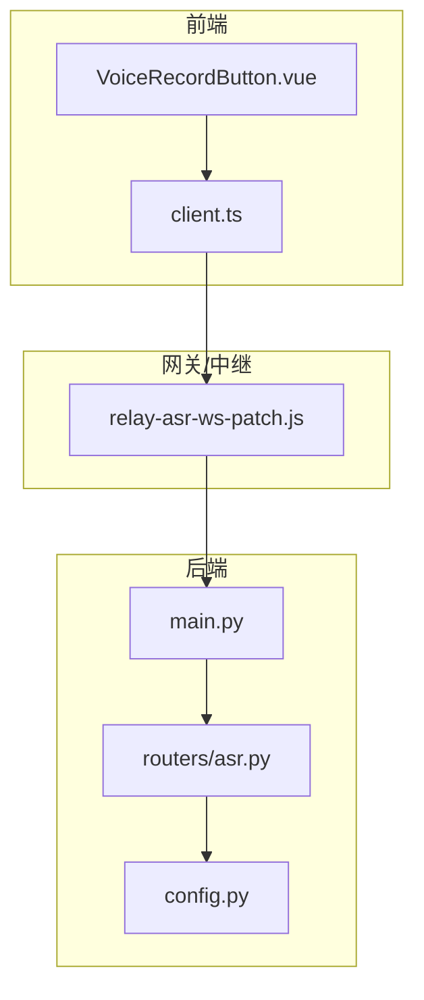
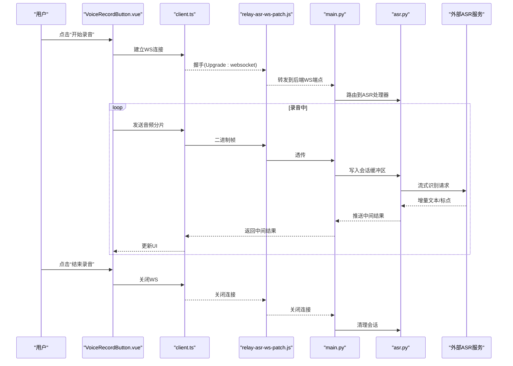
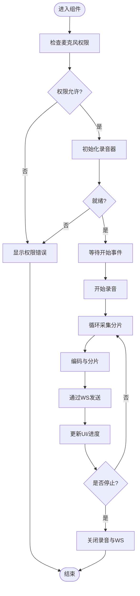
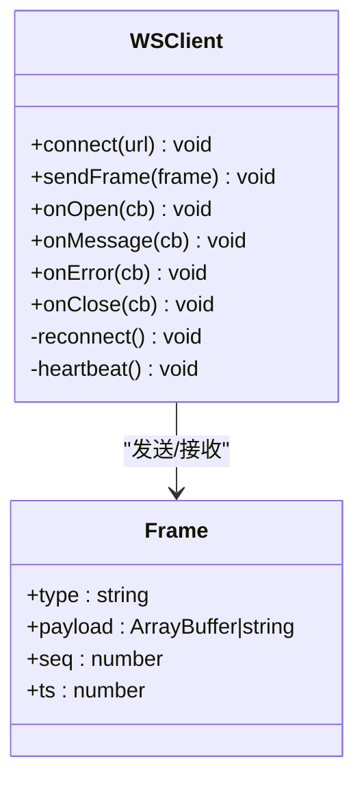
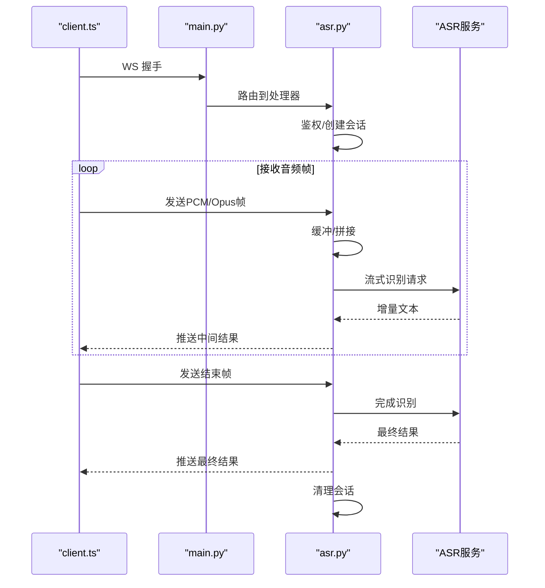
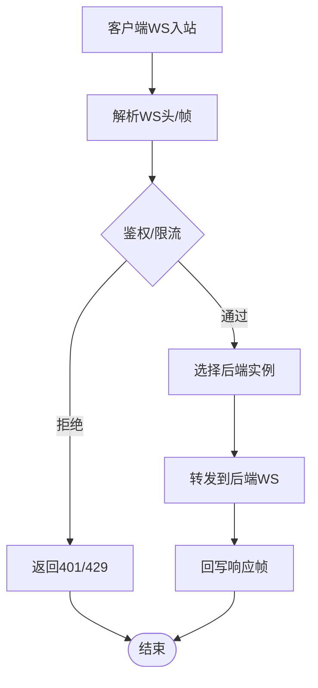
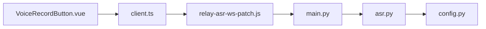
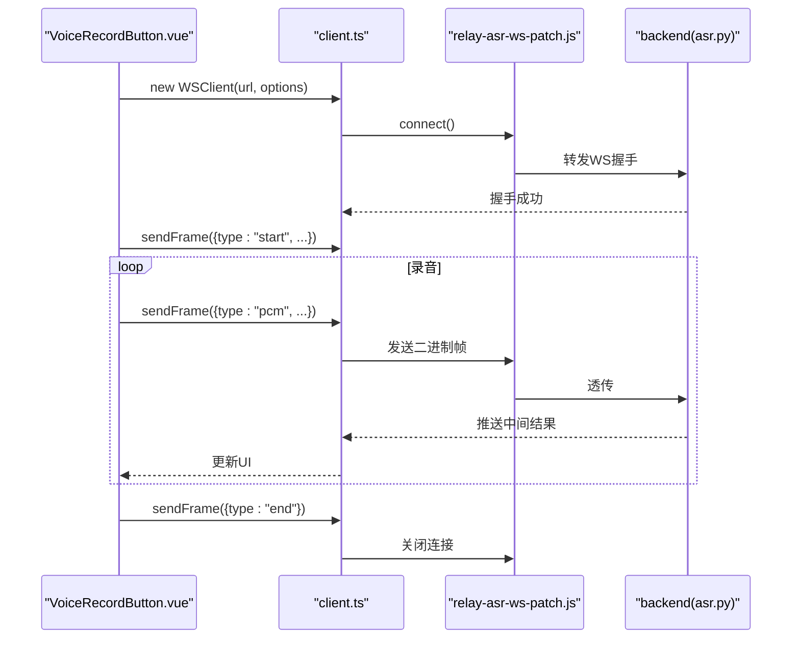

# 语音识别记录

<cite>
**本文引用的文件**   
- [backend/routers/asr.py](file://backend/routers/asr.py)
- [data/relay-asr-ws-patch.js](file://data/relay-asr-ws-patch.js)
- [frontend/src/components/VoiceRecordButton.vue](file://frontend/src/components/VoiceRecordButton.vue)
- [frontend/src/api/client.ts](file://frontend/src/api/client.ts)
- [backend/main.py](file://backend/main.py)
- [backend/config.py](file://backend/config.py)
</cite>

## 目录
1. [简介](#简介)
2. [项目结构](#项目结构)
3. [核心组件](#核心组件)
4. [架构总览](#架构总览)
5. [详细组件分析](#详细组件分析)
6. [依赖关系分析](#依赖关系分析)
7. [性能考虑](#性能考虑)
8. [故障排查指南](#故障排查指南)
9. [结论](#结论)
10. [附录：API参考与集成示例](#附录api参考与集成示例)

## 简介
本文件为 AdventureX 项目的“语音识别记录”功能提供系统化文档，覆盖以下方面：
- WebSocket 实时语音传输机制（前端采集、流式转发、后端接收）
- ASR 服务集成（路由、协议、错误处理）
- 音频数据处理流程（格式、采样率、分片策略）
- VoiceRecordButton 组件实现原理（录音控制、格式转换、错误处理）
- ASR 路由器 API 接口说明（请求参数、响应格式、状态码）
- 配置项、性能优化建议与常见问题解决方案
- 实际集成与使用示例（以代码片段路径引用为主）

## 项目结构
围绕语音识别记录功能，关键文件分布如下：
- 后端 ASR 路由：backend/routers/asr.py
- 前端录音按钮组件：frontend/src/components/VoiceRecordButton.vue
- 前端 API 客户端封装：frontend/src/api/client.ts
- WebSocket 中继补丁脚本：data/relay-asr-ws-patch.js
- 应用入口与挂载点：backend/main.py
- 后端配置：backend/config.py

**图示来源** 
- [frontend/src/components/VoiceRecordButton.vue](file://frontend/src/components/VoiceRecordButton.vue)
- [frontend/src/api/client.ts](file://frontend/src/api/client.ts)
- [data/relay-asr-ws-patch.js](file://data/relay-asr-ws-patch.js)
- [backend/main.py](file://backend/main.py)
- [backend/routers/asr.py](file://backend/routers/asr.py)
- [backend/config.py](file://backend/config.py)

**章节来源**
- [backend/routers/asr.py](file://backend/routers/asr.py)
- [data/relay-asr-ws-patch.js](file://data/relay-asr-ws-patch.js)
- [frontend/src/components/VoiceRecordButton.vue](file://frontend/src/components/VoiceRecordButton.vue)
- [frontend/src/api/client.ts](file://frontend/src/api/client.ts)
- [backend/main.py](file://backend/main.py)
- [backend/config.py](file://backend/config.py)

## 核心组件
- 前端录音按钮组件（VoiceRecordButton.vue）
  - 负责麦克风权限获取、录音开始/停止、音频数据编码与分片发送、UI 状态管理、错误提示与重试。
- 前端 API 客户端（client.ts）
  - 封装 WebSocket 连接、心跳保活、消息编解码、重连策略、事件回调。
- 后端 ASR 路由（asr.py）
  - 定义 WebSocket 端点、鉴权与会话管理、音频帧接收与缓冲、ASR 引擎调用、结果回推。
- WebSocket 中继（relay-asr-ws-patch.js）
  - 在部署层对 WS 进行透传或协议适配，处理跨域、代理、负载均衡等场景。
- 应用入口与配置（main.py, config.py）
  - 注册路由、加载配置、设置超时与并发参数。

**章节来源**
- [frontend/src/components/VoiceRecordButton.vue](file://frontend/src/components/VoiceRecordButton.vue)
- [frontend/src/api/client.ts](file://frontend/src/api/client.ts)
- [backend/routers/asr.py](file://backend/routers/asr.py)
- [data/relay-asr-ws-patch.js](file://data/relay-asr-ws-patch.js)
- [backend/main.py](file://backend/main.py)
- [backend/config.py](file://backend/config.py)

## 架构总览
整体数据流：浏览器采集音频 → 前端组件编码分片 → WebSocket 发送至中继 → 后端 ASR 路由接收并调用 ASR 服务 → 结果通过同一 WS 通道回推至前端。

**图示来源** 
- [frontend/src/components/VoiceRecordButton.vue](file://frontend/src/components/VoiceRecordButton.vue)
- [frontend/src/api/client.ts](file://frontend/src/api/client.ts)
- [data/relay-asr-ws-patch.js](file://data/relay-asr-ws-patch.js)
- [backend/main.py](file://backend/main.py)
- [backend/routers/asr.py](file://backend/routers/asr.py)

## 详细组件分析

### VoiceRecordButton 组件
职责与行为：
- 录音生命周期：初始化 MediaStream、创建 AudioWorklet/Recorder、开始/暂停/停止、资源释放。
- 音频格式与分片：将 PCM 转换为适合网络传输的格式（如 Opus/PCM16），按固定时长切分帧，附带时间戳与序列号。
- 错误处理：捕获权限拒绝、设备不可用、编码失败、网络异常；提供降级与重试策略。
- UI 状态：显示录音时长、波形指示、错误提示、最终识别结果展示。

**图示来源** 
- [frontend/src/components/VoiceRecordButton.vue](file://frontend/src/components/VoiceRecordButton.vue)

**章节来源**
- [frontend/src/components/VoiceRecordButton.vue](file://frontend/src/components/VoiceRecordButton.vue)

### 前端 API 客户端（client.ts）
职责与行为：
- WS 连接管理：URL 构建、自动重连、指数退避、心跳保活。
- 消息协议：定义帧类型（start/pcm/end/control）、载荷结构、校验字段。
- 事件回调：onOpen/onMessage/onError/onClose，供组件订阅。
- 错误恢复：断线重连、丢包检测、乱序重组（如需）。

**图示来源** 
- [frontend/src/api/client.ts](file://frontend/src/api/client.ts)

**章节来源**
- [frontend/src/api/client.ts](file://frontend/src/api/client.ts)

### 后端 ASR 路由（asr.py）
职责与行为：
- WS 端点：鉴权、会话创建、限流与配额控制。
- 帧处理：累积音频帧、触发识别、增量结果回推、结束聚合。
- 错误处理：上游 ASR 服务异常、超时、格式不匹配、会话过期。
- 配置读取：从 config.py 加载 ASR 地址、模型、采样率、分片大小等。

**图示来源** 
- [backend/routers/asr.py](file://backend/routers/asr.py)
- [backend/main.py](file://backend/main.py)

**章节来源**
- [backend/routers/asr.py](file://backend/routers/asr.py)
- [backend/main.py](file://backend/main.py)

### WebSocket 中继（relay-asr-ws-patch.js）
职责与行为：
- 协议透传：保持 WS 头部与二进制帧完整。
- 负载均衡/多实例：根据会话ID分发到不同后端实例。
- 安全与限流：TLS 终止、速率限制、黑名单。
- 调试：日志、指标上报、延迟统计。

**图示来源** 
- [data/relay-asr-ws-patch.js](file://data/relay-asr-ws-patch.js)

**章节来源**
- [data/relay-asr-ws-patch.js](file://data/relay-asr-ws-patch.js)

## 依赖关系分析
- 前端依赖：MediaRecorder/AudioContext、WebSocket、可选的编码器库（如 opus-recorder）。
- 中继依赖：Node.js 运行时、ws/http-proxy、TLS 模块。
- 后端依赖：FastAPI/Starlette（WS）、异步 I/O、ASR SDK/HTTP 客户端。
- 配置依赖：环境变量或配置文件（采样率、分片大小、超时、重试次数）。

**图示来源** 
- [frontend/src/components/VoiceRecordButton.vue](file://frontend/src/components/VoiceRecordButton.vue)
- [frontend/src/api/client.ts](file://frontend/src/api/client.ts)
- [data/relay-asr-ws-patch.js](file://data/relay-asr-ws-patch.js)
- [backend/main.py](file://backend/main.py)
- [backend/routers/asr.py](file://backend/routers/asr.py)
- [backend/config.py](file://backend/config.py)

**章节来源**
- [frontend/src/components/VoiceRecordButton.vue](file://frontend/src/components/VoiceRecordButton.vue)
- [frontend/src/api/client.ts](file://frontend/src/api/client.ts)
- [data/relay-asr-ws-patch.js](file://data/relay-asr-ws-patch.js)
- [backend/main.py](file://backend/main.py)
- [backend/routers/asr.py](file://backend/routers/asr.py)
- [backend/config.py](file://backend/config.py)

## 性能考虑
- 音频编码与分片
  - 优先使用低延迟编码器（如 Opus），合理设置比特率与帧长（如 20–40ms）。
  - 控制单帧大小（例如 1–4KB），避免过大导致抖动与拥塞。
- 网络与队列
  - 启用心跳与背压，防止前端堆积；后端采用异步队列缓冲，避免阻塞。
  - 合理设置超时与重试（指数退避），减少雪崩效应。
- 服务端吞吐
  - 使用连接池与连接复用，限制并发会话数，按 CPU/内存动态扩缩容。
  - 对 ASR 服务进行缓存与批处理（非实时部分），降低延迟。
- 前端渲染
  - 节流 UI 更新，避免每帧重绘；合并中间结果展示。
- 监控与可观测性
  - 采集端到端延迟、丢包率、重连次数、错误码分布，用于容量规划与调优。

[本节为通用指导，无需特定文件来源]

## 故障排查指南
- 无法获取麦克风权限
  - 检查浏览器安全上下文（HTTPS）、用户授权弹窗、权限策略。
- 连接失败或频繁断开
  - 检查中继 TLS、反向代理配置、防火墙与端口映射；查看心跳与重连日志。
- 音频无声或杂音
  - 确认采样率一致（如 16kHz）、声道数（单声道）、编码格式匹配；检查设备默认输入。
- 识别结果不准确
  - 调整噪声抑制、VAD 阈值、ASR 语言模型；检查网络抖动导致的丢帧。
- 后端超时或 OOM
  - 增大超时、限制会话长度、增加内存与 CPU 配额；检查未释放的会话与缓冲区。

**章节来源**
- [frontend/src/components/VoiceRecordButton.vue](file://frontend/src/components/VoiceRecordButton.vue)
- [frontend/src/api/client.ts](file://frontend/src/api/client.ts)
- [backend/routers/asr.py](file://backend/routers/asr.py)
- [data/relay-asr-ws-patch.js](file://data/relay-asr-ws-patch.js)

## 结论
本方案通过前端高效采集与编码、可靠的中继转发、后端的流式 ASR 处理，实现了低延迟、高可用的语音识别记录能力。合理的配置与优化策略能显著提升用户体验与系统稳定性。建议在上线前完成端到端压测与故障演练，确保在真实流量下的鲁棒性。

[本节为总结，无需特定文件来源]

## 附录：API参考与集成示例

### ASR WebSocket 接口规范
- 端点
  - ws(s)://host/ws/asr?token=...
- 连接阶段
  - 客户端发起 WS 握手，携带鉴权 token。
  - 服务端返回握手成功或错误码（如 401/403）。
- 消息协议（建议）
  - start：{ type:"start", sample_rate:int, channels:int, codec:string }
  - pcm：{ type:"pcm", seq:int, ts:number, data:ArrayBuffer }
  - end：{ type:"end" }
  - control：{ type:"control", action:"pause/resume/cancel" }
  - result：{ type:"result", text:string, is_final:boolean, confidence:float }
- 状态码
  - 101：切换协议成功
  - 400：参数错误（采样率/声道/编码不合法）
  - 401：鉴权失败
  - 429：限流
  - 500：服务端内部错误
  - 503：上游 ASR 不可用

**章节来源**
- [backend/routers/asr.py](file://backend/routers/asr.py)
- [frontend/src/api/client.ts](file://frontend/src/api/client.ts)

### 集成与使用示例（步骤）
- 前端集成
  - 在页面引入 VoiceRecordButton 组件，绑定 onResult 回调以展示识别文本。
  - 通过 client.ts 的 WSClient 自定义连接参数（超时、重连、心跳）。
- 后端接入
  - 在 main.py 中注册 /ws/asr 路由，加载 config.py 的配置项。
  - 在 asr.py 中实现帧处理逻辑，对接 ASR 服务并回推结果。
- 中继部署
  - 使用 relay-asr-ws-patch.js 作为独立进程或容器，配置 TLS、限流与日志。

**图示来源** 
- [frontend/src/components/VoiceRecordButton.vue](file://frontend/src/components/VoiceRecordButton.vue)
- [frontend/src/api/client.ts](file://frontend/src/api/client.ts)
- [data/relay-asr-ws-patch.js](file://data/relay-asr-ws-patch.js)
- [backend/routers/asr.py](file://backend/routers/asr.py)

**章节来源**
- [frontend/src/components/VoiceRecordButton.vue](file://frontend/src/components/VoiceRecordButton.vue)
- [frontend/src/api/client.ts](file://frontend/src/api/client.ts)
- [data/relay-asr-ws-patch.js](file://data/relay-asr-ws-patch.js)
- [backend/routers/asr.py](file://backend/routers/asr.py)

### 配置选项（建议）
- 前端
  - 采样率：16000 Hz（推荐）
  - 帧时长：20–40 ms
  - 编码器：Opus（首选）或 PCM16
  - 重连策略：最大重试次数、退避间隔
- 中继
  - 并发连接上限、单会话带宽限制、TLS 版本
- 后端
  - ASR 服务地址、超时、重试次数、会话最大时长
  - 缓冲区大小、丢弃策略（早停/晚截断）

**章节来源**
- [backend/config.py](file://backend/config.py)
- [backend/routers/asr.py](file://backend/routers/asr.py)