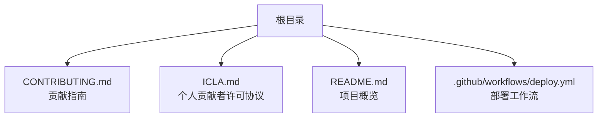
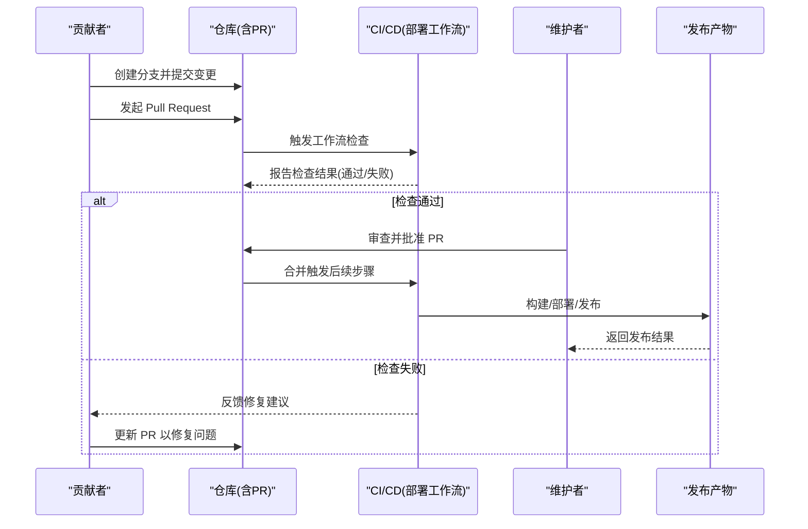
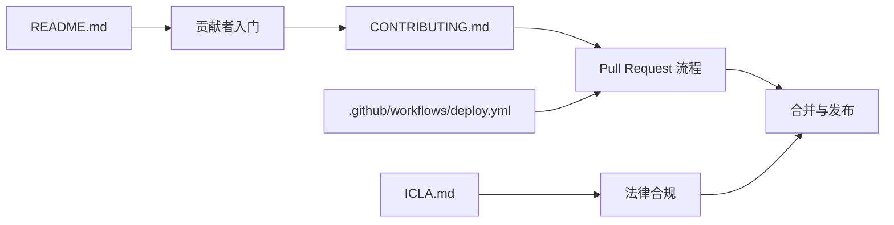

# 许可证与贡献

<cite>
**本文引用的文件**   
- [CONTRIBUTING.md](file://CONTRIBUTING.md)
- [ICLA.md](file://ICLA.md)
- [README.md](file://README.md)
- [deploy.yml](file://.github/workflows/deploy.yml)
</cite>

## 目录
1. [简介](#简介)
2. [项目结构](#项目结构)
3. [核心组件](#核心组件)
4. [架构总览](#架构总览)
5. [详细组件分析](#详细组件分析)
6. [依赖关系分析](#依赖关系分析)
7. [性能考虑](#性能考虑)
8. [故障排查指南](#故障排查指南)
9. [结论](#结论)
10. [附录](#附录)

## 简介
本文件为 AdventureX 项目的“许可证与贡献”指南，面向潜在贡献者与维护者，旨在：
- 明确项目的开源许可证条款与使用限制；
- 提供完整的贡献流程说明（代码提交规范、Pull Request 流程、代码审查标准）；
- 说明开发者身份认证（ICLA）要求与个人贡献者许可协议；
- 给出清晰的参与路径与最佳实践，确保社区贡献的规范性与一致性。

## 项目结构
本项目根目录包含与贡献和许可直接相关的文档与配置：
- CONTRIBUTING.md：贡献指南，定义提交流程、分支策略、PR 规范与审查标准；
- ICLA.md：个人贡献者许可协议，规定贡献者的法律授权与权利让渡；
- README.md：项目概览与使用说明，可作为贡献前的背景阅读材料；
- .github/workflows/deploy.yml：部署工作流，体现自动化构建/发布环节，对 PR 合并后的行为有约束作用。

**图表来源** 
- [CONTRIBUTING.md](file://CONTRIBUTING.md)
- [ICLA.md](file://ICLA.md)
- [README.md](file://README.md)
- [deploy.yml](file://.github/workflows/deploy.yml)

**章节来源**
- [CONTRIBUTING.md](file://CONTRIBUTING.md)
- [ICLA.md](file://ICLA.md)
- [README.md](file://README.md)
- [deploy.yml](file://.github/workflows/deploy.yml)

## 核心组件
本节聚焦与“许可证与贡献”直接相关的关键文档与流程：
- 贡献指南（CONTRIBUTING.md）：涵盖开发环境准备、分支命名、提交信息格式、PR 模板与审查清单；
- 个人贡献者许可协议（ICLA.md）：涵盖版权授予、专利授权、免责声明与合规要求；
- 部署工作流（deploy.yml）：体现 CI/CD 对 PR 的检查与合并后发布的约束条件。

**章节来源**
- [CONTRIBUTING.md](file://CONTRIBUTING.md)
- [ICLA.md](file://ICLA.md)
- [deploy.yml](file://.github/workflows/deploy.yml)

## 架构总览
下图展示从“贡献者发起 PR”到“自动检查与发布”的整体流程，帮助理解贡献过程中的关键节点与约束。

**图表来源** 
- [deploy.yml](file://.github/workflows/deploy.yml)

## 详细组件分析

### 贡献流程与提交规范
- 分支策略与命名约定：建议在功能或修复分支上工作，遵循统一的命名规范，避免在主分支直接修改；
- 提交信息规范：采用清晰、可追溯的提交消息格式，便于生成变更日志与回溯；
- 代码风格与质量：保持前后端一致的编码风格，必要时引入格式化与静态检查工具；
- 测试与验证：在本地完成必要的单元测试与集成测试，确保变更不会破坏既有功能；
- 文档更新：涉及接口、配置或行为的变更需同步更新相关文档。

**章节来源**
- [CONTRIBUTING.md](file://CONTRIBUTING.md)

### Pull Request 流程与审查标准
- PR 描述：清晰说明变更目的、影响范围、测试方法与回滚方案；
- 关联问题：引用相关 Issue 编号，保证可追踪性；
- 审查清单：包括代码可读性、错误处理、安全性、性能与兼容性等维度；
- 持续集成：PR 必须通过所有自动化检查（如构建、测试、安全扫描）；
- 合并策略：由维护者进行最终审批，确保一致性与稳定性。

**章节来源**
- [CONTRIBUTING.md](file://CONTRIBUTING.md)
- [deploy.yml](file://.github/workflows/deploy.yml)

### 开发者身份认证（ICLA）与个人贡献者许可协议
- 签署 ICLA：贡献者在首次提交前需完成个人贡献者许可协议的签署，确认版权归属与授权条款；
- 授权范围：通常包括版权与专利的许可、免责声明与合规承诺；
- 组织贡献：若代表公司贡献，需另行签署企业贡献者许可协议（如适用）；
- 合规要求：确保不侵犯第三方知识产权，遵守相关法律法规。

**章节来源**
- [ICLA.md](file://ICLA.md)

### 最佳实践与参与路径
- 新手入门：先阅读 README 了解项目目标与基本用法；
- 选择任务：从标注为“好上手”的 Issue 开始，逐步熟悉代码库；
- 小步快跑：将大变更拆分为多个小 PR，降低审查成本；
- 主动沟通：在讨论区积极交流，及时响应审查意见；
- 持续改进：关注代码质量与安全，积极参与文档与测试建设。

**章节来源**
- [README.md](file://README.md)
- [CONTRIBUTING.md](file://CONTRIBUTING.md)

## 依赖关系分析
贡献与许可相关的关键依赖如下：
- 贡献指南（CONTRIBUTING.md）与部署工作流（deploy.yml）共同约束 PR 的质量与合并条件；
- 个人贡献者许可协议（ICLA.md）是代码入库的法律前提；
- README.md 提供项目背景，辅助贡献者快速定位问题与理解需求。

**图表来源** 
- [CONTRIBUTING.md](file://CONTRIBUTING.md)
- [deploy.yml](file://.github/workflows/deploy.yml)
- [ICLA.md](file://ICLA.md)
- [README.md](file://README.md)

**章节来源**
- [CONTRIBUTING.md](file://CONTRIBUTING.md)
- [deploy.yml](file://.github/workflows/deploy.yml)
- [ICLA.md](file://ICLA.md)
- [README.md](file://README.md)

## 性能考虑
- 提交粒度：小而频繁的提交有助于快速定位问题与减少冲突；
- 自动化检查：利用 CI 尽早发现性能回归与资源占用异常；
- 基准测试：对关键路径增加基准测试，确保优化有效且不引入退化；
- 缓存与复用：在构建与测试阶段合理使用缓存，缩短反馈周期。

[本节为通用指导，无需特定文件引用]

## 故障排查指南
- PR 检查失败：根据 CI 输出定位失败原因（构建、测试、安全扫描），逐项修复；
- 审查意见未解决：逐条回复并补充证据或调整实现，直至通过；
- 合并冲突：拉取最新主分支，解决冲突后再推送；
- 许可问题：确认 ICLA 已签署且无第三方代码侵权风险；
- 发布异常：查看部署工作流日志，核对环境变量与权限配置。

**章节来源**
- [deploy.yml](file://.github/workflows/deploy.yml)
- [CONTRIBUTING.md](file://CONTRIBUTING.md)
- [ICLA.md](file://ICLA.md)

## 结论
通过明确的许可证条款与贡献流程，AdventureX 能够保障代码的合法使用与高质量演进。贡献者应遵循提交规范与 PR 审查标准，完成 ICLA 签署，并在 CI/CD 的约束下稳步推进变更。维护者则需严格把关质量与合规，确保社区协作顺畅与项目稳定发展。

[本节为总结性内容，无需特定文件引用]

## 附录
- 术语表：
  - ICLA：个人贡献者许可协议（Individual Contributor License Agreement）；
  - PR：Pull Request，用于提交变更请求的代码评审流程；
  - CI/CD：持续集成/持续交付，自动化构建、测试与发布流水线。
- 参考链接：
  - 贡献指南：[CONTRIBUTING.md](file://CONTRIBUTING.md)
  - 个人贡献者许可协议：[ICLA.md](file://ICLA.md)
  - 项目概览：[README.md](file://README.md)
  - 部署工作流：[deploy.yml](file://.github/workflows/deploy.yml)

[本节为附录信息，无需特定文件引用]