# 项目介绍

<cite>
**本文引用的文件**
- [README.md](file://README.md)
- [CONTRIBUTING.md](file://CONTRIBUTING.md)
- [ICLA.md](file://ICLA.md)
- [RELAY.md](file://RELAY.md)
- [backend/main.py](file://backend/main.py)
- [backend/config.py](file://backend/config.py)
- [backend/database.py](file://backend/database.py)
- [backend/models.py](file://backend/models.py)
- [backend/schemas.py](file://backend/schemas.py)
- [backend/security.py](file://backend/security.py)
- [backend/routers/asr.py](file://backend/routers/asr.py)
- [backend/routers/context.py](file://backend/routers/context.py)
- [backend/routers/export.py](file://backend/routers/export.py)
- [backend/routers/merge.py](file://backend/routers/merge.py)
- [backend/routers/mood.py](file://backend/routers/mood.py)
- [backend/routers/process.py](file://backend/routers/process.py)
- [backend/routers/query.py](file://backend/routers/query.py)
- [backend/routers/records.py](file://backend/routers/records.py)
- [backend/routers/sync.py](file://backend/routers/sync.py)
- [backend/routers/tasks.py](file://backend/routers/tasks.py)
- [backend/routers/timeline.py](file://backend/routers/timeline.py)
- [backend/routers/user.py](file://backend/routers/user.py)
- [backend/services/fuzzy_match.py](file://backend/services/fuzzy_match.py)
- [backend/services/processor.py](file://backend/services/processor.py)
- [frontend/src/main.ts](file://frontend/src/main.ts)
- [frontend/src/App.vue](file://frontend/src/App.vue)
- [frontend/src/router/index.ts](file://frontend/src/router/index.ts)
- [frontend/src/api/client.ts](file://frontend/src/api/client.ts)
- [frontend/src/views/HomeView.vue](file://frontend/src/views/HomeView.vue)
- [frontend/src/views/DashboardView.vue](file://frontend/src/views/DashboardView.vue)
- [frontend/src/views/TimelineView.vue](file://frontend/src/views/TimelineView.vue)
- [frontend/src/views/QueryView.vue](file://frontend/src/views/QueryView.vue)
- [frontend/src/views/TasksView.vue](file://frontend/src/views/TasksView.vue)
- [frontend/src/components/VoiceRecordButton.vue](file://frontend/src/components/VoiceRecordButton.vue)
- [frontend/src/components/RecordInput.vue](file://frontend/src/components/RecordInput.vue)
- [frontend/src/components/MoodCard.vue](file://frontend/src/components/MoodCard.vue)
- [frontend/src/components/ExportDialog.vue](file://frontend/src/components/ExportDialog.vue)
- [frontend/src/components/QueryChat.vue](file://frontend/src/components/QueryChat.vue)
- [frontend/src/components/TimelineCard.vue](file://frontend/src/components/TimelineCard.vue)
- [frontend/src/components/TaskCard.vue](file://frontend/src/components/TaskCard.vue)
- [frontend/src/components/StatCard.vue](file://frontend/src/components/StatCard.vue)
- [frontend/src/components/ContextBanner.vue](file://frontend/src/components/ContextBanner.vue)
- [frontend/src/components/InstallHint.vue](file://frontend/src/components/InstallHint.vue)
- [frontend/src/components/TooltipIcon.vue](file://frontend/src/components/TooltipIcon.vue)
- [frontend/src/i18n/index.ts](file://frontend/src/i18n/index.ts)
- [frontend/src/i18n/locales/zh-CN.ts](file://frontend/src/i18n/locales/zh-CN.ts)
- [frontend/src/i18n/locales/en.ts](file://frontend/src/i18n/locales/en.ts)
- [frontend/src/utils/date.ts](file://frontend/src/utils/date.ts)
- [frontend/src/install.ts](file://frontend/src/install.ts)
- [frontend/src/sync.ts](file://frontend/src/sync.ts)
- [frontend/src/user.ts](file://frontend/src/user.ts)
- [data/relay-asr-ws-patch.js](file://data/relay-asr-ws-patch.js)
</cite>

## 目录
1. [简介](#简介)
2. [项目结构](#项目结构)
3. [核心组件](#核心组件)
4. [架构总览](#架构总览)
5. [详细组件分析](#详细组件分析)
6. [依赖关系分析](#依赖关系分析)
7. [性能考量](#性能考量)
8. [故障排查指南](#故障排查指南)
9. [结论](#结论)
10. [附录](#附录)

## 简介
AdventureX 是一个以 AI 为核心的冒险游戏记录系统，致力于帮助用户高效地记录、整理与回顾自己的游戏经历。它通过语音识别、情感分析与智能查询等能力，将碎片化的游戏体验转化为结构化、可检索、可分享的个人叙事资产。

- 核心价值：让每一次冒险都被记住、被理解、被复用。
- 目标用户：
  - 游戏玩家：快速记录通关流程、关键决策与高光时刻。
  - 内容创作者：沉淀素材、生成时间线与故事大纲，提升创作效率。
  - 故事叙述者：基于对话与上下文构建连贯的叙事脉络。
- 愿景：成为每位玩家的“第二大脑”，把体验变成可传承的故事。
- 使命：用 AI 降低记录门槛，用数据提升回忆质量，用工具放大表达价值。
- 主要特色功能概览：
  - 语音录入与转写：支持实时或离线语音输入，自动转写为文本。
  - 情感分析：对记录内容进行情绪倾向分析，辅助复盘与创作。
  - 智能查询：自然语言提问，跨记录检索与摘要回答。
  - 时间线视图：按时间轴组织事件，清晰呈现剧情推进。
  - 任务与上下文管理：拆分目标、维护背景信息，提升记录条理性。
  - 导出与同步：多格式导出、跨设备同步，保障数据安全与便捷使用。

[本节不直接分析具体文件]

## 项目结构
项目采用前后端分离架构：
- 后端（FastAPI）：提供 REST API，涵盖 ASR、处理、查询、时间线、任务、导出、同步、用户与安全等模块。
- 前端（Vue 3 + TypeScript）：提供交互界面，包含首页、仪表盘、时间线、查询、任务等页面及丰富的业务组件。
- 数据层：数据库模型与配置、安全策略、服务层（模糊匹配、处理器）。
- 其他：部署脚本、工作流、国际化资源、WebSocket 补丁等。

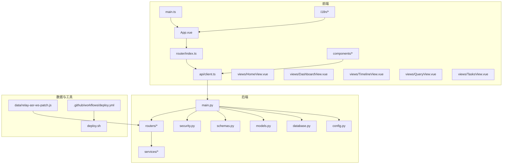

**图表来源**
- [backend/main.py](file://backend/main.py)
- [frontend/src/main.ts](file://frontend/src/main.ts)
- [frontend/src/App.vue](file://frontend/src/App.vue)
- [frontend/src/router/index.ts](file://frontend/src/router/index.ts)
- [frontend/src/api/client.ts](file://frontend/src/api/client.ts)
- [data/relay-asr-ws-patch.js](file://data/relay-asr-ws-patch.js)

**章节来源**
- [README.md](file://README.md)
- [backend/main.py](file://backend/main.py)
- [frontend/src/main.ts](file://frontend/src/main.ts)

## 核心组件
- 后端 API 路由层：
  - ASR（语音识别）、上下文管理、导出、合并、情感分析、数据处理、智能查询、记录管理、同步、任务、时间线、用户与安全。
- 服务层：
  - 模糊匹配与通用处理器，支撑查询与数据处理。
- 数据与安全：
  - 数据库连接、模型定义、请求响应模式、鉴权与权限控制。
- 前端页面与组件：
  - 首页、仪表盘、时间线、查询、任务五大页面；语音录制、记录输入、情感卡片、导出对话框、查询聊天、时间线卡片、任务卡片、统计卡片、上下文横幅、安装提示、工具提示图标等组件。
- 国际化与工具：
  - 中英文本地化、日期工具、PWA 安装、数据同步、用户状态管理。

**章节来源**
- [backend/routers/asr.py](file://backend/routers/asr.py)
- [backend/routers/context.py](file://backend/routers/context.py)
- [backend/routers/export.py](file://backend/routers/export.py)
- [backend/routers/merge.py](file://backend/routers/merge.py)
- [backend/routers/mood.py](file://backend/routers/mood.py)
- [backend/routers/process.py](file://backend/routers/process.py)
- [backend/routers/query.py](file://backend/routers/query.py)
- [backend/routers/records.py](file://backend/routers/records.py)
- [backend/routers/sync.py](file://backend/routers/sync.py)
- [backend/routers/tasks.py](file://backend/routers/tasks.py)
- [backend/routers/timeline.py](file://backend/routers/timeline.py)
- [backend/routers/user.py](file://backend/routers/user.py)
- [backend/services/fuzzy_match.py](file://backend/services/fuzzy_match.py)
- [backend/services/processor.py](file://backend/services/processor.py)
- [backend/database.py](file://backend/database.py)
- [backend/models.py](file://backend/models.py)
- [backend/schemas.py](file://backend/schemas.py)
- [backend/security.py](file://backend/security.py)
- [frontend/src/views/HomeView.vue](file://frontend/src/views/HomeView.vue)
- [frontend/src/views/DashboardView.vue](file://frontend/src/views/DashboardView.vue)
- [frontend/src/views/TimelineView.vue](file://frontend/src/views/TimelineView.vue)
- [frontend/src/views/QueryView.vue](file://frontend/src/views/QueryView.vue)
- [frontend/src/views/TasksView.vue](file://frontend/src/views/TasksView.vue)
- [frontend/src/components/VoiceRecordButton.vue](file://frontend/src/components/VoiceRecordButton.vue)
- [frontend/src/components/RecordInput.vue](file://frontend/src/components/RecordInput.vue)
- [frontend/src/components/MoodCard.vue](file://frontend/src/components/MoodCard.vue)
- [frontend/src/components/ExportDialog.vue](file://frontend/src/components/ExportDialog.vue)
- [frontend/src/components/QueryChat.vue](file://frontend/src/components/QueryChat.vue)
- [frontend/src/components/TimelineCard.vue](file://frontend/src/components/TimelineCard.vue)
- [frontend/src/components/TaskCard.vue](file://frontend/src/components/TaskCard.vue)
- [frontend/src/components/StatCard.vue](file://frontend/src/components/StatCard.vue)
- [frontend/src/components/ContextBanner.vue](file://frontend/src/components/ContextBanner.vue)
- [frontend/src/components/InstallHint.vue](file://frontend/src/components/InstallHint.vue)
- [frontend/src/components/TooltipIcon.vue](file://frontend/src/components/TooltipIcon.vue)
- [frontend/src/i18n/index.ts](file://frontend/src/i18n/index.ts)
- [frontend/src/i18n/locales/zh-CN.ts](file://frontend/src/i18n/locales/zh-CN.ts)
- [frontend/src/i18n/locales/en.ts](file://frontend/src/i18n/locales/en.ts)
- [frontend/src/utils/date.ts](file://frontend/src/utils/date.ts)
- [frontend/src/install.ts](file://frontend/src/install.ts)
- [frontend/src/sync.ts](file://frontend/src/sync.ts)
- [frontend/src/user.ts](file://frontend/src/user.ts)

## 架构总览
系统采用典型的前后端分离架构：
- 前端通过 HTTP/WebSocket 调用后端 API，完成语音转写、数据处理、查询、时间线展示、任务管理与导出等功能。
- 后端以 FastAPI 为核心，统一入口 main.py 挂载各路由，结合数据库、模型、模式与安全模块提供服务。
- 服务层封装通用逻辑（如模糊匹配与处理器），提高复用性与可维护性。
- 数据持久化由数据库驱动，配合模型与模式定义确保数据结构一致性与校验。

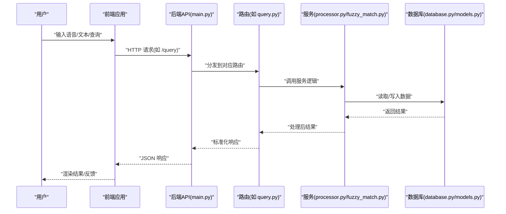

**图表来源**
- [backend/main.py](file://backend/main.py)
- [backend/routers/query.py](file://backend/routers/query.py)
- [backend/services/processor.py](file://backend/services/processor.py)
- [backend/services/fuzzy_match.py](file://backend/services/fuzzy_match.py)
- [backend/database.py](file://backend/database.py)
- [backend/models.py](file://backend/models.py)

**章节来源**
- [backend/main.py](file://backend/main.py)
- [frontend/src/api/client.ts](file://frontend/src/api/client.ts)

## 详细组件分析

### 语音识别（ASR）组件
- 功能概述：接收音频流或文件，进行语音转写，并返回文本与元数据。
- 前端交互：VoiceRecordButton 组件负责录音与上传；RecordInput 提供文本输入补充。
- 后端实现：asr.py 路由处理音频上传与转写流程，可能通过 WebSocket 或 HTTP 接口与外部服务交互。
- 数据流：前端采集音频 → 上传至后端 → 转写为文本 → 返回结果 → 前端展示与编辑。

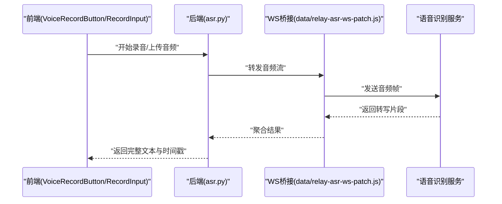

**图表来源**
- [backend/routers/asr.py](file://backend/routers/asr.py)
- [data/relay-asr-ws-patch.js](file://data/relay-asr-ws-patch.js)
- [frontend/src/components/VoiceRecordButton.vue](file://frontend/src/components/VoiceRecordButton.vue)
- [frontend/src/components/RecordInput.vue](file://frontend/src/components/RecordInput.vue)

**章节来源**
- [backend/routers/asr.py](file://backend/routers/asr.py)
- [data/relay-asr-ws-patch.js](file://data/relay-asr-ws-patch.js)
- [frontend/src/components/VoiceRecordButton.vue](file://frontend/src/components/VoiceRecordButton.vue)
- [frontend/src/components/RecordInput.vue](file://frontend/src/components/RecordInput.vue)

### 情感分析（Mood）组件
- 功能概述：对记录文本进行情感倾向分析，输出情绪标签与置信度，辅助复盘与创作。
- 前端交互：MoodCard 组件展示情感结果，支持切换与详情查看。
- 后端实现：mood.py 路由调用情感分析逻辑，可能结合 NLP 模型或服务。

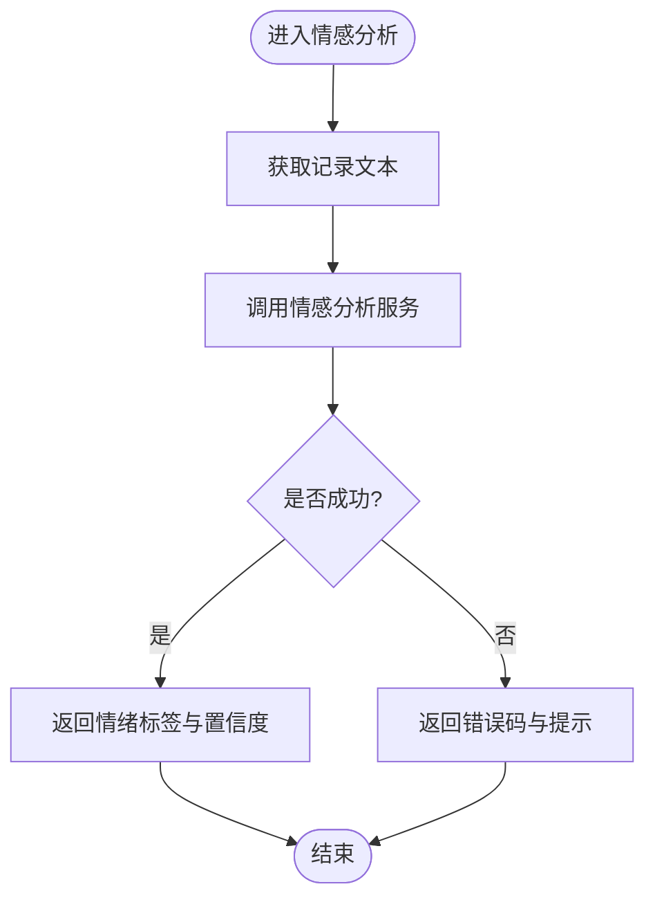

**图表来源**
- [backend/routers/mood.py](file://backend/routers/mood.py)
- [frontend/src/components/MoodCard.vue](file://frontend/src/components/MoodCard.vue)

**章节来源**
- [backend/routers/mood.py](file://backend/routers/mood.py)
- [frontend/src/components/MoodCard.vue](file://frontend/src/components/MoodCard.vue)

### 智能查询（Query）组件
- 功能概述：支持自然语言提问，跨记录检索与摘要回答，提升信息获取效率。
- 前端交互：QueryChat 组件提供对话式查询界面。
- 后端实现：query.py 路由结合 fuzzy_match.py 与 processor.py 进行语义匹配与结果聚合。

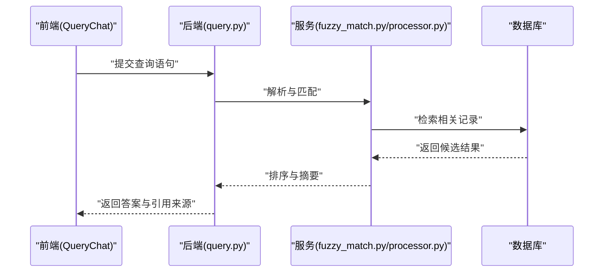

**图表来源**
- [backend/routers/query.py](file://backend/routers/query.py)
- [backend/services/fuzzy_match.py](file://backend/services/fuzzy_match.py)
- [backend/services/processor.py](file://backend/services/processor.py)
- [frontend/src/components/QueryChat.vue](file://frontend/src/components/QueryChat.vue)

**章节来源**
- [backend/routers/query.py](file://backend/routers/query.py)
- [backend/services/fuzzy_match.py](file://backend/services/fuzzy_match.py)
- [backend/services/processor.py](file://backend/services/processor.py)
- [frontend/src/components/QueryChat.vue](file://frontend/src/components/QueryChat.vue)

### 时间线（Timeline）组件
- 功能概述：按时间顺序组织事件，展示剧情推进与关键节点。
- 前端交互：TimelineView 与 TimelineCard 组件渲染时间线条目。
- 后端实现：timeline.py 路由提供时间线数据的查询与过滤。

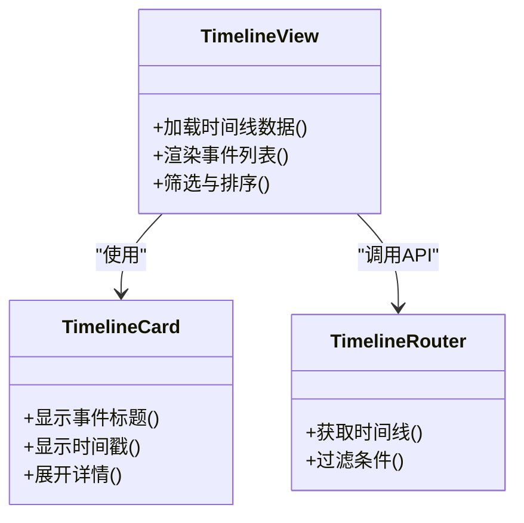

**图表来源**
- [backend/routers/timeline.py](file://backend/routers/timeline.py)
- [frontend/src/views/TimelineView.vue](file://frontend/src/views/TimelineView.vue)
- [frontend/src/components/TimelineCard.vue](file://frontend/src/components/TimelineCard.vue)

**章节来源**
- [backend/routers/timeline.py](file://backend/routers/timeline.py)
- [frontend/src/views/TimelineView.vue](file://frontend/src/views/TimelineView.vue)
- [frontend/src/components/TimelineCard.vue](file://frontend/src/components/TimelineCard.vue)

### 任务（Tasks）组件
- 功能概述：管理游戏目标与待办事项，支持创建、更新与完成状态跟踪。
- 前端交互：TasksView 与 TaskCard 组件提供任务列表与操作。
- 后端实现：tasks.py 路由提供任务的 CRUD 与状态管理。

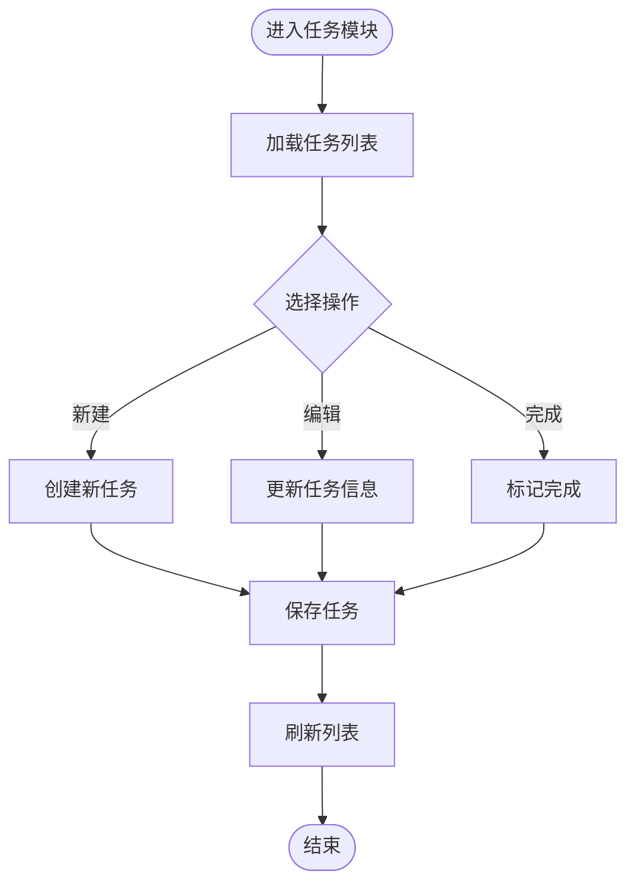

**图表来源**
- [backend/routers/tasks.py](file://backend/routers/tasks.py)
- [frontend/src/views/TasksView.vue](file://frontend/src/views/TasksView.vue)
- [frontend/src/components/TaskCard.vue](file://frontend/src/components/TaskCard.vue)

**章节来源**
- [backend/routers/tasks.py](file://backend/routers/tasks.py)
- [frontend/src/views/TasksView.vue](file://frontend/src/views/TasksView.vue)
- [frontend/src/components/TaskCard.vue](file://frontend/src/components/TaskCard.vue)

### 导出（Export）组件
- 功能概述：将记录、时间线、任务等数据导出为多种格式，便于分享与归档。
- 前端交互：ExportDialog 组件提供导出选项与进度反馈。
- 后端实现：export.py 路由负责数据序列化与文件生成。

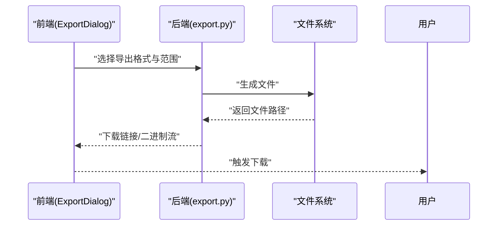

**图表来源**
- [backend/routers/export.py](file://backend/routers/export.py)
- [frontend/src/components/ExportDialog.vue](file://frontend/src/components/ExportDialog.vue)

**章节来源**
- [backend/routers/export.py](file://backend/routers/export.py)
- [frontend/src/components/ExportDialog.vue](file://frontend/src/components/ExportDialog.vue)

### 上下文（Context）与合并（Merge）组件
- 功能概述：维护记录之间的上下文关联，支持内容合并与去重，提升信息整合效率。
- 前端交互：ContextBanner 展示当前上下文提示。
- 后端实现：context.py 与 merge.py 路由提供上下文管理与合并逻辑。

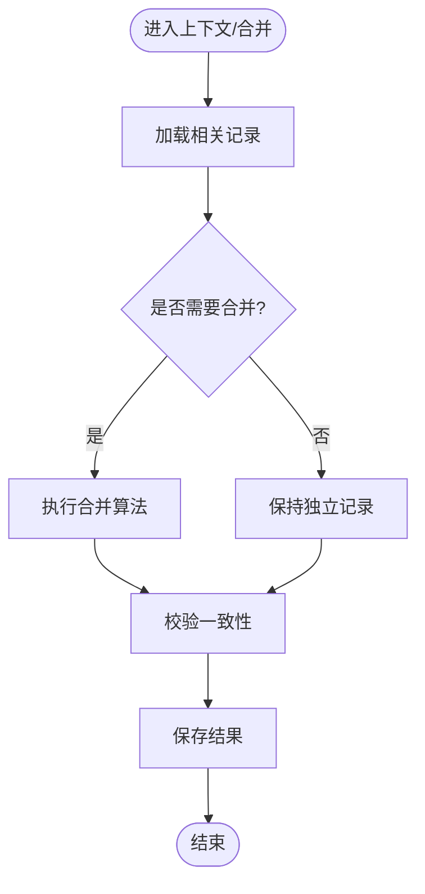

**图表来源**
- [backend/routers/context.py](file://backend/routers/context.py)
- [backend/routers/merge.py](file://backend/routers/merge.py)
- [frontend/src/components/ContextBanner.vue](file://frontend/src/components/ContextBanner.vue)

**章节来源**
- [backend/routers/context.py](file://backend/routers/context.py)
- [backend/routers/merge.py](file://backend/routers/merge.py)
- [frontend/src/components/ContextBanner.vue](file://frontend/src/components/ContextBanner.vue)

### 用户与安全（User & Security）组件
- 功能概述：管理用户身份、权限与访问控制，保障数据安全与隐私。
- 前端交互：user.ts 管理用户状态与登录态。
- 后端实现：user.py 路由与 security.py 模块提供鉴权、授权与加密策略。

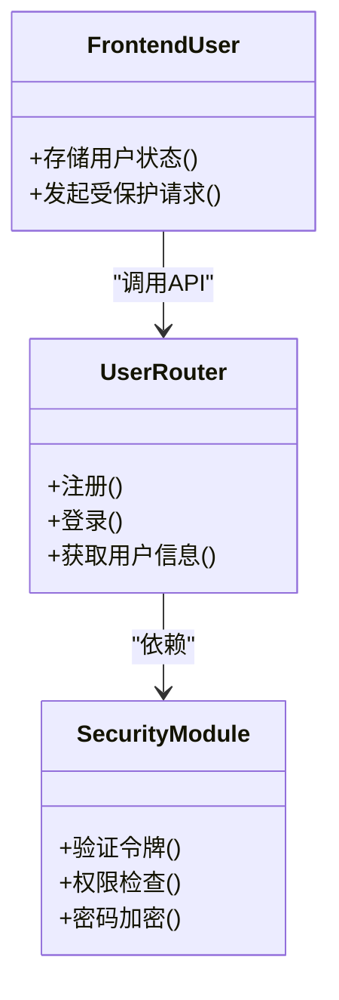

**图表来源**
- [backend/routers/user.py](file://backend/routers/user.py)
- [backend/security.py](file://backend/security.py)
- [frontend/src/user.ts](file://frontend/src/user.ts)

**章节来源**
- [backend/routers/user.py](file://backend/routers/user.py)
- [backend/security.py](file://backend/security.py)
- [frontend/src/user.ts](file://frontend/src/user.ts)

### 数据处理（Process）与同步（Sync）组件
- 功能概述：对记录进行清洗、格式化与增强；支持跨设备数据同步与冲突解决。
- 前端交互：sync.ts 管理同步状态与重试机制。
- 后端实现：process.py 与 sync.py 路由提供数据处理与同步逻辑。

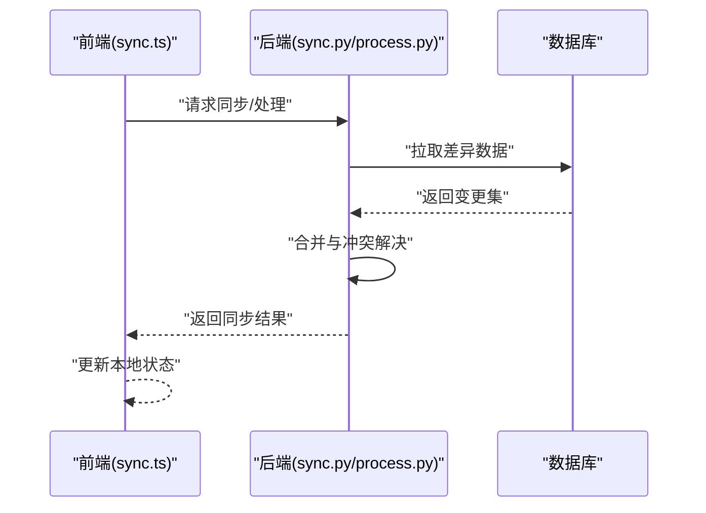

**图表来源**
- [backend/routers/sync.py](file://backend/routers/sync.py)
- [backend/routers/process.py](file://backend/routers/process.py)
- [frontend/src/sync.ts](file://frontend/src/sync.ts)

**章节来源**
- [backend/routers/sync.py](file://backend/routers/sync.py)
- [backend/routers/process.py](file://backend/routers/process.py)
- [frontend/src/sync.ts](file://frontend/src/sync.ts)

## 依赖关系分析
- 前端依赖：
  - Vue 3 生态（路由、组件、状态管理）、TypeScript、国际化库、HTTP 客户端。
- 后端依赖：
  - FastAPI、数据库 ORM/驱动、安全库（JWT/加密）、NLP/ASR 服务（可选）。
- 工具与部署：
  - GitHub Actions 工作流、部署脚本、WebSocket 补丁用于 ASR 流式传输。

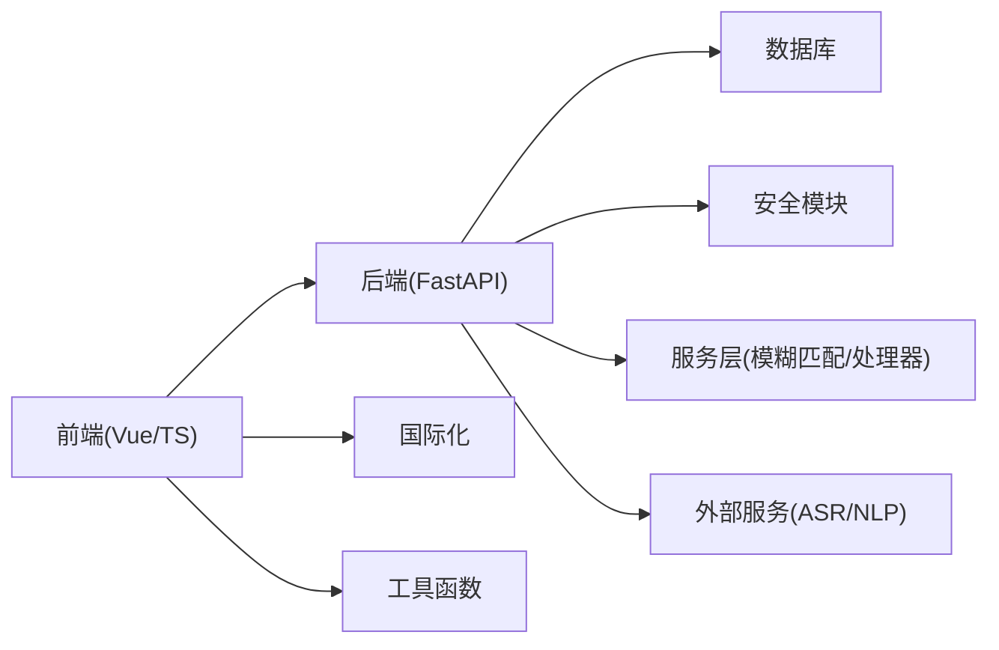

**图表来源**
- [frontend/src/main.ts](file://frontend/src/main.ts)
- [frontend/src/router/index.ts](file://frontend/src/router/index.ts)
- [frontend/src/api/client.ts](file://frontend/src/api/client.ts)
- [backend/main.py](file://backend/main.py)
- [backend/security.py](file://backend/security.py)
- [backend/services/fuzzy_match.py](file://backend/services/fuzzy_match.py)
- [backend/services/processor.py](file://backend/services/processor.py)
- [data/relay-asr-ws-patch.js](file://data/relay-asr-ws-patch.js)

**章节来源**
- [backend/main.py](file://backend/main.py)
- [frontend/src/main.ts](file://frontend/src/main.ts)

## 性能考量
- 异步与并发：后端使用 FastAPI 的异步特性提升高并发处理能力。
- 缓存策略：对频繁查询的结果进行缓存，减少数据库压力。
- 流式处理：ASR 使用 WebSocket 流式传输，降低延迟与内存占用。
- 前端优化：组件懒加载、虚拟滚动、图片与资源压缩。
- 数据同步：增量同步与冲突检测，避免全量传输与覆盖。

[本节不直接分析具体文件]

## 故障排查指南
- 常见问题定位：
  - 语音转写失败：检查音频格式、网络状态与 ASR 服务可用性。
  - 查询无结果：确认索引与关键词匹配，检查模糊匹配阈值。
  - 同步冲突：查看差异日志，手动合并或回滚。
  - 权限错误：验证令牌有效性、用户角色与资源权限。
- 调试建议：
  - 启用详细日志，关注错误堆栈与响应码。
  - 使用浏览器开发者工具与后端日志联合排查。
  - 逐步隔离问题域（前端/后端/外部服务）。

**章节来源**
- [backend/routers/asr.py](file://backend/routers/asr.py)
- [backend/routers/query.py](file://backend/routers/query.py)
- [backend/routers/sync.py](file://backend/routers/sync.py)
- [backend/security.py](file://backend/security.py)

## 结论
AdventureX 通过 AI 技术将游戏经历转化为结构化、可检索、可分享的叙事资产，服务于玩家、创作者与叙述者三大群体。其核心价值在于降低记录门槛、提升回忆质量与表达效率。未来可进一步扩展多模态输入、个性化推荐与协作编辑能力，打造更强大的个人叙事平台。

[本节不直接分析具体文件]

## 附录
- 贡献指南：参考 CONTRIBUTING.md 了解开发流程与规范。
- 许可协议：参考 ICLA.md 了解贡献者许可协议。
- 中继说明：参考 RELAY.md 了解 ASR 中继与 WebSocket 配置。

**章节来源**
- [CONTRIBUTING.md](file://CONTRIBUTING.md)
- [ICLA.md](file://ICLA.md)
- [RELAY.md](file://RELAY.md)