# 项目概览

<cite>
**本文引用的文件**   
- [README.md](file://README.md)
- [CONTRIBUTING.md](file://CONTRIBUTING.md)
- [ICLA.md](file://ICLA.md)
- [RELAY.md](file://RELAY.md)
- [backend/main.py](file://backend/main.py)
- [backend/config.py](file://backend/config.py)
- [backend/database.py](file://backend/database.py)
- [backend/models.py](file://backend/models.py)
- [backend/schemas.py](file://backend/schemas.py)
- [backend/security.py](file://backend/security.py)
- [backend/routers/records.py](file://backend/routers/records.py)
- [backend/routers/timeline.py](file://backend/routers/timeline.py)
- [backend/routers/mood.py](file://backend/routers/mood.py)
- [backend/routers/query.py](file://backend/routers/query.py)
- [backend/routers/asr.py](file://backend/routers/asr.py)
- [backend/routers/context.py](file://backend/routers/context.py)
- [backend/routers/export.py](file://backend/routers/export.py)
- [backend/routers/merge.py](file://backend/routers/merge.py)
- [backend/routers/process.py](file://backend/routers/process.py)
- [backend/routers/sync.py](file://backend/routers/sync.py)
- [backend/routers/tasks.py](file://backend/routers/tasks.py)
- [backend/routers/user.py](file://backend/routers/user.py)
- [backend/services/fuzzy_match.py](file://backend/services/fuzzy_match.py)
- [backend/services/processor.py](file://backend/services/processor.py)
- [frontend/package.json](file://frontend/package.json)
- [frontend/vite.config.ts](file://frontend/vite.config.ts)
- [frontend/src/main.ts](file://frontend/src/main.ts)
- [frontend/src/router/index.ts](file://frontend/src/router/index.ts)
- [frontend/src/api/client.ts](file://frontend/src/api/client.ts)
- [frontend/src/views/DashboardView.vue](file://frontend/src/views/DashboardView.vue)
- [frontend/src/views/TimelineView.vue](file://frontend/src/views/TimelineView.vue)
- [frontend/src/views/QueryView.vue](file://frontend/src/views/QueryView.vue)
- [frontend/src/components/VoiceRecordButton.vue](file://frontend/src/components/VoiceRecordButton.vue)
- [frontend/src/components/RecordInput.vue](file://frontend/src/components/RecordInput.vue)
- [frontend/src/components/MoodCard.vue](file://frontend/src/components/MoodCard.vue)
- [frontend/src/components/TaskCard.vue](file://frontend/src/components/TaskCard.vue)
- [frontend/src/components/ExportDialog.vue](file://frontend/src/components/ExportDialog.vue)
- [frontend/src/components/ContextBanner.vue](file://frontend/src/components/ContextBanner.vue)
- [frontend/src/components/StatCard.vue](file://frontend/src/components/StatCard.vue)
- [frontend/src/components/TooltipIcon.vue](file://frontend/src/components/TooltipIcon.vue)
- [frontend/src/i18n/index.ts](file://frontend/src/i18n/index.ts)
- [frontend/src/i18n/locales/zh-CN.ts](file://frontend/src/i18n/locales/zh-CN.ts)
- [frontend/src/i18n/locales/en.ts](file://frontend/src/i18n/locales/en.ts)
- [frontend/src/utils/date.ts](file://frontend/src/utils/date.ts)
- [frontend/src/install.ts](file://frontend/src/install.ts)
- [frontend/src/sync.ts](file://frontend/src/sync.ts)
- [frontend/src/user.ts](file://frontend/src/user.ts)
- [data/relay-asr-ws-patch.js](file://data/relay-asr-ws-patch.js)
</cite>

## 目录
1. [简介](#简介)
2. [项目结构](#项目结构)
3. [核心组件](#核心组件)
4. [架构总览](#架构总览)
5. [详细组件分析](#详细组件分析)
6. [依赖关系分析](#依赖关系分析)
7. [性能考量](#性能考量)
8. [故障排查指南](#故障排查指南)
9. [结论](#结论)
10. [附录](#附录)

## 简介
AdventureX 是一个基于 Vue 3 与 FastAPI 的 AI 驱动冒险游戏记录系统。它面向“冒险”主题的记录与回顾，提供语音识别、情感分析、时间线管理与智能查询等能力，帮助用户以自然的方式记录日常或游戏中的关键事件，并通过可视化与检索功能进行复盘与分析。

- 前端：Vue 3 + TypeScript，使用 Vite 构建，模块化路由与组件化视图，支持国际化与 PWA 安装提示。
- 后端：FastAPI 提供 RESTful API，结合 SQLite 作为轻量级数据库，内置安全与配置管理。
- AI 能力：语音识别（ASR）、模糊匹配与文本处理服务，支撑智能查询与上下文增强。
- 数据流：前端通过 API Client 调用后端接口，后端将结构化数据持久化到 SQLite，并提供导出、合并、同步等扩展能力。

本概览文档旨在为初学者提供清晰的理解路径，同时为有经验的开发者提供足够的技术深度与可操作建议。

## 项目结构
项目采用前后端分离的组织方式，根目录下包含后端、前端、数据补丁与部署脚本等。

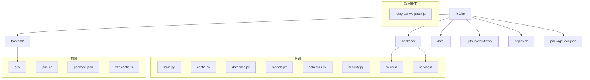

**图表来源**
- [backend/main.py](file://backend/main.py)
- [backend/config.py](file://backend/config.py)
- [backend/database.py](file://backend/database.py)
- [backend/models.py](file://backend/models.py)
- [backend/schemas.py](file://backend/schemas.py)
- [backend/security.py](file://backend/security.py)
- [backend/routers/records.py](file://backend/routers/records.py)
- [backend/routers/timeline.py](file://backend/routers/timeline.py)
- [backend/routers/mood.py](file://backend/routers/mood.py)
- [backend/routers/query.py](file://backend/routers/query.py)
- [backend/routers/asr.py](file://backend/routers/asr.py)
- [backend/routers/context.py](file://backend/routers/context.py)
- [backend/routers/export.py](file://backend/routers/export.py)
- [backend/routers/merge.py](file://backend/routers/merge.py)
- [backend/routers/process.py](file://backend/routers/process.py)
- [backend/routers/sync.py](file://backend/routers/sync.py)
- [backend/routers/tasks.py](file://backend/routers/tasks.py)
- [backend/routers/user.py](file://backend/routers/user.py)
- [backend/services/fuzzy_match.py](file://backend/services/fuzzy_match.py)
- [backend/services/processor.py](file://backend/services/processor.py)
- [frontend/package.json](file://frontend/package.json)
- [frontend/vite.config.ts](file://frontend/vite.config.ts)
- [data/relay-asr-ws-patch.js](file://data/relay-asr-ws-patch.js)

**章节来源**
- [README.md](file://README.md)
- [backend/main.py](file://backend/main.py)
- [frontend/package.json](file://frontend/package.json)
- [frontend/vite.config.ts](file://frontend/vite.config.ts)

## 核心组件
- 后端入口与路由挂载：FastAPI 应用初始化并注册各业务路由模块，统一暴露 REST API。
- 数据模型与模式定义：使用 Pydantic Schema 与 ORM Model 描述记录、时间线、情绪、任务、用户等实体。
- 数据库连接与迁移：SQLite 连接配置与基础表结构维护。
- 安全与配置：环境变量加载、鉴权与安全策略。
- 前端应用壳与路由：Vue 3 应用初始化、路由配置与页面组织。
- API 客户端：封装 HTTP 请求，统一错误处理与拦截器。
- 业务组件：语音录制、记录输入、情绪卡片、任务卡片、导出对话框、上下文横幅、统计卡片等。
- 国际化：中英文语言包与 i18n 初始化。
- 工具函数：日期格式化与常用工具。
- 安装与同步：PWA 安装提示与数据同步逻辑。

**章节来源**
- [backend/main.py](file://backend/main.py)
- [backend/models.py](file://backend/models.py)
- [backend/schemas.py](file://backend/schemas.py)
- [backend/database.py](file://backend/database.py)
- [backend/security.py](file://backend/security.py)
- [frontend/src/main.ts](file://frontend/src/main.ts)
- [frontend/src/router/index.ts](file://frontend/src/router/index.ts)
- [frontend/src/api/client.ts](file://frontend/src/api/client.ts)
- [frontend/src/components/VoiceRecordButton.vue](file://frontend/src/components/VoiceRecordButton.vue)
- [frontend/src/components/RecordInput.vue](file://frontend/src/components/RecordInput.vue)
- [frontend/src/components/MoodCard.vue](file://frontend/src/components/MoodCard.vue)
- [frontend/src/components/TaskCard.vue](file://frontend/src/components/TaskCard.vue)
- [frontend/src/components/ExportDialog.vue](file://frontend/src/components/ExportDialog.vue)
- [frontend/src/components/ContextBanner.vue](file://frontend/src/components/ContextBanner.vue)
- [frontend/src/components/StatCard.vue](file://frontend/src/components/StatCard.vue)
- [frontend/src/components/TooltipIcon.vue](file://frontend/src/components/TooltipIcon.vue)
- [frontend/src/i18n/index.ts](file://frontend/src/i18n/index.ts)
- [frontend/src/i18n/locales/zh-CN.ts](file://frontend/src/i18n/locales/zh-CN.ts)
- [frontend/src/i18n/locales/en.ts](file://frontend/src/i18n/locales/en.ts)
- [frontend/src/utils/date.ts](file://frontend/src/utils/date.ts)
- [frontend/src/install.ts](file://frontend/src/install.ts)
- [frontend/src/sync.ts](file://frontend/src/sync.ts)

## 架构总览
系统采用前后端分离架构，前端通过 API Client 调用后端 REST 接口；后端基于 FastAPI 提供路由层、服务层与数据访问层，并使用 SQLite 存储结构化数据。AI 能力通过 ASR 路由与服务层处理实现，支持语音转文本与后续的情感分析与智能查询。

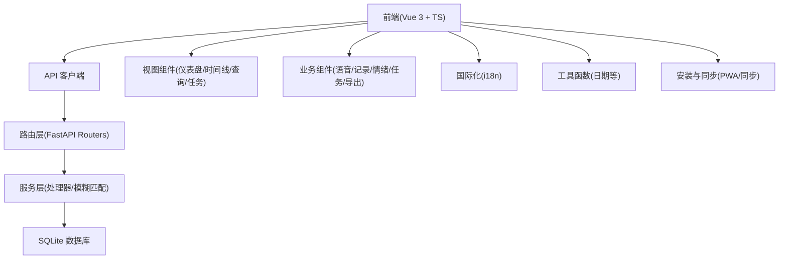

**图表来源**
- [frontend/src/api/client.ts](file://frontend/src/api/client.ts)
- [backend/main.py](file://backend/main.py)
- [backend/routers/records.py](file://backend/routers/records.py)
- [backend/routers/timeline.py](file://backend/routers/timeline.py)
- [backend/routers/mood.py](file://backend/routers/mood.py)
- [backend/routers/query.py](file://backend/routers/query.py)
- [backend/routers/asr.py](file://backend/routers/asr.py)
- [backend/services/processor.py](file://backend/services/processor.py)
- [backend/services/fuzzy_match.py](file://backend/services/fuzzy_match.py)
- [backend/database.py](file://backend/database.py)

## 详细组件分析

### 后端核心：应用启动与路由挂载
- 应用初始化：创建 FastAPI 实例，加载配置、注册中间件与全局异常处理。
- 路由注册：集中挂载 records、timeline、mood、query、asr、context、export、merge、process、sync、tasks、user 等子路由。
- 生命周期：启动时建立数据库连接，关闭时释放资源。

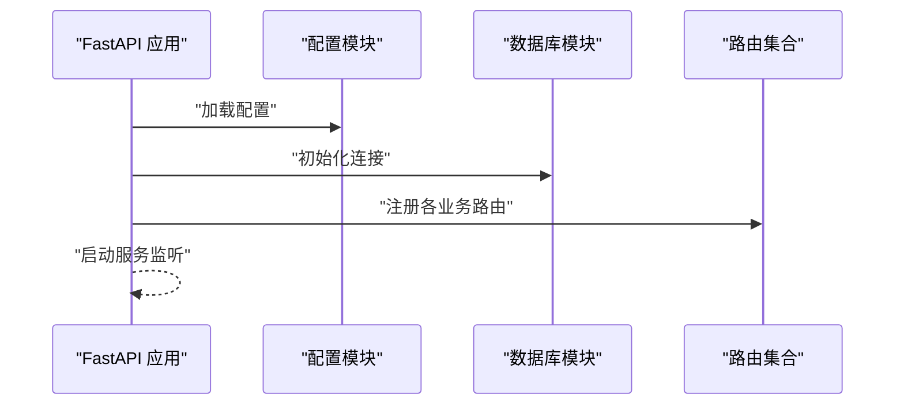

**图表来源**
- [backend/main.py](file://backend/main.py)
- [backend/config.py](file://backend/config.py)
- [backend/database.py](file://backend/database.py)

**章节来源**
- [backend/main.py](file://backend/main.py)
- [backend/config.py](file://backend/config.py)
- [backend/database.py](file://backend/database.py)

### 数据模型与模式：记录、时间线、情绪、任务、用户
- 模型定义：使用 ORM 模型描述实体字段、关系与约束。
- 模式校验：使用 Pydantic Schema 对请求与响应进行严格校验。
- 常见实体：记录（标题、内容、时间戳）、时间线（事件序列）、情绪（评分与标签）、任务（状态与优先级）、用户（身份与权限）。

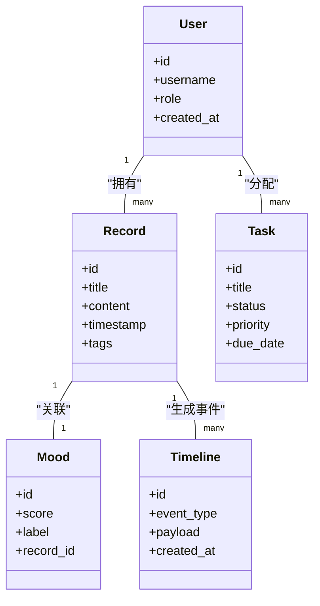

**图表来源**
- [backend/models.py](file://backend/models.py)
- [backend/schemas.py](file://backend/schemas.py)

**章节来源**
- [backend/models.py](file://backend/models.py)
- [backend/schemas.py](file://backend/schemas.py)

### 语音识别（ASR）流程
- 前端触发录音按钮，采集音频流并通过 WebSocket 或 HTTP 上传至后端。
- 后端 ASR 路由接收音频，调用语音识别服务，返回转写文本。
- 可选：对文本进行清洗、分段与上下文增强，便于后续情感分析与查询。

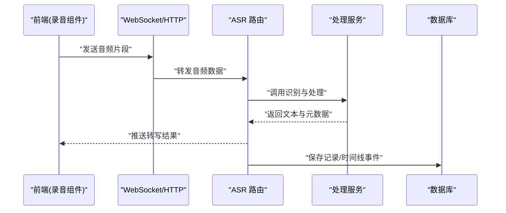

**图表来源**
- [frontend/src/components/VoiceRecordButton.vue](file://frontend/src/components/VoiceRecordButton.vue)
- [backend/routers/asr.py](file://backend/routers/asr.py)
- [backend/services/processor.py](file://backend/services/processor.py)
- [data/relay-asr-ws-patch.js](file://data/relay-asr-ws-patch.js)

**章节来源**
- [backend/routers/asr.py](file://backend/routers/asr.py)
- [backend/services/processor.py](file://backend/services/processor.py)
- [data/relay-asr-ws-patch.js](file://data/relay-asr-ws-patch.js)

### 情感分析（Mood）流程
- 输入：记录文本或语音转写结果。
- 处理：服务层进行情感分类与评分，输出情绪标签与分数。
- 存储：将情绪结果与记录关联，供前端展示与统计。

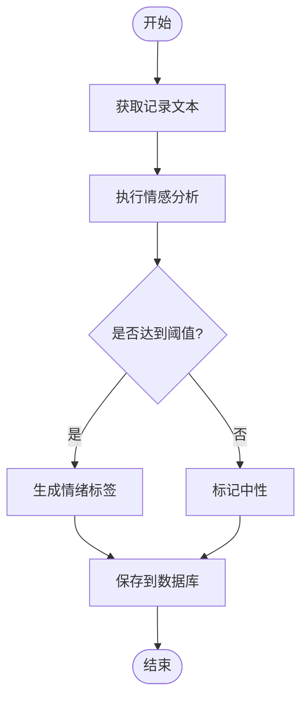

**图表来源**
- [backend/routers/mood.py](file://backend/routers/mood.py)
- [backend/services/processor.py](file://backend/services/processor.py)

**章节来源**
- [backend/routers/mood.py](file://backend/routers/mood.py)
- [backend/services/processor.py](file://backend/services/processor.py)

### 时间线（Timeline）管理
- 事件生成：根据记录、情绪、任务变更等生成时间线事件。
- 查询与过滤：按时间范围、类型、标签进行筛选。
- 展示：前端时间线视图渲染事件序列，支持交互与详情查看。

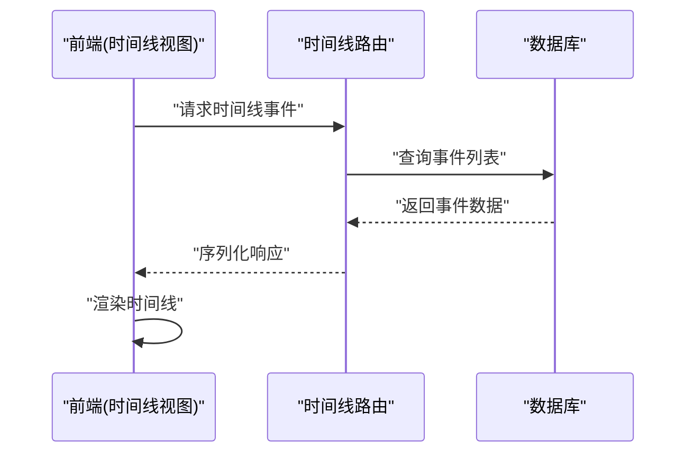

**图表来源**
- [backend/routers/timeline.py](file://backend/routers/timeline.py)
- [frontend/src/views/TimelineView.vue](file://frontend/src/views/TimelineView.vue)

**章节来源**
- [backend/routers/timeline.py](file://backend/routers/timeline.py)
- [frontend/src/views/TimelineView.vue](file://frontend/src/views/TimelineView.vue)

### 智能查询（Query）流程
- 输入：自然语言查询语句。
- 处理：模糊匹配与语义检索，结合上下文增强返回相关记录。
- 输出：结构化结果集，支持分页与高亮。

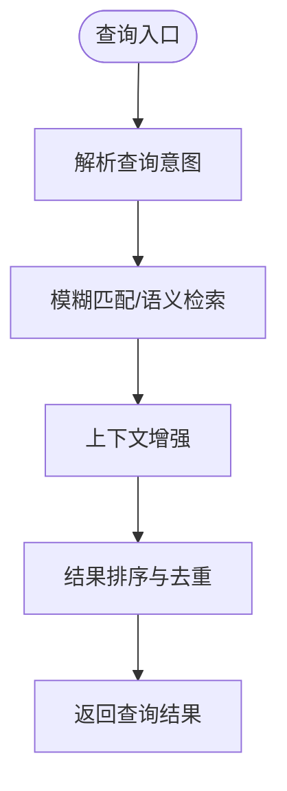

**图表来源**
- [backend/routers/query.py](file://backend/routers/query.py)
- [backend/services/fuzzy_match.py](file://backend/services/fuzzy_match.py)

**章节来源**
- [backend/routers/query.py](file://backend/routers/query.py)
- [backend/services/fuzzy_match.py](file://backend/services/fuzzy_match.py)

### 导出、合并与同步
- 导出：将记录、时间线、情绪等数据导出为常用格式（如 JSON/CSV）。
- 合并：支持多源数据合并与冲突解决。
- 同步：前后端数据同步机制，保障离线与在线一致性。

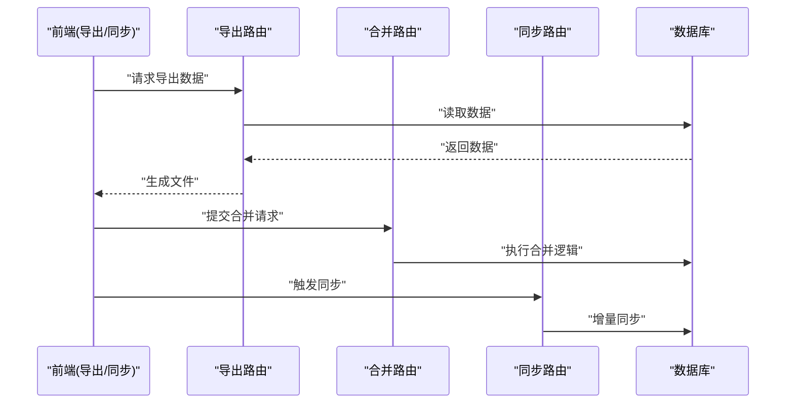

**图表来源**
- [backend/routers/export.py](file://backend/routers/export.py)
- [backend/routers/merge.py](file://backend/routers/merge.py)
- [backend/routers/sync.py](file://backend/routers/sync.py)
- [frontend/src/components/ExportDialog.vue](file://frontend/src/components/ExportDialog.vue)
- [frontend/src/sync.ts](file://frontend/src/sync.ts)

**章节来源**
- [backend/routers/export.py](file://backend/routers/export.py)
- [backend/routers/merge.py](file://backend/routers/merge.py)
- [backend/routers/sync.py](file://backend/routers/sync.py)
- [frontend/src/components/ExportDialog.vue](file://frontend/src/components/ExportDialog.vue)
- [frontend/src/sync.ts](file://frontend/src/sync.ts)

### 前端视图与组件
- 视图：仪表盘、时间线、查询、任务等页面，分别承载不同业务场景。
- 组件：语音录制、记录输入、情绪卡片、任务卡片、导出对话框、上下文横幅、统计卡片、工具提示等。
- 路由：集中管理页面跳转与参数传递。
- API 客户端：统一封装请求、错误处理与重试策略。

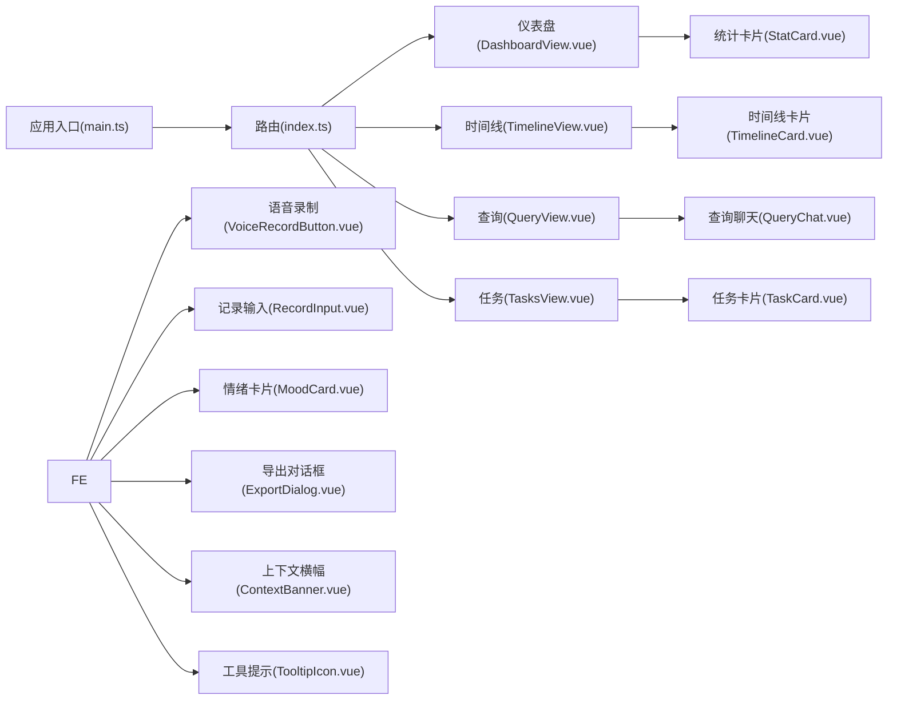

**图表来源**
- [frontend/src/main.ts](file://frontend/src/main.ts)
- [frontend/src/router/index.ts](file://frontend/src/router/index.ts)
- [frontend/src/views/DashboardView.vue](file://frontend/src/views/DashboardView.vue)
- [frontend/src/views/TimelineView.vue](file://frontend/src/views/TimelineView.vue)
- [frontend/src/views/QueryView.vue](file://frontend/src/views/QueryView.vue)
- [frontend/src/components/VoiceRecordButton.vue](file://frontend/src/components/VoiceRecordButton.vue)
- [frontend/src/components/RecordInput.vue](file://frontend/src/components/RecordInput.vue)
- [frontend/src/components/MoodCard.vue](file://frontend/src/components/MoodCard.vue)
- [frontend/src/components/TaskCard.vue](file://frontend/src/components/TaskCard.vue)
- [frontend/src/components/ExportDialog.vue](file://frontend/src/components/ExportDialog.vue)
- [frontend/src/components/ContextBanner.vue](file://frontend/src/components/ContextBanner.vue)
- [frontend/src/components/StatCard.vue](file://frontend/src/components/StatCard.vue)
- [frontend/src/components/TooltipIcon.vue](file://frontend/src/components/TooltipIcon.vue)

**章节来源**
- [frontend/src/main.ts](file://frontend/src/main.ts)
- [frontend/src/router/index.ts](file://frontend/src/router/index.ts)
- [frontend/src/views/DashboardView.vue](file://frontend/src/views/DashboardView.vue)
- [frontend/src/views/TimelineView.vue](file://frontend/src/views/TimelineView.vue)
- [frontend/src/views/QueryView.vue](file://frontend/src/views/QueryView.vue)
- [frontend/src/components/VoiceRecordButton.vue](file://frontend/src/components/VoiceRecordButton.vue)
- [frontend/src/components/RecordInput.vue](file://frontend/src/components/RecordInput.vue)
- [frontend/src/components/MoodCard.vue](file://frontend/src/components/MoodCard.vue)
- [frontend/src/components/TaskCard.vue](file://frontend/src/components/TaskCard.vue)
- [frontend/src/components/ExportDialog.vue](file://frontend/src/components/ExportDialog.vue)
- [frontend/src/components/ContextBanner.vue](file://frontend/src/components/ContextBanner.vue)
- [frontend/src/components/StatCard.vue](file://frontend/src/components/StatCard.vue)
- [frontend/src/components/TooltipIcon.vue](file://frontend/src/components/TooltipIcon.vue)

### 国际化与工具
- 国际化：中英文语言包与 i18n 初始化，支持动态切换。
- 工具：日期格式化、字符串处理等通用方法。

**章节来源**
- [frontend/src/i18n/index.ts](file://frontend/src/i18n/index.ts)
- [frontend/src/i18n/locales/zh-CN.ts](file://frontend/src/i18n/locales/zh-CN.ts)
- [frontend/src/i18n/locales/en.ts](file://frontend/src/i18n/locales/en.ts)
- [frontend/src/utils/date.ts](file://frontend/src/utils/date.ts)

### 安装与同步
- PWA 安装提示：引导用户安装为桌面应用，提升体验。
- 数据同步：本地与远端数据同步，支持增量更新与冲突处理。

**章节来源**
- [frontend/src/install.ts](file://frontend/src/install.ts)
- [frontend/src/sync.ts](file://frontend/src/sync.ts)

## 依赖关系分析
- 前端依赖：Vue 3、TypeScript、Vite、i18n、路由与组件库。
- 后端依赖：FastAPI、Pydantic、ORM（SQLite）、安全与配置模块。
- 外部集成：语音识别服务（可通过 WebSocket/HTTP 接入）、导出与合并工具。

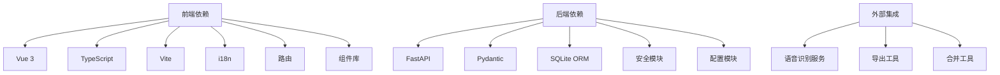

**图表来源**
- [frontend/package.json](file://frontend/package.json)
- [frontend/vite.config.ts](file://frontend/vite.config.ts)
- [backend/requirements.txt](file://backend/requirements.txt)

**章节来源**
- [frontend/package.json](file://frontend/package.json)
- [frontend/vite.config.ts](file://frontend/vite.config.ts)
- [backend/requirements.txt](file://backend/requirements.txt)

## 性能考量
- 前端优化：组件懒加载、路由按需加载、图片与字体资源优化、缓存策略。
- 后端优化：数据库索引设计、查询分页与过滤、异步处理耗时任务、缓存热点数据。
- 网络优化：请求合并与重试、WebSocket 长连接用于实时语音传输。
- 存储优化：SQLite 事务批量写入、定期清理与压缩。

[本节为通用指导，不直接分析具体文件]

## 故障排查指南
- 常见问题：
  - 前端无法连接后端：检查 API 地址、跨域配置与端口映射。
  - 语音识别失败：确认音频格式、网络延迟与 ASR 服务可用性。
  - 数据不同步：检查同步任务状态与冲突解决策略。
  - 导出失败：确认权限与磁盘空间。
- 调试建议：
  - 启用后端日志与请求追踪。
  - 使用浏览器开发者工具检查网络与状态。
  - 验证数据库连接与表结构完整性。

**章节来源**
- [backend/main.py](file://backend/main.py)
- [backend/security.py](file://backend/security.py)
- [backend/database.py](file://backend/database.py)
- [frontend/src/api/client.ts](file://frontend/src/api/client.ts)
- [frontend/src/sync.ts](file://frontend/src/sync.ts)

## 结论
AdventureX 通过 Vue 3 与 FastAPI 的组合，构建了完整的 AI 驱动冒险游戏记录系统。其清晰的架构设计、丰富的功能特性与良好的可扩展性，使其既适合初学者快速上手，也能为经验丰富的开发者提供深入定制的空间。借助语音识别、情感分析、时间线与智能查询等能力，用户可以高效地记录、回顾与分析自己的冒险历程。

[本节为总结性内容，不直接分析具体文件]

## 附录
- 许可证信息：请参见仓库中的许可证文件与贡献者许可协议。
- 贡献指南：遵循贡献文档中的开发流程与代码规范。
- 基本使用场景：
  - 语音记录：通过麦克风录入语音，自动转写并保存为记录。
  - 时间线回顾：按时间顺序浏览事件，支持筛选与详情查看。
  - 情感分析：对记录进行情感评分与标签化，辅助复盘。
  - 智能查询：用自然语言检索相关记录与上下文。
  - 导出与同步：导出数据备份，或在多设备间同步数据。

**章节来源**
- [README.md](file://README.md)
- [CONTRIBUTING.md](file://CONTRIBUTING.md)
- [ICLA.md](file://ICLA.md)
- [RELAY.md](file://RELAY.md)