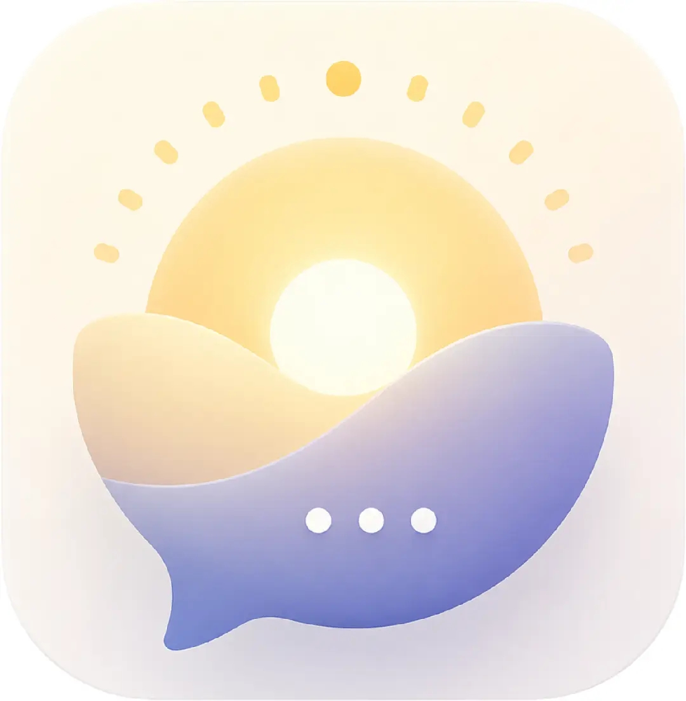

<p align="center">
  
</p>

<h1 align="center">拾光 · Lumen · LMN</h1>

<p align="center">
  <em>拾起碎片的光 —— 把散落的一天，一点点拾回来。</em>
</p>

<h3 align="center">
  <a href="https://advx.guppy.ltd">
    
  </a>
</h3>

<p align="center">
  <sub><strong>无需安装</strong> · <strong>打开即用</strong> · <strong>支持 PWA 添加到主屏</strong></sub>
</p>

<p align="center">
  <a href="LICENSE"></a>
  
  
  
</p>

---

> [!TIP]
> **🌐 在线 Demo：<https://advx.guppy.ltd>** — 一分钟体验完整功能：语音随记、AI 自动整理、多端实时同步。

> **拾光**（shí guāng）= 拾起碎片的光，谐音「时光」。**Lumen** = 拉丁语「光」，也是国际标准光通量单位。

一款把你随手说的、想的、写下的碎片，自动整理成 **「我做了什么？我正在做什么？我要做什么？」** 三条清晰主线的个人助手 — 无论你是需要认知辅助，还是单纯想让生活更有条理。

**给谁用？**

- **抑郁、ADHD、解离、脑雾患者** — 减少「东西又忘了」「一切都糊在一起」的挫败感。
- **学生** — 随手记下作业、考试、知识点，自动归类成待办和已完成，不再遗漏。
- **打工人** — 开会随口说的 action item、Leader 交代的零散任务，语音说完自动变成待办清单。
- **创作者** — 灵感碎片、素材链接、进度备忘，随时扔进去，AI 帮你理出脉络。
- **任何想复盘一天的人** — 睡前花 30 秒语音回顾今天做了什么，第二天打开就是一份清晰的时间线。
- **轻度健忘者** — 想不起来「我刚刚要干嘛来着？」时，看一眼上下文摘要就回到正轨。

前台只是一个安静的输入框。说完就好，不用整理格式。它不催促、不评判、不给建议、也不做诊断，只是把你散落的一天一点点拾回来，让你在纷乱之中把自己看得更清楚一点。

> **核心信念**：不把推测当成事实。产品只提供生活辅助，不承担诊断或医疗决策。

---

## 三条主线

| 问题 | 答案 |
|------|------|
| 我做了什么？（X） | 时间线 — 从碎片记录自动整理出事件 |
| 我正在做什么？（Y） | 当前状态 — AI 生成的上下文摘要 |
| 我要做什么？（Z） | 待办 — 从记录中提取行动事项 |

## 功能

- **自然语言记录** — 想到什么写什么，不需要整理结构。
- **语音随记** — 实时流式 ASR（Qwen3-ASR），带**二次纠错预览**（尾部灰色斜体，会随后续语音自我修正）。录音结束后 LLM 隐式修正同音字。
- **7 类声学情绪识别** — 从语音波形直接识别 `neutral / happy / sad / angry / fearful / disgusted / surprised`，不看文字表面。
- **文字 × 声音双通道情绪融合** — 用户说「没事」但语气疲惫，系统会记下这个偏离。情绪指数由 LLM 融合两者给出，冲突时倾向取更低评分（相信声音多于文字）。
- **AI 自动整理** — 记录立刻落库，LLM 后台整理成事件/任务/上下文，不阻塞你继续记录。
- **模糊去重合并** — Levenshtein 匹配 + LLM 语义双保险，避免同一件事被重复登记。中等相似度会**问用户**要不要合并。
- **同框问答** — 在同一个输入框里，「问一下今晚要做啥」直接切成问答，不用切页面。
- **多语种支持** — 中文 / English 一键切换，语言偏好保存在本地。
- **多用户隔离** — 每个唯一标识独立存储数据。切换 ID 时自动合并数据。不同设备输入相同标识即可共享。
- **实时多端同步** — WebSocket 广播（`/api/ws/sync`），同一 ID 的多个设备数据变更秒级推送刷新；断线自动重连，离线时降级为轮询。
- **PWA 安装** — 支持添加到手机/桌面主屏幕，独立窗口运行，体验接近原生 App。
- **HTTPS 强制** — 生产环境自动启用 TLS + HSTS，HTTP 自动跳转 HTTPS。
- **API 限流** — 滑动窗口算法按用户 + 端点限流。AI 端点 5-20/min，写入 20-30/min，读取 120/min。防 Token 盗刷。
- **SQL 注入防护** — 全局参数化查询 + 动态表名白名单校验。
- **输入校验** — Pydantic 模型校验 + user_id 格式白名单 + 内容长度上限。

## 技术栈

| 层 | 技术 |
|----|------|
| 前端 | Vue 3 + TypeScript + Vite + Tailwind CSS 4 + Font Awesome 7 |
| 后端 | FastAPI + SQLAlchemy (async) + aiosqlite + WebSockets |
| AI | DeepSeek V4 Flash（对话）· Qwen3-ASR Flash Realtime（语音） |
| 部署 | Cloudflare Worker 中继 · Nginx 反向代理 · Systemd 自启 |

## 项目结构

```
adventurex/
├── .github/workflows/
│   └── deploy.yml          # CI/CD：构建 → rsync → nginx + systemd 部署（HTTPS + 国内镜像源）
├── backend/
│   ├── main.py              # FastAPI 入口
│   ├── config.py            # 配置（中继 URL、DB 路径）
│   ├── database.py          # SQLAlchemy 异步引擎 + user_id 迁移 + Header 依赖
│   ├── models.py            # ORM 模型（Record/Event/Task/Context/Mood，均含 user_id）
│   ├── security.py          # 限流中间件 + SQL 注入防护 + 输入校验
│   ├── schemas.py           # Pydantic 请求/响应（含 voice_emotion）
│   ├── services/
│   │   ├── llm.py           # LLM 调用（含情绪 hint 注入的 5 个 prompt）
│   │   ├── processor.py     # 记录 → 事件/任务/上下文管线（按 user_id 隔离）
│   │   └── fuzzy_match.py   # Levenshtein 模糊匹配 + 分级去重
│   └── routers/
│       ├── records.py       # 记录 CRUD + ASR 隐式润色
│       ├── timeline.py      # 时间线事件
│       ├── tasks.py         # 待办
│       ├── context.py       # 当前状态摘要
│       ├── query.py         # 自然语言问答
│       ├── mood.py          # 情绪指数（融合声学 + 语义）
│       ├── process.py       # 手动触发整理
│       ├── merge.py         # 相似任务合并决策
│       ├── user.py          # 用户数据合并（ID 切换时跨 ID 迁移）
│       ├── sync.py          # 实时同步 WebSocket（同 ID 多端广播刷新）
│       └── asr.py           # WebSocket 桥：前端 ↔ Qwen3-ASR 中继
└── frontend/
    └── src/
        ├── api/client.ts         # API 客户端（自动附加 X-User-ID）
        ├── i18n/                 # 多语种（zh-CN / en）
        │   ├── index.ts          # vue-i18n 配置 + 浏览器语言检测
        │   └── locales/          # 翻译文件
        ├── user.ts               # 用户 ID 管理（生成/存储）
        ├── sync.ts               # 实时同步客户端（WS + 轮询降级）
        ├── router/               # Vue Router
        ├── views/                # HomeView / TimelineView / TasksView / QueryView
        └── components/
            ├── RecordInput.vue        # 输入框 + 快捷前缀 + 问答检测
            ├── VoiceRecordButton.vue  # PCM 采集 + WS 传输
            ├── AppLayout.vue          # 顶栏 + 语言切换 + 设置弹窗 + 底栏
            ├── ContextBanner.vue      # 当前状态横幅
            ├── MoodCard.vue           # 情绪指数卡片
            ├── TimelineCard.vue / TaskCard.vue / StatCard.vue / QueryChat.vue / TooltipIcon.vue
            └── ...
```

## 5 分钟启动

> 想直接体验？访问 **[advx.guppy.ltd](https://advx.guppy.ltd)** 即可，无需部署。以下步骤面向本地开发者。

### 后端

```bash
cd backend
pip install -r requirements.txt
python main.py
# 服务运行在 http://localhost:8000
```

### 前端

```bash
cd frontend
npm install
npm run dev
# 开发服务器运行在 http://localhost:5173
# WebSocket 和 API 请求自动代理到后端
```

### 配置（`backend/config.py`）

```python
RELAY_BASE_URL   = "https://advx.fzxufuyu.eu.org/v1"
RELAY_API_KEY    = "sk-relay"                                              # 任意非空串
ASR_RELAY_WS_URL = "wss://advx.fzxufuyu.eu.org/v1/realtime/asr/stream"     # 无需鉴权
```

## 设计原则

1. **不把推测当成事实** — 无法确认时明确说明。AI 推断的事件/任务标注"系统推测"。
2. **声音比文字更接近真实状态** — 情绪融合冲突时相信声音（用户可能在文字上强撑）。
3. **重要结论可追溯** — 每条事件/任务链接回原始记录。
4. **用户可控** — 确认、修改、删除、合并、拆分。你不是 AI 操控的傀儡。
5. **数据可携带** — SQLite 本地存储，多用户通过唯一标识隔离。中继无鉴权、匿名代管。
6. **不提供医疗建议** — 涉及心理健康话题自动附加免责声明。

## 中继约束

Chat 和 ASR 都通过 `advx.fzxufuyu.eu.org` 中继转发（无需 key，内部代管）：

| 项目 | 约束 |
|------|------|
| Chat 模型 | 锁定 `deepseek-v4-flash`（任何请求参数都会被静默重写） |
| `max_tokens` | ≤ 3000（超出被截断） |
| 思考模式 | 强制关闭（响应无 `reasoning_content` 字段） |
| ASR 端点 | `wss://.../v1/realtime/asr/stream` — OpenAI-Realtime 协议 |
| ASR 模型 | `qwen3-asr-flash-realtime` |
| ASR 事件 | `text`（累计+纠错） / `stash`（尾部预览） / `emotion`（7 类） / `usage` |
| 音频格式 | PCM s16le / 16kHz / mono / base64（**不支持 webm**） |

## 相关文档

- [CONTRIBUTING.md](CONTRIBUTING.md) — 贡献流程
- [ICLA.md](ICLA.md) — 个人贡献者协议
- [RELAY.md](RELAY.md) — 中继协议与调试记录
- [LICENSE](LICENSE) — GNU AGPLv3 完整协议文本
- [deploy.sh](deploy.sh) · [.github/workflows/deploy.yml](.github/workflows/deploy.yml) — 一键部署 / CI 流水线

## 许可协议（双许可模式）

本项目采用双许可模式，使用者可二选一：

### 方案 1：GNU AGPLv3 开源许可（免费）

只要遵守 GNU Affero General Public License v3.0 协议条款，
您可以免费使用、修改、分发本项目。
若修改代码并通过网络对外提供服务，必须向终端用户公开完整源代码。
完整协议文本见仓库内 [LICENSE](LICENSE) 文件。

### 方案 2：商业专有授权（付费）

如果您希望将本项目集成至闭源商业产品，
并且不想履行 AGPLv3 的开源义务，
需要向版权持有人购买商业授权。

商业授权洽谈联系方式：
邮箱：xufuyu@outlook.com

---

版权所有 © 2026 xufuyu
